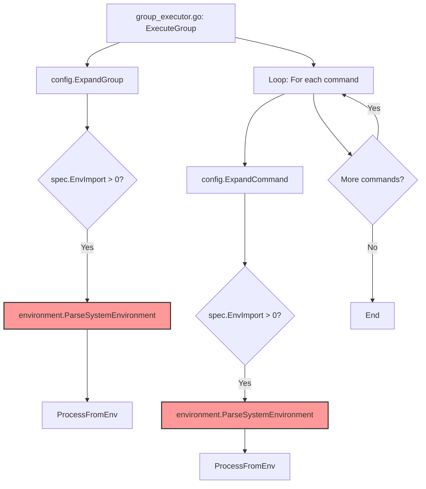
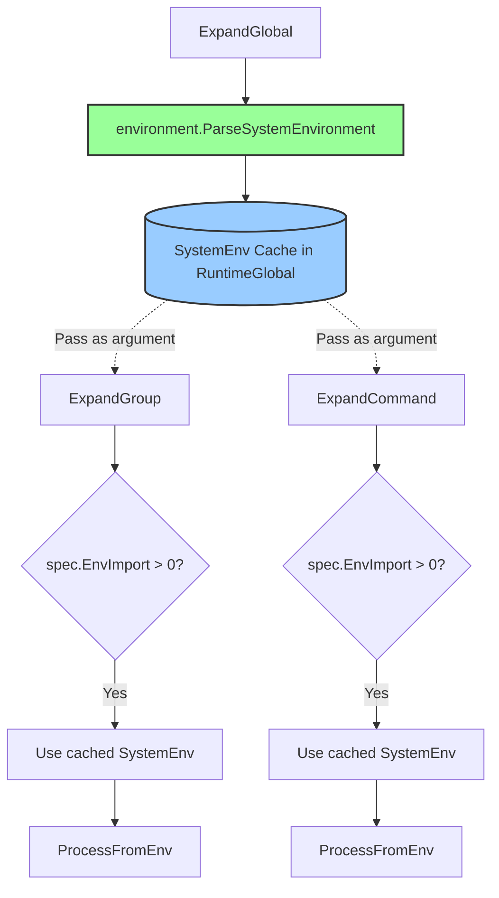

# システム環境変数解析の最適化

## 概要

現在の実装では、`config.ExpandCommand`がループ内で呼び出されるたびに`environment.NewFilter(globalAllowlist).ParseSystemEnvironment()`が実行されます。これにより、以下の問題が発生しています:

1. **パフォーマンスの問題**: グループ内のコマンド数が多い場合、`os.Environ()`の解析が繰り返し実行される
2. **コードの明確性の問題**: `NewFilter(globalAllowlist)`が呼び出されているが、`ParseSystemEnvironment`はフィルターの状態を使用していない

## 問題の詳細

### 現在の呼び出しフロー



### 問題箇所

**expansion.go (ExpandGroup内):**
```go
// Line 444
systemEnv := environment.NewFilter(globalAllowlist).ParseSystemEnvironment()
```

**expansion.go (ExpandCommand内):**
```go
// Line 537
systemEnv := environment.NewFilter(globalAllowlist).ParseSystemEnvironment()
```

**影響範囲:**
- グループに10個のコマンドがあり、それぞれが`env_import`を使用している場合、`os.Environ()`が11回解析される(ExpandGroup 1回 + ExpandCommand 10回)
- 各`os.Environ()`呼び出しは環境変数の数に応じて処理時間が増加する

## 解決策

### 設計方針

1. **システム環境変数の一元管理**: `RuntimeGlobal`にシステム環境変数のキャッシュを保持
2. **解析の一回化**: `ExpandGlobal`でシステム環境変数を一度だけ解析
3. **明示的な引数渡し**: `ExpandGroup`と`ExpandCommand`にキャッシュされたシステム環境変数を引数として渡す

### 新しいアーキテクチャ



### 実装の詳細

#### 1. RuntimeGlobalの拡張

`RuntimeGlobal`にシステム環境変数のキャッシュを追加:

```go
type RuntimeGlobal struct {
    Spec         *GlobalSpec
    ExpandedVars map[string]string
    ExpandedEnv  map[string]string
    SystemEnv    map[string]string  // 新規追加: キャッシュされたシステム環境変数
    ExpandedVerifyFiles []string
}
```

#### 2. ExpandGlobalの修正

システム環境変数を一度だけ解析し、`RuntimeGlobal`に保存:

```go
func ExpandGlobal(spec *runnertypes.GlobalSpec) (*runnertypes.RuntimeGlobal, error) {
    runtime := &runnertypes.RuntimeGlobal{
        Spec:         spec,
        ExpandedVars: make(map[string]string),
        ExpandedEnv:  make(map[string]string),
    }

    // システム環境変数を一度だけ解析
    runtime.SystemEnv = environment.NewFilter(spec.EnvAllowed).ParseSystemEnvironment()

    // 1. Process FromEnv (既存の実装)
    fromEnvVars, err := ProcessFromEnv(spec.EnvImport, spec.EnvAllowed, runtime.SystemEnv, "global")
    // ... 残りの処理
}
```

#### 3. ExpandGroupのシグネチャ変更

現在:
```go
func ExpandGroup(spec *runnertypes.GroupSpec, globalRuntime *runnertypes.RuntimeGlobal) (*runnertypes.RuntimeGroup, error)
```

変更後:
```go
func ExpandGroup(spec *runnertypes.GroupSpec, globalRuntime *runnertypes.RuntimeGlobal) (*runnertypes.RuntimeGroup, error)
```

実装:
```go
func ExpandGroup(spec *runnertypes.GroupSpec, globalRuntime *runnertypes.RuntimeGlobal) (*runnertypes.RuntimeGroup, error) {
    // ...

    if len(spec.EnvImport) > 0 {
        var globalAllowlist []string
        var systemEnv map[string]string

        if globalRuntime != nil {
            globalAllowlist = globalRuntime.EnvAllowlist()
            systemEnv = globalRuntime.SystemEnv  // キャッシュされた環境変数を使用
        }

        effectiveAllowlist := determineEffectiveEnvAllowlist(spec.EnvAllowed, globalAllowlist)

        fromEnvVars, err := ProcessFromEnv(spec.EnvImport, effectiveAllowlist, systemEnv, fmt.Sprintf("group[%s]", spec.Name))
        // ...
    }
}
```

#### 4. ExpandCommandのシグネチャ変更

現在:
```go
func ExpandCommand(spec *runnertypes.CommandSpec, runtimeGroup *runnertypes.RuntimeGroup, globalRuntime *runnertypes.RuntimeGlobal, globalTimeout common.Timeout) (*runnertypes.RuntimeCommand, error)
```

変更後:
```go
func ExpandCommand(spec *runnertypes.CommandSpec, runtimeGroup *runnertypes.RuntimeGroup, globalRuntime *runnertypes.RuntimeGlobal, globalTimeout common.Timeout) (*runnertypes.RuntimeCommand, error)
```

実装:
```go
func ExpandCommand(spec *runnertypes.CommandSpec, runtimeGroup *runnertypes.RuntimeGroup, globalRuntime *runnertypes.RuntimeGlobal, globalTimeout common.Timeout) (*runnertypes.RuntimeCommand, error) {
    // ...

    if len(spec.EnvImport) > 0 {
        var globalAllowlist []string
        var systemEnv map[string]string

        if globalRuntime != nil {
            globalAllowlist = globalRuntime.EnvAllowlist()
            systemEnv = globalRuntime.SystemEnv  // キャッシュされた環境変数を使用
        }

        var groupAllowlist []string
        if runtimeGroup != nil && runtimeGroup.Spec != nil {
            groupAllowlist = runtimeGroup.Spec.EnvAllowed
        }

        effectiveAllowlist := determineEffectiveEnvAllowlist(groupAllowlist, globalAllowlist)

        fromEnvVars, err := ProcessFromEnv(spec.EnvImport, effectiveAllowlist, systemEnv, fmt.Sprintf("command[%s]", spec.Name))
        // ...
    }
}
```

## 期待される効果

### パフォーマンス改善

- **Before**: グループに10個のコマンドがある場合、`os.Environ()`が最大11回解析される
- **After**: `os.Environ()`は1回のみ解析される(ExpandGlobal内)

### コードの明確性向上

1. **責任の明確化**: `ExpandGlobal`がシステム環境変数の解析を担当することが明確
2. **不要な呼び出しの除去**: `environment.NewFilter(globalAllowlist).ParseSystemEnvironment()`の重複呼び出しが除去
3. **データフローの明確化**: システム環境変数が`RuntimeGlobal`経由で渡されることが明確

## テスト戦略

### 1. 単体テスト

既存のテストが引き続きパスすることを確認:
- `config/expansion_test.go`
- `config/allowlist_validation_test.go`
- `runner/group_executor_test.go`

### 2. ベンチマークテスト

パフォーマンス改善を測定:

```go
func BenchmarkExpandCommandWithSystemEnv(b *testing.B) {
    // Before: 各ExpandCommand呼び出しでParseSystemEnvironment
    // After: 事前に解析されたSystemEnvを使用
}
```

### 3. 統合テスト

実際のコマンド実行でenv_importが正しく動作することを確認:
- `cmd/runner/integration_envpriority_test.go`

## 互換性

### API変更

この変更は内部実装の最適化であり、外部APIには影響しません:
- `ExpandGlobal`のシグネチャは変更なし
- `ExpandGroup`のシグネチャは変更なし
- `ExpandCommand`のシグネチャは変更なし

### 動作の変更

システム環境変数の解析タイミングが変更されますが、機能的な動作は同一です:
- **Before**: 各ExpandGroup/ExpandCommandで解析
- **After**: ExpandGlobalで一度だけ解析

**注意**: 実行中にシステム環境変数が変更された場合の動作が変わる可能性がありますが、これは想定されていないユースケースです。

## 実装の順序

1. `RuntimeGlobal`に`SystemEnv`フィールドを追加
2. `ExpandGlobal`を修正してシステム環境変数をキャッシュ
3. `ExpandGroup`を修正してキャッシュされたシステム環境変数を使用
4. `ExpandCommand`を修正してキャッシュされたシステム環境変数を使用
5. テストの追加・更新
6. ベンチマークテストの追加
7. 既存テストの実行と検証

## 補足

### なぜNewFilterにallowlistを渡すのか?

現在の実装では、`environment.NewFilter(globalAllowlist).ParseSystemEnvironment()`という呼び出しが使われていますが、`ParseSystemEnvironment`はフィルターの状態を使用しません。これは誤解を招く実装です。

今回の修正では:
1. `ExpandGlobal`で`environment.NewFilter(spec.EnvAllowed).ParseSystemEnvironment()`を呼び出し
2. 結果を`RuntimeGlobal.SystemEnv`に保存
3. `ExpandGroup`と`ExpandCommand`では、既に解析された`RuntimeGlobal.SystemEnv`を使用

これにより、`NewFilter`の呼び出しが`ExpandGlobal`内の1回のみとなり、コードの意図がより明確になります。
