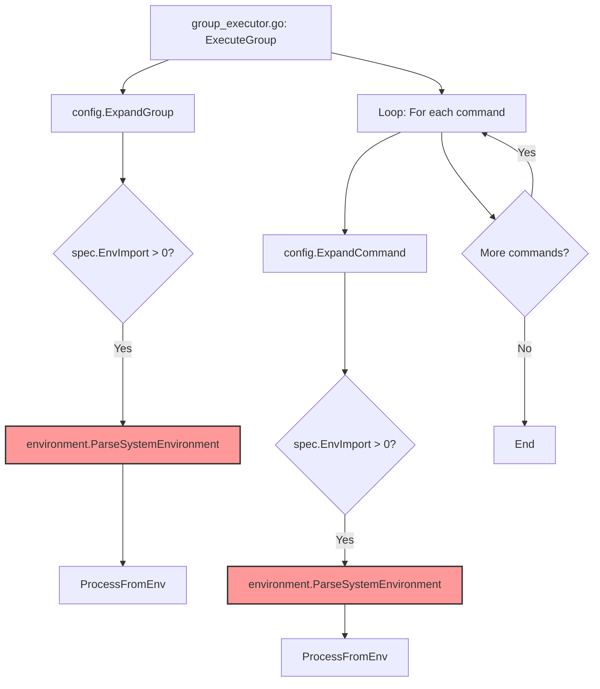
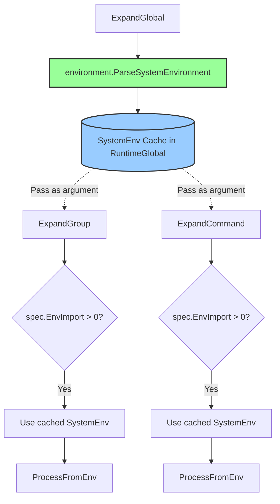

# System Environment Variable Parsing Optimization

## Overview

The current implementation parses the system environment by calling `environment.NewFilter(globalAllowlist).ParseSystemEnvironment()` every time `config.ExpandCommand` is invoked within a loop. This leads to the following issues:

1. **Performance Issue**: When a group contains many commands, `os.Environ()` is parsed repeatedly
2. **Code Clarity Issue**: `NewFilter(globalAllowlist)` is called, but `ParseSystemEnvironment` doesn't use the filter's state

## Problem Details

### Current Call Flow



### Problem Locations

**expansion.go (in ExpandGroup):**
```go
// Line 444
systemEnv := environment.NewFilter(globalAllowlist).ParseSystemEnvironment()
```

**expansion.go (in ExpandCommand):**
```go
// Line 537
systemEnv := environment.NewFilter(globalAllowlist).ParseSystemEnvironment()
```

**Impact:**
- If a group has 10 commands each using `env_import`, `os.Environ()` is parsed 11 times (ExpandGroup 1 time + ExpandCommand 10 times)
- Each `os.Environ()` call's processing time increases with the number of environment variables

## Solution

### Design Principles

1. **Centralized Management of System Environment Variables**: Store system environment variable cache in `RuntimeGlobal`
2. **Parse Once**: Parse system environment variables only once in `ExpandGlobal`
3. **Explicit Argument Passing**: Pass cached system environment variables to `ExpandGroup` and `ExpandCommand` as arguments

### New Architecture



### Implementation Details

#### 1. RuntimeGlobal Extension

Add system environment variable cache to `RuntimeGlobal`:

```go
type RuntimeGlobal struct {
    Spec         *GlobalSpec
    ExpandedVars map[string]string
    ExpandedEnv  map[string]string
    SystemEnv    map[string]string  // New: Cached system environment variables
    ExpandedVerifyFiles []string
}
```

#### 2. ExpandGlobal Modification

Parse system environment variables once and store in `RuntimeGlobal`:

```go
func ExpandGlobal(spec *runnertypes.GlobalSpec) (*runnertypes.RuntimeGlobal, error) {
    runtime := &runnertypes.RuntimeGlobal{
        Spec:         spec,
        ExpandedVars: make(map[string]string),
        ExpandedEnv:  make(map[string]string),
    }

    // Parse system environment once and cache
    runtime.SystemEnv = environment.NewFilter(spec.EnvAllowed).ParseSystemEnvironment()

    // 1. Process FromEnv (existing implementation)
    fromEnvVars, err := ProcessFromEnv(spec.EnvImport, spec.EnvAllowed, runtime.SystemEnv, "global")
    // ... rest of processing
}
```

#### 3. ExpandGroup Signature Change

Current:
```go
func ExpandGroup(spec *runnertypes.GroupSpec, globalRuntime *runnertypes.RuntimeGlobal) (*runnertypes.RuntimeGroup, error)
```

After:
```go
func ExpandGroup(spec *runnertypes.GroupSpec, globalRuntime *runnertypes.RuntimeGlobal) (*runnertypes.RuntimeGroup, error)
```

Implementation:
```go
func ExpandGroup(spec *runnertypes.GroupSpec, globalRuntime *runnertypes.RuntimeGlobal) (*runnertypes.RuntimeGroup, error) {
    // ...

    if len(spec.EnvImport) > 0 {
        var globalAllowlist []string
        var systemEnv map[string]string

        if globalRuntime != nil {
            globalAllowlist = globalRuntime.EnvAllowlist()
            systemEnv = globalRuntime.SystemEnv  // Use cached environment variables
        }

        effectiveAllowlist := determineEffectiveEnvAllowlist(spec.EnvAllowed, globalAllowlist)

        fromEnvVars, err := ProcessFromEnv(spec.EnvImport, effectiveAllowlist, systemEnv, fmt.Sprintf("group[%s]", spec.Name))
        // ...
    }
}
```

#### 4. ExpandCommand Signature Change

Current:
```go
func ExpandCommand(spec *runnertypes.CommandSpec, runtimeGroup *runnertypes.RuntimeGroup, globalRuntime *runnertypes.RuntimeGlobal, globalTimeout common.Timeout) (*runnertypes.RuntimeCommand, error)
```

After:
```go
func ExpandCommand(spec *runnertypes.CommandSpec, runtimeGroup *runnertypes.RuntimeGroup, globalRuntime *runnertypes.RuntimeGlobal, globalTimeout common.Timeout) (*runnertypes.RuntimeCommand, error)
```

Implementation:
```go
func ExpandCommand(spec *runnertypes.CommandSpec, runtimeGroup *runnertypes.RuntimeGroup, globalRuntime *runnertypes.RuntimeGlobal, globalTimeout common.Timeout) (*runnertypes.RuntimeCommand, error) {
    // ...

    if len(spec.EnvImport) > 0 {
        var globalAllowlist []string
        var systemEnv map[string]string

        if globalRuntime != nil {
            globalAllowlist = globalRuntime.EnvAllowlist()
            systemEnv = globalRuntime.SystemEnv  // Use cached environment variables
        }

        var groupAllowlist []string
        if runtimeGroup != nil && runtimeGroup.Spec != nil {
            groupAllowlist = runtimeGroup.Spec.EnvAllowed
        }

        effectiveAllowlist := determineEffectiveEnvAllowlist(groupAllowlist, globalAllowlist)

        fromEnvVars, err := ProcessFromEnv(spec.EnvImport, effectiveAllowlist, systemEnv, fmt.Sprintf("command[%s]", spec.Name))
        // ...
    }
}
```

## Expected Benefits

### Performance Improvement

- **Before**: If a group has 10 commands, `os.Environ()` is parsed up to 11 times
- **After**: `os.Environ()` is parsed only once (in ExpandGlobal)

### Code Clarity Improvement

1. **Clear Responsibilities**: It's clear that `ExpandGlobal` is responsible for parsing system environment variables
2. **Removed Redundant Calls**: Duplicate calls to `environment.NewFilter(globalAllowlist).ParseSystemEnvironment()` are eliminated
3. **Clear Data Flow**: It's clear that system environment variables are passed via `RuntimeGlobal`

## Test Strategy

### 1. Unit Tests

Verify that existing tests continue to pass:
- `config/expansion_test.go`
- `config/allowlist_validation_test.go`
- `runner/group_executor_test.go`

### 2. Benchmark Tests

Measure performance improvement:

```go
func BenchmarkExpandCommandWithSystemEnv(b *testing.B) {
    // Before: ParseSystemEnvironment on each ExpandCommand call
    // After: Use pre-parsed SystemEnv
}
```

### 3. Integration Tests

Verify env_import works correctly in actual command execution:
- `cmd/runner/integration_envpriority_test.go`

## Compatibility

### API Changes

This change is an internal implementation optimization and does not affect external APIs:
- `ExpandGlobal` signature unchanged
- `ExpandGroup` signature unchanged
- `ExpandCommand` signature unchanged

### Behavior Changes

The timing of system environment variable parsing changes, but functional behavior remains identical:
- **Before**: Parsed in each ExpandGroup/ExpandCommand
- **After**: Parsed once in ExpandGlobal

**Note**: If system environment variables change during execution, behavior may differ, but this is not an expected use case.

## Implementation Order

1. Add `SystemEnv` field to `RuntimeGlobal`
2. Modify `ExpandGlobal` to cache system environment variables
3. Modify `ExpandGroup` to use cached system environment variables
4. Modify `ExpandCommand` to use cached system environment variables
5. Add/update tests
6. Add benchmark tests
7. Run existing tests and verify

## Notes

### Why Pass allowlist to NewFilter?

The current implementation uses the call `environment.NewFilter(globalAllowlist).ParseSystemEnvironment()`, but `ParseSystemEnvironment` doesn't use the filter's state. This is a misleading implementation.

With this modification:
1. Call `environment.NewFilter(spec.EnvAllowed).ParseSystemEnvironment()` in `ExpandGlobal`
2. Store result in `RuntimeGlobal.SystemEnv`
3. In `ExpandGroup` and `ExpandCommand`, use the already-parsed `RuntimeGlobal.SystemEnv`

This reduces `NewFilter` calls to only once in `ExpandGlobal`, making the code's intent clearer.
