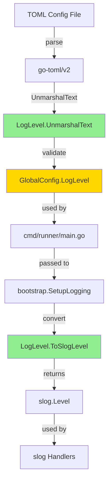

# Task 0036: LogLevel 型の導入 - アーキテクチャ設計

## 1. 概要

LogLevel を専用のカスタム型として定義し、TOML パース時点でバリデーションを行う仕組みを導入する。これにより、設定ファイルのエラーを早期に検出し、型安全性を向上させる。

## 2. 設計原則

### 2.1 早期エラー検出
- TOML パース時点で無効なログレベルを検出
- 実行前に設定エラーをユーザーに通知

### 2.2 型安全性
- 文字列リテラルの代わりに型付き定数を使用
- コンパイル時の型チェックを活用

### 2.3 既存パターンの踏襲
- `RiskLevel` と同様の設計パターンを採用
- 一貫性のある API 設計

### 2.4 最小限の変更
- 既存の TOML 設定形式は変更しない
- 既存の有効な設定ファイルに影響を与えない

## 3. 型設計

### 3.1 LogLevel 型の定義

```go
// LogLevel represents the logging level for the application.
// Valid values: debug, info, warn, error
type LogLevel string

const (
	// LogLevelDebug enables debug-level logging
	LogLevelDebug LogLevel = "debug"

	// LogLevelInfo enables info-level logging (default)
	LogLevelInfo LogLevel = "info"

	// LogLevelWarn enables warning-level logging
	LogLevelWarn LogLevel = "warn"

	// LogLevelError enables error-level logging only
	LogLevelError LogLevel = "error"
)
```

**設計の根拠**:
- 基底型を `string` とすることで、既存の TOML 形式との互換性を保つ
- 定数を定義することで、コード内での型安全な使用を可能にする
- `slog.Level` の文字列表現と一致させる

### 3.2 UnmarshalText の実装

```go
// UnmarshalText implements the encoding.TextUnmarshaler interface.
// This enables validation during TOML parsing.
func (l *LogLevel) UnmarshalText(text []byte) error {
	s := strings.ToLower(string(text))
	switch LogLevel(s) {
	case LogLevelDebug, LogLevelInfo, LogLevelWarn, LogLevelError:
		*l = LogLevel(s)
		return nil
	case "":
		// Empty string defaults to info level
		*l = LogLevelInfo
		return nil
	default:
		return fmt.Errorf("invalid log level %q: must be one of: debug, info, warn, error", string(text))
	}
}
```

**設計の根拠**:
- `encoding.TextUnmarshaler` インターフェースを実装することで、TOML パーサーが自動的にバリデーションを実行
- `strings.ToLower()` で入力を小文字に正規化することで、大文字小文字を区別しない動作を実現
- `slog.Level.UnmarshalText()` の挙動と一貫性を持たせる
- 空文字列を info レベルとして扱うことで、デフォルト動作を明確化
- エラーメッセージに有効な値のリストを含めることで、ユーザビリティを向上
- エラーメッセージには元の入力値（正規化前）を含めることで、ユーザーに分かりやすいフィードバックを提供

### 3.3 slog.Level への変換

```go
// ToSlogLevel converts LogLevel to slog.Level for use with the slog package.
func (l LogLevel) ToSlogLevel() (slog.Level, error) {
	var level slog.Level
	if err := level.UnmarshalText([]byte(l)); err != nil {
		return slog.LevelInfo, fmt.Errorf("failed to convert log level %q to slog.Level: %w", l, err)
	}
	return level, nil
}
```

**設計の根拠**:
- `slog.Level` の `UnmarshalText()` を利用することで、標準ライブラリとの整合性を保つ
- エラー時のデフォルト値として `slog.LevelInfo` を返す
- エラーはラップして詳細な情報を提供

### 3.4 String メソッド

```go
// String returns the string representation of LogLevel.
func (l LogLevel) String() string {
	return string(l)
}
```

**設計の根拠**:
- `fmt.Stringer` インターフェースを実装
- ログ出力やデバッグ時の表示に使用

## 4. コンポーネント設計

### 4.1 影響を受けるコンポーネント



**凡例**:
- 緑: 新規実装
- 黄: 型変更

### 4.2 データフロー

#### 設定読み込み時
```
TOML File → go-toml/v2 → LogLevel.UnmarshalText() → GlobalConfig.LogLevel (LogLevel型)
                                   ↓
                              バリデーション
                                   ↓
                          エラー or 成功
```

#### ロガー初期化時
```
GlobalConfig.LogLevel → LogLevel.ToSlogLevel() → slog.Level → Handler Options
```

#### エラーケース
```
TOML File (log_level = "debg") → UnmarshalText() → エラー返却 → config load 失敗
                                                           ↓
                                                    ユーザーにエラー表示
```

## 5. エラーハンドリング

### 5.1 エラーの種類

| エラー状況 | 検出タイミング | エラーメッセージ例 |
|-----------|---------------|------------------|
| 無効なログレベル | TOML パース時 | `invalid log level "debg": must be one of: debug, info, warn, error` |
| slog.Level 変換失敗 | ロガー初期化時 | `failed to convert log level "unknown" to slog.Level: ...` |

### 5.2 エラーハンドリング戦略

1. **TOML パース時のエラー**:
   - `UnmarshalText()` がエラーを返す
   - `go-toml/v2` がエラーを伝播
   - `config.Load()` が失敗
   - アプリケーションは起動せず、エラーメッセージを表示

2. **slog.Level 変換時のエラー**:
   - `ToSlogLevel()` がエラーを返す
   - `bootstrap.SetupLogging()` が失敗
   - アプリケーションは起動せず、エラーメッセージを表示

## 6. 既存コードへの影響

### 6.1 変更が必要なファイル

| ファイル | 変更内容 | 影響度 |
|---------|---------|--------|
| `internal/runner/runnertypes/config.go` | LogLevel 型定義追加、GlobalConfig.LogLevel の型変更 | 中 |
| `internal/runner/bootstrap/logger.go` | LoggerConfig.Level の型変更、ToSlogLevel() 使用 | 小 |
| `cmd/runner/main.go` | コマンドライン引数の型変換処理追加 | 小 |
| `internal/runner/config/loader.go` | 影響なし (TOML パーサーが自動的に UnmarshalText を呼ぶ) | なし |

### 6.2 テストへの影響

| テストファイル | 変更内容 |
|--------------|---------|
| `internal/runner/runnertypes/config_test.go` | LogLevel 型のテスト追加 |
| `internal/runner/bootstrap/logger_test.go` | LogLevel 型を使用するようテスト更新 |
| 既存の integration tests | 影響なし (TOML 形式は不変) |

## 7. パフォーマンス考察

### 7.1 TOML パース時のオーバーヘッド
- `UnmarshalText()` の呼び出しコスト: O(1) - switch 文による定数時間
- メモリオーバーヘッド: なし (文字列から LogLevel 型へのキャストのみ)
- **結論**: 無視できる程度のオーバーヘッド

### 7.2 ロガー初期化時のオーバーヘッド
- `ToSlogLevel()` の呼び出しコスト: O(1) - `slog.Level.UnmarshalText()` の呼び出し
- 初期化は 1 回のみ実行されるため、影響は無視できる
- **結論**: パフォーマンスへの影響なし

### 7.3 実行時のパフォーマンス
- ログレベルの判定: `slog` パッケージが内部的に処理
- LogLevel 型の導入による影響: なし
- **結論**: 実行時パフォーマンスへの影響なし

## 8. 互換性

### 8.1 後方互換性
- ✅ TOML 設定ファイルの形式は不変
- ✅ 既存の有効な設定値 (debug, info, warn, error) は引き続き動作
- ✅ 空文字列のデフォルト動作 (info レベル) は維持

### 8.2 前方互換性
- ✅ 将来的に新しいログレベルを追加する場合、定数を追加するだけで対応可能
- ✅ `UnmarshalText()` の switch 文に case を追加

## 9. セキュリティ考察

### 9.1 入力バリデーション
- ✅ `UnmarshalText()` で厳密なバリデーションを実施
- ✅ ホワイトリスト方式 (許可された値のみを受け入れる)
- ✅ インジェクション攻撃のリスクなし (列挙型のため)

### 9.2 エラーメッセージ
- ✅ エラーメッセージに機密情報を含まない
- ✅ ユーザーの入力値を含むが、ログレベルは機密情報ではない

## 10. 代替案の検討

### 10.1 代替案 A: 文字列のままバリデーション関数を追加
```go
func ValidateLogLevel(level string) error {
    switch level {
    case "debug", "info", "warn", "error", "":
        return nil
    default:
        return fmt.Errorf("invalid log level: %s", level)
    }
}
```

**評価**:
- ❌ TOML パース後にバリデーションを実行する必要がある
- ❌ 型安全性がない
- ❌ バリデーション漏れのリスク

**結論**: 却下

### 10.2 代替案 B: slog.Level をそのまま使用
```go
type GlobalConfig struct {
    LogLevel slog.Level `toml:"log_level"`
}
```

**評価**:
- ✅ 変換処理が不要
- ❌ `slog.Level` は整数型のため、TOML では数値として扱われる
- ❌ 設定ファイルの可読性が低下 (`log_level = -4` など)
- ❌ 後方互換性がない

**結論**: 却下

### 10.3 採用案: カスタム LogLevel 型 + UnmarshalText
**評価**:
- ✅ 早期エラー検出
- ✅ 型安全性
- ✅ 設定ファイルの可読性維持
- ✅ 後方互換性維持
- ✅ 既存パターン (RiskLevel) との一貫性

**結論**: 採用

## 11. 実装の優先順位

### フェーズ 1: 型定義とバリデーション
1. LogLevel 型と定数の定義
2. UnmarshalText() の実装
3. ToSlogLevel() の実装
4. 単体テストの追加

### フェーズ 2: 既存コードの更新
1. GlobalConfig.LogLevel の型変更
2. bootstrap.LoggerConfig.Level の型変更
3. cmd/runner/main.go のコマンドライン引数処理更新
4. 既存テストの更新

### フェーズ 3: 統合テストと検証
1. 統合テストの実行
2. エラーメッセージの確認
3. ドキュメントの更新

## 12. リスクと対策

| リスク | 影響 | 確率 | 対策 |
|-------|------|------|------|
| 既存テストの破綻 | 中 | 中 | 段階的な移行、十分なテスト |
| 予期しない TOML パース動作 | 低 | 低 | go-toml/v2 のドキュメント確認、テスト |
| コマンドライン引数の処理ミス | 低 | 低 | 単体テスト、統合テスト |

## 13. まとめ

LogLevel 型の導入により、以下を実現する:

1. **早期エラー検出**: TOML パース時点での無効値の検出
2. **型安全性**: 定数を使用したコンパイル時の型チェック
3. **明確なエラー**: ユーザーフレンドリーなエラーメッセージ
4. **一貫性**: 既存の RiskLevel 型と同様の設計パターン
5. **互換性**: 既存の設定ファイルとの後方互換性維持

この設計は、最小限の変更で最大の効果を得ることができる。
