# テストカバレッジ向上アーキテクチャ設計書

## 1. 設計の目的と範囲

### 1.1 目的

本設計書は、プロジェクトのテストカバレッジを現在の77.8%から目標の85.0%まで向上させるための包括的なテスト戦略とアーキテクチャを定義する。

### 1.2 設計原則

1. **段階的改善**: 4つのPhaseに分けてリスクを分散
2. **既存資産の活用**: 既存のモック・テストインフラを最大限活用
3. **保守性重視**: 長期的に保守可能なテストコードを設計
4. **実装難易度の考慮**: 容易なものから順に実装
5. **セキュリティ重視**: セキュリティ関連機能のテストを優先

### 1.3 対象範囲

- **対象**: `internal/` 配下の全パッケージ
- **除外**: テストヘルパ関数（ビルドタグ `test` 付き）、`testing/` サブディレクトリ
- **目標カバレッジ**: 85.0%（Phase 4では90.0%を目指す）

---

## 2. 全体アーキテクチャ

### 2.1 テスト構造の階層化

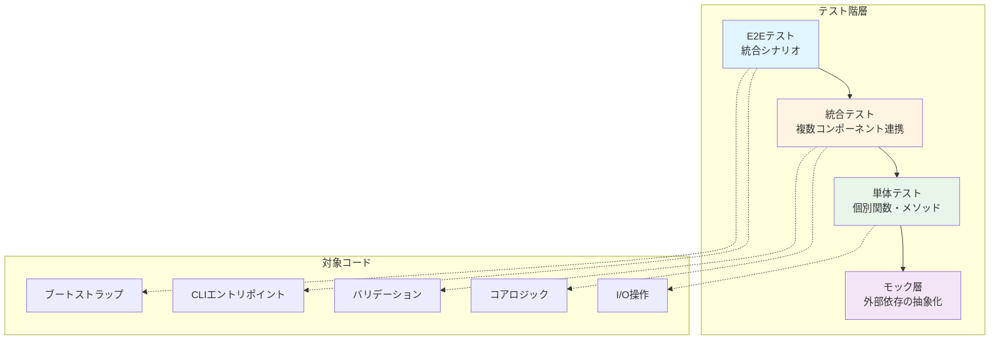

### 2.2 テスト戦略のマトリックス

| カテゴリ | 主なテスト手法 | モックレベル | カバレッジ目標 |
|---------|--------------|------------|--------------|
| CLIエントリポイント | 単体テスト | 最小限 | 95%+ |
| ブートストラップ | 統合テスト | 中程度 | 80%+ |
| エラー型 | 単体テスト | なし | 100% |
| バリデーション | 単体テスト + 境界値 | 低 | 90%+ |
| I/O操作（標準） | 単体テスト | 高（モックFS） | 85%+ |
| I/O操作（特権） | 統合テスト | 中程度 | 75%+ |
| I/O操作（OS依存） | 条件付きテスト | 環境依存 | 60%+ |
| ロギング | 単体 + 統合 | 中程度 | 80%+ |
| Slack通知 | 単体テスト | 高（HTTPモック） | 85%+ |

---

## 3. モックインフラストラクチャ設計

### 3.1 既存モックの活用

プロジェクトには以下の既存モックインフラが存在：

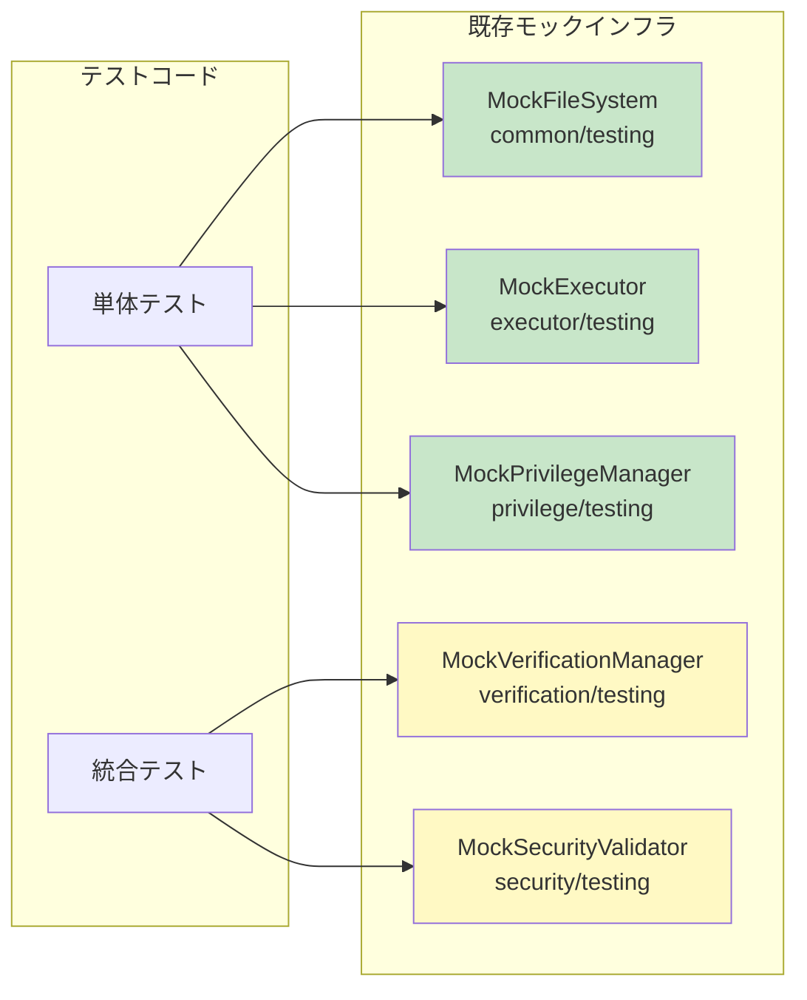

**設計方針**: 新規モックは最小限とし、既存モックの拡張を優先する。

### 3.2 新規モックの設計

Phase 4で必要となる新規モック：

#### 3.2.1 HTTPクライアントモック（Slack通知用）

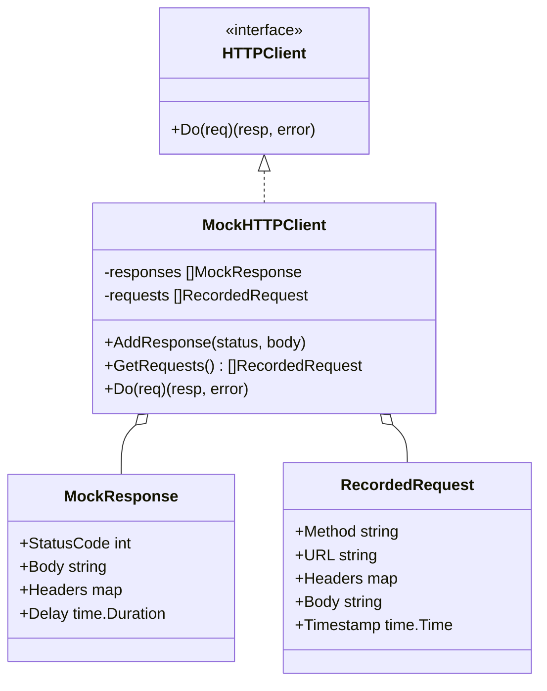

**責務**:
- Slack Webhook呼び出しのシミュレート
- リトライロジックのテスト
- タイムアウト・エラーレスポンスのシミュレート
- リクエスト内容の検証

#### 3.2.2 システムコールモック（OS依存機能用）

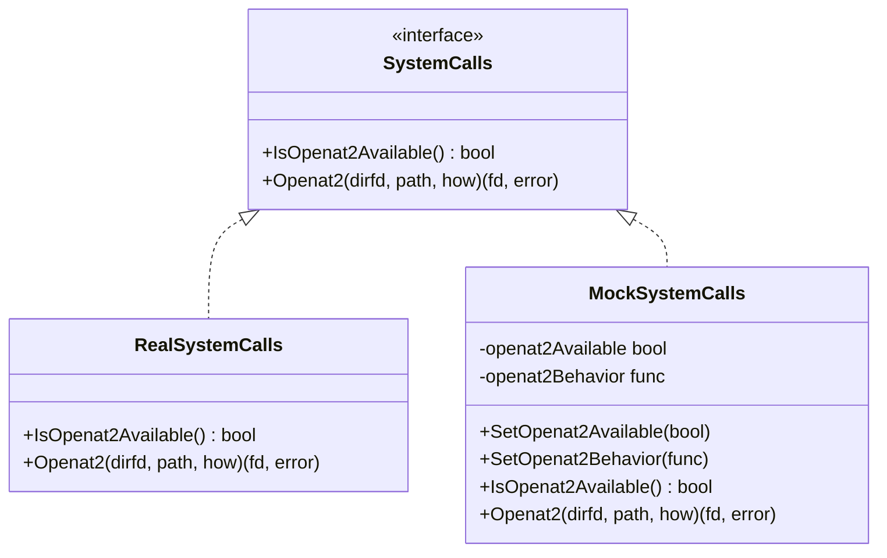

**責務**:
- openat2システムコールの可用性シミュレート
- カーネルバージョン依存性の抽象化
- エラーケースのシミュレート

---

## 4. Phase別設計詳細

### 4.1 Phase 1: Quick Wins（1週目）

#### 4.1.1 アーキテクチャ概要

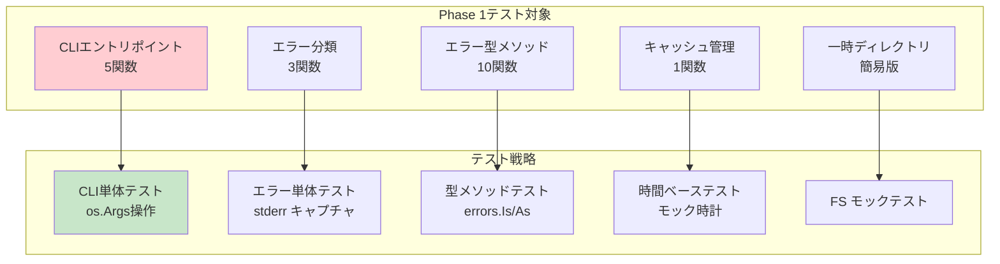

#### 4.1.2 CLIテストの設計

**テスト構造**:

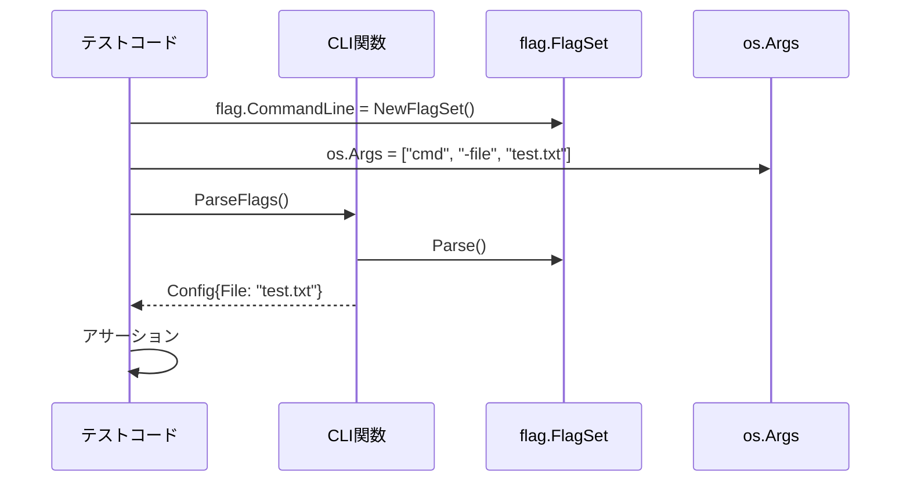

**設計ポイント**:
- `flag.CommandLine` をテストごとにリセット
- `os.Args` を直接操作してCLI引数をシミュレート
- エラー出力は `os.Stderr` をキャプチャ
- 各テストケースを完全に独立化

#### 4.1.3 エラー型テストの設計

**テストパターン**:

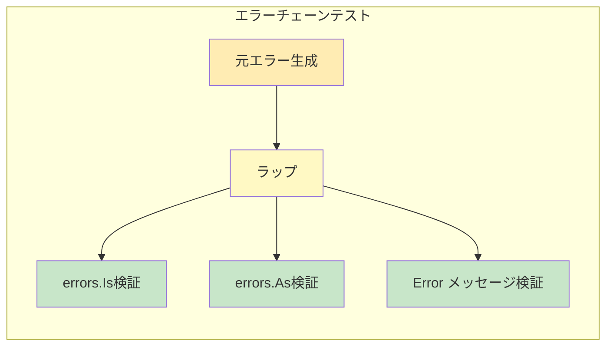

**カバーすべきパターン**:
1. エラーメッセージの内容検証
2. `errors.Is()` による型マッチング
3. `errors.As()` による値抽出
4. `errors.Unwrap()` によるチェーン検証
5. エラーのJSON/文字列表現

### 4.2 Phase 2: Core Infrastructure（2週目）

#### 4.2.1 アーキテクチャ概要

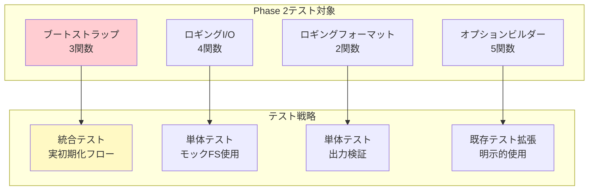

#### 4.2.2 ブートストラップテストの設計

**統合テストアプローチ**:

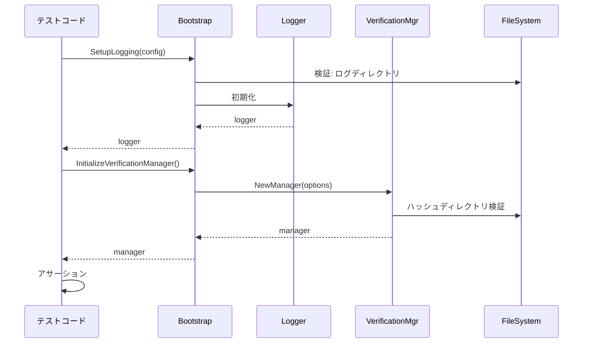

**設計ポイント**:
- 実際の初期化シーケンスを再現
- モックは最小限（ファイルシステムのみ）
- エラーパスを重点的にテスト
- 初期化順序の依存関係を検証

#### 4.2.3 ロギングI/Oテストの設計

**ファイルオープンのテスト**:

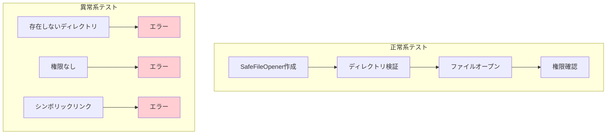

**テストケース**:
1. 正常なファイルオープン
2. ディレクトリが存在しない場合
3. 権限不足の場合
4. シンボリックリンク攻撃の防止
5. RunID生成の一意性
6. ログディレクトリのバリデーション

### 4.3 Phase 3: Validation & I/O（3週目）

#### 4.3.1 アーキテクチャ概要

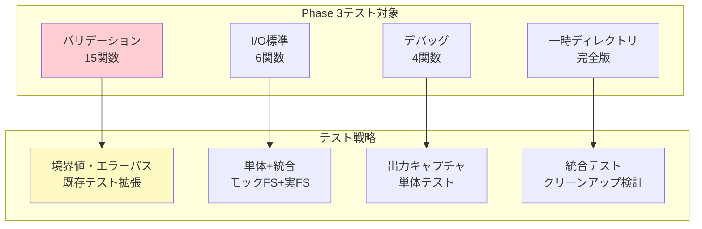

#### 4.3.2 バリデーション強化の設計

**境界値テスト戦略**:

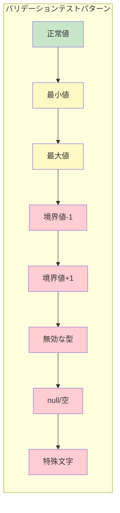

**セキュリティテストパターン**:

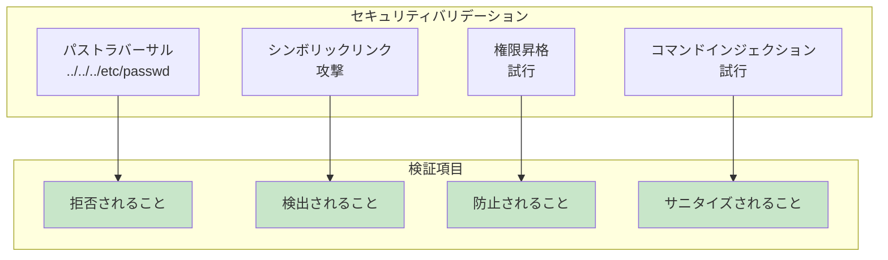

**対象バリデーション**:
1. 環境変数のバリデーション
   - 無効な文字（NULL、改行）
   - 長すぎる値
   - 予約語との衝突

2. ファイルパスのバリデーション
   - パストラバーサル
   - シンボリックリンク
   - 権限チェック

3. グループ権限のバリデーション
   - グループ書き込み権限
   - 所有者チェック
   - 境界値（UID/GID）

4. ハッシュバリデーション
   - 不正なハッシュ形式
   - ハッシュ不一致
   - マニフェストファイルの破損

#### 4.3.3 I/O操作テストの設計

**テスト構造の二層化**:

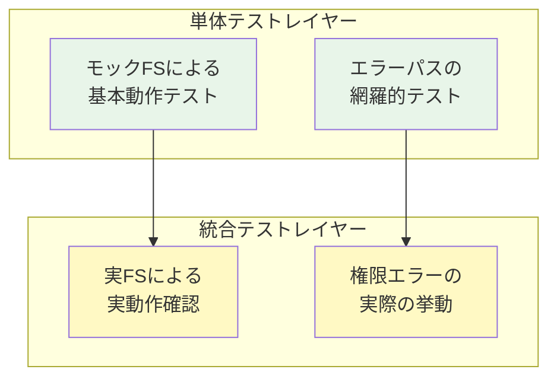

**テストケース設計**:

| 関数 | 単体テスト | 統合テスト | モックレベル |
|-----|----------|----------|------------|
| `SafeOpenFileInternal` | エラーパス | 実ファイルオープン | 高 |
| `CanCurrentUserSafelyWriteFile` | 権限計算ロジック | 実権限チェック | 中 |
| `CanCurrentUserSafelyReadFile` | 権限計算ロジック | 実権限チェック | 中 |
| `WriteToTemp` | FS操作 | 一時ファイル作成 | 高 |
| `OpenFileWithPrivileges` | 特権切替ロジック | （Phase 4） | 中 |

### 4.4 Phase 4: Advanced Features（4週目以降、オプション）

#### 4.4.1 アーキテクチャ概要

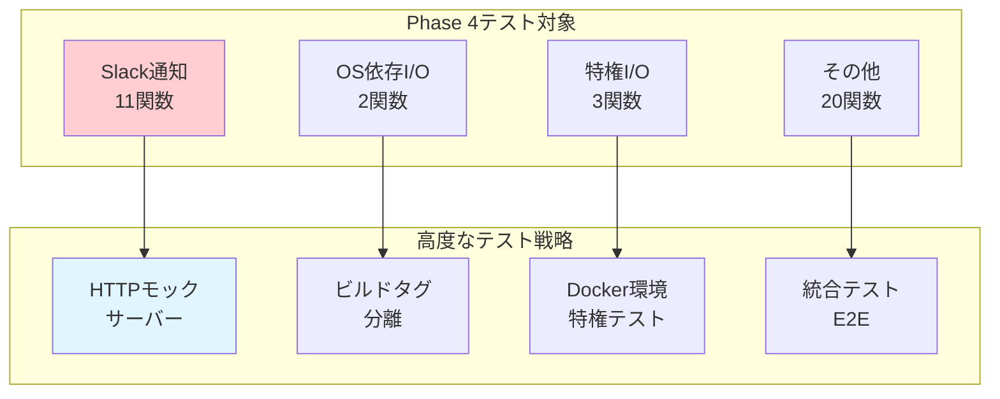

#### 4.4.2 Slack通知テストの設計

**HTTPモックサーバーアーキテクチャ**:

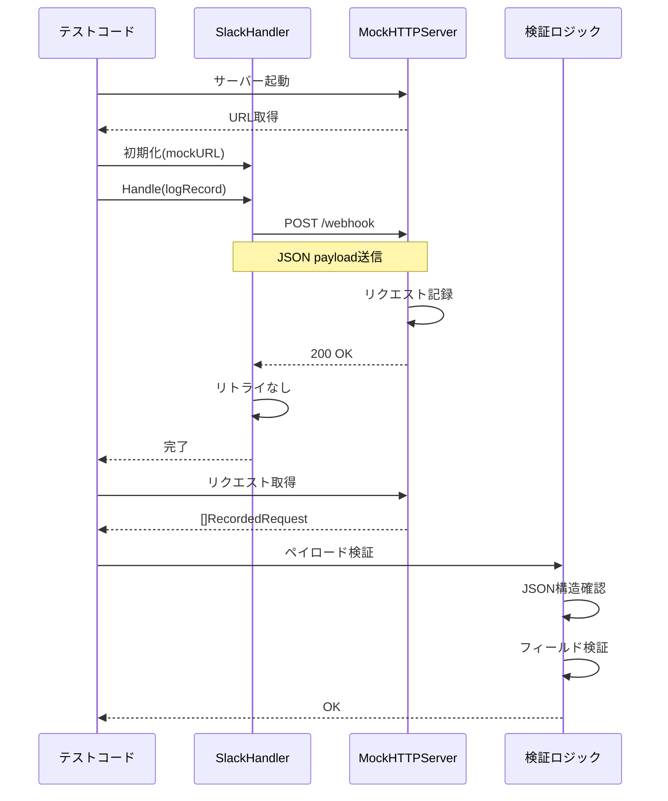

**テストシナリオ**:

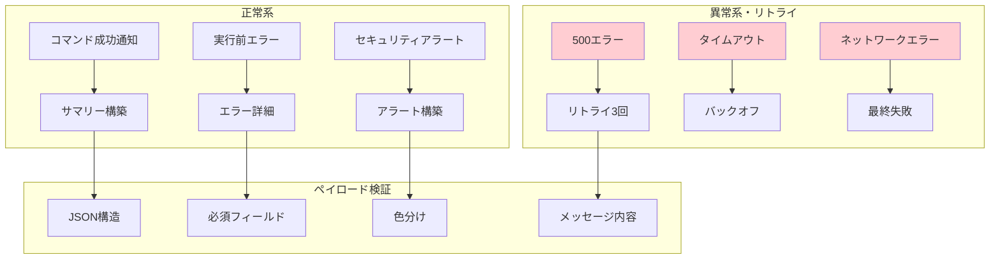

**リトライロジックのテスト**:

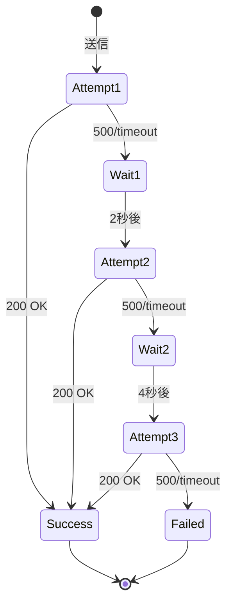

#### 4.4.3 OS依存機能テストの設計

**ビルドタグ分離戦略**:

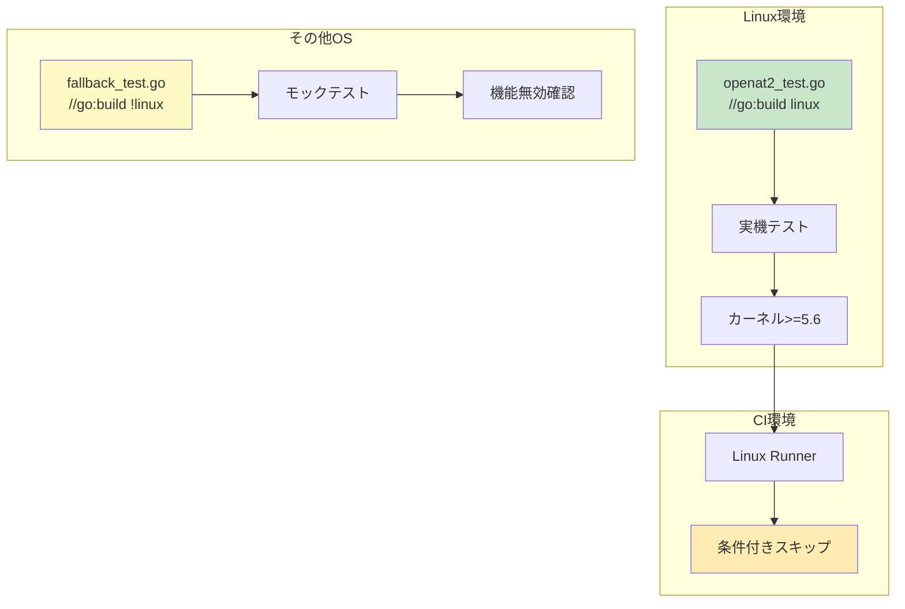

**テストケース**:

1. **openat2利用可能性判定**
   - カーネルバージョンチェック
   - システムコール存在確認
   - 実際の呼び出し成功

2. **openat2によるファイルオープン**
   - RESOLVE_NO_SYMLINKS フラグ
   - シンボリックリンクの拒否
   - エラーハンドリング

3. **フォールバック動作**
   - openat2が使えない場合の代替処理
   - 機能降格の適切な処理

#### 4.4.4 特権I/Oテストの設計

**Docker環境でのテスト**:

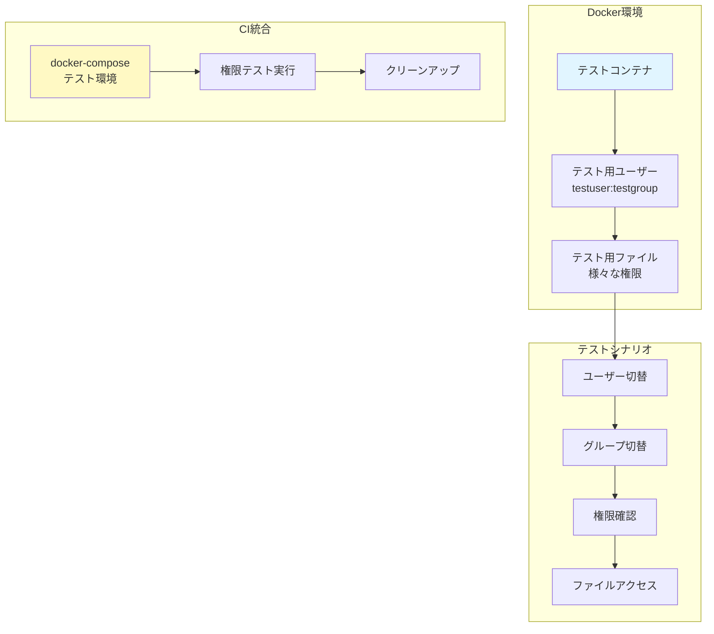

**Dockerfile構成例**:

| 要素 | 目的 | 設定内容 |
|-----|-----|---------|
| ベースイメージ | Go実行環境 | golang:1.23-alpine |
| テストユーザー | 権限テスト | testuser (UID: 1001) |
| テストグループ | グループ権限テスト | testgroup (GID: 1001) |
| ファイル構成 | 各種権限パターン | 所有者専用、グループ可、全員可 |
| 実行ユーザー | 非root実行 | testuser |

---

## 5. テストデータ管理

### 5.1 テストデータの分類

```mermaid
graph TB
    subgraph "テストデータ種別"
        FIXTURE[フィクスチャ<br/>静的テストデータ]
        GOLDEN[ゴールデンファイル<br/>期待出力]
        MOCK_DATA[モックデータ<br/>動的生成]
        TEMP_DATA[一時データ<br/>テスト中生成]
    end

    subgraph "配置場所"
        TESTDATA[testdata/<br/>ディレクトリ]
        INLINE[テストコード内<br/>埋め込み]
        RUNTIME[実行時生成]
    end

    FIXTURE --> TESTDATA
    GOLDEN --> TESTDATA
    MOCK_DATA --> INLINE
    TEMP_DATA --> RUNTIME

    style FIXTURE fill:#e8f5e9
    style GOLDEN fill:#fff9c4
    style MOCK_DATA fill:#e1f5ff
    style TEMP_DATA fill:#f3e5f5
```

### 5.2 テストデータの原則

1. **バージョン管理**: フィクスチャとゴールデンファイルはGit管理
2. **自己完結性**: 各テストは独立したデータを使用
3. **クリーンアップ**: 一時データは必ず削除
4. **再現性**: ランダムデータは固定シード使用

### 5.3 設定ファイルのテストパターン

```mermaid
graph LR
    subgraph "テスト用設定"
        VALID[有効な設定<br/>minimal.toml]
        COMPLEX[複雑な設定<br/>complex.toml]
        INVALID[無効な設定<br/>invalid.toml]
        MALFORMED[不正形式<br/>malformed.toml]
    end

    subgraph "テストケース"
        VALID --> T1[正常系]
        COMPLEX --> T2[全機能]
        INVALID --> T3[バリデーションエラー]
        MALFORMED --> T4[パースエラー]
    end

    style T1 fill:#c8e6c9
    style T2 fill:#c8e6c9
    style T3 fill:#ffcdd2
    style T4 fill:#ffcdd2
```

---

## 6. CI/CD統合

### 6.1 CI環境でのテスト実行フロー

```mermaid
graph TB
    START[CI トリガー] --> CHECKOUT[コードチェックアウト]
    CHECKOUT --> SETUP[Go環境セットアップ]
    SETUP --> DEPS[依存関係インストール]

    DEPS --> UNIT[単体テスト実行]
    DEPS --> INTEG[統合テスト実行]

    UNIT --> COV1[カバレッジ収集]
    INTEG --> COV2[カバレッジ収集]

    COV1 --> MERGE[カバレッジマージ]
    COV2 --> MERGE

    MERGE --> CHECK{カバレッジ<br/>>=85%?}
    CHECK -->|Yes| PASS[✓ 成功]
    CHECK -->|No| FAIL[✗ 失敗]

    PASS --> REPORT[レポート生成]
    FAIL --> REPORT

    style PASS fill:#c8e6c9
    style FAIL fill:#ffcdd2
```

### 6.2 カバレッジ測定の設定

**カバレッジ収集コマンド**:

```bash
# Phase 1-3: 標準的なカバレッジ
go test -tags test -coverprofile=coverage.out -coverpkg=./internal/... ./internal/...

# Phase 4: 条件付きテストを含む
go test -tags test,integration -coverprofile=coverage_full.out -coverpkg=./internal/... ./internal/...
```

**カバレッジ閾値設定**:

| Phase | 最小カバレッジ | 推奨カバレッジ | CI失敗条件 |
|-------|--------------|--------------|-----------|
| Phase 1完了後 | 79.0% | 79.5% | <79.0% |
| Phase 2完了後 | 81.5% | 82.0% | <81.5% |
| Phase 3完了後 | 84.5% | 85.0% | <84.5% |
| Phase 4完了後 | 89.0% | 90.0% | <85.0% |

### 6.3 並列テスト実行戦略

```mermaid
graph LR
    subgraph "並列実行グループ"
        G1[パッケージグループ1<br/>common, color, etc]
        G2[パッケージグループ2<br/>runner, executor]
        G3[パッケージグループ3<br/>filevalidator, safefileio]
        G4[パッケージグループ4<br/>logging, verification]
    end

    subgraph "実行時間"
        G1 -.->|~30秒| R1[結果1]
        G2 -.->|~2分| R2[結果2]
        G3 -.->|~1分| R3[結果3]
        G4 -.->|~1分| R4[結果4]
    end

    R1 --> MERGE[結果マージ]
    R2 --> MERGE
    R3 --> MERGE
    R4 --> MERGE

    style MERGE fill:#c8e6c9
```

**並列度の最適化**:
- CPU数に応じた並列実行: `go test -p $(nproc)`
- 重いテストは分離: 統合テストは別ジョブ
- タイムアウト設定: 各テストパッケージ最大5分

---

## 7. テスト品質保証

### 7.1 テストコードの品質基準

```mermaid
graph TB
    subgraph "品質基準"
        Q1[可読性<br/>明確なテスト名]
        Q2[保守性<br/>DRY原則]
        Q3[信頼性<br/>確定的実行]
        Q4[速度<br/>高速実行]
        Q5[隔離性<br/>副作用なし]
    end

    subgraph "検証方法"
        Q1 --> V1[コードレビュー]
        Q2 --> V2[リファクタリング]
        Q3 --> V3[CI反復実行]
        Q4 --> V4[ベンチマーク]
        Q5 --> V5[並列実行テスト]
    end

    style V1 fill:#e8f5e9
    style V2 fill:#e8f5e9
    style V3 fill:#e8f5e9
    style V4 fill:#e8f5e9
    style V5 fill:#e8f5e9
```

### 7.2 テスト命名規則

**パターン**:

| 要素 | 形式 | 例 |
|-----|-----|---|
| 関数 | `Test<Function>_<Scenario>` | `TestParseFlags_MissingRequiredArg` |
| メソッド | `Test<Type>_<Method>_<Scenario>` | `TestConfig_Validate_InvalidPath` |
| 統合 | `TestIntegration_<Feature>_<Scenario>` | `TestIntegration_Bootstrap_Success` |
| E2E | `TestE2E_<UserStory>` | `TestE2E_RunCommandWithValidation` |

**シナリオ命名**:
- 正常系: `Success`, `Valid`, `WithDefaultConfig`
- 異常系: `Error`, `Invalid`, `Missing`, `Forbidden`
- 境界値: `MinValue`, `MaxValue`, `Empty`, `Overflow`
- セキュリティ: `PathTraversal`, `SymlinkAttack`, `PrivilegeEscalation`

### 7.3 アサーションパターン

```mermaid
graph LR
    subgraph "アサーション種別"
        A1[等価性<br/>Equal/NotEqual]
        A2[エラー<br/>NoError/Error]
        A3[条件<br/>True/False]
        A4[包含<br/>Contains/NotContains]
        A5[型<br/>IsType/Implements]
    end

    subgraph "使用ライブラリ"
        A1 --> L1[testify/assert]
        A2 --> L1
        A3 --> L1
        A4 --> L1
        A5 --> L2[testify/require]
    end

    style L1 fill:#c8e6c9
    style L2 fill:#fff9c4
```

**使い分け**:
- `assert.*`: テスト継続可能なアサーション
- `require.*`: 失敗時に即座に停止すべきアサーション
- エラー検証: `errors.Is()` を優先使用

---

## 8. パフォーマンスとリソース管理

### 8.1 テスト実行時間の目標

```mermaid
graph TB
    subgraph "実行時間目標"
        UNIT[単体テスト<br/>< 10秒]
        INTEG[統合テスト<br/>< 30秒]
        E2E[E2Eテスト<br/>< 2分]
        TOTAL[全テスト<br/>< 5分]
    end

    subgraph "最適化手法"
        PAR[並列実行]
        CACHE[依存関係キャッシュ]
        MOCK[モック活用]
        SKIP[条件付きスキップ]
    end

    UNIT --> PAR
    INTEG --> MOCK
    E2E --> CACHE
    TOTAL --> SKIP

    style UNIT fill:#c8e6c9
    style INTEG fill:#fff9c4
    style E2E fill:#ffecb3
    style TOTAL fill:#e8f5e9
```

### 8.2 リソース使用量の管理

**制約**:

| リソース | 単体テスト | 統合テスト | Phase 4テスト |
|---------|----------|----------|-------------|
| メモリ | < 100MB | < 500MB | < 1GB |
| CPU | 1コア | 2コア | 4コア |
| ディスク | < 10MB | < 100MB | < 500MB |
| ネットワーク | なし | なし | ローカルのみ |

**クリーンアップ戦略**:

```mermaid
sequenceDiagram
    participant Test as テスト関数
    participant Setup as セットアップ
    participant Run as テスト実行
    participant Clean as クリーンアップ

    Test->>Setup: 初期化
    Setup->>Setup: 一時リソース作成
    Setup-->>Test: t.Cleanup登録

    Test->>Run: テスト実行
    Run-->>Test: 結果

    Test->>Clean: 自動実行
    Clean->>Clean: リソース削除
    Clean->>Clean: モック状態リセット
    Clean-->>Test: 完了
```

---

## 9. 段階的な移行とロールバック

### 9.1 段階的ロールアウト

```mermaid
graph TB
    START[Phase 1開始] --> P1[Quick Wins実装]
    P1 --> C1{カバレッジ<br/>79.5%達成?}
    C1 -->|Yes| P2[Phase 2開始]
    C1 -->|No| FIX1[問題分析・修正]
    FIX1 --> P1

    P2 --> C2{カバレッジ<br/>82.0%達成?}
    C2 -->|Yes| P3[Phase 3開始]
    C2 -->|No| FIX2[問題分析・修正]
    FIX2 --> P2

    P3 --> C3{カバレッジ<br/>85.0%達成?}
    C3 -->|Yes| DONE[目標達成]
    C3 -->|No| FIX3[問題分析・修正]
    FIX3 --> P3

    DONE --> DECISION{Phase 4<br/>実施?}
    DECISION -->|Yes| P4[Phase 4開始]
    DECISION -->|No| MAINTAIN[保守モード]

    style DONE fill:#c8e6c9
    style MAINTAIN fill:#e8f5e9
```

### 9.2 ロールバック戦略

**各Phaseのチェックポイント**:

```mermaid
graph LR
    subgraph "チェックポイント"
        CP1[カバレッジ測定]
        CP2[全テストパス]
        CP3[lintクリーン]
        CP4[ビルド成功]
        CP5[レビュー完了]
    end

    subgraph "失敗時"
        CP1 -.->|NG| RB1[前Phase状態へ]
        CP2 -.->|NG| RB2[該当PR破棄]
        CP3 -.->|NG| RB3[修正再提出]
        CP4 -.->|NG| RB2
        CP5 -.->|NG| RB3
    end

    style RB1 fill:#ffcdd2
    style RB2 fill:#ffcdd2
    style RB3 fill:#fff9c4
```

---

## 10. 保守と継続的改善

### 10.1 テストメンテナンス計画

```mermaid
graph TB
    subgraph "定期的な保守活動"
        M1[月次レビュー<br/>テスト品質]
        M2[四半期<br/>リファクタリング]
        M3[カバレッジ<br/>継続監視]
        M4[テストデータ<br/>更新]
    end

    subgraph "トリガーベース"
        T1[新機能追加時<br/>テスト追加]
        T2[バグ発見時<br/>回帰テスト追加]
        T3[リファクタリング時<br/>テスト更新]
    end

    M1 --> M2
    M2 --> M3
    M3 --> M4
    M4 --> M1

    T1 -.-> M1
    T2 -.-> M1
    T3 -.-> M2

    style M1 fill:#e8f5e9
    style M2 fill:#fff9c4
    style M3 fill:#e1f5ff
    style M4 fill:#f3e5f5
```

### 10.2 カバレッジ維持の仕組み

**CI/CDでの強制**:

```mermaid
graph TB
    PR[Pull Request] --> TEST[テスト実行]
    TEST --> COV[カバレッジ測定]
    COV --> DIFF[差分計算]

    DIFF --> CHECK{カバレッジ<br/>維持/向上?}
    CHECK -->|Yes| APPROVE[承認可能]
    CHECK -->|No| BLOCK[マージブロック]

    BLOCK --> EXPLAIN[説明要求]
    EXPLAIN --> REVIEW{正当な理由?}
    REVIEW -->|Yes| OVERRIDE[例外承認]
    REVIEW -->|No| REJECT[修正要求]

    style APPROVE fill:#c8e6c9
    style BLOCK fill:#ffcdd2
    style REJECT fill:#ffcdd2
    style OVERRIDE fill:#fff9c4
```

### 10.3 ドキュメント更新

**継続的なドキュメント保守**:

| ドキュメント | 更新タイミング | 担当 |
|------------|--------------|------|
| 本アーキテクチャ設計書 | Phase完了時 | リードエンジニア |
| テスト実装ガイド | 新パターン追加時 | 実装者 |
| カバレッジレポート | 週次自動 | CI/CD |
| 既知の制約・課題 | 発見時 | 発見者 |

---

## 11. 成功指標とモニタリング

### 11.1 主要指標（KPI）

```mermaid
graph LR
    subgraph "カバレッジ指標"
        K1[全体カバレッジ<br/>目標: 85%]
        K2[パッケージ別<br/>最低: 70%]
        K3[新規コード<br/>目標: 90%]
    end

    subgraph "品質指標"
        K4[テスト成功率<br/>目標: 100%]
        K5[Flaky率<br/>目標: < 1%]
        K6[実行時間<br/>目標: < 5分]
    end

    subgraph "保守性指標"
        K7[テストコード比率<br/>1:1 - 1:2]
        K8[重複コード<br/>< 5%]
    end

    style K1 fill:#c8e6c9
    style K4 fill:#fff9c4
    style K7 fill:#e1f5ff
```

### 11.2 モニタリングダッシュボード

**可視化すべき情報**:

1. **トレンドグラフ**
   - カバレッジの推移（日次・週次）
   - テスト実行時間の推移
   - テスト成功率の推移

2. **ヒートマップ**
   - パッケージ別カバレッジ
   - 低カバレッジ関数の分布

3. **アラート**
   - カバレッジ低下検出
   - Flakyテスト検出
   - 実行時間閾値超過

---

## 12. まとめ

本アーキテクチャ設計は、テストカバレッジを77.8%から85.0%へ向上させるための包括的な戦略を提供する。

### 主要な設計決定

1. **段階的アプローチ**: 4つのPhaseで段階的に実装、リスク分散
2. **既存資産の活用**: 既存のモックインフラを最大限活用
3. **テスト階層化**: 単体・統合・E2Eの適切な組み合わせ
4. **品質重視**: 保守可能で信頼性の高いテストコード
5. **自動化**: CI/CDでのカバレッジ強制と継続的監視

### 期待される成果

- **Phase 1終了時**: カバレッジ79.5%、基礎的なテストインフラ確立
- **Phase 2終了時**: カバレッジ82.0%、コアインフラのテスト完了
- **Phase 3終了時**: カバレッジ85.0%、**目標達成**
- **Phase 4終了時**: カバレッジ90.0%、高度な機能のテスト完了

### 次のステップ

1. Phase 1の詳細実装計画の策定
2. チームメンバーへの設計レビュー
3. Phase 1実装の開始
4. 週次進捗レビューの実施

本設計に基づき、体系的かつ効率的にテストカバレッジを向上させることができる。
