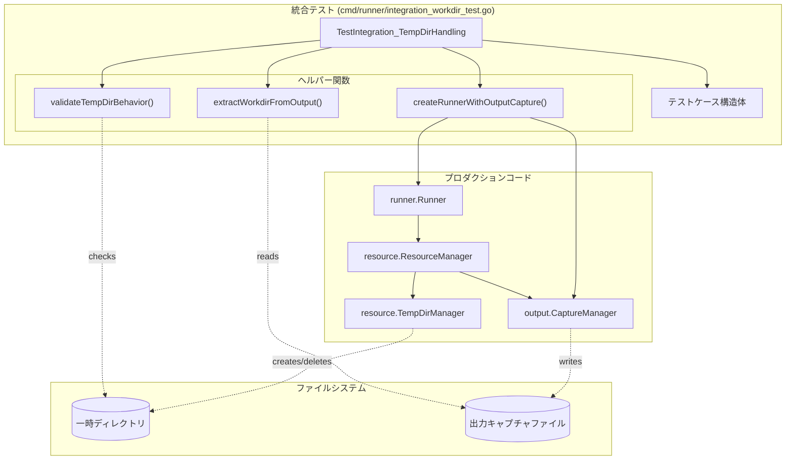
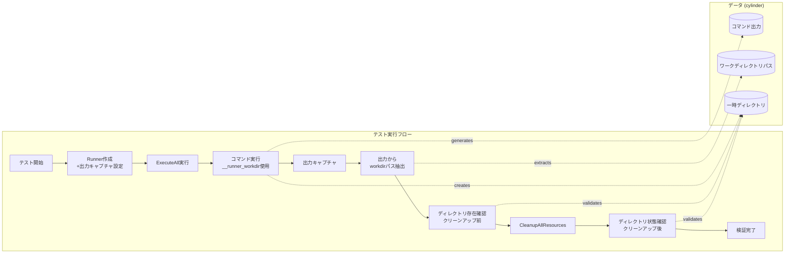
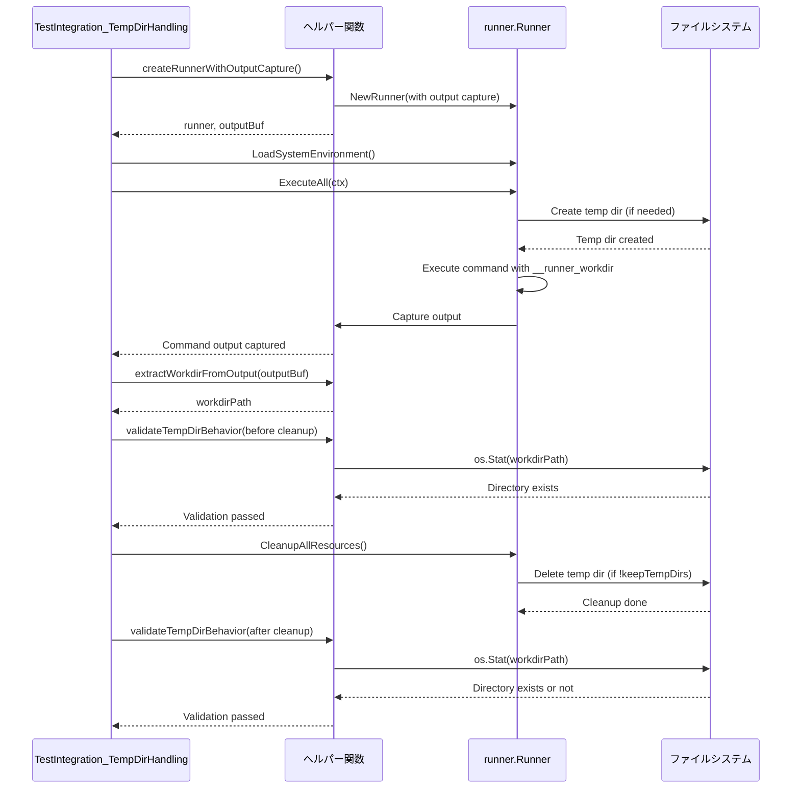

# アーキテクチャ設計書：統合テストにおける一時ディレクトリ検証の強化

## 1. 概要

本ドキュメントは、`TestIntegration_TempDirHandling` 統合テストの改善に関するアーキテクチャ設計を記述します。

### 1.1 目的

- 一時ディレクトリの作成・削除が正しく行われることを統合テストで検証する
- `keepTempDirs` フラグの効果を実際のファイルシステムで確認する
- コマンド出力から `__runner_workdir` の値を抽出し、検証に利用する

### 1.2 設計原則

- **単一責務の原則**: 各ヘルパー関数は単一の責務を持つ
- **既存機能の再利用**: `internal/runner/output` パッケージの出力キャプチャ機能を活用
- **テスト可読性の向上**: テストケースの意図が明確に理解できる構造
- **フェイルファスト**: 検証失敗時は早期に明確なエラーメッセージを返す

## 2. システムコンポーネント

### 2.1 コンポーネント図



### 2.2 データフロー



## 3. 詳細設計

### 3.1 テストケース構造体の拡張

現在の構造体を活用し、`expectTempDir` フィールドを実際に使用します。

```go
type testCase struct {
    name          string
    keepTempDirs  bool
    configContent string
    expectTempDir bool  // このフィールドを活用する
}
```

**使用方法:**
- `expectTempDir=true`: 一時ディレクトリが作成されることを期待（`workdir` 未指定の場合）
- `expectTempDir=false`: 一時ディレクトリが作成されない（`workdir` 固定指定の場合）

### 3.2 出力キャプチャの統合

#### 3.2.1 設計方針

既存の `internal/runner/output` パッケージと `internal/runner/resource` パッケージの出力キャプチャ機能を活用します。

#### 3.2.2 実装方法

**オプション A: メモリバッファ方式（推奨）**

テスト専用の簡易的な出力キャプチャを実装します。

```go
// テスト専用の出力バッファ
type testOutputBuffer struct {
    stdout bytes.Buffer
    stderr bytes.Buffer
    mu     sync.Mutex
}

func (b *testOutputBuffer) Write(p []byte) (n int, err error) {
    b.mu.Lock()
    defer b.mu.Unlock()
    return b.stdout.Write(p)
}

func (b *testOutputBuffer) String() string {
    b.mu.Lock()
    defer b.mu.Unlock()
    return b.stdout.String()
}
```

**利点:**
- シンプルで理解しやすい
- テストの意図が明確
- 一時ファイルの管理が不要

**欠点:**
- 大量の出力には向かない（統合テストでは問題なし）

**オプション B: 既存の output.CaptureManager を使用**

プロダクションコードの `output.CaptureManager` をテストで使用します。

```go
// 出力キャプチャマネージャーを作成
outputMgr, err := output.NewManager(/* ... */)
require.NoError(t, err)

// ResourceManager に組み込む
resourceMgr, err := resource.NewDefaultResourceManagerWithOutput(
    exec, fs, privMgr, pathResolver, logger, mode, nil, outputMgr, maxOutputSize,
)
```

**利点:**
- プロダクションコードと同じ仕組みを使用
- より現実的なテスト

**欠点:**
- セットアップが複雑
- テストの意図がわかりにくくなる可能性

**決定: オプション A（メモリバッファ方式）を採用**

理由:
- 統合テストの目的は「一時ディレクトリの作成・削除の検証」であり、出力キャプチャは補助的な機能
- シンプルさと可読性を優先
- 出力量は小さいため、メモリバッファで十分

### 3.3 ヘルパー関数の設計

#### 3.3.1 出力キャプチャ付き Runner の作成

```go
// createRunnerWithOutputCapture creates a Runner with output capture enabled
func createRunnerWithOutputCapture(
    t *testing.T,
    configContent string,
    keepTempDirs bool,
) (*runner.Runner, *testOutputBuffer) {
    // 一時設定ファイル作成
    tempConfigFile := createTempConfig(t, configContent)
    defer os.Remove(tempConfigFile)

    // 設定のロード
    cfg := loadConfig(t, tempConfigFile)

    // 出力バッファの作成
    outputBuf := &testOutputBuffer{}

    // Executor を出力リダイレクト付きで作成
    exec := executor.New()
    exec = wrapExecutorWithOutput(exec, outputBuf)

    // Runner の作成
    r := createRunner(t, cfg, exec, keepTempDirs)

    return r, outputBuf
}
```

**責務:**
- 統合テスト用の Runner を作成する
- 出力キャプチャを設定する
- テスト用の設定ファイルを管理する

#### 3.3.2 出力からワークディレクトリパスを抽出

```go
// extractWorkdirFromOutput extracts the __runner_workdir path from command output
func extractWorkdirFromOutput(t *testing.T, output string) string {
    // 正規表現パターン: "working in: <path>"
    pattern := regexp.MustCompile(`working in: (.+)`)
    matches := pattern.FindStringSubmatch(output)

    require.Len(t, matches, 2, "Failed to extract workdir from output: %s", output)

    workdirPath := strings.TrimSpace(matches[1])
    require.NotEmpty(t, workdirPath, "Extracted workdir path is empty")

    return workdirPath
}
```

**責務:**
- コマンド出力から `__runner_workdir` の値を抽出する
- パターンマッチングでパスを取得する
- 抽出失敗時にはテストを失敗させる

**入力例:**
```
working in: /tmp/scr-temp-12345/group_test
```

**出力:**
```
/tmp/scr-temp-12345/group_test
```

#### 3.3.3 一時ディレクトリの動作検証

```go
// validateTempDirBehavior validates temporary directory creation and cleanup behavior
func validateTempDirBehavior(
    t *testing.T,
    workdirPath string,
    expectTempDir bool,
    keepTempDirs bool,
    afterCleanup bool,
) {
    if !expectTempDir {
        // 固定ワークディレクトリの場合、一時ディレクトリパターンでないことを確認
        assert.NotContains(t, workdirPath, "scr-temp-",
            "Expected fixed workdir, but got temp dir: %s", workdirPath)
        return
    }

    // 一時ディレクトリの場合
    assert.Contains(t, workdirPath, "scr-temp-",
        "Expected temp dir, but got: %s", workdirPath)

    if afterCleanup {
        // クリーンアップ後の検証
        _, err := os.Stat(workdirPath)
        if keepTempDirs {
            // 保持される場合
            assert.NoError(t, err, "Temp dir should exist after cleanup with keepTempDirs=true")
        } else {
            // 削除される場合
            assert.True(t, os.IsNotExist(err),
                "Temp dir should be deleted after cleanup with keepTempDirs=false, but exists: %s", workdirPath)
        }
    } else {
        // クリーンアップ前の検証
        info, err := os.Stat(workdirPath)
        assert.NoError(t, err, "Temp dir should exist before cleanup")
        assert.True(t, info.IsDir(), "Path should be a directory: %s", workdirPath)
    }
}
```

**責務:**
- 一時ディレクトリの存在確認
- `expectTempDir` に基づく検証
- `keepTempDirs` と `afterCleanup` に基づく動作確認

**検証パターン:**

| expectTempDir | keepTempDirs | afterCleanup | 期待される動作 |
|--------------|--------------|-------------|--------------|
| `true` | `false` | `false` | ディレクトリが存在する |
| `true` | `false` | `true` | ディレクトリが削除されている |
| `true` | `true` | `false` | ディレクトリが存在する |
| `true` | `true` | `true` | ディレクトリが存在する（保持） |
| `false` | - | - | 固定ワークディレクトリを使用 |

### 3.4 テストフローの詳細



## 4. 実装の詳細

### 4.1 出力リダイレクトの実装方法

#### オプション 1: executor.Executor のラッパー（推奨）

```go
// executorWithOutput wraps an executor to capture command output
type executorWithOutput struct {
    executor.CommandExecutor
    output io.Writer
}

func (e *executorWithOutput) ExecuteCommand(
    ctx context.Context,
    cmd *runnertypes.RuntimeCommand,
    group *runnertypes.GroupSpec,
    env map[string]string,
) (int, error) {
    // 元の Executor を呼び出し、出力を output にリダイレクト
    // 実装の詳細は specification.md で定義
    // ...
}
```

#### オプション 2: os.Stdout/Stderr の一時的な置き換え

```go
// テスト中のみ os.Stdout をリダイレクト
oldStdout := os.Stdout
r, w, _ := os.Pipe()
os.Stdout = w

// Runner実行
err := runner.ExecuteAll(ctx)

// 復元
w.Close()
os.Stdout = oldStdout

// 出力読み取り
output, _ := io.ReadAll(r)
```

**決定: オプション 1（Executor ラッパー）を採用**

理由:
- グローバル状態（os.Stdout）を変更しないため、並列実行に安全
- テストの意図が明確
- 他のテストへの影響がない

### 4.2 エラーハンドリング

#### 4.2.1 出力パースの失敗

```go
func extractWorkdirFromOutput(t *testing.T, output string) string {
    pattern := regexp.MustCompile(`working in: (.+)`)
    matches := pattern.FindStringSubmatch(output)

    if len(matches) != 2 {
        t.Fatalf("Failed to extract workdir from output. Expected pattern 'working in: <path>', got: %s", output)
    }

    return strings.TrimSpace(matches[1])
}
```

#### 4.2.2 ディレクトリ確認の失敗

```go
func validateTempDirBehavior(...) {
    info, err := os.Stat(workdirPath)

    if err != nil {
        if os.IsNotExist(err) {
            t.Fatalf("Expected temp dir to exist, but not found: %s", workdirPath)
        } else {
            t.Fatalf("Failed to stat temp dir %s: %v", workdirPath, err)
        }
    }

    if !info.IsDir() {
        t.Fatalf("Path exists but is not a directory: %s", workdirPath)
    }
}
```

## 5. セキュリティ考慮事項

### 5.1 パストラバーサル対策

抽出したパスを検証する際、シンボリックリンク攻撃を防ぐため、以下の対策を実施します：

```go
func validateTempDirBehavior(t *testing.T, workdirPath string, ...) {
    // パスの正規化
    absPath, err := filepath.Abs(workdirPath)
    require.NoError(t, err)

    // 一時ディレクトリ配下であることを確認
    tempRoot := os.TempDir()
    require.True(t, strings.HasPrefix(absPath, tempRoot),
        "Workdir path is not under system temp dir: %s", absPath)

    // ... 以下、存在確認等
}
```

### 5.2 パーミッション検証

一時ディレクトリのパーミッションが適切であることを確認します（Linux/Unix のみ）：

```go
info, err := os.Stat(workdirPath)
require.NoError(t, err)

mode := info.Mode()
require.Equal(t, os.FileMode(0700), mode.Perm(),
    "Temp dir permissions should be 0700, got: %o", mode.Perm())
```

## 6. パフォーマンス考慮事項

### 6.1 出力バッファサイズ

統合テストでは小規模な出力のみを扱うため、無制限のバッファを使用します。

```go
type testOutputBuffer struct {
    stdout bytes.Buffer  // 無制限バッファ
    stderr bytes.Buffer
    mu     sync.Mutex
}
```

### 6.2 並列実行

統合テストは並列実行される可能性があるため、以下の対策を実施します：

- テストごとに一意な一時ファイル/ディレクトリを使用
- グローバル状態を変更しない
- `t.Parallel()` を明示的に呼び出さない（統合テストのため逐次実行）

## 7. テスト戦略

### 7.1 テスト対象範囲

| コンポーネント | テスト方法 | 責任 |
|-------------|----------|------|
| 一時ディレクトリ作成 | ファイルシステムで実際に確認 | 統合テスト |
| 一時ディレクトリ削除 | ファイルシステムで実際に確認 | 統合テスト |
| `keepTempDirs` フラグ | クリーンアップ後のディレクトリ存在確認 | 統合テスト |
| 出力キャプチャ | 出力バッファから取得 | 統合テスト |
| `__runner_workdir` 展開 | 出力パース | 統合テスト |

### 7.2 テストの範囲外

以下はユニットテストで検証済みのため、統合テストでは対象外とします：

- `TempDirManager` の詳細な動作（ユニットテストで検証済み）
- 変数展開ロジックの詳細（ユニットテストで検証済み）
- dry-run モードの動作（別の統合テスト `TestIntegration_DryRunWithTempDir` で検証）

## 8. 代替案の検討

### 8.1 E2E テストとしての実装

**概要:** バイナリをビルドして実際のコマンドラインから実行し、ファイルシステムを検証する。

**メリット:**
- 最も現実的なテスト
- ユーザー視点での検証

**デメリット:**
- セットアップが複雑
- テスト実行時間が長い
- デバッグが困難

**判断:** 統合テストで十分なため、E2E テストは不要

### 8.2 mock FileSystem の使用

**概要:** `executor.FileSystem` インターフェースを mock して、ファイルシステムアクセスを仮想化する。

**メリット:**
- テストが高速
- 予測可能な動作

**デメリット:**
- 実際のファイルシステム動作を検証できない
- 統合テストの目的に反する

**判断:** 統合テストでは実際のファイルシステムを使用する

## 9. まとめ

本アーキテクチャ設計では、以下のアプローチで統合テストを強化します：

1. **シンプルな出力キャプチャ**: メモリバッファ方式で出力を取得
2. **明確なヘルパー関数**: 各検証ステップを独立した関数として実装
3. **実ファイルシステム検証**: 一時ディレクトリの作成・削除を実際に確認
4. **既存構造の活用**: `expectTempDir` フィールドを使用して検証を制御

この設計により、統合テストとしての価値を高めつつ、コードの可読性と保守性を維持します。
