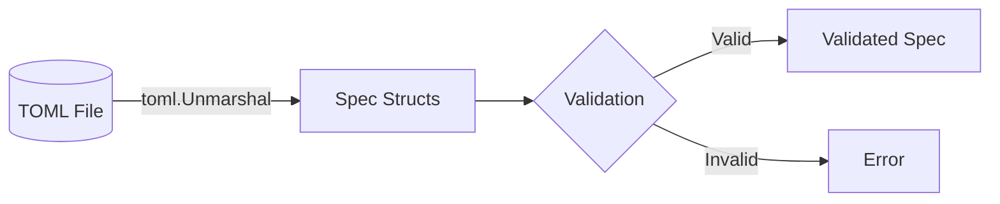
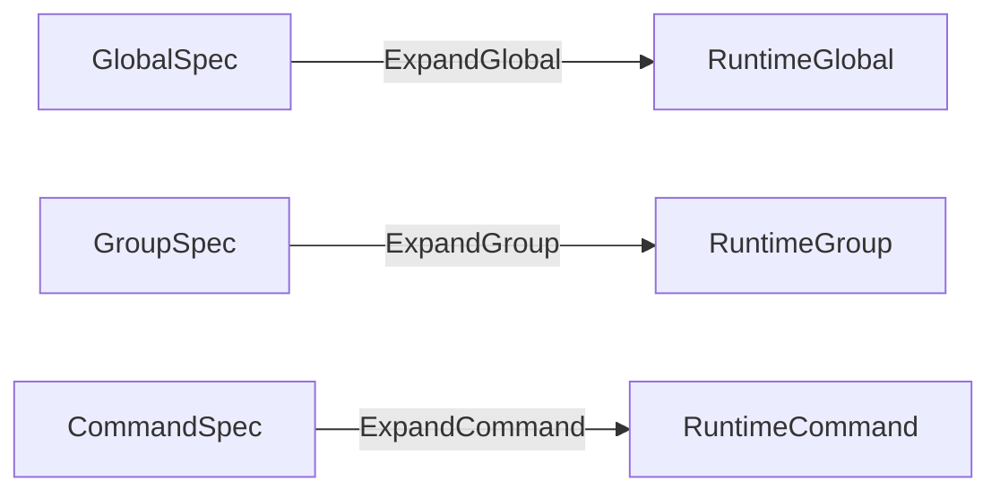

# 詳細仕様書: TOML設定フィールド名の改善

## 1. 概要

### 1.1 目的

TOML設定フィールド名の改善により、以下を達成する：

1. **直感性の向上**: positive sentenceによる分かりやすい命名
2. **一貫性の確立**: 関連フィールドのプレフィックス統一
3. **明確性の向上**: フィールドの役割が名前から明確に理解できる
4. **セキュアデフォルト**: デフォルト値を安全側に変更

### 1.2 スコープ

**対象範囲**:
- `internal/runner/runnertypes` パッケージの Spec 構造体
- TOML設定ファイル（`sample/*.toml`）
- ユーザーガイドとサンプルドキュメント

**対象外**:
- Runtime 層の構造体（`RuntimeGlobal`, `RuntimeGroup`, `RuntimeCommand`）
- 内部処理ロジック（変換処理のフィールド名対応のみ更新）

### 1.3 Breaking Change

この変更は **breaking change** として扱う。後方互換性は提供しない。

## 2. データ構造仕様

### 2.1 GlobalSpec 構造体

**ファイル**: `internal/runner/runnertypes/spec.go`

#### 変更前

```go
type GlobalSpec struct {
    SkipStandardPaths bool     `toml:"skip_standard_paths"`
    Env               []string `toml:"env"`
    EnvAllowlist      []string `toml:"env_allowlist"`
    FromEnv           []string `toml:"from_env"`
    MaxOutputSize     int64    `toml:"max_output_size"`
    // ... その他のフィールド
}
```

#### 変更後

```go
type GlobalSpec struct {
    VerifyStandardPaths bool     `toml:"verify_standard_paths"`
    EnvVars             []string `toml:"env_vars"`
    EnvAllowed          []string `toml:"env_allowed"`
    EnvImport           []string `toml:"env_import"`
    OutputSizeLimit     int64    `toml:"output_size_limit"`
    // ... その他のフィールド
}
```

#### フィールド詳細仕様

##### `VerifyStandardPaths`

| 項目 | 仕様 |
|------|------|
| **Goフィールド名** | `VerifyStandardPaths` |
| **TOMLタグ** | `verify_standard_paths` |
| **型** | `bool` |
| **デフォルト値** | `true` （検証を実施） |
| **説明** | 標準パス（`/bin`, `/usr/bin` など）のファイル検証を実施するかどうか |
| **旧フィールド名** | `SkipStandardPaths` |
| **旧デフォルト値** | `false` （検証をスキップしない = 検証する動作だったが、名前が否定形で混乱を招いていた） |

**セマンティクス**:
- `true`: 標準パスのファイルを検証する（セキュアデフォルト）
- `false`: 標準パスのファイル検証をスキップする

**移行時の注意**:
```toml
# 旧設定: 検証をスキップしていた
[global]
skip_standard_paths = true  # 検証しない

# 新設定: 同じ動作（検証しない）
[global]
verify_standard_paths = false  # 検証しない
```

##### `EnvVars`

| 項目 | 仕様 |
|------|------|
| **Goフィールド名** | `EnvVars` |
| **TOMLタグ** | `env_vars` |
| **型** | `[]string` |
| **デフォルト値** | `nil` (空配列) |
| **説明** | 明示的に設定する環境変数のリスト（`KEY=VALUE` 形式） |
| **旧フィールド名** | `Env` |

**形式**:
```toml
[global]
env_vars = [
    "LANG=en_US.UTF-8",
    "TZ=UTC",
    "HOME=/root"
]
```

##### `EnvAllowed`

| 項目 | 仕様 |
|------|------|
| **Goフィールド名** | `EnvAllowed` |
| **TOMLタグ** | `env_allowed` |
| **型** | `[]string` |
| **デフォルト値** | `nil` (空配列) |
| **説明** | コマンド実行時に許可する環境変数名のリスト |
| **旧フィールド名** | `EnvAllowlist` |

**形式**:
```toml
[global]
env_allowed = ["PATH", "HOME", "USER", "LANG"]
```

##### `EnvImport`

| 項目 | 仕様 |
|------|------|
| **Goフィールド名** | `EnvImport` |
| **TOMLタグ** | `env_import` |
| **型** | `[]string` |
| **デフォルト値** | `nil` (空配列) |
| **説明** | システム環境変数から内部変数へのインポートマッピング |
| **旧フィールド名** | `FromEnv` |

**形式**:
```toml
[global]
env_import = [
    "user=USER",           # 内部変数 user にシステム環境変数 USER を設定
    "home_dir=HOME",       # 内部変数 home_dir にシステム環境変数 HOME を設定
]
```

##### `OutputSizeLimit`

| 項目 | 仕様 |
|------|------|
| **Goフィールド名** | `OutputSizeLimit` |
| **TOMLタグ** | `output_size_limit` |
| **型** | `int64` |
| **デフォルト値** | `0` （無制限） |
| **説明** | 出力ファイルの最大サイズ（バイト単位） |
| **旧フィールド名** | `MaxOutputSize` |

**形式**:
```toml
[global]
output_size_limit = 10485760  # 10MB
```

### 2.2 GroupSpec 構造体

**ファイル**: `internal/runner/runnertypes/spec.go`

#### 変更前

```go
type GroupSpec struct {
    Name         string   `toml:"name"`
    Env          []string `toml:"env"`
    EnvAllowlist []string `toml:"env_allowlist"`
    FromEnv      []string `toml:"from_env"`
    // ... その他のフィールド
}
```

#### 変更後

```go
type GroupSpec struct {
    Name       string   `toml:"name"`
    EnvVars    []string `toml:"env_vars"`
    EnvAllowed []string `toml:"env_allowed"`
    EnvImport  []string `toml:"env_import"`
    // ... その他のフィールド
}
```

#### フィールド詳細仕様

##### `EnvVars`

| 項目 | 仕様 |
|------|------|
| **Goフィールド名** | `EnvVars` |
| **TOMLタグ** | `env_vars` |
| **型** | `[]string` |
| **デフォルト値** | `nil` (空配列) |
| **説明** | グループレベルで設定する環境変数（`KEY=VALUE` 形式） |
| **旧フィールド名** | `Env` |

##### `EnvAllowed`

| 項目 | 仕様 |
|------|------|
| **Goフィールド名** | `EnvAllowed` |
| **TOMLタグ** | `env_allowed` |
| **型** | `[]string` |
| **デフォルト値** | `nil` (空配列) |
| **説明** | グループレベルで許可する環境変数名のリスト |
| **旧フィールド名** | `EnvAllowlist` |

##### `EnvImport`

| 項目 | 仕様 |
|------|------|
| **Goフィールド名** | `EnvImport` |
| **TOMLタグ** | `env_import` |
| **型** | `[]string` |
| **デフォルト値** | `nil` (空配列) |
| **説明** | グループレベルのシステム環境変数インポート |
| **旧フィールド名** | `FromEnv` |

### 2.3 CommandSpec 構造体

**ファイル**: `internal/runner/runnertypes/spec.go`

#### 変更前

```go
type CommandSpec struct {
    Name          string   `toml:"name"`
    Env           []string `toml:"env"`
    FromEnv       []string `toml:"from_env"`
    MaxRiskLevel  string   `toml:"max_risk_level"`
    Output        string   `toml:"output"`
    // ... その他のフィールド
}
```

#### 変更後

```go
type CommandSpec struct {
    Name       string   `toml:"name"`
    EnvVars    []string `toml:"env_vars"`
    EnvImport  []string `toml:"env_import"`
    RiskLevel  string   `toml:"risk_level"`
    OutputFile string   `toml:"output_file"`
    // ... その他のフィールド
}
```

#### フィールド詳細仕様

##### `EnvVars`

| 項目 | 仕様 |
|------|------|
| **Goフィールド名** | `EnvVars` |
| **TOMLタグ** | `env_vars` |
| **型** | `[]string` |
| **デフォルト値** | `nil` (空配列) |
| **説明** | コマンドレベルで設定する環境変数（`KEY=VALUE` 形式） |
| **旧フィールド名** | `Env` |

##### `EnvImport`

| 項目 | 仕様 |
|------|------|
| **Goフィールド名** | `EnvImport` |
| **TOMLタグ** | `env_import` |
| **型** | `[]string` |
| **デフォルト値** | `nil` (空配列) |
| **説明** | コマンドレベルのシステム環境変数インポート |
| **旧フィールド名** | `FromEnv` |

##### `RiskLevel`

| 項目 | 仕様 |
|------|------|
| **Goフィールド名** | `RiskLevel` |
| **TOMLタグ** | `risk_level` |
| **型** | `string` |
| **デフォルト値** | `"low"` |
| **説明** | コマンドの許容リスクレベル |
| **旧フィールド名** | `MaxRiskLevel` |
| **有効な値** | `"low"`, `"medium"`, `"high"` |

**セマンティクス**:
- runner がコマンドのリスクレベルを自動評価
- `risk_level` に指定した値以下のリスクレベルの場合のみ実行許可
- デフォルト `"low"` の場合、低リスクコマンドのみ実行可能

**例**:
```toml
[[groups.commands]]
name = "safe_command"
cmd = "/bin/ls"
# risk_level 未指定 → デフォルト "low"
# runner が "low" と評価 → 実行可能

[[groups.commands]]
name = "risky_command"
cmd = "/usr/bin/rm"
risk_level = "high"  # 明示的に高リスクを許可
# runner が "high" と評価 → 実行可能
```

##### `OutputFile`

| 項目 | 仕様 |
|------|------|
| **Goフィールド名** | `OutputFile` |
| **TOMLタグ** | `output_file` |
| **型** | `string` |
| **デフォルト値** | `""` (出力キャプチャなし) |
| **説明** | コマンド出力の保存先ファイルパス |
| **旧フィールド名** | `Output` |

**形式**:
```toml
[[groups.commands]]
name = "generate_report"
cmd = "/usr/bin/report-gen"
output_file = "/var/log/report.txt"
```

## 3. データフロー仕様

### 3.1 TOML → Spec 構造体



**処理**:
1. `toml.Unmarshal()` が TOML ファイルを読み込み
2. 新しい TOML タグに基づいて Spec 構造体にマッピング
3. バリデーション実施
4. 成功時は Validated Spec を返す

### 3.2 Spec → Runtime 変換



**変換マッピング**:

#### Global レベル

| Spec フィールド | Runtime フィールド | 変換処理 |
|----------------|-------------------|---------|
| `VerifyStandardPaths` | （検証ロジックで使用） | フラグとして直接使用 |
| `EnvVars` | `ExpandedEnv` | パース・展開して map に変換 |
| `EnvAllowed` | `AllowedEnvVars` | そのままコピー |
| `EnvImport` | `ExpandedEnv` | システム環境変数から取得・展開 |
| `OutputSizeLimit` | `MaxOutputSize` | そのままコピー |

#### Group レベル

| Spec フィールド | Runtime フィールド | 変換処理 |
|----------------|-------------------|---------|
| `EnvVars` | `ExpandedEnv` | Global とマージして展開 |
| `EnvAllowed` | `AllowedEnvVars` | Global とマージ |
| `EnvImport` | `ExpandedEnv` | システム環境変数から取得・展開 |

#### Command レベル

| Spec フィールド | Runtime フィールド | 変換処理 |
|----------------|-------------------|---------|
| `EnvVars` | `ExpandedEnv` | Group とマージして展開 |
| `EnvImport` | `ExpandedEnv` | システム環境変数から取得・展開 |
| `RiskLevel` | `MaxRiskLevel` | そのままコピー（内部的には max の意味） |
| `OutputFile` | `OutputPath` | パス検証後にコピー |

### 3.3 変換処理の詳細

**ファイル**: `internal/runner/config/expansion.go`

#### 変更箇所

```go
// 変更前
func ExpandGlobal(spec *runnertypes.GlobalSpec) (*runnertypes.RuntimeGlobal, error) {
    // spec.Env を処理
    // spec.EnvAllowlist を処理
    // spec.FromEnv を処理
    // spec.MaxOutputSize を処理
}

// 変更後
func ExpandGlobal(spec *runnertypes.GlobalSpec) (*runnertypes.RuntimeGlobal, error) {
    // spec.EnvVars を処理
    // spec.EnvAllowed を処理
    // spec.EnvImport を処理
    // spec.OutputSizeLimit を処理
}
```

**注**: 処理ロジックは変更なし。フィールド名の参照のみを更新。

## 4. デフォルト値仕様

### 4.1 `VerifyStandardPaths` のデフォルト値

**実装方法**:

```go
// internal/runner/config/defaults.go

const (
    DefaultVerifyStandardPaths = true  // セキュアデフォルト
)

// ApplyDefaults applies default values to GlobalSpec
func ApplyDefaults(spec *runnertypes.GlobalSpec) {
    // VerifyStandardPaths のデフォルトを適用
    // TOML で明示的に指定されていない場合のみ適用
    if !spec.VerifyStandardPathsSet {
        spec.VerifyStandardPaths = DefaultVerifyStandardPaths
    }
}
```

**問題点**: Go の `toml` パッケージでは、`bool` フィールドが TOML で省略された場合と `false` が明示された場合を区別できない。

**解決策**: 以下のいずれかを採用：

#### オプション A: `*bool` ポインタ型を使用

```go
type GlobalSpec struct {
    VerifyStandardPaths *bool `toml:"verify_standard_paths"`
    // ...
}

func ApplyDefaults(spec *runnertypes.GlobalSpec) {
    if spec.VerifyStandardPaths == nil {
        defaultValue := true
        spec.VerifyStandardPaths = &defaultValue
    }
}
```

**メリット**: 省略と明示的 `false` を区別可能
**デメリット**: ポインタ型の使用で nil チェックが必要

#### オプション B: デフォルト値を `true` として扱い、ドキュメントで明示

```go
type GlobalSpec struct {
    VerifyStandardPaths bool `toml:"verify_standard_paths"`
    // ...
}

// TOML で省略された場合、Go のゼロ値 false が設定される
// 後処理でデフォルト true に上書き（ただし明示的な false と区別不可）
```

**メリット**: シンプルな実装
**デメリット**: 明示的に `false` を指定したユーザーの意図を無視する可能性

#### 採用する解決策

**オプション A を採用**:
- セキュリティ関連設定であるため、明示的 `false` と省略を区別すべき
- ポインタ型のデメリットは限定的（アクセス時の nil チェックのみ）

### 4.2 `RiskLevel` のデフォルト値

```go
const (
    DefaultRiskLevel = "low"
)

func ApplyCommandDefaults(spec *runnertypes.CommandSpec) {
    if spec.RiskLevel == "" {
        spec.RiskLevel = DefaultRiskLevel
    }
}
```

**注**: `string` 型のため、空文字列を「未指定」として扱える。

## 5. バリデーション仕様

### 5.1 フィールド値のバリデーション

**ファイル**: `internal/runner/config/validation.go`

#### `VerifyStandardPaths`

- 型が `*bool` のため、`nil` または `true`/`false`
- バリデーション不要（どの値も有効）

#### `EnvVars`, `EnvAllowed`, `EnvImport`

```go
func ValidateEnvVars(envVars []string) error {
    for _, env := range envVars {
        if !strings.Contains(env, "=") {
            return fmt.Errorf("invalid env format: %s (expected KEY=VALUE)", env)
        }
        // KEY と VALUE の検証
    }
    return nil
}

func ValidateEnvAllowed(envAllowed []string) error {
    for _, varName := range envAllowed {
        if varName == "" {
            return fmt.Errorf("empty variable name in env_allowed")
        }
        // 変数名の形式検証
    }
    return nil
}

func ValidateEnvImport(envImport []string) error {
    for _, mapping := range envImport {
        if !strings.Contains(mapping, "=") {
            return fmt.Errorf("invalid env_import format: %s (expected INTERNAL_VAR=SYSTEM_VAR)", mapping)
        }
        // INTERNAL_VAR と SYSTEM_VAR の検証
    }
    return nil
}
```

#### `RiskLevel`

```go
var validRiskLevels = map[string]bool{
    "low":    true,
    "medium": true,
    "high":   true,
}

func ValidateRiskLevel(level string) error {
    if level == "" {
        return nil  // デフォルト値が適用される
    }
    if !validRiskLevels[level] {
        return fmt.Errorf("invalid risk_level: %s (must be low, medium, or high)", level)
    }
    return nil
}
```

#### `OutputFile`

```go
func ValidateOutputFile(outputFile string) error {
    if outputFile == "" {
        return nil  // 出力キャプチャなし
    }
    // パスの検証（絶対パス、安全性など）
    if !filepath.IsAbs(outputFile) {
        return fmt.Errorf("output_file must be an absolute path: %s", outputFile)
    }
    return nil
}
```

#### `OutputSizeLimit`

```go
func ValidateOutputSizeLimit(limit int64) error {
    if limit < 0 {
        return fmt.Errorf("output_size_limit must be non-negative: %d", limit)
    }
    return nil
}
```

## 6. TOML 設定例

### 6.1 最小構成

```toml
[global]
# デフォルト値が適用される
# verify_standard_paths = true (デフォルト)
# env_vars = []
# env_allowed = []
# env_import = []
# output_size_limit = 0 (無制限)

[[groups]]
name = "basic"

[[groups.commands]]
name = "ls"
cmd = "/bin/ls"
args = ["-la"]
# risk_level = "low" (デフォルト)
```

### 6.2 完全な設定例

```toml
[global]
verify_standard_paths = true
env_vars = [
    "LANG=en_US.UTF-8",
    "TZ=UTC",
]
env_allowed = ["PATH", "HOME", "USER"]
env_import = [
    "system_user=USER",
    "system_home=HOME",
]
output_size_limit = 10485760  # 10MB

[[groups]]
name = "maintenance"
env_vars = [
    "LOG_LEVEL=INFO",
]
env_allowed = ["TMPDIR"]
env_import = [
    "tmp_path=TMPDIR",
]

[[groups.commands]]
name = "cleanup"
cmd = "/usr/local/bin/cleanup.sh"
env_vars = [
    "CLEANUP_MODE=safe",
]
env_import = [
    "target_dir=CLEANUP_TARGET",
]
risk_level = "medium"
output_file = "/var/log/cleanup.log"
```

### 6.3 セキュリティ重視の設定例

```toml
[global]
verify_standard_paths = true  # 標準パスの検証を有効化
env_allowed = ["PATH"]         # 最小限の環境変数のみ許可
output_size_limit = 1048576    # 1MB制限

[[groups]]
name = "restricted"

[[groups.commands]]
name = "safe_operation"
cmd = "/usr/local/bin/safe-tool"
risk_level = "low"  # 低リスクのみ許可
```

### 6.4 開発環境向け設定例

```toml
[global]
verify_standard_paths = false  # 開発環境では検証をスキップ
env_allowed = ["PATH", "HOME", "USER", "LANG", "TMPDIR"]
output_size_limit = 0  # 無制限

[[groups]]
name = "development"

[[groups.commands]]
name = "build"
cmd = "/usr/bin/make"
risk_level = "high"  # 開発環境では高リスクも許可
```

## 7. エラーメッセージ仕様

### 7.1 旧フィールド名使用時のエラー

TOML パーサーは未知のフィールドを自動的に無視するため、旧フィールド名を使用してもエラーにならない。

**問題**: ユーザーが気づかずに旧フィールド名を使用し続ける可能性がある。

**解決策**: カスタムバリデーションで旧フィールド名を検出（オプション）

```go
// internal/runner/config/validation.go

var deprecatedFields = map[string]string{
    "skip_standard_paths": "verify_standard_paths",
    "env":                 "env_vars",
    "env_allowlist":       "env_allowed",
    "from_env":            "env_import",
    "max_risk_level":      "risk_level",
    "output":              "output_file",
    "max_output_size":     "output_size_limit",
}

func CheckDeprecatedFields(rawTOML map[string]interface{}) []string {
    var warnings []string
    for oldField, newField := range deprecatedFields {
        if _, exists := rawTOML[oldField]; exists {
            warnings = append(warnings,
                fmt.Sprintf("Field '%s' has been renamed to '%s'", oldField, newField))
        }
    }
    return warnings
}
```

**注**: この検出は **オプション** とする。実装の複雑性とメリットを考慮して判断。

### 7.2 バリデーションエラーメッセージ

#### `env_vars` フォーマットエラー

```
Error: invalid env_vars format: "INVALID" (expected KEY=VALUE)
Location: [global] section
```

#### `risk_level` 不正値エラー

```
Error: invalid risk_level: "critical" (must be low, medium, or high)
Location: [groups.commands] name="risky_command"
```

#### `output_file` 相対パスエラー

```
Error: output_file must be an absolute path: "log/output.txt"
Location: [groups.commands] name="generate_report"
```

#### `output_size_limit` 負の値エラー

```
Error: output_size_limit must be non-negative: -1024
Location: [global] section
```

## 8. 互換性と移行

### 8.1 Breaking Change の影響範囲

#### ユーザー影響

| 影響 | 詳細 |
|------|------|
| **既存設定ファイルの動作停止** | 旧フィールド名を使用している設定ファイルは読み込まれない |
| **デフォルト値の変更** | `verify_standard_paths` のデフォルトが `true` に変更され、動作が変わる |
| **設定ファイルの手動更新が必要** | すべての設定ファイルを新フィールド名に更新する必要がある |

#### 内部実装影響

| 影響 | 詳細 |
|------|------|
| **Spec構造体の変更** | `GlobalSpec`, `GroupSpec`, `CommandSpec` のフィールド名とTOMLタグ変更 |
| **変換処理の更新** | `config/expansion.go` でのフィールド参照を更新 |
| **テストの更新** | すべてのテストファイルで新フィールド名を使用 |
| **ドキュメントの更新** | ユーザーガイド、サンプル、CHANGELOG の更新 |

### 8.2 フィールド名対応表

| レベル | 旧フィールド名 | 新フィールド名 | デフォルト値変更 |
|--------|--------------|--------------|----------------|
| Global | `skip_standard_paths` | `verify_standard_paths` | `false` → `true` |
| Global | `env` | `env_vars` | なし |
| Global | `env_allowlist` | `env_allowed` | なし |
| Global | `from_env` | `env_import` | なし |
| Global | `max_output_size` | `output_size_limit` | なし |
| Group | `env` | `env_vars` | なし |
| Group | `env_allowlist` | `env_allowed` | なし |
| Group | `from_env` | `env_import` | なし |
| Command | `env` | `env_vars` | なし |
| Command | `from_env` | `env_import` | なし |
| Command | `max_risk_level` | `risk_level` | なし |
| Command | `output` | `output_file` | なし |

### 8.3 移行ガイド

#### ステップ 1: フィールド名の置換

```bash
# 一括置換例（実際のファイルパスに応じて調整）
sed -i 's/skip_standard_paths/verify_standard_paths/g' config.toml
sed -i 's/\benv\s*=/env_vars =/g' config.toml
sed -i 's/env_allowlist/env_allowed/g' config.toml
sed -i 's/from_env/env_import/g' config.toml
sed -i 's/max_risk_level/risk_level/g' config.toml
sed -i 's/\boutput\s*=/output_file =/g' config.toml
sed -i 's/max_output_size/output_size_limit/g' config.toml
```

**注意**: 正規表現が他のフィールドに誤マッチしないよう注意。

#### ステップ 2: デフォルト値の確認

```toml
# 旧設定で skip_standard_paths を省略していた場合
[global]
# skip_standard_paths が省略 → デフォルト false（検証しない）

# 新設定では verify_standard_paths のデフォルトが true（検証する）
[global]
# verify_standard_paths が省略 → デフォルト true（検証する）

# 旧動作を維持したい場合は明示的に false を設定
[global]
verify_standard_paths = false
```

#### ステップ 3: 動作確認

```bash
# 設定ファイルの検証
./build/runner --config config.toml --validate

# テスト実行
./build/runner --config config.toml --dry-run
```

### 8.4 CHANGELOG.md への記載

**セクション**: Breaking Changes

```markdown
## Breaking Changes

### TOML Field Renaming

All TOML configuration field names have been updated to improve clarity and consistency.

**Migration Required**: Existing configuration files must be manually updated.

#### Field Name Mapping

| Level | Old Field Name | New Field Name | Default Value Change |
|-------|----------------|----------------|---------------------|
| Global | `skip_standard_paths` | `verify_standard_paths` | `false` → `true` |
| Global | `env` | `env_vars` | - |
| Global | `env_allowlist` | `env_allowed` | - |
| Global | `from_env` | `env_import` | - |
| Global | `max_output_size` | `output_size_limit` | - |
| Group | `env` | `env_vars` | - |
| Group | `env_allowlist` | `env_allowed` | - |
| Group | `from_env` | `env_import` | - |
| Command | `env` | `env_vars` | - |
| Command | `from_env` | `env_import` | - |
| Command | `max_risk_level` | `risk_level` | - |
| Command | `output` | `output_file` | - |

#### Key Changes

1. **Positive Naming**: `skip_standard_paths` → `verify_standard_paths`
   - Old: `skip_standard_paths = true` (skip verification)
   - New: `verify_standard_paths = false` (skip verification)
   - **Default changed from `false` to `true` (secure default)**

2. **Environment Variable Prefix**: All environment-related fields now use `env_` prefix
   - `env` → `env_vars`
   - `env_allowlist` → `env_allowed`
   - `from_env` → `env_import`

3. **Natural Word Order**: `max_output_size` → `output_size_limit`

4. **Clarity**: `output` → `output_file`, `max_risk_level` → `risk_level`

#### Migration Guide

See [Migration Guide](docs/migration/v2.0.0.md) for detailed instructions.
```

## 9. テスト仕様

### 9.1 ユニットテスト

**ファイル**: `internal/runner/runnertypes/spec_test.go`

#### テストケース: TOML パース

```go
func TestGlobalSpec_UnmarshalTOML(t *testing.T) {
    tests := []struct {
        name     string
        toml     string
        expected GlobalSpec
        wantErr  bool
    }{
        {
            name: "新フィールド名でのパース",
            toml: `
                verify_standard_paths = true
                env_vars = ["LANG=en_US.UTF-8"]
                env_allowed = ["PATH"]
                env_import = ["user=USER"]
                output_size_limit = 1024
            `,
            expected: GlobalSpec{
                VerifyStandardPaths: boolPtr(true),
                EnvVars:             []string{"LANG=en_US.UTF-8"},
                EnvAllowed:          []string{"PATH"},
                EnvImport:           []string{"user=USER"},
                OutputSizeLimit:     1024,
            },
            wantErr: false,
        },
        {
            name: "デフォルト値の適用",
            toml: ``,
            expected: GlobalSpec{
                VerifyStandardPaths: nil,  // nil の場合、デフォルト true が適用される
            },
            wantErr: false,
        },
    }
    // テスト実装
}
```

#### テストケース: バリデーション

```go
func TestValidateEnvVars(t *testing.T) {
    tests := []struct {
        name    string
        envVars []string
        wantErr bool
    }{
        {
            name:    "正しいフォーマット",
            envVars: []string{"KEY=VALUE", "LANG=en_US.UTF-8"},
            wantErr: false,
        },
        {
            name:    "不正なフォーマット（= なし）",
            envVars: []string{"INVALID"},
            wantErr: true,
        },
    }
    // テスト実装
}
```

### 9.2 インテグレーションテスト

**ファイル**: `internal/runner/integration_test.go`

```go
func TestRunner_WithNewFieldNames(t *testing.T) {
    // 新フィールド名を使用した TOML 設定ファイルでのE2Eテスト
    configTOML := `
        [global]
        verify_standard_paths = true
        env_vars = ["TEST=value"]

        [[groups]]
        name = "test_group"

        [[groups.commands]]
        name = "test_cmd"
        cmd = "/bin/echo"
        risk_level = "low"
        output_file = "/tmp/test_output.txt"
    `
    // テスト実装
}
```

### 9.3 ドキュメントテスト

すべてのドキュメント内のコード例が新フィールド名を使用していることを確認。

## 10. 実装チェックリスト

### 10.1 データ構造変更

- [ ] `GlobalSpec` のフィールド名とTOMLタグ変更
- [ ] `GroupSpec` のフィールド名とTOMLタグ変更
- [ ] `CommandSpec` のフィールド名とTOMLタグ変更
- [ ] `VerifyStandardPaths` を `*bool` 型に変更
- [ ] デフォルト値適用ロジックの実装

### 10.2 変換処理更新

- [ ] `config/expansion.go` のフィールド参照更新
- [ ] `ExpandGlobal` 関数の更新
- [ ] `ExpandGroup` 関数の更新
- [ ] `ExpandCommand` 関数の更新

### 10.3 バリデーション実装

- [ ] `ValidateEnvVars` 実装
- [ ] `ValidateEnvAllowed` 実装
- [ ] `ValidateEnvImport` 実装
- [ ] `ValidateRiskLevel` 実装
- [ ] `ValidateOutputFile` 実装
- [ ] `ValidateOutputSizeLimit` 実装

### 10.4 テスト更新

- [ ] ユニットテストの新フィールド名対応
- [ ] インテグレーションテストの新フィールド名対応
- [ ] テストデータ（TOML）の更新
- [ ] デフォルト値変更のテスト追加

### 10.5 サンプルファイル更新

- [ ] `sample/` ディレクトリ内のすべての `.toml` ファイル更新

### 10.6 ドキュメント更新

- [ ] `docs/user/README.md` / `docs/user/README.ja.md`
- [ ] `docs/user/toml_config/*.md` / `*.ja.md`
- [ ] `CHANGELOG.md` への Breaking Change 記載
- [ ] フィールド名対応表の作成

### 10.7 最終確認

- [ ] `make test` がすべてパスする
- [ ] `make lint` がエラーなし
- [ ] すべてのサンプルファイルが正常に動作する
- [ ] ドキュメント内のコード例が一貫している

## 11. 参考資料

- [要件定義書](01_requirements.md)
- [アーキテクチャ設計書](02_architecture.md)
- Task 0035: Spec/Runtime Separation
- Task 0031: Global・Groupレベル環境変数設定機能
- TOML v1.0.0 Specification
