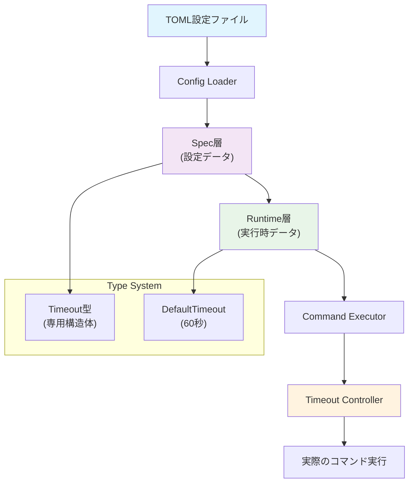
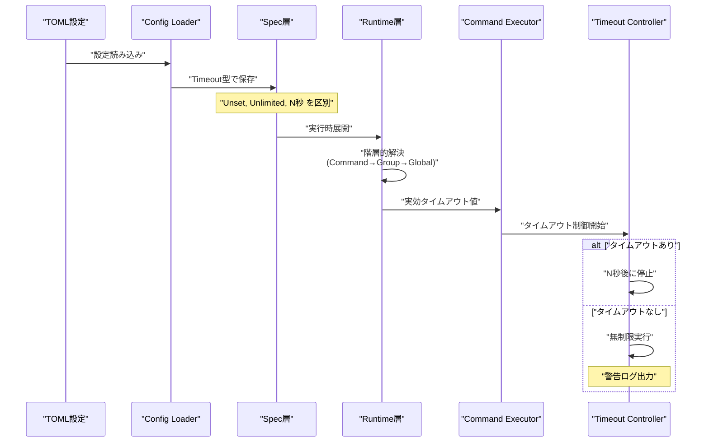
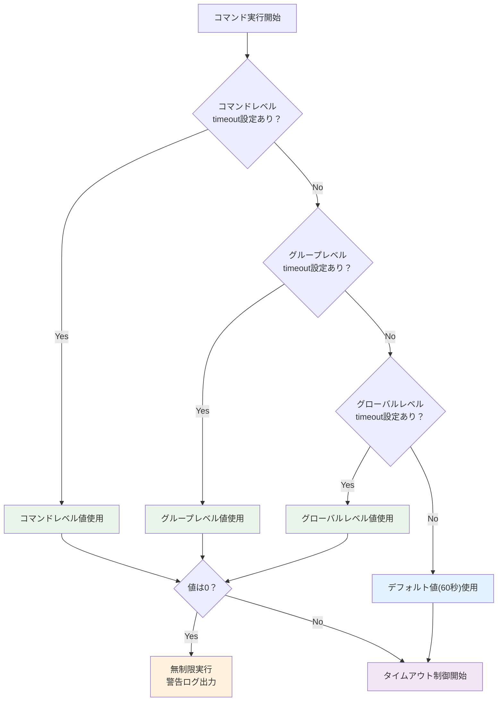
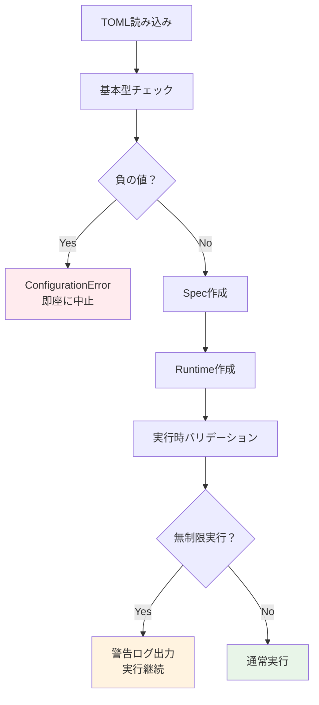
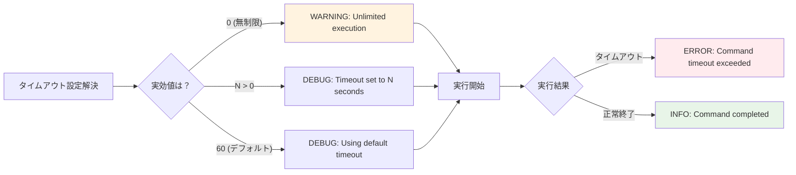
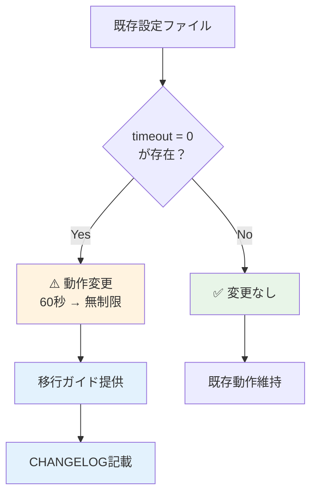
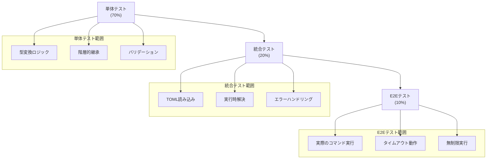

# アーキテクチャ設計書：タイムアウト設定仕様の明確化

## 1. システム概要

このドキュメントでは、go-safe-cmd-runnerにおけるタイムアウト設定の仕様変更のアーキテクチャ設計について説明する。主要な変更点は、TOML設定での「未設定」と「明示的なゼロ」を区別し、より柔軟なタイムアウト制御を提供することである。

## 2. 設計目標

### 2.1. 主要目標
- **設定の明確化**: TOMLで未設定、ゼロ、正の値を明確に区別
- **後方互換性の考慮**: 既存機能への影響を最小化
- **型安全性の向上**: 専用の`Timeout`型によるコンパイル時の型チェック強化
- **実行時安全性**: 無制限実行時の適切な警告とガイダンス

### 2.2. 設計原則
- **明示性**: 設定の意図を明確に表現可能
- **一貫性**: 全階層で統一されたタイムアウト処理
- **拡張性**: 将来の機能追加に対応可能な設計
- **保守性**: 理解しやすく保守しやすいコード構造

## 3. システムアーキテクチャ

### 3.1. 全体アーキテクチャ



### 3.2. データフロー



## 4. 主要コンポーネント設計

### 4.1. 設定層（Spec Layer）

**役割**: TOML設定の静的な表現を保持

**主要な変更点**:
- `Timeout`フィールドを`int`から`common.Timeout`型に変更
- `Timeout`型が3つの状態を明示的に区別:
  - Unset: 未設定（デフォルトまたは親から継承）
  - Unlimited: ゼロ設定（無制限実行）
  - N seconds: 正の値（N秒でタイムアウト）

**影響範囲**:
- `GlobalSpec`
- `GroupSpec` (グループレベル設定がある場合)
- `CommandSpec`

### 4.2. 実行時層（Runtime Layer）

**役割**: 設定の階層的解決と実行時値の提供

**主要な変更点**:
- タイムアウト解決ロジックの強化
- 階層的継承の保持（Command → Group → Global → Default）

**新機能**:
- 実効タイムアウト値の計算
- デフォルト値の適用ロジック

### 4.3. タイムアウト制御層（Timeout Controller）

**役割**: 実際のコマンド実行時のタイムアウト制御

**主要な変更点**:
- ゼロ値（無制限）の特殊処理
- 適切な警告ログの出力

**新機能**:
- 無制限実行時の監視とログ出力

## 5. データ型設計

### 5.1. Timeout型の設計

```mermaid
classDiagram
    class Timeout {
        -value *int
        +NewUnsetTimeout() Timeout
        +NewUnlimitedTimeout() Timeout
        +NewTimeout(seconds int) Timeout
        +IsSet() bool
        +IsUnlimited() bool
        +Value() int
        +UnmarshalTOML(data interface{}) error
    }

    class GlobalSpec {
        +Timeout common.Timeout
        +resolveTimeout() int
    }

    class CommandSpec {
        +Timeout common.Timeout
        +resolveTimeout(parent common.Timeout) int
    }

    class RuntimeGlobal {
        +Spec *GlobalSpec
        +Timeout() int
    }

    class RuntimeCommand {
        +Spec *CommandSpec
        +EffectiveTimeout int
    }

    Timeout --> GlobalSpec
    Timeout --> CommandSpec
    GlobalSpec --> RuntimeGlobal
    CommandSpec --> RuntimeCommand
```

### 5.2. 型変換マッピング

| TOML設定 | Go内部表現 | 実行時解決 | 動作 |
|---------|-----------|-----------|------|
| 設定なし | `Timeout{value: nil}` | `DefaultTimeout` (60) | 60秒でタイムアウト |
| `timeout = 0` | `Timeout{value: &0}` | `0` | 無制限実行 |
| `timeout = 30` | `Timeout{value: &30}` | `30` | 30秒でタイムアウト |

## 6. 階層的継承設計

### 6.1. 継承ロジック



### 6.2. 継承の優先順位

1. **コマンドレベル** (`[[groups.commands]]`の`timeout`)
2. **グループレベル** (`[[groups]]`の`timeout`)
3. **グローバルレベル** (`[global]`の`timeout`)
4. **システムデフォルト** (60秒)

各レベルで「設定あり」は以下を意味する：
- `Timeout.IsSet()`が`true`を返す場合
- `IsUnlimited()`が`true`（無制限）の場合も「設定あり」として扱われる

## 7. エラーハンドリング設計

### 7.1. バリデーション戦略



### 7.2. エラー種別

- **設定エラー**: 負の値、不正な型
- **実行時警告**: 無制限実行の開始
- **タイムアウトエラー**: 制限時間超過

## 8. ログとモニタリング設計

### 8.1. ログ出力戦略



### 8.2. 監視項目

- **設定解決過程**: どのレベルの設定が使用されたか
- **無制限実行**: 長時間実行されているコマンドの監視
- **タイムアウト発生**: 頻発するタイムアウトの検出

## 9. 互換性設計

### 9.1. 破壊的変更の管理



### 9.2. 移行戦略

- **段階的移行**: 既存設定の動作変更を明確に文書化
- **検証ツール**: 設定ファイルの影響分析機能
- **フォールバック**: 緊急時の旧動作復帰手段

## 10. 性能設計

### 10.1. 性能要件

- **設定読み込み**: 既存性能から5%以内の劣化
- **実行時オーバーヘッド**: 1ms以内の追加コスト
- **メモリ使用量**: Timeout型は`*int`と同等のサイズ（8バイト）で無視可能レベル

### 10.2. 最適化ポイント

- **インライン展開**: Timeoutメソッド(`IsSet()`, `IsUnlimited()`, `Value()`)のインライン化
- **事前計算**: 設定解決結果のキャッシュ
- **ゼロコピー**: 可能な限り設定データのコピーを避ける
- **型安全性**: コンパイル時チェックによる実行時エラー削減

## 11. テスト戦略

### 11.1. テストピラミッド



### 11.2. 重要テストケース

- **境界値テスト**: 0, 1, 最大値での動作確認
- **継承テスト**: 全階層組み合わせでの優先順位確認
- **エラーテスト**: 負の値、不正な型での適切なエラー発生
- **パフォーマンステスト**: 大量設定での性能劣化確認

## 12. セキュリティ考慮事項

### 12.1. セキュリティリスク

- **リソース枯渇**: 無制限実行による system resource 消費
- **DoS攻撃**: 意図的な長時間実行設定による攻撃

### 12.2. 対策

- **警告システム**: 無制限実行時の明確な警告
- **監視機能**: 長時間実行プロセスの検出
- **ドキュメント**: 適切な運用ガイドラインの提供

## 13. 実装フェーズ

### 13.1. Phase 1: 基盤変更
- 型定義変更（`*int`導入）
- 基本的な変換ロジック実装

### 13.2. Phase 2: 統合
- TOML読み込み統合
- 階層的継承実装

### 13.3. Phase 3: 検証
- 包括的テスト実装
- パフォーマンス検証

### 13.4. Phase 4: 文書化
- ドキュメント更新
- 移行ガイド作成

## 14. 成功指標

- ✅ 3つのタイムアウトパターンの正確な動作
- ✅ 既存機能の100%互換性（新機能以外）
- ✅ 性能要件の達成
- ✅ 包括的なテストカバレッジ
- ✅ 明確で理解しやすいドキュメント
