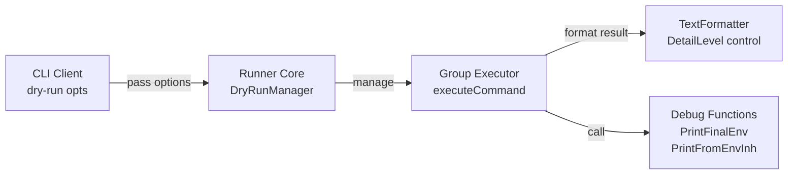
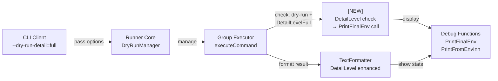
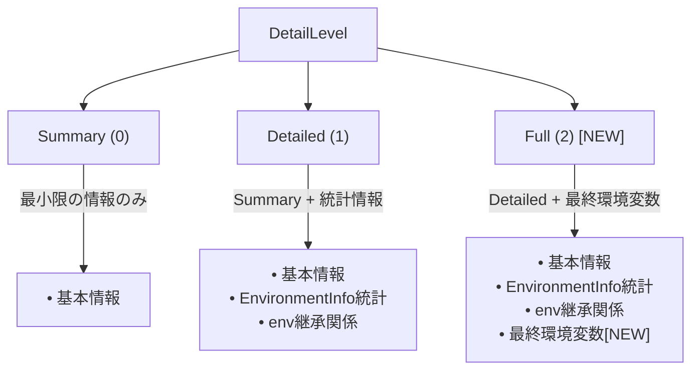
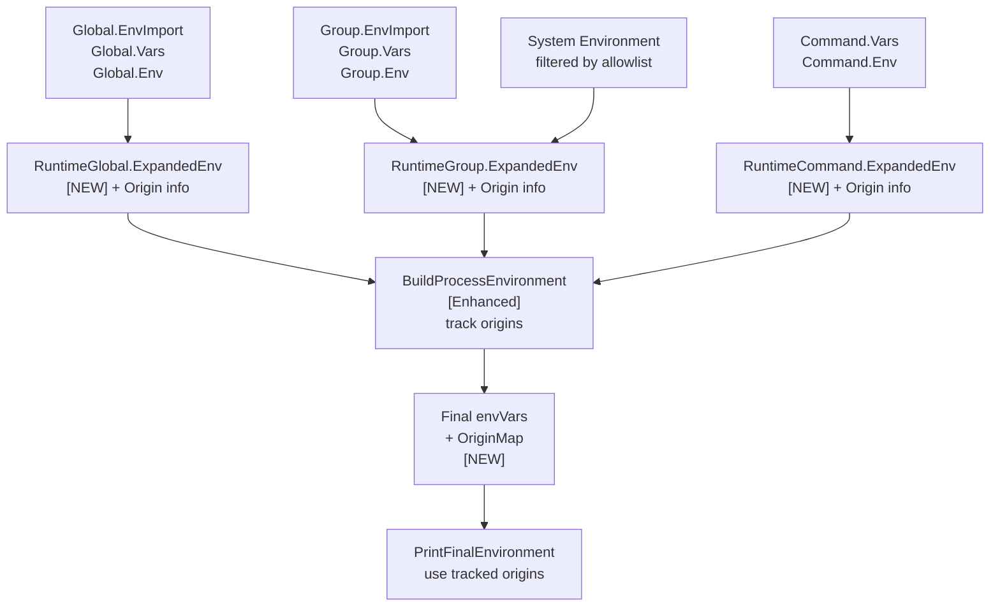
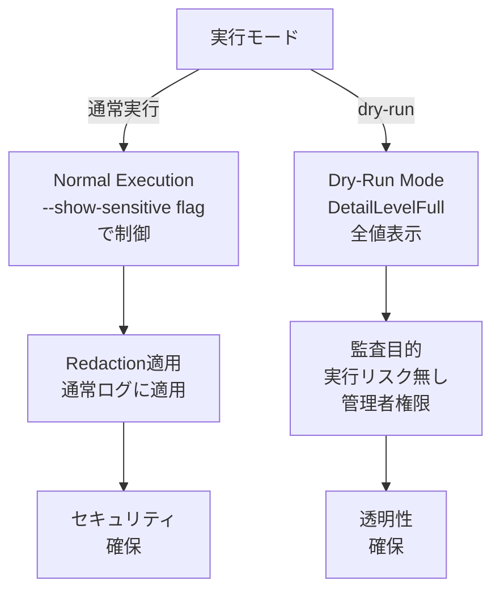
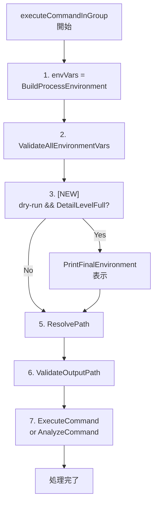

# Dry-Run モードでの最終環境変数表示機能 - アーキテクチャ設計書

## 概要

本ドキュメントは、dry-runモードにおいて`--dry-run-detail=full`オプション使用時に最終環境変数とその出所を表示する機能のアーキテクチャ設計を記述する。

## システム全体構成

### 現在のアーキテクチャ



### 統合後のアーキテクチャ



## コンポーネント設計

### 1. DetailLevel制御フロー

DetailLevelに基づく出力制御の階層構造：

### 2. 統合ポイント設計


#### Group Executor統合ポイント

現在の`executeCommandInGroup`関数に統合する：

```go
func (ge *DefaultGroupExecutor) executeCommandInGroup(
    ctx context.Context,
    cmd *RuntimeCommand,
    groupSpec *GroupSpec,
    runtimeGroup *RuntimeGroup,
    runtimeGlobal *RuntimeGlobal
) (*Result, error) {
    // 1. [Enhanced] 環境変数構築 + origin 追跡
    envVars, origins := executor.BuildProcessEnvironment(runtimeGlobal, runtimeGroup, cmd)

    // 2. [NEW] dry-run且つDetailLevelFullの場合に最終環境変数を表示
    if ge.isDryRun && ge.detailLevel == DetailLevelFull {
        debug.PrintFinalEnvironment(os.Stdout, envVars, origins)
    }

    // 3. 以降の処理 (既存)
    // ...
}
```

**変更点**:
- `BuildProcessEnvironment` が `origins` マップも返すように拡張
- `PrintFinalEnvironment` に `origins` を渡す（global, group, cmd は不要に）

#### TextFormatter統合ポイント

既存のTextFormatterを拡張し、DetailLevelFullでの新しい出力セクションを追加：

```go
func (f *TextFormatter) Format(result *DryRunResult, opts *FormatterOptions) (string, error) {
    // 既存の出力セクション
    // ...

    if opts.DetailLevel == DetailLevelFull {
        f.writeEnvironmentInfo(&buf, result.EnvironmentInfo)  // 既存
        // [NEW] 最終環境変数の詳細は各コマンド実行時に出力されるため、
        // FormatterではEnvironmentInfoの統計情報のみ表示
    }
}
```

### 3. データフロー設計

#### 環境変数データの流れと Origin 追跡

**改善提案**: 現在の `determineOrigin()` 方式ではなく、環境変数展開時に origin を記録する方式に変更する。



#### Origin 追跡の新しいアプローチ

**問題点（現在の `determineOrigin()` 方式）**:
1. **同じ値の場合の誤判定**: 複数レベルで同じ値が設定されていると、どこが実際の出所か判別できない
2. **後処理のオーバーヘッド**: 環境変数構築後に改めて全体を走査する必要がある
3. **不確実性**: 値の比較だけでは確実な追跡ができない

**改善案（Origin 記録方式）**:

```go
// New data structure to track environment variable origins
type EnvOrigin struct {
    Key    string
    Value  string
    Source string  // "System", "Global", "Group[name]", "Command[name]"
}

// Enhanced BuildProcessEnvironment
func BuildProcessEnvironment(
    runtimeGlobal *runnertypes.RuntimeGlobal,
    runtimeGroup *runnertypes.RuntimeGroup,
    cmd *runnertypes.RuntimeCommand,
) (envVars map[string]string, origins map[string]string) {
    result := make(map[string]string)
    origins := make(map[string]string)

    // Step 1: System environment (track as "System")
    systemEnv := getSystemEnvironment()
    allowlist := runtimeGlobal.EnvAllowlist()
    for _, name := range allowlist {
        if value, ok := systemEnv[name]; ok {
            result[name] = value
            origins[name] = "System (filtered by allowlist)"
        }
    }

    // Step 2: Global.ExpandedEnv (track as "Global")
    for k, v := range runtimeGlobal.ExpandedEnv {
        result[k] = v
        origins[k] = "Global"
    }

    // Step 3: Group.ExpandedEnv (track as "Group[name]")
    for k, v := range runtimeGroup.ExpandedEnv {
        result[k] = v
        origins[k] = fmt.Sprintf("Group[%s]", runtimeGroup.Name())
    }

    // Step 4: Command.ExpandedEnv (track as "Command[name]")
    for k, v := range cmd.ExpandedEnv {
        result[k] = v
        origins[k] = fmt.Sprintf("Command[%s]", cmd.Name())
    }

    return result, origins
}
```

**利点**:
1. **確実な追跡**: 展開時にorigin を記録するため、誤判定がない
2. **効率的**: マージ処理と同時に origin を記録するため、後処理不要
3. **シンプル**: 値の比較が不要で、ロジックが単純化される
4. **拡張性**: 将来的に詳細なメタデータ（展開元の変数名など）を追加しやすい
### 4. セキュリティ考慮事項
#### センシティブデータの扱い



**設計方針**:
- dry-runモードでは`--show-sensitive`フラグに関係なく全値を表示
- 理由: 実行前の確認・監査が目的で実際の実行はされない
- セキュリティリスクは通常実行時より低い

## 詳細設計

### 1. Origin 追跡機能の実装

#### 1.1 BuildProcessEnvironment の拡張

**現在のシグネチャ**:
```go
func BuildProcessEnvironment(
    runtimeGlobal *runnertypes.RuntimeGlobal,
    runtimeGroup *runnertypes.RuntimeGroup,
    cmd *runnertypes.RuntimeCommand,
) map[string]string
```

**新しいシグネチャ**:
```go
func BuildProcessEnvironment(
    runtimeGlobal *runnertypes.RuntimeGlobal,
    runtimeGroup *runnertypes.RuntimeGroup,
    cmd *runnertypes.RuntimeCommand,
) (envVars map[string]string, origins map[string]string)
```

**実装詳細**:
```go
func BuildProcessEnvironment(
    runtimeGlobal *runnertypes.RuntimeGlobal,
    runtimeGroup *runnertypes.RuntimeGroup,
    cmd *runnertypes.RuntimeCommand,
) (map[string]string, map[string]string) {
    result := make(map[string]string)
    origins := make(map[string]string)

    // Step 1: System environment variables (filtered by allowlist)
    systemEnv := getSystemEnvironment()
    allowlist := runtimeGlobal.EnvAllowlist()

    for _, name := range allowlist {
        if value, ok := systemEnv[name]; ok {
            result[name] = value
            origins[name] = "System (filtered by allowlist)"
        }
    }

    // Step 2: Global.ExpandedEnv (overrides system env)
    for k, v := range runtimeGlobal.ExpandedEnv {
        result[k] = v
        origins[k] = "Global"
    }

    // Step 3: Group.ExpandedEnv (overrides global env)
    for k, v := range runtimeGroup.ExpandedEnv {
        result[k] = v
        origins[k] = fmt.Sprintf("Group[%s]", runtimeGroup.Name())
    }

    // Step 4: Command.ExpandedEnv (overrides group env)
    for k, v := range cmd.ExpandedEnv {
        result[k] = v
        origins[k] = fmt.Sprintf("Command[%s]", cmd.Name())
    }

    return result, origins
}
```

#### 1.2 PrintFinalEnvironment の改善

**現在のシグネチャ**:
```go
func PrintFinalEnvironment(
    w io.Writer,
    envVars map[string]string,
    global *runnertypes.RuntimeGlobal,
    group *runnertypes.RuntimeGroup,
    cmd *runnertypes.RuntimeCommand,
)
```

**新しいシグネチャ**:
```go
func PrintFinalEnvironment(
    w io.Writer,
    envVars map[string]string,
    origins map[string]string,
)
```

**実装詳細**:
```go
func PrintFinalEnvironment(
    w io.Writer,
    envVars map[string]string,
    origins map[string]string,
) {
    fmt.Fprintf(w, "\n===== Final Process Environment =====\n\n")
    fmt.Fprintf(w, "Environment variables (%d):\n", len(envVars))

    // Sort keys for consistent output
    keys := make([]string, 0, len(envVars))
    for key := range envVars {
        keys = append(keys, key)
    }
    sort.Strings(keys)

    for _, key := range keys {
        value := envVars[key]
        origin := origins[key]

        // Truncate long values for display
        displayValue := value
        if len(value) > 80 {
            displayValue = value[:77] + "..."
        }

        fmt.Fprintf(w, "  %s=%s\n", key, displayValue)
        fmt.Fprintf(w, "    (from %s)\n", origin)
    }

    fmt.Fprintf(w, "\n")
}
```

**削除する関数**:
- `determineOrigin()` - origins マップを使用するため不要

### 2. Group Executor の拡張

#### 現在の構造

```go
type DefaultGroupExecutor struct {
    executor            executor.CommandExecutor
    validator           security.Validator
    verificationManager verification.VerificationManager
    // ...
    isDryRun            bool  // 既存
}
```

#### 拡張後の構造

```go
type DefaultGroupExecutor struct {
    executor            executor.CommandExecutor
    validator           security.Validator
    verificationManager verification.VerificationManager
    // ...
    isDryRun            bool          // 既存
    dryRunDetailLevel   DetailLevel   // [NEW] 追加
}
```

#### executeCommandInGroup の更新

```go
func (ge *DefaultGroupExecutor) executeCommandInGroup(
    ctx context.Context,
    cmd *runnertypes.RuntimeCommand,
    groupSpec *runnertypes.GroupSpec,
    runtimeGroup *runnertypes.RuntimeGroup,
    runtimeGlobal *runnertypes.RuntimeGlobal,
) (*executor.Result, error) {
    // 1. Build process environment with origin tracking
    envVars, origins := executor.BuildProcessEnvironment(
        runtimeGlobal,
        runtimeGroup,
        cmd,
    )

    slog.Debug("Built process environment variables",
        "command", cmd.Name(),
        "group", groupSpec.Name,
        "final_vars_count", len(envVars))

    // 2. Display final environment if dry-run with DetailLevelFull
    if ge.isDryRun && ge.dryRunDetailLevel == DetailLevelFull {
        debug.PrintFinalEnvironment(os.Stdout, envVars, origins)
    }

    // 3. Validate resolved environment variables
    if err := ge.validator.ValidateAllEnvironmentVars(envVars); err != nil {
        return nil, fmt.Errorf("resolved environment variables security validation failed: %w", err)
    }

    // 4. Continue with existing logic...
    // ...
}
```

### 3. 表示タイミング

#### 呼び出し順序



#### 各コマンドでの表示

dry-runモードでは各コマンドの実行前に個別に最終環境変数を表示：

```
Command: setup_database
===== Final Process Environment =====
Environment variables (3):
  DB_HOST=localhost
    (from Global)
  DB_PORT=5432
    (from Group[database])
  DB_NAME=test_db
    (from Command[setup_database])

Command: run_migration
===== Final Process Environment =====
Environment variables (4):
  DB_HOST=localhost
    (from Global)
  DB_PORT=5432
    (from Group[database])
  DB_NAME=production_db
    (from Command[run_migration])
  MIGRATION_DIR=/opt/app/migrations
    (from Command[run_migration])
```

## 非機能要件の実現

### 1. パフォーマンス

#### 最適化ポイント
- `DetailLevelFull`でのみ実行（デフォルトは`DetailLevelDetailed`）
- 環境変数のソート処理は`debug.PrintFinalEnvironment`で実装済み
- 出力は標準出力への直接書き込みで高速

#### 期待性能
- 環境変数100個で1ms以内の表示処理
- メモリ使用量は既存の環境変数構築処理と同等

### 2. 後方互換性

#### API 変更への対応

**BuildProcessEnvironment の変更**:
```go
// Before
envVars := executor.BuildProcessEnvironment(global, group, cmd)

// After
envVars, origins := executor.BuildProcessEnvironment(global, group, cmd)
```

**影響範囲**:
- `internal/runner/group_executor.go`: executeCommandInGroup
- テストコード: BuildProcessEnvironment を呼び出す全てのテスト

**対応方針**:
1. すべての呼び出し箇所を一括更新
2. origins が不要な箇所は `_` で破棄
3. コンパイラエラーで漏れを検出

**PrintFinalEnvironment の変更**:
```go
// Before
debug.PrintFinalEnvironment(w, envVars, global, group, cmd)

// After
debug.PrintFinalEnvironment(w, envVars, origins)
```

**対応方針**:
1. 新しい実装では origins を必須パラメータとする
2. 古い関数シグネチャは削除（使用箇所は限定的）

#### 既存動作の保持
- `DetailLevelSummary`: 変更なし
- `DetailLevelDetailed`: 変更なし (既存の統計情報 + env継承関係)
- `DetailLevelFull`: 新機能追加 (統計情報 + env継承関係 + 最終環境変数)

#### 出力フォーマットの一貫性
- 新しいセクション（`===== Final Process Environment =====`）として追加
- 既存セクションのフォーマットは変更しない

### 3. テスタビリティ

#### 単体テスト

**BuildProcessEnvironment のテスト**:
```go
func TestBuildProcessEnvironment_OriginTracking(t *testing.T) {
    // Setup
    global := createTestRuntimeGlobal(
        []string{"HOME"},
        map[string]string{"GLOBAL_VAR": "global_value"},
    )
    group := createTestRuntimeGroup(
        map[string]string{"GROUP_VAR": "group_value"},
    )
    cmd := createTestRuntimeCommand(
        map[string]string{"CMD_VAR": "cmd_value"},
    )

    // Execute
    envVars, origins := executor.BuildProcessEnvironment(global, group, cmd)

    // Verify origins are correctly tracked
    assert.Equal(t, "System (filtered by allowlist)", origins["HOME"])
    assert.Equal(t, "Global", origins["GLOBAL_VAR"])
    assert.Equal(t, "Group[test_group]", origins["GROUP_VAR"])
    assert.Equal(t, "Command[test_cmd]", origins["CMD_VAR"])

    // Verify values are correct
    assert.Equal(t, "global_value", envVars["GLOBAL_VAR"])
    assert.Equal(t, "group_value", envVars["GROUP_VAR"])
    assert.Equal(t, "cmd_value", envVars["CMD_VAR"])
}

func TestBuildProcessEnvironment_OriginOverride(t *testing.T) {
    // Test that origins are correctly updated when values are overridden
    global := createTestRuntimeGlobal(
        []string{},
        map[string]string{"COMMON": "from_global"},
    )
    group := createTestRuntimeGroup(
        map[string]string{"COMMON": "from_group"},
    )
    cmd := createTestRuntimeCommand(
        map[string]string{"COMMON": "from_command"},
    )

    envVars, origins := executor.BuildProcessEnvironment(global, group, cmd)

    // The final value should be from command
    assert.Equal(t, "from_command", envVars["COMMON"])
    // The origin should reflect the actual source (command)
    assert.Equal(t, "Command[test_cmd]", origins["COMMON"])
}
```

**PrintFinalEnvironment のテスト**:
```go
func TestPrintFinalEnvironment_WithOrigins(t *testing.T) {
    var buf bytes.Buffer

    envVars := map[string]string{
        "VAR1": "value1",
        "VAR2": "value2",
    }
    origins := map[string]string{
        "VAR1": "Global",
        "VAR2": "Command[test]",
    }

    debug.PrintFinalEnvironment(&buf, envVars, origins)

    output := buf.String()
    assert.Contains(t, output, "VAR1=value1")
    assert.Contains(t, output, "(from Global)")
    assert.Contains(t, output, "VAR2=value2")
    assert.Contains(t, output, "(from Command[test])")
}
```

#### 統合テスト
- 各DetailLevelでの出力動作検証
- dry-runモードでの表示内容検証
- 複数コマンドでの個別表示検証
- Origin 追跡の正確性検証

## 実装フェーズ

### Phase 1: BuildProcessEnvironment の拡張
1. `BuildProcessEnvironment` に origin 追跡機能を追加
   - 戻り値を `(map[string]string, map[string]string)` に変更
   - マージ処理と同時に origin を記録
2. 既存の呼び出し箇所を更新
3. 単体テストの作成

### Phase 2: PrintFinalEnvironment の改善
1. シグネチャを `(w, envVars, origins)` に変更
2. `determineOrigin()` 関数を削除（不要になる）
3. origins マップを直接使用する実装に変更
4. 単体テストの更新

### Phase 3: Group Executor統合
1. `DefaultGroupExecutor`にDetailLevel追加
2. `executeCommandInGroup`に統合ポイント実装
3. 基本的な表示機能の動作確認

### Phase 4: テスト実装
1. 統合テストの作成
2. パフォーマンステストの実装
3. エッジケースのテスト

### Phase 5: ドキュメント更新
1. ユーザー向けドキュメントの更新
2. 開発者向けドキュメントの更新
3. リリースノートの作成

## リスクと対策

### 1. API 変更による影響リスク

**リスク**: BuildProcessEnvironment のシグネチャ変更により既存コードが動作しなくなる

**対策**:
- コンパイラエラーで全ての影響箇所を検出可能
- 変更箇所は限定的（主に group_executor.go）
- テストコードの更新も明確
- 一括で変更可能

**移行計画**:
1. BuildProcessEnvironment を先に更新
2. 全ての呼び出し箇所をコンパイラエラーを頼りに更新
3. PrintFinalEnvironment を更新
4. テストを実行して動作確認

### 2. パフォーマンスリスク

**リスク**: origins マップの作成により、わずかなオーバーヘッドが発生

**対策**:
- origins マップの作成コストは map の allocate + 代入のみ（negligible）
- 現在の `determineOrigin()` の後処理走査よりも高速
- DetailLevelFullでのみ表示されるため、デフォルトでは影響なし
- ベンチマークテストで測定・検証

**期待性能**:
- 環境変数100個で追加コスト < 0.1ms
- 現在の方式よりも高速化が期待される

### 3. セキュリティリスク

**リスク**: センシティブな環境変数値の標準出力への表示

**対策**:
- dry-runは実行前確認が目的であることを明記
- 実際のコマンド実行は行われないため、リスクは限定的
- 管理者が慎重に使用することを推奨

### 4. 後方互換性リスク

**リスク**: API変更により既存の統合コードへの影響

**対策**:
- 内部APIの変更であり、外部への影響は限定的
- DetailLevelFullでのみ新機能を追加
- 既存のDetailLevelDetailed出力は変更しない
- 新しいセクションとして分離して追加

## 将来的な拡張性

### 1. Origin メタデータの拡張
現在の origin 文字列を構造化データに拡張可能：

```go
type EnvOrigin struct {
    Source     string  // "System", "Global", "Group", "Command"
    SourceName string  // Group name, Command name
    SourceFile string  // TOML file path (for multi-file configs)
    SourceLine int     // Line number in TOML file
    ExpandedFrom []string  // Variables used in expansion
}

// Usage
origins := make(map[string]*EnvOrigin)
```

**利点**:
- より詳細なトレース情報
- TOML ファイルの該当行へのリンク表示
- 変数展開チェーンの可視化

### 2. 出力フォーマットの拡張
- JSON形式での出力サポート
  ```json
  {
    "environment": {
      "VAR1": {
        "value": "value1",
        "origin": "Global",
        "expanded_from": ["base_dir"]
      }
    }
  }
  ```
- カスタムフォーマッターの追加
- 色付き出力（terminal capabilities に基づく）

### 3. 環境変数フィルタリング
- 特定変数のみ表示するオプション
  ```bash
  --dry-run-detail=full --env-filter="PATH,HOME"
  ```
- パターンマッチによるフィルタリング
  ```bash
  --dry-run-detail=full --env-filter="DB_*"
  ```

### 4. 差分表示機能
- 前回実行との差分表示
- 環境変数変更の履歴管理
- コマンド間での環境変数の違いを強調表示

### 5. 診断機能の強化
- 未使用の環境変数の検出
- 循環参照の警告
- セキュリティリスクのある変数の警告

## まとめ

### 主要な改善点

1. **Origin 追跡方式の変更**
   - 従来: `determineOrigin()` で値比較による推測
   - 改善: 環境変数展開時に origin を記録
   - 利点: 正確性、効率性、シンプルさ

2. **API の変更**
   - `BuildProcessEnvironment`: origins マップも返すように拡張
   - `PrintFinalEnvironment`: origins マップを直接受け取る
   - `determineOrigin()`: 削除（不要になる）

3. **実装の単純化**
   - 値比較による推測ロジックを削除
   - マージ処理と origin 記録を同時に実行
   - 保守性とテスタビリティの向上

### 期待される効果

1. **正確性の向上**
   - 同じ値を持つ環境変数でも正確に origin を識別
   - 誤判定のリスクをゼロに

2. **パフォーマンスの改善**
   - 後処理の走査が不要になり、処理が高速化
   - メモリ使用量は origins マップ分のみ増加（negligible）

3. **保守性の向上**
   - シンプルで直感的なコード
   - バグの発生リスクの低減
   - 将来的な拡張が容易

この設計により、dry-runモードでの最終環境変数表示機能を既存システムに統合し、デバッグ性の向上とセキュリティ監査の支援を確実に実現する。
