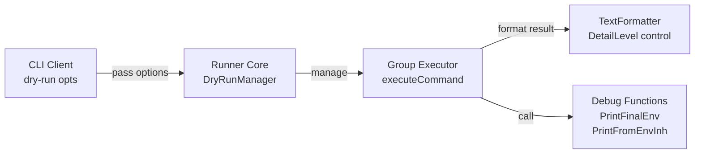
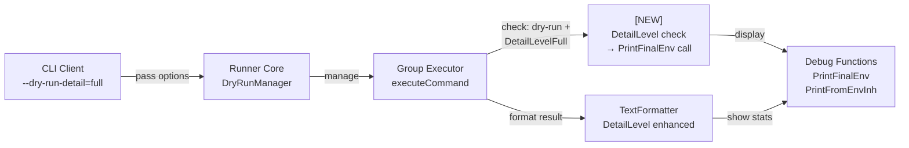
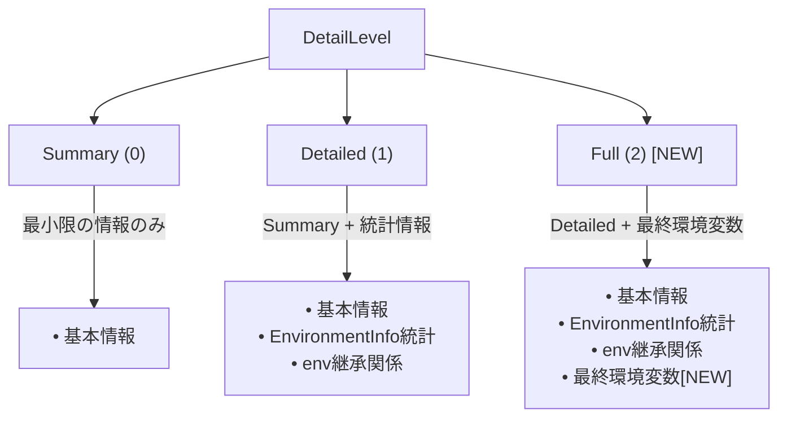
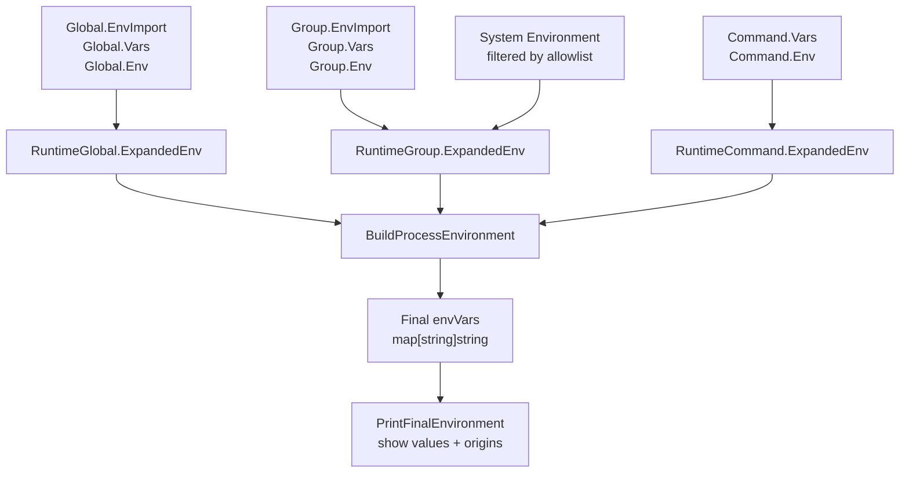
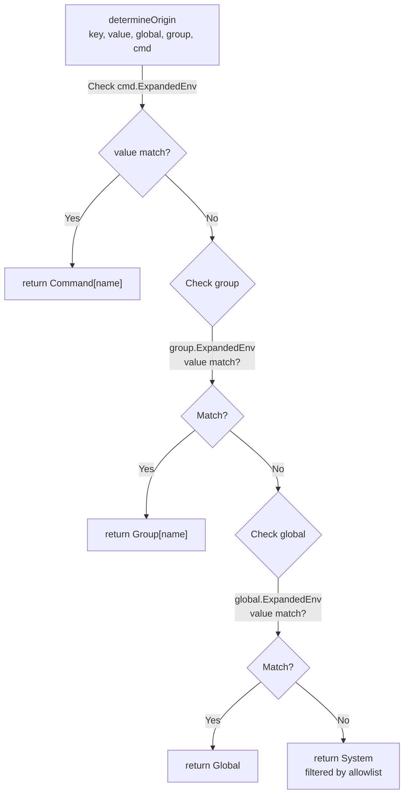
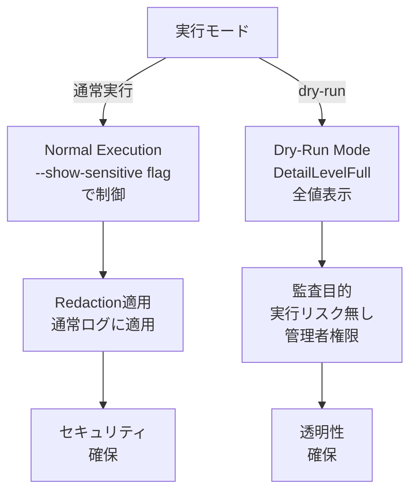
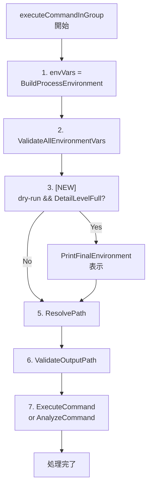

# Dry-Run モードでの最終環境変数表示機能 - アーキテクチャ設計書

## 概要

本ドキュメントは、dry-runモードにおいて`--dry-run-detail=full`オプション使用時に最終環境変数とその出所を表示する機能のアーキテクチャ設計を記述する。

## システム全体構成

### 現在のアーキテクチャ



### 統合後のアーキテクチャ



## コンポーネント設計

### 1. DetailLevel制御フロー

DetailLevelに基づく出力制御の階層構造：

### 2. 統合ポイント設計


#### Group Executor統合ポイント

現在の`executeCommandInGroup`関数に統合する：

```go
func (ge *DefaultGroupExecutor) executeCommandInGroup(
    ctx context.Context,
    cmd *RuntimeCommand,
    groupSpec *GroupSpec,
    runtimeGroup *RuntimeGroup,
    runtimeGlobal *RuntimeGlobal
) (*Result, error) {
    // 1. 環境変数構築 (既存)
    envVars := executor.BuildProcessEnvironment(runtimeGlobal, runtimeGroup, cmd)

    // 2. [NEW] dry-run且つDetailLevelFullの場合に最終環境変数を表示
    if ge.isDryRun && ge.detailLevel == DetailLevelFull {
        debug.PrintFinalEnvironment(os.Stdout, envVars, runtimeGlobal, runtimeGroup, cmd)
    }

    // 3. 以降の処理 (既存)
    // ...
}
```

#### TextFormatter統合ポイント

既存のTextFormatterを拡張し、DetailLevelFullでの新しい出力セクションを追加：

```go
func (f *TextFormatter) Format(result *DryRunResult, opts *FormatterOptions) (string, error) {
    // 既存の出力セクション
    // ...

    if opts.DetailLevel >= resource.DetailLevelDetailed {
        f.writeEnvironmentInfo(&buf, result.EnvironmentInfo)  // 'Detailed' と 'Full' の両方で表示
        // [NOTE] 'Full' レベルで表示される最終環境変数の詳細は各コマンド実行時に出力されるため、
        // FormatterではEnvironmentInfoの統計情報のみ表示します。
    }
}
```

### 3. データフロー設計

#### 環境変数データの流れ



#### 出所判定ロジック


### 4. セキュリティ考慮事項
#### センシティブデータの扱い



**設計方針**:
- dry-runモードでは`--show-sensitive`フラグに関係なく全値を表示
- 理由: 実行前の確認・監査が目的で実際の実行はされない
- セキュリティリスクは通常実行時より低い

## 詳細設計

### 1. Group Executor の拡張

#### 現在の構造

```go
type DefaultGroupExecutor struct {
    executor            executor.CommandExecutor
    validator           security.Validator
    verificationManager verification.VerificationManager
    // ...
    isDryRun            bool  // 既存
}
```

#### 拡張後の構造

```go
type DefaultGroupExecutor struct {
    executor            executor.CommandExecutor
    validator           security.Validator
    verificationManager verification.VerificationManager
    // ...
    isDryRun            bool          // 既存
    dryRunDetailLevel   DetailLevel   // [NEW] 追加
}
```

### 2. PrintFinalEnvironment の活用

既存の`debug.PrintFinalEnvironment`をそのまま活用：

#### 入力パラメータ
- `envVars map[string]string`: BuildProcessEnvironmentの結果
- `global *RuntimeGlobal`: グローバル設定
- `group *RuntimeGroup`: グループ設定
- `cmd *RuntimeCommand`: コマンド設定

#### 出力フォーマット
```
===== Final Process Environment =====

Environment variables (5):
  PATH=/usr/local/bin:/usr/bin:/bin
    (from Global)
  HOME=/home/testuser
    (from System (filtered by allowlist))
  APP_DIR=/opt/myapp
    (from Group[build])
  LOG_FILE=/opt/myapp/logs/app.log
    (from Command[run_tests])
  DEBUG=true
    (from Command[run_tests])
```

### 3. 表示タイミング

#### 呼び出し順序



#### 各コマンドでの表示

dry-runモードでは各コマンドの実行前に個別に最終環境変数を表示：

```
Command: setup_database
===== Final Process Environment =====
Environment variables (3):
  DB_HOST=localhost
    (from Global)
  DB_PORT=5432
    (from Group[database])
  DB_NAME=test_db
    (from Command[setup_database])

Command: run_migration
===== Final Process Environment =====
Environment variables (4):
  DB_HOST=localhost
    (from Global)
  DB_PORT=5432
    (from Group[database])
  DB_NAME=production_db
    (from Command[run_migration])
  MIGRATION_DIR=/opt/app/migrations
    (from Command[run_migration])
```

## 非機能要件の実現

### 1. パフォーマンス

#### 最適化ポイント
- `DetailLevelFull`でのみ実行（デフォルトは`DetailLevelDetailed`）
- 環境変数のソート処理は`debug.PrintFinalEnvironment`で実装済み
- 出力は標準出力への直接書き込みで高速

#### 期待性能
- 環境変数100個で1ms以内の表示処理
- メモリ使用量は既存の環境変数構築処理と同等

### 2. 後方互換性

#### 既存動作の保持
- `DetailLevelSummary`: 変更なし
- `DetailLevelDetailed`: 変更なし (既存の統計情報 + env継承関係)
- `DetailLevelFull`: 新機能追加 (統計情報 + env継承関係 + 最終環境変数)

#### 出力フォーマットの一貫性
- 新しいセクション（`===== Final Process Environment =====`）として追加
- 既存セクションのフォーマットは変更しない

### 3. テスタビリティ

#### 単体テスト
- `debug.PrintFinalEnvironment`の出力内容検証
- 出所判定ロジック（`determineOrigin`）の検証
- 値の切り詰め処理の検証

#### 統合テスト
- 各DetailLevelでの出力動作検証
- dry-runモードでの表示内容検証
- 複数コマンドでの個別表示検証

## 実装フェーズ

### Phase 1: Group Executor拡張
1. `DefaultGroupExecutor`にDetailLevel追加
2. `executeCommandInGroup`に統合ポイント実装
3. 基本的な表示機能の動作確認

### Phase 2: テスト実装
1. 単体テストの作成
2. 統合テストの作成
3. パフォーマンステストの実装

### Phase 3: ドキュメント更新
1. ユーザー向けドキュメントの更新
2. 開発者向けドキュメントの更新
3. リリースノートの作成

## リスクと対策

### 1. パフォーマンスリスク

**リスク**: 環境変数表示処理がdry-runの応答性に影響

**対策**:
- DetailLevelFullでのみ実行（デフォルトでは実行されない）
- 既存の最適化されたPrintFinalEnvironment関数を活用
- ベンチマークテストでパフォーマンス測定

### 2. セキュリティリスク

**リスク**: センシティブな環境変数値の標準出力への表示

**対策**:
- dry-runは実行前確認が目的であることを明記
- 実際のコマンド実行は行われないため、リスクは限定的
- 管理者が慎重に使用することを推奨

### 3. 後方互換性リスク

**リスク**: 既存のdry-run出力パーサーへの影響

**対策**:
- DetailLevelFullでのみ新機能を追加
- 既存のDetailLevelDetailed出力は変更しない
- 新しいセクションとして分離して追加

## 将来的な拡張性

### 1. 出力フォーマットの拡張
- JSON形式での出力サポート
- カスタムフォーマッターの追加

### 2. 環境変数フィルタリング
- 特定変数のみ表示するオプション
- パターンマッチによるフィルタリング

### 3. 履歴・比較機能
- 前回実行との差分表示
- 環境変数変更の履歴管理

## 設計原則

### 1. 単一責任の原則
- 各コンポーネントは明確に定義された役割を持つ
- PrintFinalEnvironmentは表示のみに専念

### 2. 開放閉鎖の原則
- 既存機能を変更せずに新機能を追加
- 拡張可能な設計で将来の要求に対応

### 3. 依存性逆転の原則
- 具体的な実装ではなく抽象に依存
- DetailLevelによる制御で柔軟性を確保

この設計により、dry-runモードでの最終環境変数表示機能を既存システムに統合し、デバッグ性の向上とセキュリティ監査の支援を実現する。
