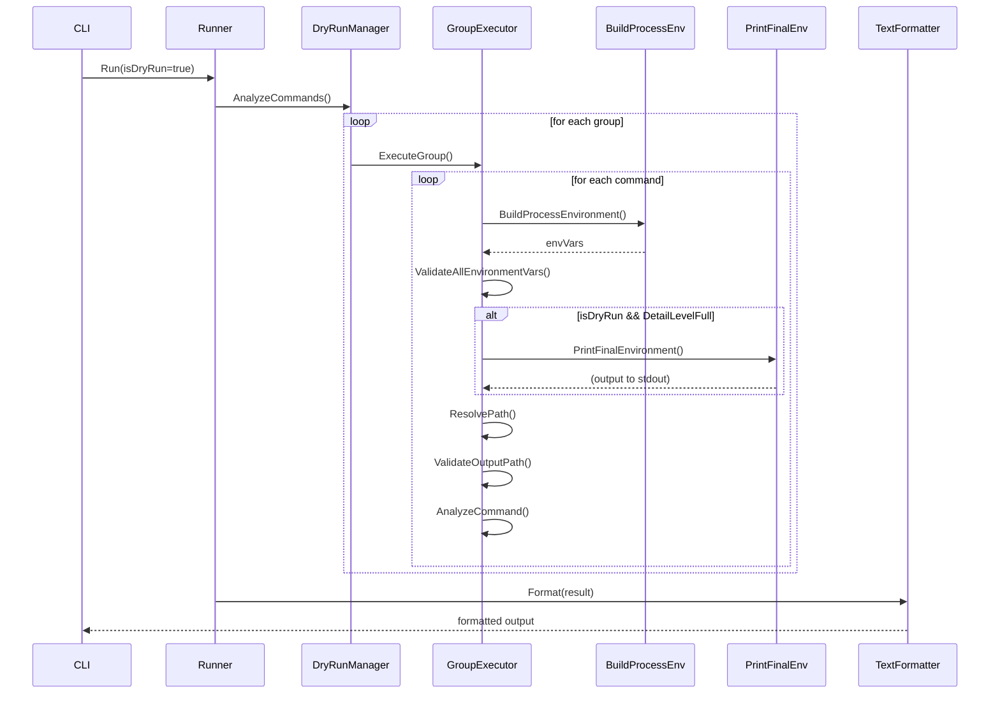
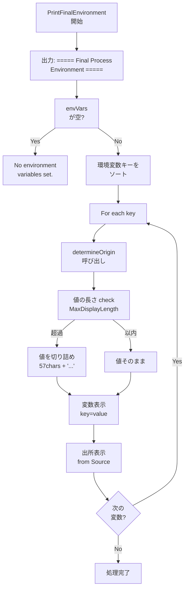
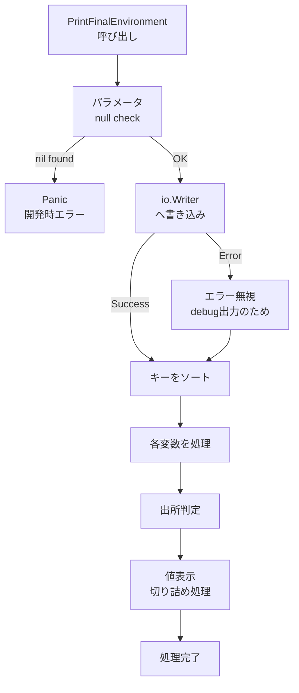
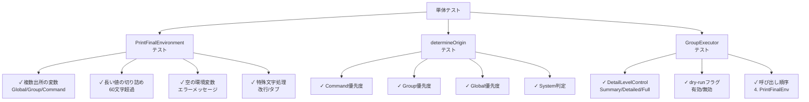
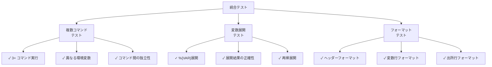
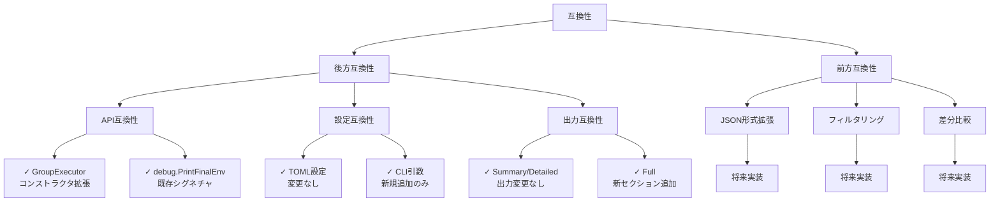

# Dry-Run モードでの最終環境変数表示機能 - 詳細仕様書

## 1. 概要

本ドキュメントは、dry-runモードにおいて`--dry-run-detail=full`オプション使用時に最終環境変数とその出所を表示する機能の詳細実装仕様を記述する。

## 2. 機能仕様

### 2.1 基本機能

#### 2.1.1 最終環境変数表示機能

**機能ID**: `FN-001`
**機能名**: PrintFinalEnvironment統合
**説明**: 既存の`debug.PrintFinalEnvironment`関数をdry-runモードに統合し、各コマンドの実行前に最終環境変数を表示する。

**入力パラメータ**:
```go
type PrintFinalEnvironmentParams struct {
    Writer          io.Writer                    // 出力先 (通常はos.Stdout)
    EnvVars         map[string]string           // BuildProcessEnvironmentの結果
    RuntimeGlobal   *runnertypes.RuntimeGlobal  // グローバル設定
    RuntimeGroup    *runnertypes.RuntimeGroup   // グループ設定
    RuntimeCommand  *runnertypes.RuntimeCommand // コマンド設定
}
```

**出力フォーマット**:
```
===== Final Process Environment =====

Environment variables (N):
  VAR_NAME=value
    (from Source)
  ...
```

**出力例**:
```
===== Final Process Environment =====

Environment variables (5):
  PATH=/usr/local/bin:/usr/bin:/bin
    (from Global)
  HOME=/home/testuser
    (from System (filtered by allowlist))
  APP_DIR=/opt/myapp
    (from Group[build])
  LOG_FILE=/opt/myapp/logs/app.log
    (from Command[run_tests])
  DEBUG=true
    (from Command[run_tests])
```

#### 2.1.2 DetailLevel制御機能

**機能ID**: `FN-002`
**機能名**: DetailLevel統合制御
**説明**: `--dry-run-detail`フラグの値に基づいて、最終環境変数表示の有効/無効を制御する。

**制御ロジック**:
```go
switch detailLevel {
case DetailLevelSummary:    // 最小限の情報のみ
    // 環境変数情報は表示しない
case DetailLevelDetailed:   // 統計情報 + env継承関係
    // EnvironmentInfo統計情報のみ表示 (既存)
    // PrintFromEnvInheritance表示 (既存)
case DetailLevelFull:       // 全詳細情報
    // EnvironmentInfo統計情報表示 (既存)
    // PrintFromEnvInheritance表示 (既存)
    // PrintFinalEnvironment表示 (新機能)
}
```

#### 2.1.3 コマンド単位での表示機能

**機能ID**: `FN-003`
**機能名**: コマンドレベル環境変数表示
**説明**: dry-runモードで各コマンドの実行前に、そのコマンド固有の最終環境変数を表示する。

**表示タイミング**:
```go
func executeCommandInGroup() {
    // 1. 環境変数構築
    envVars := executor.BuildProcessEnvironment(runtimeGlobal, runtimeGroup, cmd)

    // 2. 環境変数検証
    validator.ValidateAllEnvironmentVars(envVars)

    // 3. [NEW] dry-run且つDetailLevelFullの場合に表示
    if isDryRun && detailLevel == DetailLevelFull {
        debug.PrintFinalEnvironment(os.Stdout, envVars, runtimeGlobal, runtimeGroup, cmd)
    }

    // 4. 以降の処理...
}
```

### 2.2 環境変数出所判定仕様

#### 2.2.1 判定ロジック

**機能ID**: `FN-004`
**機能名**: 環境変数出所判定
**説明**: 各環境変数がGlobal/Group/Command/Systemのどのレベルから設定されているかを判定する。

**判定アルゴリズム**:
```go
func determineOrigin(key, value string, global, group, cmd) string {
    // 優先度順で判定
    if cmd.ExpandedEnv[key] == value {
        return fmt.Sprintf("Command[%s]", cmd.Name())
    }
    if group.ExpandedEnv[key] == value {
        return fmt.Sprintf("Group[%s]", group.Name())
    }
    if global.ExpandedEnv[key] == value {
        return "Global"
    }
    return "System (filtered by allowlist)"
}
```

**判定ルール**:
1. **Command優先**: CommandのExpandedEnvに存在し、値が一致する場合
2. **Group次点**: GroupのExpandedEnvに存在し、値が一致する場合
3. **Global次点**: GlobalのExpandedEnvに存在し、値が一致する場合
4. **System最後**: 上記以外はSystem環境変数（allowlistでフィルタ済み）

#### 2.2.2 出所表示フォーマット

**System環境変数**:
```
HOME=/home/user
  (from System (filtered by allowlist))
```

**Global設定**:
```
APP_ENV=production
  (from Global)
```

**Group設定**:
```
DB_HOST=db.example.com
  (from Group[database])
```

**Command設定**:
```
DEBUG=true
  (from Command[run_tests])
```

### 2.3 値表示仕様

#### 2.3.1 長い値の切り詰め

**機能ID**: `FN-005`
**機能名**: 長い値の切り詰め表示
**説明**: 環境変数の値が長い場合、読みやすさのために切り詰めて表示する。

**仕様**:
- 最大表示長: `MaxDisplayLength = 60`文字
- 省略記号長: `EllipsisLength = 3`文字（"..."）
- 切り詰め条件: `len(value) > MaxDisplayLength`
- 切り詰め処理: `value[:MaxDisplayLength-EllipsisLength] + "..."`

**実装例**:
```go
displayValue := value
if len(displayValue) > debug.MaxDisplayLength {
    displayValue = displayValue[:debug.MaxDisplayLength-debug.EllipsisLength] + "..."
}
```

**出力例**:
```
VERY_LONG_PATH=/usr/local/very/long/path/that/exceeds/the/limit/an...
  (from Global)
```

#### 2.3.2 特殊文字の処理

**機能ID**: `FN-006`
**機能名**: 特殊文字表示処理
**説明**: 環境変数の値に含まれる特殊文字を適切に表示する。

**処理方針**:
- 改行文字: そのまま表示（値に含まれる場合）
- タブ文字: そのまま表示
- 非表示文字: エスケープしない（dry-runは監査目的のため、実際の値を表示）

## 3. API仕様

### 3.1 Group Executor拡張

#### 3.1.1 DefaultGroupExecutor構造体拡張

**現在の構造**:
```go
type DefaultGroupExecutor struct {
    executor            executor.CommandExecutor
    validator           security.Validator
    verificationManager verification.VerificationManager
    isDryRun            bool
}
```

**拡張後の構造**:
```go
type DefaultGroupExecutor struct {
    executor            executor.CommandExecutor
    validator           security.Validator
    verificationManager verification.VerificationManager
    isDryRun            bool
    dryRunDetailLevel   resource.DetailLevel  // [NEW] 追加
}
```

#### 3.1.2 コンストラクタ拡張

**現在のシグネチャ**:
```go
func NewDefaultGroupExecutor(
    exec executor.CommandExecutor,
    validator security.Validator,
    verificationMgr verification.VerificationManager,
    isDryRun bool,
) GroupExecutor
```

**拡張後のシグネチャ**:
```go
func NewDefaultGroupExecutor(
    exec executor.CommandExecutor,
    validator security.Validator,
    verificationMgr verification.VerificationManager,
    isDryRun bool,
    detailLevel resource.DetailLevel,  // [NEW] 追加
) GroupExecutor
```

#### 3.1.3 executeCommandInGroup拡張

**統合ポイント**:
```go
func (ge *DefaultGroupExecutor) executeCommandInGroup(
    ctx context.Context,
    cmd *runnertypes.RuntimeCommand,
    groupSpec *runnertypes.GroupSpec,
    runtimeGroup *runnertypes.RuntimeGroup,
    runtimeGlobal *runnertypes.RuntimeGlobal,
) (*executor.Result, error) {

    // 1. 環境変数構築 (既存)
    envVars := executor.BuildProcessEnvironment(runtimeGlobal, runtimeGroup, cmd)

    // 2. 環境変数検証 (既存)
    if err := ge.validator.ValidateAllEnvironmentVars(envVars); err != nil {
        return nil, fmt.Errorf("resolved environment variables security validation failed: %w", err)
    }

    // 3. [NEW] 最終環境変数表示
    if ge.isDryRun && ge.dryRunDetailLevel == resource.DetailLevelFull {
        debug.PrintFinalEnvironment(os.Stdout, envVars, runtimeGlobal, runtimeGroup, cmd)
    }

    // 4. 以降の既存処理...
    // パス解決、出力パス検証、コマンド実行/分析
}
```

### 3.2 Debug Package API

#### 3.2.1 PrintFinalEnvironment関数

**既存のシグネチャ** (変更なし):
```go
func PrintFinalEnvironment(
    w io.Writer,
    envVars map[string]string,
    global *runnertypes.RuntimeGlobal,
    group *runnertypes.RuntimeGroup,
    cmd *runnertypes.RuntimeCommand,
)
```

**パラメータ詳細**:
- `w`: 出力先ライター（通常は`os.Stdout`）
- `envVars`: `executor.BuildProcessEnvironment`の結果
- `global`: 展開済みグローバル設定
- `group`: 展開済みグループ設定
- `cmd`: 展開済みコマンド設定

#### 3.2.2 determineOrigin関数

**既存のシグネチャ** (変更なし):
```go
func determineOrigin(
    key, value string,
    global *runnertypes.RuntimeGlobal,
    group *runnertypes.RuntimeGroup,
    cmd *runnertypes.RuntimeCommand,
) string
```

**戻り値の種類**:
- `"Command[{name}]"`: コマンドレベルの設定
- `"Group[{name}]"`: グループレベルの設定
- `"Global"`: グローバルレベルの設定
- `"System (filtered by allowlist)"`: システム環境変数

### 3.3 Resource Package API

#### 3.3.1 DetailLevel定数

**既存の定義** (変更なし):
```go
type DetailLevel int

const (
    DetailLevelSummary DetailLevel = iota  // 0
    DetailLevelDetailed                    // 1
    DetailLevelFull                        // 2
)
```

#### 3.3.2 TextFormatter拡張

**DetailLevelFull処理の拡張**:
```go
func (f *TextFormatter) Format(result *DryRunResult, opts *FormatterOptions) (string, error) {
    // 既存のセクション出力...

    switch opts.DetailLevel {
    case DetailLevelDetailed, DetailLevelFull:
        // env継承関係表示 (既存)

    case DetailLevelFull:
        // 環境変数統計情報表示 (既存)
        f.writeEnvironmentInfo(&buf, result.EnvironmentInfo)

        // NOTE: 最終環境変数の詳細は各コマンド実行時に
        // PrintFinalEnvironmentで出力されるため、
        // FormatterではEnvironmentInfoの統計のみ表示
    }
}
```

## 4. 呼び出しシーケンス

### 4.1 dry-run実行時のシーケンス



### 4.2 PrintFinalEnvironment内部シーケンス



## 5. エラーハンドリング

### 5.1 エラーケースの処理フロー



### 5.2 エラーケース

#### 5.2.1 パラメータエラー

**ケース**: nil パラメータ
```go
if envVars == nil || global == nil || group == nil || cmd == nil {
    // panic処理 (debug関数のため)
    panic("PrintFinalEnvironment: required parameters must not be nil")
}
```

**対応**: debug関数のため、開発時エラーとしてpanicで処理

#### 5.2.2 出力エラー

**ケース**: io.Writer への書き込み失敗
```go
if _, err := fmt.Fprintf(w, "..."); err != nil {
    // エラーは無視 (debug出力のため)
    // アプリケーションの実行には影響しない
}
```

**対応**: debug出力のエラーはアプリケーション実行に影響させない

### 5.3 エラーロギング

```go
// dry-run分析中のエラーは通常のログシステムに記録
slog.Debug("Failed to print final environment",
    "command", cmd.Name(),
    "group", group.Name(),
    "error", err)
```

## 6. テスト仕様

### 6.1 単体テスト

#### 6.1.1 テストケースマトリックス



#### 6.1.2 PrintFinalEnvironment テスト

**テストケース**:

1. **正常ケース - 複数出所の環境変数**
   ```go
   func TestPrintFinalEnvironment_MultipleOrigins(t *testing.T) {
       // Global、Group、Command、System各レベルの変数を設定
       // 出力フォーマットと出所判定を検証
   }
   ```

2. **長い値の切り詰めテスト**
   ```go
   func TestPrintFinalEnvironment_LongValue(t *testing.T) {
       // 60文字を超える値で切り詰めを検証
       // "..." の追加を確認
   }
   ```

3. **出所判定テスト**
   ```go
   func TestDetermineOrigin_AllSources(t *testing.T) {
       // Command、Group、Global、Systemの各出所を検証
       // 優先度順の判定ロジックを確認
   }
   ```

4. **空の環境変数テスト**
   ```go
   func TestPrintFinalEnvironment_EmptyEnv(t *testing.T) {
       // 環境変数がない場合の出力を検証
   }
   ```

#### 6.1.3 Group Executor テスト

**テストケース**:

1. **DetailLevel制御テスト**
   ```go
   func TestExecuteCommandInGroup_DetailLevelControl(t *testing.T) {
       // DetailLevelSummary: PrintFinalEnvironment呼び出しなし
       // DetailLevelDetailed: PrintFinalEnvironment呼び出しなし
       // DetailLevelFull: PrintFinalEnvironment呼び出しあり
   }
   ```

2. **dry-run vs 通常実行テスト**
   ```go
   func TestExecuteCommandInGroup_DryRunControl(t *testing.T) {
       // dry-run=false: PrintFinalEnvironment呼び出しなし
       // dry-run=true: DetailLevelに応じた制御
   }
   ```

### 6.2 統合テスト

#### 6.2.1 E2Eテストマトリックス



#### 6.2.2 E2E テスト

**テストケース**:

1. **複数コマンド実行テスト**
   ```go
   func TestDryRunFinalEnv_MultipleCommands(t *testing.T) {
       // 複数コマンドそれぞれで環境変数表示を検証
       // コマンドごとの異なる環境変数設定を確認
   }
   ```

2. **変数展開テスト**
   ```go
   func TestDryRunFinalEnv_VariableExpansion(t *testing.T) {
       // %{VAR}形式の変数展開結果を検証
       // 展開後の値が正しく表示されることを確認
   }
   ```

3. **出力フォーマットテスト**
   ```go
   func TestDryRunFinalEnv_OutputFormat(t *testing.T) {
       // 実際のCLI実行結果のフォーマットを検証
       // ヘッダー、変数行、出所行の形式確認
   }
   ```

#### 6.2.3 パフォーマンステスト

**ベンチマークテスト**:
```go
func BenchmarkPrintFinalEnvironment(b *testing.B) {
    // 環境変数100個での表示処理時間を測定
    // 目標: 1ms以内
}

func BenchmarkDryRunWithDetailLevelFull(b *testing.B) {
    // DetailLevelFull dry-run全体の性能測定
    // PrintFinalEnvironmentがボトルネックにならないことを確認
}
```

### 6.3 テストデータ

#### 6.3.1 環境変数テストデータ

```go
var testEnvData = map[string]string{
    "PATH":     "/usr/local/bin:/usr/bin:/bin",                    // System
    "APP_ENV":  "test",                                           // Global
    "DB_HOST":  "localhost",                                      // Group
    "DEBUG":    "true",                                           // Command
    "LONG_VAR": "very_long_value_that_exceeds_sixty_characters...", // 切り詰めテスト用
}

var testRuntimeData = struct {
    Global  *runnertypes.RuntimeGlobal
    Group   *runnertypes.RuntimeGroup
    Command *runnertypes.RuntimeCommand
}{
    // テスト用のRuntime構造体を初期化
}
```

## 7. パフォーマンス要件

### 7.1 性能基準

#### 7.1.1 応答時間

- **PrintFinalEnvironment**: 環境変数100個で1ms以内
- **determineOrigin**: 1変数あたり0.01ms以内
- **dry-run全体**: 既存性能の110%以内（10%以下の劣化）

#### 7.1.2 メモリ使用量

- **追加メモリ**: 既存処理の5%以下の追加使用量
- **一時オブジェクト**: 環境変数キーのソート用配列のみ

### 7.2 最適化施策

#### 7.2.1 ソート最適化

```go
// 環境変数キーのソートを最適化
keys := make([]string, 0, len(envVars))  // 事前に容量確保
for k := range envVars {
    keys = append(keys, k)
}
sort.Strings(keys)  // Go標準の最適化されたソート
```

#### 7.2.2 文字列処理最適化

```go
// 文字列切り詰め処理の最適化
if len(displayValue) > MaxDisplayLength {
    // サブストリングで効率的に切り詰め
    displayValue = displayValue[:MaxDisplayLength-EllipsisLength] + "..."
}
```

## 8. セキュリティ要件

### 8.1 センシティブデータ取り扱いフロー

```mermaid
graph TD
    RUN_MODE["実行モード判定"]

    RUN_MODE -->|通常実行| NRM["Normal Execution"]
    RUN_MODE -->|dry-run| DRY["Dry-Run Mode"]

    NRM --> SF{show-sensitive<br/>フラグ?}
    SF -->|true| SHOW_ALL["全値表示<br/>通常実行]
    SF -->|false| REDACT["Redaction適用<br/>センシティブ値隠蔽"]

    DRY --> AUDIT["監査目的<br/>実行なし"]
    AUDIT --> SHOW_DRYRUN["全値表示<br/>dry-run用"]

    SHOW_ALL --> LOG1["アプリケーション<br/>ログ出力"]
    REDACT --> LOG2["標準出力/ログ"]
    SHOW_DRYRUN --> OUT["標準出力のみ<br/>（audit用）"]

    LOG1 --> RES1["セキュリティ確保"]
    LOG2 --> RES1
    OUT --> RES2["監査記録"]
```

**基本方針**:
- dry-runモード: セキュリティ監査目的で全ての環境変数を表示
- 理由:
  - 実行前の確認・監査が主目的
  - 実際のコマンド実行は行われない
  - セキュリティリスクは通常実行より低い

#### 8.1.2 表示制御

```go
// dry-runモードでは --show-sensitive フラグに関係なく表示
if isDryRun {
    // 全ての環境変数を表示（監査目的）
    debug.PrintFinalEnvironment(os.Stdout, allEnvVars, global, group, cmd)
} else {
    // 通常実行では既存のredaction機能を適用
    // （本機能の対象外）
}
```

#### 8.1.3 ドキュメント化

**ユーザーへの注意事項**:
- dry-runモードではセンシティブな値も表示される
- 本番環境での使用時は出力の取り扱いに注意
- ログファイルへの記録時は適切な権限設定が必要

### 8.2 アクセス制御

**出力先**: 標準出力のみ（ファイルへの直接出力はしない）
**権限**: 実行ユーザーの権限で動作
**ログ**: 通常のアプリケーションログには記録しない

## 9. 運用要件

### 9.1 ログ出力

#### 9.1.1 デバッグログ

```go
// 環境変数表示機能の実行状況をログ記録
slog.Debug("Printing final environment variables",
    "command", cmd.Name(),
    "group", group.Name(),
    "detail_level", detailLevel.String(),
    "env_vars_count", len(envVars))
```

#### 9.1.2 エラーログ

```go
// 出力エラーが発生した場合（通常は発生しない）
slog.Warn("Failed to print final environment variables",
    "command", cmd.Name(),
    "error", err)
```

### 9.2 設定管理

#### 9.2.1 DetailLevel設定

**CLI引数**: `--dry-run-detail={summary|detailed|full}`
**デフォルト**: `detailed`（既存の動作を維持）
**新機能**: `full`でのみ最終環境変数を表示

#### 9.2.2 定数設定

```go
// internal/runner/debug/constants.go
const (
    MaxDisplayLength = 60  // 最大表示文字数
    EllipsisLength   = 3   // "..."の長さ
)
```

### 9.3 モニタリング

#### 9.3.1 パフォーマンス監視

```go
// 性能監視用のメトリクス (必要に応じて)
func PrintFinalEnvironment(...) {
    start := time.Now()
    defer func() {
        duration := time.Since(start)
        slog.Debug("PrintFinalEnvironment duration",
            "duration_ms", duration.Milliseconds(),
            "env_vars_count", len(envVars))
    }()

    // 実際の処理...
}
```

## 10. 互換性要件

### 10.1 互換性マトリックス



#### 10.1.1 既存API互換性

- **Group Executorコンストラクタ**: パラメータ追加（DetailLevel）
- **既存のdry-run出力**: DetailLevelSummary/Detailedは変更なし
- **debug.PrintFinalEnvironment**: 既存シグネチャを維持

#### 10.1.2 設定ファイル互換性

- **TOML設定**: 変更なし
- **CLI引数**: `--dry-run-detail=full`オプション追加のみ
- **デフォルト動作**: 既存の`--dry-run-detail=detailed`を維持

### 10.2 前方互換性

#### 10.2.1 将来の拡張

- **JSON出力形式**: `--dry-run-format=json`（将来実装予定）
- **フィルタリング**: 環境変数の選択的表示
- **比較機能**: 前回結果との差分表示

#### 10.2.2 設計の拡張性

```go
// 将来の拡張を考慮したインターフェース設計
type EnvironmentDisplayer interface {
    DisplayFinalEnvironment(context.Context, EnvironmentDisplayParams) error
}

type EnvironmentDisplayParams struct {
    Format      DisplayFormat  // text, json, etc.
    Filter      EnvFilter      // 表示対象のフィルタ
    Comparison  ComparisonMode // 差分表示モード
}
```

## 11. 実装チェックリスト

### 11.1 コード変更

- [ ] `DefaultGroupExecutor`にDetailLevel追加
- [ ] `executeCommandInGroup`にPrintFinalEnvironment呼び出し追加
- [ ] コンストラクタパラメータ追加
- [ ] 既存のdebug.PrintFinalEnvironment動作確認

### 11.2 テスト実装

- [ ] PrintFinalEnvironment単体テスト
- [ ] determineOrigin単体テスト
- [ ] DetailLevel制御テスト
- [ ] E2E統合テスト
- [ ] パフォーマンステスト

### 11.3 ドキュメント

- [ ] APIドキュメント更新
- [ ] ユーザーガイド更新
- [ ] セキュリティに関する注意事項追加
- [ ] パフォーマンス特性の文書化

### 11.4 品質保証

- [ ] 全テストケースのパス
- [ ] ベンチマークテスト基準達成
- [ ] コードレビュー完了
- [ ] セキュリティレビュー完了

この詳細仕様書に基づいて、dry-runモードでの最終環境変数表示機能を安全かつ効率的に実装できる。
