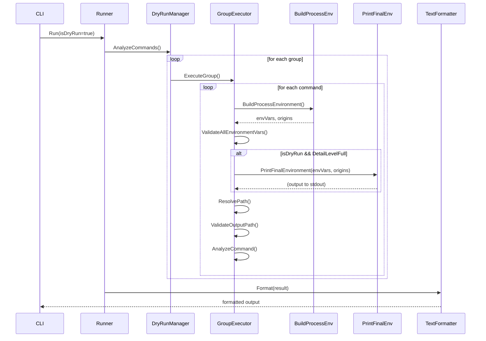
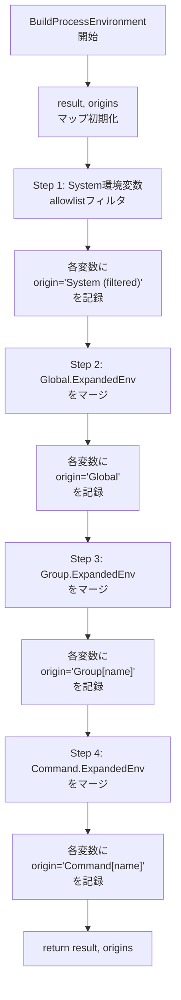
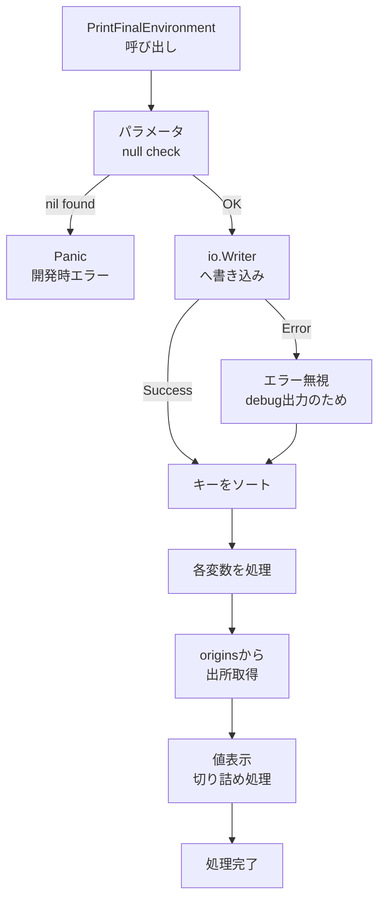
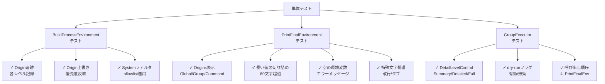
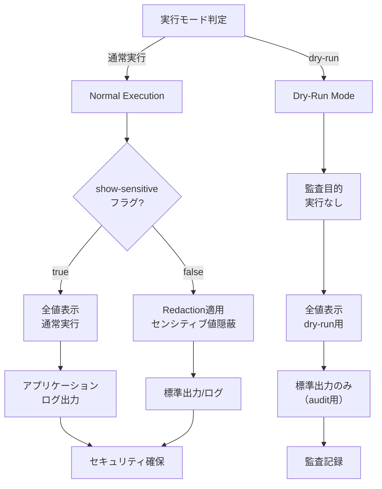

# Dry-Run モードでの最終環境変数表示機能 - 詳細仕様書

## 1. 概要

本ドキュメントは、dry-runモードにおいて`--dry-run-detail=full`オプション使用時に最終環境変数とその出所を表示する機能の詳細実装仕様を記述する。

## 2. 機能仕様

### 2.1 基本機能

#### 2.1.1 最終環境変数表示機能

**機能ID**: `FN-001`
**機能名**: PrintFinalEnvironment統合
**説明**: 既存の`debug.PrintFinalEnvironment`関数をdry-runモードに統合し、各コマンドの実行前に最終環境変数を表示する。

**入力パラメータ**:
```go
type PrintFinalEnvironmentParams struct {
    Writer  io.Writer            // 出力先 (通常はos.Stdout)
    EnvVars map[string]string    // BuildProcessEnvironmentの結果（環境変数マップ）
    Origins map[string]string    // BuildProcessEnvironmentの結果（originsマップ）
}
```

**出力フォーマット**:
```
===== Final Process Environment =====

Environment variables (N):
  VAR_NAME=value
    (from Source)
  ...
```

**出力例**:
```
===== Final Process Environment =====

Environment variables (5):
  PATH=/usr/local/bin:/usr/bin:/bin
    (from Global)
  HOME=/home/testuser
    (from System (filtered by allowlist))
  APP_DIR=/opt/myapp
    (from Group[build])
  LOG_FILE=/opt/myapp/logs/app.log
    (from Command[run_tests])
  DEBUG=true
    (from Command[run_tests])
```

#### 2.1.2 DetailLevel制御機能

**機能ID**: `FN-002`
**機能名**: DetailLevel統合制御
**説明**: `--dry-run-detail`フラグの値に基づいて、最終環境変数表示の有効/無効を制御する。

**制御ロジック**:
```go
// DetailLevelSummary: 最小限の情報のみ（環境変数情報は表示しない）

if detailLevel >= DetailLevelDetailed {
    // EnvironmentInfo統計情報のみ表示 (既存)
    // PrintFromEnvInheritance表示 (既存)
}

if detailLevel == DetailLevelFull {
    // PrintFinalEnvironment表示 (新機能)
}
```

#### 2.1.3 コマンド単位での表示機能

**機能ID**: `FN-003`
**機能名**: コマンドレベル環境変数表示
**説明**: dry-runモードで各コマンドの実行前に、そのコマンド固有の最終環境変数を表示する。

**表示タイミング**:
```go
func executeCommandInGroup() {
    // 1. 環境変数構築 + origin 追跡
    envVars, origins := executor.BuildProcessEnvironment(runtimeGlobal, runtimeGroup, cmd)

    // 2. 環境変数検証
    validator.ValidateAllEnvironmentVars(envVars)

    // 3. [NEW] dry-run且つDetailLevelFullの場合に表示
    if isDryRun && detailLevel == DetailLevelFull {
        debug.PrintFinalEnvironment(os.Stdout, envVars, origins)
    }

    // 4. 以降の処理...
}
```

### 2.2 環境変数出所判定仕様

#### 2.2.1 Origin追跡ロジック

**機能ID**: `FN-004`
**機能名**: 環境変数Origin追跡
**説明**: 各環境変数がGlobal/Group/Command/Systemのどのレベルから設定されているかを、構築時に記録する。

**Origin記録アルゴリズム**:
```go
func BuildProcessEnvironment(global, group, cmd) (map[string]string, map[string]string) {
    result := make(map[string]string)
    origins := make(map[string]string)

    // Step 1: System環境変数 (allowlistフィルタ後)
    for _, name := range allowlist {
        if value, ok := systemEnv[name]; ok {
            result[name] = value
            origins[name] = "System (filtered by allowlist)"
        }
    }

    // Step 2: Global.ExpandedEnv (上書き + origin記録)
    for k, v := range global.ExpandedEnv {
        result[k] = v
        origins[k] = "Global"
    }

    // Step 3: Group.ExpandedEnv (上書き + origin記録)
    for k, v := range group.ExpandedEnv {
        result[k] = v
        origins[k] = fmt.Sprintf("Group[%s]", group.Name())
    }

    // Step 4: Command.ExpandedEnv (上書き + origin記録)
    for k, v := range cmd.ExpandedEnv {
        result[k] = v
        origins[k] = fmt.Sprintf("Command[%s]", cmd.Name())
    }

    return result, origins
}
```

**旧方式との比較**:

| 項目 | 旧方式 (determineOrigin) | 新方式 (Origins map) |
|------|-------------------------|---------------------|
| タイミング | 後処理（表示時） | 構築時 |
| 方法 | 値の比較による推測 | 直接記録 |
| 正確性 | 同じ値の場合に誤判定リスク | 常に正確 |
| 効率性 | 全レベルを走査 | 記録のみ |
| 保守性 | 複雑なロジック | シンプルな実装 |

**判定結果の種類**:
- `"Command[{name}]"`: コマンドレベルの設定
- `"Group[{name}]"`: グループレベルの設定
- `"Global"`: グローバルレベルの設定
- `"System (filtered by allowlist)"`: システム環境変数

**Origin取得方法**:
```go
// 表示時は単にマップから取得するだけ
origin := origins[key]
```

#### 2.2.2 出所表示フォーマット

**System環境変数**:
```
HOME=/home/user
  (from System (filtered by allowlist))
```

**Global設定**:
```
APP_ENV=production
  (from Global)
```

**判定ルール**:
1. **Command優先**: CommandのExpandedEnvに存在し、値が一致する場合
2. **Group次点**: GroupのExpandedEnvに存在し、値が一致する場合
3. **Global次点**: GlobalのExpandedEnvに存在し、値が一致する場合
4. **System最後**: 上記以外はSystem環境変数（allowlistでフィルタ済み）

#### 2.2.2 出所表示フォーマット

**System環境変数**:
```
HOME=/home/user
  (from System (filtered by allowlist))
```

**Global設定**:
```
APP_ENV=production
  (from Global)
```

**Group設定**:
```
DB_HOST=db.example.com
  (from Group[database])
```

**Command設定**:
```
DEBUG=true
  (from Command[run_tests])
```

### 2.3 値表示仕様

#### 2.3.1 長い値の切り詰め

**機能ID**: `FN-005`
**機能名**: 長い値の切り詰め表示
**説明**: 環境変数の値が長い場合、読みやすさのために切り詰めて表示する。

**仕様**:
- 最大表示長: `MaxDisplayLength = 60`文字
- 省略記号長: `EllipsisLength = 3`文字（"..."）
- 切り詰め条件: `len(value) > MaxDisplayLength`
- 切り詰め処理: `value[:MaxDisplayLength-EllipsisLength] + "..."`

**実装例**:
```go
displayValue := value
if len(displayValue) > debug.MaxDisplayLength {
    displayValue = displayValue[:debug.MaxDisplayLength-debug.EllipsisLength] + "..."
}
```

**出力例**:
```
VERY_LONG_PATH=/usr/local/very/long/path/that/exceeds/the/limit/an...
  (from Global)
```

#### 2.3.2 特殊文字の処理

**機能ID**: `FN-006`
**機能名**: 特殊文字表示処理
**説明**: 環境変数の値に含まれる特殊文字を適切に表示する。

**処理方針**:
- 改行文字: そのまま表示（値に含まれる場合）
- タブ文字: そのまま表示
- 非表示文字: エスケープしない（dry-runは監査目的のため、実際の値を表示）

## 3. API仕様

### 3.1 API変更の明確化

本機能実装に伴い、以下のAPIを変更します。

#### 3.1.1 BuildProcessEnvironment の拡張

**変更理由**:
- Origin情報を環境変数構築時に記録することで、正確性と効率性を向上
- 後処理での推測ロジック(`determineOrigin`)を不要にする

**変更内容**:

**Before (既存)**:
```go
func BuildProcessEnvironment(
    runtimeGlobal *runnertypes.RuntimeGlobal,
    runtimeGroup *runnertypes.RuntimeGroup,
    cmd *runnertypes.RuntimeCommand,
) map[string]string
```

**After (本機能で変更)**:
```go
func BuildProcessEnvironment(
    runtimeGlobal *runnertypes.RuntimeGlobal,
    runtimeGroup *runnertypes.RuntimeGroup,
    cmd *runnertypes.RuntimeCommand,
) (envVars map[string]string, origins map[string]string)
```

**影響範囲**:
- `internal/runner/group_executor.go`: executeCommandInGroup
- 関連するテストコード

**移行方針**:
- 呼び出し箇所で `envVars, origins :=` または `envVars, _ :=` で受け取る
- コンパイラエラーにより全ての変更箇所を確実に検出可能

#### 3.1.2 PrintFinalEnvironment の改善

**変更理由**:
- Origins マップを直接受け取ることで、シンプルで正確な実装を実現
- `determineOrigin()` 関数を削除し、保守性を向上

**変更内容**:

**Before (既存)**:
```go
func PrintFinalEnvironment(
    w io.Writer,
    envVars map[string]string,
    global *runnertypes.RuntimeGlobal,
    group *runnertypes.RuntimeGroup,
    cmd *runnertypes.RuntimeCommand,
)
```

**After (本機能で変更)**:
```go
func PrintFinalEnvironment(
    w io.Writer,
    envVars map[string]string,
    origins map[string]string,
)
```

**影響範囲**:
- `internal/runner/group_executor.go`: executeCommandInGroup
- `internal/debug/print_env.go`: 実装本体
- 関連するテストコード

**削除される関数**:
- `determineOrigin()` - Origins マップにより不要になる

#### 3.1.3 API変更のスコープ

これらのAPI変更は**本機能の実装スコープに含まれます**。理由:

1. **必要性**: Origin情報の正確な追跡には構築時の記録が不可欠
2. **効率性**: 後処理での推測よりも、構築時の記録の方が高速で正確
3. **実装の単純化**: `determineOrigin()` のような複雑な推測ロジックが不要
4. **影響の限定性**: 内部APIの変更であり、影響範囲は明確で限定的

#### 3.1.4 実装順序

1. Phase 1: `BuildProcessEnvironment` の拡張とoriginsマップの記録
2. Phase 2: 既存の呼び出し箇所の更新
3. Phase 3: `PrintFinalEnvironment` のシグネチャ変更
4. Phase 4: `determineOrigin()` の削除
5. Phase 5: テストコードの更新

### 3.2 Group Executor拡張

#### 3.2.1 DefaultGroupExecutor構造体拡張

**現在の構造**:
```go
type DefaultGroupExecutor struct {
    executor            executor.CommandExecutor
    validator           security.Validator
    verificationManager verification.VerificationManager
    isDryRun            bool
}
```

**拡張後の構造**:
```go
type DefaultGroupExecutor struct {
    executor            executor.CommandExecutor
    validator           security.Validator
    verificationManager verification.VerificationManager
    isDryRun            bool
    dryRunDetailLevel   resource.DetailLevel  // [NEW] 追加
}
```

#### 3.2.2 コンストラクタ拡張

**現在のシグネチャ**:
```go
func NewDefaultGroupExecutor(
    exec executor.CommandExecutor,
    validator security.Validator,
    verificationMgr verification.VerificationManager,
    isDryRun bool,
) GroupExecutor
```

**拡張後のシグネチャ**:
```go
func NewDefaultGroupExecutor(
    exec executor.CommandExecutor,
    validator security.Validator,
    verificationMgr verification.VerificationManager,
    isDryRun bool,
    detailLevel resource.DetailLevel,  // [NEW] 追加
) GroupExecutor
```

#### 3.2.3 executeCommandInGroup拡張

**統合ポイント**:
```go
func (ge *DefaultGroupExecutor) executeCommandInGroup(
    ctx context.Context,
    cmd *runnertypes.RuntimeCommand,
    groupSpec *runnertypes.GroupSpec,
    runtimeGroup *runnertypes.RuntimeGroup,
    runtimeGlobal *runnertypes.RuntimeGlobal,
) (*executor.Result, error) {

    // 1. [Enhanced] 環境変数構築 + origin 追跡
    envVars, origins := executor.BuildProcessEnvironment(runtimeGlobal, runtimeGroup, cmd)

    // 2. 環境変数検証 (既存)
    if err := ge.validator.ValidateAllEnvironmentVars(envVars); err != nil {
        return nil, fmt.Errorf("resolved environment variables security validation failed: %w", err)
    }

    // 3. [NEW] 最終環境変数表示
    if ge.isDryRun && ge.dryRunDetailLevel == resource.DetailLevelFull {
        debug.PrintFinalEnvironment(os.Stdout, envVars, origins)
    }

    // 4. 以降の既存処理...
    // パス解決、出力パス検証、コマンド実行/分析
}
```

### 3.3 Debug Package API

#### 3.3.1 PrintFinalEnvironment関数

**新しいシグネチャ** (3.1.2で定義):
```go
func PrintFinalEnvironment(
    w io.Writer,
    envVars map[string]string,
    origins map[string]string,
)
```

**パラメータ詳細**:
- `w`: 出力先ライター（通常は`os.Stdout`）
- `envVars`: `executor.BuildProcessEnvironment`の結果（環境変数マップ）
- `origins`: `executor.BuildProcessEnvironment`の結果（originsマップ）

**実装詳細**:
```go
func PrintFinalEnvironment(
    w io.Writer,
    envVars map[string]string,
    origins map[string]string,
) {
    fmt.Fprintf(w, "\n===== Final Process Environment =====\n\n")
    fmt.Fprintf(w, "Environment variables (%d):\n", len(envVars))

    // ソート処理
    keys := make([]string, 0, len(envVars))
    for key := range envVars {
        keys = append(keys, key)
    }
    sort.Strings(keys)

    // 出力
    for _, key := range keys {
        value := envVars[key]
        origin := origins[key]

        displayValue := value
        if len(value) > MaxDisplayLength {
            displayValue = value[:MaxDisplayLength-EllipsisLength] + "..."
        }

        fmt.Fprintf(w, "  %s=%s\n", key, displayValue)
        fmt.Fprintf(w, "    (from %s)\n", origin)
    }

    fmt.Fprintf(w, "\n")
}
```

#### 3.3.2 削除される関数

**determineOrigin関数**:
- 本機能の実装により不要になるため削除
- originsマップにより、より正確で効率的な実装が可能になる

### 3.4 Resource Package API

#### 3.4.1 DetailLevel定数

**既存の定義** (変更なし):
```go
type DetailLevel int

const (
    DetailLevelSummary DetailLevel = iota  // 0
    DetailLevelDetailed                    // 1
    DetailLevelFull                        // 2
)
```

#### 3.4.2 TextFormatter拡張

**DetailLevelFull処理の拡張**:
```go
func (f *TextFormatter) Format(result *DryRunResult, opts *FormatterOptions) (string, error) {
    // 既存のセクション出力...

    // Detailed以上のレベルで環境変数統計情報と継承関係を表示
    if opts.DetailLevel >= DetailLevelDetailed {
        // 環境変数統計情報表示 (既存)
        f.writeEnvironmentInfo(&buf, result.EnvironmentInfo)

        // env継承関係表示 (既存)
        // ...
    }

    // NOTE: 最終環境変数の詳細は各コマンド実行時に
    // PrintFinalEnvironmentで出力されるため、
    // FormatterではEnvironmentInfoの統計のみ表示
}
```

## 4. 呼び出しシーケンス

### 4.1 dry-run実行時のシーケンス



### 4.2 PrintFinalEnvironment内部シーケンス


### 4.3 BuildProcessEnvironment の Origin 追跡



## 5. エラーハンドリング

### 5.1 エラーケースの処理フロー



### 4.2 PrintFinalEnvironment内部シーケンス


## 5. エラーハンドリング

### 5.1 エラーケースの処理フロー


### 5.2 エラーケース

#### 5.2.1 パラメータエラー

**ケース**: nil パラメータ
```go
if envVars == nil || global == nil || group == nil || cmd == nil {
    // panic処理 (debug関数のため)
    panic("PrintFinalEnvironment: required parameters must not be nil")
}
```

**対応**: debug関数のため、開発時エラーとしてpanicで処理

#### 5.2.2 出力エラー

**ケース**: io.Writer への書き込み失敗
```go
if _, err := fmt.Fprintf(w, "..."); err != nil {
    // エラーは無視 (debug出力のため)
    // アプリケーションの実行には影響しない
}
```

**対応**: debug出力のエラーはアプリケーション実行に影響させない

### 5.3 エラーロギング

```go
// dry-run分析中のエラーは通常のログシステムに記録
slog.Debug("Failed to print final environment",
    "command", cmd.Name(),
    "group", group.Name(),
    "error", err)
```

## 6. テスト仕様

### 6.1 単体テスト

#### 6.1.1 テストケースマトリックス



#### 6.1.2 PrintFinalEnvironment テスト

**テストケース**:

1. **正常ケース - 複数出所の環境変数**
   ```go
   func TestPrintFinalEnvironment_MultipleOrigins(t *testing.T) {
       // Global、Group、Command、System各レベルの変数を設定
       // 出力フォーマットと出所判定を検証
   }
   ```

2. **長い値の切り詰めテスト**
   ```go
   func TestPrintFinalEnvironment_LongValue(t *testing.T) {
       // 60文字を超える値で切り詰めを検証
       // "..." の追加を確認
   }
   ```

3. **Origin取得テスト**
   ```go
   func TestPrintFinalEnvironment_WithOrigins(t *testing.T) {
       // originsマップから正しくoriginを取得できることを検証
       // 各種origin（Command、Group、Global、System）の表示を確認
   }
   ```

4. **空の環境変数テスト**
   ```go
   func TestPrintFinalEnvironment_EmptyEnv(t *testing.T) {
       // 環境変数がない場合の出力を検証
   }
   ```

#### 6.1.3 BuildProcessEnvironment テスト

**テストケース**:

1. **Origin追跡テスト**
   ```go
   func TestBuildProcessEnvironment_OriginTracking(t *testing.T) {
       // 各レベル（System、Global、Group、Command）のorigin記録を検証
       // originsマップの内容が正確であることを確認
   }
   ```

2. **Origin上書きテスト**
   ```go
   func TestBuildProcessEnvironment_OriginOverride(t *testing.T) {
       // 同じ変数が複数レベルで定義された場合
       // 最終的なoriginが正しく記録されることを検証
   }
   ```

3. **System環境変数フィルタリングテスト**
   ```go
   func TestBuildProcessEnvironment_SystemEnvFiltering(t *testing.T) {
       // allowlistに基づくフィルタリングを検証
       // originが"System (filtered by allowlist)"となることを確認
   }
   ```

#### 6.1.4 Group Executor テスト

**テストケース**:

1. **DetailLevel制御テスト**
   ```go
   func TestExecuteCommandInGroup_DetailLevelControl(t *testing.T) {
       // DetailLevelSummary: PrintFinalEnvironment呼び出しなし
       // DetailLevelDetailed: PrintFinalEnvironment呼び出しなし
       // DetailLevelFull: PrintFinalEnvironment呼び出しあり
   }
   ```

2. **dry-run vs 通常実行テスト**
   ```go
   func TestExecuteCommandInGroup_DryRunControl(t *testing.T) {
       // dry-run=false: PrintFinalEnvironment呼び出しなし
       // dry-run=true: DetailLevelに応じた制御
   }
   ```

### 6.2 統合テスト

#### 6.2.1 E2Eテストマトリックス


#### 6.2.2 E2E テスト

**テストケース**:

1. **複数コマンド実行テスト**
   ```go
   func TestDryRunFinalEnv_MultipleCommands(t *testing.T) {
       // 複数コマンドそれぞれで環境変数表示を検証
       // コマンドごとの異なる環境変数設定を確認
   }
   ```

2. **変数展開テスト**
   ```go
   func TestDryRunFinalEnv_VariableExpansion(t *testing.T) {
       // %{VAR}形式の変数展開結果を検証
       // 展開後の値が正しく表示されることを確認
   }
   ```

3. **出力フォーマットテスト**
   ```go
   func TestDryRunFinalEnv_OutputFormat(t *testing.T) {
       // 実際のCLI実行結果のフォーマットを検証
       // ヘッダー、変数行、出所行の形式確認
   }
   ```

#### 6.2.3 パフォーマンステスト

**ベンチマークテスト**:
```go
func BenchmarkPrintFinalEnvironment(b *testing.B) {
    // 環境変数100個での表示処理時間を測定
    // 目標: 1ms以内
}

func BenchmarkDryRunWithDetailLevelFull(b *testing.B) {
    // DetailLevelFull dry-run全体の性能測定
    // PrintFinalEnvironmentがボトルネックにならないことを確認
}
```

### 6.3 テストデータ

#### 6.3.1 環境変数テストデータ

```go
var testEnvData = map[string]string{
    "PATH":     "/usr/local/bin:/usr/bin:/bin",                    // System
    "APP_ENV":  "test",                                           // Global
    "DB_HOST":  "localhost",                                      // Group
    "DEBUG":    "true",                                           // Command
    "LONG_VAR": "very_long_value_that_exceeds_sixty_characters...", // 切り詰めテスト用
}

var testRuntimeData = struct {
    Global  *runnertypes.RuntimeGlobal
    Group   *runnertypes.RuntimeGroup
    Command *runnertypes.RuntimeCommand
}{
    // テスト用のRuntime構造体を初期化
}
```

## 7. パフォーマンス要件

### 7.1 性能基準

#### 7.1.1 応答時間

- **PrintFinalEnvironment**: 環境変数100個で1ms以内
- **BuildProcessEnvironment (origins追跡含む)**: 環境変数100個で0.5ms以内
- **dry-run全体**: 既存性能の110%以内（10%以下の劣化）

**改善見込み**:
- 旧方式（determineOrigin）: 各変数につき全レベルを走査（O(n*m)）
- 新方式（origins記録）: マージ時に記録のみ（O(n)）
- 期待される性能向上: 約2-3倍高速化

#### 7.1.2 メモリ使用量

- **追加メモリ**: originsマップ（環境変数数 × 約50バイト/エントリ）
- **100変数の場合**: 約5KB追加（negligible）
- **一時オブジェクト**: 環境変数キーのソート用配列のみ

### 7.2 最適化施策

#### 7.2.1 ソート最適化

```go
// 環境変数キーのソートを最適化
keys := make([]string, 0, len(envVars))  // 事前に容量確保
for k := range envVars {
    keys = append(keys, k)
}
sort.Strings(keys)  // Go標準の最適化されたソート
```

#### 7.2.2 文字列処理最適化

```go
// 文字列切り詰め処理の最適化
if len(displayValue) > MaxDisplayLength {
    // サブストリングで効率的に切り詰め
    displayValue = displayValue[:MaxDisplayLength-EllipsisLength] + "..."
}
```

## 8. セキュリティ要件

### 8.1 センシティブデータ取り扱いフロー



**基本方針**:
- dry-runモード: セキュリティ監査目的で全ての環境変数を表示
- 理由:
  - 実行前の確認・監査が主目的
  - 実際のコマンド実行は行われない
  - セキュリティリスクは通常実行より低い

#### 8.1.2 表示制御

```go
// dry-runモードでは --show-sensitive フラグに関係なく表示
if isDryRun {
    // 全ての環境変数を表示（監査目的）
    debug.PrintFinalEnvironment(os.Stdout, allEnvVars, global, group, cmd)
} else {
    // 通常実行では既存のredaction機能を適用
    // （本機能の対象外）
}
```

#### 8.1.3 ドキュメント化

**ユーザーへの注意事項**:
- dry-runモードではセンシティブな値も表示される
- 本番環境での使用時は出力の取り扱いに注意
- ログファイルへの記録時は適切な権限設定が必要

### 8.2 アクセス制御

**出力先**: 標準出力のみ（ファイルへの直接出力はしない）
**権限**: 実行ユーザーの権限で動作
**ログ**: 通常のアプリケーションログには記録しない

## 9. 運用要件

### 9.1 ログ出力

#### 9.1.1 デバッグログ

```go
// 環境変数表示機能の実行状況をログ記録
slog.Debug("Printing final environment variables",
    "command", cmd.Name(),
    "group", group.Name(),
    "detail_level", detailLevel.String(),
    "env_vars_count", len(envVars))
```

#### 9.1.2 エラーログ

```go
// 出力エラーが発生した場合（通常は発生しない）
slog.Warn("Failed to print final environment variables",
    "command", cmd.Name(),
    "error", err)
```

### 9.2 設定管理

#### 9.2.1 DetailLevel設定

**CLI引数**: `--dry-run-detail={summary|detailed|full}`
**デフォルト**: `detailed`（既存の動作を維持）
**新機能**: `full`でのみ最終環境変数を表示

#### 9.2.2 定数設定

```go
// internal/runner/debug/constants.go
const (
    MaxDisplayLength = 60  // 最大表示文字数
    EllipsisLength   = 3   // "..."の長さ
)
```

### 9.3 モニタリング

#### 9.3.1 パフォーマンス監視

```go
// 性能監視用のメトリクス (必要に応じて)
func PrintFinalEnvironment(...) {
    start := time.Now()
    defer func() {
        duration := time.Since(start)
        slog.Debug("PrintFinalEnvironment duration",
            "duration_ms", duration.Milliseconds(),
            "env_vars_count", len(envVars))
    }()

    // 実際の処理...
}
```

## 10. 互換性要件

### 10.1 互換性マトリックス


#### 10.1.1 API変更の影響

**BuildProcessEnvironment**:
- **変更**: 戻り値を`(envVars, origins)`に変更
- **影響範囲**: 内部APIのため、外部への影響なし
- **移行方法**: 呼び出し箇所を一括更新（コンパイラエラーで検出）

**PrintFinalEnvironment**:
- **変更**: パラメータを`(w, envVars, origins)`に変更
- **影響範囲**: 内部APIのため、外部への影響なし
- **移行方法**: 新しいシグネチャに合わせて更新

**Group Executorコンストラクタ**:
- **変更**: DetailLevelパラメータ追加
- **影響範囲**: 内部コンポーネント間の結合のみ
- **移行方法**: 呼び出し箇所でDetailLevelを指定

#### 10.1.2 既存動作の保持

- **dry-run出力**: DetailLevelSummary/Detailedは変更なし
- **通常実行**: 一切変更なし
- **設定ファイル**: TOML設定に変更なし

#### 10.1.3 設定ファイル互換性

- **TOML設定**: 変更なし
- **CLI引数**: `--dry-run-detail=full`オプション追加のみ
- **デフォルト動作**: 既存の`--dry-run-detail=detailed`を維持

### 10.2 前方互換性

#### 10.2.1 将来の拡張

- **JSON出力形式**: `--dry-run-format=json`（将来実装予定）
- **フィルタリング**: 環境変数の選択的表示
- **比較機能**: 前回結果との差分表示

#### 10.2.2 設計の拡張性

```go
// 将来の拡張を考慮したインターフェース設計
type EnvironmentDisplayer interface {
    DisplayFinalEnvironment(context.Context, EnvironmentDisplayParams) error
}

type EnvironmentDisplayParams struct {
    Format      DisplayFormat  // text, json, etc.
    Filter      EnvFilter      // 表示対象のフィルタ
    Comparison  ComparisonMode // 差分表示モード
}
```

## 11. 実装チェックリスト

### 11.1 コード変更

#### Phase 1: BuildProcessEnvironment の拡張
- [ ] `BuildProcessEnvironment`の戻り値を`(envVars, origins)`に変更
- [ ] 各ステップでoriginを記録する実装を追加
- [ ] 既存の呼び出し箇所を更新（group_executor.go）
- [ ] コンパイルエラーがないことを確認

#### Phase 2: PrintFinalEnvironment の改善
- [ ] `PrintFinalEnvironment`のシグネチャを変更
- [ ] originsマップを使用する実装に変更
- [ ] `determineOrigin()`関数を削除
- [ ] 関連するテストを更新

#### Phase 3: Group Executor統合
- [ ] `DefaultGroupExecutor`にDetailLevel追加
- [ ] `executeCommandInGroup`にPrintFinalEnvironment呼び出し追加
- [ ] コンストラクタパラメータ追加
- [ ] dry-run制御ロジックの実装

### 11.2 テスト実装

#### 単体テスト
- [ ] `TestBuildProcessEnvironment_OriginTracking`
- [ ] `TestBuildProcessEnvironment_OriginOverride`
- [ ] `TestBuildProcessEnvironment_SystemEnvFiltering`
- [ ] `TestPrintFinalEnvironment_WithOrigins`
- [ ] `TestPrintFinalEnvironment_LongValue`
- [ ] `TestPrintFinalEnvironment_EmptyEnv`

#### 統合テスト
- [ ] DetailLevel制御テスト
- [ ] dry-run vs 通常実行テスト
- [ ] E2E統合テスト

#### パフォーマンステスト
- [ ] BuildProcessEnvironmentのベンチマーク
- [ ] PrintFinalEnvironmentのベンチマーク
- [ ] dry-run全体の性能測定

### 11.3 ドキュメント

- [ ] APIドキュメント更新（変更されたシグネチャ）
- [ ] ユーザーガイド更新（`--dry-run-detail=full`の説明）
- [ ] アーキテクチャドキュメント更新
- [ ] 詳細仕様書更新（本ドキュメント）
- [ ] セキュリティに関する注意事項追加
- [ ] パフォーマンス特性の文書化

### 11.4 品質保証

- [ ] 全テストケースのパス
- [ ] ベンチマークテスト基準達成
- [ ] コードレビュー完了
- [ ] セキュリティレビュー完了

この詳細仕様書に基づいて、dry-runモードでの最終環境変数表示機能を安全かつ効率的に実装できる。
