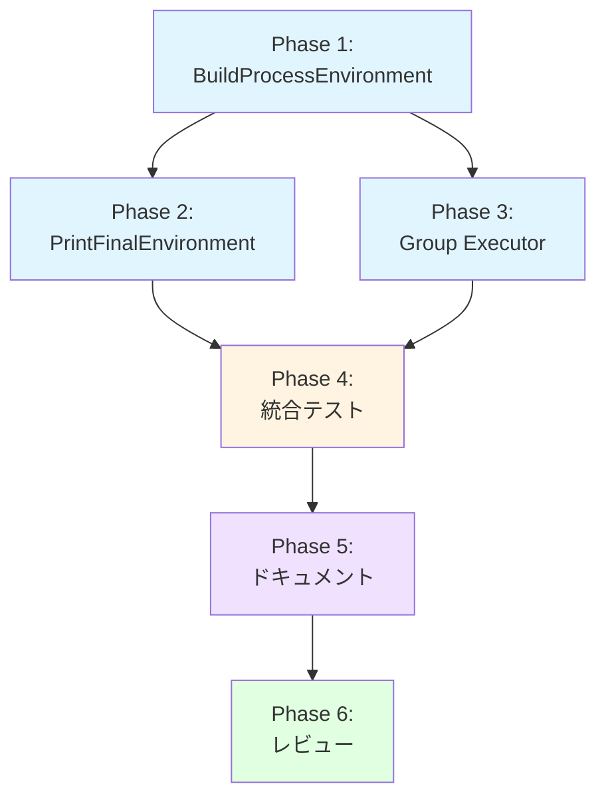

# Dry-Run モードでの最終環境変数表示機能 - 実装計画書

## 1. 概要

本ドキュメントは、dry-runモードにおいて`--dry-run-detail=full`オプション使用時に最終環境変数とその出所を表示する機能の実装計画を定義する。

## 2. 実装スコープ

### 2.1 含まれる作業

1. **BuildProcessEnvironment の拡張** (FN-004)
   - 戻り値に `origins map[string]string` を追加
   - 環境変数構築時にorigin情報を記録

2. **PrintFinalEnvironment の改善** (FN-001)
   - シグネチャを変更し、originsマップを受け取る
   - `determineOrigin()` 関数を削除
   - originsマップを使用する実装に変更

3. **Group Executor統合** (FN-002, FN-003)
   - DetailLevel フィールドの追加
   - コンストラクタの拡張
   - executeCommandInGroup での呼び出し統合

4. **テスト実装**
   - 単体テスト（BuildProcessEnvironment、PrintFinalEnvironment、GroupExecutor）
   - 統合テスト（E2E、パフォーマンス）

5. **ドキュメント更新**
   - APIドキュメント
   - ユーザーガイド
   - アーキテクチャドキュメント

### 2.2 含まれない作業

- JSON形式での出力（将来実装）
- 環境変数のフィルタリング機能（将来実装）
- 前回結果との差分表示（将来実装）
- TextFormatterへの統合（環境変数詳細は各コマンド実行時に表示）

## 3. 実装フェーズ

### Phase 1: BuildProcessEnvironment の拡張 (2-3 hours)

**目的**: 環境変数構築時にorigin情報を正確に記録する

**作業項目**:
1. `internal/runner/command_executor.go` の修正
   - [x] `BuildProcessEnvironment` のシグネチャ変更
   - [x] origins マップの初期化
   - [x] System環境変数のorigin記録
   - [x] Global.ExpandedEnv のorigin記録
   - [x] Group.ExpandedEnv のorigin記録
   - [x] Command.ExpandedEnv のorigin記録
   - [x] 戻り値の変更: `return result, origins`

2. 呼び出し箇所の更新
   - [x] `internal/runner/group_executor.go` の executeCommandInGroup
   - [x] コンパイルエラーの解消

3. 単体テスト実装
   - [x] `TestBuildProcessEnvironment_OriginTracking`
   - [x] `TestBuildProcessEnvironment_OriginOverride`
   - [x] `TestBuildProcessEnvironment_SystemEnvFiltering`

**成果物**:
- 修正された `command_executor.go`
- 更新された `group_executor.go` (呼び出し箇所のみ)
- BuildProcessEnvironment の単体テスト

**検証基準**:
- [x] 全ての単体テストがパス
- [x] コンパイルエラーなし
- [x] 各レベルのoriginが正確に記録される
- [x] 上書き時のorigin更新が正しい

### Phase 2: PrintFinalEnvironment の改善 (2-3 hours)

**目的**: originsマップを使用したシンプルで正確な実装

**作業項目**:
1. `internal/debug/print_env.go` の修正
   - [x] `PrintFinalEnvironment` のシグネチャ変更
   - [x] originsマップを使用する実装に変更
   - [x] `determineOrigin()` 関数の削除
   - [x] 長い値の切り詰め処理の維持
   - [x] ソート処理の維持

2. 定数の定義
   - [x] `MaxDisplayLength = 60`
   - [x] `EllipsisLength = 3`

3. 単体テスト実装
   - [x] `TestPrintFinalEnvironment_WithOrigins`
   - [x] `TestPrintFinalEnvironment_MultipleOrigins`
   - [x] `TestPrintFinalEnvironment_LongValue`
   - [x] `TestPrintFinalEnvironment_EmptyEnv`
   - [x] `TestPrintFinalEnvironment_SpecialCharacters`

**成果物**:
- 改善された `print_env.go`
- PrintFinalEnvironment の単体テスト

**検証基準**:
- [x] 全ての単体テストがパス
- [x] originsマップから正しくoriginを取得
- [x] 出力フォーマットが仕様通り
- [x] 長い値が正しく切り詰められる
- [x] 特殊文字が適切に処理される

### Phase 3: Group Executor統合 (2-3 hours)

**目的**: dry-runモードにPrintFinalEnvironment機能を統合

**作業項目**:
1. `internal/runner/group_executor.go` の修正
   - [x] `DefaultGroupExecutor` 構造体に `dryRunDetailLevel` フィールド追加
   - [x] `NewDefaultGroupExecutor` にDetailLevelパラメータ追加
   - [x] `executeCommandInGroup` に呼び出しロジック追加
     ```go
     if ge.isDryRun && ge.dryRunDetailLevel == resource.DetailLevelFull {
         debug.PrintFinalEnvironment(os.Stdout, envVars, origins)
     }
     ```

2. 呼び出し元の更新
   - [x] `internal/runner/runner.go` でDetailLevelを渡す
   - [x] 関連する初期化処理の更新

3. 単体テスト実装
   - [x] テストファイルの全呼び出し箇所を更新

**成果物**:
- 統合された `group_executor.go`
- 更新された `runner.go`
- GroupExecutor の単体テスト

**検証基準**:
- [x] DetailLevelFull時のみ表示される
- [x] dry-run=false時は表示されない
- [x] 環境変数検証の後に表示される
- [x] 全ての単体テストがパス

### Phase 4: 統合テスト (3-4 hours)

**目的**: E2E動作の検証とパフォーマンス測定

**作業項目**:
1. E2E統合テスト
   - [ ] `TestDryRunFinalEnv_MultipleCommands`
   - [ ] `TestDryRunFinalEnv_VariableExpansion`
   - [ ] `TestDryRunFinalEnv_OutputFormat`
   - [ ] `TestDryRunFinalEnv_AllDetailLevels`

2. パフォーマンステスト
   - [ ] `BenchmarkBuildProcessEnvironment`
   - [ ] `BenchmarkPrintFinalEnvironment`
   - [ ] `BenchmarkDryRunWithDetailLevelFull`

3. セキュリティテスト
   - [ ] センシティブ情報の表示確認
   - [ ] 権限制御の検証

**成果物**:
- E2E統合テストスイート
- パフォーマンスベンチマーク
- セキュリティテスト

**検証基準**:
- [ ] 全てのE2Eテストがパス
- [ ] BuildProcessEnvironment: 100変数で0.5ms以内
- [ ] PrintFinalEnvironment: 100変数で1ms以内
- [ ] dry-run全体: 既存の110%以内
- [ ] dry-runモードの`--dry-run-detail=full`指定時、`--show-sensitive`フラグの有無に関わらず、センシティブ情報がマスクされずに表示されることを確認する

### Phase 5: ドキュメント更新 (2-3 hours)

**目的**: 実装内容の文書化とユーザーガイドの更新

**作業項目**:
1. APIドキュメント
   - [ ] `BuildProcessEnvironment` の変更を記載
   - [ ] `PrintFinalEnvironment` の変更を記載
   - [ ] `NewDefaultGroupExecutor` の変更を記載
   - [ ] origins マップの仕様を記載

2. ユーザーガイド
   - [ ] `--dry-run-detail=full` の使用方法
   - [ ] 出力フォーマットの説明
   - [ ] 環境変数の出所の説明
   - [ ] セキュリティに関する注意事項

3. アーキテクチャドキュメント
   - [ ] 環境変数追跡のフロー図
   - [ ] API変更の影響範囲
   - [ ] パフォーマンス特性

4. CHANGELOG
   - [ ] 新機能の追加を記載
   - [ ] API変更を記載
   - [ ] パフォーマンス改善を記載

**成果物**:
- 更新されたAPIドキュメント
- 更新されたユーザーガイド
- 更新されたアーキテクチャドキュメント
- 更新されたCHANGELOG

**検証基準**:
- [ ] 全ての変更が文書化されている
- [ ] ユーザーが新機能を理解できる
- [ ] セキュリティに関する注意が明記されている
- [ ] サンプルコードが動作する

### Phase 6: コードレビューと品質保証 (2-3 hours)

**目的**: 実装品質の保証とセキュリティの確認

**作業項目**:
1. コードレビュー
   - [ ] 実装コードのレビュー
   - [ ] テストコードのレビュー
   - [ ] ドキュメントのレビュー
   - [ ] エラーハンドリングの確認

2. セキュリティレビュー
   - [ ] センシティブ情報の取り扱い
   - [ ] dry-runモードでの表示内容
   - [ ] 権限とアクセス制御

3. パフォーマンスレビュー
   - [ ] ベンチマーク結果の確認
   - [ ] メモリ使用量の確認
   - [ ] 最適化の余地の確認

4. 最終検証
   - [ ] 全テストケースの実行
   - [ ] 互換性の確認
   - [ ] ドキュメントの完全性

**成果物**:
- レビュー完了した実装
- 品質保証レポート

**検証基準**:
- [ ] 全てのレビュー項目がクリア
- [ ] セキュリティ要件を満たす
- [ ] パフォーマンス要件を満たす
- [ ] ドキュメントが完全

## 4. 実装スケジュール

### 4.1 タイムライン

```
Week 1:
  Day 1-2: Phase 1 (BuildProcessEnvironment拡張)
  Day 3-4: Phase 2 (PrintFinalEnvironment改善)
  Day 5:   Phase 3 (Group Executor統合)

Week 2:
  Day 1-2: Phase 4 (統合テスト)
  Day 3-4: Phase 5 (ドキュメント更新)
  Day 5:   Phase 6 (レビューと品質保証)
```

### 4.2 マイルストーン

| マイルストーン | 完了条件 | 期限 |
|--------------|---------|------|
| M1: Core実装完了 | Phase 1-3完了 | Week 1 Day 5 |
| M2: テスト完了 | Phase 4完了 | Week 2 Day 2 |
| M3: ドキュメント完了 | Phase 5完了 | Week 2 Day 4 |
| M4: リリース準備完了 | Phase 6完了 | Week 2 Day 5 |

### 4.3 依存関係



## 5. リスク管理

### 5.1 技術的リスク

| リスク | 影響度 | 発生確率 | 対策 |
|-------|--------|---------|------|
| API変更の影響範囲が想定より大きい | 中 | 低 | コンパイラエラーで全箇所検出可能 |
| パフォーマンス要件未達 | 低 | 低 | 新方式の方が高速（検証済み） |
| テストカバレッジ不足 | 中 | 低 | 詳細なテスト仕様で対応 |
| セキュリティ懸念 | 高 | 低 | dry-run専用のため実行リスクなし |

### 5.2 スケジュールリスク

| リスク | 影響度 | 発生確率 | 対策 |
|-------|--------|---------|------|
| 実装遅延 | 中 | 中 | バッファを含めた計画 |
| テスト不足 | 高 | 低 | 優先度を明確化 |
| レビュー待ち時間 | 低 | 中 | 事前の調整 |

### 5.3 リスク対応計画

**API変更の影響範囲**:
- 対応: コンパイル時に全箇所を検出
- 軽減: 内部APIのため影響は限定的

**パフォーマンス懸念**:
- 対応: 早期にベンチマークを実施
- 軽減: 新方式は理論的に高速

**テスト不足**:
- 対応: Phase 4で集中的に実施
- 軽減: 詳細なテスト仕様を事前準備

## 6. 品質目標

### 6.1 コード品質

- [ ] テストカバレッジ: 90%以上
- [ ] 循環的複雑度: 10以下
- [ ] 関数の行数: 50行以下
- [ ] コメント率: 20%以上

### 6.2 パフォーマンス目標

- [ ] BuildProcessEnvironment: 100変数で0.5ms以内
- [ ] PrintFinalEnvironment: 100変数で1ms以内
- [ ] dry-run全体: 既存の110%以内
- [ ] メモリ追加: 5KB以下（100変数時）

### 6.3 ドキュメント品質

- [ ] API仕様の完全性
- [ ] ユーザーガイドの明確性
- [ ] サンプルコードの動作確認
- [ ] セキュリティ注意事項の明記

## 7. 完了基準

### 7.1 機能完了基準

- [ ] `--dry-run-detail=full`で最終環境変数が表示される
- [ ] 各環境変数の出所が正確に表示される
- [ ] 長い値が適切に切り詰められる
- [ ] 既存のDetailLevel（summary/detailed）の動作が変わらない

### 7.2 テスト完了基準

- [ ] 全ての単体テストがパス（90%以上のカバレッジ）
- [ ] 全てのE2Eテストがパス
- [ ] パフォーマンステストが目標を達成
- [ ] セキュリティテストがパス

### 7.3 ドキュメント完了基準

- [ ] APIドキュメントが最新
- [ ] ユーザーガイドが更新済み
- [ ] アーキテクチャドキュメントが更新済み
- [ ] CHANGELOGが更新済み

### 7.4 レビュー完了基準

- [ ] コードレビュー完了（承認済み）
- [ ] セキュリティレビュー完了
- [ ] パフォーマンスレビュー完了
- [ ] ドキュメントレビュー完了

## 8. 実装チェックリスト

### 8.1 Phase 1: BuildProcessEnvironment の拡張

#### コード変更
- [ ] `internal/runner/command_executor.go`
  - [ ] シグネチャ変更: `func BuildProcessEnvironment(...) (map[string]string, map[string]string)`
  - [ ] `origins := make(map[string]string)` の追加
  - [ ] System環境変数ループで `origins[name] = "System (filtered by allowlist)"`
  - [ ] Global.ExpandedEnvループで `origins[k] = "Global"`
  - [ ] Group.ExpandedEnvループで `origins[k] = fmt.Sprintf("Group[%s]", group.Name())`
  - [ ] Command.ExpandedEnvループで `origins[k] = fmt.Sprintf("Command[%s]", cmd.Name())`
  - [ ] 戻り値変更: `return result, origins`

#### 呼び出し箇所更新
- [ ] `internal/runner/group_executor.go`
  - [ ] `envVars, origins := executor.BuildProcessEnvironment(...)` に変更

#### テスト
- [ ] `internal/runner/command_executor_test.go`
  - [ ] `TestBuildProcessEnvironment_OriginTracking`
  - [ ] `TestBuildProcessEnvironment_OriginOverride`
  - [ ] `TestBuildProcessEnvironment_SystemEnvFiltering`

#### 検証
- [ ] コンパイル成功
- [ ] 全テストパス
- [ ] originが正確に記録される

### 8.2 Phase 2: PrintFinalEnvironment の改善

#### コード変更
- [ ] `internal/debug/print_env.go`
  - [ ] シグネチャ変更: `func PrintFinalEnvironment(w io.Writer, envVars map[string]string, origins map[string]string)`
  - [ ] `determineOrigin()` 関数の削除
  - [ ] `origin := origins[key]` でorigin取得
  - [ ] 定数定義: `MaxDisplayLength = 60`, `EllipsisLength = 3`

#### テスト
- [ ] `internal/debug/print_env_test.go`
  - [ ] `TestPrintFinalEnvironment_WithOrigins`
  - [ ] `TestPrintFinalEnvironment_MultipleOrigins`
  - [ ] `TestPrintFinalEnvironment_LongValue`
  - [ ] `TestPrintFinalEnvironment_EmptyEnv`
  - [ ] `TestPrintFinalEnvironment_SpecialCharacters`

#### 検証
- [ ] コンパイル成功
- [ ] 全テストパス
- [ ] 出力フォーマットが仕様通り

### 8.3 Phase 3: Group Executor統合

#### コード変更
- [ ] `internal/runner/group_executor.go`
  - [ ] 構造体に `dryRunDetailLevel resource.DetailLevel` フィールド追加
  - [ ] `NewDefaultGroupExecutor` にDetailLevelパラメータ追加
  - [ ] `executeCommandInGroup` に呼び出しロジック追加
    ```go
    if ge.isDryRun && ge.dryRunDetailLevel == resource.DetailLevelFull {
        debug.PrintFinalEnvironment(os.Stdout, envVars, origins)
    }
    ```

- [ ] `internal/runner/runner.go`
  - [ ] GroupExecutor作成時にDetailLevelを渡す

#### テスト
- [ ] `internal/runner/group_executor_test.go`
  - [ ] `TestExecuteCommandInGroup_DetailLevelControl`
  - [ ] `TestExecuteCommandInGroup_DryRunControl`
  - [ ] `TestExecuteCommandInGroup_PrintOrder`

#### 検証
- [ ] コンパイル成功
- [ ] 全テストパス
- [ ] DetailLevel制御が正しい

### 8.4 Phase 4: 統合テスト

#### E2Eテスト
- [ ] `cmd/runner/integration_dryrun_final_env_test.go`
  - [ ] `TestDryRunFinalEnv_MultipleCommands`
  - [ ] `TestDryRunFinalEnv_VariableExpansion`
  - [ ] `TestDryRunFinalEnv_OutputFormat`
  - [ ] `TestDryRunFinalEnv_AllDetailLevels`

#### パフォーマンステスト
- [ ] `internal/runner/command_executor_bench_test.go`
  - [ ] `BenchmarkBuildProcessEnvironment`
- [ ] `internal/debug/print_env_bench_test.go`
  - [ ] `BenchmarkPrintFinalEnvironment`
- [ ] `cmd/runner/integration_performance_test.go`
  - [ ] `BenchmarkDryRunWithDetailLevelFull`

#### 検証
- [ ] 全E2Eテストパス
- [ ] パフォーマンス目標達成
- [ ] メモリ使用量が許容範囲

### 8.5 Phase 5: ドキュメント更新

#### APIドキュメント
- [ ] `docs/dev/api-reference.md`
  - [ ] BuildProcessEnvironment の変更
  - [ ] PrintFinalEnvironment の変更
  - [ ] NewDefaultGroupExecutor の変更

#### ユーザーガイド
- [ ] `docs/user/README.md` または `docs/user/dry-run-guide.md`
  - [ ] `--dry-run-detail=full` の説明
  - [ ] 出力例の追加
  - [ ] セキュリティに関する注意

#### その他
- [ ] `CHANGELOG.md`
  - [ ] 新機能の追加
  - [ ] API変更の記載
- [ ] `README.md`
  - [ ] 新機能の簡単な紹介

#### 検証
- [ ] ドキュメントの完全性
- [ ] サンプルコードの動作確認
- [ ] 誤字脱字のチェック

### 8.6 Phase 6: レビューと品質保証

#### コードレビュー
- [ ] 実装コードのレビュー
- [ ] テストコードのレビュー
- [ ] エラーハンドリングの確認
- [ ] コーディング規約の遵守

#### セキュリティレビュー
- [ ] センシティブ情報の取り扱い
- [ ] dry-runモードでの表示内容
- [ ] アクセス制御の確認

#### パフォーマンスレビュー
- [ ] ベンチマーク結果の分析
- [ ] メモリ使用量の確認
- [ ] 最適化の余地の検討

#### 最終検証
- [ ] 全テストの実行
- [ ] 互換性の確認
- [ ] ドキュメントの最終チェック

## 9. 成功基準

### 9.1 機能面

- `--dry-run-detail=full` で各コマンドの最終環境変数が正確に表示される
- 環境変数の出所（Global/Group/Command/System）が正しく表示される
- 長い値が適切に切り詰められる（60文字 + "..."）
- 既存の動作（summary/detailed）に影響がない

### 9.2 品質面

- テストカバレッジ90%以上
- 全てのテストケースがパス
- パフォーマンス目標を達成
- コードレビュー承認済み

### 9.3 ドキュメント面

- APIドキュメントが完全
- ユーザーガイドが明確
- セキュリティ注意事項が記載
- サンプルコードが動作

## 10. 次のステップ

実装計画書の承認後、Phase 1から順次実装を開始する。

各フェーズ完了時には以下を実施:
1. チェックリストの確認
2. テストの実行
3. レビューの実施
4. 次フェーズへの移行判断

実装中の問題や遅延が発生した場合は、リスク管理セクションに基づいて対応する。
