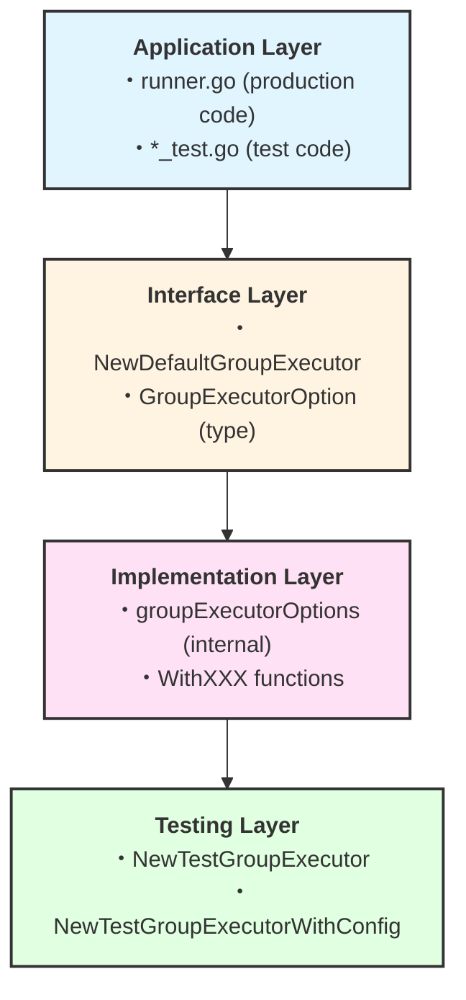
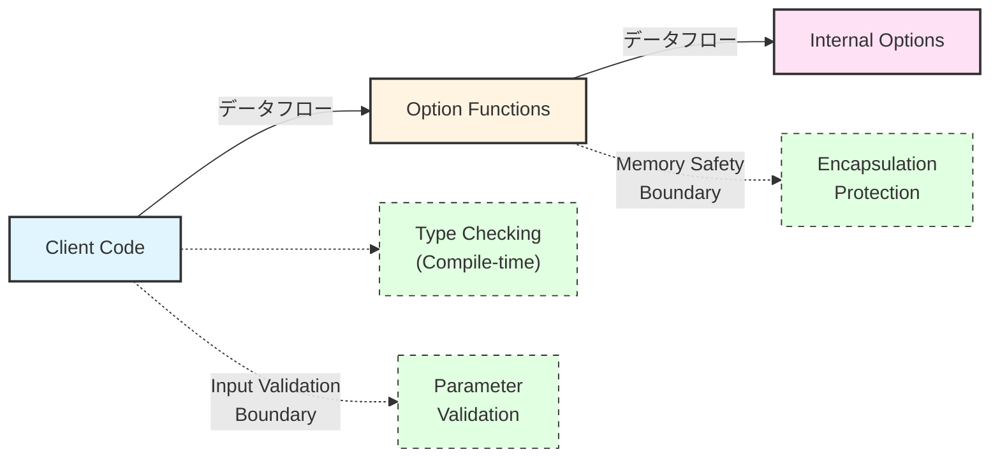

# GroupExecutor リファクタリング - アーキテクチャ設計書

## 1. システム概要

### 1.1 アーキテクチャの概要

本リファクタリングは、`NewDefaultGroupExecutor` 関数に Functional Options パターンを適用し、引数の複雑性を解決しつつ、コードの可読性と保守性を向上させる。

### 1.2 設計原則

1. **単一責任の原則**: 各 Option 関数は特定の設定のみを担当
2. **開放閉鎖の原則**: 新しいオプション追加時に既存コードの変更を最小化
3. **依存関係逆転の原則**: 具象実装ではなく抽象に依存
4. **インターフェース分離の原則**: 使用しないオプションの依存を強制しない
5. **コードの再利用**: 既存の型（`resource.DryRunOptions`）を最大限活用

### 1.3 品質属性

- **保守性**: 新機能追加の容易さ、既存コードの変更影響の最小化
- **可読性**: 明示的なオプション名、デフォルト値の効果的活用
- **テスタビリティ**: テスト用ヘルパー関数による簡潔なテストコード
- **拡張性**: 後方互換性を保った段階的拡張

## 2. アーキテクチャパターン

### 2.1 採用パターン: Functional Options Pattern

#### 2.1.1 パターン選択理由

| 評価項目 | Functional Options | Config構造体 | Builder | 評価理由 |
|----------|-------------------|-------------|---------|----------|
| 可読性 | ⭐⭐⭐⭐⭐ | ⭐⭐⭐ | ⭐⭐⭐ | オプション名が明示的 |
| 拡張性 | ⭐⭐⭐⭐⭐ | ⭐⭐ | ⭐⭐⭐⭐ | 既存コードへの影響が最小 |
| Go イディオム | ⭐⭐⭐⭐⭐ | ⭐⭐⭐⭐ | ⭐⭐ | 標準ライブラリで採用 |
| 実装複雑性 | ⭐⭐⭐ | ⭐⭐⭐⭐⭐ | ⭐ | 適度な複雑性 |
| デフォルト値 | ⭐⭐⭐⭐⭐ | ⭐⭐ | ⭐⭐⭐⭐ | 柔軟なデフォルト値設定 |

#### 2.1.2 パターンの構成要素

```go
// Option function type
type GroupExecutorOption func(*groupExecutorOptions)

// Internal options structure
type groupExecutorOptions struct {
    notificationFunc groupNotificationFunc
    dryRunOptions    *resource.DryRunOptions
    keepTempDirs     bool
}

// Option constructors
func WithNotificationFunc(fn groupNotificationFunc) GroupExecutorOption
func WithDryRun(options *resource.DryRunOptions) GroupExecutorOption
func WithKeepTempDirs(keep bool) GroupExecutorOption
```

## 3. システムアーキテクチャ

### 3.1 パッケージ構造

```
internal/runner/executor/group/
├── group_executor.go              # DefaultGroupExecutor 本体
├── options.go                     # Option 関数の定義
├── group_executor_test.go         # メインテスト
├── options_test.go                # Option 関数のテスト
├── testing_helpers.go.go          # テスト用ヘルパー関数 (//go:build test)
└── test_helpers_test.go           # ヘルパー関数の使用例とドキュメント
```

### 3.2 レイヤー構造



## 4. コンポーネント設計

### 4.1 Core Components

#### 4.1.1 GroupExecutorOption Type

**責任**: Option 関数の共通インターフェースを定義

```go
type GroupExecutorOption func(*groupExecutorOptions)
```

**設計上の考慮事項**:
- 関数型により型安全性を確保
- 内部構造体へのアクセスをカプセル化
- 将来の拡張に対して安定したインターフェース

#### 4.1.2 groupExecutorOptions Structure

**責任**: 内部的なオプション設定を保持

```go
type groupExecutorOptions struct {
    notificationFunc groupNotificationFunc
    dryRunOptions    *resource.DryRunOptions  // nil = disabled
    keepTempDirs     bool
}
```

**設計上の考慮事項**:
- 外部に公開しない（小文字で開始）
- `resource.DryRunOptions` の再利用により一貫性確保
- `nil` によるオプション機能の無効化

#### 4.1.3 Default Values Function

**責任**: デフォルト値の一元管理

```go
func defaultGroupExecutorOptions() *groupExecutorOptions {
    return &groupExecutorOptions{
        notificationFunc: nil,
        dryRunOptions:    nil,  // dry-run disabled
        keepTempDirs:     false,
    }
}
```

### 4.2 Option Constructors

#### 4.2.1 WithNotificationFunc

**シグネチャ**:
```go
func WithNotificationFunc(fn groupNotificationFunc) GroupExecutorOption
```

**責任**: 通知関数の設定

**使用例**:
```go
WithNotificationFunc(runner.logGroupExecutionSummary)
```

#### 4.2.2 WithDryRun

**シグネチャ**:
```go
func WithDryRun(options *resource.DryRunOptions) GroupExecutorOption
```

**責任**: Dry-run モードの設定

**設計上の考慮事項**:
- `resource.DryRunOptions` を直接受け取り、既存の型を再利用
- `nil` を渡すことで dry-run を無効化可能
- DetailLevel と ShowSensitive を一つの引数で管理

**使用例**:
```go
WithDryRun(&resource.DryRunOptions{
    DetailLevel:   resource.DetailLevelFull,
    ShowSensitive: true,
})
```

#### 4.2.3 WithKeepTempDirs

**シグネチャ**:
```go
func WithKeepTempDirs(keep bool) GroupExecutorOption
```

**責任**: 一時ディレクトリ保持設定

**使用例**:
```go
WithKeepTempDirs(true)
```

### 4.3 Main Constructor

#### 4.3.1 NewDefaultGroupExecutor

**新しいシグネチャ**:
```go
func NewDefaultGroupExecutor(
    executor executor.CommandExecutor,
    config *runnertypes.ConfigSpec,
    validator security.ValidatorInterface,
    verificationManager verification.ManagerInterface,
    resourceManager resource.ResourceManager,
    runID string,
    options ...GroupExecutorOption,
) *DefaultGroupExecutor
```

**実装パターン**:
```go
func NewDefaultGroupExecutor(/* params */, options ...GroupExecutorOption) *DefaultGroupExecutor {
    opts := defaultGroupExecutorOptions()
    for _, opt := range options {
        opt(opts)
    }

    // Unpack options
    isDryRun := opts.dryRunOptions != nil
    var detailLevel resource.DetailLevel
    var showSensitive bool

    if isDryRun {
        detailLevel = opts.dryRunOptions.DetailLevel
        showSensitive = opts.dryRunOptions.ShowSensitive
    } else {
        detailLevel = resource.DetailLevelSummary
    }

    return &DefaultGroupExecutor{
        // ... field assignments
    }
}
```

## 5. Testing Architecture

### 5.1 Test Helper Package Structure

**採用方式: Build Tags による保証**

```
internal/runner/executor/group/
├── testing_helpers.go.go               # テスト用ヘルパー関数 (//go:build test)
└── test_helpers_test.go       # ヘルパー関数の使用例とドキュメント
```

**設計原則**:
- テスト専用のユーティリティに限定
- プロダクションコードからは使用禁止（Build Tags で保証）
- 明確な命名規則（`NewTest*` プレフィックス）
- 同一パッケージ内での型アクセスが可能

**Build Tags による保証**:
- `//go:build test` により、`go build` 時には絶対に含まれない
- `go test` 時のみビルドされ、テスト実行環境でのみ利用可能
- コンパイラレベルでプロダクションコードへの混入を防止
- IDE やツールチェーンでも適切に認識される

### 5.2 Helper Functions Design

#### 5.2.1 NewTestGroupExecutor

**責任**: 最も一般的なテストパターンのためのヘルパー

```go
func NewTestGroupExecutor(
    config *runnertypes.ConfigSpec,
    resourceManager resource.ResourceManager,
    options ...group.GroupExecutorOption,
) *group.DefaultGroupExecutor
```

**デフォルト値**:
- `executor`: `nil` (テストでは多くの場合不要)
- `validator`: `nil` (テスト環境での簡略化)
- `verificationManager`: `nil` (機能テスト時は多くの場合不要)
- `runID`: `"test-run-123"` (固定値で十分)

#### 5.2.2 NewTestGroupExecutorWithConfig

**責任**: 特定の依存関係をカスタマイズするためのヘルパー

```go
type TestGroupExecutorConfig struct {
    Executor            executor.CommandExecutor
    Config              *runnertypes.ConfigSpec
    Validator           security.ValidatorInterface
    VerificationManager verification.ManagerInterface
    ResourceManager     resource.ResourceManager
    RunID               string
}

func NewTestGroupExecutorWithConfig(
    cfg TestGroupExecutorConfig,
    options ...group.GroupExecutorOption,
) *group.DefaultGroupExecutor
```

## 6. Migration Architecture

### 6.1 段階的移行戦略

#### Phase 1: Dual Interface Support

```go
// 新しい実装
func NewDefaultGroupExecutor(/* new signature */) *DefaultGroupExecutor

// レガシー実装（移行期間限定）
func NewDefaultGroupExecutorLegacy(/* old signature */) *DefaultGroupExecutor
```

#### Phase 2: Production Migration

プロダクションコード（1箇所）を新インターフェースに移行

#### Phase 3: Test Migration

テストコード（22箇所）を段階的に移行

#### Phase 4: Legacy Cleanup

レガシーインターフェースを削除

### 6.2 Migration Safety Mechanisms

1. **Feature Flags**: 必要に応じて機能フラグで新旧実装を切り替え
2. **Parallel Testing**: 新旧両方の実装でテストを並列実行
3. **Rollback Plan**: 問題発生時の即座のロールバック手順

## 7. Error Handling Architecture

### 7.1 エラー処理方針

#### 7.1.1 Compile-time Safety

- Option 関数の型安全性により、コンパイル時に不正な型を検出
- 必須引数は位置引数として強制

#### 7.1.2 Runtime Validation

```go
func NewDefaultGroupExecutor(/* params */) *DefaultGroupExecutor {
    // Validate required parameters
    if config == nil {
        panic("config cannot be nil")
    }
    if resourceManager == nil {
        panic("resourceManager cannot be nil")
    }
    if runID == "" {
        panic("runID cannot be empty")
    }

    // ... rest of implementation
}
```

#### 7.1.3 Option Validation

各 Option 関数内で引数の妥当性を検証:

```go
func WithDryRun(options *resource.DryRunOptions) GroupExecutorOption {
    return func(opts *groupExecutorOptions) {
        // nil は許可（dry-run無効化）
        opts.dryRunOptions = options
    }
}
```

### 7.2 エラー報告戦略

1. **Panic for Programming Errors**: 必須引数の欠如など、プログラミングエラーは panic
2. **Graceful Handling for Runtime Errors**: 設定の不整合など、実行時エラーは適切にハンドリング
3. **Clear Error Messages**: エラーメッセージは問題の特定と解決が容易

## 8. Performance Considerations

### 8.1 メモリ使用量

#### 8.1.1 Option Functions Overhead

- Option 関数はスタックに保存される関数ポインタ
- 実行時のメモリオーバーヘッドは最小限
- デフォルト値の構造体は1つのみ生成

#### 8.1.2 Memory Layout Optimization

```go
type groupExecutorOptions struct {
    dryRunOptions    *resource.DryRunOptions  // 8 bytes (pointer)
    notificationFunc groupNotificationFunc     // 8 bytes (function pointer)
    keepTempDirs     bool                      // 1 byte
    // Total: ~17 bytes (with padding)
}
```

### 8.2 実行時パフォーマンス

#### 8.2.1 Option Processing Cost

```go
// O(n) where n = number of options (typically 0-3)
for _, opt := range options {
    opt(opts)  // Function call overhead: ~1-2ns per option
}
```

#### 8.2.2 Benchmark Targets

- 関数呼び出し時間: < 100ns (現在の110%以内)
- メモリ割り当て: +1 allocation (options struct)
- CPU使用率への影響: 無視できるレベル

### 8.3 Optimization Strategies

1. **Inline Small Functions**: 小さなOption関数のインライン化
2. **Struct Reuse**: 可能な場合のstruct再利用
3. **Lazy Evaluation**: 必要時のみ計算される遅延評価

## 9. Security Architecture

### 9.1 セキュリティ境界

#### 9.1.1 Input Validation Boundaries



#### 9.1.2 Privilege Boundaries

- Option 関数は内部構造体への制限されたアクセスのみ
- セキュリティクリティカルな設定（validator）は必須引数として保護
- 通知関数は任意の関数を受け入れるが、実行コンテキストを制限

### 9.2 セキュリティ検証ポイント

1. **Validator Configuration**: セキュリティvalidatorが正しく設定されることを保証
2. **DryRun Isolation**: dry-runモードでの副作用を防止
3. **Temporary Directory Handling**: 一時ディレクトリの適切なクリーンアップ

## 10. Quality Assurance Architecture

### 10.1 テスト戦略

#### 10.1.1 Unit Testing

- **Option Functions**: 各Option関数の独立したテスト
- **Default Values**: デフォルト値の正確性テスト
- **Error Conditions**: エラー条件の適切なハンドリング

#### 10.1.2 Integration Testing

- **End-to-end**: 新インターフェースでの完全な実行フロー
- **Compatibility**: 旧実装との動作互換性
- **Performance**: パフォーマンス非劣化の確認

#### 10.1.3 Contract Testing

- **Interface Contract**: 新旧インターフェース間の契約テスト
- **Helper Functions**: ヘルパー関数の動作保証
- **Migration Path**: 移行パスの正確性検証

### 10.2 品質メトリクス

| メトリクス | 現在値 | 目標値 | 測定方法 |
|------------|--------|--------|----------|
| テストカバレッジ | 85% | ≥85% | go test -cover |
| 圧環複雑度 | 12 | ≤15 | gocyclo |
| 関数あたりの引数数 | 11 | ≤6+options | 静的解析 |
| テストコード行数 | 100% | 60-70% | 行数カウント |

### 10.3 継続的品質保証

1. **自動テスト**: CI/CDでの自動テスト実行
2. **静的解析**: linter、型チェッカーの活用
3. **コードレビュー**: 設計原則への準拠確認
4. **パフォーマンス監視**: 継続的なパフォーマンス測定

## 11. Documentation Architecture

### 11.1 ドキュメント構造

```
docs/tasks/0045_group_executor_refactoring/
├── 00_analysis_and_proposal.md          # 現状分析と提案
├── 01_requirements.md                   # 要件定義書
├── 02_architecture.md                   # アーキテクチャ設計書（本文書）
├── 03_detailed_spec.md                 # 詳細仕様書
├── 04_implementation_plan.md           # 実装計画書
├── 05_test_plan.md                     # テスト計画書
└── 06_migration_guide.md               # 移行ガイド
```

### 11.2 コード内ドキュメント

#### 11.2.1 GoDoc Standards

```go
// GroupExecutorOption configures a DefaultGroupExecutor.
// Use option functions like WithNotificationFunc, WithDryRun, etc.
type GroupExecutorOption func(*groupExecutorOptions)

// WithNotificationFunc sets a notification function that will be called
// when group execution completes.
//
// If fn is nil, no notification will be sent.
//
// Example:
//   ge := NewDefaultGroupExecutor(
//       executor, config, validator, verificationManager, resourceManager, runID,
//       WithNotificationFunc(myNotificationFunc),
//   )
func WithNotificationFunc(fn groupNotificationFunc) GroupExecutorOption
```

#### 11.2.2 Example Code

各パッケージに `example_test.go` を提供:

```go
func ExampleNewDefaultGroupExecutor() {
    ge := NewDefaultGroupExecutor(
        executor,
        config,
        validator,
        verificationManager,
        resourceManager,
        "run-123",
        WithNotificationFunc(notifyFunc),
        WithDryRun(&resource.DryRunOptions{
            DetailLevel:   resource.DetailLevelFull,
            ShowSensitive: false,
        }),
        WithKeepTempDirs(false),
    )
    // Output: GroupExecutor created successfully
}
```

## 12. Future Evolution Architecture

### 12.1 拡張可能性

#### 12.1.1 New Options Addition

新しいオプション追加の標準パターン:

```go
// Step 1: Add field to groupExecutorOptions
type groupExecutorOptions struct {
    // ... existing fields
    newOption SomeType
}

// Step 2: Update default function
func defaultGroupExecutorOptions() *groupExecutorOptions {
    return &groupExecutorOptions{
        // ... existing defaults
        newOption: defaultValue,
    }
}

// Step 3: Add option constructor
func WithNewOption(value SomeType) GroupExecutorOption {
    return func(opts *groupExecutorOptions) {
        opts.newOption = value
    }
}
```

#### 12.1.2 Backward Compatibility Strategy

- Option関数の追加は既存コードに影響しない
- デフォルト値により既存の動作を保証
- 廃止予定のオプションは段階的に警告→削除

### 12.2 メトリクス・監視の拡張

#### 12.2.1 Performance Monitoring

```go
func WithPerformanceMonitoring(enabled bool) GroupExecutorOption {
    return func(opts *groupExecutorOptions) {
        opts.performanceMonitoring = enabled
    }
}
```

#### 12.2.2 Logging Enhancement

```go
func WithLogLevel(level LogLevel) GroupExecutorOption {
    return func(opts *groupExecutorOptions) {
        opts.logLevel = level
    }
}
```

### 12.3 進化的アーキテクチャの原則

1. **段階的改善**: 大きな変更は小さなステップに分割
2. **測定可能な変更**: すべての変更は測定可能な改善を伴う
3. **可逆的決定**: アーキテクチャ決定は後から変更可能
4. **自動化された品質保証**: 変更は自動テストで保護

---

**文書バージョン**: 1.0
**作成日**: 2025-10-27
**承認日**: [日付]
**次回レビュー予定**: [日付]
