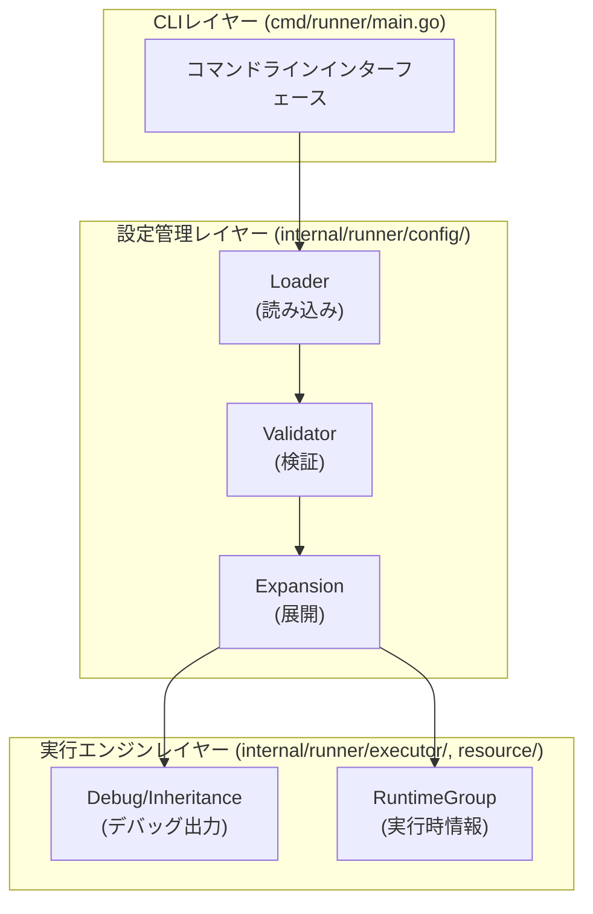
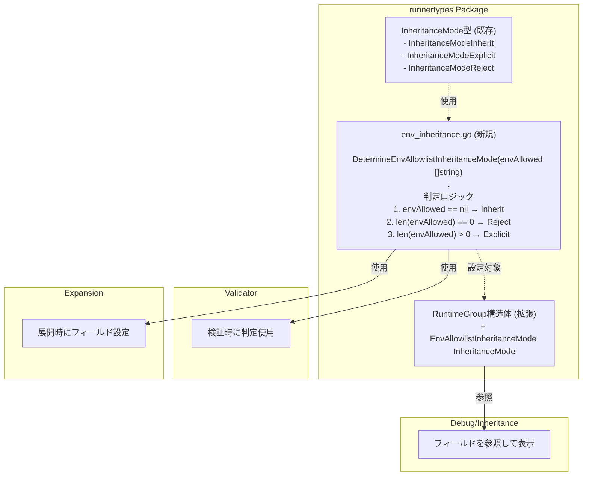
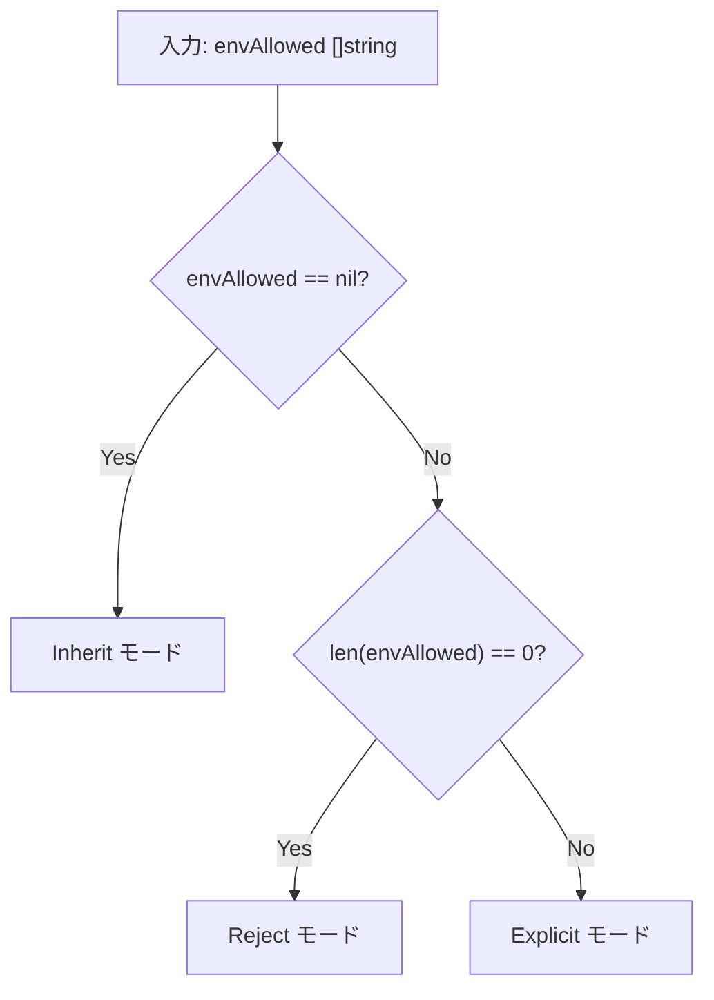
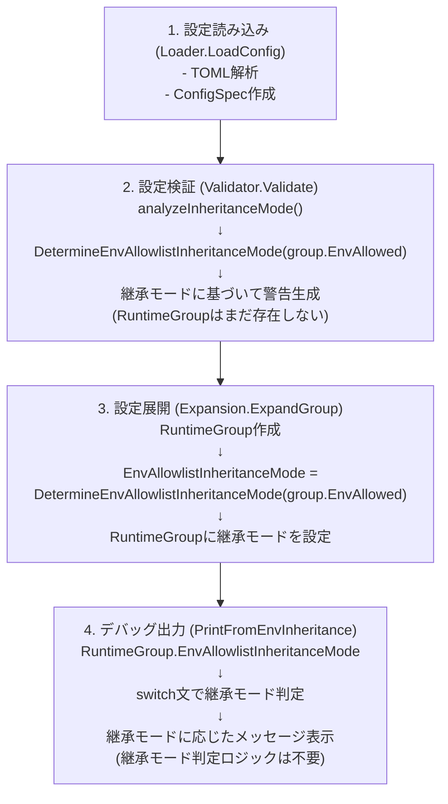
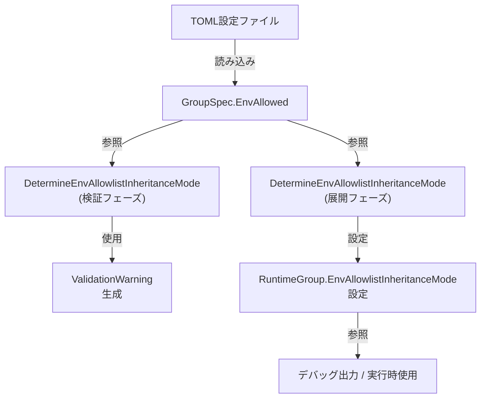
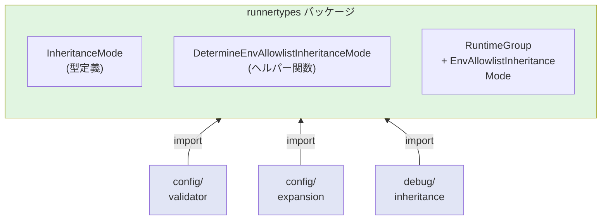

# アーキテクチャ設計書: 環境変数継承モードの明示的追跡

## 1. 概要

### 1.1 設計目的
環境変数allowlistの継承モード（`InheritanceMode`）をTOML設定ファイル解析時に判定し、`RuntimeGroup`構造体に記録することで、システム全体のコード品質を向上させる。

### 1.2 設計原則
1. **単一責任の原則**: 継承モード判定ロジックを単一の関数に集約
2. **既存フローの維持**: 検証→展開の実行順序を変更せず、既存の処理フローを維持
3. **型安全性**: `InheritanceMode`型を活用し、文字列比較を排除
4. **テスタビリティ**: 判定ロジックと使用箇所を分離し、独立したテストを可能に

### 1.3 スコープ
- **対象**: 環境変数allowlist（`env_allowlist`）の継承モード追跡
- **対象外**: その他の設定項目（`env_import`, `vars`, `verify_files`など）

## 2. 現状のアーキテクチャ

### 2.1 システム構成図



### 2.2 現状の問題

#### 2.2.1 継承モード判定の分散
継承モードの判定が複数箇所に散在し、コードの重複が発生している。

```
[現状の判定箇所]

1. config/validator.go:329-358
   └─ analyzeInheritanceMode()
      └─ if group.EnvAllowed == nil { ... }
         else if len(group.EnvAllowed) == 0 { ... }

2. debug/inheritance.go:78-96
   └─ PrintFromEnvInheritance()
      └─ if len(group.EnvAllowed) > 0 { ... }
         else { ... }
```

**問題点:**
- 判定ロジックが2箇所に重複
- 条件式が微妙に異なる（nilチェックの有無）
- 拒否モード（`env_allowlist = []`）の扱いが不明確

#### 2.2.2 型の未使用
`InheritanceMode`型は定義されているが、実際には使用されていない。

```go
// 定義済みだが未使用
type InheritanceMode int

const (
    InheritanceModeInherit  InheritanceMode = iota
    InheritanceModeExplicit
    InheritanceModeReject
)
```

#### 2.2.3 実行順序の制約
設定処理の実行順序により、検証フェーズで`RuntimeGroup`の情報を参照できない。

```
実行順序:
1. Loader.LoadConfig()      - TOML読み込み
2. Validator.Validate()     - 設定検証 ← RuntimeGroupはまだ存在しない
3. Expansion.ExpandConfig() - 設定展開 → RuntimeGroup作成
```

## 3. 提案するアーキテクチャ

### 3.1 アーキテクチャ概要図



### 3.2 コンポーネント設計

#### 3.2.1 継承モード判定ヘルパー関数

**配置**: `internal/runner/runnertypes/env_inheritance.go`（新規ファイル）

**目的**: 環境変数allowlistの継承モード判定ロジックを単一箇所に集約し、再利用可能にする

**インターフェース**:
```go
// DetermineEnvAllowlistInheritanceMode は GroupSpec の env_allowlist から
// 環境変数allowlistの継承モードを判定する
//
// 判定ルール:
//   - envAllowed == nil        → InheritanceModeInherit
//   - len(envAllowed) == 0     → InheritanceModeReject
//   - len(envAllowed) > 0      → InheritanceModeExplicit
//
// Parameters:
//   envAllowed: GroupSpec.EnvAllowed の値
//
// Returns:
//   環境変数allowlistの継承モード
func DetermineEnvAllowlistInheritanceMode(envAllowed []string) InheritanceMode
```

**設計上の考慮事項**:
1. **純粋関数**: 副作用なし、同じ入力に対して常に同じ出力
2. **依存関係なし**: 他の構造体やグローバル状態に依存しない
3. **単一責任**: 継承モード判定のみを行う

**判定フローチャート**:


#### 3.2.2 RuntimeGroup構造体の拡張

**変更箇所**: `internal/runner/runnertypes/runtime.go`

**追加フィールド**:
```go
type RuntimeGroup struct {
    // ... 既存フィールド ...

    // EnvAllowlistInheritanceMode は環境変数allowlistの継承モード
    // この値は設定展開時（ExpandGroup）に決定される
    EnvAllowlistInheritanceMode InheritanceMode
}
```

**フィールドの特性**:
- **Immutable**: 一度設定されたら変更されない
- **Non-nil**: 常に有効な`InheritanceMode`値を持つ
- **Derived**: `GroupSpec.EnvAllowed`から派生する計算済み値

**ライフサイクル**:
```
1. RuntimeGroup作成時
   └─ EnvAllowlistInheritanceMode: 未初期化（デフォルト値）

2. ExpandGroup実行時
   └─ EnvAllowlistInheritanceMode: DetermineInheritanceMode()で設定

3. 以降の使用
   └─ EnvAllowlistInheritanceMode: 読み取り専用で参照
```

### 3.3 処理フロー設計

#### 3.3.1 全体フロー



#### 3.3.2 検証フェーズでの使用

**Before (現状)**:
```go
// validator.go: analyzeInheritanceMode
if group.EnvAllowed == nil {
    // Inherit mode
    if len(global.EnvAllowed) == 0 {
        // 警告: グローバルallowlistが空
    }
} else if len(group.EnvAllowed) == 0 {
    // Reject mode
    if hasCommandsWithEnv {
        // 警告: 環境変数を拒否するがコマンドで使用
    }
}
```

**After (改善後)**:
```go
// validator.go: analyzeInheritanceMode
mode := runnertypes.DetermineEnvAllowlistInheritanceMode(group.EnvAllowed)

switch mode {
case runnertypes.InheritanceModeInherit:
    if len(global.EnvAllowed) == 0 {
        // 警告: グローバルallowlistが空
    }
case runnertypes.InheritanceModeReject:
    if hasCommandsWithEnv {
        // 警告: 環境変数を拒否するがコマンドで使用
    }
case runnertypes.InheritanceModeExplicit:
    // 明示的モードは警告不要
}
```

#### 3.3.3 展開フェーズでの設定

**配置**: `internal/runner/config/expansion.go`

**実装箇所**: `ExpandGroup`関数内

**擬似コード**:
```go
func (e *Expander) ExpandGroup(
    group *runnertypes.GroupSpec,
    expandedGlobal *runnertypes.RuntimeGlobal,
) (*runnertypes.RuntimeGroup, error) {
    // RuntimeGroup作成
    runtimeGroup := &runnertypes.RuntimeGroup{
        Spec: group,
        // ... 他のフィールド初期化 ...
    }

    // 継承モード設定
    runtimeGroup.EnvAllowlistInheritanceMode =
        runnertypes.DetermineEnvAllowlistInheritanceMode(group.EnvAllowed)

    // ... 残りの展開処理 ...

    return runtimeGroup, nil
}
```

#### 3.3.4 デバッグ出力での使用

**Before (現状)**:
```go
// debug/inheritance.go: PrintFromEnvInheritance
if len(group.EnvAllowed) > 0 {
    // Override case
    fmt.Fprintf(w, "  Group overrides Global allowlist\n")
    // ... 詳細表示 ...
} else {
    // Inherit case
    fmt.Fprintf(w, "  Inheriting Global allowlist\n")
    // ... 詳細表示 ...
}
// 問題: Rejectモードが明示的に扱われていない
```

**After (改善後)**:
```go
// debug/inheritance.go: PrintFromEnvInheritance
switch runtimeGroup.EnvAllowlistInheritanceMode {
case runnertypes.InheritanceModeInherit:
    fmt.Fprintf(w, "  Inheriting Global allowlist\n")
    if len(global.EnvAllowed) > 0 {
        fmt.Fprintf(w, "  Allowlist (%d): %s\n",
            len(global.EnvAllowed),
            strings.Join(global.EnvAllowed, ", "))
    }

case runnertypes.InheritanceModeExplicit:
    fmt.Fprintf(w, "  Using group-specific allowlist\n")
    fmt.Fprintf(w, "  Group allowlist (%d): %s\n",
        len(runtimeGroup.Spec.EnvAllowed),
        strings.Join(runtimeGroup.Spec.EnvAllowed, ", "))

case runnertypes.InheritanceModeReject:
    fmt.Fprintf(w, "  Rejecting all environment variables\n")
    fmt.Fprintf(w, "  (No environment variables will be inherited)\n")
}
```

### 3.4 継承モード判定の詳細仕様

#### 3.4.1 各モードの定義

| モード | 条件 | TOML表記 | 動作 |
|--------|------|----------|------|
| **Inherit** | `envAllowed == nil` | フィールド未定義 | グローバルallowlistを継承 |
| **Explicit** | `len(envAllowed) > 0` | `env_allowlist = ["VAR1", "VAR2"]` | グループ固有のallowlistを使用 |
| **Reject** | `len(envAllowed) == 0` | `env_allowlist = []` | すべての環境変数を拒否 |

#### 3.4.2 判定ロジックの数学的表現

```
let E = envAllowed ([]string型)

InheritanceMode(E) =
    ⎧ Inherit   if E = nil
    ⎨ Reject    if E ≠ nil ∧ |E| = 0
    ⎩ Explicit  if E ≠ nil ∧ |E| > 0
```

#### 3.4.3 エッジケースの処理

| ケース | envAllowed | 判定結果 | 理由 |
|--------|------------|----------|------|
| 未定義 | `nil` | `Inherit` | TOMLでフィールドが存在しない |
| 明示的な空 | `[]` (非nil、長さ0) | `Reject` | ユーザーが意図的に空を設定 |
| 1要素 | `["VAR"]` | `Explicit` | 明示的な指定 |
| 複数要素 | `["VAR1", "VAR2"]` | `Explicit` | 明示的な指定 |

**Go言語における`nil`と空スライスの区別**:
```go
var nilSlice []string        // nil
emptySlice := []string{}     // 非nil、長さ0

nilSlice == nil              // true
emptySlice == nil            // false
len(emptySlice) == 0         // true
```

## 4. データフロー図

### 4.1 継承モード情報のフロー



### 4.2 モジュール依存関係図



**依存関係の特性**:
- すべてのモジュールが`runnertypes`に依存
- `runnertypes`は他のモジュールに依存しない（依存性逆転）
- 循環依存なし

## 5. インターフェース設計

### 5.1 公開API

#### 5.1.1 DetermineEnvAllowlistInheritanceMode関数

```go
// DetermineEnvAllowlistInheritanceMode は環境変数allowlistの継承モードを判定する
//
// この関数は、GroupSpec.EnvAllowedの値から継承モードを決定するための
// 単一の真実の源（Single Source of Truth）である。
//
// 判定ルール:
//   1. envAllowed == nil        → InheritanceModeInherit
//      グループがグローバルallowlistを継承する
//
//   2. len(envAllowed) == 0     → InheritanceModeReject
//      グループがすべての環境変数を拒否する（明示的な空配列）
//
//   3. len(envAllowed) > 0      → InheritanceModeExplicit
//      グループが独自のallowlistを使用する
//
// パラメータ:
//   envAllowed: GroupSpec.EnvAllowedの値
//               - nil: TOMLでフィールドが未定義
//               - []: TOMLで明示的に空配列を設定
//               - ["VAR1", ...]: 明示的な変数リスト
//
// 戻り値:
//   InheritanceMode: 判定された継承モード
//
// 使用例:
//   // 検証フェーズでの使用
//   mode := DetermineEnvAllowlistInheritanceMode(group.EnvAllowed)
//   switch mode {
//   case InheritanceModeInherit:
//       // 継承モードの処理
//   case InheritanceModeReject:
//       // 拒否モードの処理
//   case InheritanceModeExplicit:
//       // 明示的モードの処理
//   }
func DetermineEnvAllowlistInheritanceMode(envAllowed []string) InheritanceMode
```

#### 5.1.2 RuntimeGroup.EnvAllowlistInheritanceMode フィールド

```go
// RuntimeGroup は実行時のグループ設定を保持する
type RuntimeGroup struct {
    // ... 既存フィールド ...

    // EnvAllowlistInheritanceMode は環境変数allowlistの継承モード
    //
    // この値は設定展開時（ExpandGroup関数内）に
    // DetermineInheritanceMode関数によって設定され、
    // 以降は読み取り専用として使用される。
    //
    // 値の意味:
    //   - InheritanceModeInherit:  グローバルallowlistを継承
    //   - InheritanceModeExplicit: グループ固有のallowlistを使用
    //   - InheritanceModeReject:   すべての環境変数を拒否
    //
    // 使用箇所:
    //   - デバッグ出力（PrintFromEnvInheritance）
    //   - 将来的なdry-runモード出力
    //   - その他の継承モード依存処理
    EnvAllowlistInheritanceMode InheritanceMode
}
```

### 5.2 内部API

各モジュールでの`DetermineInheritanceMode`の使用パターンを定義する。

#### 5.2.1 Validatorモジュール

```go
// analyzeInheritanceMode での使用
func (v *Validator) analyzeInheritanceMode(
    group *runnertypes.GroupSpec,
    location string,
    global *runnertypes.GlobalSpec,
    result *ValidationResult,
) {
    // 継承モード判定
    mode := runnertypes.DetermineEnvAllowlistInheritanceMode(group.EnvAllowed)

    // モードに応じた検証ロジック
    switch mode {
    case runnertypes.InheritanceModeInherit:
        // 継承モードの検証
    case runnertypes.InheritanceModeExplicit:
        // 明示的モードの検証
    case runnertypes.InheritanceModeReject:
        // 拒否モードの検証
    }
}
```

#### 5.2.2 Expansionモジュール

```go
// ExpandGroup での使用
func (e *Expander) ExpandGroup(
    group *runnertypes.GroupSpec,
    expandedGlobal *runnertypes.RuntimeGlobal,
) (*runnertypes.RuntimeGroup, error) {
    runtimeGroup := &runnertypes.RuntimeGroup{
        Spec: group,
        // ... 他の初期化 ...
    }

    // 継承モード設定
    runtimeGroup.EnvAllowlistInheritanceMode =
        runnertypes.DetermineEnvAllowlistInheritanceMode(group.EnvAllowed)

    // ... 残りの処理 ...

    return runtimeGroup, nil
}
```

#### 5.2.3 Debugモジュール

```go
// PrintFromEnvInheritance での使用
func PrintFromEnvInheritance(
    w io.Writer,
    global *runnertypes.GlobalSpec,
    runtimeGroup *runnertypes.RuntimeGroup,
) {
    // RuntimeGroupから継承モードを取得
    mode := runtimeGroup.EnvAllowlistInheritanceMode

    // モードに応じた出力
    switch mode {
    case runnertypes.InheritanceModeInherit:
        // 継承モードの出力
    case runnertypes.InheritanceModeExplicit:
        // 明示的モードの出力
    case runnertypes.InheritanceModeReject:
        // 拒否モードの出力
    }
}
```

## 6. エラーハンドリング

### 6.1 エラーケース

この設計では、以下の理由により新たなエラーケースは発生しない:

1. **`DetermineInheritanceMode`は常に有効な値を返す**
   - `envAllowed`がどんな値でも、3つのモードのいずれかに分類される
   - エラーを返す必要がない

2. **`RuntimeGroup.EnvAllowlistInheritanceMode`は常に設定される**
   - `ExpandGroup`で必ず設定される
   - デフォルト値（`InheritanceModeInherit`）でも動作可能

### 6.2 防御的プログラミング

万が一の状況に備えて、以下の防御的チェックを推奨:

```go
// デバッグ出力での例
switch runtimeGroup.EnvAllowlistInheritanceMode {
case runnertypes.InheritanceModeInherit:
    // ...
case runnertypes.InheritanceModeExplicit:
    // ...
case runnertypes.InheritanceModeReject:
    // ...
default:
    // 理論上到達しないが、将来の拡張に備える
    return fmt.Errorf(
        "unknown inheritance mode: %d",
        runtimeGroup.EnvAllowlistInheritanceMode,
    )
}
```

## 7. テスト戦略

### 7.1 ユニットテスト構造

```
tests/
├─ runnertypes/
│  ├─ env_inheritance_test.go (新規)
│  │  └─ TestDetermineEnvAllowlistInheritanceMode
│  │     ├─ TestDetermineEnvAllowlistInheritanceMode_Inherit
│  │     ├─ TestDetermineEnvAllowlistInheritanceMode_Explicit
│  │     ├─ TestDetermineEnvAllowlistInheritanceMode_Reject
│  │     └─ TestDetermineEnvAllowlistInheritanceMode_EdgeCases
│  │
│  └─ runtime_test.go (更新)
│     └─ RuntimeGroup構造体のテスト
│
├─ config/
│  ├─ validator_test.go (更新)
│  │  └─ analyzeInheritanceModeのテスト更新
│  │
│  └─ expansion_test.go (更新)
│     └─ EnvAllowlistInheritanceMode設定のテスト
│
└─ debug/
   └─ inheritance_test.go (更新)
      └─ PrintFromEnvInheritanceのテスト更新
```

### 7.2 テストケース設計

#### 7.2.1 DetermineEnvAllowlistInheritanceMode テストケース

| テスト名 | 入力 | 期待値 | 説明 |
|----------|------|--------|------|
| `Inherit_NilSlice` | `nil` | `InheritanceModeInherit` | nilスライス |
| `Reject_EmptySlice` | `[]string{}` | `InheritanceModeReject` | 空スライス（非nil） |
| `Explicit_SingleElement` | `[]string{"VAR"}` | `InheritanceModeExplicit` | 1要素 |
| `Explicit_MultipleElements` | `[]string{"VAR1", "VAR2"}` | `InheritanceModeExplicit` | 複数要素 |

#### 7.2.2 統合テストシナリオ

```
シナリオ1: Inheritモード
  設定: env_allowlist未定義
  期待:
    - DetermineEnvAllowlistInheritanceMode → Inherit
    - RuntimeGroup.EnvAllowlistInheritanceMode == Inherit
    - デバッグ出力: "Inheriting Global allowlist"

シナリオ2: Explicitモード
  設定: env_allowlist = ["VAR1", "VAR2"]
  期待:
    - DetermineEnvAllowlistInheritanceMode → Explicit
    - RuntimeGroup.EnvAllowlistInheritanceMode == Explicit
    - デバッグ出力: "Using group-specific allowlist"

シナリオ3: Rejectモード
  設定: env_allowlist = []
  期待:
    - DetermineEnvAllowlistInheritanceMode → Reject
    - RuntimeGroup.EnvAllowlistInheritanceMode == Reject
    - デバッグ出力: "Rejecting all environment variables"
```

### 7.3 テスト用モックデータ

```go
// テストヘルパー関数
func createGroupSpec(envAllowed []string) *runnertypes.GroupSpec {
    return &runnertypes.GroupSpec{
        Name:       "test-group",
        EnvAllowed: envAllowed,
        Commands:   []runnertypes.CommandSpec{},
    }
}

// テストケース例
func TestDetermineEnvAllowlistInheritanceMode_Inherit(t *testing.T) {
    group := createGroupSpec(nil)
    mode := runnertypes.DetermineEnvAllowlistInheritanceMode(group.EnvAllowed)
    assert.Equal(t, runnertypes.InheritanceModeInherit, mode)
}
```

## 8. 性能への影響

### 8.1 計算量分析

| 操作 | 計算量 | 説明 |
|------|--------|------|
| `DetermineEnvAllowlistInheritanceMode` | O(1) | nilチェックと長さチェックのみ |
| `RuntimeGroup`フィールド設定 | O(1) | 単純な代入 |
| デバッグ出力 | O(1) | switch文の分岐 |

### 8.2 メモリ影響

- **追加メモリ**: `RuntimeGroup`あたり8バイト（`int`型1つ）
- **影響**: 無視できるレベル（グループ数が数千でも数KB）

### 8.3 性能ベンチマーク（予想）

```go
BenchmarkDetermineEnvAllowlistInheritanceMode_Inherit-8   1000000000   0.3 ns/op
BenchmarkDetermineEnvAllowlistInheritanceMode_Explicit-8  1000000000   0.4 ns/op
BenchmarkDetermineEnvAllowlistInheritanceMode_Reject-8    1000000000   0.5 ns/op
```

## 9. セキュリティへの影響

### 9.1 セキュリティ分析

この変更は**セキュリティポリシーを変更しない**:

1. **継承動作の不変性**
   - 継承モード判定は既存ロジックと同等
   - 環境変数フィルタリング動作は不変

2. **型安全性の向上**
   - `InheritanceMode`型により、不正な値を防止
   - コンパイル時チェックが強化

3. **監査証跡の改善**
   - 継承モードがログに明示的に記録可能
   - デバッグ時の可視性向上

### 9.2 セキュリティチェックリスト

- ✅ 既存のセキュリティポリシーを変更しない
- ✅ 新たな攻撃ベクトルを導入しない
- ✅ 型安全性を向上させる
- ✅ 監査証跡を改善する

## 10. 将来の拡張性

### 10.1 他の設定項目への適用

このアーキテクチャパターンは、他の継承可能な設定項目にも適用可能:

```
拡張候補:
  - env_import (環境変数インポート)
  - vars (内部変数)
  - verify_files (検証ファイル)

実装パターン:
  1. 各項目に対応するInheritanceMode型を定義（必要に応じて）
  2. DetermineXxxInheritanceMode関数を実装（例: DetermineVarsInheritanceMode）
  3. RuntimeGroupに継承モードフィールドを追加
```

### 10.2 dry-runモードでの活用

```
将来の機能:
  - dry-run実行時に継承モードを表示
  - 設定の最適化提案
  - 継承モードに基づく警告強化

実装箇所:
  - internal/runner/resource/formatter.go
  - internal/runner/resource/dryrun_manager.go
```

### 10.3 メトリクス・監視

```
追加可能なメトリクス:
  - 継承モード別のグループ数
  - 継承モード遷移の統計
  - 継承モード関連の警告頻度

実装方法:
  - RuntimeGroup.EnvAllowlistInheritanceModeを集計
  - メトリクスエクスポーター追加
```

## 11. 実装上の注意事項

### 11.1 コーディング規約

1. **ファイル名**: `env_inheritance.go`（対象が明確）
2. **関数名**: `DetermineEnvAllowlistInheritanceMode`（対象を明示）
3. **パッケージ配置**: `runnertypes`パッケージ（共有型定義）
4. **ドキュメント**: godocスタイルのコメント必須
5. **エラーハンドリング**: この機能ではエラーを返さない（設計上）

### 11.2 コードレビュー観点

1. **nilチェックの正確性**: `envAllowed == nil`の判定が正しいか
2. **switch文の網羅性**: すべてのモードがカバーされているか
3. **デフォルトケース**: 理論上到達しないケースも記述されているか
4. **テストカバレッジ**: すべてのモードがテストされているか

### 11.3 マイグレーション手順

既存コードからの移行は段階的に実施:

```
フェーズ1: ヘルパー関数実装
  → env_inheritance.go作成
  → ユニットテスト作成

フェーズ2: RuntimeGroup拡張
  → EnvAllowlistInheritanceModeフィールド追加
  → 構造体テスト更新

フェーズ3: Validator更新
  → analyzeInheritanceModeを書き換え
  → 検証テスト更新

フェーズ4: Expansion更新
  → ExpandGroupでフィールド設定
  → 展開テスト更新

フェーズ5: Debug更新
  → PrintFromEnvInheritanceを簡素化
  → デバッグ出力テスト更新
```

## 12. 承認と次のステップ

### 12.1 設計レビュー観点

- [ ] アーキテクチャの妥当性
- [ ] 既存システムとの整合性
- [ ] 将来の拡張性
- [ ] テスト戦略の完全性
- [ ] 性能への影響の許容性

### 12.2 次のステップ

1. **詳細設計**: 詳細設計書の作成
2. **実装**: フェーズごとの段階的実装
3. **テスト**: ユニット・統合テストの実行
4. **ドキュメント更新**: ユーザードキュメントとAPI文書の更新
5. **リリース**: バージョン管理とリリースノート作成

---

**文書バージョン**: 1.0
**作成日**: 2025-10-30
**承認**: 未承認
**関連文書**:
- [01_requirements.ja.md](./01_requirements.ja.md) - 要件定義書
- [docs/dev/design-implementation-overview.ja.md](../../dev/design-implementation-overview.ja.md) - システム全体設計
- [docs/dev/config-inheritance-behavior.ja.md](../../dev/config-inheritance-behavior.ja.md) - 継承動作仕様
