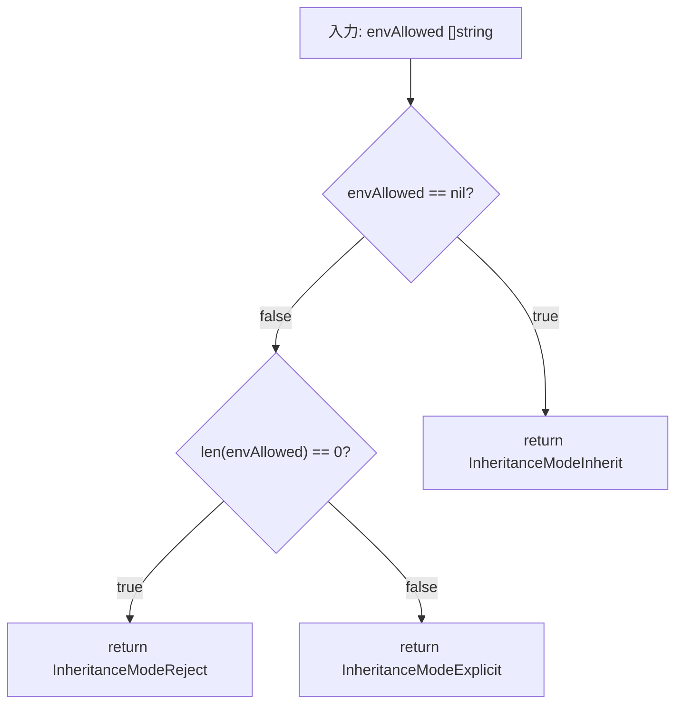

# 詳細設計書: 環境変数継承モードの明示的追跡

## 1. 概要

### 1.1 文書の目的
この文書は、環境変数allowlistの継承モード（`InheritanceMode`）を明示的に追跡する機能の詳細設計を定義する。

### 1.2 対象読者
- 実装担当者
- コードレビュアー
- テスト担当者

### 1.3 関連文書
- [01_requirements.ja.md](./01_requirements.ja.md) - 要件定義書
- [02_architecture.ja.md](./02_architecture.ja.md) - アーキテクチャ設計書

## 2. 実装詳細

### 2.1 新規ファイル: `env_inheritance.go`

#### 2.1.1 ファイル配置
```
internal/runner/runnertypes/env_inheritance.go
```

#### 2.1.2 完全な実装仕様

```go
package runnertypes

// DetermineEnvAllowlistInheritanceMode は GroupSpec の env_allowlist から
// 環境変数allowlistの継承モードを判定する。
//
// この関数は、環境変数allowlist設定の継承モード判定における
// 単一の真実の源（Single Source of Truth）である。
// 継承モード判定が必要な場所では、必ずこの関数を使用すること。
//
// 判定ルール:
//   - envAllowed == nil        → InheritanceModeInherit
//     TOMLファイルでenv_allowlistフィールドが未定義の場合。
//     グループはグローバル設定のenv_allowlistを継承する。
//
//   - len(envAllowed) == 0     → InheritanceModeReject
//     TOMLファイルでenv_allowlist = []と明示的に空配列が設定された場合。
//     グループはすべての環境変数を拒否する。
//
//   - len(envAllowed) > 0      → InheritanceModeExplicit
//     TOMLファイルでenv_allowlist = ["VAR1", "VAR2"]のように
//     明示的な変数リストが設定された場合。
//     グループは独自のallowlistを使用する。
//
// Go言語の仕様:
//   var nilSlice []string     // nil
//   emptySlice := []string{}  // 非nil、長さ0
//
//   nilSlice == nil           // true
//   emptySlice == nil         // false
//   len(emptySlice) == 0      // true
//
// Parameters:
//   envAllowed: GroupSpec.EnvAllowed の値
//               nilの場合はTOMLでフィールドが未定義
//               非nil・長さ0の場合はTOMLで明示的に空配列
//               非nil・長さ>0の場合は明示的な変数リスト
//
// Returns:
//   InheritanceMode: 判定された継承モード
//                    - InheritanceModeInherit:  グローバルallowlistを継承
//                    - InheritanceModeExplicit: グループ固有のallowlistを使用
//                    - InheritanceModeReject:   すべての環境変数を拒否
//
// 使用例:
//   // Validatorでの使用
//   mode := runnertypes.DetermineEnvAllowlistInheritanceMode(group.EnvAllowed)
//   switch mode {
//   case runnertypes.InheritanceModeInherit:
//       // グローバルallowlistの検証
//   case runnertypes.InheritanceModeReject:
//       // 拒否モードの検証
//   case runnertypes.InheritanceModeExplicit:
//       // 明示的モードの検証
//   }
//
//   // Expanderでの使用
//   runtimeGroup.EnvAllowlistInheritanceMode =
//       runnertypes.DetermineEnvAllowlistInheritanceMode(group.EnvAllowed)
func DetermineEnvAllowlistInheritanceMode(envAllowed []string) InheritanceMode {
	// ルール1: nilチェック
	// TOMLでフィールドが未定義の場合、Goのスライスはnilになる
	if envAllowed == nil {
		return InheritanceModeInherit
	}

	// ルール2: 空配列チェック
	// TOMLでenv_allowlist = []と明示的に設定された場合、
	// 非nilで長さ0のスライスになる
	if len(envAllowed) == 0 {
		return InheritanceModeReject
	}

	// ルール3: 明示的な変数リスト
	// len(envAllowed) > 0 の場合
	return InheritanceModeExplicit
}
```

#### 2.1.3 判定ロジックの詳細

**フローチャート:**


**真理値表:**

| envAllowed | envAllowed == nil | len(envAllowed) == 0 | 戻り値 |
|------------|-------------------|----------------------|--------|
| `nil` | true | - | `InheritanceModeInherit` |
| `[]string{}` | false | true | `InheritanceModeReject` |
| `[]string{"A"}` | false | false | `InheritanceModeExplicit` |
| `[]string{"A", "B"}` | false | false | `InheritanceModeExplicit` |

**エッジケース:**

| ケース | 入力 | 期待される出力 | 理由 |
|--------|------|----------------|------|
| 未定義 | `nil` | `Inherit` | TOMLでフィールドが存在しない |
| 明示的な空 | `[]string{}` | `Reject` | ユーザーが意図的に空を設定 |
| 1要素 | `[]string{"VAR"}` | `Explicit` | 明示的な指定 |
| 2要素 | `[]string{"A", "B"}` | `Explicit` | 明示的な指定 |
| 多数要素 | `[]string{"A", "B", "C", ...}` | `Explicit` | 明示的な指定 |

### 2.2 構造体拡張: `RuntimeGroup`

#### 2.2.1 変更箇所
```
internal/runner/runnertypes/runtime.go
```

#### 2.2.2 追加フィールド仕様

```go
type RuntimeGroup struct {
	// ... 既存フィールド ...

	// EnvAllowlistInheritanceMode は環境変数allowlistの継承モードを保持する。
	//
	// このフィールドは、設定展開時（Expander.ExpandGroup関数内）に
	// DetermineEnvAllowlistInheritanceMode関数によって設定され、
	// 以降は読み取り専用として使用される。
	//
	// 値の意味:
	//   - InheritanceModeInherit (0):
	//     グループはグローバル設定のenv_allowlistを継承する。
	//     TOML設定でenv_allowlistフィールドが未定義の場合。
	//
	//   - InheritanceModeExplicit (1):
	//     グループは独自のenv_allowlistを使用する。
	//     TOML設定でenv_allowlist = ["VAR1", "VAR2"]のように
	//     明示的な変数リストが設定された場合。
	//
	//   - InheritanceModeReject (2):
	//     グループはすべての環境変数を拒否する。
	//     TOML設定でenv_allowlist = []と明示的に空配列が設定された場合。
	//
	// ライフサイクル:
	//   1. RuntimeGroup作成時: デフォルト値（InheritanceModeInherit = 0）
	//   2. ExpandGroup実行時: DetermineEnvAllowlistInheritanceMode()で設定
	//   3. 以降の使用: 読み取り専用で参照
	//
	// 使用箇所:
	//   - デバッグ出力（debug.PrintFromEnvInheritance）
	//   - dry-runモード出力（将来の機能）
	//   - その他の継承モード依存処理
	//
	// 不変条件（Invariants）:
	//   - ExpandGroup実行後、このフィールドは常に有効な値を持つ
	//   - 値は InheritanceModeInherit, InheritanceModeExplicit,
	//     InheritanceModeReject のいずれか
	//   - 設定後は変更されない（immutable）
	EnvAllowlistInheritanceMode InheritanceMode
}
```

#### 2.2.3 デフォルト値の扱い

```go
// RuntimeGroup構造体の初期化
runtimeGroup := &RuntimeGroup{
    Spec: group,
    // ... 他のフィールド ...
    // EnvAllowlistInheritanceModeは明示的に初期化しない
    // ゼロ値（InheritanceModeInherit = 0）がデフォルト
}

// ExpandGroup内で必ず設定される
runtimeGroup.EnvAllowlistInheritanceMode =
    DetermineEnvAllowlistInheritanceMode(group.EnvAllowed)
```

**ゼロ値の妥当性:**
- `InheritanceModeInherit`の値は`0`
- 構造体のゼロ値として自然なデフォルト
- 設定前に参照されても、安全な値（Inheritモード）

### 2.3 Validatorモジュールの変更

#### 2.3.1 変更対象ファイル
```
internal/runner/config/validator.go
```

#### 2.3.2 変更対象関数
```go
func (v *Validator) analyzeInheritanceMode(
    group *runnertypes.GroupSpec,
    location string,
    global *runnertypes.GlobalSpec,
    result *ValidationResult,
)
```

#### 2.3.3 変更前のコード

```go
// 現在の実装（validator.go:329-358）
func (v *Validator) analyzeInheritanceMode(
    group *runnertypes.GroupSpec,
    location string,
    global *runnertypes.GlobalSpec,
    result *ValidationResult,
) {
    // 継承モード判定（判定ロジックが分散）
    if group.EnvAllowed == nil {
        // Inherit mode
        if len(global.EnvAllowed) == 0 {
            result.Warnings = append(result.Warnings, ValidationWarning{
                Location: location,
                Message:  "Group inherits from Global env_allowlist, but Global env_allowlist is empty",
            })
        }
    } else if len(group.EnvAllowed) == 0 {
        // Reject mode
        hasCommandsWithEnv := false
        for _, cmd := range group.Commands {
            if len(cmd.Env) > 0 {
                hasCommandsWithEnv = true
                break
            }
        }

        if hasCommandsWithEnv {
            result.Warnings = append(result.Warnings, ValidationWarning{
                Location: location,
                Message:  "Group has env_allowlist = [] (rejecting all environment variables), but commands use environment variables",
            })
        }
    }
    // Explicitモードは特に警告なし
}
```

#### 2.3.4 変更後のコード

```go
// 改善後の実装
func (v *Validator) analyzeInheritanceMode(
    group *runnertypes.GroupSpec,
    location string,
    global *runnertypes.GlobalSpec,
    result *ValidationResult,
) {
    // 継承モード判定（単一の関数で判定）
    mode := runnertypes.DetermineEnvAllowlistInheritanceMode(group.EnvAllowed)

    // モード別の検証ロジック
    switch mode {
    case runnertypes.InheritanceModeInherit:
        // 継承モード: グローバルallowlistの妥当性を確認
        if len(global.EnvAllowed) == 0 {
            result.Warnings = append(result.Warnings, ValidationWarning{
                Location: location,
                Message:  "Group inherits from Global env_allowlist, but Global env_allowlist is empty",
            })
        }

    case runnertypes.InheritanceModeReject:
        // 拒否モード: コマンドで環境変数を使用していないか確認
        hasCommandsWithEnv := false
        for _, cmd := range group.Commands {
            if len(cmd.Env) > 0 {
                hasCommandsWithEnv = true
                break
            }
        }

        if hasCommandsWithEnv {
            result.Warnings = append(result.Warnings, ValidationWarning{
                Location: location,
                Message:  "Group has env_allowlist = [] (rejecting all environment variables), but commands use environment variables",
            })
        }

    case runnertypes.InheritanceModeExplicit:
        // 明示的モード: 特に警告なし
        // グループが独自のallowlistを持っているため、問題なし
    }
}
```

#### 2.3.5 変更のメリット

1. **可読性の向上**
   - 継承モードの判定ロジックが単一関数に集約
   - switch文により、3つのモードが明確に区別

2. **保守性の向上**
   - 判定ロジックの重複排除
   - 将来の変更が容易（DetermineEnvAllowlistInheritanceMode関数のみ修正）

3. **一貫性の確保**
   - Expander、Debugと同じ判定ロジックを使用
   - 判定結果のズレが発生しない

### 2.4 Expansionモジュールの変更

#### 2.4.1 変更対象ファイル
```
internal/runner/config/expansion.go
```

#### 2.4.2 変更対象関数
```go
func (e *Expander) ExpandGroup(
    group *runnertypes.GroupSpec,
    expandedGlobal *runnertypes.RuntimeGlobal,
) (*runnertypes.RuntimeGroup, error)
```

#### 2.4.3 変更内容

**変更箇所の特定:**
`ExpandGroup`関数内で`RuntimeGroup`構造体を作成した直後に、継承モードを設定する。

**擬似コード:**
```go
func (e *Expander) ExpandGroup(
    group *runnertypes.GroupSpec,
    expandedGlobal *runnertypes.RuntimeGlobal,
) (*runnertypes.RuntimeGroup, error) {
    // RuntimeGroup作成
    runtimeGroup := &runnertypes.RuntimeGroup{
        Spec:              group,
        Global:            expandedGlobal,
        // ... 他のフィールド初期化 ...
    }

    // ★ 新規追加: 継承モード設定 ★
    runtimeGroup.EnvAllowlistInheritanceMode =
        runnertypes.DetermineEnvAllowlistInheritanceMode(group.EnvAllowed)

    // ... 残りの展開処理 ...
    // - 環境変数の展開
    // - コマンドの展開
    // - 検証ファイルの展開
    // など

    return runtimeGroup, nil
}
```

**実装上の注意点:**

1. **タイミング**
   - `RuntimeGroup`構造体の作成直後に設定
   - 他の展開処理の前に設定（依存関係なし）

2. **エラーハンドリング**
   - `DetermineEnvAllowlistInheritanceMode`はエラーを返さない
   - エラーハンドリング不要

3. **既存処理への影響**
   - 既存の展開ロジックは変更しない
   - フィールド設定のみを追加

**コードの配置:**
```go
// RuntimeGroup作成（既存）
runtimeGroup := &runnertypes.RuntimeGroup{
    Spec:   group,
    Global: expandedGlobal,
}

// ↓ この位置に継承モード設定を追加 ↓
runtimeGroup.EnvAllowlistInheritanceMode =
    runnertypes.DetermineEnvAllowlistInheritanceMode(group.EnvAllowed)

// 既存の展開処理（変更なし）
// ...
```

### 2.5 Debugモジュールの変更

#### 2.5.1 変更対象ファイル
```
internal/runner/debug/inheritance.go
```

#### 2.5.2 変更対象関数
```go
func PrintFromEnvInheritance(
    w io.Writer,
    global *runnertypes.GlobalSpec,
    runtimeGroup *runnertypes.RuntimeGroup,
)
```

#### 2.5.3 変更前のコード

```go
// 現在の実装（inheritance.go:78-96）
func PrintFromEnvInheritance(
    w io.Writer,
    global *runnertypes.GlobalSpec,
    runtimeGroup *runnertypes.RuntimeGroup,
) {
    group := runtimeGroup.Spec

    // 継承モード判定（判定ロジックが重複）
    if len(group.EnvAllowed) > 0 {
        // Override case（Explicitモード）
        fmt.Fprintf(w, "  Group overrides Global allowlist\n")
        fmt.Fprintf(w, "  Group env_allowlist: %v\n", group.EnvAllowed)
    } else {
        // Inherit case
        fmt.Fprintf(w, "  Inheriting Global allowlist\n")
        if len(global.EnvAllowed) > 0 {
            fmt.Fprintf(w, "  Global env_allowlist: %v\n", global.EnvAllowed)
        }
    }
    // 問題: Rejectモードが明示的に扱われていない
    // 問題: len(group.EnvAllowed) == 0 の場合、InheritとRejectを区別できない
}
```

#### 2.5.4 変更後のコード

```go
// 改善後の実装
func PrintFromEnvInheritance(
    w io.Writer,
    global *runnertypes.GlobalSpec,
    runtimeGroup *runnertypes.RuntimeGroup,
) {
    // RuntimeGroupから継承モードを取得
    mode := runtimeGroup.EnvAllowlistInheritanceMode

    // モード別の出力
    switch mode {
    case runnertypes.InheritanceModeInherit:
        // 継承モード
        fmt.Fprintf(w, "  Inheriting Global env_allowlist\n")
        if len(global.EnvAllowed) > 0 {
            fmt.Fprintf(w, "  Global env_allowlist (%d variables): %v\n",
                len(global.EnvAllowed),
                global.EnvAllowed)
        } else {
            fmt.Fprintf(w, "  Global env_allowlist is empty (no environment variables will be inherited)\n")
        }

    case runnertypes.InheritanceModeExplicit:
        // 明示的モード
        fmt.Fprintf(w, "  Using group-specific env_allowlist\n")
        fmt.Fprintf(w, "  Group env_allowlist (%d variables): %v\n",
            len(runtimeGroup.Spec.EnvAllowed),
            runtimeGroup.Spec.EnvAllowed)

    case runnertypes.InheritanceModeReject:
        // 拒否モード
        fmt.Fprintf(w, "  Rejecting all environment variables (env_allowlist = [])\n")
        fmt.Fprintf(w, "  No environment variables will be inherited from parent process\n")

    default:
        // 防御的プログラミング: 理論上到達しないが、将来の拡張に備える
        fmt.Fprintf(w, "  [ERROR] Unknown inheritance mode: %d\n",
            runtimeGroup.EnvAllowlistInheritanceMode)
    }
}
```

#### 2.5.5 出力例

**Inheritモード（Global allowlistあり）:**
```
  Inheriting Global env_allowlist
  Global env_allowlist (3 variables): [PATH HOME USER]
```

**Inheritモード（Global allowlistなし）:**
```
  Inheriting Global env_allowlist
  Global env_allowlist is empty (no environment variables will be inherited)
```

**Explicitモード:**
```
  Using group-specific env_allowlist
  Group env_allowlist (2 variables): [DATABASE_URL API_KEY]
```

**Rejectモード:**
```
  Rejecting all environment variables (env_allowlist = [])
  No environment variables will be inherited from parent process
```

#### 2.5.6 変更のメリット

1. **Rejectモードの明示化**
   - 従来は暗黙的だったRejectモードが明示的に表示される
   - ユーザーが設定を理解しやすい

2. **判定ロジックの削除**
   - `len(group.EnvAllowed) > 0`などの判定が不要
   - RuntimeGroupから継承モードを読み取るだけ

3. **一貫性の確保**
   - Validator、Expanderと同じ判定結果を使用
   - 判定ロジックの重複がない

## 3. テスト設計

### 3.1 ユニットテスト: `DetermineEnvAllowlistInheritanceMode`

#### 3.1.1 テストファイル配置
```
internal/runner/runnertypes/env_inheritance_test.go
```

#### 3.1.2 テストケース一覧

| テスト名 | 入力 | 期待値 | 説明 |
|----------|------|--------|------|
| `TestDetermineEnvAllowlistInheritanceMode_Inherit_NilSlice` | `nil` | `InheritanceModeInherit` | nilスライス |
| `TestDetermineEnvAllowlistInheritanceMode_Reject_EmptySlice` | `[]string{}` | `InheritanceModeReject` | 空スライス（非nil） |
| `TestDetermineEnvAllowlistInheritanceMode_Explicit_SingleElement` | `[]string{"VAR"}` | `InheritanceModeExplicit` | 1要素 |
| `TestDetermineEnvAllowlistInheritanceMode_Explicit_MultipleElements` | `[]string{"VAR1", "VAR2"}` | `InheritanceModeExplicit` | 複数要素 |

#### 3.1.3 テスト実装例

```go
//go:build test

package runnertypes

import (
	"testing"

	"github.com/stretchr/testify/assert"
)

func TestDetermineEnvAllowlistInheritanceMode_Inherit_NilSlice(t *testing.T) {
	// Arrange
	var envAllowed []string = nil

	// Act
	mode := DetermineEnvAllowlistInheritanceMode(envAllowed)

	// Assert
	assert.Equal(t, InheritanceModeInherit, mode,
		"nil slice should result in Inherit mode")
}

func TestDetermineEnvAllowlistInheritanceMode_Reject_EmptySlice(t *testing.T) {
	// Arrange
	envAllowed := []string{}

	// Act
	mode := DetermineEnvAllowlistInheritanceMode(envAllowed)

	// Assert
	assert.Equal(t, InheritanceModeReject, mode,
		"empty slice should result in Reject mode")
}

func TestDetermineEnvAllowlistInheritanceMode_Explicit_SingleElement(t *testing.T) {
	// Arrange
	envAllowed := []string{"VAR"}

	// Act
	mode := DetermineEnvAllowlistInheritanceMode(envAllowed)

	// Assert
	assert.Equal(t, InheritanceModeExplicit, mode,
		"single element slice should result in Explicit mode")
}

func TestDetermineEnvAllowlistInheritanceMode_Explicit_MultipleElements(t *testing.T) {
	// Arrange
	envAllowed := []string{"VAR1", "VAR2", "VAR3"}

	// Act
	mode := DetermineEnvAllowlistInheritanceMode(envAllowed)

	// Assert
	assert.Equal(t, InheritanceModeExplicit, mode,
		"multiple elements slice should result in Explicit mode")
}
```

#### 3.1.4 テーブル駆動テスト

```go
func TestDetermineEnvAllowlistInheritanceMode(t *testing.T) {
	tests := []struct {
		name       string
		envAllowed []string
		expected   InheritanceMode
	}{
		{
			name:       "Inherit_NilSlice",
			envAllowed: nil,
			expected:   InheritanceModeInherit,
		},
		{
			name:       "Reject_EmptySlice",
			envAllowed: []string{},
			expected:   InheritanceModeReject,
		},
		{
			name:       "Explicit_SingleElement",
			envAllowed: []string{"VAR"},
			expected:   InheritanceModeExplicit,
		},
		{
			name:       "Explicit_TwoElements",
			envAllowed: []string{"VAR1", "VAR2"},
			expected:   InheritanceModeExplicit,
		},
		{
			name:       "Explicit_ManyElements",
			envAllowed: []string{"A", "B", "C", "D", "E"},
			expected:   InheritanceModeExplicit,
		},
	}

	for _, tt := range tests {
		t.Run(tt.name, func(t *testing.T) {
			mode := DetermineEnvAllowlistInheritanceMode(tt.envAllowed)
			assert.Equal(t, tt.expected, mode)
		})
	}
}
```

### 3.2 ユニットテスト: Validator変更

#### 3.2.1 テストファイル配置
```
internal/runner/config/validator_test.go
```

#### 3.2.2 既存テストの更新

既存の`analyzeInheritanceMode`テストを更新し、新しい実装でも同じ警告が生成されることを確認する。

```go
func TestValidator_AnalyzeInheritanceMode_Inherit_EmptyGlobal(t *testing.T) {
	// Arrange
	validator := NewValidator()
	group := &runnertypes.GroupSpec{
		Name:       "test-group",
		EnvAllowed: nil, // Inherit mode
		Commands:   []runnertypes.CommandSpec{},
	}
	global := &runnertypes.GlobalSpec{
		EnvAllowed: []string{}, // 空のグローバルallowlist
	}
	result := &ValidationResult{}

	// Act
	validator.analyzeInheritanceMode(group, "test-group", global, result)

	// Assert
	assert.Len(t, result.Warnings, 1)
	assert.Contains(t, result.Warnings[0].Message,
		"Group inherits from Global env_allowlist, but Global env_allowlist is empty")
}

func TestValidator_AnalyzeInheritanceMode_Reject_CommandsUseEnv(t *testing.T) {
	// Arrange
	validator := NewValidator()
	group := &runnertypes.GroupSpec{
		Name:       "test-group",
		EnvAllowed: []string{}, // Reject mode
		Commands: []runnertypes.CommandSpec{
			{
				Name: "test-cmd",
				Env:  []string{"VAR=value"}, // コマンドで環境変数を使用
			},
		},
	}
	global := &runnertypes.GlobalSpec{}
	result := &ValidationResult{}

	// Act
	validator.analyzeInheritanceMode(group, "test-group", global, result)

	// Assert
	assert.Len(t, result.Warnings, 1)
	assert.Contains(t, result.Warnings[0].Message,
		"env_allowlist = [] (rejecting all environment variables), but commands use environment variables")
}

func TestValidator_AnalyzeInheritanceMode_Explicit_NoWarning(t *testing.T) {
	// Arrange
	validator := NewValidator()
	group := &runnertypes.GroupSpec{
		Name:       "test-group",
		EnvAllowed: []string{"VAR1", "VAR2"}, // Explicit mode
		Commands:   []runnertypes.CommandSpec{},
	}
	global := &runnertypes.GlobalSpec{}
	result := &ValidationResult{}

	// Act
	validator.analyzeInheritanceMode(group, "test-group", global, result)

	// Assert
	assert.Len(t, result.Warnings, 0, "Explicit mode should not generate warnings")
}
```

### 3.3 ユニットテスト: Expansion変更

#### 3.3.1 テストファイル配置
```
internal/runner/config/expansion_test.go
```

#### 3.3.2 新規テストケース

```go
func TestExpander_ExpandGroup_SetsEnvAllowlistInheritanceMode_Inherit(t *testing.T) {
	// Arrange
	expander := NewExpander()
	group := &runnertypes.GroupSpec{
		Name:       "test-group",
		EnvAllowed: nil, // Inherit mode
		Commands:   []runnertypes.CommandSpec{},
	}
	expandedGlobal := &runnertypes.RuntimeGlobal{
		Spec: &runnertypes.GlobalSpec{},
	}

	// Act
	runtimeGroup, err := expander.ExpandGroup(group, expandedGlobal)

	// Assert
	assert.NoError(t, err)
	assert.Equal(t, runnertypes.InheritanceModeInherit,
		runtimeGroup.EnvAllowlistInheritanceMode)
}

func TestExpander_ExpandGroup_SetsEnvAllowlistInheritanceMode_Reject(t *testing.T) {
	// Arrange
	expander := NewExpander()
	group := &runnertypes.GroupSpec{
		Name:       "test-group",
		EnvAllowed: []string{}, // Reject mode
		Commands:   []runnertypes.CommandSpec{},
	}
	expandedGlobal := &runnertypes.RuntimeGlobal{
		Spec: &runnertypes.GlobalSpec{},
	}

	// Act
	runtimeGroup, err := expander.ExpandGroup(group, expandedGlobal)

	// Assert
	assert.NoError(t, err)
	assert.Equal(t, runnertypes.InheritanceModeReject,
		runtimeGroup.EnvAllowlistInheritanceMode)
}

func TestExpander_ExpandGroup_SetsEnvAllowlistInheritanceMode_Explicit(t *testing.T) {
	// Arrange
	expander := NewExpander()
	group := &runnertypes.GroupSpec{
		Name:       "test-group",
		EnvAllowed: []string{"VAR1", "VAR2"}, // Explicit mode
		Commands:   []runnertypes.CommandSpec{},
	}
	expandedGlobal := &runnertypes.RuntimeGlobal{
		Spec: &runnertypes.GlobalSpec{},
	}

	// Act
	runtimeGroup, err := expander.ExpandGroup(group, expandedGlobal)

	// Assert
	assert.NoError(t, err)
	assert.Equal(t, runnertypes.InheritanceModeExplicit,
		runtimeGroup.EnvAllowlistInheritanceMode)
}
```

### 3.4 ユニットテスト: Debug変更

#### 3.4.1 テストファイル配置
```
internal/runner/debug/inheritance_test.go
```

#### 3.4.2 テストケース設計

各継承モードで正しい出力が生成されることを確認する。

```go
func TestPrintFromEnvInheritance_Inherit_WithGlobalAllowlist(t *testing.T) {
	// Arrange
	var buf bytes.Buffer
	global := &runnertypes.GlobalSpec{
		EnvAllowed: []string{"PATH", "HOME", "USER"},
	}
	runtimeGroup := &runnertypes.RuntimeGroup{
		Spec: &runnertypes.GroupSpec{
			EnvAllowed: nil,
		},
		EnvAllowlistInheritanceMode: runnertypes.InheritanceModeInherit,
	}

	// Act
	PrintFromEnvInheritance(&buf, global, runtimeGroup)

	// Assert
	output := buf.String()
	assert.Contains(t, output, "Inheriting Global env_allowlist")
	assert.Contains(t, output, "3 variables")
	assert.Contains(t, output, "[PATH HOME USER]")
}

func TestPrintFromEnvInheritance_Inherit_EmptyGlobalAllowlist(t *testing.T) {
	// Arrange
	var buf bytes.Buffer
	global := &runnertypes.GlobalSpec{
		EnvAllowed: []string{},
	}
	runtimeGroup := &runnertypes.RuntimeGroup{
		Spec: &runnertypes.GroupSpec{
			EnvAllowed: nil,
		},
		EnvAllowlistInheritanceMode: runnertypes.InheritanceModeInherit,
	}

	// Act
	PrintFromEnvInheritance(&buf, global, runtimeGroup)

	// Assert
	output := buf.String()
	assert.Contains(t, output, "Inheriting Global env_allowlist")
	assert.Contains(t, output, "empty")
}

func TestPrintFromEnvInheritance_Explicit(t *testing.T) {
	// Arrange
	var buf bytes.Buffer
	global := &runnertypes.GlobalSpec{
		EnvAllowed: []string{"PATH", "HOME"},
	}
	runtimeGroup := &runnertypes.RuntimeGroup{
		Spec: &runnertypes.GroupSpec{
			EnvAllowed: []string{"DATABASE_URL", "API_KEY"},
		},
		EnvAllowlistInheritanceMode: runnertypes.InheritanceModeExplicit,
	}

	// Act
	PrintFromEnvInheritance(&buf, global, runtimeGroup)

	// Assert
	output := buf.String()
	assert.Contains(t, output, "Using group-specific env_allowlist")
	assert.Contains(t, output, "2 variables")
	assert.Contains(t, output, "[DATABASE_URL API_KEY]")
}

func TestPrintFromEnvInheritance_Reject(t *testing.T) {
	// Arrange
	var buf bytes.Buffer
	global := &runnertypes.GlobalSpec{
		EnvAllowed: []string{"PATH"},
	}
	runtimeGroup := &runnertypes.RuntimeGroup{
		Spec: &runnertypes.GroupSpec{
			EnvAllowed: []string{},
		},
		EnvAllowlistInheritanceMode: runnertypes.InheritanceModeReject,
	}

	// Act
	PrintFromEnvInheritance(&buf, global, runtimeGroup)

	// Assert
	output := buf.String()
	assert.Contains(t, output, "Rejecting all environment variables")
	assert.Contains(t, output, "env_allowlist = []")
}
```

### 3.5 統合テスト

#### 3.5.1 エンドツーエンドシナリオ

```
シナリオ1: Inheritモードのエンドツーエンド
  1. TOML設定でenv_allowlist未定義
  2. Loader.LoadConfig() → GroupSpec.EnvAllowed = nil
  3. Validator.Validate() → 警告チェック（グローバルが空なら警告）
  4. Expander.ExpandGroup() → EnvAllowlistInheritanceMode = Inherit
  5. PrintFromEnvInheritance() → "Inheriting Global env_allowlist"出力

シナリオ2: Explicitモードのエンドツーエンド
  1. TOML設定でenv_allowlist = ["VAR1", "VAR2"]
  2. Loader.LoadConfig() → GroupSpec.EnvAllowed = ["VAR1", "VAR2"]
  3. Validator.Validate() → 警告なし
  4. Expander.ExpandGroup() → EnvAllowlistInheritanceMode = Explicit
  5. PrintFromEnvInheritance() → "Using group-specific env_allowlist"出力

シナリオ3: Rejectモードのエンドツーエンド
  1. TOML設定でenv_allowlist = []
  2. Loader.LoadConfig() → GroupSpec.EnvAllowed = []
  3. Validator.Validate() → 警告チェック（コマンドで環境変数使用なら警告）
  4. Expander.ExpandGroup() → EnvAllowlistInheritanceMode = Reject
  5. PrintFromEnvInheritance() → "Rejecting all environment variables"出力
```

#### 3.5.2 統合テスト実装

```go
func TestIntegration_InheritMode_EndToEnd(t *testing.T) {
	// Arrange: TOML設定を準備
	tomlConfig := `
[global]
env_allowlist = ["PATH", "HOME"]

[[groups]]
name = "test-group"
# env_allowlistは未定義（Inheritモード）

[[groups.commands]]
name = "test-cmd"
command = ["echo", "test"]
`

	// Act: 設定の読み込み、検証、展開
	loader := config.NewLoader()
	configSpec, err := loader.LoadConfigFromString(tomlConfig)
	require.NoError(t, err)

	validator := config.NewValidator()
	validationResult := validator.Validate(configSpec)
	assert.Len(t, validationResult.Warnings, 0)

	expander := config.NewExpander()
	expandedGlobal := expander.ExpandGlobal(configSpec.Global)
	runtimeGroup, err := expander.ExpandGroup(&configSpec.Groups[0], expandedGlobal)
	require.NoError(t, err)

	// Assert: 継承モードが正しく設定されていることを確認
	assert.Equal(t, runnertypes.InheritanceModeInherit,
		runtimeGroup.EnvAllowlistInheritanceMode)

	// Assert: デバッグ出力が正しいことを確認
	var buf bytes.Buffer
	debug.PrintFromEnvInheritance(&buf, configSpec.Global, runtimeGroup)
	output := buf.String()
	assert.Contains(t, output, "Inheriting Global env_allowlist")
}
```

### 3.6 テストカバレッジ目標

| コンポーネント | 目標カバレッジ | 重要度 |
|----------------|----------------|--------|
| `DetermineEnvAllowlistInheritanceMode` | 100% | 高 |
| `RuntimeGroup`フィールド設定 | 100% | 高 |
| Validator変更 | 既存カバレッジ維持 | 中 |
| Expansion変更 | 既存カバレッジ維持 | 中 |
| Debug変更 | 既存カバレッジ維持 | 中 |

## 4. 実装手順

### 4.1 実装フェーズ

```
フェーズ1: ヘルパー関数実装 [推定: 1時間]
  □ env_inheritance.go作成
  □ DetermineEnvAllowlistInheritanceMode実装
  □ ユニットテスト作成
  □ テスト実行・カバレッジ確認

フェーズ2: RuntimeGroup拡張 [推定: 30分]
  □ runtime.goにEnvAllowlistInheritanceModeフィールド追加
  □ godocコメント追加
  □ 構造体テスト更新（必要に応じて）

フェーズ3: Validator更新 [推定: 1時間]
  □ validator.go: analyzeInheritanceModeを書き換え
  □ 既存テストの実行・確認
  □ 新規テストケース追加（必要に応じて）

フェーズ4: Expansion更新 [推定: 1時間]
  □ expansion.go: ExpandGroupでフィールド設定
  □ 新規テストケース追加
  □ テスト実行・確認

フェーズ5: Debug更新 [推定: 1.5時間]
  □ inheritance.go: PrintFromEnvInheritanceを簡素化
  □ 出力フォーマット改善
  □ テストケース更新
  □ 手動テスト（実際のTOML設定で確認）

フェーズ6: 統合テスト [推定: 1時間]
  □ エンドツーエンドシナリオテスト作成
  □ 全体テスト実行
  □ コードカバレッジ確認
```

**総推定時間: 6時間**

### 4.2 実装順序の理由

1. **ヘルパー関数が最初**
   - 他のすべてのコンポーネントが依存
   - 単独でテスト可能
   - 早期にロジックを確定

2. **RuntimeGroup拡張が次**
   - Expansion、Debugが依存
   - シンプルな変更
   - 早期にデータ構造を確定

3. **Validator、Expansion、Debugは並行可能**
   - ただし、順序実行の制約により順次実施
   - 各フェーズで独立したテストを実施

4. **統合テストが最後**
   - すべてのコンポーネントが完成後
   - エンドツーエンドの動作確認

### 4.3 各フェーズの完了条件

| フェーズ | 完了条件 |
|----------|----------|
| フェーズ1 | ユニットテスト成功、カバレッジ100% |
| フェーズ2 | 構造体定義完了、godoc生成確認 |
| フェーズ3 | 既存テスト成功、新規テスト成功 |
| フェーズ4 | 新規テスト成功、フィールド設定確認 |
| フェーズ5 | テスト成功、デバッグ出力の手動確認 |
| フェーズ6 | 統合テスト成功、全体カバレッジ確認 |

### 4.4 ロールバック戦略

各フェーズは独立しているため、問題が発生した場合は該当フェーズのコミットをrevertすることで、前の状態に戻すことができる。

```
フェーズ1コミット: feat: add DetermineEnvAllowlistInheritanceMode helper
フェーズ2コミット: feat: add EnvAllowlistInheritanceMode field to RuntimeGroup
フェーズ3コミット: refactor: use DetermineEnvAllowlistInheritanceMode in Validator
フェーズ4コミット: feat: set EnvAllowlistInheritanceMode in Expander
フェーズ5コミット: refactor: simplify PrintFromEnvInheritance using InheritanceMode
フェーズ6コミット: test: add integration tests for inheritance mode tracking
```

## 5. コードレビュー観点

### 5.1 機能レビュー

- [ ] `DetermineEnvAllowlistInheritanceMode`の判定ロジックが正しいか
  - [ ] nilチェックが最初に実行されているか
  - [ ] 空スライスチェックが2番目に実行されているか
  - [ ] デフォルトケースがExplicitモードか

- [ ] `RuntimeGroup.EnvAllowlistInheritanceMode`が適切に設定されているか
  - [ ] `ExpandGroup`内で必ず設定されているか
  - [ ] 設定タイミングが適切か（RuntimeGroup作成直後）

- [ ] Validatorの変更が正しいか
  - [ ] 3つのモードすべてが処理されているか
  - [ ] 既存の警告が維持されているか

- [ ] Debugの変更が正しいか
  - [ ] 3つのモードすべてが出力されているか
  - [ ] Rejectモードが明示的に表示されているか

### 5.2 テストレビュー

- [ ] ユニットテストがすべてのケースをカバーしているか
  - [ ] nil、空スライス、1要素、複数要素のテストがあるか
  - [ ] 各モジュールの変更に対応するテストがあるか

- [ ] テストが明確で理解しやすいか
  - [ ] Arrange-Act-Assertパターンに従っているか
  - [ ] テスト名が内容を明確に表しているか

- [ ] エッジケースがテストされているか
  - [ ] 空のグローバルallowlist
  - [ ] 環境変数を使用するコマンドがある場合のRejectモード

### 5.3 コーディング規約レビュー

- [ ] godocスタイルのコメントがあるか
- [ ] コメントが英語で書かれているか（コード内）
- [ ] 変数名が明確で一貫しているか
- [ ] エラーハンドリングが適切か（該当する場合）

### 5.4 性能レビュー

- [ ] 計算量が増加していないか
- [ ] メモリ使用量が許容範囲内か
- [ ] 不要な計算やコピーがないか

### 5.5 セキュリティレビュー

- [ ] 既存のセキュリティポリシーを変更していないか
- [ ] 新たな攻撃ベクトルを導入していないか
- [ ] 型安全性が維持・向上しているか

## 6. ドキュメント更新

### 6.1 更新対象ドキュメント

1. **APIドキュメント（godoc）**
   - [x] `env_inheritance.go`にgodocコメント（実装時）
   - [x] `runtime.go`のフィールドにgodocコメント（実装時）

2. **開発者向けドキュメント**
   - [ ] `docs/dev/config-inheritance-behavior.ja.md`に継承モード追跡の説明を追加
   - [ ] `docs/dev/design-implementation-overview.ja.md`に新機能の概要を追加

3. **ユーザー向けドキュメント**
   - [ ] デバッグ出力の変更点をリリースノートに記載
   - [ ] 必要に応じてユーザーガイドを更新

### 6.2 ドキュメント更新タイミング

```
実装中: godocコメント
実装後: 開発者向けドキュメント
リリース前: ユーザー向けドキュメント、リリースノート
```

## 7. リリース計画

### 7.1 バージョニング

セマンティックバージョニング（SemVer）に従う:

```
現在のバージョン: v1.x.y
次のバージョン: v1.(x+1).0 (マイナーバージョンアップ)
```

**理由:**
- 新機能追加（RuntimeGroup構造体にフィールド追加）
- 後方互換性あり（既存の動作は変更なし）
- 破壊的変更なし

### 7.2 リリースノート

```markdown
## v1.x.0 - 2025-10-xx

### Features
- 環境変数allowlistの継承モードを明示的に追跡するようになりました
  - `RuntimeGroup`構造体に`EnvAllowlistInheritanceMode`フィールドを追加
  - デバッグ出力でRejectモード（`env_allowlist = []`）が明示的に表示されるようになりました

### Improvements
- 継承モード判定ロジックを単一関数に集約し、コードの保守性を向上
- デバッグ出力の可読性を改善

### Internal Changes
- `runnertypes.DetermineEnvAllowlistInheritanceMode`ヘルパー関数を追加
- Validator、Expander、Debugモジュールで継承モード判定ロジックを統一

### Compatibility
- 後方互換性あり: 既存の設定ファイルはそのまま動作します
- API変更: `RuntimeGroup`構造体に新フィールド追加（読み取り専用）
```

### 7.3 デプロイ手順

```
1. すべてのテストが成功することを確認
   $ make test

2. lintが成功することを確認
   $ make lint

3. ビルドが成功することを確認
   $ make build

4. 手動テスト（実際のTOML設定で動作確認）
   $ ./build/runner --config test.toml --debug

5. バージョンタグ作成
   $ git tag v1.x.0
   $ git push origin v1.x.0

6. リリースノート公開
   （GitHubのReleasesページなど）
```

## 8. 今後の拡張計画

### 8.1 他の設定項目への適用

このアーキテクチャパターンは、他の継承可能な設定項目にも適用可能:

```
候補1: env_import（環境変数インポート）
  - DetermineEnvImportInheritanceMode関数
  - RuntimeGroup.EnvImportInheritanceModeフィールド

候補2: vars（内部変数）
  - DetermineVarsInheritanceMode関数
  - RuntimeGroup.VarsInheritanceModeフィールド

候補3: verify_files（検証ファイル）
  - DetermineVerifyFilesInheritanceMode関数
  - RuntimeGroup.VerifyFilesInheritanceModeフィールド
```

### 8.2 dry-runモードでの活用

```
機能案:
  - dry-run実行時に継承モードを表示
  - 設定の最適化提案
    例: "Group 'test' inherits empty Global allowlist. Consider using env_allowlist = []"
  - 継承モードに基づく警告強化
```

### 8.3 メトリクス・監視

```
メトリクス案:
  - 継承モード別のグループ数
    例: Inherit: 10, Explicit: 5, Reject: 2
  - 継承モード遷移の統計
    例: 設定変更前後での継承モードの変化
  - 継承モード関連の警告頻度
    例: "Inherit with empty Global"警告の発生回数
```

## 9. 付録

### 9.1 用語集

| 用語 | 定義 |
|------|------|
| **継承モード (Inheritance Mode)** | 環境変数allowlistの継承方法を表す状態。Inherit、Explicit、Rejectの3種類がある。 |
| **Inheritモード** | グループがグローバル設定のenv_allowlistを継承するモード。TOML設定でenv_allowlistフィールドが未定義の場合。 |
| **Explicitモード** | グループが独自のenv_allowlistを使用するモード。TOML設定でenv_allowlist = ["VAR1", "VAR2"]のように明示的な変数リストが設定された場合。 |
| **Rejectモード** | グループがすべての環境変数を拒否するモード。TOML設定でenv_allowlist = []と明示的に空配列が設定された場合。 |
| **allowlist** | 許可リスト。環境変数の場合、コマンドに引き継ぐことを許可する環境変数のリスト。 |
| **RuntimeGroup** | 実行時のグループ設定を保持する構造体。設定展開後に作成される。 |
| **GroupSpec** | TOML設定から読み込まれたグループ設定。設定展開前の状態。 |

### 9.2 参照実装例

```go
// 完全な実装例（env_inheritance.go）
package runnertypes

func DetermineEnvAllowlistInheritanceMode(envAllowed []string) InheritanceMode {
	if envAllowed == nil {
		return InheritanceModeInherit
	}
	if len(envAllowed) == 0 {
		return InheritanceModeReject
	}
	return InheritanceModeExplicit
}
```

```go
// 使用例（validator.go）
func (v *Validator) analyzeInheritanceMode(
	group *runnertypes.GroupSpec,
	location string,
	global *runnertypes.GlobalSpec,
	result *ValidationResult,
) {
	mode := runnertypes.DetermineEnvAllowlistInheritanceMode(group.EnvAllowed)

	switch mode {
	case runnertypes.InheritanceModeInherit:
		if len(global.EnvAllowed) == 0 {
			result.Warnings = append(result.Warnings, ValidationWarning{
				Location: location,
				Message:  "Group inherits from Global env_allowlist, but Global env_allowlist is empty",
			})
		}
	case runnertypes.InheritanceModeReject:
		hasCommandsWithEnv := false
		for _, cmd := range group.Commands {
			if len(cmd.Env) > 0 {
				hasCommandsWithEnv = true
				break
			}
		}
		if hasCommandsWithEnv {
			result.Warnings = append(result.Warnings, ValidationWarning{
				Location: location,
				Message:  "Group has env_allowlist = [] (rejecting all environment variables), but commands use environment variables",
			})
		}
	case runnertypes.InheritanceModeExplicit:
		// 明示的モードは警告なし
	}
}
```

### 9.3 FAQ

**Q1: なぜ`InheritanceMode`型を使うのか？文字列で十分では？**

A1: 型安全性のためです。文字列の場合、タイポや不正な値が実行時まで検出されません。`InheritanceMode`型を使用することで、コンパイル時に不正な値を検出できます。

**Q2: なぜ`RuntimeGroup`に継承モードを保存するのか？`GroupSpec`から毎回計算しては？**

A2: 以下の理由により、事前計算して保存する方が優れています:
- **性能**: 毎回計算するよりも高速
- **一貫性**: 判定ロジックが一度だけ実行され、結果が一貫
- **可読性**: コードが読みやすく、意図が明確

**Q3: Rejectモードは本当に必要か？**

A3: はい、必要です。`env_allowlist = []`は明示的な意図（すべての環境変数を拒否）を表します。これをInheritモードと区別することで、設定ミスを検出し、適切な警告を表示できます。

**Q4: この変更で既存の動作は変わるか？**

A4: いいえ、変わりません。継承モードの判定ロジックは既存の動作と同等です。この変更は、判定ロジックを明示的にし、コードの品質を向上させるものです。

---

**文書バージョン**: 1.0
**作成日**: 2025-10-30
**承認**: 未承認
**次のステップ**: 実装開始
