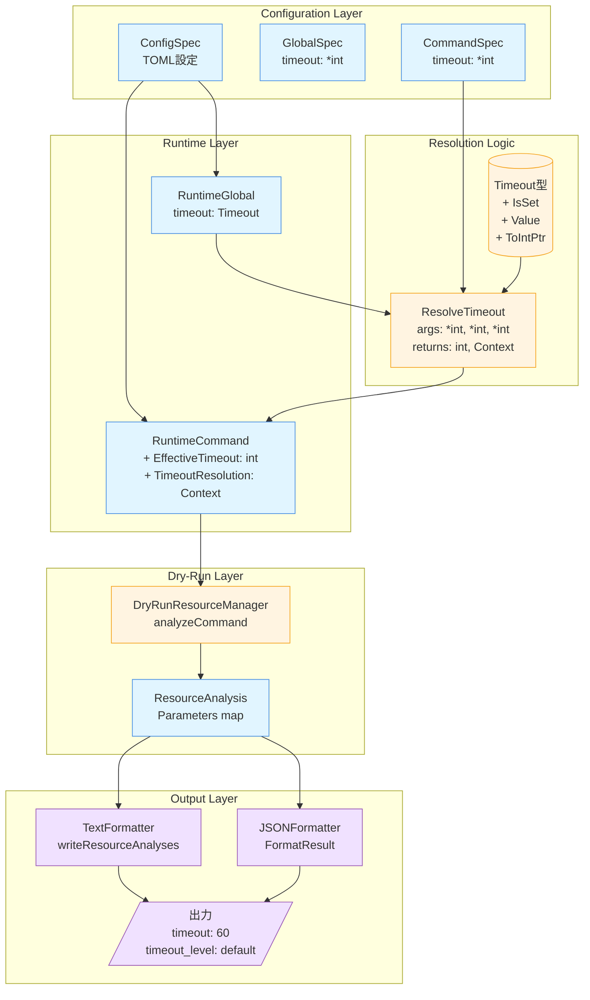
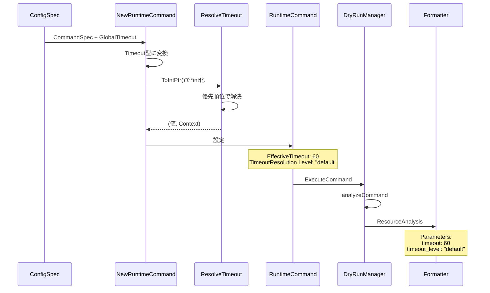
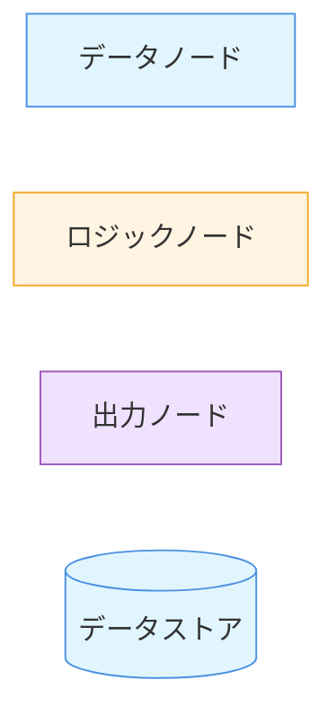

# アーキテクチャ設計書: タイムアウト解決コンテキストの強化

## 1. 概要

本設計書は、dry-runモードにおけるタイムアウト値の解決過程の可視化機能の実装アーキテクチャを定義する。既存の`ResolveTimeout`関数と`TimeoutResolutionContext`を活用し、重複している`ResolveEffectiveTimeout`を削除してコードを統一する。

## 2. アーキテクチャ原則

### 2.1. 設計原則

1. **コードの統一**: タイムアウト解決ロジックを`ResolveTimeout`に一元化
2. **型安全性の維持**: `common.Timeout`型の活用を継続
3. **重複の削除**: `ResolveEffectiveTimeout`を削除し、保守性を向上
4. **将来拡張性**: グループレベルタイムアウトの追加を見据えた設計

### 2.2. 品質属性

- **保守性**: タイムアウト解決ロジックを単一関数に集約し、保守コストを削減
- **可読性**: dry-run出力が直感的に理解できる
- **テスト容易性**: 各レイヤーで独立してテスト可能
- **簡潔性**: 重複コードを削除し、コードベースを簡素化

## 3. システムアーキテクチャ

### 3.1. コンポーネント構成



### 3.2. データフロー



## 4. 詳細設計

### 4.1. データ構造の拡張

#### 4.1.1. RuntimeCommand構造体

```go
type RuntimeCommand struct {
    // 既存フィールド（変更なし）
    Spec             *CommandSpec
    timeout          common.Timeout
    EffectiveTimeout int  // 解決済みタイムアウト値

    // 新規追加
    TimeoutResolution common.TimeoutResolutionContext

    // その他のフィールド...
}
```

**設計判断**:
- `TimeoutResolution`を新規追加し、既存フィールドは変更しない
- `EffectiveTimeout`は既存コードとの互換性のため維持

#### 4.1.2. Timeout型の拡張

`common.Timeout`型に変換メソッドを追加：

```go
// ToIntPtr converts Timeout to *int for compatibility with ResolveTimeout
func (t Timeout) ToIntPtr() *int {
    if !t.IsSet() {
        return nil
    }
    return t.value
}
```

**設計判断**:
- `ResolveTimeout`が`*int`を期待するため、変換メソッドを提供
- nil安全性を保ちつつ、既存関数との橋渡しを行う

### 4.2. タイムアウト解決の統合

#### 4.2.1. NewRuntimeCommandの更新

**現在の実装**:
```go
func NewRuntimeCommand(spec *CommandSpec, globalTimeout common.Timeout) (*RuntimeCommand, error) {
    commandTimeout := common.NewFromIntPtr(spec.Timeout)
    effectiveTimeout := common.ResolveEffectiveTimeout(commandTimeout, globalTimeout)

    return &RuntimeCommand{
        Spec:             spec,
        timeout:          commandTimeout,
        EffectiveTimeout: effectiveTimeout,
        // ...
    }, nil
}
```

**更新後の実装**:
```go
func NewRuntimeCommand(
    spec *CommandSpec,
    globalTimeout common.Timeout,
    groupName string,  // 新規追加（コンテキスト情報用）
) (*RuntimeCommand, error) {
    commandTimeout := common.NewFromIntPtr(spec.Timeout)

    // ResolveTimeoutを使用してコンテキスト情報も取得
    effectiveTimeout, resolutionContext := common.ResolveTimeout(
        commandTimeout.ToIntPtr(),
        nil,  // グループタイムアウト（現在未サポート）
        globalTimeout.ToIntPtr(),
        spec.Name,
        groupName,
    )

    return &RuntimeCommand{
        Spec:              spec,
        timeout:           commandTimeout,
        EffectiveTimeout:  effectiveTimeout,
        TimeoutResolution: resolutionContext,  // 新規追加
        // ...
    }, nil
}
```

**設計判断**:
- `groupName`パラメータを追加（コンテキスト情報の充実化）
- `ResolveTimeout`と`ResolveEffectiveTimeout`を統一
- 後方互換性は呼び出し元の更新で対応

### 4.3. Dry-Run出力の更新

#### 4.3.1. analyzeCommandの更新

**現在の実装**:
```go
analysis := ResourceAnalysis{
    // ...
    Parameters: map[string]any{
        "command":           cmd.ExpandedCmd,
        "working_directory": cmd.EffectiveWorkDir,
        "timeout":           cmd.Timeout(),  // 誤り
    },
}
```

**更新後の実装**:
```go
analysis := ResourceAnalysis{
    // ...
    Parameters: map[string]any{
        "command":           cmd.ExpandedCmd,
        "working_directory": cmd.EffectiveWorkDir,
        "timeout":           cmd.EffectiveTimeout,                 // int値
        "timeout_level":     cmd.TimeoutResolution.Level,          // 新規追加
    },
}
```

**設計判断**:
- `timeout`: 実際に使用される値（int型）
- `timeout_level`: 値の設定元（string型: "command", "group", "global", "default"）
- シンプルで理解しやすい出力

#### 4.3.2. 出力例

**テキスト形式**:
```
=== RESOURCE OPERATIONS ===
1. Execute command: /bin/sleep [command]
   Operation: execute
   Target: /bin/sleep
   Timestamp: 14:23:45
   Parameters:
     command: /bin/sleep
     working_directory: /home/user/project
     timeout: 60
     timeout_level: default
```

**JSON形式**:
```json
{
  "resource_analyses": [
    {
      "type": "command",
      "operation": "execute",
      "target": "/bin/sleep",
      "parameters": {
        "command": "/bin/sleep",
        "working_directory": "/home/user/project",
        "timeout": 60,
        "timeout_level": "default"
      }
    }
  ]
}
```

## 5. 実装上の考慮事項

### 5.1. 実装戦略

#### フェーズ1: 基盤整備
1. `Timeout.ToIntPtr()`メソッドの追加
2. 既存の`ResolveTimeout`のテスト拡充

#### フェーズ2: RuntimeCommandの拡張
1. `TimeoutResolution`フィールドの追加
2. `NewRuntimeCommand`の実装更新（`ResolveTimeout`使用）
3. 呼び出し元（`ExpandCommand`など）の更新

#### フェーズ3: ResolveEffectiveTimeoutの削除
1. `ResolveEffectiveTimeout`を使用している箇所の特定
2. すべての呼び出し箇所を`ResolveTimeout`に置き換え
3. `ResolveEffectiveTimeout`関数とそのテストの削除

#### フェーズ4: Dry-Run統合
1. `analyzeCommand`の更新（`timeout_level`追加）
2. 出力フォーマッタのテスト
3. 統合テストの実施

### 5.2. 呼び出し元の影響分析

`NewRuntimeCommand`を呼び出す箇所を調査：

```bash
grep -r "NewRuntimeCommand" internal/
```

主な呼び出し元:
- `internal/runner/config/expander.go`: `ExpandCommand`関数
  - `RuntimeGroup`から`groupName`を取得可能
  - 影響: 中程度（引数追加のみ）

### 5.3. エラーハンドリング

- `ToIntPtr()`はエラーを返さない（構造的に安全）
- `ResolveTimeout`はエラーを返さない（すべてのケースでデフォルト値にフォールバック）
- 新規エラーケースなし

### 5.4. パフォーマンス考慮

- `TimeoutResolution`構造体は軽量（文字列3つ）
- dry-runモードのみで使用されるため、通常実行への影響なし
- 追加のメモリフットプリントは無視できる程度

## 6. テスト戦略

### 6.1. 単体テスト

#### Timeout.ToIntPtr()
- 未設定時（nil）
- 0（無制限）
- 正の値

#### NewRuntimeCommand
- コマンドレベルタイムアウト設定時
- グローバルタイムアウト設定時
- デフォルト使用時
- `TimeoutResolution`の正確性

### 6.2. 統合テスト

#### Dry-Run出力テスト
- テキストフォーマットでの`timeout_level`表示
- JSONフォーマットでの`timeout_level`表示
- 各レベル（command, global, default）のケース

### 6.3. テストケースマトリクス

| コマンドTimeout | グローバルTimeout | 期待値 | 期待Level |
|----------------|------------------|--------|-----------|
| 30             | 60               | 30     | command   |
| nil            | 60               | 60     | global    |
| nil            | nil              | 60     | default   |
| 0              | 60               | 0      | command   |
| nil            | 0                | 0      | global    |

## 7. 将来拡張

### 7.1. グループレベルタイムアウトのサポート

現在の設計は、将来のグループレベルタイムアウト追加を考慮している：

```go
effectiveTimeout, resolutionContext := common.ResolveTimeout(
    commandTimeout.ToIntPtr(),
    groupTimeout.ToIntPtr(),  // 将来実装時に追加
    globalTimeout.ToIntPtr(),
    spec.Name,
    groupName,
)
```

**必要な変更**:
1. `GroupSpec`に`Timeout *int`フィールドを追加
2. `RuntimeGroup`に`timeout common.Timeout`フィールドを追加
3. `NewRuntimeCommand`に`groupTimeout`パラメータを追加
4. テストケースの追加

### 7.2. より詳細なコンテキスト情報

将来的には以下の情報も追加可能：

- 設定ファイルのパス
- 設定行番号
- 継承チェーン（"command -> global -> default"）

## 8. リスク管理

### 8.1. API変更リスク

**リスク**: `NewRuntimeCommand`のシグネチャ変更が既存コードに影響

**緩和策**:
- コンパイルエラーで検出可能
- 呼び出し箇所が限定的（主に`ExpandCommand`）
- 段階的なロールアウト

**代替案**:
- オプショナルパラメータパターン（構造体でラップ）
- ただし、Go言語の慣習的には直接追加が望ましい

### 8.2. ResolveEffectiveTimeout削除リスク

**リスク**: 削除時に呼び出し箇所を見落とす可能性

**緩和策**:
- コンパイルエラーで確実に検出可能（未使用関数の削除なので安全）
- `grep -r "ResolveEffectiveTimeout"`で全箇所を事前確認
- テストを実行して動作確認

### 8.3. テストカバレッジ

**リスク**: `ResolveTimeout`の既存テストが不十分

**緩和策**:
- フェーズ1でテストを拡充
- 統合テストで実際の動作を確認
- `ResolveEffectiveTimeout`のテストケースを`ResolveTimeout`に移植

## 9. 非機能要件の達成

### 9.1. コードの簡潔性
- ✅ `ResolveEffectiveTimeout`を削除し、`ResolveTimeout`に統一
- ✅ タイムアウト解決ロジックを一元化
- ✅ 保守すべきコードパスを削減

### 9.2. 型安全性
- ✅ `common.Timeout`型を継続使用
- ✅ `ToIntPtr()`で安全に変換
- ✅ nilポインタリスクなし

### 9.3. テスト容易性
- ✅ 各関数が独立してテスト可能
- ✅ dry-run出力が構造化されており検証容易
- ✅ モック不要（純粋関数）
- ✅ 削除されたコードのテストメンテナンス負担が軽減

## 10. 設計の凡例（Mermaid図用）



**凡例**:
- **データノード** (青): 構造体、データ型
- **ロジックノード** (黄): 関数、処理
- **出力ノード** (紫): フォーマッタ、出力
- **データストア** (シリンダー): 型定義、定数

## 11. まとめ

本設計は、以下の特徴を持つ：

1. **コードの統一**: `ResolveTimeout`に一元化し、重複した`ResolveEffectiveTimeout`を削除
2. **既存資産の活用**: `ResolveTimeout`と`TimeoutResolutionContext`を活用
3. **保守性の向上**: タイムアウト解決ロジックを単一関数に集約
4. **将来拡張性**: グループレベルタイムアウトの追加を見据えた設計
5. **実用性**: dry-run出力でのデバッグ容易性を大幅に向上

実装は4フェーズで段階的に進め、各フェーズで十分なテストを行うことで、リスクを最小化する。特にフェーズ3での`ResolveEffectiveTimeout`削除は、すべての呼び出し箇所を確実に更新する必要がある。
