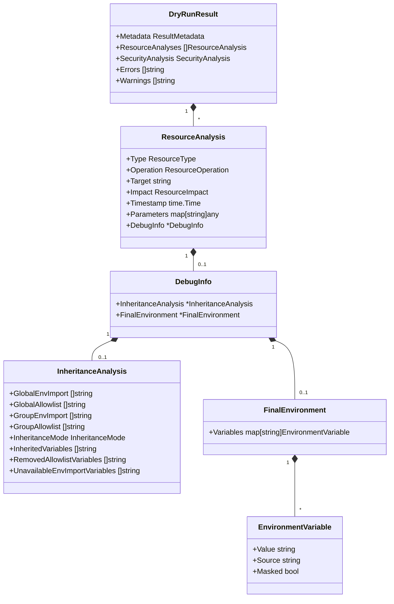

# アーキテクチャ設計書: Dry-Run Debug情報のJSON出力対応

## 1. ドキュメント概要

### 1.1 目的
本ドキュメントは、dry-runモードでJSON形式を指定した際のデバッグ情報出力機能のハイレベルなアーキテクチャを定義する。実装の詳細ではなく、システムの全体構造、コンポーネント間の関係、データフロー、設計の決定事項に焦点を当てる。

### 1.2 対象読者
- プロジェクトアーキテクト
- 技術リード
- 実装者（詳細設計・実装前の全体理解のため）
- レビュアー

### 1.3 関連ドキュメント
- [要件定義書](./01_requirements.ja.md)
- 詳細設計書（03_detailed_design.ja.md）
- 実装計画書（04_implementation_plan.ja.md）

## 2. アーキテクチャの原則

### 2.1 Single Source of Truth（信頼できる唯一の情報源）
デバッグ情報の収集と生成は一箇所で行い、テキスト形式とJSON形式の出力が同じデータソースから派生することを保証する。これにより：
- **一貫性**: 同じDetail Levelで両形式の出力内容が一致
- **保守性**: データ収集ロジックの変更が1箇所で完結
- **テスト容易性**: データ収集とフォーマットを独立してテスト可能

### 2.2 関心の分離（Separation of Concerns）
システムを以下の3つの明確な責務を持つ層に分割する：

1. **データ収集層**: 実行時情報から構造化データを生成
2. **データ構造層**: デバッグ情報を表現する型定義
3. **フォーマット層**: 構造化データを特定の形式（Text/JSON）で出力

### 2.3 後方互換性
既存のJSON Schema（`DryRunResult`）に対して後方互換性を維持する：
- 新しいフィールドは`omitempty`タグを使用
- 既存のフィールドの型や意味を変更しない
- 既存のdry-runユーザーに影響を与えない

### 2.4 段階的な情報開示
Detail Levelに基づいて情報量を制御し、ユーザーが必要な詳細度を選択できるようにする：
- **Summary**: 最小限の情報（デバッグ情報なし）
- **Detailed**: 基本的な設定情報と計算結果
- **Full**: すべてのデバッグ情報（差分情報、最終環境変数を含む）

## 3. システムアーキテクチャ概要

### 3.1 アーキテクチャ全体図

以下の図は、dry-runモードでのJSON形式とTEXT形式の両方の出力フローを示している。これらのフォーマットでアーキテクチャを分けている理由は、**出力タイミングとデータ処理方式の根本的な違い**による：

- **TEXT形式**: グループ実行中に**リアルタイム**で情報を出力
  - データ収集層で生成した`InheritanceAnalysis`や`FinalEnvironment`を即座にFormat Helpersでテキスト化
  - ユーザーは処理の進行をリアルタイムで確認可能

- **JSON形式**: 全実行終了後に**まとめて構造化**して出力
  - データ収集層で生成した情報を`DryRunResult`に蓄積
  - すべての処理完了後、構造化されたデータを一括でJSON化
  - 機械可読な完全な構造化データを提供

この設計により、インタラクティブなデバッグ（TEXT形式）とプログラムによる処理（JSON形式）の両方のユースケースに最適化されている。


**凡例:**
- 実線矢印（`-->`）: プログラム実行中のリアルタイム処理
- 点線矢印（`-.->`, dotted）: 実行終了時の処理

### 3.2 データフロー概要

**Dry-Run実行時のデータフロー:**

1. **グループ実行開始**: `GroupExecutor`がグループ処理を開始
2. **継承分析情報の収集**: `CollectInheritanceAnalysis()`を呼び出し、グローバル設定とグループ設定から継承分析データを生成
3. **グループレベルのResourceAnalysis作成**: グループごとに`ResourceAnalysis`（type="group"）を作成し、継承分析情報を`DebugInfo`に格納
4. **コマンド実行前の環境変数収集**: 各コマンド実行時、`CollectFinalEnvironment()`を呼び出し、最終環境変数を収集
5. **コマンドレベルのResourceAnalysis更新**: コマンドの`ResourceAnalysis`の`DebugInfo`に最終環境変数情報を追加
6. **結果の集約**: `ResourceManager`がすべての`ResourceAnalysis`を`DryRunResult`に集約
7. **フォーマットと出力**:
   - JSON形式: 全実行終了後 `JSONFormatter`が`DryRunResult`をJSON化
   - Text形式: グループ実行中に`FormatInheritanceAnalysisText()`/`FormatFinalEnvironmentText()`で段階的に出力

## 4. コンポーネント設計

### 4.1 データ収集層（新規作成）

#### 4.1.1 責務
- 実行時の設定とランタイムデータから構造化デバッグ情報を生成
- Detail Levelに基づいて出力するフィールドを制御
- テキスト形式とJSON形式の両方で使用される信頼できる唯一の情報源

#### 4.1.2 主要な関数


**CollectInheritanceAnalysis:**
- **入力**:
  - `runtimeGlobal *runnertypes.RuntimeGlobal`: ランタイムグローバル情報（`GlobalSpec`を包含）
  - `runtimeGroup *runnertypes.RuntimeGroup`: ランタイムグループ情報（`GroupSpec`と継承モードを包含）
  - `detailLevel resource.DryRunDetailLevel`: Detail Level
- **出力**: `*InheritanceAnalysis`: 継承分析情報
- **動作**:
  - 設定値フィールド（`GlobalEnvImport`, `GlobalAllowlist`, `GroupEnvImport`, `GroupAllowlist`）は常に設定
  - 計算値フィールド（`InheritanceMode`）は常に設定
  - 差分情報フィールド（`InheritedVariables`, `RemovedAllowlistVariables`, `UnavailableEnvImportVariables`）は`DetailLevelFull`の場合のみ設定、それ以外はnil

**CollectFinalEnvironment:**
- **入力**:
  - `envMap map[string]executor.EnvVar`: 最終環境変数マップ
  - `detailLevel resource.DryRunDetailLevel`: Detail Level
  - `showSensitive bool`: センシティブ情報表示フラグ
- **出力**: `*FinalEnvironment`: 最終環境変数情報（`DetailLevelFull`以外ではnil）
- **動作**:
  - `DetailLevelFull`の場合のみ非nilを返す
  - 環境変数ごとに値、出所（source）、マスク状態を記録

#### 4.1.3 配置
新しいパッケージまたは既存の`internal/runner/debug`パッケージ内に実装する。

### 4.2 データ構造層（拡張）

#### 4.2.1 構造体階層



#### 4.2.2 ResourceTypeとResourceOperationの拡張

**新しいResourceType:**
- `ResourceTypeGroup = "group"`: グループレベルの分析を表現

**新しいResourceOperation:**
- `OperationAnalyze = "analyze"`: 設定分析操作を表現

#### 4.2.3 InheritanceModeのJSON変換

`runnertypes.InheritanceMode`に`MarshalJSON()`メソッドを実装し、JSON出力時に人間が読める文字列表現（"inherit", "explicit", "reject"）を出力する。


### 4.3 実行層（修正）

#### 4.3.1 GroupExecutorの変更

**現在の動作:**


**新しい動作:**


**主な変更点:**
1. 出力形式に応じた分岐処理
2. JSON形式では`ResourceManager`を通じてデータを記録
3. テキスト形式では収集したデータをフォーマットヘルパーで即座に出力
4. 両形式で同じデータ収集関数を使用（Single Source of Truth）

#### 4.3.2 ResourceManagerの変更

**新しいメソッド:**
```go
// RecordGroupAnalysis records a group-level resource analysis with debug info
func (rm *ResourceManager) RecordGroupAnalysis(
    groupName string,
    debugInfo *DebugInfo,
) error

// UpdateCommandDebugInfo updates an existing command ResourceAnalysis with debug info
func (rm *ResourceManager) UpdateCommandDebugInfo(
    commandTarget string,
    debugInfo *DebugInfo,
) error
```

**データフローの変更:**


### 4.4 フォーマット層

#### 4.4.1 フォーマッター構造


#### 4.4.2 フォーマッターの責務

**TextFormatter:**
- `DryRunResult`全体をテキスト形式で出力
- グループ実行中の即時出力は**含まない**（`GroupExecutor`が`FormatHelper`を直接使用）
- 最終サマリーの出力に使用

**JSONFormatter:**
- `DryRunResult`全体をJSON形式で出力
- `json.Marshal()`を使用
- 構造体の`json`タグに基づいて自動的にフォーマット

**FormatHelper:**
- データ収集層が生成した構造化データをテキスト形式で出力
- `GroupExecutor`から直接呼び出される（テキスト形式のみ）
- 既存の`PrintFromEnvInheritance()`と`PrintFinalEnvironment()`の出力ロジックを再利用

### 4.5 テキスト形式とJSON形式の一貫性保証

#### 4.5.1 一貫性保証のメカニズム

テキスト形式は都度出力、JSON形式はまとめて出力という異なるタイミングでも、出力内容の一貫性は以下のメカニズムで保証される：


#### 4.5.2 一貫性を保証する3つの原則

**1. Single Source of Truth（唯一のデータソース）**

両形式で**同じデータ収集関数**を使用：
```go
// テキスト形式もJSON形式も同じ関数を呼び出す
analysis := CollectInheritanceAnalysis(runtimeGlobal, runtimeGroup, detailLevel)

// テキスト形式: 即座にフォーマット
if outputFormat == "text" {
    FormatInheritanceAnalysisText(stdout, analysis, groupName)
}

// JSON形式: 構造体に格納（後でJSON化）
if outputFormat == "json" {
    rm.RecordGroupAnalysis(groupName, &DebugInfo{
        InheritanceAnalysis: analysis,
    })
}
```

**2. 同一の構造化データ**

フォーマット層は**同じ構造体**（`InheritanceAnalysis`, `FinalEnvironment`）を扱う：
- テキスト形式: 構造体のフィールドを読み取ってテキスト生成
- JSON形式: 構造体を`json.Marshal()`でJSON化

データの解釈や変換は行わず、構造体の値をそのまま出力するため、内容が一致する。

**3. Detail Levelによる統一制御**

データ収集時に`detailLevel`パラメータで出力内容を制御：
```go
func CollectInheritanceAnalysis(runtimeGlobal *runnertypes.RuntimeGlobal, runtimeGroup *runnertypes.RuntimeGroup, detailLevel DryRunDetailLevel) *InheritanceAnalysis {
    analysis := &InheritanceAnalysis{
        GlobalEnvImport: runtimeGlobal.GlobalSpec.EnvImport,  // 常に設定
        InheritanceMode: runtimeGroup.InheritanceMode,        // 常に設定
    }

    // DetailLevelFullの場合のみ差分情報を追加
    if detailLevel == DetailLevelFull {
        analysis.InheritedVariables = calculateInherited(...)
    }

    return analysis  // 両形式で同じデータを返す
}
```

#### 4.5.3 一貫性のテスト戦略

一貫性を検証するテストケース：


**具体的なテストケース:**
- 同じグループ設定で両形式を実行
- テキスト出力から環境変数リストを抽出
- JSON出力から`inheritance_analysis.inherited_variables`を抽出
- 両方のリストが完全に一致することを検証

#### 4.5.4 一貫性が崩れる可能性とその対策

**潜在的なリスク:**

| リスク | 発生条件 | 対策 |
|--------|---------|------|
| データ収集関数の重複実装 | Text用とJSON用で別々の関数を作成 | **禁止**: 必ず同じ`Collect*`関数を使用 |
| フォーマット時のデータ変換 | フォーマッターが独自にデータ加工 | **禁止**: 構造体の値をそのまま出力 |
| タイミングによるデータ変化 | 収集タイミングのずれで異なる値 | **保証**: 同じタイミングで`Collect*`を呼び出す |
| Detail Levelの解釈違い | フォーマッターごとに異なる判定 | **統一**: データ収集層でのみ判定 |

**実装時のルール:**
1. ✅ **DO**: データ収集関数は両形式で共通化
2. ✅ **DO**: フォーマッターは構造体フィールドの単純な出力のみ
3. ❌ **DON'T**: フォーマッター内でビジネスロジックを実装
4. ❌ **DON'T**: 出力形式によってデータ収集ロジックを変更

## 5. Detail Levelによる動作の違い

### 5.1 Detail Level制御フロー


### 5.2 各レベルでの出力内容

| Detail Level | 継承分析情報 | 差分情報 | 最終環境変数 |
|--------------|-------------|---------|-------------|
| **Summary** | ❌ なし | ❌ なし | ❌ なし |
| **Detailed** | ✅ 基本情報のみ<br/>（設定値 + InheritanceMode） | ❌ なし | ❌ なし |
| **Full** | ✅ すべて | ✅ あり | ✅ あり |

**具体例（JSON出力）:**


## 6. データ構造の設計決定

### 6.1 グループレベルとコマンドレベルの分離

**設計決定**: グループごとに`ResourceAnalysis`（type="group"）を作成し、継承分析情報をそこに格納する。

**理由:**
1. **コマンドを含まないグループへの対応**: グループにコマンドが定義されていない場合でも、継承分析情報をJSON出力に含めることができる
2. **情報の論理的な整理**: グループレベルの情報（継承分析）とコマンドレベルの情報（最終環境変数）を明確に分離
3. **拡張性**: 将来的にグループレベルの他の分析情報（例: 変数解決の深さ、タイムアウト設定など）を追加しやすい

**構造例:**
```json
{
  "resource_analyses": [
    {
      "type": "group",
      "operation": "analyze",
      "target": "example-group",
      "debug_info": {
        "inheritance_analysis": {...}
      }
    },
    {
      "type": "command",
      "operation": "execute",
      "target": "/usr/bin/echo",
      "debug_info": {
        "final_environment": {...}
      }
    }
  ]
}
```

### 6.2 DebugInfoのオプショナル性

**設計決定**: `DebugInfo`とそのサブフィールドはすべて`omitempty`タグを付与し、オプショナルとする。

**理由:**
1. **後方互換性**: 既存のJSON出力に影響を与えない
2. **Detail Levelによる制御**: 不要な情報を出力しない
3. **JSONのクリーンさ**: nilフィールドをJSON出力から除外し、読みやすさを向上

**タグの例:**
```go
type ResourceAnalysis struct {
    // ... existing fields ...
    DebugInfo *DebugInfo `json:"debug_info,omitempty"`
}

type DebugInfo struct {
    InheritanceAnalysis *InheritanceAnalysis `json:"inheritance_analysis,omitempty"`
    FinalEnvironment    *FinalEnvironment    `json:"final_environment,omitempty"`
}

type InheritanceAnalysis struct {
    // 基本フィールド（常に出力）
    GlobalEnvImport []string        `json:"global_env_import"`
    GlobalAllowlist []string        `json:"global_allowlist"`
    GroupEnvImport  []string        `json:"group_env_import"`
    GroupAllowlist  []string        `json:"group_allowlist"`
    InheritanceMode InheritanceMode `json:"inheritance_mode"`

    // 差分フィールド（DetailLevelFullのみ出力）
    InheritedVariables            []string `json:"inherited_variables,omitempty"`
    RemovedAllowlistVariables     []string `json:"removed_allowlist_variables,omitempty"`
    UnavailableEnvImportVariables []string `json:"unavailable_env_import_variables,omitempty"`
}
```

### 6.3 InheritanceModeのJSON表現

**設計決定**: `InheritanceMode`に`MarshalJSON()`メソッドを実装し、JSON出力時に文字列表現（"inherit", "explicit", "reject"）を使用する。

**理由:**
1. **可読性**: 数値（0, 1, 2）よりも文字列の方が意味が明確
2. **型安全性**: 内部では`int`ベースの列挙型を維持し、型安全性を保つ
3. **既存コードとの互換性**: `String()`メソッドを再利用し、実装を簡潔に保つ

**実装例:**
```go
func (m InheritanceMode) MarshalJSON() ([]byte, error) {
    return json.Marshal(m.String())
}
```

## 7. エラーハンドリングとエッジケース

### 7.1 エラー処理戦略


**基本方針:**
- デバッグ情報の収集失敗は**致命的エラーとしない**
- エラーが発生した場合は、ログに記録し、空のDebugInfoまたはnilを使用
- dry-run実行自体は継続する

### 7.2 エッジケース

| ケース | 対応 |
|--------|------|
| グローバル設定が空 | 空のスライスとして記録（nilではなく`[]`） |
| グループ設定が未定義 | 継承モードを"inherit"として処理 |
| 環境変数が存在しない | 空のmapとして記録 |
| センシティブ情報のマスク失敗 | デフォルトで"[REDACTED]"を使用 |
| JSON marshal失敗 | エラーを返し、テキスト形式へのフォールバック |

## 8. パフォーマンス考慮事項

### 8.1 パフォーマンス最適化戦略

**データ収集の最適化:**
- Detail Levelが低い場合、不要なデータ収集をスキップ
- 環境変数のマップコピーを最小限に抑える
- 文字列の結合には`strings.Builder`を使用

**メモリ効率:**
- `omitempty`タグにより、不要なフィールドのメモリ割り当てを回避
- 大きな環境変数値は適切に切り詰め

**想定オーバーヘッド:**
- JSON形式: 5-10%（データ収集 + JSON marshaling）
- Text形式: 変更なし（既存の実装を再利用）

### 8.2 スケーラビリティ

**大規模設定への対応:**
- 数百のグループ: 各グループごとに`ResourceAnalysis`を作成するが、Detail Levelで制御可能
- 大量の環境変数: `DetailLevelSummary`を使用することで出力をスキップ可能
- 長時間実行: dry-runモードでは実際のコマンド実行がないため、メモリ使用量は限定的

## 9. セキュリティ考慮事項

### 9.1 センシティブ情報の保護


**保護対象:**
- パスワード、APIキー、トークンなど
- `redaction.DefaultSensitivePatterns()`でパターンマッチング
- JSON出力でも同じルールを適用

**マスク戦略:**
- `ShowSensitive=false`の場合、値を`"[REDACTED]"`に置き換え
- `Masked=true`フラグを設定し、マスク状態を明示
- JSONパーサーを使用するツールがマスク状態を判別可能

### 9.2 情報漏洩リスク

**リスク:**
- dry-run結果のJSON出力がログファイルやCI/CD環境に保存される可能性
- センシティブな環境変数が意図せず公開される

**緩和策:**
- デフォルトで`ShowSensitive=false`
- ユーザーに明示的なフラグ（`--dry-run-show-sensitive`）でのみセンシティブ情報を表示
- ドキュメントで情報漏洩リスクを明記

## 10. テスト戦略

### 10.1 テストレイヤー


### 10.2 テストケース

**ユニットテスト:**
- [ ] `CollectInheritanceAnalysis()`: 各Detail Levelでの出力内容検証
- [ ] `CollectFinalEnvironment()`: センシティブ情報マスキング検証
- [ ] `InheritanceMode.MarshalJSON()`: JSON変換の正確性
- [ ] `FormatInheritanceAnalysisText()`: テキスト出力の内容検証

**統合テスト:**
- [ ] JSON出力の妥当性（`jq`で解析可能か）
- [ ] テキスト形式とJSON形式の内容一致
- [ ] Detail Levelごとの出力内容検証
- [ ] コマンドを含まないグループの処理

**回帰テスト:**
- [ ] 既存のテキスト出力が変更されていないこと
- [ ] 既存のJSON Schemaとの互換性

## 11. 実装の段階的アプローチ

### 11.1 フェーズ1: データ構造とデータ収集層

**目標**: 新しいデータ構造と収集関数を実装し、ユニットテストで検証

**成果物:**
- `DebugInfo`, `InheritanceAnalysis`, `FinalEnvironment`構造体
- `CollectInheritanceAnalysis()`, `CollectFinalEnvironment()`関数
- `InheritanceMode.MarshalJSON()`メソッド
- ユニットテスト

**リスク**: 低（既存コードへの影響なし）

### 11.2 フェーズ2: フォーマットヘルパー

**目標**: テキスト形式出力のヘルパー関数を実装

**成果物:**
- `FormatInheritanceAnalysisText()`, `FormatFinalEnvironmentText()`関数
- ユニットテスト

**リスク**: 低（既存のロジックを再利用）

### 11.3 フェーズ3: GroupExecutorとResourceManagerの統合

**目標**: 実行層を修正し、データ収集とフォーマット関数を統合

**成果物:**
- `GroupExecutor`の修正（出力形式による分岐）
- `ResourceManager`の新メソッド（`RecordGroupAnalysis`, `UpdateCommandDebugInfo`）
- 統合テスト

**リスク**: 中（既存のdry-run動作への影響）

### 11.4 フェーズ4: 統合テストと回帰テスト

**目標**: すべての機能が統合され、既存機能が正常に動作することを確認

**成果物:**
- End-to-Endテスト
- 回帰テスト
- ドキュメント更新

**リスク**: 低（テストによる検証）

## 12. 将来の拡張性

### 12.1 追加のデバッグ情報

現在の設計では、`DebugInfo`構造体に新しいフィールドを追加することで、他のデバッグ情報を容易に追加できる：

```go
type DebugInfo struct {
    InheritanceAnalysis *InheritanceAnalysis `json:"inheritance_analysis,omitempty"`
    FinalEnvironment    *FinalEnvironment    `json:"final_environment,omitempty"`

    // 将来の拡張例:
    VariableResolution  *VariableResolution  `json:"variable_resolution,omitempty"`
    TimeoutAnalysis     *TimeoutAnalysis     `json:"timeout_analysis,omitempty"`
    DependencyGraph     *DependencyGraph     `json:"dependency_graph,omitempty"`
}
```

### 12.2 他の出力形式

フォーマッター層の設計により、新しい出力形式（YAML, XMLなど）を追加しやすい：

```go
type YAMLFormatter struct{}

func (f *YAMLFormatter) FormatResult(result *DryRunResult, opts FormatterOptions) (string, error) {
    // YAML形式で出力
}
```

### 12.3 リアルタイムストリーミング

現在の設計では最終的に一括出力されるが、将来的にはストリーミング形式でリアルタイムに出力することも可能：

```json
{"type": "group_start", "group": "example", "timestamp": "..."}
{"type": "command", "target": "/usr/bin/echo", "debug_info": {...}}
{"type": "group_end", "group": "example", "duration": 123}
```

## 13. まとめ

### 13.1 アーキテクチャの利点

1. **Single Source of Truth**: データ収集が一箇所に集約され、テキスト形式とJSON形式の一貫性が保証される
2. **関心の分離**: データ収集、構造、フォーマットが明確に分離され、保守性が高い
3. **後方互換性**: 既存のJSON Schemaと完全に互換性があり、既存ユーザーに影響を与えない
4. **拡張性**: 新しいデバッグ情報や出力形式を追加しやすい設計
5. **段階的実装**: フェーズごとに独立して実装・テスト可能

### 13.2 主要な設計決定

1. **グループレベルのResourceAnalysis**: コマンドを含まないグループにも対応
2. **Detail Levelによる制御**: ユーザーが必要な詳細度を選択可能
3. **InheritanceModeのJSON変換**: 人間が読める文字列表現を使用
4. **データ収集とフォーマットの分離**: Single Source of Truthを実現

### 13.3 次のステップ

詳細設計書（03_detailed_design.ja.md）で以下を定義：
- 各関数のシグネチャと実装詳細
- エラーハンドリングの具体的な手順
- テストケースの詳細仕様
- JSONスキーマの完全な定義
