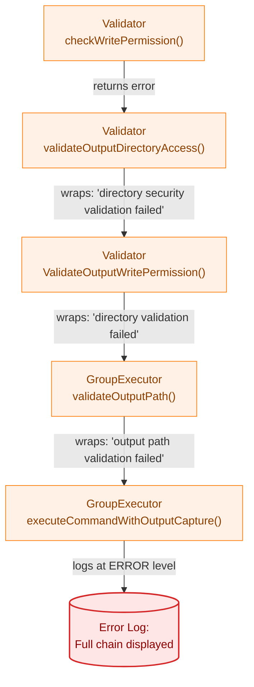
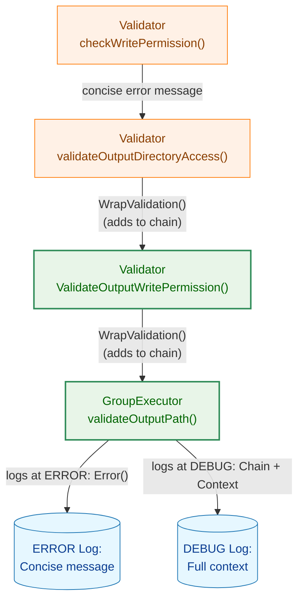
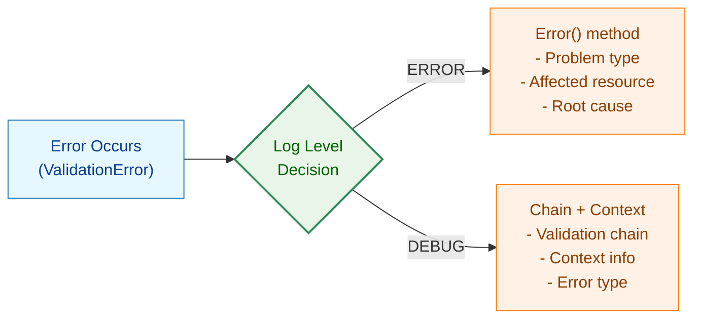
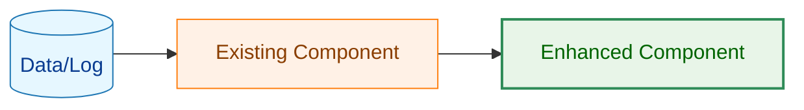
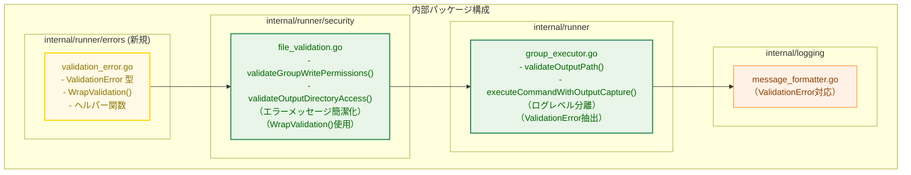
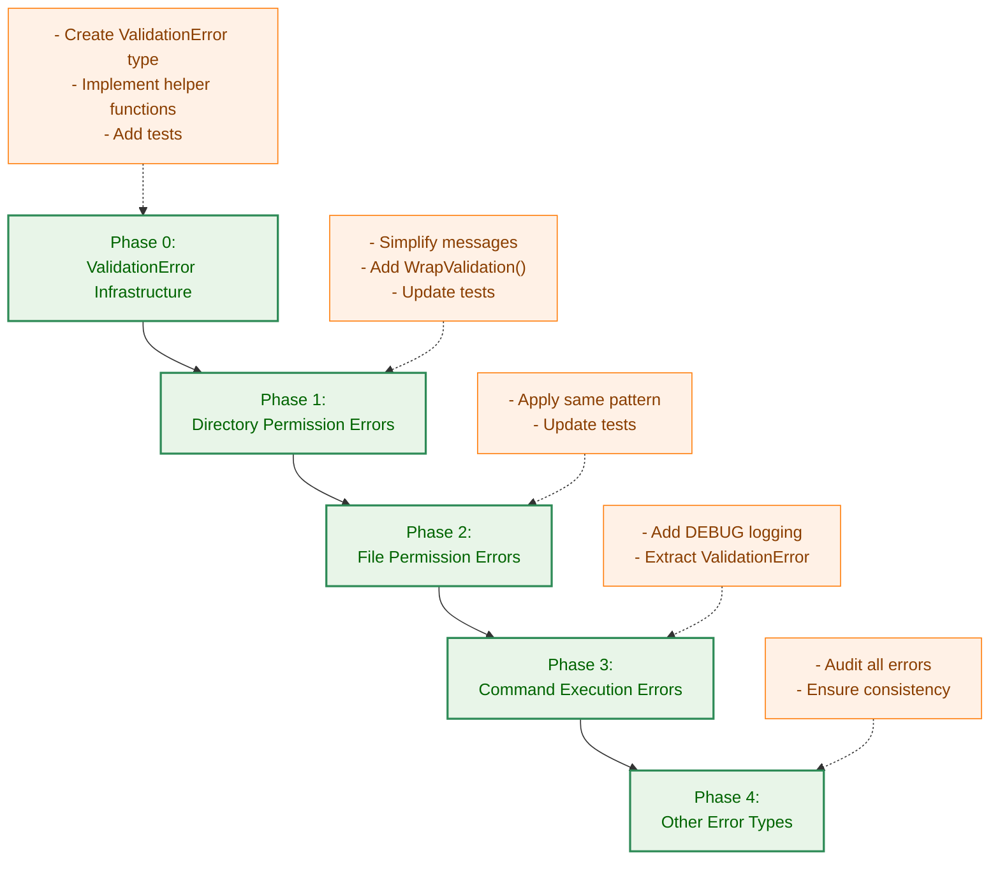
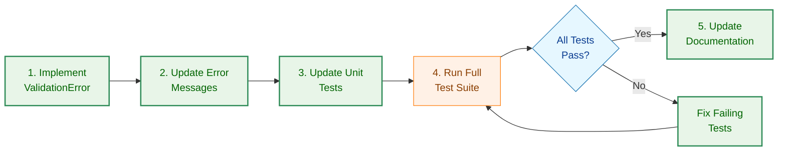

# アーキテクチャ設計書: エラーメッセージ改善

## 1. システム概要

### 1.1 アーキテクチャ目標

- エラーメッセージの簡潔化と可読性向上
- ログレベルによる情報の適切な分離
- デバッグ時の検証チェーン追跡を可能にする
- 既存のエラー型システムとの互換性維持

### 1.2 設計原則

- **ユーザーファースト**: ユーザーが即座に理解できる簡潔なメッセージ
- **デバッグ容易性**: 開発者がエラーの発生経路を追跡できる
- **最小影響**: 既存のエラーハンドリングロジックへの影響を最小化
- **段階的改善**: 重要度の高いエラーから順次改善
- **一貫性**: 全てのエラーメッセージで統一されたフォーマット

## 2. 現状分析

### 2.1 現在のエラー生成フロー



**問題点**:
- 各レベルで類似した表現（"validation failed"）が重複
- 根本原因（パーミッションエラー）が最初のレイヤーで生成されるが、最後に表示される
- 全ての中間ラッピング情報が ERROR レベルで表示される
- エラーチェーンの構造情報が文字列として埋め込まれ、プログラム的に利用できない

### 2.2 エラーチェーンの詳細分析

**現在のエラーチェーン構造**:

```
Level 5: "output path validation failed"
  └─ Level 4: "security validation failed"
      └─ Level 3: "directory validation failed"
          └─ Level 2: "directory security validation failed for /tmp/..."
              └─ Level 1: "invalid directory permissions: directory /tmp/... has group write permissions (0775) but group membership cannot be verified"
```

**分析結果**:
- Level 1: 実際の問題（ユーザーに最も重要）
- Level 2: コンテキスト情報（パス）
- Level 3-5: 内部的な処理階層（技術的詳細）

## 3. 改善後のアーキテクチャ

### 3.1 カスタムエラー型の設計

#### 3.1.1 ValidationError 型の定義

```go
// internal/runner/errors/validation_error.go
package runnererrors

import (
    "errors"
    "fmt"
    "strings"
)

// ValidationError は検証エラーを表すカスタムエラー型
// Error() メソッドは簡潔なメッセージのみを返し、
// 検証チェーン情報は Chain フィールドに保持する
type ValidationError struct {
    // Err は元のエラー（センチネルエラーまたは基底エラー）
    Err error

    // Chain は検証チェーン（関数呼び出し経路）
    // 例: ["ValidateOutputWritePermission", "validateOutputDirectoryAccess", ...]
    Chain []string

    // Context は追加のコンテキスト情報（オプション）
    // 例: {"path": "/tmp/data", "permissions": "0775"}
    Context map[string]interface{}
}

// Error は簡潔なエラーメッセージを返す
// 検証チェーン情報は含めない（DEBUGログで別途表示）
func (e *ValidationError) Error() string {
    return e.Err.Error()
}

// Unwrap は errors.Is() / errors.As() との互換性のためにラップされたエラーを返す
func (e *ValidationError) Unwrap() error {
    return e.Err
}

// GetChain は検証チェーンを返す
// 内部状態を保護するため、スライスのコピーを返す
func (e *ValidationError) GetChain() []string {
    chain := make([]string, len(e.Chain))
    copy(chain, e.Chain)
    return chain
}

// GetContext はコンテキスト情報を返す
// 内部状態を保護するため、マップのコピーを返す（浅いコピー）
func (e *ValidationError) GetContext() map[string]interface{} {
    if e.Context == nil {
        return make(map[string]interface{})
    }
    context := make(map[string]interface{}, len(e.Context))
    for k, v := range e.Context {
        context[k] = v
    }
    return context
}

// FormatChain は検証チェーンを文字列として整形
func (e *ValidationError) FormatChain() string {
    if len(e.Chain) == 0 {
        return ""
    }
    return strings.Join(e.Chain, " -> ")
}
```

#### 3.1.2 ヘルパー関数の定義

```go
// WrapValidation は ValidationError でエラーをラップする
// 既に ValidationError の場合は、チェーンに関数名を追加する
//
// チェーンの順序: 呼び出し元（上位の関数）が先頭、呼び出し先（下位の関数）が末尾
// 例: [validateOutputPath, ValidateOutputWritePermission, validateOutputDirectoryAccess, ...]
func WrapValidation(err error, functionName string) error {
    if err == nil {
        return nil
    }

    var ve *ValidationError
    if errors.As(err, &ve) {
        // 既に ValidationError の場合は、チェーンの先頭に追加
        // これにより呼び出し元が常にチェーンの先頭に来る
        newChain := make([]string, 0, len(ve.Chain)+1)
        newChain = append(newChain, functionName)
        newChain = append(newChain, ve.Chain...)

        return &ValidationError{
            Err:     ve.Err,
            Chain:   newChain,
            Context: ve.Context,
        }
    }

    // 新しい ValidationError を作成
    // Context は空のマップで初期化（nil を避ける）
    return &ValidationError{
        Err:     err,
        Chain:   []string{functionName},
        Context: make(map[string]interface{}),
    }
}

// WrapValidationWithContext はコンテキスト情報を含めて ValidationError でラップする
//
// チェーンの順序: WrapValidation と同様に、呼び出し元が先頭
// コンテキストのマージ: 既存のキーと重複した場合は、新しい値で上書きされる
// nil のコンテキスト: context パラメータが nil の場合も安全に処理される
func WrapValidationWithContext(err error, functionName string, context map[string]interface{}) error {
    if err == nil {
        return nil
    }

    var ve *ValidationError
    if errors.As(err, &ve) {
        // 既に ValidationError の場合は、チェーンの先頭に追加
        newChain := make([]string, 0, len(ve.Chain)+1)
        newChain = append(newChain, functionName)
        newChain = append(newChain, ve.Chain...)

        // コンテキストをマージ（重複キーは新しい値で上書き）
        // nil の場合を考慮してサイズを計算
        veContextLen := 0
        if ve.Context != nil {
            veContextLen = len(ve.Context)
        }
        contextLen := 0
        if context != nil {
            contextLen = len(context)
        }

        newContext := make(map[string]interface{}, veContextLen+contextLen)

        // 既存のコンテキストをコピー（ve.Context が nil でも安全）
        for k, v := range ve.Context {
            newContext[k] = v
        }
        // 新しいコンテキストをマージ（context が nil でも安全）
        for k, v := range context {
            newContext[k] = v  // 既存のキーは上書きされる
        }

        return &ValidationError{
            Err:     ve.Err,
            Chain:   newChain,
            Context: newContext,
        }
    }

    // 新しい ValidationError を作成
    // context が nil の場合は空のマップを初期化
    newContext := make(map[string]interface{})
    for k, v := range context {
        newContext[k] = v
    }

    return &ValidationError{
        Err:     err,
        Chain:   []string{functionName},
        Context: newContext,
    }
}
```

### 3.2 新しいエラー生成フロー



**改善点**:
- エラーメッセージ自体は簡潔（`Error()` メソッド）
- 検証チェーンは `ValidationError.Chain` フィールドに保持
- ERROR レベル: 簡潔なメッセージのみ
- DEBUG レベル: 検証チェーンとコンテキスト情報を含む完全な情報

### 3.3 ログレベル分離の設計



**凡例（Legend）**



## 4. コンポーネント設計

### 4.1 影響を受けるコンポーネント



### 4.2 エラーメッセージ生成パターン

#### 4.2.1 現在のパターン

```go
// internal/runner/security/file_validation.go (現状)
func (v *Validator) validateGroupWritePermissions(...) error {
    // ...
    return fmt.Errorf("%w: directory %s has group write permissions (%04o) but group membership cannot be verified",
        ErrInvalidDirPermissions, dirPath, perm)
}

func (v *Validator) validateOutputDirectoryAccess(...) error {
    // ...
    if err := v.validateCompletePath(...); err != nil {
        return fmt.Errorf("directory security validation failed for %s: %w", currentPath, err)
    }
    // ...
}

func (v *Validator) ValidateOutputWritePermission(...) error {
    // ...
    if err := v.validateOutputDirectoryAccess(dir, realUID); err != nil {
        return fmt.Errorf("directory validation failed: %w", err)
    }
    // ...
}
```

```go
// internal/runner/group_executor.go (現状)
func (e *DefaultGroupExecutor) validateOutputPath(...) error {
    if err := e.validator.ValidateOutputWritePermission(outputPath, realUID); err != nil {
        return fmt.Errorf("output path validation failed: %w", err)
    }
    // ...
}

func (e *DefaultGroupExecutor) executeCommandWithOutputCapture(...) error {
    if err := e.validateOutputPath(...); err != nil {
        slog.Error("Command failed", "command", cmd.Name(), "error", err)
        return err
    }
    // ...
}
```

#### 4.2.2 改善後のパターン

```go
// internal/runner/security/file_validation.go (改善後)
func (v *Validator) validateGroupWritePermissions(...) error {
    // ...
    // 簡潔化: 問題の本質のみを記述
    return fmt.Errorf("%w: %s has group write permissions (%04o) but group membership cannot be verified",
        ErrInvalidDirPermissions, dirPath, perm)
}

func (v *Validator) validateOutputDirectoryAccess(...) error {
    // ...
    if err := v.validateCompletePath(...); err != nil {
        // ValidationError でラップし、検証チェーンに追加
        return runnererrors.WrapValidationWithContext(err,
            "validateOutputDirectoryAccess",
            map[string]interface{}{
                "current_path": currentPath,
            })
    }
    // ...
}

func (v *Validator) ValidateOutputWritePermission(...) error {
    // ...
    if err := v.validateOutputDirectoryAccess(dir, realUID); err != nil {
        // ValidationError でラップし、検証チェーンに追加
        return runnererrors.WrapValidationWithContext(err,
            "ValidateOutputWritePermission",
            map[string]interface{}{
                "output_path": outputPath,
                "real_uid": realUID,
            })
    }
    // ...
}
```

```go
// internal/runner/group_executor.go (改善後)
func (e *DefaultGroupExecutor) validateOutputPath(...) error {
    if err := e.validator.ValidateOutputWritePermission(outputPath, realUID); err != nil {
        // ValidationError でラップし、検証チェーンに追加
        return runnererrors.WrapValidation(err, "validateOutputPath")
    }
    // ...
}

func (e *DefaultGroupExecutor) executeCommandWithOutputCapture(...) error {
    if err := e.validateOutputPath(...); err != nil {
        // ERROR: 簡潔なメッセージ（Error()メソッド）
        slog.Error("Command failed", "command", cmd.Name(), "error", err)

        // DEBUG: 詳細情報（ValidationError の場合のみ）
        var ve *runnererrors.ValidationError
        if errors.As(err, &ve) {
            // 根本エラーを取得（ValidationErrorをアンラップ）
            rootErr := ve.Err

            slog.Debug("Command failed with details",
                "command", cmd.Name(),
                "error_message", err.Error(),           // 簡潔なエラーメッセージ
                "root_error", rootErr,                  // 根本エラー（センチネルエラー）
                "root_error_type", fmt.Sprintf("%T", rootErr),  // 根本エラーの型
                "validation_chain", ve.FormatChain(),   // 検証チェーン
                "context", ve.GetContext())             // コンテキスト情報
        }

        return err
    }
    // ...
}
```

### 4.3 エラーメッセージフォーマット基準

#### 4.3.1 ERROR レベルのメッセージ

**フォーマット**:
```
<エラー型>: <影響を受けるリソース> <問題の具体的内容> <根本原因>
```

**例**:
```
invalid directory permissions: /tmp/data has group write permissions (0775) but group membership cannot be verified
```

**含むべき要素**:
- **エラー型**: ユーザーが問題のカテゴリを理解できる
- **リソース**: 問題が発生した具体的なパスやコマンド
- **具体的内容**: 何が問題なのか（例: パーミッション値）
- **根本原因**: なぜ問題なのか

**含めるべきでない要素**:
- "validation failed" などの一般的な表現の繰り返し
- 内部的な関数名や処理ステップ
- スタックトレース的な情報

**実装における注意点**:
- `Error()` メソッドは簡潔なメッセージのみを返す
- 検証チェーンは `ValidationError.Chain` に保持（`Error()` には含めない）

#### 4.3.2 DEBUG レベルのメッセージ

**フォーマット**: 構造化ログフォーマット（slogの属性として記録）

**例**:
```
Command failed with details command=dump_db error_message="invalid directory permissions: /tmp/data has group write permissions (0775) but group membership cannot be verified" root_error="invalid directory permissions" root_error_type=*errors.errorString validation_chain="validateOutputPath -> ValidateOutputWritePermission -> validateOutputDirectoryAccess -> validateCompletePath -> validateDirectoryComponentPermissions -> validateGroupWritePermissions" context=map[current_path:/tmp/data output_path:/tmp/data/output.log real_uid:1000]
```

**含むべき要素**:
- **error_message**: 簡潔なエラーメッセージ（`Error()` メソッドの出力）
- **root_error**: 根本エラー（センチネルエラー、`ve.Err`）
- **root_error_type**: 根本エラーの型情報（`fmt.Sprintf("%T", ve.Err)`）
- **validation_chain**: 検証チェーン（`ValidationError.FormatChain()`）
  - 順序: 呼び出し元（上位）→ 呼び出し先（下位）
- **context**: コンテキスト情報（`ValidationError.GetContext()`）
- その他のトラブルシューティング情報

**重要な注意点**:
- slogは `error` 型の属性に対して自動的に `Error()` メソッドを呼び出すため、`ValidationError` を直接 `error` フィールドに渡すと簡潔なメッセージのみが記録される
- DEBUGログでは構造化された情報を明示的に抽出して記録する必要がある

#### 4.3.3 ValidationError の作成と伝播

**基本ルール**:

1. **最下層（エラー発生箇所）**: センチネルエラーと簡潔なメッセージを返す
2. **中間層（検証関数）**: `WrapValidation()` でラップし、検証チェーンに追加
3. **最上層（ログ出力箇所）**: `Error()` でERRORログ、`Chain` + `Context` でDEBUGログ

**例**:

```go
// 最下層: エラー発生
func validatePermission(path string) error {
    // 問題を検出
    return fmt.Errorf("%w: %s has insecure permissions", ErrInvalidPermissions, path)
}

// 中間層: 検証チェーンに追加
func validateSecurity(path string) error {
    if err := validatePermission(path); err != nil {
        return runnererrors.WrapValidation(err, "validateSecurity")
    }
    return nil
}

// 最上層: ログ出力
func execute() error {
    if err := validateSecurity(path); err != nil {
        slog.Error("Validation failed", "error", err)

        var ve *runnererrors.ValidationError
        if errors.As(err, &ve) {
            slog.Debug("Validation details",
                "validation_chain", ve.FormatChain(),
                "context", ve.GetContext())
        }

        return err
    }
    return nil
}
```

## 5. 実装戦略

### 5.1 段階的実装アプローチ



### 5.2 修正対象の優先順位

#### 5.2.1 フェーズ0: ValidationError インフラストラクチャ（優先度: 最高）

**対象**:
- 新規パッケージ `internal/runner/errors` の作成
- `ValidationError` 型の実装
- ヘルパー関数（`WrapValidation`, `WrapValidationWithContext`）の実装

**成果物**:
- `internal/runner/errors/validation_error.go`
- `internal/runner/errors/validation_error_test.go`

**テスト要件**:
- `ValidationError` の作成と伝播
- `Error()` メソッドが簡潔なメッセージを返すこと
- `Unwrap()` が正しく動作し、`errors.Is()` / `errors.As()` と互換性があること
- `Chain` が正しく構築されること
- `Context` が正しく保持されること

#### 5.2.2 フェーズ1: ディレクトリパーミッションエラー（優先度: 高）

**対象ファイル**:
- `internal/runner/security/file_validation.go`
  - `validateGroupWritePermissions()`: L208-262
  - `validateOutputDirectoryAccess()`: L298-334
  - `ValidateOutputWritePermission()`: L264-296

**修正内容**:
- L236-237: エラーメッセージの簡潔化
- L311: `WrapValidationWithContext()` の使用
- L283: `WrapValidationWithContext()` の使用

**影響するテストファイル**:
- `internal/runner/security/file_validation_test.go`
- エラーメッセージ文字列を検証しているケースの更新
- `errors.As()` による `ValidationError` 抽出テストの追加

#### 5.2.3 フェーズ2: ファイルパーミッションエラー（優先度: 中）

**対象ファイル**:
- `internal/runner/security/file_validation.go`
  - `ValidateFilePermissions()`: L48-86
  - `validateOutputFileWritePermission()`: L336-349
  - `checkWritePermission()`: L351-397

**修正内容**:
- エラーメッセージの統一と簡潔化
- `WrapValidation()` の使用
- コンテキスト情報の追加

#### 5.2.4 フェーズ3: コマンド実行エラー（優先度: 中）

**対象ファイル**:
- `internal/runner/group_executor.go`
  - `executeCommandWithOutputCapture()`: 関連箇所
  - その他のコマンド実行エラー生成箇所

**修正内容**:
- DEBUG レベルログの追加（`ValidationError` の抽出と表示）
- ERROR レベルメッセージの簡潔化（`Error()` メソッドを使用）

#### 5.2.5 フェーズ4: その他のエラー（優先度: 低）

**対象**:
- 全エラー生成箇所の監査
- 一貫性の確保

### 5.3 後方互換性の維持

#### 5.3.1 エラー型の維持

```go
// エラー型は変更しない（errors.Is() 互換性を保持）
var (
    ErrInvalidDirPermissions  = errors.New("invalid directory permissions")
    ErrInvalidFilePermissions = errors.New("invalid file permissions")
    // ...
)
```

**理由**:
- 既存のエラーハンドリングロジック（`errors.Is()` による型チェック）に影響を与えない
- `ValidationError` は `Unwrap()` メソッドを実装し、センチネルエラーへのアクセスを保証

#### 5.3.2 errors.Is() / errors.As() との互換性

**ValidationError の設計により保証される互換性**:

```go
// 既存コード（影響なし）
if errors.Is(err, security.ErrInvalidDirPermissions) {
    // このコードは引き続き動作する
}

// 新しいコード（ValidationError を活用）
var ve *runnererrors.ValidationError
if errors.As(err, &ve) {
    // 検証チェーンとコンテキストにアクセス可能
    chain := ve.FormatChain()
    context := ve.GetContext()
}
```

#### 5.3.3 エラーメッセージ文字列への依存の最小化

**現状の問題**:
- 一部のテストコードがエラーメッセージ文字列に依存
- エラーメッセージ変更時にテストが失敗する

**対策**:
- テストコードを `errors.Is()` による型チェックに移行（推奨）
- やむを得ず文字列チェックが必要な場合は、新しいメッセージに更新

**例**:
```go
// 推奨しない（文字列依存）
assert.Contains(t, err.Error(), "validation failed")

// 推奨（型チェック）
assert.ErrorIs(t, err, security.ErrInvalidDirPermissions)

// ValidationError の検証（推奨）
var ve *runnererrors.ValidationError
require.True(t, errors.As(err, &ve))
assert.Contains(t, ve.FormatChain(), "ValidateOutputWritePermission")

// やむを得ない場合（キーワードのみチェック）
assert.Contains(t, err.Error(), "group write permissions")
```

## 6. テスト戦略

### 6.1 ValidationError のテスト

#### 6.1.1 基本機能テスト

```go
// internal/runner/errors/validation_error_test.go
func TestValidationError_Basic(t *testing.T) {
    baseErr := errors.New("base error")

    // 新しい ValidationError を作成
    ve := &ValidationError{
        Err:   baseErr,
        Chain: []string{"func1"},
    }

    // Error() は簡潔なメッセージを返す
    assert.Equal(t, "base error", ve.Error())

    // Unwrap() は元のエラーを返す
    assert.Equal(t, baseErr, ve.Unwrap())

    // errors.Is() が動作する
    assert.True(t, errors.Is(ve, baseErr))
}
```

#### 6.1.2 WrapValidation テスト

```go
func TestWrapValidation(t *testing.T) {
    baseErr := errors.New("base error")

    // 最初のラップ（最下層の関数）
    err1 := WrapValidation(baseErr, "validatePermission")

    var ve1 *ValidationError
    require.True(t, errors.As(err1, &ve1))
    assert.Equal(t, []string{"validatePermission"}, ve1.Chain)

    // 2回目のラップ（中間層の関数）
    err2 := WrapValidation(err1, "validateSecurity")

    var ve2 *ValidationError
    require.True(t, errors.As(err2, &ve2))
    // チェーンの順序: 呼び出し元（上位）が先頭
    assert.Equal(t, []string{"validateSecurity", "validatePermission"}, ve2.Chain)

    // 3回目のラップ（最上層の関数）
    err3 := WrapValidation(err2, "validateOutputPath")

    var ve3 *ValidationError
    require.True(t, errors.As(err3, &ve3))
    // チェーンは上位から下位へ並ぶ
    assert.Equal(t, []string{"validateOutputPath", "validateSecurity", "validatePermission"}, ve3.Chain)

    // Error() は簡潔なまま
    assert.Equal(t, "base error", err3.Error())

    // errors.Is() は引き続き動作
    assert.True(t, errors.Is(err3, baseErr))

    // FormatChain() で人間が読みやすい形式に
    assert.Equal(t, "validateOutputPath -> validateSecurity -> validatePermission", ve3.FormatChain())
}
```

#### 6.1.3 Context テスト

```go
func TestWrapValidationWithContext(t *testing.T) {
    baseErr := errors.New("base error")

    // 最初のラップ（コンテキストを追加）
    err1 := WrapValidationWithContext(baseErr, "validatePermission", map[string]interface{}{
        "path": "/tmp/test",
        "uid":  1000,
    })

    var ve1 *ValidationError
    require.True(t, errors.As(err1, &ve1))
    assert.Equal(t, "/tmp/test", ve1.Context["path"])
    assert.Equal(t, 1000, ve1.Context["uid"])

    // 2回目のラップ（追加のコンテキスト）
    err2 := WrapValidationWithContext(err1, "validateSecurity", map[string]interface{}{
        "permissions": "0775",
    })

    var ve2 *ValidationError
    require.True(t, errors.As(err2, &ve2))
    // 既存のコンテキストは保持される
    assert.Equal(t, "/tmp/test", ve2.Context["path"])
    assert.Equal(t, 1000, ve2.Context["uid"])
    // 新しいコンテキストが追加される
    assert.Equal(t, "0775", ve2.Context["permissions"])

    // 3回目のラップ（キーの上書き）
    err3 := WrapValidationWithContext(err2, "validateOutputPath", map[string]interface{}{
        "path": "/tmp/new_path",  // 既存のキー "path" を上書き
        "output_file": "output.log",
    })

    var ve3 *ValidationError
    require.True(t, errors.As(err3, &ve3))
    // キーが重複した場合は新しい値で上書きされる
    assert.Equal(t, "/tmp/new_path", ve3.Context["path"])  // 上書きされた
    assert.Equal(t, 1000, ve3.Context["uid"])
    assert.Equal(t, "0775", ve3.Context["permissions"])
    assert.Equal(t, "output.log", ve3.Context["output_file"])
}
```

### 6.2 統合テスト

#### 6.2.1 エラー伝播テスト

```go
// internal/runner/security/file_validation_test.go
func TestValidateOutputWritePermission_ErrorChain(t *testing.T) {
    // セットアップ（グループ書き込みパーミッションを持つディレクトリ）
    // ...

    err := validator.ValidateOutputWritePermission(testDir, realUID)

    // エラーが発生することを確認
    require.Error(t, err)

    // センチネルエラーの型チェック
    assert.ErrorIs(t, err, security.ErrInvalidDirPermissions)

    // ValidationError を抽出
    var ve *runnererrors.ValidationError
    require.True(t, errors.As(err, &ve))

    // 検証チェーンを確認
    chain := ve.GetChain()
    assert.Contains(t, chain, "ValidateOutputWritePermission")
    assert.Contains(t, chain, "validateOutputDirectoryAccess")

    // Error() は簡潔なメッセージを返す
    errMsg := err.Error()
    assert.Contains(t, errMsg, "group write permissions")
    assert.NotContains(t, errMsg, "validation failed")  // 冗長な表現が含まれないこと
}
```

#### 6.2.2 ログ出力テスト

```go
// internal/runner/group_executor_test.go
func TestExecuteCommandWithOutputCapture_ErrorLogging(t *testing.T) {
    // セットアップ（ログキャプチャ）
    // ...

    // エラーが発生するコマンドを実行
    err := executor.executeCommandWithOutputCapture(...)
    require.Error(t, err)

    // ERROR レベル: 簡潔なメッセージ
    errorLogs := captureErrorLogs()
    require.Len(t, errorLogs, 1)
    assert.Contains(t, errorLogs[0], "Command failed")
    assert.Contains(t, errorLogs[0], "group write permissions")
    // 冗長な表現が含まれないこと
    assert.NotContains(t, errorLogs[0], "validation failed")

    // DEBUG レベル: 検証チェーンとコンテキスト
    debugLogs := captureDebugLogs()
    require.Len(t, debugLogs, 1)

    // 構造化された情報が含まれていることを確認
    assert.Contains(t, debugLogs[0], "error_message")
    assert.Contains(t, debugLogs[0], "root_error")
    assert.Contains(t, debugLogs[0], "root_error_type")
    assert.Contains(t, debugLogs[0], "validation_chain")
    assert.Contains(t, debugLogs[0], "context")

    // 検証チェーンに期待される関数が含まれることを確認
    assert.Contains(t, debugLogs[0], "validateOutputPath")
    assert.Contains(t, debugLogs[0], "ValidateOutputWritePermission")
    assert.Contains(t, debugLogs[0], "validateOutputDirectoryAccess")
}
```

### 6.3 テストケースの分類

#### 6.3.1 型チェックテスト（更新不要）

```go
// これらのテストは影響を受けない
func TestValidateDirectoryPermissions_GroupWrite_NoMembership(t *testing.T) {
    err := validator.ValidateDirectoryPermissions(testDir)
    assert.ErrorIs(t, err, security.ErrInvalidDirPermissions)
}
```

#### 6.3.2 メッセージ内容テスト（更新が必要）

```go
// Before (更新が必要)
func TestErrorMessage_DirectoryPermission(t *testing.T) {
    err := validator.ValidateDirectoryPermissions(testDir)
    assert.Contains(t, err.Error(), "directory security validation failed")
}

// After (新しいメッセージに更新)
func TestErrorMessage_DirectoryPermission(t *testing.T) {
    err := validator.ValidateDirectoryPermissions(testDir)
    assert.Contains(t, err.Error(), "has group write permissions")
    assert.Contains(t, err.Error(), "cannot be verified")
    // 冗長な表現が含まれないことを確認
    assert.NotContains(t, err.Error(), "validation failed")
}
```

### 6.4 新規テストケースの追加

#### 6.4.1 メッセージ品質テスト

```go
// エラーメッセージの品質を検証
func TestErrorMessage_Quality(t *testing.T) {
    err := validator.ValidateDirectoryPermissions(testDir)

    // 簡潔性: 一定の長さ以下
    assert.LessOrEqual(t, len(err.Error()), 200)

    // 冗長性: "failed" の出現回数が1回以下
    assert.LessOrEqual(t, strings.Count(err.Error(), "failed"), 1)

    // 有用性: パス情報を含む
    assert.Contains(t, err.Error(), testDir)
}
```

#### 6.4.2 検証チェーンテスト

```go
// 検証チェーンが正しく構築されることを確認
func TestValidationChain_Construction(t *testing.T) {
    err := validator.ValidateOutputWritePermission(testDir, realUID)

    var ve *runnererrors.ValidationError
    require.True(t, errors.As(err, &ve))

    chain := ve.GetChain()

    // チェーンの順序を確認（呼び出し元（上位）が先頭）
    require.GreaterOrEqual(t, len(chain), 2)
    assert.Equal(t, "ValidateOutputWritePermission", chain[0])  // 最上位の関数が先頭

    // validateOutputDirectoryAccess は ValidateOutputWritePermission より後ろにある
    containsValidateOutputDirectoryAccess := false
    for i, funcName := range chain {
        if funcName == "validateOutputDirectoryAccess" {
            containsValidateOutputDirectoryAccess = true
            // ValidateOutputWritePermission より後ろにあることを確認
            assert.Greater(t, i, 0)
            break
        }
    }
    assert.True(t, containsValidateOutputDirectoryAccess)

    // FormatChain() で人間が読みやすい形式に
    formatted := ve.FormatChain()
    // 上位 -> 下位の順序で表示される
    assert.Contains(t, formatted, "ValidateOutputWritePermission -> validateOutputDirectoryAccess")
}
```

## 7. マイグレーション計画

### 7.1 影響を受けるテストコードの特定

```bash
# エラーメッセージ文字列に依存するテストを検索
grep -r "validation failed" internal/*/test*.go
grep -r "assert.Contains.*err.Error()" internal/*/test*.go
grep -r "assert.ErrorContains" internal/*/test*.go
```

### 7.2 テストコード更新の優先順位

1. **高優先度**: `internal/runner/security/file_validation_test.go`
2. **中優先度**: `internal/runner/group_executor_test.go`
3. **低優先度**: その他の統合テスト

### 7.3 段階的なロールアウト



## 8. リスクと緩和策

### 8.1 識別されたリスク

#### 8.1.1 実装コストの増加

**リスク**: `WrapValidation()` の呼び出しが各エラー処理箇所で必要になり、実装量が増加する

**緩和策**:
- ヘルパー関数により定型的なコードに統一
- 段階的な実装により、各フェーズで動作を確認
- 重要度の高いエラーから順次対応

#### 8.1.2 テストの失敗

**リスク**: エラーメッセージ変更により多数のテストが失敗する可能性

**緩和策**:
- 事前にメッセージ文字列依存テストを特定
- `errors.Is()` による型チェックへの移行を推奨
- 段階的な更新とテストの実施

#### 8.1.3 ログ解析スクリプトの影響

**リスク**: 外部のログ解析スクリプトがエラーメッセージ形式に依存している可能性

**緩和策**:
- 変更内容のドキュメント化
- 構造化ログ（slog）の活用
- 重要なキーワード（例: "permissions", "group write"）は維持

#### 8.1.4 パフォーマンスへの影響

**リスク**: `ValidationError` の作成とチェーン管理によるオーバーヘッド

**緩和策**:
- エラーパスは通常の実行パスではないため、影響は限定的
- `Context` の使用は必要な場合のみ
- ベンチマークテストで性能を確認

### 8.2 成功の測定基準

- [ ] `ValidationError` 型が実装され、全テストがパスする
- [ ] エラーメッセージの平均長が50%以上削減される
- [ ] "validation failed" などの冗長表現が削除される
- [ ] 全ての既存テストが（更新後に）パスする
- [ ] DEBUG ログで検証チェーンが利用可能
- [ ] `errors.Is()` / `errors.As()` との互換性が保たれる

## 9. 今後の拡張可能性

### 9.1 構造化エラーメッセージ

将来的に、より高度なエラー表示への移行が可能:

```go
// ValidationError を拡張
type ValidationError struct {
    Err        error
    Chain      []string
    Context    map[string]interface{}
    Suggestion string  // 対処法の提案（追加）
}

func (e *ValidationError) Error() string {
    // 基本メッセージ
    msg := e.Err.Error()

    // オプション: 提案を含める
    if e.Suggestion != "" {
        msg += ". Suggestion: " + e.Suggestion
    }

    return msg
}
```

### 9.2 国際化（i18n）対応

エラーメッセージの多言語対応:

```go
type LocalizableValidationError struct {
    *ValidationError
    MessageKey string
    Params     map[string]interface{}
}

func (e *LocalizableValidationError) Error() string {
    return i18n.Translate(e.MessageKey, e.Params)
}
```

### 9.3 エラーカタログ

全てのエラータイプをカタログ化し、対処法を提供:

```go
type ErrorCatalog struct {
    Code           string
    Category       string
    MessagePattern string
    Actions        []string
}

var ErrorCatalogs = map[error]*ErrorCatalog{
    ErrInvalidDirPermissions: {
        Code:     "E001",
        Category: "Directory Permissions",
        Actions: []string{
            "Remove group write permission: chmod 755 <directory>",
            "Ensure the user is the only member of the group",
            "Run with --debug for detailed information",
        },
    },
}
```

## 10. 実装における注意事項

### 10.1 ValidationError の使用ガイドライン

#### 10.1.1 いつ ValidationError を使うべきか

**使うべき場合**:
- 検証エラー（パーミッション、パス、設定値など）
- エラーの発生経路を追跡する必要がある場合
- コンテキスト情報を保持する必要がある場合

**使わない場合**:
- システムエラー（ファイルI/Oエラー、ネットワークエラーなど）
- 単純なエラー（追跡不要な場合）

#### 10.1.2 Context の使用ガイドライン

**Context に含めるべき情報**:
- エラーに関連するパス、UID、パーミッション値など
- デバッグに有用な追加情報

**Context に含めるべきでない情報**:
- 機密情報（パスワード、トークンなど）
- 既にエラーメッセージに含まれている情報

### 10.2 パフォーマンス考慮事項

- `ValidationError` の作成は軽量（構造体の割り当てのみ）
- `Chain` スライスのコピーは浅いコピー
- `Context` マップのコピーも浅いコピー
- エラーパスでのみ実行されるため、通常の実行には影響なし

### 10.3 後方互換性の保証

- `ValidationError` は `Unwrap()` を実装し、`errors.Is()` / `errors.As()` と互換
- センチネルエラー（`ErrInvalidDirPermissions` など）は変更しない
- 既存のエラーハンドリングコードは引き続き動作

## 11. 参照

- 要件定義書: `01_requirements.md`
- タスク 0016: Logging System Redesign
- タスク 0019: Security Validation Unification
- タスク 0022: Hash Directory Security Enhancement
- Go errors パッケージ: https://pkg.go.dev/errors
- Go log/slog パッケージ: https://pkg.go.dev/log/slog
