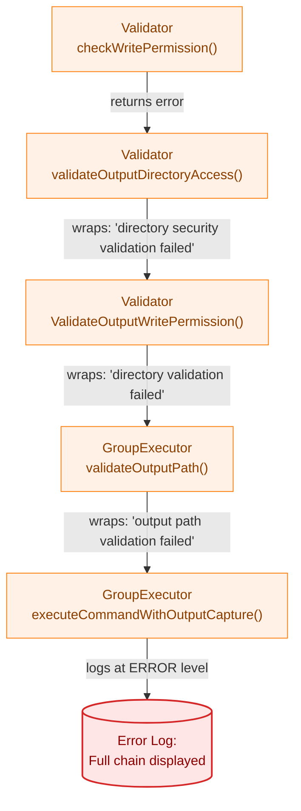
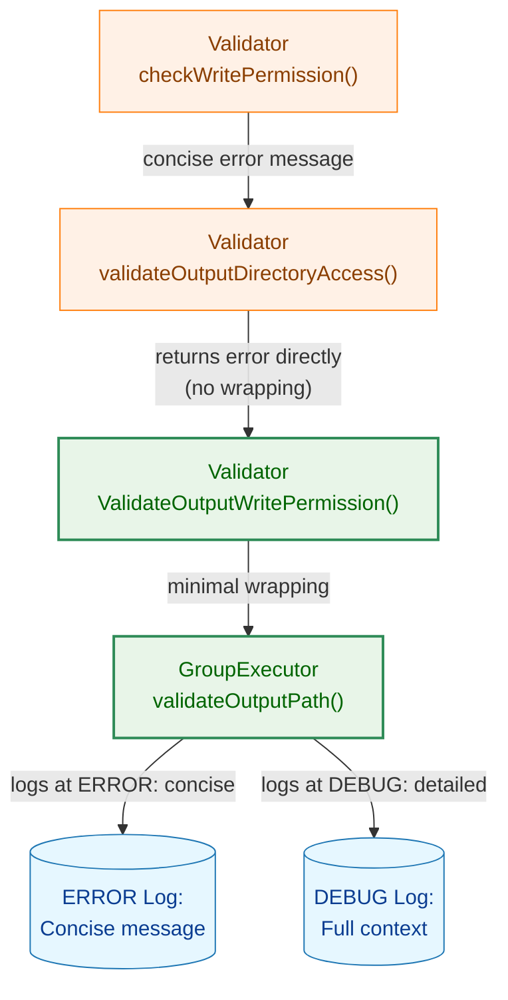
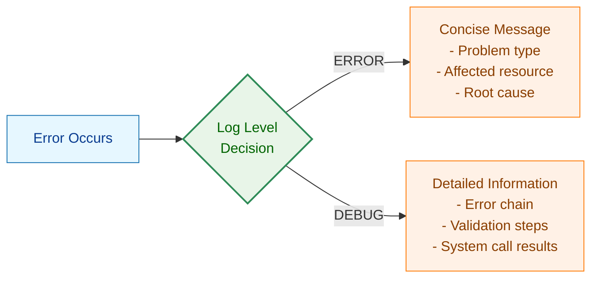
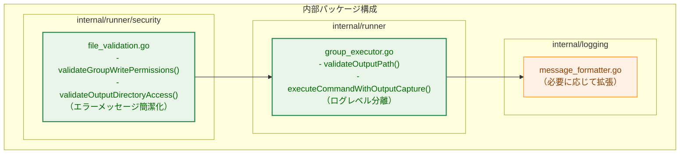
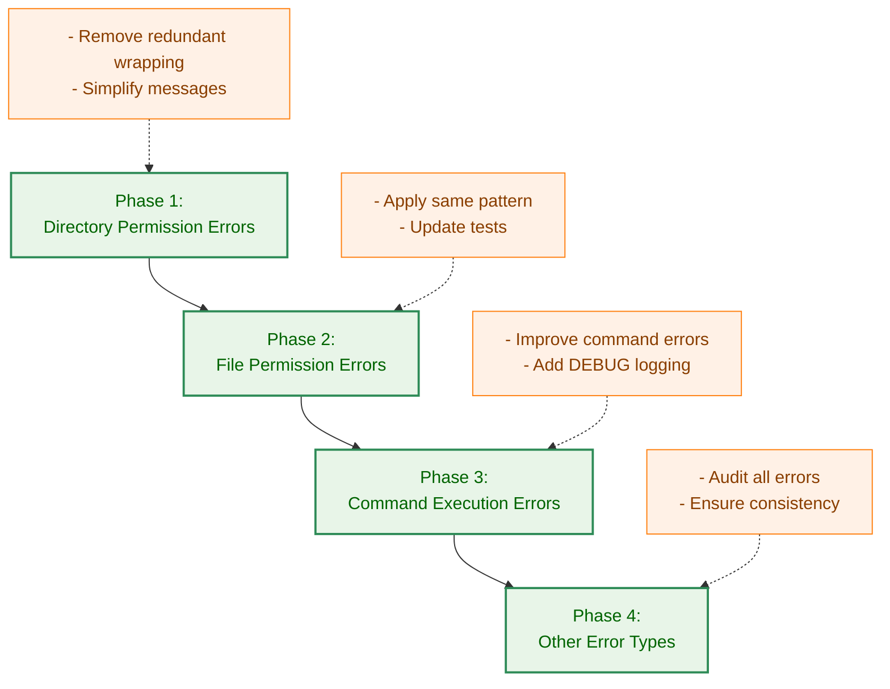
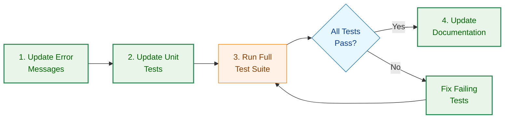

# アーキテクチャ設計書: エラーメッセージ改善

## 1. システム概要

### 1.1 アーキテクチャ目標

- エラーメッセージの簡潔化と可読性向上
- ログレベルによる情報の適切な分離
- 既存のエラー型システムとの互換性維持
- 最小限の変更で最大の効果を実現

### 1.2 設計原則

- **ユーザーファースト**: ユーザーが即座に理解できる簡潔なメッセージ
- **最小変更**: 既存のエラー型やハンドリングロジックは変更しない
- **段階的改善**: 重要度の高いエラーから順次改善
- **一貫性**: 全てのエラーメッセージで統一されたフォーマット

## 2. 現状分析

### 2.1 現在のエラー生成フロー



**問題点**:
- 各レベルで類似した表現（"validation failed"）が重複
- 根本原因（パーミッションエラー）が最初のレイヤーで生成されるが、最後に表示される
- 全ての中間ラッピング情報が ERROR レベルで表示される

### 2.2 エラーチェーンの詳細分析

**現在のエラーチェーン構造**:

```
Level 5: "output path validation failed"
  └─ Level 4: "security validation failed"
      └─ Level 3: "directory validation failed"
          └─ Level 2: "directory security validation failed for /tmp/..."
              └─ Level 1: "invalid directory permissions: directory /tmp/... has group write permissions (0775) but group membership cannot be verified"
```

**分析結果**:
- Level 1: 実際の問題（ユーザーに最も重要）
- Level 2: コンテキスト情報（パス）
- Level 3-5: 内部的な処理階層（技術的詳細）

## 3. 改善後のアーキテクチャ

### 3.1 新しいエラー生成フロー



**改善点**:
- 冗長な中間ラッピングを削除
- ERROR レベル: 簡潔なメッセージのみ
- DEBUG レベル: 技術的詳細を含む完全な情報

### 3.2 ログレベル分離の設計



**凡例（Legend）**


## 4. コンポーネント設計

### 4.1 影響を受けるコンポーネント



### 4.2 エラーメッセージ生成パターン

#### 4.2.1 現在のパターン

```go
// internal/runner/security/file_validation.go (現状)
func (v *Validator) validateGroupWritePermissions(...) error {
    // ...
    return fmt.Errorf("%w: directory %s has group write permissions (%04o) but group membership cannot be verified",
        ErrInvalidDirPermissions, dirPath, perm)
}

func (v *Validator) validateOutputDirectoryAccess(...) error {
    // ...
    if err := v.validateCompletePath(...); err != nil {
        return fmt.Errorf("directory security validation failed for %s: %w", currentPath, err)
    }
    // ...
}

func (v *Validator) ValidateOutputWritePermission(...) error {
    // ...
    if err := v.validateOutputDirectoryAccess(dir, realUID); err != nil {
        return fmt.Errorf("directory validation failed: %w", err)
    }
    // ...
}
```

```go
// internal/runner/group_executor.go (現状)
func (e *DefaultGroupExecutor) validateOutputPath(...) error {
    if err := e.validator.ValidateOutputWritePermission(outputPath, realUID); err != nil {
        return fmt.Errorf("output path validation failed: %w", err)
    }
    // ...
}

func (e *DefaultGroupExecutor) executeCommandWithOutputCapture(...) error {
    if err := e.validateOutputPath(...); err != nil {
        slog.Error("Command failed", "command", cmd.Name(), "error", err)
        return err
    }
    // ...
}
```

#### 4.2.2 改善後のパターン

```go
// internal/runner/security/file_validation.go (改善後)
func (v *Validator) validateGroupWritePermissions(...) error {
    // ...
    // 簡潔化: パスと問題の本質のみを記述
    return fmt.Errorf("%w: %s has group write permissions (%04o) but group membership cannot be verified",
        ErrInvalidDirPermissions, dirPath, perm)
}

func (v *Validator) validateOutputDirectoryAccess(...) error {
    // ...
    if err := v.validateCompletePath(...); err != nil {
        // 冗長なラッピングを削除: エラーをそのまま返す
        return err
    }
    // ...
}

func (v *Validator) ValidateOutputWritePermission(...) error {
    // ...
    if err := v.validateOutputDirectoryAccess(dir, realUID); err != nil {
        // 冗長なラッピングを削除: エラーをそのまま返す
        return err
    }
    // ...
}
```

```go
// internal/runner/group_executor.go (改善後)
func (e *DefaultGroupExecutor) validateOutputPath(...) error {
    if err := e.validator.ValidateOutputWritePermission(outputPath, realUID); err != nil {
        // 冗長なラッピングを削除: エラーをそのまま返す
        return err
    }
    // ...
}

func (e *DefaultGroupExecutor) executeCommandWithOutputCapture(...) error {
    if err := e.validateOutputPath(...); err != nil {
        // ERROR: 簡潔なメッセージ
        slog.Error("Command failed", "command", cmd.Name(), "error", err)

        // DEBUG: 詳細情報
        slog.Debug("Command failed with details",
            "command", cmd.Name(),
            "error", err,
            "error_type", fmt.Sprintf("%T", err),
            "output_path", outputPath,
            "real_uid", realUID)

        return err
    }
    // ...
}
```

### 4.3 エラーメッセージフォーマット基準

#### 4.3.1 ERROR レベルのメッセージ

**フォーマット**:
```
<エラー型>: <影響を受けるリソース> <問題の具体的内容> <根本原因>
```

**例**:
```
invalid directory permissions: /tmp/data has group write permissions (0775) but group membership cannot be verified
```

**含むべき要素**:
- **エラー型**: ユーザーが問題のカテゴリを理解できる
- **リソース**: 問題が発生した具体的なパスやコマンド
- **具体的内容**: 何が問題なのか（例: パーミッション値）
- **根本原因**: なぜ問題なのか

**含めるべきでない要素**:
- "validation failed" などの一般的な表現の繰り返し
- 内部的な関数名や処理ステップ
- スタックトレース的な情報

#### 4.3.2 DEBUG レベルのメッセージ

**フォーマット**: 自由形式（技術的詳細を含む）

**例**:
```
Command failed with details command=dump_db error=invalid directory permissions: /tmp/data has group write permissions (0775) but group membership cannot be verified error_type=*security.ErrInvalidDirPermissions output_path=/tmp/data/output.log real_uid=1000 validation_chain=[ValidateOutputWritePermission -> validateOutputDirectoryAccess -> validateCompletePath -> validateDirectoryComponentPermissions -> validateGroupWritePermissions]
```

**含むべき要素**:
- 完全なエラーチェーン
- エラー型情報
- 検証ステップの詳細
- システムコールの結果
- その他のトラブルシューティング情報

## 5. 実装戦略

### 5.1 段階的実装アプローチ



### 5.2 修正対象の優先順位

#### 5.2.1 フェーズ1: ディレクトリパーミッションエラー（優先度: 高）

**対象ファイル**:
- `internal/runner/security/file_validation.go`
  - `validateGroupWritePermissions()`: L208-262
  - `validateOutputDirectoryAccess()`: L298-334
  - `ValidateOutputWritePermission()`: L264-296

**修正内容**:
- L236-237: エラーメッセージの簡潔化
- L311: 冗長なラッピングの削除
- L283: 冗長なラッピングの削除

**影響するテストファイル**:
- `internal/runner/security/file_validation_test.go`
- エラーメッセージ文字列を検証しているケースの更新

#### 5.2.2 フェーズ2: ファイルパーミッションエラー（優先度: 中）

**対象ファイル**:
- `internal/runner/security/file_validation.go`
  - `ValidateFilePermissions()`: L48-86
  - `validateOutputFileWritePermission()`: L336-349
  - `checkWritePermission()`: L351-397

**修正内容**:
- エラーメッセージの統一と簡潔化
- 冗長な情報の削減

#### 5.2.3 フェーズ3: コマンド実行エラー（優先度: 中）

**対象ファイル**:
- `internal/runner/group_executor.go`
  - `executeCommandWithOutputCapture()`: 関連箇所
  - その他のコマンド実行エラー生成箇所

**修正内容**:
- DEBUG レベルログの追加
- ERROR レベルメッセージの簡潔化

#### 5.2.4 フェーズ4: その他のエラー（優先度: 低）

**対象**:
- 全エラー生成箇所の監査
- 一貫性の確保

### 5.3 後方互換性の維持

#### 5.3.1 エラー型の維持

```go
// エラー型は変更しない（errors.Is() 互換性を保持）
var (
    ErrInvalidDirPermissions  = errors.New("invalid directory permissions")
    ErrInvalidFilePermissions = errors.New("invalid file permissions")
    // ...
)
```

**理由**:
- 既存のエラーハンドリングロジック（`errors.Is()` による型チェック）に影響を与えない
- テストコードの大部分は型チェックを使用しているため、更新不要

#### 5.3.2 エラーメッセージ文字列への依存の最小化

**現状の問題**:
- 一部のテストコードがエラーメッセージ文字列に依存
- エラーメッセージ変更時にテストが失敗する

**対策**:
- テストコードを `errors.Is()` による型チェックに移行（推奨）
- やむを得ず文字列チェックが必要な場合は、新しいメッセージに更新

**例**:
```go
// 推奨しない（文字列依存）
assert.Contains(t, err.Error(), "validation failed")

// 推奨（型チェック）
assert.ErrorIs(t, err, security.ErrInvalidDirPermissions)

// やむを得ない場合（キーワードのみチェック）
assert.Contains(t, err.Error(), "group write permissions")
```

## 6. テスト戦略

### 6.1 テストケースの分類

#### 6.1.1 型チェックテスト（更新不要）

```go
// これらのテストは影響を受けない
func TestValidateDirectoryPermissions_GroupWrite_NoMembership(t *testing.T) {
    err := validator.ValidateDirectoryPermissions(testDir)
    assert.ErrorIs(t, err, security.ErrInvalidDirPermissions)
}
```

#### 6.1.2 メッセージ内容テスト（更新が必要）

```go
// Before (更新が必要)
func TestErrorMessage_DirectoryPermission(t *testing.T) {
    err := validator.ValidateDirectoryPermissions(testDir)
    assert.Contains(t, err.Error(), "directory security validation failed")
}

// After (新しいメッセージに更新)
func TestErrorMessage_DirectoryPermission(t *testing.T) {
    err := validator.ValidateDirectoryPermissions(testDir)
    assert.Contains(t, err.Error(), "has group write permissions")
    assert.Contains(t, err.Error(), "cannot be verified")
    // 冗長な表現が含まれないことを確認
    assert.NotContains(t, err.Error(), "validation failed")
}
```

### 6.2 新規テストケースの追加

#### 6.2.1 メッセージ品質テスト

```go
// エラーメッセージの品質を検証
func TestErrorMessage_Quality(t *testing.T) {
    err := validator.ValidateDirectoryPermissions(testDir)

    // 簡潔性: 一定の長さ以下
    assert.LessOrEqual(t, len(err.Error()), 200)

    // 冗長性: "failed" の出現回数が1回以下
    assert.LessOrEqual(t, strings.Count(err.Error(), "failed"), 1)

    // 有用性: パス情報を含む
    assert.Contains(t, err.Error(), testDir)
}
```

#### 6.2.2 ログレベル分離テスト

```go
// ERROR と DEBUG レベルのログが適切に分離されているか検証
func TestLogging_LevelSeparation(t *testing.T) {
    // ERROR レベル: 簡潔なメッセージ
    // DEBUG レベル: 詳細情報
    // （実装時に具体的なテストケースを作成）
}
```

## 7. マイグレーション計画

### 7.1 影響を受けるテストコードの特定

```bash
# エラーメッセージ文字列に依存するテストを検索
grep -r "validation failed" internal/*/test*.go
grep -r "assert.Contains.*err.Error()" internal/*/test*.go
```

### 7.2 テストコード更新の優先順位

1. **高優先度**: `internal/runner/security/file_validation_test.go`
2. **中優先度**: `internal/runner/group_executor_test.go`
3. **低優先度**: その他の統合テスト

### 7.3 段階的なロールアウト



## 8. リスクと緩和策

### 8.1 識別されたリスク

#### 8.1.1 テストの失敗

**リスク**: エラーメッセージ変更により多数のテストが失敗する可能性

**緩和策**:
- 事前にメッセージ文字列依存テストを特定
- `errors.Is()` による型チェックへの移行を推奨
- 段階的な更新とテストの実施

#### 8.1.2 ログ解析スクリプトの影響

**リスク**: 外部のログ解析スクリプトがエラーメッセージ形式に依存している可能性

**緩和策**:
- 変更内容のドキュメント化
- 可能であれば、構造化ログ（JSON等）への移行を検討
- 重要なキーワード（例: "permissions", "group write"）は維持

#### 8.1.3 デバッグ情報の不足

**リスク**: ERROR レベルを簡潔化することで、必要な情報が失われる可能性

**緩和策**:
- DEBUG レベルで完全な情報を提供
- 必要に応じてログレベルを調整可能
- 重要な情報（パス、パーミッション値など）は ERROR レベルにも含める

### 8.2 成功の測定基準

- [ ] エラーメッセージの平均長が50%以上削減される
- [ ] "validation failed" などの冗長表現が削除される
- [ ] 全ての既存テストが（更新後に）パスする
- [ ] DEBUG ログで必要な技術的詳細が利用可能
- [ ] ユーザーフィードバックで可読性が向上したことが確認される

## 9. 今後の拡張可能性

### 9.1 構造化エラーメッセージ

将来的に、より高度なエラー表示（要件定義書の案2）への移行が可能:

```go
type StructuredError struct {
    Type      string
    Resource  string
    Problem   string
    Cause     string
    Suggestion string
}

func (e *StructuredError) Error() string {
    // 複数行フォーマットまたは JSON フォーマット
}
```

### 9.2 国際化（i18n）対応

エラーメッセージの多言語対応:

```go
type LocalizableError struct {
    MessageKey string
    Params     map[string]interface{}
}

func (e *LocalizableError) Error() string {
    return i18n.Translate(e.MessageKey, e.Params)
}
```

### 9.3 エラーカタログ

全てのエラータイプをカタログ化し、対処法を提供:

```
Error Code: E001
Category: Directory Permissions
Message: Directory has group write permissions but group membership cannot be verified
Suggested Actions:
  1. Remove group write permission: chmod 755 <directory>
  2. Ensure the user is the only member of the group
  3. Run with --debug for detailed information
```

## 10. 参照

- 要件定義書: `01_requirements.md`
- タスク 0016: Logging System Redesign
- タスク 0019: Security Validation Unification
- タスク 0022: Hash Directory Security Enhancement
