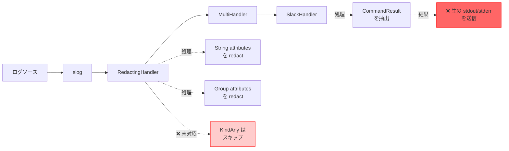

# 要件定義書：コマンド出力の Slack 通知における機密情報 Redaction

## 1. プロジェクトの目的と背景

### 1.1 背景

現在、runner はコマンド実行結果を Slack に通知する機能を持っている。この通知には、コマンドの標準出力（stdout）と標準エラー出力（stderr）が含まれる。しかし、調査の結果、以下の問題が判明した：

**問題点**：コマンドの標準出力に含まれる機密情報（パスワード、API トークン、秘密鍵など）が **redact されずに Slack に送信されている**。

### 1.2 技術的な原因

1. **データフロー**：
   - `executor.DefaultExecutor` が生の stdout/stderr を `Result` に格納
   - `group_executor` がそれを `common.CommandResult` に格納
   - `runner` が `[]common.CommandResult` を slog に渡す
   - `SlackHandler` が CommandResult を抽出して Slack に送信

2. **Redaction の適用不全**：
   - `redaction.RedactingHandler` は slog レベルで動作し、各 attribute を redact する
   - しかし、`RedactLogAttribute` メソッドは `slog.KindAny` 型を処理しない
   - `[]common.CommandResult` は `slog.KindAny` として渡されるため、redaction が適用されない
   - 結果として、CommandResult 内の `Output` フィールドと `Stderr` フィールドが redact されずに Slack に送信される

3. **影響範囲**：
   - Slack 通知（`internal/logging/slack_handler.go`）
   - その他の slog.Handler でも同様の問題が発生しうる

### 1.3 目的

1. **主目的**：コマンド出力に含まれる機密情報が Slack に送信されることを防ぐ
2. **副次的目的**：
   - すべてのログ出力（Slack、ファイル、コンソール）で一貫した redaction を提供
   - 将来的な構造化ログ型の追加に対しても自動的に保護を適用
   - コーディングミスによる機密情報漏洩のリスクを最小化

### 1.4 セキュリティリスク

**現在のリスク**：
- コマンド出力に API キー、パスワード、トークンなどが含まれる場合、それらが Slack チャネルに投稿される
- Slack チャネルへのアクセス権を持つすべてのユーザーが機密情報を閲覧可能
- Slack のログ保持ポリシーにより、機密情報が長期間保存される可能性

**影響度**：High（機密情報の漏洩は重大なセキュリティインシデント）

---

## 2. スコープ

### 2.1 対象範囲

**In Scope**：
1. `redaction.RedactingHandler` の拡張
   - `slog.KindAny` 型の処理を追加
   - `slog.LogValuer` インターフェース実装型の redaction
   - スライス型（`[]common.CommandResult` など）の redaction
2. `common.CommandResult` 作成時の補完的 redaction
   - `group_executor.executeAllCommands` での CommandResult 作成箇所
   - `security.Validator.SanitizeOutputForLogging` の活用
3. テストの追加
   - RedactingHandler の新機能のテスト
   - エンドツーエンドのテスト（実際に Slack に送信されるデータの検証）

**Out of Scope**：
1. コンソール出力やログファイル出力の redaction（既に RedactingHandler で保護されているため、案1の実装で自動的に対応）
2. Slack 以外の通知システム（将来的な拡張課題）
3. redaction パターンの変更・追加（既存の `redaction.SensitivePatterns` を使用）
4. リアルタイムストリーミング出力の redaction（現在は出力完了後に redaction を適用）

### 2.2 影響を受けるコンポーネント

1. **直接変更**：
   - `internal/redaction/redactor.go`
   - `internal/runner/group_executor.go`

2. **間接的影響**：
   - `internal/logging/slack_handler.go`（動作確認が必要）
   - すべての slog.Handler（自動的に redaction が適用される）

---

## 3. 現状分析

### 3.1 現在の Redaction アーキテクチャ



### 3.2 問題の詳細

1. **RedactingHandler の制限**：
   - `RedactLogAttribute` メソッドは以下の型のみ処理：
     - `slog.KindString`：文字列値を redact
     - `slog.KindGroup`：グループを再帰的に redact
   - `slog.KindAny` は処理されず、そのまま通過

2. **CommandResult の LogValue() の問題**：
   - `common.CommandResult` は `LogValue()` メソッドを実装
   - しかし、スライス `[]common.CommandResult` 内の要素の `LogValue()` は slog によって自動的に呼び出されない
   - `SlackHandler` は手動で `LogValue()` を呼び出して値を抽出するが、この時点では既に RedactingHandler を通過した後

3. **タイミングの問題**：
   ```mermaid
   flowchart LR
       A[CommandResult<br/>作成] --> B[slog.Any]
       B --> C[RedactingHandler]
       C -->|スキップ| D[SlackHandler]
       D -->|LogValue 呼び出し| E[抽出]

       C -.->|問題| F[❌ redaction<br/>されない]

       style C fill:#ffcccc,stroke:#ff0000
       style F fill:#ff6666,stroke:#ff0000
   ```

### 3.3 既存の Redaction 機能

既に以下の redaction 機能が実装されている：

1. **`redaction.Config`**：
   - 機密情報パターンの定義（パスワード、トークン、API キーなど）
   - key=value パターンの redaction
   - ヘッダー形式（`Authorization: ...`）の redaction

2. **`security.Validator.SanitizeOutputForLogging()`**：
   - コマンド出力を redact するメソッド
   - 内部で `redaction.Config.RedactText()` を使用
   - 既に実装されており、利用可能

3. **パターン**（`redaction.DefaultSensitivePatterns()`）：
   - password, token, secret, key, api_key
   - AWS 関連：aws_access_key_id, aws_secret_access_key
   - GCP 関連：google_application_credentials
   - GitHub/GitLab トークン
   - Bearer/Basic 認証

---

## 4. 対応策の概要

### 4.1 案1：RedactingHandler の拡張（主対策）

**概要**：`redaction.RedactingHandler` を拡張し、`slog.KindAny` 型を処理できるようにする。

**アプローチ**：
1. `slog.KindAny` 型の値を検査
2. `slog.LogValuer` インターフェースを実装している場合、`LogValue()` を呼び出して解決
3. 解決した値を再帰的に redact
4. スライス型の場合、各要素を処理

**利点**：
- すべてのログ出力（Slack、ファイル、コンソール）を一箇所で保護
- 将来的な構造化ログ型にも自動適用
- Defense in Depth の原則に従う

### 4.2 案2：CommandResult 作成時の Redaction（補完策）

**概要**：`CommandResult` を作成する際に、stdout/stderr を予め redact する。

**アプローチ**：
1. `group_executor.executeAllCommands` で CommandResult 作成時
2. `security.Validator.SanitizeOutputForLogging()` を使用して stdout/stderr を redact
3. redact された文字列を CommandResult に格納

**利点**：
- シンプルで明示的
- 既存の `SanitizeOutputForLogging` を活用
- 二重の保護層を提供

### 4.3 採用する対応策

**両方を実施**：
- **案1（主対策）**：RedactingHandler の拡張により、最終防衛線として機能
- **案2（補完策）**：CommandResult 作成時の redaction により、ベストプラクティスとして機能

**理由**：
1. **Defense in Depth**：二重の保護層により、一方が失敗しても他方が保護
2. **Fail-safe**：開発者が redact を忘れても、RedactingHandler が保護
3. **パフォーマンス**：案2により早期に redact することで、ログ処理のオーバーヘッドを削減
4. **保守性**：将来的なコード変更でも安全性を維持

---

## 5. 検討した案の詳細

### 5.1 案1：RedactingHandler の拡張

#### 概要
`redaction.RedactingHandler.RedactLogAttribute()` メソッドを拡張し、`slog.KindAny` 型を処理する。

#### 技術的アプローチ

1. **LogValuer インターフェースの処理**：
   ```go
   if value.Kind() == slog.KindAny {
       anyVal := value.Any()
       if logValuer, ok := anyVal.(slog.LogValuer); ok {
           resolvedValue := logValuer.LogValue()
           return c.RedactLogAttribute(slog.Attr{Key: key, Value: resolvedValue})
       }
   }
   ```

2. **スライス型の処理**：
   - `[]common.CommandResult` のようなスライスを検出
   - 各要素が `LogValuer` を実装している場合、`LogValue()` を呼び出し
   - 各要素を再帰的に redact

3. **循環参照の防止**：
   - 再帰深度の制限を設ける
   - 処理済みオブジェクトの追跡（必要に応じて）

#### Pros

1. **包括的な保護**：
   - すべてのログ出力（Slack、ファイル、コンソール）を一箇所で保護
   - 将来追加される構造化ログ型にも自動的に適用

2. **防御の深さ（Defense in Depth）**：
   - ログシステムの最下層で保護
   - コーディングミスによる漏洩を防ぐ
   - 開発者が redact を忘れても自動的に保護

3. **汎用性**：
   - CommandResult 以外の構造体にも適用
   - audit.ExecutionResult など、他の LogValuer 実装型も保護

4. **関心の分離**：
   - ビジネスロジック（CommandResult 作成）とセキュリティ対策（redaction）が分離
   - 各コンポーネントの責任が明確

5. **既存設計との整合性**：
   - 既に RedactingHandler という redaction 専用レイヤーが存在
   - この設計を完成させる方が自然

6. **テスト容易性**：
   - redaction ロジックを一箇所でテストすれば良い
   - 単体テストで完全にカバー可能

#### Cons

1. **実装の複雑さ**：
   - `slog.KindAny` 内部の型判定が必要
   - リフレクションを使用する可能性
   - 再帰的な構造の処理が必要

2. **パフォーマンス**：
   - すべてのログレコードで型チェックが発生
   - ただし、ログ出力は頻繁ではないため影響は限定的

3. **実装範囲の設計**：
   - `slog.KindAny` には様々な型が入りうる
   - どこまで対応するか明確な設計が必要
   - 現実的には LogValuer とスライスに限定

4. **デバッグの難しさ**：
   - redaction が自動的に適用されるため、問題の追跡が難しくなる可能性
   - ただし、これはセキュリティとのトレードオフ

5. **予期しない動作**：
   - LogValuer の実装によっては予期しない動作をする可能性
   - 十分なテストが必要

#### リスクと対策

| リスク | 影響度 | 対策 |
|--------|--------|------|
| パフォーマンス低下 | Low | ベンチマークテストで測定、許容範囲内か確認 |
| 無限再帰 | Medium | 再帰深度の制限を設ける |
| 予期しない型の処理 | Medium | サポートする型を明確に文書化、エラーハンドリングを実装 |
| 既存機能の破壊 | High | 既存のテストがすべてパスすることを確認 |

### 5.2 案2：CommandResult 作成時の Redaction

#### 概要
`CommandResult` を作成する際に、stdout/stderr を予め redact する。

#### 技術的アプローチ

`group_executor.executeAllCommands()` 内で CommandResult 作成時に redact：

```go
// 疑似コード
cmdResult := common.CommandResult{
    CommandResultFields: common.CommandResultFields{
        Name:     cmdSpec.Name,
        ExitCode: exitCode,
        Output:   ge.validator.SanitizeOutputForLogging(stdout),  // redact
        Stderr:   ge.validator.SanitizeOutputForLogging(stderr),  // redact
    },
}
```

#### Pros

1. **シンプル**：
   - データを格納する時点で redact するだけ
   - 実装が明確で理解しやすい

2. **パフォーマンス**：
   - redaction は CommandResult 作成時の1回だけ
   - ログ処理のオーバーヘッドなし

3. **明示的**：
   - どこで redaction が行われるかが明確
   - デバッグしやすい
   - コードレビューで確認しやすい

4. **既存インフラ活用**：
   - 既に `security.Validator.SanitizeOutputForLogging()` が存在
   - 実装コストが低い

5. **即座の効果**：
   - データが作成された時点で既に安全
   - ログシステムの変更に依存しない

#### Cons

1. **脆弱性のリスク**：
   - 将来のコード変更で redact を忘れる可能性
   - 新しいログ出力箇所で同じ忘れが起きうる
   - 人的ミスへの依存度が高い

2. **重複コード**：
   - 複数の箇所で同じ redaction ロジックを呼び出す必要がある可能性
   - 現時点では CommandResult 作成箇所は1箇所だが、将来増える可能性

3. **防御層の薄さ**：
   - 1つでも redact を忘れると機密情報が漏洩
   - Defense in Depth の原則に反する

4. **他の構造体への対応**：
   - audit.ExecutionResult など、他の構造体にも同様の対応が必要
   - 各箇所で個別に実装が必要

5. **テスト負担**：
   - すべての CommandResult 作成箇所でテストが必要
   - テストの重複が発生

#### リスクと対策

| リスク | 影響度 | 対策 |
|--------|--------|------|
| redact の忘れ | High | コードレビューチェックリストに追加、案1を併用 |
| 将来の変更での漏れ | High | 案1を併用することで最終防衛線を確保 |
| 他の構造体への対応漏れ | Medium | すべての構造化ログ型をリストアップし、対応を確認 |

### 5.3 案3：SlackHandler で Redaction（検討のみ、不採用）

#### 概要
SlackHandler 内で、Slack に送信する直前に出力を redact する。

#### Pros
- Slack 固有の問題に対する直接的な解決
- 実装が最もシンプル

#### Cons
- 他の handler（ファイル、コンソール）に同様の問題がある場合、個別対応が必要
- handler ごとに redaction ロジックを実装する必要がある
- セキュリティ対策が分散し、保守性が低下
- handler の責任が肥大化（本来はログの送信のみが責任）

#### 不採用の理由
- 根本的な解決にならない
- 保守性とスケーラビリティに問題がある
- 案1の方が包括的で将来性がある

---

## 6. 要求仕様

### 6.1 機能要求

#### FR-1：RedactingHandler の拡張

**要求**：`redaction.RedactingHandler` は `slog.KindAny` 型の attribute を redact できること。

**詳細**：
- FR-1.1：`slog.LogValuer` インターフェースを実装する型を検出し、`LogValue()` を呼び出して値を解決できること
- FR-1.2：解決された値を再帰的に redact できること
- FR-1.3：スライス型（例：`[]common.CommandResult`）を検出し、各要素を処理できること
- FR-1.4：スライスの各要素が `LogValuer` を実装している場合、`LogValue()` を呼び出して redact できること
- FR-1.5：再帰深度の制限を設け、無限再帰を防止すること（最大深度：10）

#### FR-2：CommandResult 作成時の Redaction

**要求**：`CommandResult` 作成時に stdout/stderr を redact すること。

**詳細**：
- FR-2.1：`group_executor.executeAllCommands()` で CommandResult 作成時に `SanitizeOutputForLogging()` を呼び出すこと
- FR-2.2：redact された stdout/stderr を CommandResult に格納すること
- FR-2.3：redaction が失敗した場合でも、エラーを返さずに元の文字列を使用すること（可用性を優先）

#### FR-3：Redaction パターン

**要求**：既存の redaction パターンを使用すること。

**詳細**：
- FR-3.1：`redaction.DefaultSensitivePatterns()` で定義されたパターンを使用
- FR-3.2：key=value 形式の機密情報を redact
- FR-3.3：Authorization ヘッダー形式を redact
- FR-3.4：Bearer/Basic 認証トークンを redact

#### FR-4：既存機能の維持

**要求**：既存の redaction 機能を破壊しないこと。

**詳細**：
- FR-4.1：`slog.KindString` の redaction は既存通り動作すること
- FR-4.2：`slog.KindGroup` の再帰的 redaction は既存通り動作すること
- FR-4.3：既存のすべてのテストがパスすること

### 6.2 非機能要求

#### NFR-1：パフォーマンス

- NFR-1.1：RedactingHandler の拡張によるパフォーマンス低下は 10% 以内であること
- NFR-1.2：ログ出力のレイテンシは 100ms 以内であること（通常時）
- NFR-1.3：大量のログ出力（1000件/秒）でもシステムが安定動作すること

#### NFR-2：セキュリティ

- NFR-2.1：既知の機密情報パターン（パスワード、トークンなど）が Slack に送信されないこと
- NFR-2.2：redaction の失敗は可用性を損なわないこと（最悪の場合、元の文字列を使用）
- NFR-2.3：redaction 処理自体がセキュリティ脆弱性を生まないこと

#### NFR-3：保守性

- NFR-3.1：RedactingHandler の拡張は、既存のコードへの影響を最小限にすること
- NFR-3.2：新しい構造化ログ型の追加が容易であること
- NFR-3.3：redaction パターンの追加・変更が容易であること

#### NFR-4：テスタビリティ

- NFR-4.1：すべての新機能に対して単体テストを追加すること
- NFR-4.2：エンドツーエンドのテストで実際の Slack 送信データを検証すること
- NFR-4.3：テストカバレッジは 90% 以上を維持すること

#### NFR-5：互換性

- NFR-5.1：既存の slog.Handler との互換性を維持すること
- NFR-5.2：Go 1.23.10 以降で動作すること
- NFR-5.3：既存の設定ファイル（TOML）との互換性を維持すること

---

## 7. 制約

### 7.1 技術的制約

1. **Go 言語のバージョン**：Go 1.23.10 を使用
2. **slog パッケージ**：標準ライブラリの `log/slog` を使用
3. **既存の redaction パターン**：`redaction.DefaultSensitivePatterns()` を使用
4. **Slack Webhook**：Slack の Incoming Webhooks API を使用

### 7.2 設計制約

1. **既存のアーキテクチャ**：RedactingHandler を中心とした設計を維持
2. **handler の独立性**：各 handler（Slack、ファイル、コンソール）は独立して動作
3. **設定ファイル**：TOML 形式の設定ファイルを維持
4. **backwards compatibility**：既存の機能を破壊しない

### 7.3 運用制約

1. **ダウンタイム**：本機能の導入にダウンタイムは発生しない
2. **設定変更**：ユーザーの設定ファイル変更は不要
3. **移行作業**：特別な移行作業は不要

---

## 8. テスト方針

### 8.1 単体テスト

#### RedactingHandler のテスト

1. **slog.KindAny の処理**：
   - LogValuer を実装する型の redaction
   - LogValuer を実装しない型の処理（スキップ）
   - スライス型の redaction
   - 再帰的な構造の redaction
   - 再帰深度制限の動作確認

2. **既存機能の回帰テスト**：
   - slog.KindString の redaction
   - slog.KindGroup の redaction
   - 既存のすべてのテストケースがパス

3. **エッジケース**：
   - nil 値の処理
   - 空のスライス
   - 循環参照（可能であれば）
   - 深いネスト構造

#### CommandResult 作成時の Redaction のテスト

1. **基本動作**：
   - stdout に機密情報が含まれる場合の redaction
   - stderr に機密情報が含まれる場合の redaction
   - 機密情報が含まれない場合の処理

2. **パターンマッチング**：
   - password=xxx 形式の redaction
   - Bearer トークンの redaction
   - Authorization ヘッダーの redaction

### 8.2 統合テスト

1. **エンドツーエンドテスト**：
   - コマンド実行 → ログ → RedactingHandler → SlackHandler の全体フロー
   - 実際に Slack に送信されるデータの検証（モックを使用）
   - 機密情報が redact されていることの確認

2. **他の handler との統合**：
   - ファイルログへの出力
   - コンソールへの出力
   - すべての handler で一貫した redaction が適用されることの確認

### 8.3 パフォーマンステスト

1. **ベンチマークテスト**：
   - RedactingHandler のパフォーマンス測定
   - 拡張前後の比較
   - 許容範囲内（10% 以内）であることの確認

2. **負荷テスト**：
   - 大量のログ出力（1000件/秒）での動作確認
   - メモリ使用量の監視
   - CPU 使用率の監視

### 8.4 セキュリティテスト

1. **機密情報の検出**：
   - 既知のパターンがすべて redact されることの確認
   - 実際の API キー、パスワードを含むテストケース（テスト用のダミー値）

2. **False Positive/Negative**：
   - 誤検出（false positive）の最小化
   - 見逃し（false negative）がないことの確認

### 8.5 テストカバレッジ

- **目標**：90% 以上
- **重点箇所**：
  - `redaction.RedactingHandler.RedactLogAttribute()`
  - `group_executor.executeAllCommands()`
  - `SlackHandler.buildCommandGroupSummary()`

---

## 9. 成功基準

### 9.1 機能的成功基準

1. **機密情報の保護**：
   - コマンド出力に含まれる機密情報が Slack に送信されない
   - すべての既知のパターンが redact される

2. **既存機能の維持**：
   - すべての既存テストがパス
   - 既存の redaction 機能が正常に動作

3. **新機能の動作**：
   - LogValuer 型の redaction が動作
   - スライス型の redaction が動作
   - CommandResult 作成時の redaction が動作

### 9.2 非機能的成功基準

1. **パフォーマンス**：
   - パフォーマンス低下が 10% 以内
   - レイテンシが 100ms 以内

2. **テストカバレッジ**：
   - カバレッジが 90% 以上
   - すべてのテストがパス

3. **ドキュメント**：
   - 詳細設計書が作成されている
   - 実装計画書が作成されている

---

## 10. リスク管理

### 10.1 技術的リスク

| リスク | 確率 | 影響度 | 対策 |
|--------|------|--------|------|
| 無限再帰によるスタックオーバーフロー | Low | High | 再帰深度の制限を設ける |
| パフォーマンス低下 | Medium | Medium | ベンチマークテストで測定、最適化 |
| 既存機能の破壊 | Low | High | 回帰テストの実施、段階的なロールアウト |
| LogValuer の予期しない実装 | Medium | Medium | エラーハンドリング、デフォルトの動作を定義 |

### 10.2 運用リスク

| リスク | 確率 | 影響度 | 対策 |
|--------|------|--------|------|
| redaction の誤検出 | Medium | Low | テストケースで検証、調整可能な設計 |
| redaction の見逃し | Low | High | 包括的なテスト、二重の保護層（案1+案2） |
| Slack API の変更 | Low | Low | モニタリング、定期的な動作確認 |

---

## 11. マイルストーン

### Phase 1：詳細設計（1-2日）
- アーキテクチャ設計書の作成
- 詳細設計書の作成
- 実装計画書の作成

### Phase 2：実装（3-5日）
- RedactingHandler の拡張実装
- CommandResult 作成時の redaction 実装
- 単体テストの実装

### Phase 3：テスト（2-3日）
- 統合テストの実装
- パフォーマンステストの実施
- セキュリティテストの実施

### Phase 4：レビューとデプロイ（1-2日）
- コードレビュー
- ドキュメントレビュー
- デプロイ準備

**総期間**：7-12日

---

## 12. 参考資料

### 12.1 関連ファイル

- `internal/redaction/redactor.go`：RedactingHandler の実装
- `internal/redaction/sensitive_patterns.go`：機密情報パターンの定義
- `internal/logging/slack_handler.go`：Slack 通知の実装
- `internal/runner/group_executor.go`：CommandResult の作成箇所
- `internal/runner/security/logging_security.go`：SanitizeOutputForLogging の実装
- `internal/common/logschema.go`：CommandResult の定義

### 12.2 関連ドキュメント

- `docs/dev/security-architecture.ja.md`：セキュリティアーキテクチャ
- `docs/dev/design-implementation-overview.ja.md`：設計・実装概要
- `CLAUDE.md`：プロジェクトのガイドライン

---

## 13. 付録

### 13.1 用語集

- **Redaction**：機密情報をマスク・削除して安全にすること
- **LogValuer**：slog でカスタムログ値を提供するインターフェース
- **slog.KindAny**：slog の属性型の一つで、任意の Go 型を含む
- **Defense in Depth**：複数の防御層を持つセキュリティの原則

### 13.2 機密情報パターンの例

- `password=secretpass` → `password=[REDACTED]`
- `Bearer abc123token` → `Bearer [REDACTED]`
- `Authorization: Basic dXNlcjpwYXNz` → `Authorization: Basic [REDACTED]`
- `api_key=xyz789` → `api_key=[REDACTED]`

### 13.3 データフロー図

詳細は「02_architecture.md」を参照。
