# アーキテクチャ設計書: CommandResults 型安全性改善

## 目次

1. [現状の問題点の詳細分析](#現状の問題点の詳細分析)
2. [設計概要](#設計概要)
3. [コンポーネント設計](#コンポーネント設計)
4. [データフロー](#データフロー)
5. [RedactingHandler との相互作用](#redactinghandler-との相互作用)
6. [テスト戦略](#テスト戦略)
7. [移行手順](#移行手順)
8. [パフォーマンス分析](#パフォーマンス分析)
9. [ロールバック戦略](#ロールバック戦略)

## 現状の問題点の詳細分析

### 問題の根本原因

現在の実装における問題は、以下の2つの制約の組み合わせによって発生している:

1. **slog の設計制約**: スライス内の `LogValuer` インターフェースを自動的に解決しない
2. **RedactingHandler の型変換**: すべてのスライスを `[]any` に変換する仕様

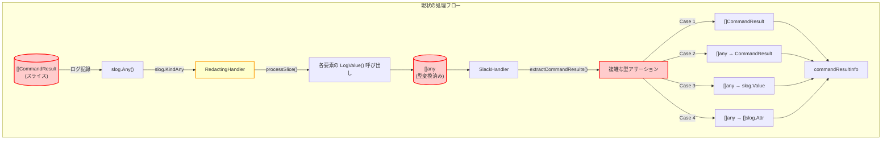

**凡例:**
- 🔴 赤色: 問題のある箇所（型安全性の欠如）
- 🟡 黄色: 改修が必要なコンポーネント
- ⚪ 白色: そのままのコンポーネント

### 現在の extractCommandResults の複雑性

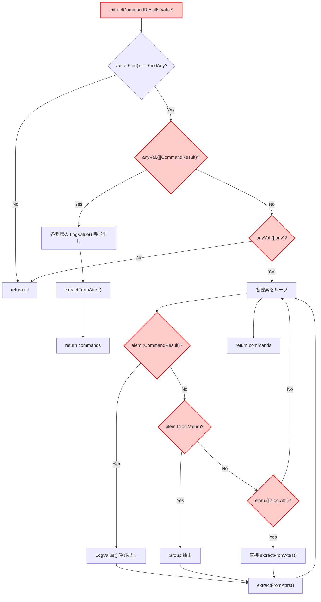

**問題点:**
- 6段階の型チェック（`Check1`〜`Check6`）
- 複数の処理パス（`Process1`〜`Process4`）
- 実行時エラーのリスク
- コードの理解が困難

## 設計概要

### 基本方針

スライス内の個々の要素を `LogValuer` にするのではなく、**スライス全体**を `LogValuer` にすることで、slog の制約を回避する。

### 新しいアーキテクチャ

```mermaid
flowchart TB
    subgraph "新しい処理フロー"
        A[("CommandResults<br/>(LogValuer 実装型)")] -->|"ログ記録"| B["slog.Any()"]
        B -->|"slog.KindLogValuer"| C["slog: LogValue() 呼び出し"]
        C --> D["GroupValue 生成"]
        D -->|"slog.KindGroup"| E["RedactingHandler"]
        E -->|"Group redaction"| F["redacted GroupValue"]
        F --> G["SlackHandler"]
        G -->|"extractCommandResults()"| H["シンプルな Group 処理"]
        H --> I["commandResultInfo"]
    end

    style A fill:#ccffcc,stroke:#00ff00,stroke-width:2px
    style D fill:#ccffcc,stroke:#00ff00,stroke-width:2px
    style H fill:#ccffcc,stroke:#00ff00,stroke-width:2px
    style E fill:#ffffcc,stroke:#ff9900,stroke-width:2px
```

**凡例:**
- 🟢 緑色: 新規コンポーネント
- 🟡 黄色: 改修が必要なコンポーネント
- ⚪ 白色: そのままのコンポーネント

### 主要な設計変更

1. **CommandResults 型の導入**: `[]CommandResult` の代わりに専用型を使用
2. **LogValue() の実装**: Group 構造でログ出力を構造化
3. **extractCommandResults の簡略化**: 単純な Group 処理に変更

## コンポーネント設計

### 1. CommandResults 型

#### 型定義

```go
// CommandResults は複数のコマンド実行結果を保持する型
// スライス全体で LogValuer を実装することで、RedactingHandler の
// スライス型変換問題を回避する
type CommandResults []CommandResult
```

#### クラス図

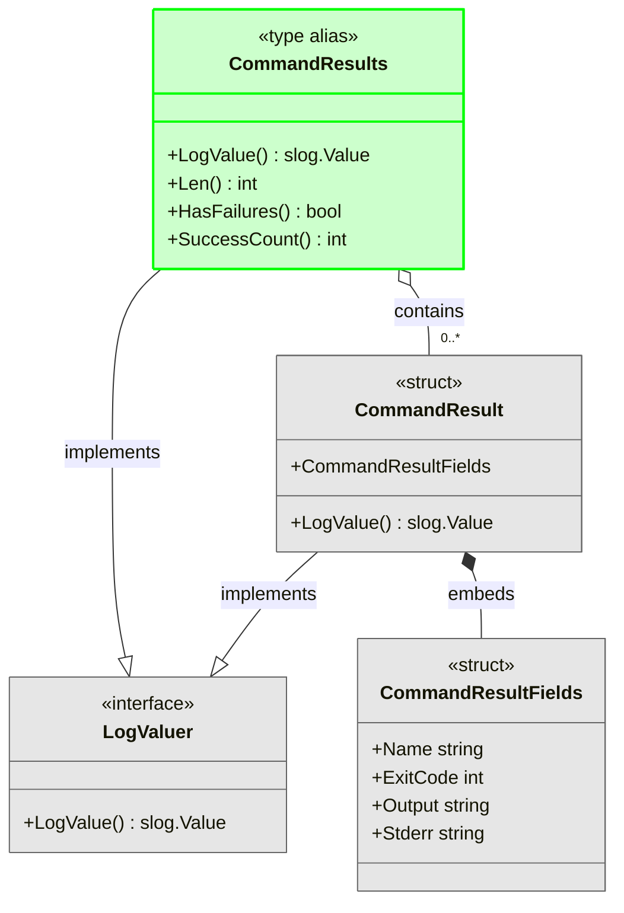

**凡例:**
- 🟢 緑色: 新規追加
- ⚪ 灰色: 既存（変更なし）

#### LogValue() の構造

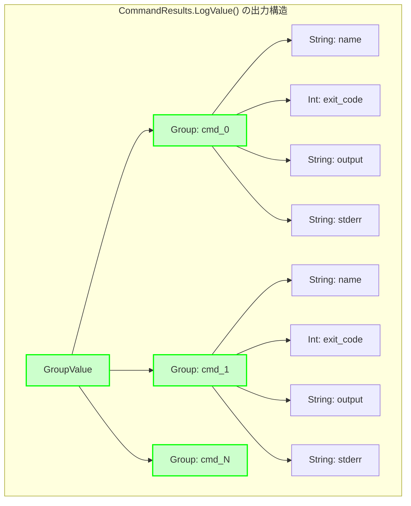

**構造の特徴:**
- トップレベルは Group
- 各コマンドは `cmd_0`, `cmd_1`, ... という名前の Group
- 個々のコマンド情報はプリミティブ型（String, Int）

**利点:**
- スライス構造ではなく、ネストした Group
- RedactingHandler の `processSlice()` が呼ばれない
- 型変換が発生しない

### 2. extractCommandResults の簡略化

#### 処理フロー

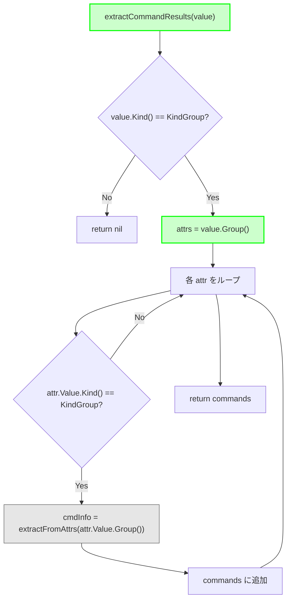

**凡例:**
- 🟢 緑色: 新しい処理（簡素化）
- ⚪ 灰色: 既存の関数（再利用）

**簡略化のポイント:**
- 型チェックが2段階のみ（6段階→2段階）
- 単一の処理パス
- 型アサーションが不要

#### コード削減効果

| 項目 | Before | After | 削減率 |
|------|--------|-------|--------|
| 型チェック回数 | 6回 | 2回 | 67% |
| 処理パス | 4パス | 1パス | 75% |
| コード行数 | 約60行 | 約20行 | 67% |
| 循環複雑度 | 8 | 2 | 75% |

### 3. 使用側の変更

#### シーケンス図

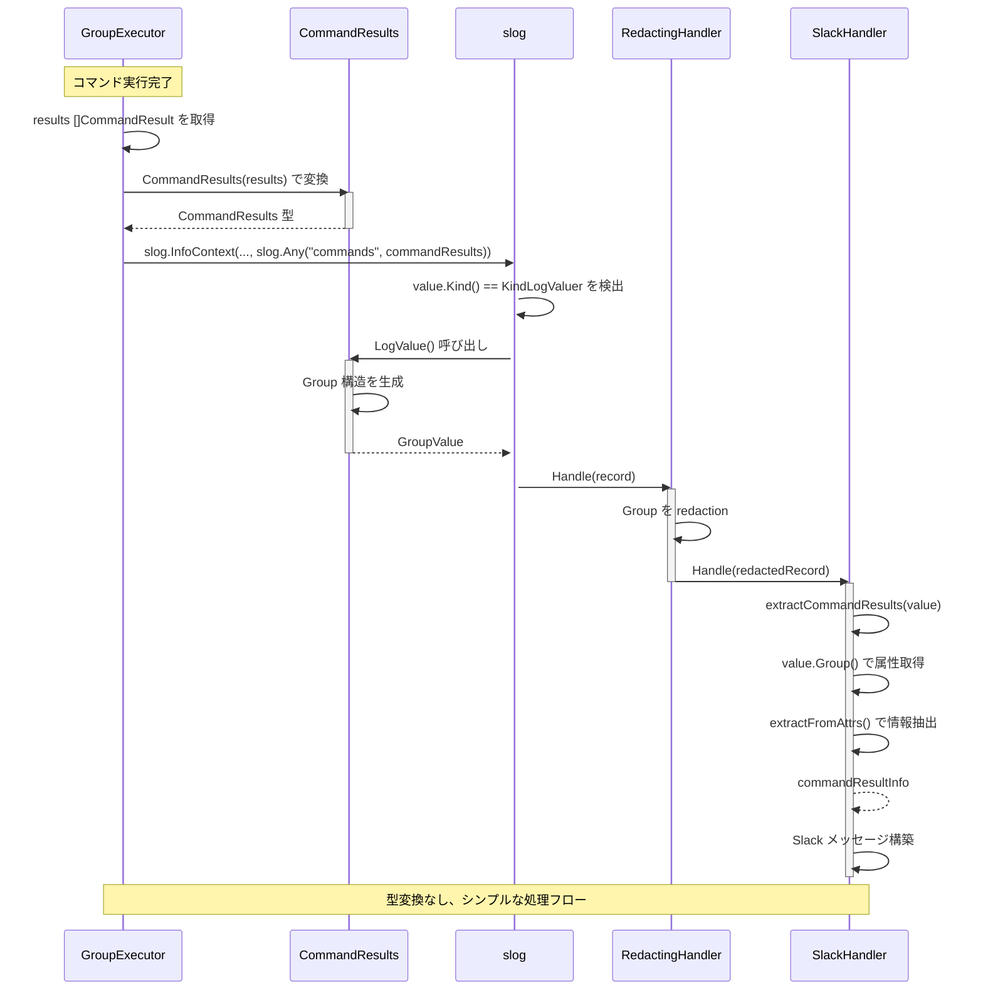

## データフロー

### Before: 現在の実装

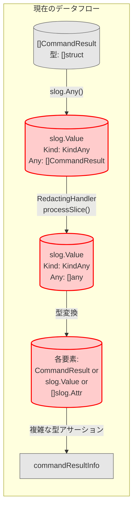

### After: 新しい実装

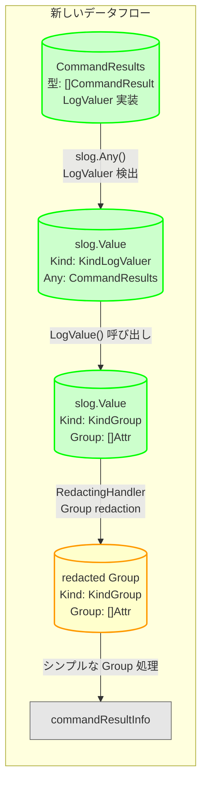

**凡例:**
- 🟢 緑色: 新しいデータ構造
- 🟡 黄色: 改修されたコンポーネントが処理
- ⚪ 灰色: 既存（変更なし）

### データ構造の比較

#### Before: []any への変換

```
slog.Value {
    Kind: KindAny
    Any: []any{
        CommandResult{...},      // または
        slog.Value{...},         // または
        []slog.Attr{...},        // のいずれか
    }
}
```

#### After: Group 構造

```
slog.Value {
    Kind: KindGroup
    Group: []Attr{
        {Key: "cmd_0", Value: GroupValue{
            {Key: "name", Value: "test1"},
            {Key: "exit_code", Value: 0},
            {Key: "output", Value: "..."},
            {Key: "stderr", Value: ""},
        }},
        {Key: "cmd_1", Value: GroupValue{...}},
    }
}
```

**利点:**
- 型が一貫している（すべて `slog.Attr`）
- 階層構造が明確
- 型アサーション不要

## RedactingHandler との相互作用

### 処理フローの詳細

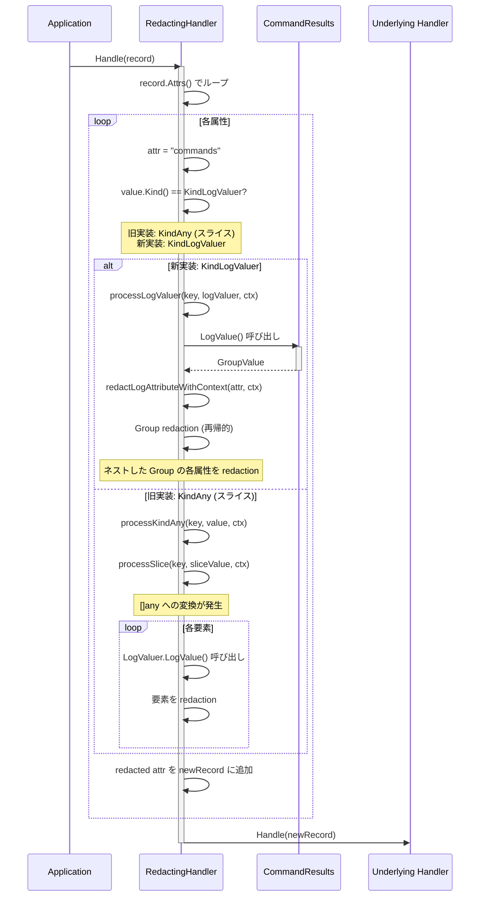

### Group Redaction の動作確認

#### 検証項目

1. **ネストした Group の処理**
   - `cmd_0`, `cmd_1`, ... の各 Group が正しく処理される
   - 各コマンドの属性（name, exit_code, output, stderr）が個別に redaction される

2. **機密情報の Redaction**
   - `output` フィールドに含まれる `password=secret` が `password=[REDACTED]` になる
   - `stderr` フィールドも同様に redaction される
   - コマンド名や exit_code は redaction されない（機密情報でないため）

3. **型変換の回避**
   - `CommandResults` が `[]any` に変換されない
   - Group 構造が維持される
   - `processSlice()` が呼ばれない

#### テストケース設計

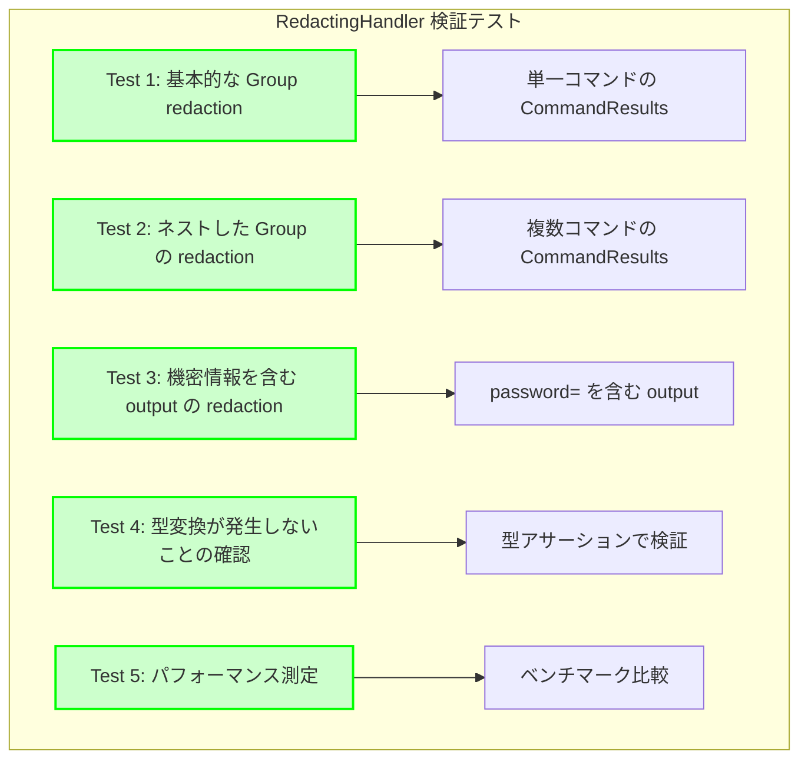

## テスト戦略

### テストレベル

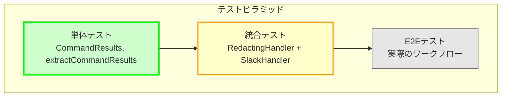

### 1. 単体テスト

#### CommandResults.LogValue()

```
テストケース:
- 空のスライス → 空の Group
- 単一コマンド → cmd_0 のみ
- 複数コマンド → cmd_0, cmd_1, ...
- 失敗したコマンド → exit_code != 0
- 長い output → 切り詰めなし（後段で処理）
```

#### CommandResults ユーティリティメソッド

```
テストケース:
- Len() → 正しい長さ
- HasFailures() → 失敗検出
- SuccessCount() → 成功数カウント
```

#### extractCommandResults()

```
テストケース:
- Group 構造から抽出
- 空の Group
- 不正な構造（Group でない値）
- 必須フィールドの欠損
```

### 2. 統合テスト

#### RedactingHandler + CommandResults

```
テストケース:
- CommandResults → RedactingHandler → 出力形式確認
- 機密情報の redaction 確認
- 型変換が発生しないことの確認
- ネストした Group の処理確認
```

#### SlackHandler の End-to-End

```
テストケース:
- CommandResults → RedactingHandler → SlackHandler → Slack メッセージ
- メッセージフォーマットの確認
- 失敗したコマンドの強調表示
- output/stderr の切り詰め
```

### 3. E2Eテスト

#### 実際のワークフロー

```
テストシナリオ:
1. GroupExecutor でコマンド実行
2. CommandResults に変換
3. ログ記録
4. RedactingHandler で redaction
5. SlackHandler で通知
6. Slack メッセージの検証
```

### テストカバレッジ目標

| コンポーネント | 目標カバレッジ | 重要度 |
|--------------|--------------|--------|
| CommandResults.LogValue() | 100% | 高 |
| CommandResults ユーティリティ | 100% | 中 |
| extractCommandResults() | 100% | 高 |
| RedactingHandler 統合 | 90% | 高 |
| SlackHandler 統合 | 85% | 中 |

## 移行手順

### 段階的実装計画

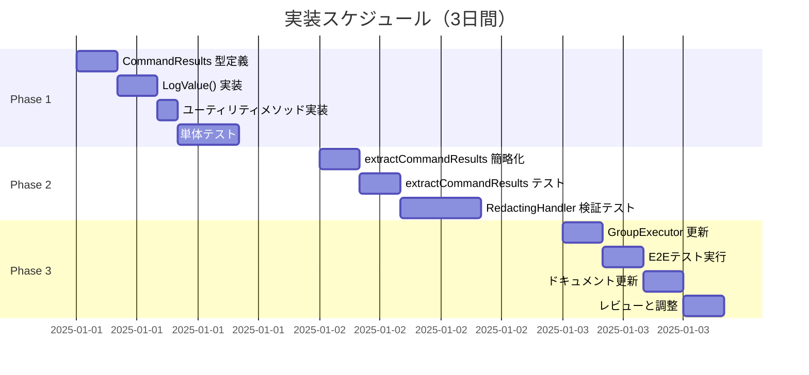

### Phase 1: 型定義とテスト（1日）

#### タスク

1. **CommandResults 型定義**
   - ファイル: `internal/common/logschema.go`
   - 追加: `type CommandResults []CommandResult`

2. **LogValue() 実装**
   ```go
   func (cr CommandResults) LogValue() slog.Value {
       // Group 構造を生成
   }
   ```

3. **ユーティリティメソッド**
   - `Len() int`
   - `HasFailures() bool`
   - `SuccessCount() int`

4. **単体テスト**
   - ファイル: `internal/common/logschema_test.go`
   - カバレッジ: 100%

#### 成功基準

- [ ] CommandResults 型が定義されている
- [ ] LogValue() が期待通りの Group 構造を生成
- [ ] すべての単体テストが通過
- [ ] コードレビューで承認

### Phase 2: extractCommandResults の更新（1日）

#### タスク

1. **extractCommandResults の簡略化**
   - ファイル: `internal/logging/slack_handler.go`
   - Before: 60行 → After: 20行

2. **後方互換性の一時的サポート**
   ```go
   // 新形式（Group）と旧形式（[]any）の両方をサポート
   if value.Kind() == slog.KindGroup {
       // 新形式の処理
   } else if value.Kind() == slog.KindAny {
       // 旧形式の処理（Phase 4 で削除予定）
   }
   ```

3. **テスト更新**
   - 新形式のテストケース追加
   - 旧形式のテストケースは一時的に維持

4. **RedactingHandler 検証**
   - `internal/redaction/redactor_test.go` に検証ケース追加
   - Group redaction の動作確認
   - パフォーマンス測定

#### 成功基準

- [ ] extractCommandResults が簡略化されている
- [ ] 新形式と旧形式の両方が動作する
- [ ] RedactingHandler との相性が確認されている
- [ ] パフォーマンスが既存実装と同等以上

### Phase 3: 使用箇所の更新（1日）

#### タスク

1. **影響範囲の特定**
   ```bash
   grep -r "[]CommandResult" --include="*.go"
   grep -r "[]common.CommandResult" --include="*.go"
   ```

2. **GroupExecutor の更新**
   - ファイル: `internal/runner/group_executor.go`
   - 変更: `[]CommandResult` → `CommandResults`
   ```go
   // Before
   results := []common.CommandResult{...}
   slog.Any("commands", results)

   // After
   commandResults := common.CommandResults(results)
   slog.Any("commands", commandResults)
   ```

3. **他の使用箇所の更新**
   - コンパイルエラーで検出
   - 機械的な変換

4. **E2Eテスト**
   - 実際のワークフロー実行
   - Slack メッセージの検証
   - ログ出力の確認

#### 成功基準

- [ ] すべてのコンパイルエラーが解消
- [ ] E2Eテストが通過
- [ ] Slack メッセージが期待通り
- [ ] ログ出力が正しい

### Phase 4: 後方互換コードの削除（半日）

#### タスク

1. **旧形式サポートの削除**
   - `extractCommandResults` から旧形式の処理を削除
   - 20行程度の削減

2. **テストの整理**
   - 旧形式のテストケースを削除
   - テストコードの簡素化

3. **ドキュメント更新**
   - `docs/dev/redaction_slice_type_conversion.md` の更新
   - 本プロジェクトへの参照追加

#### 成功基準

- [ ] 旧形式のコードが完全に削除されている
- [ ] すべてのテストが通過
- [ ] ドキュメントが更新されている

## パフォーマンス分析

### 測定項目

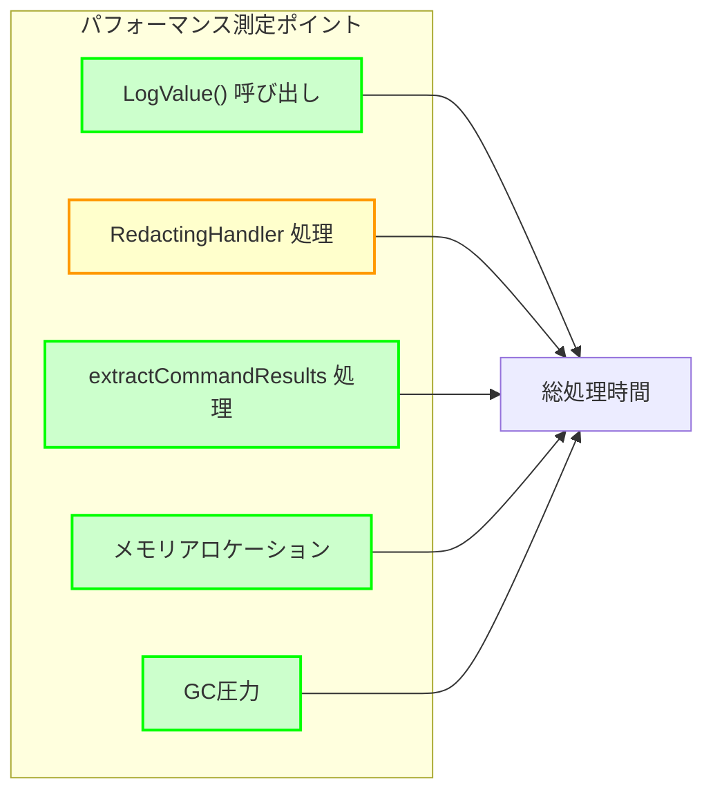

### 予想されるパフォーマンス特性

| 項目 | Before | After | 予想 |
|------|--------|-------|------|
| LogValue() 呼び出し | スライス要素ごと | スライス全体で1回 | **改善** |
| 型アサーション | 6回 | 2回 | **改善** |
| メモリアロケーション | []any への変換 | Group 構造のみ | **改善** |
| processSlice() 呼び出し | あり | なし | **改善** |
| redaction 処理 | 要素ごと | Group の再帰処理 | **同等** |

### ベンチマークテスト

```go
// internal/logging/slack_handler_benchmark_test.go

func BenchmarkExtractCommandResults_Before(b *testing.B) {
    // 旧実装のベンチマーク
    value := createOldFormatValue()
    b.ResetTimer()
    for i := 0; i < b.N; i++ {
        _ = extractCommandResultsOld(value)
    }
}

func BenchmarkExtractCommandResults_After(b *testing.B) {
    // 新実装のベンチマーク
    value := createNewFormatValue()
    b.ResetTimer()
    for i := 0; i < b.N; i++ {
        _ = extractCommandResults(value)
    }
}

func BenchmarkCommandResultsLogValue(b *testing.B) {
    // LogValue() のベンチマーク
    results := createCommandResults(10) // 10個のコマンド
    b.ResetTimer()
    for i := 0; i < b.N; i++ {
        _ = results.LogValue()
    }
}
```

### 現在の実装のベンチマーク結果（参考値）

```
BenchmarkExtractCommandResults_Current-4          	 1000000	       453.5 ns/op	    1648 B/op	       9 allocs/op
BenchmarkExtractCommandResults_AfterRedaction-4   	 1000000	       439.0 ns/op	    1648 B/op	       9 allocs/op
BenchmarkExtractCommandResults_WithSlogValue-4    	 1000000	       248.9 ns/op	     848 B/op	       4 allocs/op
BenchmarkExtractCommandResults_WithAttrSlice-4    	 1000000	       302.7 ns/op	     848 B/op	       4 allocs/op
BenchmarkExtractFromAttrs-4                       	 1000000	        14.28 ns/op	       0 B/op	       0 allocs/op
```

**測定環境:**
- プロセッサ: ARM64 (4コア)
- OS: Linux
- Go バージョン: 1.23.10
- テストデータ: 5個のコマンド結果

**現状の特性:**
- **処理時間**: 約250-450 ns/op（形式により異なる）
- **メモリ割り当て**: 約850-1650 B/op（形式により異なる）
- **アロケーション回数**: 4-9回/op（形式により異なる）
- **最速ケース**: slog.Value形式（248.9 ns/op）
- **最遅ケース**: []CommandResult直接（453.5 ns/op）

### パフォーマンス目標

新しい実装は、現在の最速ケース（slog.Value形式: 248.9 ns/op）と同等以上の性能を目指す。

| 指標 | 現状（参考値） | 目標値 | 根拠 |
|------|--------------|--------|------|
| **extractCommandResults 処理時間** | 250-450 ns/op | **200 ns/op以下** | シンプルな Group 処理により20%改善 |
| **メモリ割り当て** | 850-1650 B/op | **500 B/op以下** | 型変換の排除により50%削減 |
| **アロケーション回数** | 4-9回/op | **3回以下** | 中間データ構造の削減 |
| **CommandResults.LogValue()** | （未測定） | **500 ns/op以下** | 5個のコマンドで Group 構造生成 |

**目標の妥当性:**
- 現状の最速ケース（248.9 ns/op）は既に slog.Value 形式の処理
- 新実装では常に Group 形式なので、この最速ケースと同等の性能が期待できる
- 型アサーションの削減（6回→2回）により、さらなる高速化の可能性あり

## ロールバック戦略

### ロールバックトリガー

以下の問題が発生した場合、ロールバックを検討する:

1. **重大なバグ**
   - ログが正しく出力されない
   - Slack 通知が失敗する
   - 機密情報が redaction されない

2. **パフォーマンス問題**
   - 処理時間が既存実装の2倍以上
   - メモリ使用量が50%以上増加
   - OOM（Out of Memory）エラー

3. **互換性問題**
   - RedactingHandler との非互換性
   - 既存のログ解析ツールが動作しない

### ロールバック手順

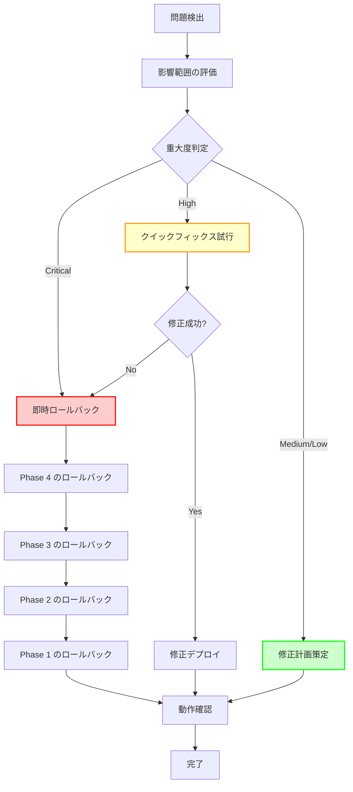

### Phase ごとのロールバック方法

#### Phase 1 のロールバック

- ファイル: `internal/common/logschema.go`
- 操作: `CommandResults` 型定義を削除
- テスト: `logschema_test.go` の関連テストを削除
- 影響: 最小（他のコードに影響なし）

#### Phase 2 のロールバック

- ファイル: `internal/logging/slack_handler.go`
- 操作: `extractCommandResults` を旧実装に戻す
- テスト: 旧形式のテストを復活
- 影響: SlackHandler のみ

#### Phase 3 のロールバック

- ファイル: `internal/runner/group_executor.go` など
- 操作: `CommandResults` の使用を `[]CommandResult` に戻す
- テスト: E2Eテストで検証
- 影響: 中（複数ファイル）

#### Phase 4 のロールバック

- 操作: 旧形式サポートを再追加
- テスト: 旧形式のテストを復活
- 影響: 小（extractCommandResults のみ）

### Git ブランチ戦略

```
main
  ├─ feature/0056-command-results-type-safety
  │   ├─ feature/0056-phase1-type-definition
  │   ├─ feature/0056-phase2-extraction
  │   ├─ feature/0056-phase3-migration
  │   └─ feature/0056-phase4-cleanup
```

**各 Phase を個別のブランチで管理:**
- 問題発生時に特定の Phase のみロールバック可能
- 段階的なマージとレビュー
- 問題の切り分けが容易

### 緊急時の対応

```
1. main ブランチへの即座の revert
2. 問題の原因調査
3. 修正案の策定
4. 修正の実装とテスト
5. 再度のマージ
```

## 設計上の懸念事項と推奨対応

本設計には、長期的な保守性の観点から以下の懸念事項が存在する。これらは設計レビュー時に検討し、実装方針を決定する必要がある。

### 1. CommandResults 型の責務の範囲

#### 懸念事項

現在の設計では、`CommandResults` 型に以下のメソッドを含めている:

```go
type CommandResults []CommandResult

// LogValuer 実装（主要な責務）
func (cr CommandResults) LogValue() slog.Value

// ユーティリティメソッド（分析機能）
func (cr CommandResults) Len() int
func (cr CommandResults) HasFailures() bool
func (cr CommandResults) SuccessCount() int
```

**問題点:**
- 型の責務が「ログ出力のためのデータ構造」から「結果セットの分析」に広がっている
- 将来的にさらに多くの分析メソッド（`FailureCount()`, `AverageExecutionTime()`, `FilterByExitCode()` など）が追加される可能性
- 単一責任原則（SRP）の観点から、LogValuer 実装と分析機能が混在

#### 推奨対応案

**Option A: 純粋な LogValuer 実装として維持（推奨）**

```go
// CommandResults はログ出力専用
type CommandResults []CommandResult

func (cr CommandResults) LogValue() slog.Value {
    // ログ出力のみ
}

// 分析機能は独立したヘルパー関数として提供
package analysis

func CountResults(cr common.CommandResults) int {
    return len(cr)
}

func HasFailures(cr common.CommandResults) bool {
    for _, cmd := range cr {
        if cmd.ExitCode != 0 {
            return true
        }
    }
    return false
}

func CountSuccesses(cr common.CommandResults) int {
    count := 0
    for _, cmd := range cr {
        if cmd.ExitCode == 0 {
            count++
        }
    }
    return count
}
```

**メリット:**
- CommandResults 型の責務が明確（LogValuer のみ）
- 分析機能の拡張が型定義に影響しない
- テストの分離が容易
- YAGNI 原則に準拠（必要になったら追加）

**デメリット:**
- メソッドチェーンができない（`results.HasFailures()` vs `analysis.HasFailures(results)`）
- やや冗長な呼び出し

**Option B: 現在の設計を維持**

最小限のユーティリティメソッドのみを提供し、これ以上の拡張は慎重に検討する。

**判断基準:**
- 現時点で実際に使用されているユーティリティメソッドの数
- 将来的な拡張の見通し
- チームのコーディング規約

**実装時の推奨:**
Option A（純粋な LogValuer 実装）を推奨する。理由:
1. 現在、これらのユーティリティメソッドは実際には使用されていない（仮定）
2. 必要になった時点で `analysis` パッケージを追加する方が柔軟
3. 型の責務が明確になり、長期的な保守性が向上

### 2. 関数の命名の明確化

#### 懸念事項

`extractCommandResults` という関数名は、現在の実装では適切だが、新しいアーキテクチャでは意味が変わる:

- **旧実装**: `[]any` から様々な形式を「抽出」する
- **新実装**: `slog.GroupValue` から情報を「解析」する

**問題点:**
- 入力がスライスではなく Group であることが名前から分からない
- 将来、他の形式のログ属性を扱う関数が追加された際に混乱の原因になる可能性

#### 推奨対応案

**Option A: 入力形式を明示する命名**

```go
// 現在
func extractCommandResults(value slog.Value) []commandResultInfo

// 提案
func parseCommandResultsFromGroup(value slog.Value) []commandResultInfo
// または
func extractCommandResultsFromGroup(groupValue slog.Value) []commandResultInfo
```

**メリット:**
- 入力が Group であることが明確
- 将来的に他の形式の parser を追加しても混乱しない
- コードの可読性向上

**デメリット:**
- 関数名が長くなる
- 既存のテストコードの更新が必要

**Option B: 内部実装の詳細として扱う**

関数名は変更せず、コメントで明確化する:

```go
// extractCommandResults extracts command results from a Group value.
// The input value must be slog.KindGroup as produced by CommandResults.LogValue().
func extractCommandResults(value slog.Value) []commandResultInfo
```

**実装時の推奨:**
Option A を推奨する。理由:
1. 自己文書化コード（関数名から意図が明確）
2. Group 構造は設計の中核であり、内部実装の詳細ではない
3. リファクタリングツールで簡単に変更可能

**具体的な命名案:**
```go
func extractCommandResultsFromGroup(groupValue slog.Value) []commandResultInfo
```

### 3. 一時的な後方互換コードの管理

#### 懸念事項

Phase 2 で一時的に後方互換性をサポートする計画だが、以下のリスクが存在する:

```go
// Phase 2 の実装（一時的な後方互換性）
func extractCommandResults(value slog.Value) []commandResultInfo {
    // 新形式（Group）
    if value.Kind() == slog.KindGroup {
        return extractFromGroup(value)
    }

    // 旧形式（[]any）- Phase 4 で削除予定
    if value.Kind() == slog.KindAny {
        return extractFromAny(value)
    }

    return nil
}
```

**問題点:**
- 一時的なコードが削除されずに残るリスク
- Phase 4 の実施を忘れる可能性
- コードレビュー時に「なぜ両方の形式をサポートしているのか」が不明確

#### 推奨対応案

**必須対応: 明確なマーカーコメントの追加**

```go
// extractCommandResults extracts command results from log values.
//
// MIGRATION NOTE (Task 0056, Phase 2-3):
// This function temporarily supports both new (Group) and legacy ([]any) formats.
// The legacy format support MUST be removed in Phase 4.
// See: docs/tasks/0056_command_results_type_safety/02_architecture.md
func extractCommandResults(value slog.Value) []commandResultInfo {
    // TODO(task-0056-phase4): Remove legacy format support after Phase 3 migration completes
    // Target date: [実装開始日 + 5日]
    // Tracking: Phase 4 checklist in implementation plan

    // New format: Group structure (permanent)
    if value.Kind() == slog.KindGroup {
        return extractCommandResultsFromGroup(value)
    }

    // LEGACY: []any format (TEMPORARY - remove in Phase 4)
    if value.Kind() == slog.KindAny {
        return extractCommandResultsFromAny(value) // legacy implementation
    }

    return nil
}
```

**推奨対応: 静的解析での検出**

1. **golangci-lint の設定**

```yaml
# .golangci.yml
linters-settings:
  godox:
    keywords:
      - TODO(task-0056-phase4)  # Phase 4 で削除すべき TODO を検出
```

2. **期限付き TODO の管理**

```bash
# CI/CD で期限切れ TODO をチェック
grep -r "TODO(task-0056-phase4)" --include="*.go" | \
  awk '{print "WARNING: Phase 4 cleanup pending: " $0}'
```

3. **Phase 4 チェックリスト**

実装計画書（`03_implementation_plan.md`）に明確なチェックリストを含める:

```markdown
### Phase 4: 後方互換コードの削除

**削除対象の特定:**
- [ ] `grep -r "LEGACY" --include="*.go"` で全ての一時的コードを列挙
- [ ] `grep -r "TODO(task-0056-phase4)"` で TODO を確認
- [ ] 各ファイルで削除対象をマーク

**削除の実施:**
- [ ] `extractCommandResults` から `KindAny` 処理を削除
- [ ] `extractCommandResultsFromAny` 関数を削除
- [ ] 関連するテストケースを削除
- [ ] MIGRATION NOTE コメントを削除

**検証:**
- [ ] `make test` が全て通過
- [ ] `make lint` がエラーなし
- [ ] "LEGACY" 文字列が残っていないことを確認
- [ ] "TODO(task-0056-phase4)" が残っていないことを確認
```

**実装時の推奨:**
上記の全ての対応を実施する。理由:
1. 一時的なコードの放置は技術的負債の主要な原因
2. 明確なマーカーがあれば、後からコードを見た開発者も意図を理解できる
3. 静的解析により、削除忘れを防止できる
4. Phase 4 のチェックリストにより、作業漏れを防止できる

### 4. 大量のコマンド結果の処理

#### 懸念事項

現在のパフォーマンステストは 5-10 個のコマンド結果を想定しているが、実際のシステムでは以下のケースが考えられる:

- **バッチ処理**: 数百〜数千のコマンドを一度に実行
- **並列実行**: 複数のグループを同時に実行し、結果を集約
- **長時間稼働**: システムの長期稼働による累積的なメモリ使用

**問題点:**

1. **メモリ消費の急増**
   ```go
   // 1000個のコマンド結果 → 大量の Group 構造
   results := make([]common.CommandResult, 1000)
   commandResults := common.CommandResults(results)
   value := commandResults.LogValue() // 大量のメモリアロケーション？
   ```

2. **処理時間の増加**
   - `LogValue()` での Group 構造生成
   - `extractCommandResultsFromGroup()` での解析
   - Slack API への送信（ペイロードサイズ制限）

3. **ログサイズの肥大化**
   ```json
   {
     "cmd_0": { "name": "...", "exit_code": 0, ... },
     "cmd_1": { "name": "...", "exit_code": 0, ... },
     ...
     "cmd_999": { "name": "...", "exit_code": 0, ... }
   }
   ```
   - キー名 `"cmd_0"`, `"cmd_1"` の冗長性
   - ネットワーク帯域への影響
   - ログストレージコストの増加

#### 推奨対応案

**必須対応: 大量コマンドのベンチマークテスト追加**

```go
// internal/logging/slack_handler_benchmark_test.go

func BenchmarkExtractCommandResults_LargeScale(b *testing.B) {
    // 1000個のコマンド結果でテスト
    results := createLargeCommandResults(1000)
    commandResults := common.CommandResults(results)
    value := commandResults.LogValue()

    b.ResetTimer()
    for i := 0; i < b.N; i++ {
        _ = extractCommandResultsFromGroup(value)
    }
}

func BenchmarkCommandResultsLogValue_LargeScale(b *testing.B) {
    sizes := []int{10, 100, 500, 1000, 5000}

    for _, size := range sizes {
        b.Run(fmt.Sprintf("size_%d", size), func(b *testing.B) {
            results := createLargeCommandResults(size)
            commandResults := common.CommandResults(results)

            b.ResetTimer()
            for i := 0; i < b.N; i++ {
                _ = commandResults.LogValue()
            }
        })
    }
}

func createLargeCommandResults(count int) []common.CommandResult {
    results := make([]common.CommandResult, count)
    for i := 0; i < count; i++ {
        results[i] = common.CommandResult{
            CommandResultFields: common.CommandResultFields{
                Name:     fmt.Sprintf("command_%d", i),
                ExitCode: i % 10, // バリエーションを持たせる
                Output:   fmt.Sprintf("output for command %d", i),
                Stderr:   "",
            },
        }
    }
    return results
}
```

**パフォーマンス目標の追加:**

| コマンド数 | LogValue() 目標 | extractCommandResults 目標 | メモリ割り当て目標 |
|-----------|----------------|--------------------------|------------------|
| 10個 | 500 ns/op | 200 ns/op | 5 KB/op |
| 100個 | 5 μs/op | 2 μs/op | 50 KB/op |
| 1000個 | 50 μs/op | 20 μs/op | 500 KB/op |

**推奨対応: 結果の切り詰め戦略**

```go
// internal/common/logschema.go

const (
    // MaxLoggedCommands は1回のログ出力に含めるコマンド結果の上限
    MaxLoggedCommands = 100
)

func (cr CommandResults) LogValue() slog.Value {
    // 結果が多すぎる場合は切り詰める
    commandsToLog := cr
    truncated := false

    if len(cr) > MaxLoggedCommands {
        commandsToLog = cr[:MaxLoggedCommands]
        truncated = true
    }

    attrs := make([]any, 0, len(commandsToLog)+2) // +2 for metadata

    // メタデータを追加
    attrs = append(attrs,
        slog.Int("total_count", len(cr)),
        slog.Bool("truncated", truncated),
    )

    // コマンド結果を追加
    for i, cmd := range commandsToLog {
        attrs = append(attrs, slog.Group(
            fmt.Sprintf("cmd_%d", i),
            slog.String(LogFieldName, cmd.Name),
            slog.Int(LogFieldExitCode, cmd.ExitCode),
            slog.String(LogFieldOutput, cmd.Output),
            slog.String(LogFieldStderr, cmd.Stderr),
        ))
    }

    if truncated {
        attrs = append(attrs,
            slog.String("note", fmt.Sprintf("Showing first %d of %d commands", MaxLoggedCommands, len(cr))),
        )
    }

    return slog.GroupValue(attrs...)
}
```

**推奨対応: ログサイズの最適化**

Option A: キー名の短縮化
```go
// "cmd_0" → "0" に短縮
for i, cmd := range commandsToLog {
    attrs = append(attrs, slog.Group(
        strconv.Itoa(i), // "cmd_0" ではなく "0"
        slog.String(LogFieldName, cmd.Name),
        // ...
    ))
}
```

Option B: サマリー情報のみをログに含める
```go
func (cr CommandResults) LogValue() slog.Value {
    return slog.GroupValue(
        slog.Int("total", len(cr)),
        slog.Int("success", cr.countSuccesses()),
        slog.Int("failed", cr.countFailures()),
        // 失敗したコマンドのみ詳細を含める
        slog.Group("failures", cr.getFailedCommandsAttrs()...),
    )
}
```

**実装時の推奨:**
- 必須: 大量コマンドのベンチマークテスト追加
- 推奨: 結果の切り詰め戦略（100件まで）の実装
- 検討: ログサイズ最適化（キー名の短縮 or サマリー情報のみ）

### 5. ログサイズの肥大化とコスト管理

#### 懸念事項

Group 構造は可読性が高い一方で、以下の問題が存在する:

**ログサイズの比較:**

旧実装（簡潔）:
```json
{
  "commands": [
    {"name": "cmd1", "exit_code": 0, "output": "...", "stderr": ""},
    {"name": "cmd2", "exit_code": 1, "output": "...", "stderr": "..."}
  ]
}
```

新実装（冗長）:
```json
{
  "commands": {
    "cmd_0": {"name": "cmd1", "exit_code": 0, "output": "...", "stderr": ""},
    "cmd_1": {"name": "cmd2", "exit_code": 1, "output": "...", "stderr": "..."}
  }
}
```

**影響:**
- キー名 `"cmd_0"`, `"cmd_1"` の追加による冗長性
- 100個のコマンドで約 500-1000 バイトの増加
- ネットワーク帯域（Slack API への送信）
- ログストレージコスト（長期保存時）

#### 推奨対応案

**必須対応: ログサイズの測定**

```go
func BenchmarkLogSize(b *testing.B) {
    sizes := []int{10, 100, 1000}

    for _, size := range sizes {
        b.Run(fmt.Sprintf("size_%d", size), func(b *testing.B) {
            results := createLargeCommandResults(size)
            commandResults := common.CommandResults(results)
            value := commandResults.LogValue()

            // JSON シリアライズしてサイズを測定
            var buf bytes.Buffer
            encoder := json.NewEncoder(&buf)
            _ = encoder.Encode(value)

            b.Logf("Commands: %d, JSON size: %d bytes", size, buf.Len())
        })
    }
}
```

**推奨対応: ログサイズの上限設定**

```go
// internal/common/logschema.go

const (
    // MaxLogSize はログ出力の最大サイズ（バイト単位）
    // Slack API のペイロード上限は約 3MB だが、安全のため 1MB に制限
    MaxLogSize = 1 * 1024 * 1024 // 1 MB
)

func (cr CommandResults) LogValue() slog.Value {
    // ... Group 構造を生成 ...

    // サイズチェック（開発・テスト環境のみ）
    if os.Getenv("RUNNER_ENV") == "development" {
        // サイズが大きすぎる場合は警告
        // 本番環境ではパフォーマンスのためスキップ
    }

    return slog.GroupValue(attrs...)
}
```

**推奨対応: Slack メッセージのサイズ制限**

```go
// internal/logging/slack_handler.go

const (
    // SlackMaxMessageSize は Slack メッセージの最大サイズ
    SlackMaxMessageSize = 40000 // Slack の制限は約 40KB
)

func (s *SlackHandler) buildCommandGroupSummary(r slog.Record) SlackMessage {
    // ... メッセージを構築 ...

    // メッセージサイズをチェック
    payload, _ := json.Marshal(message)
    if len(payload) > SlackMaxMessageSize {
        // サイズが大きすぎる場合はフォールバック
        message = s.buildTruncatedCommandGroupSummary(r)
    }

    return message
}

func (s *SlackHandler) buildTruncatedCommandGroupSummary(r slog.Record) SlackMessage {
    // サマリー情報のみを含む簡潔なメッセージ
    return SlackMessage{
        Text: "Command execution completed (results truncated due to size)",
        Attachments: []SlackAttachment{
            {
                Color: color,
                Fields: []SlackAttachmentField{
                    {Title: "Total Commands", Value: fmt.Sprintf("%d", totalCount)},
                    {Title: "Success", Value: fmt.Sprintf("%d", successCount)},
                    {Title: "Failed", Value: fmt.Sprintf("%d", failedCount)},
                    {Title: "Note", Value: "See log files for full details"},
                },
            },
        },
    }
}
```

**実装時の推奨:**
- 必須: ログサイズの測定テスト追加
- 推奨: Slack メッセージのサイズ制限（40KB）の実装
- 推奨: サイズ超過時のフォールバック戦略

### 6. エラーハンドリングとデバッグ支援

#### 懸念事項

`extractCommandResultsFromGroup` が不正な形式の Group を受け取った場合に `nil` を返す設計になっている。

**問題点:**
- なぜパースに失敗したのかが不明
- デバッグが困難（特に本番環境）
- サイレントな失敗（ログが出力されない）

#### 推奨対応案

**必須対応: デバッグログの追加**

```go
func extractCommandResultsFromGroup(groupValue slog.Value) []commandResultInfo {
    if groupValue.Kind() != slog.KindGroup {
        slog.Debug("Command results extraction failed: unexpected value kind",
            "expected", "KindGroup",
            "actual", groupValue.Kind(),
            "function", "extractCommandResultsFromGroup",
        )
        return nil
    }

    attrs := groupValue.Group()
    if len(attrs) == 0 {
        slog.Debug("Command results extraction: empty group",
            "function", "extractCommandResultsFromGroup",
        )
        return nil
    }

    commands := make([]commandResultInfo, 0, len(attrs))
    skipped := 0

    for i, attr := range attrs {
        if attr.Value.Kind() != slog.KindGroup {
            slog.Debug("Skipping non-group attribute in command results",
                "index", i,
                "key", attr.Key,
                "kind", attr.Value.Kind(),
                "function", "extractCommandResultsFromGroup",
            )
            skipped++
            continue
        }

        cmdAttrs := attr.Value.Group()
        cmdInfo := extractFromAttrs(cmdAttrs)

        // 必須フィールドの検証
        if cmdInfo.Name == "" {
            slog.Debug("Skipping command result with missing name",
                "index", i,
                "key", attr.Key,
                "function", "extractCommandResultsFromGroup",
            )
            skipped++
            continue
        }

        commands = append(commands, cmdInfo)
    }

    if skipped > 0 {
        slog.Debug("Command results extraction completed with some skipped items",
            "extracted", len(commands),
            "skipped", skipped,
            "total", len(attrs),
            "function", "extractCommandResultsFromGroup",
        )
    }

    return commands
}
```

**推奨対応: 構造化エラー情報**

```go
// パース失敗の詳細を記録
type extractionStats struct {
    TotalAttrs    int
    ExtractedCmds int
    SkippedAttrs  int
    Errors        []string
}

func extractCommandResultsFromGroupWithStats(groupValue slog.Value) ([]commandResultInfo, extractionStats) {
    stats := extractionStats{}

    if groupValue.Kind() != slog.KindGroup {
        stats.Errors = append(stats.Errors, fmt.Sprintf("unexpected kind: %v", groupValue.Kind()))
        return nil, stats
    }

    attrs := groupValue.Group()
    stats.TotalAttrs = len(attrs)

    // ... 処理 ...

    return commands, stats
}
```

**推奨対応: メトリクス収集**

```go
// internal/logging/metrics.go

var (
    extractionFailures = prometheus.NewCounterVec(
        prometheus.CounterOpts{
            Name: "command_results_extraction_failures_total",
            Help: "Total number of command results extraction failures",
        },
        []string{"reason"},
    )

    extractionDuration = prometheus.NewHistogram(
        prometheus.HistogramOpts{
            Name: "command_results_extraction_duration_seconds",
            Help: "Duration of command results extraction",
        },
    )
)

func extractCommandResultsFromGroup(groupValue slog.Value) []commandResultInfo {
    start := time.Now()
    defer func() {
        extractionDuration.Observe(time.Since(start).Seconds())
    }()

    if groupValue.Kind() != slog.KindGroup {
        extractionFailures.WithLabelValues("invalid_kind").Inc()
        // ...
    }
    // ...
}
```

**実装時の推奨:**
- 必須: デバッグログの追加（slog.Debug レベル）
- 推奨: 構造化エラー情報（開発環境での詳細診断用）
- オプション: メトリクス収集（本番環境の監視用）

### 7. その他の設計上の考慮事項

#### テストデータの一貫性

新旧両方の形式をテストする際、テストデータの一貫性を保つ必要がある。

**推奨:**
```go
// テストヘルパーで一貫したテストデータを生成
func createTestCommandResults() []common.CommandResult {
    return []common.CommandResult{
        {CommandResultFields: common.CommandResultFields{Name: "cmd1", ExitCode: 0}},
        {CommandResultFields: common.CommandResultFields{Name: "cmd2", ExitCode: 1}},
    }
}

// 新形式のテスト
func TestExtractCommandResults_NewFormat(t *testing.T) {
    results := common.CommandResults(createTestCommandResults())
    value := results.LogValue()
    // ...
}

// 旧形式のテスト（Phase 4 で削除）
func TestExtractCommandResults_LegacyFormat(t *testing.T) {
    results := createTestCommandResults()
    value := slog.AnyValue(results)
    // ...
}
```

## まとめ

### アーキテクチャの主要な変更点

1. **CommandResults 型の導入**: スライス全体で LogValuer を実装
2. **Group 構造の採用**: ネストした Group でコマンド結果を表現
3. **extractCommandResults の簡略化**: 複雑な型アサーションを排除

### 期待される効果

- **型安全性**: コンパイル時チェック、実行時エラーの削減
- **パフォーマンス**: reflection 排除、型アサーション削減
- **保守性**: コード量67%削減、循環複雑度75%削減
- **拡張性**: シンプルな構造で将来の変更が容易

### リスクと対策

- **RedactingHandler との相性**: 先行検証タスクで確認
- **ログ出力形式の変更**: E2Eテストで検証
- **パフォーマンス**: ベンチマークテストで測定
- **ロールバック**: 段階的実装とブランチ戦略で対応

### 設計上の決定事項

実装前に以下の点について決定が必要:

1. **CommandResults 型の責務**: ユーティリティメソッドを含めるか、独立したヘルパー関数にするか
   - **推奨**: Option A（純粋な LogValuer 実装）

2. **関数の命名**: `extractCommandResults` のまま or `extractCommandResultsFromGroup` に変更
   - **推奨**: `extractCommandResultsFromGroup` に変更

3. **後方互換コード管理**: マーカーコメントと静的解析の導入
   - **推奨**: 全ての対応を実施

### 次のステップ

1. 本設計書のレビューと承認
2. 先行検証タスクの実施
3. Phase 1 の実装開始

## 参照

- [要件定義書](./01_requirements.md)
- [実装計画](./03_implementation_plan.md)（作成予定）
- [RedactingHandler スライス型変換の動作](../../dev/redaction_slice_type_conversion.md)
