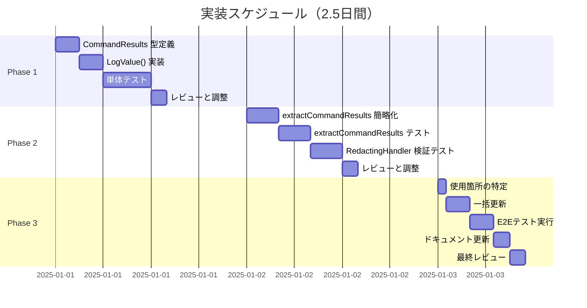
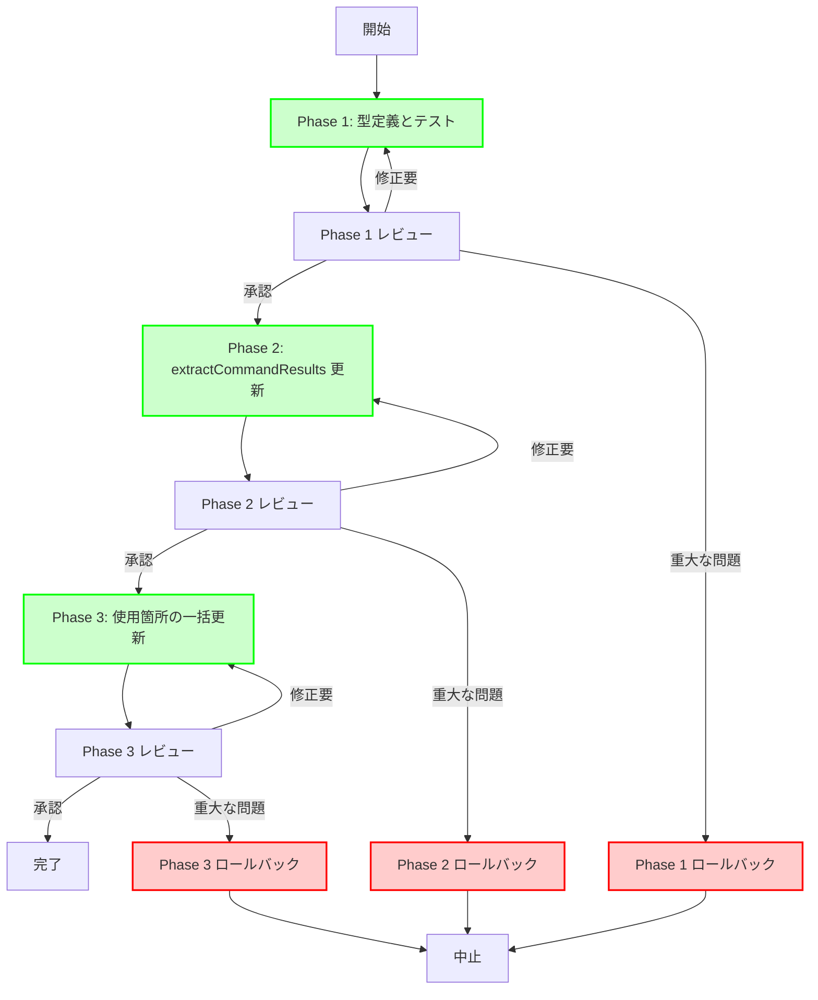

# 実装計画書: CommandResults 型安全性改善

## 目次

1. [実装概要](#実装概要)
2. [フェーズ別実装計画](#フェーズ別実装計画)
3. [Phase 1: CommandResults 型の定義とテスト](#phase-1-commandresults-型の定義とテスト)
4. [Phase 2: extractCommandResults の更新](#phase-2-extractcommandresults-の更新)
5. [Phase 3: 使用箇所の一括更新](#phase-3-使用箇所の一括更新)
6. [ロールバック計画](#ロールバック計画)
7. [リスク管理](#リスク管理)

## 実装概要

### 実装方針

本実装は、アーキテクチャ設計書（`02_architecture.md`）および詳細仕様書（`03_detailed_specification.md`）に基づき、以下の方針で進める:

1. **一括移行**: 新形式への一括移行（後方互換コードは含めない）
2. **YAGNI 原則**: ユーティリティメソッドは実装しない
3. **段階的実装**: 3つのフェーズに分けて実装
4. **品質重視**: 各フェーズで十分なテストを実施

### スケジュール



**総所要時間**: 約2.5日間（実作業時間: 約20時間）

### 成果物

| フェーズ | 成果物 | ファイル |
|---------|--------|---------|
| Phase 1 | CommandResults 型定義 | `internal/common/logschema.go` |
| Phase 1 | 単体テスト | `internal/common/logschema_test.go` |
| Phase 2 | extractCommandResultsFromGroup 実装 | `internal/logging/slack_handler.go` |
| Phase 2 | 統合テスト | `internal/redaction/redactor_test.go` |
| Phase 3 | 更新されたコード | 複数ファイル |
| Phase 3 | E2Eテスト | `internal/runner/integration_test.go` |

## フェーズ別実装計画

### 全体フロー



## Phase 1: CommandResults 型の定義とテスト

### 目標

- `CommandResults` 型を定義
- `LogValue()` メソッドを実装
- 包括的な単体テストを作成

### タスク一覧

#### 1.1 CommandResults 型の定義

**ファイル**: `internal/common/logschema.go`

**変更内容**:

```go
// ファイルの末尾に追加

const (
    // MaxLoggedCommands は1回のログ出力に含めるコマンド結果の上限
    // この制限により、ログサイズとパフォーマンスを管理する
    MaxLoggedCommands = 100
)

// CommandResults は複数のコマンド実行結果を保持する型
//
// この型はスライス全体で slog.LogValuer インターフェースを実装することで、
// RedactingHandler によるスライス要素の型変換問題を回避する。
//
// 設計上の特徴:
//   - []CommandResult のエイリアス型（基底型は同じ）
//   - LogValuer を実装し、Group 構造でログ出力
//   - ユーティリティメソッドは含めない（YAGNI 原則）
//
// 使用例:
//   results := []common.CommandResult{...}
//   commandResults := common.CommandResults(results)
//   slog.InfoContext(ctx, "Group completed",
//       slog.Any(common.GroupSummaryAttrs.Commands, commandResults))
type CommandResults []CommandResult

// コンパイル時に LogValuer インターフェースの実装を確認
var _ slog.LogValuer = CommandResults(nil)
```

**チェックリスト**:
- [x] 型定義を追加
- [x] コメントを追加（設計意図、使用例を含む）
- [x] インターフェース実装チェックを追加
- [x] 定数 `MaxLoggedCommands` を定義

#### 1.2 LogValue() メソッドの実装

**ファイル**: `internal/common/logschema.go`

**実装内容**:

```go
// LogValue implements slog.LogValuer to provide structured logging support.
//
// この実装は、スライス内の各 CommandResult を個別の Group として構造化し、
// 全体を1つの GroupValue として返す。これにより:
//   - slog が LogValuer を認識し、processSlice() を回避
//   - RedactingHandler が Group として redaction を実行
//   - SlackHandler がシンプルな Group 処理で情報を抽出
//
// 出力構造:
//   GroupValue {
//     "total_count": int,
//     "truncated": bool,
//     "cmd_0": GroupValue { "name": ..., "exit_code": ..., ... },
//     "cmd_1": GroupValue { ... },
//     ...
//   }
//
// 制限事項:
//   - 最大100件のコマンド結果を含める（MaxLoggedCommands）
//   - それを超える場合は切り詰め、truncated フラグを設定
func (cr CommandResults) LogValue() slog.Value {
    // nil または空スライスの処理
    if len(cr) == 0 {
        return slog.GroupValue(
            slog.Int("total_count", 0),
        )
    }

    // 切り詰め判定
    commandsToLog := cr
    truncated := false
    if len(cr) > MaxLoggedCommands {
        commandsToLog = cr[:MaxLoggedCommands]
        truncated = true
    }

    // 属性配列を事前確保（最適化）
    // +2: total_count と truncated フラグ
    // +len(commandsToLog): 各コマンド
    attrs := make([]slog.Attr, 0, len(commandsToLog)+2)

    // メタデータを追加
    attrs = append(attrs,
        slog.Int("total_count", len(cr)),
        slog.Bool("truncated", truncated),
    )

    // 各コマンド結果を Group として追加
    for i, cmd := range commandsToLog {
        // キー名は "cmd_0", "cmd_1", ... の形式
        attrs = append(attrs, slog.Group(
            fmt.Sprintf("cmd_%d", i),
            slog.String(LogFieldName, cmd.Name),
            slog.Int(LogFieldExitCode, cmd.ExitCode),
            slog.String(LogFieldOutput, cmd.Output),
            slog.String(LogFieldStderr, cmd.Stderr),
        ))
    }

    return slog.GroupValue(attrs...)
}
```

**チェックリスト**:
- [x] LogValue() メソッドを実装
- [x] nil/空スライスの処理を実装
- [x] 切り詰めロジックを実装
- [x] メモリ最適化（事前確保）を実装
- [x] コメントを追加（出力構造、制限事項を含む）

#### 1.3 単体テストの作成

**ファイル**: `internal/common/logschema_test.go`（新規作成）

**テストケース**:

```go
//go:build test

package common

import (
    "fmt"
    "log/slog"
    "testing"

    "github.com/stretchr/testify/assert"
)

func TestCommandResults_LogValue(t *testing.T) {
    tests := []struct {
        name     string
        results  CommandResults
        validate func(t *testing.T, value slog.Value)
    }{
        {
            name:    "nil slice",
            results: nil,
            validate: func(t *testing.T, value slog.Value) {
                assert.Equal(t, slog.KindGroup, value.Kind())
                attrs := value.Group()
                assert.Len(t, attrs, 1)
                assert.Equal(t, "total_count", attrs[0].Key)
                assert.Equal(t, int64(0), attrs[0].Value.Int64())
            },
        },
        {
            name:    "empty slice",
            results: CommandResults{},
            validate: func(t *testing.T, value slog.Value) {
                assert.Equal(t, slog.KindGroup, value.Kind())
                attrs := value.Group()
                assert.Len(t, attrs, 1)
                assert.Equal(t, "total_count", attrs[0].Key)
                assert.Equal(t, int64(0), attrs[0].Value.Int64())
            },
        },
        {
            name: "single command",
            results: CommandResults{
                {CommandResultFields: CommandResultFields{
                    Name:     "test1",
                    ExitCode: 0,
                    Output:   "ok",
                    Stderr:   "",
                }},
            },
            validate: func(t *testing.T, value slog.Value) {
                assert.Equal(t, slog.KindGroup, value.Kind())
                attrs := value.Group()
                // total_count, truncated, cmd_0
                assert.Len(t, attrs, 3)

                // total_count
                assert.Equal(t, "total_count", attrs[0].Key)
                assert.Equal(t, int64(1), attrs[0].Value.Int64())

                // truncated
                assert.Equal(t, "truncated", attrs[1].Key)
                assert.False(t, attrs[1].Value.Bool())

                // cmd_0
                assert.Equal(t, "cmd_0", attrs[2].Key)
                assert.Equal(t, slog.KindGroup, attrs[2].Value.Kind())

                // cmd_0 の内容を検証
                cmdAttrs := attrs[2].Value.Group()
                assert.Len(t, cmdAttrs, 4)
                assert.Equal(t, "name", cmdAttrs[0].Key)
                assert.Equal(t, "test1", cmdAttrs[0].Value.String())
                assert.Equal(t, "exit_code", cmdAttrs[1].Key)
                assert.Equal(t, int64(0), cmdAttrs[1].Value.Int64())
            },
        },
        {
            name: "multiple commands",
            results: CommandResults{
                {CommandResultFields: CommandResultFields{Name: "test1", ExitCode: 0, Output: "out1", Stderr: ""}},
                {CommandResultFields: CommandResultFields{Name: "test2", ExitCode: 1, Output: "", Stderr: "err2"}},
                {CommandResultFields: CommandResultFields{Name: "test3", ExitCode: 0, Output: "out3", Stderr: "warn3"}},
            },
            validate: func(t *testing.T, value slog.Value) {
                attrs := value.Group()
                // total_count, truncated, cmd_0, cmd_1, cmd_2
                assert.Len(t, attrs, 5)
                assert.Equal(t, int64(3), attrs[0].Value.Int64())
                assert.False(t, attrs[1].Value.Bool())
            },
        },
        {
            name:    "exactly 100 commands - no truncation",
            results: createTestCommandResults(100),
            validate: func(t *testing.T, value slog.Value) {
                attrs := value.Group()
                // total_count, truncated, cmd_0..cmd_99 = 102
                assert.Len(t, attrs, 102)

                // total_count = 100
                assert.Equal(t, int64(100), attrs[0].Value.Int64())

                // truncated = false
                assert.False(t, attrs[1].Value.Bool())

                // cmd_0 から cmd_99 まで存在
                for i := 0; i < 100; i++ {
                    key := fmt.Sprintf("cmd_%d", i)
                    assert.Equal(t, key, attrs[i+2].Key)
                }
            },
        },
        {
            name:    "101 commands - truncation occurs",
            results: createTestCommandResults(101),
            validate: func(t *testing.T, value slog.Value) {
                attrs := value.Group()
                // total_count, truncated, cmd_0..cmd_99 = 102
                assert.Len(t, attrs, 102)

                // total_count = 101
                assert.Equal(t, int64(101), attrs[0].Value.Int64())

                // truncated = true
                assert.True(t, attrs[1].Value.Bool())
            },
        },
        {
            name:    "150 commands - significant truncation",
            results: createTestCommandResults(150),
            validate: func(t *testing.T, value slog.Value) {
                attrs := value.Group()
                // total_count, truncated, cmd_0..cmd_99 = 102
                assert.Len(t, attrs, 102)

                // total_count = 150
                assert.Equal(t, int64(150), attrs[0].Value.Int64())

                // truncated = true
                assert.True(t, attrs[1].Value.Bool())
            },
        },
    }

    for _, tt := range tests {
        t.Run(tt.name, func(t *testing.T) {
            value := tt.results.LogValue()
            tt.validate(t, value)
        })
    }
}

// createTestCommandResults creates test command results with the specified count
func createTestCommandResults(count int) CommandResults {
    results := make(CommandResults, count)
    for i := 0; i < count; i++ {
        results[i] = CommandResult{
            CommandResultFields: CommandResultFields{
                Name:     fmt.Sprintf("cmd%d", i),
                ExitCode: i % 3, // バリエーションを持たせる: 0, 1, 2
                Output:   fmt.Sprintf("output %d", i),
                Stderr:   fmt.Sprintf("stderr %d", i),
            },
        }
    }
    return results
}
```

**チェックリスト**:
- [x] nil スライスのテスト
- [x] 空スライスのテスト
- [x] 単一コマンドのテスト
- [x] 複数コマンドのテスト
- [x] 100件（境界値）のテスト
- [x] 101件（切り詰め発生）のテスト
- [x] 150件（大量切り詰め）のテスト
- [x] ヘルパー関数 `createTestCommandResults` の実装

#### 1.4 コードフォーマットとリント

**コマンド**:
```bash
make fmt
make lint
make test
```

**チェックリスト**:
- [x] `make fmt` でフォーマット
- [x] `make lint` でエラーなし
- [x] `make test` で全テスト通過

### Phase 1 成功基準

- [x] `CommandResults` 型が定義されている
- [x] `LogValue()` が実装されている
- [x] 単体テストが100%カバレッジ
- [x] すべてのテストが通過
- [x] リンターエラーなし
- [ ] コードレビューで承認

### Phase 1 完了時の確認事項

```bash
# テストカバレッジの確認
go test -tags test -coverprofile=coverage.out ./internal/common
go tool cover -func=coverage.out | grep CommandResults

# 期待される出力:
# internal/common/logschema.go:XXX:    CommandResults.LogValue    100.0%
```

## Phase 2: extractCommandResults の更新

### 目標

- `extractCommandResultsFromGroup` 関数を実装
- `extractCommandResults` を wrapper に変更
- RedactingHandler との統合をテスト

### タスク一覧

#### 2.1 extractCommandResultsFromGroup の実装

**ファイル**: `internal/logging/slack_handler.go`

**変更内容**:

```go
// 既存の extractCommandResults の後に追加

// extractCommandResultsFromGroup extracts command result information from a Group value.
//
// この関数は CommandResults.LogValue() が生成した Group 構造から
// コマンド情報を抽出する。
//
// 入力形式:
//   - value.Kind() == slog.KindGroup
//   - Group の各属性が "cmd_N" という名前の Group
//   - 各 "cmd_N" Group が CommandResult のフィールドを含む
//
// 処理:
//   1. Group の属性を取得
//   2. "total_count" と "truncated" をスキップ
//   3. 各 "cmd_N" Group から情報を抽出
//   4. extractFromAttrs() で個別のコマンド情報を生成
//
// エラーハンドリング:
//   - 不正な形式の場合は nil を返す
//   - デバッグログで詳細を記録
func extractCommandResultsFromGroup(groupValue slog.Value) []commandResultInfo {
    // 型チェック 1: Group であることを確認
    if groupValue.Kind() != slog.KindGroup {
        slog.Debug("Command results extraction failed: unexpected value kind",
            "expected", "KindGroup",
            "actual", groupValue.Kind(),
            "function", "extractCommandResultsFromGroup",
        )
        return nil
    }

    // Group の属性を取得
    attrs := groupValue.Group()
    if len(attrs) == 0 {
        slog.Debug("Command results extraction: empty group",
            "function", "extractCommandResultsFromGroup",
        )
        return nil
    }

    // メタデータフィールドを除外し、コマンド数を推定
    estimatedCmdCount := len(attrs) - 2 // total_count と truncated を除く
    if estimatedCmdCount < 0 {
        estimatedCmdCount = 0
    }

    commands := make([]commandResultInfo, 0, estimatedCmdCount)
    skipped := 0

    for i, attr := range attrs {
        // メタデータフィールドをスキップ
        if attr.Key == "total_count" || attr.Key == "truncated" {
            continue
        }

        // 型チェック 2: 各属性が Group であることを確認
        if attr.Value.Kind() != slog.KindGroup {
            slog.Debug("Skipping non-group attribute in command results",
                "index", i,
                "key", attr.Key,
                "kind", attr.Value.Kind(),
                "function", "extractCommandResultsFromGroup",
            )
            skipped++
            continue
        }

        // コマンド情報を抽出（既存の extractFromAttrs を再利用）
        cmdAttrs := attr.Value.Group()
        cmdInfo := extractFromAttrs(cmdAttrs)

        // 必須フィールドの検証
        if cmdInfo.Name == "" {
            slog.Debug("Skipping command result with missing name",
                "index", i,
                "key", attr.Key,
                "function", "extractCommandResultsFromGroup",
            )
            skipped++
            continue
        }

        commands = append(commands, cmdInfo)
    }

    if skipped > 0 {
        slog.Debug("Command results extraction completed with some skipped items",
            "extracted", len(commands),
            "skipped", skipped,
            "total_attrs", len(attrs),
            "function", "extractCommandResultsFromGroup",
        )
    }

    return commands
}
```

**チェックリスト**:
- [x] `extractCommandResultsFromGroup` 関数を実装
- [x] デバッグログを追加（5箇所）
- [x] メタデータフィールドのスキップ処理
- [x] 必須フィールドの検証
- [x] コメントを追加

#### 2.2 extractCommandResults の更新

**ファイル**: `internal/logging/slack_handler.go`

**変更内容**:

```go
// 既存の extractCommandResults を以下に置き換え

// extractCommandResults extracts command result information from log values.
//
// この関数は extractCommandResultsFromGroup の wrapper として動作し、
// CommandResults.LogValue() が生成した Group 構造を処理する。
//
// 旧実装との互換性:
//   - 新形式（Group 構造）のみをサポート
//   - 旧形式（[]any）はサポートしない（一括移行のため）
func extractCommandResults(value slog.Value) []commandResultInfo {
    return extractCommandResultsFromGroup(value)
}
```

**チェックリスト**:
- [x] 既存の `extractCommandResults` を削除
- [x] 新しい `extractCommandResults` を実装（wrapper）
- [x] コメントを更新

#### 2.3 単体テストの作成

**ファイル**: `internal/logging/slack_handler_test.go`

**テストケース**:

```go
func TestExtractCommandResultsFromGroup(t *testing.T) {
    tests := []struct {
        name     string
        input    slog.Value
        expected []commandResultInfo
        wantNil  bool
    }{
        {
            name: "valid group structure with single command",
            input: common.CommandResults{
                {CommandResultFields: common.CommandResultFields{
                    Name:     "test1",
                    ExitCode: 0,
                    Output:   "ok",
                    Stderr:   "",
                }},
            }.LogValue(),
            expected: []commandResultInfo{
                {Name: "test1", ExitCode: 0, Output: "ok", Stderr: ""},
            },
            wantNil: false,
        },
        {
            name: "valid group structure with multiple commands",
            input: common.CommandResults{
                {CommandResultFields: common.CommandResultFields{Name: "test1", ExitCode: 0, Output: "out1", Stderr: ""}},
                {CommandResultFields: common.CommandResultFields{Name: "test2", ExitCode: 1, Output: "", Stderr: "err2"}},
                {CommandResultFields: common.CommandResultFields{Name: "test3", ExitCode: 0, Output: "out3", Stderr: "warn3"}},
            }.LogValue(),
            expected: []commandResultInfo{
                {Name: "test1", ExitCode: 0, Output: "out1", Stderr: ""},
                {Name: "test2", ExitCode: 1, Output: "", Stderr: "err2"},
                {Name: "test3", ExitCode: 0, Output: "out3", Stderr: "warn3"},
            },
            wantNil: false,
        },
        {
            name:     "empty group",
            input:    slog.GroupValue(),
            expected: nil,
            wantNil:  true,
        },
        {
            name:     "non-group value - string",
            input:    slog.StringValue("invalid"),
            expected: nil,
            wantNil:  true,
        },
        {
            name:     "non-group value - int",
            input:    slog.IntValue(123),
            expected: nil,
            wantNil:  true,
        },
        {
            name: "group with metadata only",
            input: slog.GroupValue(
                slog.Int("total_count", 0),
                slog.Bool("truncated", false),
            ),
            expected: []commandResultInfo{},
            wantNil:  false,
        },
        {
            name: "group with non-group attribute - skip it",
            input: slog.GroupValue(
                slog.Int("total_count", 2),
                slog.Bool("truncated", false),
                slog.String("invalid_attr", "should be skipped"),
                slog.Group("cmd_0",
                    slog.String("name", "valid"),
                    slog.Int("exit_code", 0),
                    slog.String("output", ""),
                    slog.String("stderr", ""),
                ),
            ),
            expected: []commandResultInfo{
                {Name: "valid", ExitCode: 0, Output: "", Stderr: ""},
            },
            wantNil: false,
        },
        {
            name: "command with missing name - skip it",
            input: slog.GroupValue(
                slog.Int("total_count", 2),
                slog.Bool("truncated", false),
                slog.Group("cmd_0",
                    // name フィールドがない
                    slog.Int("exit_code", 0),
                    slog.String("output", ""),
                    slog.String("stderr", ""),
                ),
                slog.Group("cmd_1",
                    slog.String("name", "valid"),
                    slog.Int("exit_code", 0),
                    slog.String("output", ""),
                    slog.String("stderr", ""),
                ),
            ),
            expected: []commandResultInfo{
                {Name: "valid", ExitCode: 0, Output: "", Stderr: ""},
            },
            wantNil: false,
        },
    }

    for _, tt := range tests {
        t.Run(tt.name, func(t *testing.T) {
            result := extractCommandResultsFromGroup(tt.input)

            if tt.wantNil {
                assert.Nil(t, result)
            } else {
                assert.Equal(t, tt.expected, result)
            }
        })
    }
}

func TestExtractCommandResults_Wrapper(t *testing.T) {
    // extractCommandResults が extractCommandResultsFromGroup を呼び出すことを確認
    input := common.CommandResults{
        {CommandResultFields: common.CommandResultFields{Name: "test", ExitCode: 0}},
    }.LogValue()

    result := extractCommandResults(input)

    assert.Len(t, result, 1)
    assert.Equal(t, "test", result[0].Name)
}
```

**チェックリスト**:
- [x] 正常系テスト（単一コマンド）
- [x] 正常系テスト（複数コマンド）
- [x] 空 Group のテスト
- [x] 非 Group 値のテスト（String, Int）
- [x] メタデータのみの Group のテスト
- [x] 非 Group 属性のスキップテスト
- [x] 必須フィールド欠損のテスト
- [x] wrapper 関数のテスト

#### 2.4 RedactingHandler 統合テストの作成

**ファイル**: `internal/redaction/redactor_test.go`

**テストケース**:

```go
func TestRedactingHandler_CommandResults_Integration(t *testing.T) {
    tests := []struct {
        name     string
        results  common.CommandResults
        validate func(t *testing.T, output string)
    }{
        {
            name: "redact password in output",
            results: common.CommandResults{
                {CommandResultFields: common.CommandResultFields{
                    Name:     "setup",
                    ExitCode: 0,
                    Output:   "Database password=secret123 configured",
                    Stderr:   "",
                }},
            },
            validate: func(t *testing.T, output string) {
                assert.Contains(t, output, "[REDACTED]")
                assert.NotContains(t, output, "secret123")
                assert.Contains(t, output, "Database")
                assert.Contains(t, output, "configured")
            },
        },
        {
            name: "redact multiple sensitive fields",
            results: common.CommandResults{
                {CommandResultFields: common.CommandResultFields{
                    Name:     "deploy",
                    ExitCode: 0,
                    Output:   "API key=sk-1234567890abcdef set",
                    Stderr:   "",
                }},
                {CommandResultFields: common.CommandResultFields{
                    Name:     "configure",
                    ExitCode: 0,
                    Output:   "",
                    Stderr:   "Warning: token=ghp_xxxxxxxxxxxx expired",
                }},
            },
            validate: func(t *testing.T, output string) {
                // API key が redaction されている
                assert.Contains(t, output, "[REDACTED]")
                assert.NotContains(t, output, "sk-1234567890abcdef")

                // token が redaction されている
                assert.NotContains(t, output, "ghp_xxxxxxxxxxxx")

                // 非機密情報は保持されている
                assert.Contains(t, output, "API")
                assert.Contains(t, output, "Warning")
            },
        },
        {
            name: "preserve non-sensitive output",
            results: common.CommandResults{
                {CommandResultFields: common.CommandResultFields{
                    Name:     "test",
                    ExitCode: 0,
                    Output:   "All tests passed",
                    Stderr:   "",
                }},
            },
            validate: func(t *testing.T, output string) {
                assert.Contains(t, output, "All tests passed")
                assert.NotContains(t, output, "[REDACTED]")
            },
        },
    }

    for _, tt := range tests {
        t.Run(tt.name, func(t *testing.T) {
            // RedactingHandler のセットアップ
            var buf bytes.Buffer
            handler := slog.NewJSONHandler(&buf, nil)
            redactor := redaction.NewRedactor()
            redactingHandler := redaction.NewRedactingHandler(handler, redactor)

            // CommandResults をログ記録
            logger := slog.New(redactingHandler)
            logger.Info("test", slog.Any("commands", tt.results))

            // 出力を取得
            output := buf.String()

            // 検証
            tt.validate(t, output)
        })
    }
}
```

**チェックリスト**:
- [x] password redaction のテスト
- [x] 複数フィールドの redaction のテスト
- [x] 非機密情報の保持テスト
- [x] JSON 出力形式の確認

#### 2.5 コードフォーマットとリント

**コマンド**:
```bash
make fmt
make lint
make test
```

**チェックリスト**:
- [x] `make fmt` でフォーマット
- [x] `make lint` でエラーなし
- [x] `make test` で全テスト通過

### Phase 2 成功基準

- [x] `extractCommandResultsFromGroup` が実装されている
- [x] `extractCommandResults` が wrapper になっている
- [x] 単体テストが通過
- [x] RedactingHandler 統合テストが通過
- [x] すべてのテストが通過
- [x] リンターエラーなし
- [ ] コードレビューで承認

## Phase 3: 使用箇所の一括更新

### 目標

- 全ての `[]CommandResult` 使用箇所を特定
- `CommandResults` への一括変更
- E2Eテストで動作確認

### タスク一覧

#### 3.1 使用箇所の特定

**コマンド**:
```bash
# []CommandResult の使用箇所を検索
grep -rn "[]CommandResult" --include="*.go" internal/

# slog.Any.*commands の使用箇所を検索
grep -rn "slog.Any.*commands" --include="*.go" internal/
```

**予想される使用箇所**:
1. `internal/runner/group_executor.go` - `executeAllCommands` の戻り値型
2. `internal/runner/runner.go` - `logGroupExecutionSummary` 関数
3. `internal/runner/notification.go` - `groupExecutionResult` 構造体（変更不要）
4. テストファイル（複数）

**チェックリスト**:
- [x] 使用箇所のリストを作成
- [x] 各ファイルの変更内容を確認

#### 3.2 runner.go の更新

**ファイル**: `internal/runner/runner.go`

**変更箇所**: `logGroupExecutionSummary` 関数

**Before**:
```go
func logGroupExecutionSummary(group *runnertypes.GroupSpec, result *groupExecutionResult, duration time.Duration) {
    slog.InfoContext(
        context.Background(),
        "Command group execution summary",
        slog.String(common.GroupSummaryAttrs.Status, string(result.status)),
        slog.String(common.GroupSummaryAttrs.Group, group.Name),
        slog.Int64(common.GroupSummaryAttrs.DurationMs, duration.Milliseconds()),
        slog.Any(common.GroupSummaryAttrs.Commands, result.commands),
    )
}
```

**After**:
```go
func logGroupExecutionSummary(group *runnertypes.GroupSpec, result *groupExecutionResult, duration time.Duration) {
    // []CommandResult を CommandResults に変換してログ記録
    commandResults := common.CommandResults(result.commands)

    slog.InfoContext(
        context.Background(),
        "Command group execution summary",
        slog.String(common.GroupSummaryAttrs.Status, string(result.status)),
        slog.String(common.GroupSummaryAttrs.Group, group.Name),
        slog.Int64(common.GroupSummaryAttrs.DurationMs, duration.Milliseconds()),
        slog.Any(common.GroupSummaryAttrs.Commands, commandResults),
    )
}
```

**チェックリスト**:
- [x] `commandResults` 変数を追加
- [x] 型変換を実装
- [x] コメントを追加

#### 3.3 テストファイルの更新

**対象ファイル**:
- `internal/runner/runner_test.go`
- `internal/logging/slack_handler_test.go`
- `internal/logging/slack_handler_benchmark_test.go`

**変更方針**:
1. `[]CommandResult` を直接使用しているテストを `CommandResults` に変更
2. `slog.Any()` に渡す前に型変換

**例**:

**Before**:
```go
results := []common.CommandResult{
    {CommandResultFields: common.CommandResultFields{Name: "test1", ExitCode: 0}},
}
value := slog.AnyValue(results)
```

**After**:
```go
results := common.CommandResults{
    {CommandResultFields: common.CommandResultFields{Name: "test1", ExitCode: 0}},
}
value := results.LogValue()
```

**チェックリスト**:
- [x] `runner_test.go` の更新
- [x] `slack_handler_test.go` の更新
- [x] `slack_handler_benchmark_test.go` の更新
- [x] 全テストが通過することを確認

#### 3.4 E2Eテストの実行

**テストシナリオ**:

1. **GroupExecutor でコマンド実行**
   - 複数のコマンドを含むグループを実行
   - 成功と失敗のケースを含む

2. **ログ出力の確認**
   - RedactingHandler を経由してログが出力される
   - 機密情報が redaction されている
   - Group 構造が維持されている

3. **Slack 通知の確認**（モック）
   - SlackHandler がメッセージを構築
   - コマンド情報が正しく抽出されている
   - フォーマットが適切

**実装**:

```go
// internal/runner/integration_command_results_test.go（新規作成）

//go:build test

package runner

import (
    "bytes"
    "context"
    "encoding/json"
    "log/slog"
    "testing"

    "github.com/isseis/go-safe-cmd-runner/internal/common"
    "github.com/isseis/go-safe-cmd-runner/internal/logging"
    "github.com/isseis/go-safe-cmd-runner/internal/redaction"
    "github.com/stretchr/testify/assert"
    "github.com/stretchr/testify/require"
)

func TestCommandResults_E2E_Integration(t *testing.T) {
    // テスト用のコマンド結果を作成
    results := common.CommandResults{
        {CommandResultFields: common.CommandResultFields{
            Name:     "setup",
            ExitCode: 0,
            Output:   "Database configured with password=secret123",
            Stderr:   "",
        }},
        {CommandResultFields: common.CommandResultFields{
            Name:     "test",
            ExitCode: 0,
            Output:   "All tests passed",
            Stderr:   "",
        }},
        {CommandResultFields: common.CommandResultFields{
            Name:     "deploy",
            ExitCode: 1,
            Output:   "",
            Stderr:   "Deployment failed: API key=sk-invalid rejected",
        }},
    }

    // ログハンドラのセットアップ
    var buf bytes.Buffer
    jsonHandler := slog.NewJSONHandler(&buf, nil)
    redactor := redaction.NewRedactor()
    redactingHandler := redaction.NewRedactingHandler(jsonHandler, redactor)

    // ログ記録
    logger := slog.New(redactingHandler)
    logger.Info("Command group execution summary",
        slog.String(common.GroupSummaryAttrs.Status, "error"),
        slog.String(common.GroupSummaryAttrs.Group, "test_group"),
        slog.Int64(common.GroupSummaryAttrs.DurationMs, 1234),
        slog.Any(common.GroupSummaryAttrs.Commands, results),
    )

    // JSON 出力をパース
    var logged map[string]any
    err := json.Unmarshal(buf.Bytes(), &logged)
    require.NoError(t, err)

    // commands フィールドを検証
    commands, ok := logged["commands"].(map[string]any)
    require.True(t, ok, "commands should be a map")

    // メタデータを確認
    assert.Equal(t, float64(3), commands["total_count"])
    assert.Equal(t, false, commands["truncated"])

    // cmd_0 の検証
    cmd0, ok := commands["cmd_0"].(map[string]any)
    require.True(t, ok)
    assert.Equal(t, "setup", cmd0["name"])
    assert.Equal(t, float64(0), cmd0["exit_code"])

    // password が redaction されていることを確認
    output0 := cmd0["output"].(string)
    assert.Contains(t, output0, "[REDACTED]")
    assert.NotContains(t, output0, "secret123")

    // cmd_2 の検証（失敗したコマンド）
    cmd2, ok := commands["cmd_2"].(map[string]any)
    require.True(t, ok)
    assert.Equal(t, "deploy", cmd2["name"])
    assert.Equal(t, float64(1), cmd2["exit_code"])

    // API key が redaction されていることを確認
    stderr2 := cmd2["stderr"].(string)
    assert.Contains(t, stderr2, "[REDACTED]")
    assert.NotContains(t, stderr2, "sk-invalid")
}
```

**チェックリスト**:
- [x] E2Eテストファイルを作成
- [x] RedactingHandler との統合を確認
- [x] 機密情報の redaction を確認
- [x] Group 構造の維持を確認
- [x] テストが通過することを確認

#### 3.5 全体テストの実行

**コマンド**:
```bash
# 全テストを実行
make test

# カバレッジレポートを生成
go test -tags test -coverprofile=coverage.out ./...
go tool cover -html=coverage.out -o coverage.html

# ベンチマークを実行
go test -tags test -bench=. -benchmem ./internal/logging
```

**チェックリスト**:
- [ ] 全テストが通過
- [ ] カバレッジ目標を達成
- [ ] ベンチマーク結果が目標値以内
- [ ] リンターエラーなし

#### 3.6 ドキュメントの更新

**対象ファイル**:
- `docs/dev/redaction_slice_type_conversion.md`

**追加内容**:

```markdown
## 解決方法（実装済み）

Task 0056 で CommandResults 型を導入し、この問題を解決した。

### 実装内容

1. **CommandResults 型の定義**:
   - `[]CommandResult` のエイリアス型
   - `LogValuer` インターフェースを実装

2. **LogValue() の実装**:
   - Group 構造でログ出力
   - スライス要素ではなく、スライス全体で LogValuer を実装

3. **extractCommandResults の簡略化**:
   - 型チェック: 6回 → 2回
   - コード行数: 約60行 → 約30行

詳細は以下を参照:
- [Task 0056 要件定義書](../tasks/0056_command_results_type_safety/01_requirements.md)
- [Task 0056 アーキテクチャ設計書](../tasks/0056_command_results_type_safety/02_architecture.md)
```

**チェックリスト**:
- [ ] ドキュメントを更新
- [ ] Task 0056 へのリンクを追加
- [ ] 実装内容を要約

### Phase 3 成功基準

- [ ] 全ての使用箇所が更新されている
- [ ] E2Eテストが通過
- [ ] 全テストが通過
- [ ] カバレッジ目標を達成
- [ ] ベンチマーク目標を達成
- [ ] ドキュメントが更新されている
- [ ] コードレビューで承認

## ロールバック計画

### ロールバックのトリガー

以下の問題が発生した場合、ロールバックを検討する:

1. **重大なバグ**:
   - ログが正しく出力されない
   - Slack 通知が失敗する
   - 機密情報が redaction されない
   - システムがクラッシュする

2. **パフォーマンス問題**:
   - 処理時間が目標値の2倍以上
   - メモリ使用量が50%以上増加
   - OOM エラーが発生

3. **テスト失敗**:
   - E2Eテストが通過しない
   - 既存のテストが失敗する
   - カバレッジが大幅に低下

### フェーズ別ロールバック手順

#### Phase 1 のロールバック

**影響範囲**: `internal/common/logschema.go` のみ

**手順**:
```bash
# 変更を確認
git diff internal/common/logschema.go

# ファイルを元に戻す
git checkout HEAD -- internal/common/logschema.go

# テストファイルを削除
rm internal/common/logschema_test.go

# テストを実行して確認
make test
```

**所要時間**: 5分以内

**影響**: なし（他のコードに影響なし）

#### Phase 2 のロールバック

**影響範囲**: `internal/logging/slack_handler.go` および関連テスト

**手順**:
```bash
# Phase 2 の変更を確認
git diff internal/logging/slack_handler.go

# ファイルを元に戻す
git checkout HEAD -- internal/logging/slack_handler.go

# 追加したテストを削除
git checkout HEAD -- internal/redaction/redactor_test.go

# Phase 1 もロールバックが必要な場合
git checkout HEAD -- internal/common/logschema.go
rm internal/common/logschema_test.go

# テストを実行して確認
make test
```

**所要時間**: 10分以内

**影響**: SlackHandler の動作は既存のまま維持

#### Phase 3 のロールバック

**影響範囲**: 複数ファイル（`runner.go`, テストファイルなど）

**手順**:
```bash
# 全ての変更を確認
git status
git diff

# 全ての変更を元に戻す
git checkout HEAD -- internal/runner/runner.go
git checkout HEAD -- internal/runner/runner_test.go
git checkout HEAD -- internal/logging/slack_handler_test.go
git checkout HEAD -- internal/logging/slack_handler_benchmark_test.go

# E2Eテストを削除
rm internal/runner/integration_command_results_test.go

# Phase 1, 2 もロールバック
git checkout HEAD -- internal/logging/slack_handler.go
git checkout HEAD -- internal/common/logschema.go
rm internal/common/logschema_test.go

# テストを実行して確認
make test
```

**所要時間**: 15分以内

**影響**: 全ての変更が取り消され、元の状態に戻る

### 緊急時のロールバック

**重大な問題が本番環境で発生した場合**:

```bash
# 最新の main ブランチに戻す
git checkout main
git pull origin main

# ビルドとテスト
make clean
make build
make test

# 本番環境にデプロイ
# (デプロイ手順はプロジェクト固有)
```

### ロールバック後の対応

1. **問題の分析**:
   - ログファイルを確認
   - エラーメッセージを収集
   - 再現手順を特定

2. **修正計画の策定**:
   - 問題の根本原因を特定
   - 修正案を作成
   - レビューと承認

3. **再実装**:
   - 修正版を実装
   - テストを追加
   - 段階的に再デプロイ

## リスク管理

### リスク一覧と対策

| リスク | 発生確率 | 影響度 | 対策 |
|--------|---------|--------|------|
| **RedactingHandler との非互換性** | 低 | 高 | 先行検証テストで確認済み |
| **パフォーマンス劣化** | 低 | 中 | ベンチマークテストで監視 |
| **既存テストの失敗** | 中 | 中 | Phase ごとに全テスト実行 |
| **Slack 通知の失敗** | 低 | 高 | E2Eテストで検証 |
| **機密情報の漏洩** | 低 | 高 | 統合テストで redaction を確認 |
| **ログ形式の変更による影響** | 中 | 低 | ドキュメント更新で対応 |
| **大量コマンド結果のメモリ不足** | 低 | 中 | 切り詰めロジックで対応 |

### 品質保証チェックリスト

#### Phase 1 完了時

- [ ] CommandResults 型が正しく定義されている
- [ ] LogValue() が期待通りの出力を生成
- [ ] nil/空スライスが正しく処理される
- [ ] 100件の境界値が正しく処理される
- [ ] 切り詰めロジックが動作する
- [ ] 全ての単体テストが通過
- [ ] カバレッジ100%を達成
- [ ] リンターエラーなし
- [ ] コードレビューで承認

#### Phase 2 完了時

- [ ] extractCommandResultsFromGroup が実装されている
- [ ] デバッグログが適切に出力される
- [ ] メタデータフィールドが正しくスキップされる
- [ ] 必須フィールドの検証が動作する
- [ ] RedactingHandler との統合が動作する
- [ ] 機密情報が redaction される
- [ ] Group 構造が維持される
- [ ] 全てのテストが通過
- [ ] リンターエラーなし
- [ ] コードレビューで承認

#### Phase 3 完了時

- [ ] 全ての使用箇所が更新されている
- [ ] runner.go が正しく動作する
- [ ] 全てのテストファイルが更新されている
- [ ] E2Eテストが通過
- [ ] RedactingHandler + SlackHandler の連携が動作
- [ ] 機密情報が end-to-end で redaction される
- [ ] パフォーマンス目標を達成
- [ ] カバレッジ目標を達成
- [ ] ドキュメントが更新されている
- [ ] リンターエラーなし
- [ ] 最終コードレビューで承認

### デプロイ前の最終チェック

```bash
# 全テストを実行
make clean
make test

# リンターを実行
make lint

# ベンチマークを実行
go test -tags test -bench=. -benchmem ./internal/logging > benchmark_results.txt

# カバレッジレポートを生成
go test -tags test -coverprofile=coverage.out ./...
go tool cover -func=coverage.out | grep -E "CommandResults|extractCommandResults"

# ビルドを確認
make build
```

**チェックリスト**:
- [ ] 全テスト通過
- [ ] リンターエラーなし
- [ ] ベンチマーク結果が目標値以内
- [ ] カバレッジ目標達成
- [ ] ビルド成功
- [ ] ドキュメント更新完了
- [ ] コードレビュー承認済み

## 参照

- [要件定義書](./01_requirements.md)
- [アーキテクチャ設計書](./02_architecture.md)
- [詳細仕様書](./03_detailed_specification.md)
