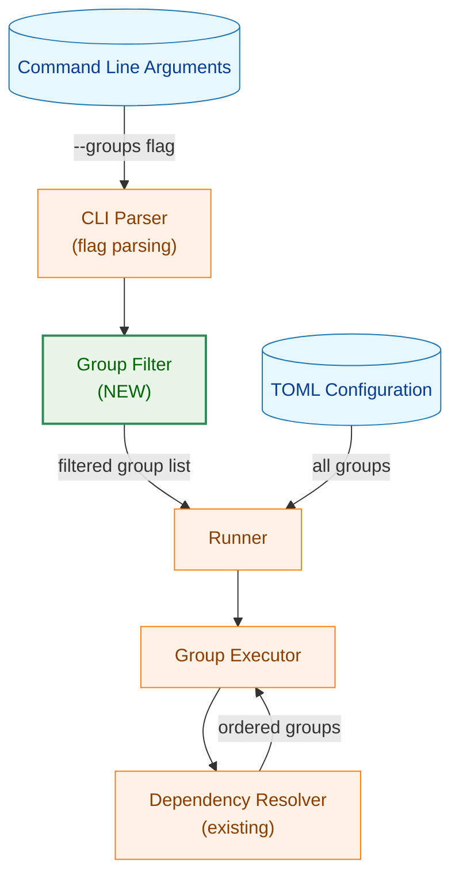
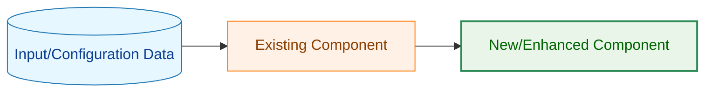
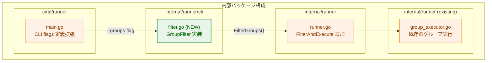
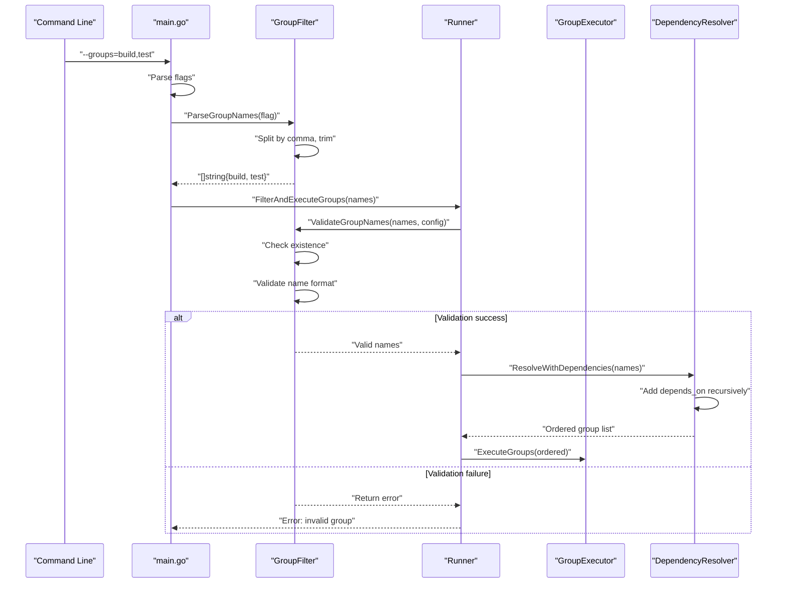
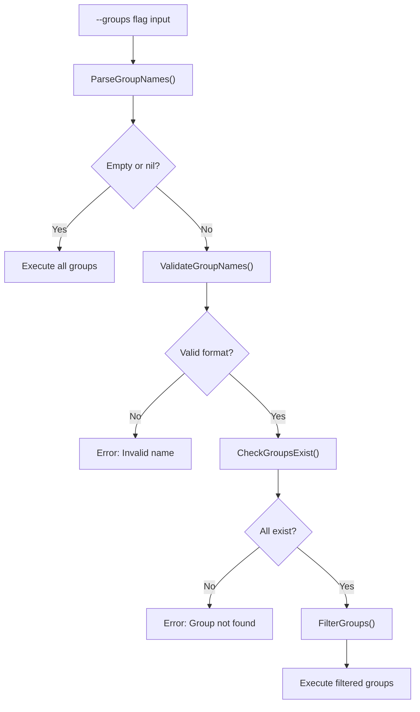
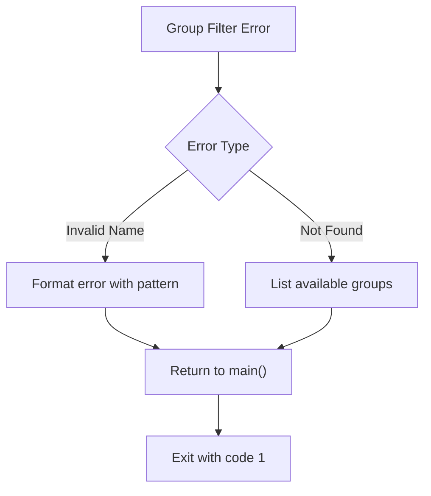
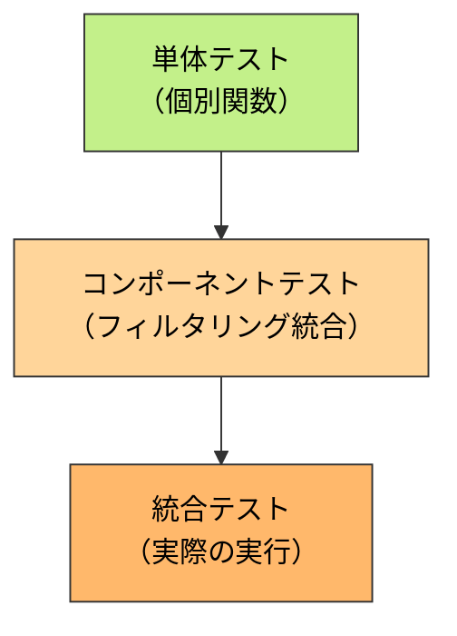
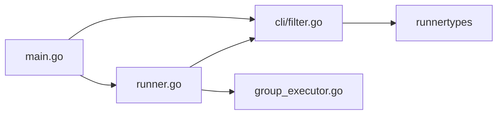

# アーキテクチャ設計書: グループフィルタリング機能

## 1. システム概要

### 1.1 アーキテクチャ目標
- 既存のコマンドラインインターフェースへの最小限の変更
- グループ実行ロジックへの透過的な統合
- 依存関係解決の自動化
- 保守性とテスタビリティの確保

### 1.2 設計原則
- **既存活用**: 既存のグループ依存関係解決ロジックを再利用
- **分離**: フィルタリングロジックを明確に分離
- **単純性**: YAGNI原則に従い、必要十分な機能のみ実装
- **一貫性**: 既存のCLI設計パターンに準拠

## 2. システム構成

### 2.1 全体アーキテクチャ



**凡例（Legend）**



### 2.2 コンポーネント配置



### 2.3 データフロー



## 3. コンポーネント設計

### 3.1 CLI フラグ拡張

#### 3.1.1 main.go の変更

```go
// cmd/runner/main.go

var (
    // 既存フラグ
    configPath    = flag.String("config", "", "path to config file")
    // ...その他の既存フラグ...

    // 新規フラグ
    groups        = flag.String("groups", "", "comma-separated list of groups to execute (executes all groups if not specified)")
)
```

### 3.2 グループフィルター (NEW)

#### 3.2.1 GroupFilter インターフェース

**ファイル**: `internal/runner/cli/filter.go` (新規作成)

```go
package cli

import (
    "fmt"
    "regexp"
    "strings"

    "github.com/isseis/go-safe-cmd-runner/internal/runner/runnertypes"
)

// GroupNamePattern は有効なグループ名のパターン
// 環境変数名と同じルール: [A-Za-z_][A-Za-z0-9_]*
var GroupNamePattern = regexp.MustCompile(`^[A-Za-z_][A-Za-z0-9_]*$`)

// ParseGroupNames はコマンドラインフラグからグループ名をパースする
// カンマ区切りの文字列を分割し、空白をトリミングし、空要素を除外する
//
// Parameters:
//   - groupsFlag: --groups フラグの値
//
// Returns:
//   - []string: パースされたグループ名のリスト（空の場合はnil）
func ParseGroupNames(groupsFlag string) []string {
    if groupsFlag == "" {
        return nil
    }

    parts := strings.Split(groupsFlag, ",")
    result := make([]string, 0, len(parts))

    for _, part := range parts {
        trimmed := strings.TrimSpace(part)
        if trimmed != "" {
            result = append(result, trimmed)
        }
    }

    if len(result) == 0 {
        return nil
    }

    return result
}

// ValidateGroupName は単一のグループ名が命名規則に適合しているか検証する
//
// Parameters:
//   - name: 検証するグループ名
//
// Returns:
//   - error: 無効な場合はエラー、有効な場合はnil
func ValidateGroupName(name string) error {
    if !GroupNamePattern.MatchString(name) {
        return fmt.Errorf("invalid group name %q: must match pattern [A-Za-z_][A-Za-z0-9_]*", name)
    }
    return nil
}

// ValidateGroupNames は複数のグループ名を検証する
//
// Parameters:
//   - names: 検証するグループ名のリスト
//
// Returns:
//   - error: いずれかが無効な場合はエラー、すべて有効な場合はnil
func ValidateGroupNames(names []string) error {
    for _, name := range names {
        if err := ValidateGroupName(name); err != nil {
            return err
        }
    }
    return nil
}

// CheckGroupsExist は指定されたグループ名が設定に存在するか検証する
//
// Parameters:
//   - names: 検証するグループ名のリスト
//   - config: TOML設定
//
// Returns:
//   - error: 存在しないグループがある場合はエラー
func CheckGroupsExist(names []string, config *runnertypes.ConfigSpec) error {
    // 設定内のグループ名のセットを作成
    existingGroups := make(map[string]bool)
    for _, group := range config.Groups {
        existingGroups[group.Name] = true
    }

    // 各指定グループが存在するか確認
    var missing []string
    for _, name := range names {
        if !existingGroups[name] {
            missing = append(missing, name)
        }
    }

    if len(missing) > 0 {
        // 利用可能なグループ名のリストを生成
        available := make([]string, 0, len(config.Groups))
        for _, group := range config.Groups {
            available = append(available, group.Name)
        }

        return fmt.Errorf("group(s) %v specified in --groups do not exist in configuration\nAvailable groups: %v",
            missing, available)
    }

    return nil
}

// FilterGroups は指定されたグループ名でフィルタリングを実行する
// names が nil または空の場合は、すべてのグループを返す
//
// Parameters:
//   - names: フィルターするグループ名（nil の場合は全グループ）
//   - config: TOML設定
//
// Returns:
//   - []string: フィルタリングされたグループ名のリスト
//   - error: バリデーションエラー
func FilterGroups(names []string, config *runnertypes.ConfigSpec) ([]string, error) {
    // フラグ未指定の場合は全グループを返す
    if names == nil || len(names) == 0 {
        allGroups := make([]string, len(config.Groups))
        for i, group := range config.Groups {
            allGroups[i] = group.Name
        }
        return allGroups, nil
    }

    // グループ名の形式を検証
    if err := ValidateGroupNames(names); err != nil {
        return nil, err
    }

    // グループの存在を確認
    if err := CheckGroupsExist(names, config); err != nil {
        return nil, err
    }

    return names, nil
}
```

### 3.3 依存関係解決の統合

#### 3.3.1 既存の依存関係解決ロジックの活用

現在の `Runner.ExecuteAll()` は既に依存関係解決機能を持っている。
新機能では、実行前にグループリストをフィルタリングするだけで、
既存の依存関係解決ロジックをそのまま活用できる。

**変更箇所**: `internal/runner/runner.go`

```go
// ExecuteFiltered は指定されたグループのみを実行する（依存関係も含む）
// groupNames が空の場合は全グループを実行（ExecuteAll と同じ動作）
//
// Parameters:
//   - ctx: コンテキスト
//   - groupNames: 実行するグループ名のリスト（nil の場合は全グループ）
//
// Returns:
//   - error: 実行エラー
func (r *Runner) ExecuteFiltered(ctx context.Context, groupNames []string) error {
    // グループ名が指定されていない場合は全グループを実行
    if groupNames == nil || len(groupNames) == 0 {
        return r.ExecuteAll(ctx)
    }

    // 指定されたグループのみを含む設定を作成
    filteredConfig := r.filterConfigGroups(groupNames)

    // フィルタリングされた設定で実行
    // 既存のExecuteAllロジックを使用（依存関係解決を含む）
    return r.executeGroups(ctx, filteredConfig)
}

// filterConfigGroups は指定されたグループ名のみを含む設定を作成する
func (r *Runner) filterConfigGroups(groupNames []string) *runnertypes.ConfigSpec {
    nameSet := make(map[string]bool)
    for _, name := range groupNames {
        nameSet[name] = true
    }

    filteredGroups := make([]runnertypes.CommandGroup, 0, len(groupNames))
    for _, group := range r.config.Groups {
        if nameSet[group.Name] {
            filteredGroups = append(filteredGroups, group)
        }
    }

    // 新しい設定を作成（グローバル設定はそのまま、グループのみフィルタリング）
    filteredConfig := *r.config
    filteredConfig.Groups = filteredGroups

    return &filteredConfig
}
```

**注**: 既存の `ExecuteAll()` 内部の依存関係解決ロジックは変更不要。
フィルタリングされたグループリストに対して、依存関係が自動的に追加される。

### 3.4 ログ出力の統合

#### 3.4.1 依存関係追加のログ

依存関係により追加されたグループは INFO レベルでログ出力する。

**実装箇所**: 依存関係解決ロジック内（`internal/runner/runner.go` の `collectGroupsWithDependencies` 関数）

```go
// 既存コードに以下のログを追加
slog.Info("Adding dependent group to execution list",
    "group", dependentGroupName,
    "required_by", requestingGroupName)
```

## 4. セキュリティアーキテクチャ

### 4.1 入力検証フロー



### 4.2 セキュリティ考慮事項

| セキュリティ項目 | 対策 |
|----------------|------|
| インジェクション攻撃 | 正規表現による厳格な名前検証 |
| 設定ファイル外のグループ実行 | 存在確認により防止 |
| 意図しない依存関係 | 明示的なログ出力で可視化 |

## 5. エラーハンドリング設計

### 5.1 エラー階層構造

**新規エラー定義** (`internal/runner/cli/filter.go`):

```go
var (
    // ErrInvalidGroupName はグループ名が命名規則に違反している場合のエラー
    ErrInvalidGroupName = errors.New("invalid group name")

    // ErrGroupNotFound は指定されたグループが存在しない場合のエラー
    ErrGroupNotFound = errors.New("group not found")
)
```

### 5.2 エラー処理フロー



### 5.3 エラーメッセージ設計

**無効なグループ名**:
```
Error: invalid group name '123test' in --groups flag
Group names must match the pattern: [A-Za-z_][A-Za-z0-9_]*
```

**存在しないグループ**:
```
Error: group(s) [nonexistent] specified in --groups do not exist in configuration
Available groups: [preparation, build, test, deploy]
```

## 6. パフォーマンス設計

### 6.1 性能最適化戦略

- **フィルタリングのO(n)実装**: グループ数に対して線形時間
- **依存関係解決の再利用**: 既存の効率的な実装を活用
- **メモリ使用の最小化**: フィルタリング時の一時データ構造を最小限に

### 6.2 パフォーマンス要件

| メトリクス | 目標値 | 根拠 |
|----------|-------|------|
| フィルタリング処理時間 | < 1ms | グループ数は通常10-100程度 |
| メモリ増加量 | < 1KB | グループ名の文字列のみ |
| 全体実行時間への影響 | < 0.1% | 無視できるレベル |

## 7. テスト戦略

### 7.1 テスト階層



### 7.2 テストカテゴリ

**単体テスト** (`internal/runner/cli/filter_test.go`):
- `TestParseGroupNames`: フラグのパース
  - 単一グループ: `"build"` → `["build"]`
  - 複数グループ: `"build,test"` → `["build", "test"]`
  - 空白含む: `"build, test"` → `["build", "test"]`
  - 空要素: `"build,,test"` → `["build", "test"]`
  - 空文字列: `""` → `nil`

- `TestValidateGroupName`: グループ名検証
  - 有効: `build`, `test_integration`, `_internal`
  - 無効: `123test`, `test-unit`, `build,test`

- `TestCheckGroupsExist`: 存在確認
  - 存在するグループ: エラーなし
  - 存在しないグループ: エラー + 利用可能なグループリスト

- `TestFilterGroups`: フィルタリング
  - nil入力 → 全グループ返却
  - 空配列 → 全グループ返却
  - 有効なグループ → フィルタリング成功
  - 無効なグループ → エラー

**統合テスト** (`internal/runner/runner_test.go`):
- `TestExecuteFiltered`: フィルタリング実行
  - nil入力でExecuteAllと同じ動作
  - 単一グループ指定
  - 複数グループ指定
  - 依存関係の自動追加確認

**E2Eテスト** (統合テストで実施):
- 実際のTOMLファイルを使用
- コマンドライン引数のシミュレーション
- 依存関係解決の確認
- エラーケースの確認

### 7.3 テストデータ設計

**正常系TOML**:
```toml
[[groups]]
name = "common"

[[groups]]
name = "build_backend"
depends_on = ["common"]

[[groups]]
name = "build_frontend"
depends_on = ["common"]

[[groups]]
name = "test"
depends_on = ["build_backend", "build_frontend"]

[[groups.commands]]
cmd = "/bin/echo"
args = ["test"]
```

**テストケース**:
1. `--groups=test` → common, build_backend, build_frontend, test の順で実行
2. `--groups=build_backend,build_frontend` → common, build_backend, build_frontend の順で実行
3. `--groups=common` → common のみ実行

## 8. 段階的実装計画

### 8.1 Phase 1: 基本フィルタリング機能

**実装内容**:
- [ ] `internal/runner/cli/filter.go` の作成
- [ ] `ParseGroupNames()` の実装
- [ ] `ValidateGroupName()` の実装
- [ ] `ValidateGroupNames()` の実装
- [ ] `CheckGroupsExist()` の実装
- [ ] `FilterGroups()` の実装
- [ ] 単体テストの作成

**成果物**:
- フィルタリングロジックの完成
- 単体テストの合格

### 8.2 Phase 2: Runner統合

**実装内容**:
- [ ] `cmd/runner/main.go` へのフラグ追加
- [ ] `Runner.ExecuteFiltered()` の実装
- [ ] `Runner.filterConfigGroups()` の実装
- [ ] フィルタリング統合テストの作成

**成果物**:
- フィルタリング機能の統合
- 統合テストの合格

### 8.3 Phase 3: 依存関係解決とログ

**実装内容**:
- [ ] 依存関係追加時のログ出力追加
- [ ] E2Eテストの作成
- [ ] エラーメッセージの改善

**成果物**:
- 依存関係解決の可視化
- 包括的なテストカバレッジ

### 8.4 Phase 4: ドキュメントと最終調整

**実装内容**:
- [ ] ヘルプメッセージの更新
- [ ] ユーザーガイドの更新
- [ ] サンプルコマンドの追加
- [ ] パフォーマンステスト

**成果物**:
- 完全なドキュメント
- リリース準備完了

## 9. 依存関係とリスク

### 9.1 内部依存関係



### 9.2 アーキテクチャリスク

| リスク | 影響度 | 発生確率 | 対策 |
|-------|-------|---------|-----|
| 既存のExecuteAllへの影響 | 中 | 低 | 新メソッドExecuteFilteredを追加し、既存コードは変更しない |
| 依存関係解決の複雑化 | 低 | 低 | 既存ロジックを再利用、フィルタリングのみ追加 |
| パフォーマンス劣化 | 低 | 低 | O(n)のフィルタリング、影響は最小限 |
| 後方互換性 | 低 | 低 | フラグ未指定時は既存動作を維持 |

## 10. 監視・運用設計

### 10.1 ログ出力設計

**INFOレベル** (依存関係追加時):
```
INFO: Group 'test' depends on 'build', adding to execution list
INFO: Group 'build' depends on 'common', adding to execution list
INFO: Executing groups: common, build, test
```

**DEBUGレベル** (フィルタリング詳細):
```
DEBUG: Parsing --groups flag: "build,test"
DEBUG: Parsed group names: [build, test]
DEBUG: Validating group names...
DEBUG: All group names are valid
DEBUG: Checking group existence...
DEBUG: All groups exist in configuration
DEBUG: Filtered groups: [build, test]
```

**ERRORレベル** (エラー時):
```
ERROR: Invalid group name '123test' in --groups flag
Group names must match the pattern: [A-Za-z_][A-Za-z0-9_]*

ERROR: group(s) [nonexistent] specified in --groups do not exist in configuration
Available groups: [preparation, build, test, deploy]
```

### 10.2 運用監視項目

| メトリクス | 説明 | 閾値例 |
|----------|------|-------|
| フィルタリングエラー率 | 無効なグループ名指定の割合 | >5% |
| 依存関係追加数 | 自動追加されたグループの平均数 | 情報のみ |
| 実行グループ数 | 実際に実行されたグループ数 | 情報のみ |
