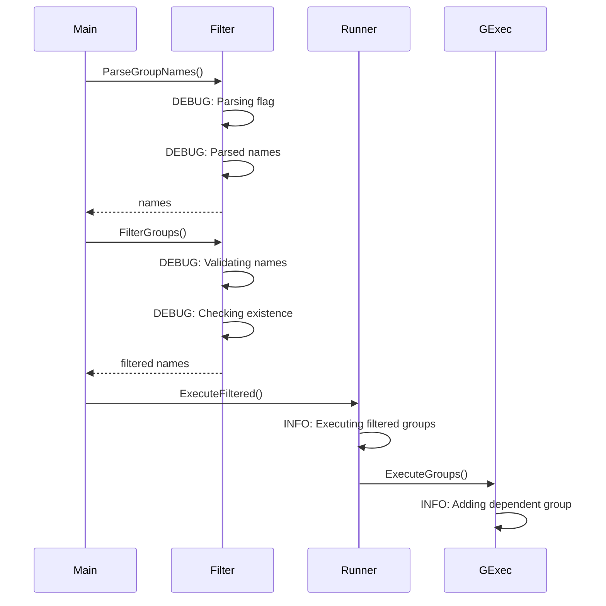

# グループフィルタリング機能 - 詳細仕様書

## 1. 仕様概要

### 1.1 目的

グループフィルタリング機能の詳細な実装仕様を定義し、開発者が実装時に参照できる技術的な詳細を提供する。

### 1.2 適用範囲

- コマンドラインフラグのパース仕様
- グループフィルター関数の詳細仕様
- Runner統合の詳細仕様
- エラーハンドリング仕様
- パフォーマンス要件

## 2. データ型仕様

### 2.1 GroupNamePattern 正規表現

#### 2.1.1 パターン定義

```go
// GroupNamePattern は有効なグループ名のパターンを定義する
// 環境変数名と同じ命名規則: [A-Za-z_][A-Za-z0-9_]*
var GroupNamePattern = regexp.MustCompile(`^[A-Za-z_][A-Za-z0-9_]*$`)
```

#### 2.1.2 パターン仕様

| 要素 | パターン | 説明 |
|------|----------|------|
| 開始文字 | `[A-Za-z_]` | 英字（大文字・小文字）またはアンダースコア |
| 以降の文字 | `[A-Za-z0-9_]*` | 英数字またはアンダースコア（0文字以上） |
| アンカー | `^...$` | 文字列全体にマッチ |

#### 2.1.3 有効な名前の例

| グループ名 | 判定 | 理由 |
|-----------|------|------|
| `build` | ✓ | 英字のみ |
| `test_integration` | ✓ | アンダースコア含む |
| `Deploy_Prod` | ✓ | 大文字含む |
| `_internal` | ✓ | アンダースコアで開始 |
| `group123` | ✓ | 数字含む |

#### 2.1.4 無効な名前の例

| グループ名 | 判定 | 理由 |
|-----------|------|------|
| `123test` | ✗ | 数字で開始 |
| `test-unit` | ✗ | ハイフン含む |
| `build,test` | ✗ | カンマ含む |
| `build test` | ✗ | スペース含む |
| `build.test` | ✗ | ドット含む |
| `` | ✗ | 空文字列 |

## 3. 関数仕様

### 3.1 ParseGroupNames Function

#### 3.1.1 シグネチャ

```go
// ParseGroupNames はコマンドラインフラグからグループ名をパースする
// カンマ区切りの文字列を分割し、空白をトリミングし、空要素を除外する
//
// Parameters:
//   - groupsFlag: --groups フラグの値
//
// Returns:
//   - []string: パースされたグループ名のリスト（空の場合はnil）
//
// Example:
//   ParseGroupNames("build,test")        // => ["build", "test"]
//   ParseGroupNames("build, test")       // => ["build", "test"] (空白除去)
//   ParseGroupNames("build,,test")       // => ["build", "test"] (空要素除外)
//   ParseGroupNames("")                  // => nil
//   ParseGroupNames("  ")                // => nil
func ParseGroupNames(groupsFlag string) []string
```

#### 3.1.2 実装仕様

```go
func ParseGroupNames(groupsFlag string) []string {
    // 空文字列の場合は nil を返す
    if groupsFlag == "" {
        return nil
    }

    // カンマで分割
    parts := strings.Split(groupsFlag, ",")

    // 結果格納用スライス（初期容量を確保して再割り当てを最小化）
    result := make([]string, 0, len(parts))

    // 各要素をトリミングし、空でない要素のみ追加
    for _, part := range parts {
        trimmed := strings.TrimSpace(part)
        if trimmed != "" {
            result = append(result, trimmed)
        }
    }

    // すべて空要素だった場合は nil を返す
    if len(result) == 0 {
        return nil
    }

    return result
}
```

#### 3.1.3 入出力仕様

| 入力 | 出力 | 説明 |
|------|------|------|
| `""` | `nil` | 空文字列 |
| `"  "` | `nil` | 空白のみ |
| `"build"` | `["build"]` | 単一グループ |
| `"build,test"` | `["build", "test"]` | 複数グループ |
| `"build, test"` | `["build", "test"]` | 空白含む |
| `" build , test "` | `["build", "test"]` | 前後空白含む |
| `"build,,test"` | `["build", "test"]` | 空要素含む |
| `"build,  ,test"` | `["build", "test"]` | 空白のみの要素含む |
| `",,"` | `nil` | カンマのみ |

#### 3.1.4 パフォーマンス仕様

| メトリクス | 要件 | 測定条件 |
|------------|------|----------|
| 計算量 | O(n) | n = 入力文字列の長さ |
| メモリ割り当て | 1-2 allocations | 小規模入力（< 100文字） |
| 実行時間 | < 1μs | 10グループ程度 |

#### 3.1.5 副作用

- **スレッドセーフティ**: スレッドセーフ（入力を変更しない）
- **メモリ割り当て**: 新しいスライスと文字列を割り当て

### 3.2 ValidateGroupName Function

#### 3.2.1 シグネチャ

```go
// ValidateGroupName は単一のグループ名が命名規則に適合しているか検証する
//
// Parameters:
//   - name: 検証するグループ名
//
// Returns:
//   - error: 無効な場合はエラー、有効な場合はnil
//
// Errors:
//   - ErrInvalidGroupName: グループ名が命名規則に違反
//
// Example:
//   ValidateGroupName("build")      // => nil
//   ValidateGroupName("123test")    // => error
func ValidateGroupName(name string) error
```

#### 3.2.2 実装仕様

```go
func ValidateGroupName(name string) error {
    if !GroupNamePattern.MatchString(name) {
        return fmt.Errorf("%w: %q must match pattern [A-Za-z_][A-Za-z0-9_]*",
            ErrInvalidGroupName, name)
    }
    return nil
}
```

#### 3.2.3 入出力仕様

| 入力 | 出力 | 説明 |
|------|------|------|
| `"build"` | `nil` | 有効な名前 |
| `"test_integration"` | `nil` | アンダースコア含む有効な名前 |
| `"_internal"` | `nil` | アンダースコアで開始 |
| `"123test"` | `error` | 数字で開始 |
| `"test-unit"` | `error` | ハイフン含む |
| `"build,test"` | `error` | カンマ含む |
| `""` | `error` | 空文字列 |

#### 3.2.4 エラーメッセージ仕様

```
invalid group name: "123test" must match pattern [A-Za-z_][A-Za-z0-9_]*
```

### 3.3 ValidateGroupNames Function

#### 3.3.1 シグネチャ

```go
// ValidateGroupNames は複数のグループ名を検証する
// 最初に見つかった無効な名前でエラーを返す
//
// Parameters:
//   - names: 検証するグループ名のリスト
//
// Returns:
//   - error: いずれかが無効な場合はエラー、すべて有効な場合はnil
//
// Example:
//   ValidateGroupNames([]string{"build", "test"})  // => nil
//   ValidateGroupNames([]string{"build", "123"})   // => error
func ValidateGroupNames(names []string) error
```

#### 3.3.2 実装仕様

```go
func ValidateGroupNames(names []string) error {
    for _, name := range names {
        if err := ValidateGroupName(name); err != nil {
            return err  // 最初のエラーで即座に返す
        }
    }
    return nil
}
```

#### 3.3.3 動作仕様

- **フェイルファスト**: 最初の無効な名前でエラーを返す
- **順序**: スライスの順序で検証
- **空スライス**: 空スライスの場合は `nil` を返す（エラーなし）

#### 3.3.4 パフォーマンス仕様

| メトリクス | 要件 | 説明 |
|------------|------|------|
| 計算量 | O(n×m) | n=グループ数, m=平均グループ名長 |
| 最良ケース | O(1) | 最初のグループが無効 |
| 最悪ケース | O(n×m) | すべて有効 |

### 3.4 CheckGroupsExist Function

#### 3.4.1 シグネチャ

```go
// CheckGroupsExist は指定されたグループ名が設定に存在するか検証する
//
// Parameters:
//   - names: 検証するグループ名のリスト
//   - config: TOML設定
//
// Returns:
//   - error: 存在しないグループがある場合はエラー
//
// Errors:
//   - ErrGroupNotFound: 1つ以上のグループが存在しない
//
// Example:
//   CheckGroupsExist([]string{"build"}, config)  // => nil (存在する場合)
//   CheckGroupsExist([]string{"xyz"}, config)    // => error (存在しない場合)
func CheckGroupsExist(names []string, config *runnertypes.ConfigSpec) error
```

#### 3.4.2 実装仕様

```go
func CheckGroupsExist(names []string, config *runnertypes.ConfigSpec) error {
    // 設定内のグループ名のセットを作成
    existingGroups := make(map[string]bool, len(config.Groups))
    for _, group := range config.Groups {
        existingGroups[group.Name] = true
    }

    // 各指定グループが存在するか確認
    var missing []string
    for _, name := range names {
        if !existingGroups[name] {
            missing = append(missing, name)
        }
    }

    if len(missing) > 0 {
        // 利用可能なグループ名のリストを生成
        available := make([]string, 0, len(config.Groups))
        for _, group := range config.Groups {
            available = append(available, group.Name)
        }

        return fmt.Errorf("%w: group(s) %v specified in --groups do not exist in configuration\nAvailable groups: %v",
            ErrGroupNotFound, missing, available)
    }

    return nil
}
```

#### 3.4.3 入出力仕様

**前提条件**: `config.Groups = [{name: "build"}, {name: "test"}, {name: "deploy"}]`

| 入力 | 出力 | 説明 |
|------|------|------|
| `["build"]` | `nil` | 存在するグループ |
| `["build", "test"]` | `nil` | すべて存在 |
| `["xyz"]` | `error` | 存在しない |
| `["build", "xyz"]` | `error` | 一部存在しない |
| `[]` | `nil` | 空リスト |

#### 3.4.4 エラーメッセージ仕様

```
group not found: group(s) [xyz] specified in --groups do not exist in configuration
Available groups: [build, test, deploy]
```

#### 3.4.5 パフォーマンス仕様

| メトリクス | 要件 | 説明 |
|------------|------|------|
| 計算量 | O(g + n) | g=設定のグループ数, n=指定グループ数 |
| メモリ使用量 | O(g) | グループ名マップ |

### 3.5 FilterGroups Function

#### 3.5.1 シグネチャ

```go
// FilterGroups は指定されたグループ名でフィルタリングを実行する
// names が nil または空の場合は、すべてのグループを返す
//
// Parameters:
//   - names: フィルターするグループ名（nil の場合は全グループ）
//   - config: TOML設定
//
// Returns:
//   - []string: フィルタリングされたグループ名のリスト
//   - error: バリデーションエラー
//
// Errors:
//   - ErrInvalidGroupName: グループ名が命名規則違反
//   - ErrGroupNotFound: グループが存在しない
//
// Example:
//   FilterGroups(nil, config)                      // => 全グループ
//   FilterGroups([]string{"build"}, config)        // => ["build"]
//   FilterGroups([]string{"xyz"}, config)          // => error
func FilterGroups(names []string, config *runnertypes.ConfigSpec) ([]string, error)
```

#### 3.5.2 実装仕様

```go
func FilterGroups(names []string, config *runnertypes.ConfigSpec) ([]string, error) {
    // フラグ未指定の場合は全グループを返す
    if names == nil || len(names) == 0 {
        allGroups := make([]string, len(config.Groups))
        for i, group := range config.Groups {
            allGroups[i] = group.Name
        }
        return allGroups, nil
    }

    // グループ名の形式を検証
    if err := ValidateGroupNames(names); err != nil {
        return nil, err
    }

    // グループの存在を確認
    if err := CheckGroupsExist(names, config); err != nil {
        return nil, err
    }

    return names, nil
}
```

#### 3.5.3 入出力仕様

**前提条件**: `config.Groups = [{name: "build"}, {name: "test"}]`

| 入力 | 出力 | エラー | 説明 |
|------|------|--------|------|
| `nil` | `["build", "test"]` | `nil` | 全グループ |
| `[]` | `["build", "test"]` | `nil` | 全グループ |
| `["build"]` | `["build"]` | `nil` | 単一グループ |
| `["build", "test"]` | `["build", "test"]` | `nil` | 複数グループ |
| `["123test"]` | `nil` | `ErrInvalidGroupName` | 無効な名前 |
| `["xyz"]` | `nil` | `ErrGroupNotFound` | 存在しない |

#### 3.5.4 エラー優先順位

1. **形式検証エラー** (`ErrInvalidGroupName`): 最初に検証
2. **存在確認エラー** (`ErrGroupNotFound`): 次に検証

### 3.6 Runner.ExecuteFiltered Function

#### 3.6.1 シグネチャ

```go
// ExecuteFiltered は指定されたグループのみを実行する（依存関係も含む）
// groupNames が nil または空の場合は全グループを実行（ExecuteAll と同じ動作）
//
// Parameters:
//   - ctx: コンテキスト
//   - groupNames: 実行するグループ名のリスト（nil の場合は全グループ）
//
// Returns:
//   - error: 実行エラー
//
// Example:
//   r.ExecuteFiltered(ctx, nil)                    // => 全グループ実行
//   r.ExecuteFiltered(ctx, []string{"build"})      // => build + 依存グループ
func (r *Runner) ExecuteFiltered(ctx context.Context, groupNames []string) error
```

#### 3.6.2 実装仕様

```go
func (r *Runner) ExecuteFiltered(ctx context.Context, groupNames []string) error {
    // グループ名が指定されていない場合は全グループを実行
    if groupNames == nil || len(groupNames) == 0 {
        return r.ExecuteAll(ctx)
    }

    // 指定されたグループのみを含む設定を作成
    filteredConfig := r.filterConfigGroups(groupNames)

    // フィルタリングされた設定で実行
    // 既存のExecuteAllロジックを使用（依存関係解決を含む）
    return r.executeGroups(ctx, filteredConfig)
}
```

#### 3.6.3 動作仕様

**依存関係の自動解決**:

```toml
[[groups]]
name = "common"

[[groups]]
name = "build"
depends_on = ["common"]

[[groups]]
name = "test"
depends_on = ["build"]
```

| 入力 | 実行されるグループ | 実行順序 |
|------|------------------|----------|
| `nil` | `[common, build, test]` | `common → build → test` |
| `["test"]` | `[common, build, test]` | `common → build → test` |
| `["build"]` | `[common, build]` | `common → build` |
| `["common"]` | `[common]` | `common` |

#### 3.6.4 エラーハンドリング

| エラー発生箇所 | エラー型 | 処理 |
|--------------|----------|------|
| グループ実行エラー | `CommandExecutionError` | 既存のエラーハンドリングに従う |
| 依存関係循環 | `DependencyError` | 既存のエラーハンドリングに従う |

### 3.7 Runner.filterConfigGroups Function (Private)

#### 3.7.1 シグネチャ

```go
// filterConfigGroups は指定されたグループ名のみを含む設定を作成する
// 内部使用のみ（非公開メソッド）
//
// Parameters:
//   - groupNames: フィルターするグループ名
//
// Returns:
//   - *runnertypes.ConfigSpec: フィルタリングされた設定
func (r *Runner) filterConfigGroups(groupNames []string) *runnertypes.ConfigSpec
```

#### 3.7.2 実装仕様

```go
func (r *Runner) filterConfigGroups(groupNames []string) *runnertypes.ConfigSpec {
    // グループ名のセットを作成
    nameSet := make(map[string]bool, len(groupNames))
    for _, name := range groupNames {
        nameSet[name] = true
    }

    // フィルタリングされたグループのみを抽出
    filteredGroups := make([]runnertypes.CommandGroup, 0, len(groupNames))
    for _, group := range r.config.Groups {
        if nameSet[group.Name] {
            filteredGroups = append(filteredGroups, group)
        }
    }

    // 新しい設定を作成（グローバル設定はそのまま、グループのみフィルタリング）
    filteredConfig := *r.config
    filteredConfig.Groups = filteredGroups

    return &filteredConfig
}
```

#### 3.7.3 パフォーマンス仕様

| メトリクス | 要件 | 説明 |
|------------|------|------|
| 計算量 | O(n + g) | n=指定グループ数, g=全グループ数 |
| メモリ使用量 | O(n) | グループ名セット |

## 4. エラー定義仕様

### 4.1 エラー型定義

```go
// internal/runner/cli/filter.go

package cli

import "errors"

var (
    // ErrInvalidGroupName はグループ名が命名規則に違反している場合のエラー
    ErrInvalidGroupName = errors.New("invalid group name")

    // ErrGroupNotFound は指定されたグループが存在しない場合のエラー
    ErrGroupNotFound = errors.New("group not found")
)
```

### 4.2 エラーラッピング仕様

すべてのエラーは `fmt.Errorf` と `%w` を使用してラップする。

```go
return fmt.Errorf("%w: %q must match pattern [A-Za-z_][A-Za-z0-9_]*",
    ErrInvalidGroupName, name)
```

### 4.3 エラー判定

呼び出し側は `errors.Is` を使用してエラー型を判定できる。

```go
if errors.Is(err, cli.ErrInvalidGroupName) {
    // 無効なグループ名の処理
}
```

## 5. コマンドラインインターフェース仕様

### 5.1 フラグ定義

```go
// cmd/runner/main.go

var (
    // 既存フラグ
    configPath    = flag.String("config", "", "path to config file")
    // ...その他のフラグ...

    // 新規フラグ
    groups        = flag.String("groups", "", "comma-separated list of groups to execute (executes all groups if not specified)")
)
```

### 5.2 フラグ仕様

| フラグ | 型 | デフォルト値 | 説明 |
|---------------|--------------|------|
| `--groups` | `string` | `""` | 実行するグループ名（カンマ区切り） |

```go
groups = flag.String("groups", "", "comma-separated list of groups to execute")
```

### 5.3 使用例

```bash
# すべてのグループを実行
runner -config config.toml

# 単一グループを実行
runner -config config.toml --groups=build

# 複数グループを実行
runner -config config.toml --groups=build,test

# 他のフラグとの併用
runner -config config.toml --groups=deploy --dry-run
```

## 6. ログ出力仕様

### 6.1 ログレベル定義

| レベル | 用途 | 実装箇所 |
|--------|------|----------|
| DEBUG | フィルタリング詳細 | `cli/filter.go` |
| INFO | 依存関係追加通知 | `runner/group_executor.go` |
| ERROR | エラー発生時 | `cmd/runner/main.go` |

### 6.2 ログメッセージ仕様

#### 6.2.1 DEBUG レベル

```go
slog.Debug("Parsing --groups flag",
    "input", groupsFlag)

slog.Debug("Parsed group names",
    "names", names,
    "count", len(names))

slog.Debug("Validating group names",
    "names", names)

slog.Debug("All group names are valid")

slog.Debug("Checking group existence",
    "names", names,
    "config_groups", len(config.Groups))

slog.Debug("All groups exist in configuration")

slog.Debug("Filtered groups",
    "groups", filteredNames,
    "count", len(filteredNames))
```

#### 6.2.2 INFO レベル

```go
slog.Info("Adding dependent group to execution list",
    "group", dependentGroupName,
    "required_by", requestingGroupName,
    "run_id", runID)

slog.Info("Executing filtered groups",
    "groups", groupNames,
    "count", len(groupNames),
    "run_id", runID)
```

#### 6.2.3 ERROR レベル

```go
slog.Error("Invalid group name in --groups flag",
    "input", groupsFlag,
    "error", err,
    "run_id", runID)

slog.Error("Group not found in configuration",
    "groups", missing,
    "available", available,
    "run_id", runID)
```

### 6.3 ログ出力タイミング



## 7. パフォーマンス仕様

### 7.1 計算量仕様

| 関数 | 計算量 | 説明 |
|------|--------|------|
| `ParseGroupNames` | O(n) | n = 入力文字列の長さ |
| `ValidateGroupName` | O(m) | m = グループ名の長さ（正規表現マッチング） |
| `ValidateGroupNames` | O(k×m) | k = グループ数, m = 平均グループ名長 |
| `CheckGroupsExist` | O(g + k) | g = 設定のグループ数, k = 指定グループ数 |
| `FilterGroups` | O(g + k×m) | 上記の組み合わせ |
| `filterConfigGroups` | O(k + g) | k = 指定グループ数, g = 全グループ数 |

### 7.2 メモリ使用量仕様

| 処理 | メモリ使用量 | 説明 |
|------|-------------|------|
| `ParseGroupNames` | O(n) | パースされたグループ名スライス |
| `CheckGroupsExist` | O(g) | グループ名マップ |
| `filterConfigGroups` | O(k) | フィルタリング済みグループスライス |

### 7.3 ベンチマーク要件

以下のベンチマークテストを実装し、要件を満たすこと。

```go
// internal/runner/cli/filter_bench_test.go

func BenchmarkParseGroupNames(b *testing.B) {
    input := "group1,group2,group3,group4,group5"
    b.ResetTimer()
    for i := 0; i < b.N; i++ {
        ParseGroupNames(input)
    }
}
// 要件: < 500 ns/op, < 2 allocs/op

func BenchmarkValidateGroupNames(b *testing.B) {
    names := []string{"build", "test", "deploy", "verify", "cleanup"}
    b.ResetTimer()
    for i := 0; i < b.N; i++ {
        ValidateGroupNames(names)
    }
}
// 要件: < 1000 ns/op, 0 allocs/op

func BenchmarkFilterGroups(b *testing.B) {
    config := &runnertypes.ConfigSpec{
        Groups: make([]runnertypes.CommandGroup, 10),
    }
    for i := 0; i < 10; i++ {
        config.Groups[i].Name = fmt.Sprintf("group%d", i)
    }
    names := []string{"group1", "group5", "group9"}

    b.ResetTimer()
    for i := 0; i < b.N; i++ {
        FilterGroups(names, config)
    }
}
// 要件: < 5000 ns/op, < 3 allocs/op
```

## 8. テスト仕様

### 8.1 単体テスト要件

#### 8.1.1 TestParseGroupNames

```go
func TestParseGroupNames(t *testing.T) {
    tests := []struct {
        name     string
        input    string
        expected []string
    }{
        {"empty string", "", nil},
        {"whitespace only", "  ", nil},
        {"single group", "build", []string{"build"}},
        {"multiple groups", "build,test", []string{"build", "test"}},
        {"with spaces", "build, test", []string{"build", "test"}},
        {"with extra spaces", " build , test ", []string{"build", "test"}},
        {"empty elements", "build,,test", []string{"build", "test"}},
        {"whitespace elements", "build,  ,test", []string{"build", "test"}},
        {"commas only", ",,", nil},
    }
    // ...実装...
}
```

#### 8.1.2 TestValidateGroupName

```go
func TestValidateGroupName(t *testing.T) {
    tests := []struct {
        name      string
        groupName string
        wantErr   bool
    }{
        {"valid simple", "build", false},
        {"valid with underscore", "test_integration", false},
        {"valid starting with underscore", "_internal", false},
        {"valid with numbers", "group123", false},
        {"invalid starting with number", "123test", true},
        {"invalid with hyphen", "test-unit", true},
        {"invalid with comma", "build,test", true},
        {"invalid with space", "build test", true},
        {"invalid empty", "", true},
    }
    // ...実装...
}
```

### 8.2 統合テスト要件

#### 8.2.1 TestExecuteFiltered

```go
func TestExecuteFiltered(t *testing.T) {
    tests := []struct {
        name           string
        groupNames     []string
        expectedGroups []string  // 実行されるべきグループ（順序付き）
    }{
        {
            name:           "nil input executes all",
            groupNames:     nil,
            expectedGroups: []string{"common", "build", "test"},
        },
        {
            name:           "empty slice executes all",
            groupNames:     []string{},
            expectedGroups: []string{"common", "build", "test"},
        },
        {
            name:           "single group with dependencies",
            groupNames:     []string{"test"},
            expectedGroups: []string{"common", "build", "test"},
        },
        {
            name:           "single group without dependencies",
            groupNames:     []string{"common"},
            expectedGroups: []string{"common"},
        },
    }
    // ...実装...
}
```

### 8.3 テストカバレッジ要件

| パッケージ | 目標カバレッジ | 測定方法 |
|-----------|--------------|----------|
| `internal/runner/cli` | ≥ 90% | `go test -cover` |
| `internal/runner` (新規コード) | ≥ 85% | `go test -cover` |

## 9. セキュリティ仕様

### 9.1 入力検証要件

| 検証項目 | 検証方法 | 実装箇所 |
|---------|---------|----------|
| グループ名形式 | 正規表現 `[A-Za-z_][A-Za-z0-9_]*` | `ValidateGroupName` |
| グループ存在確認 | 設定ファイルとの照合 | `CheckGroupsExist` |
| 入力長制限 | 暗黙的（メモリ制約） | - |

### 9.2 インジェクション対策

- グループ名は正規表現で厳格に検証
- シェルコマンドへの直接渡しは行わない
- グループ名は内部データ構造の検索キーとしてのみ使用

### 9.3 エラー情報の開示制限

- エラーメッセージに機密情報を含めない
- 利用可能なグループ名のリストは開示OK（設定ファイルの内容）

## 10. 互換性仕様

### 10.1 後方互換性

| 項目 | 互換性 | 説明 |
|------|--------|------|
| フラグ未指定時の動作 | ✓ | 既存動作と完全に同一 |
| 既存のCLIフラグ | ✓ | 影響なし |
| 設定ファイル形式 | ✓ | 変更なし |
| API（内部パッケージ） | △ | `Runner.ExecuteFiltered` 追加（既存APIは変更なし） |

### 10.2 移行パス

既存の使用方法は変更不要。新機能はオプトイン形式。

```bash
# 既存の使用方法（変更不要）
runner -c config.toml

# 新機能を使用する場合
runner -c config.toml --groups=build,test
```
