# Dry-Run モードでのファイル検証機能 - アーキテクチャ設計書

## 1. 概要

### 1.1 目的

本ドキュメントは、dry-run モードでのファイルハッシュ検証機能の高レベルなアーキテクチャ設計を記述する。本機能により、dry-run 実行時にもファイル検証を行い、検証失敗を警告として記録することで、本番実行前のリスク検出を可能にする。

### 1.2 設計原則

1. **Warn-Only Mode**: 検証失敗時もプログラムを継続実行し、結果を記録
2. **既存パターンの活用**: 既存の Resource Manager Pattern と検証ロジックを再利用
3. **最小限の変更**: 通常実行モードの検証動作は変更せず、dry-run モード特有の拡張のみを実装
4. **可視性の向上**: 検証結果を DryRunResult に統合し、既存の出力フォーマッタで表示
5. **副作用の抑制**: dry-run モードでは永続的な副作用を発生させない（従来通り）

### 1.3 スコープ

**対象範囲:**
- dry-run モードでのファイル検証実行（warn-only モード）
- 検証結果の記録と DryRunResult への統合
- TEXT/JSON フォーマッタでの検証結果表示
- **読み取り専用検証**: ファイル検証は読み取り専用操作であり、永続的な副作用を発生させない

**対象外:**
- 通常実行モードの変更（既存の厳格な検証を維持）
- 新規コマンドライン引数の追加
- 複数の検証モード（warn-only のみを実装）
- **ファイルシステムへの書き込み**: dry-run モードではハッシュファイルの作成・更新を行わない
- **ネットワーク通信**: dry-run モードでは Slack 通知等を送信しない（従来通り）

## 2. システムアーキテクチャ

### 2.1 全体構成

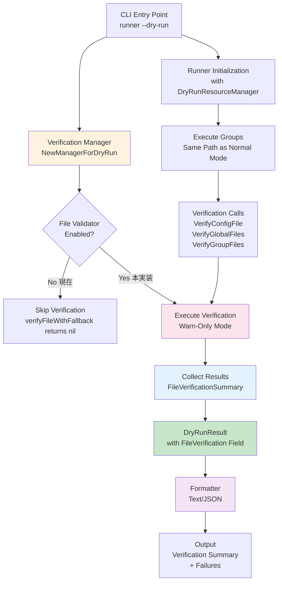

**主要コンポーネント:**

1. **Verification Manager**: ファイル検証の中核ロジック（既存）
2. **File Validator**: ハッシュ検証の実行（既存、dry-run で有効化）
3. **Result Collector**: 検証結果の収集（新規）
4. **DryRunResult**: dry-run 結果の統合データ構造（拡張）
5. **Formatter**: 検証結果の表示（拡張）

### 2.2 コンポーネント間の関係

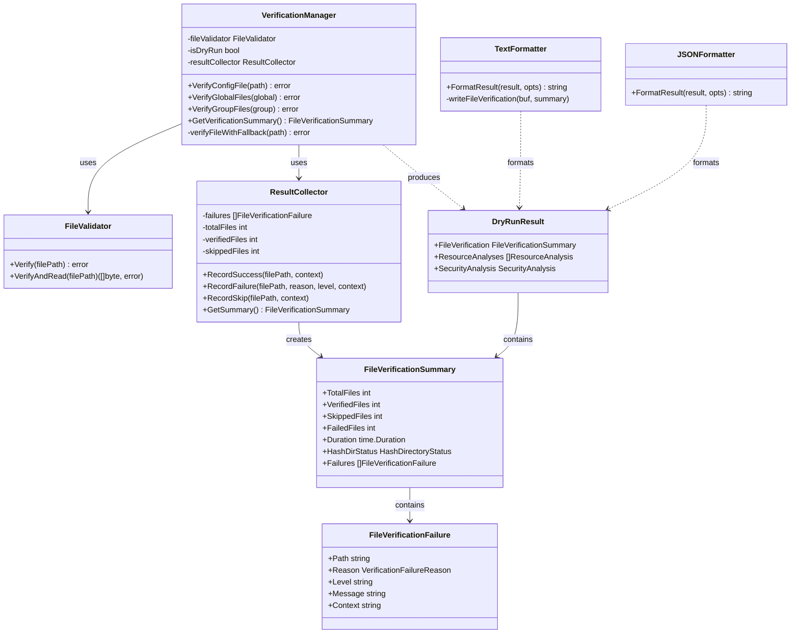

### 2.3 検証モードの比較

| 項目 | 通常実行モード | Dry-Run モード（現在） | Dry-Run モード（本実装） |
|------|--------------|---------------------|---------------------|
| File Validator | 有効 | **無効** | **有効（warn-only）** |
| 検証失敗時の動作 | プログラム終了 | - | **継続実行** |
| 検証結果の記録 | なし | - | **ResultCollector** |
| ログ出力 | ERROR（終了） | - | **WARN/ERROR（継続）** |
| 出力フォーマット | - | - | **TEXT/JSON に追加** |

## 3. 検証フロー設計

### 3.1 検証実行フロー

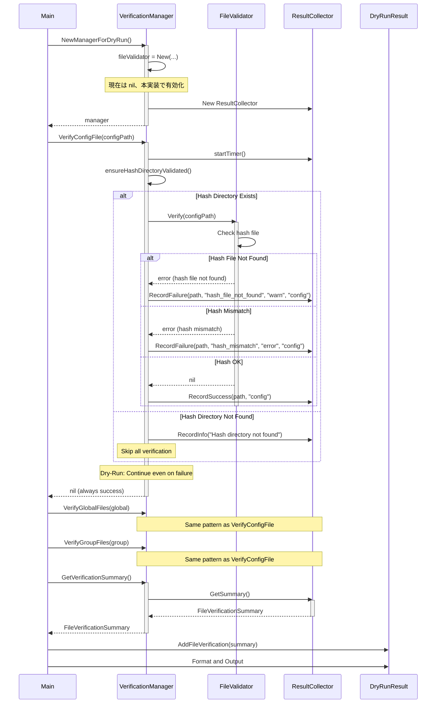

### 3.2 検証失敗時の処理フロー

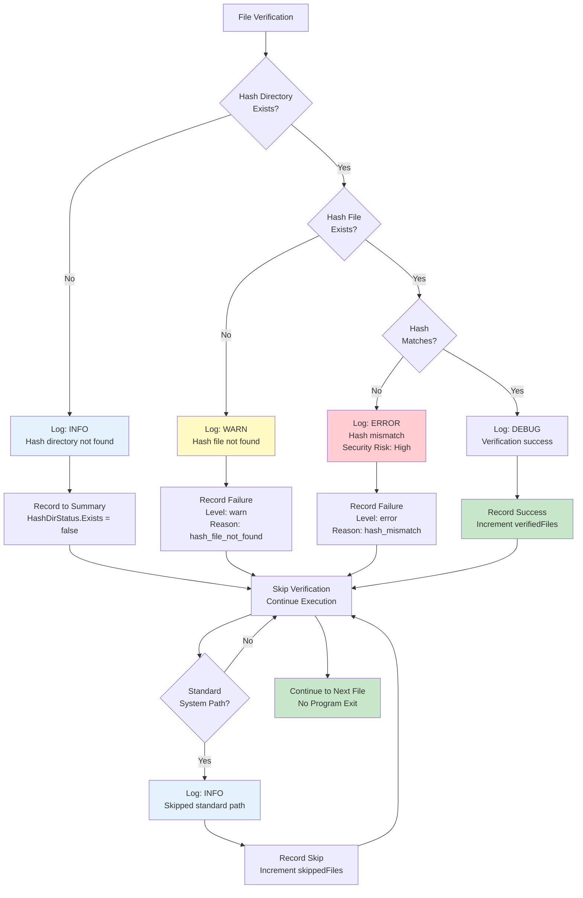

### 3.3 通常実行モードとの動作比較

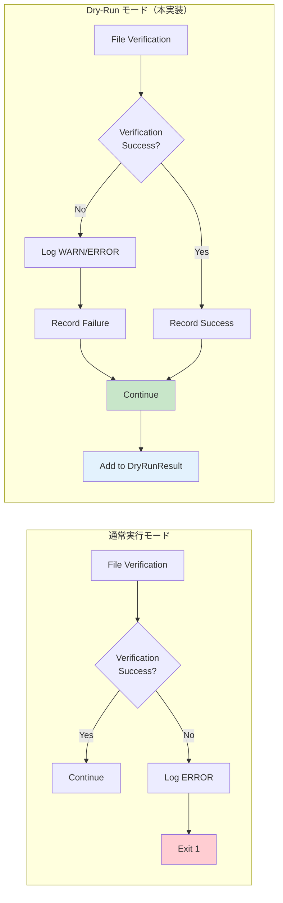

## 4. 副作用抑制の設計（従来要件の確認）

### 4.1 Dry-Run モードの副作用抑制原則

**重要**: dry-run モードでは、従来通り永続的な副作用を発生させない。本機能追加（ファイル検証の有効化）も、この原則に従う。

#### 4.1.1 副作用の分類

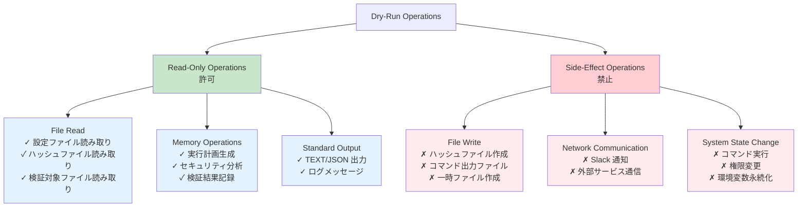

#### 4.1.2 ファイル検証の副作用分析

**本機能追加で実施する操作:**

| 操作 | 分類 | 副作用 | 説明 |
|------|-----|--------|------|
| ハッシュディレクトリの確認 | Read-Only | なし | ディレクトリの存在確認のみ |
| ハッシュファイルの読み取り | Read-Only | なし | ファイル内容を読み取るのみ |
| 検証対象ファイルの読み取り | Read-Only | なし | SHA-256 計算のため読み取るのみ |
| ハッシュ値の計算 | Memory | なし | メモリ内でハッシュ計算 |
| 検証結果の記録 | Memory | なし | `ResultCollector` への記録（メモリ内） |
| ログ出力 | Standard Output | なし | 標準出力/標準エラー出力のみ |

**実施しない操作:**

| 操作 | 理由 |
|------|------|
| ハッシュファイルの作成・更新 | 永続的な副作用（ファイル書き込み） |
| 検証失敗によるプログラム終了 | dry-run の基本動作（継続実行） |
| 検証結果のファイル保存 | 永続的な副作用（要件外） |

### 4.2 副作用抑制の実装保証

#### 4.2.1 実装レベルの保証

```go
// verifyFileWithFallback の実装（疑似コード）
func (m *Manager) verifyFileWithFallback(filePath string, context string) error {
    if m.fileValidator == nil {
        // Hash directory not found - read-only check, no side effect
        if m.isDryRun && m.resultCollector != nil {
            m.resultCollector.RecordSkip(filePath, context, "hash_directory_not_found")
        }
        return nil  // No file creation, no network communication
    }

    // Execute verification - READ-ONLY operation
    err := m.fileValidator.Verify(filePath)
    // Verify reads:
    //   1. Hash file (read-only)
    //   2. Target file (read-only, for SHA-256 calculation)
    // No writes, no network communication

    if m.isDryRun && m.resultCollector != nil {
        if err != nil {
            // Record failure in MEMORY (ResultCollector)
            m.resultCollector.RecordFailure(filePath, err, context)
            // Log to STANDARD ERROR (no file write)
            logVerificationFailure(...)
        } else {
            // Record success in MEMORY
            m.resultCollector.RecordSuccess(filePath, context)
        }
        return nil  // Continue execution, no program exit
    }

    // Normal mode: strict mode (may exit on error)
    return err
}
```

#### 4.2.2 テストによる検証

**副作用不在のテスト:**

```go
// TestDryRunNoSideEffects verifies that dry-run mode has no side effects
func TestDryRunNoSideEffects(t *testing.T) {
    // Setup: Monitor filesystem and network
    fileMonitor := NewFileSystemMonitor()
    networkMonitor := NewNetworkMonitor()

    // Execute dry-run with file verification
    result, err := RunDryRunWithVerification(config)

    // Verify: No file writes
    assert.Empty(t, fileMonitor.GetFileWrites(),
        "Dry-run should not write any files")

    // Verify: No network communication
    assert.Empty(t, networkMonitor.GetNetworkRequests(),
        "Dry-run should not send any network requests")

    // Verify: Exit code is 0 (even with verification failures)
    assert.Equal(t, 0, result.ExitCode,
        "Dry-run should always exit with code 0")

    // Verify: Verification results are in memory
    assert.NotNil(t, result.FileVerification,
        "Verification results should be in DryRunResult")
}
```

### 4.3 Resource Manager Pattern との整合性

dry-run モードでの副作用抑制は、既存の Resource Manager Pattern と一貫している：

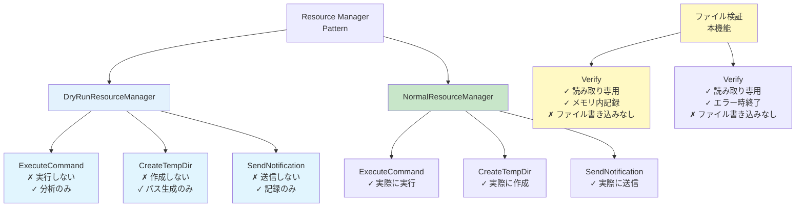

**重要な一貫性:**
- **コマンド実行**: 両モードで実行しない（分析のみ）
- **一時ファイル**: 両モードで作成しない
- **Slack 通知**: 両モードで送信しない
- **ファイル検証**: **両モードで読み取り専用**（本機能追加でも変更なし）

## 5. データフロー設計

### 5.1 検証結果の集約

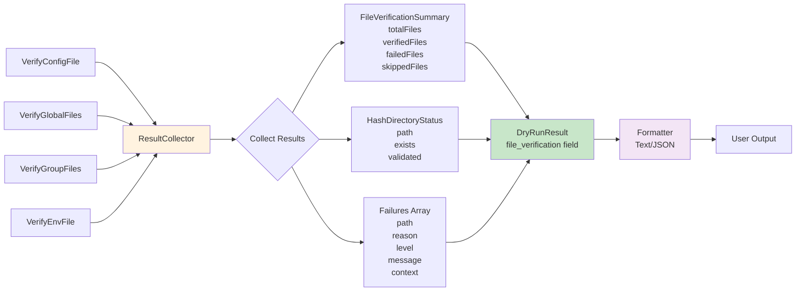

### 5.2 検証コンテキストの伝播

各検証呼び出し元から、検証失敗時の文脈情報を伝播する：

| 検証メソッド | Context Value | 説明 |
|------------|--------------|------|
| `VerifyConfigFile` | `"config"` | 設定ファイル自体の検証 |
| `VerifyGlobalFiles` | `"global"` | グローバル検証ファイル |
| `VerifyGroupFiles` | `"group:<name>"` | 特定グループの検証ファイル |
| `VerifyEnvFile` | `"env"` | 環境変数ファイルの検証 |

この文脈情報により、ユーザーはどの段階で検証が失敗したかを理解できる。

## 6. 拡張ポイント設計

### 6.1 Verification Manager の拡張

**現在の実装:**
```go
func (m *Manager) verifyFileWithFallback(filePath string) error {
    if m.fileValidator == nil {
        // File validator is disabled (e.g., in dry-run mode) - skip verification
        return nil
    }
    return m.fileValidator.Verify(filePath)
}
```

**拡張後の実装:**
```go
func (m *Manager) verifyFileWithFallback(filePath string, context string) error {
    if m.fileValidator == nil {
        // Development environment without hash directory
        return nil
    }

    err := m.fileValidator.Verify(filePath)

    if m.isDryRun {
        // Warn-only mode: record result and continue
        if err != nil {
            m.resultCollector.RecordFailure(filePath, err, context)
        } else {
            m.resultCollector.RecordSuccess(filePath, context)
        }
        return nil  // Always return nil in dry-run
    }

    // Normal mode: return error (strict mode)
    return err
}
```

### 6.2 DryRunResult の拡張

**現在の構造:**
```go
type DryRunResult struct {
    Metadata         *ResultMetadata       `json:"metadata"`
    Status           ExecutionStatus       `json:"status"`
    Phase            ExecutionPhase        `json:"phase"`
    Error            *ExecutionError       `json:"error,omitempty"`
    Summary          *ExecutionSummary     `json:"summary"`
    ResourceAnalyses []ResourceAnalysis    `json:"resource_analyses"`
    SecurityAnalysis *SecurityAnalysis     `json:"security_analysis"`
    EnvironmentInfo  *EnvironmentInfo      `json:"environment_info"`
    Errors           []DryRunError         `json:"errors"`
    Warnings         []DryRunWarning       `json:"warnings"`
}
```

**拡張後の構造:**
```go
type DryRunResult struct {
    // ... existing fields ...
    FileVerification *FileVerificationSummary `json:"file_verification,omitempty"`  // 新規追加
}
```

**ExecutionStatus の変更:**

ファイル検証失敗を適切に表現するため、`ExecutionStatus` 型を整理：

**現在の定義:**
```go
type ExecutionStatus string

const (
    StatusSuccess ExecutionStatus = "success"
    StatusError   ExecutionStatus = "error"
    StatusPartial ExecutionStatus = "partial"  // 未使用のため削除
)
```

**変更後の定義:**
```go
type ExecutionStatus string

const (
    StatusSuccess ExecutionStatus = "success"
    StatusError   ExecutionStatus = "error"
)
```

**ステータス設定ロジック:**
- ファイル検証失敗がある場合: `StatusError`（ただし exit code は 0）
- 全ての検証が成功した場合: `StatusSuccess`
- dry-run 処理自体の致命的エラー: `StatusError`（exit code は 1）

**設計判断の根拠:**
- ファイル検証失敗（特にハッシュ不一致）はセキュリティ上重大な問題
- `status: "error"` により JSON パーサーが適切に警告を表示可能
- exit code 0 は維持（dry-run は診断ツールとして動作）
- `StatusPartial` は使用されていないため削除

### 6.3 Formatter の拡張

**Text Formatter:**
```go
func (f *TextFormatter) FormatResult(result *DryRunResult, opts FormatterOptions) (string, error) {
    // ... existing sections ...

    // 新規追加: File Verification セクション
    if result.FileVerification != nil {
        f.writeFileVerification(&buf, result.FileVerification)
    }

    // ... existing sections ...
}
```

**JSON Formatter:**
- `DryRunResult` の JSON シリアライゼーションで自動的に `file_verification` フィールドが含まれる
- 追加の実装は不要

## 7. エラー処理設計

### 7.1 検証失敗の分類

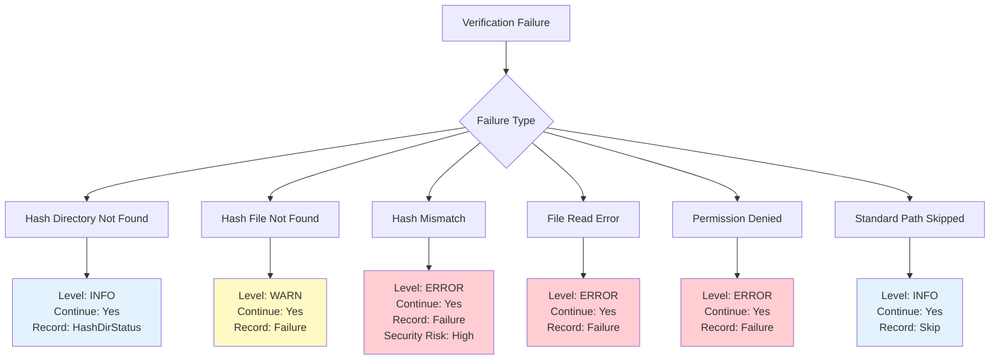

### 7.2 ログレベルの決定基準

| 失敗理由 | ログレベル | 根拠 |
|---------|----------|------|
| Hash Directory Not Found | INFO | 開発環境では正常な状態 |
| Hash File Not Found | WARN | 本番環境では設定ミスの可能性（セキュリティリスクは中） |
| Hash Mismatch | ERROR | ファイル改ざんの可能性（セキュリティリスクは高） |
| File Read Error | ERROR | システムの問題（本番実行で確実に失敗） |
| Standard Path Skipped | INFO | 意図的なスキップ |

## 8. セキュリティ設計

### 8.1 センシティブ情報の扱い

検証結果にセンシティブ情報が含まれる可能性を考慮：

1. **ファイルパス**: 検証失敗時に記録するが、`--show-sensitive` フラグに従ってマスク
2. **ハッシュ値**: ERROR レベルのログで expected/actual を出力するが、詳細は制限
3. **エラーメッセージ**: システム内部情報の漏洩を防ぐため、汎用的なメッセージを使用

### 7.2 検証バイパスの防止

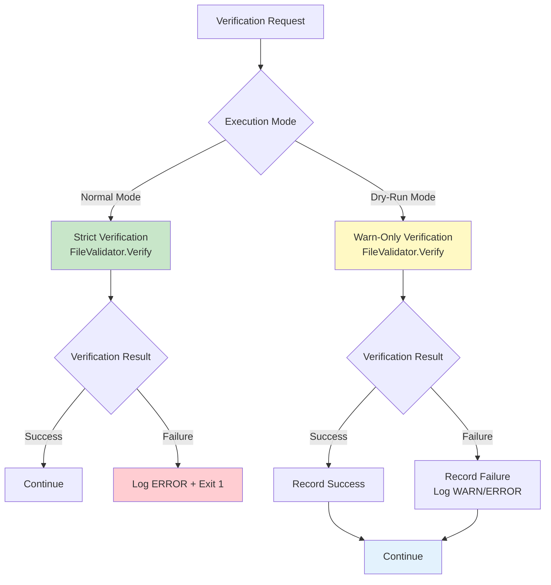

**重要な原則:**
- **通常実行モードでは検証をバイパスしない**: dry-run モードの拡張は、通常実行モードのセキュリティを低下させない
- **File Validator は同一のロジックを使用**: dry-run と通常モードで検証ロジックを共有し、整合性を保証

## 9. パフォーマンス設計

### 9.1 検証の並列化

既存の実装では、ファイル検証は順次実行されるが、将来的に並列化を検討する場合の設計：

```go
// Future optimization (not in scope for this task)
func (m *Manager) VerifyGlobalFilesParallel(runtimeGlobal *runnertypes.RuntimeGlobal) (*Result, error) {
    var wg sync.WaitGroup
    resultChan := make(chan verificationResult, len(runtimeGlobal.ExpandedVerifyFiles))

    for _, filePath := range runtimeGlobal.ExpandedVerifyFiles {
        wg.Add(1)
        go func(path string) {
            defer wg.Done()
            err := m.verifyFileWithFallback(path, "global")
            resultChan <- verificationResult{path: path, err: err}
        }(filePath)
    }

    // ... collect results ...
}
```

現時点では並列化を実装しないが、`ResultCollector` は並行アクセスに対応した設計とする（mutex を使用）。

### 9.2 検証コストの最小化

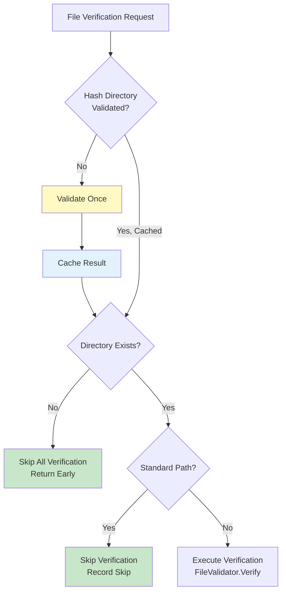

**最適化ポイント:**
1. **Hash Directory 検証のキャッシュ**: 初回のみ検証し、結果をキャッシュ
2. **早期リターン**: Hash Directory が存在しない場合、全検証をスキップ
3. **Standard Path のスキップ**: `/bin`, `/usr/bin` 等の標準パスは検証をスキップ

## 10. テスト戦略

### 10.1 テストレベル

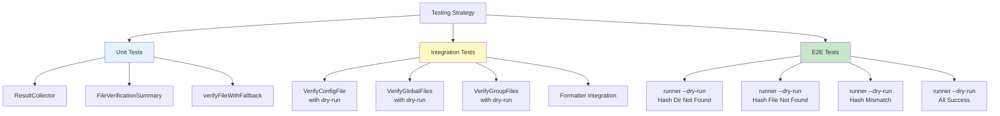

### 9.2 主要テストケース

| レベル | テストケース | 検証内容 |
|--------|------------|---------|
| **Unit** | ResultCollector.RecordFailure | 失敗記録の正確性 |
| **Unit** | ResultCollector.GetSummary | サマリー計算の正確性 |
| **Integration** | VerifyConfigFile (dry-run, hash not found) | WARN ログ + 継続実行 |
| **Integration** | VerifyGlobalFiles (dry-run, hash mismatch) | ERROR ログ + 継続実行 |
| **Integration** | TextFormatter with FileVerification | TEXT 出力の正確性 |
| **Integration** | JSONFormatter with FileVerification | JSON 出力の正確性 |
| **E2E** | runner --dry-run (no hash dir) | INFO ログ + exit 0 |
| **E2E** | runner --dry-run (hash file not found) | WARN ログ + exit 0 + JSON 出力 |
| **E2E** | runner --dry-run (hash mismatch) | ERROR ログ + exit 0 + verification section |

## 11. 段階的実装計画

### 11.1 実装フェーズ

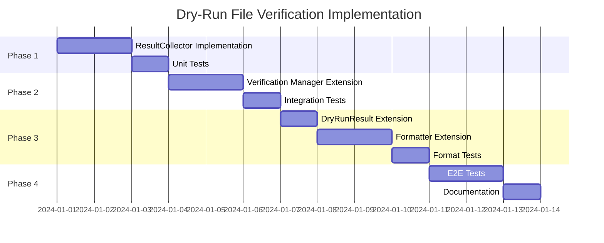

### 10.2 フェーズ詳細

**Phase 1: Result Collector Implementation**
- `ResultCollector` 構造体の実装
- `RecordSuccess`, `RecordFailure`, `RecordSkip` メソッド
- `GetSummary` メソッド
- ユニットテスト

**Phase 2: Verification Manager Extension**
- `Manager` 構造体に `resultCollector` フィールドを追加
- `NewManagerForDryRun` で `ResultCollector` を初期化
- `verifyFileWithFallback` を拡張（context パラメータ追加、warn-only モード実装）
- `GetVerificationSummary` メソッドの追加
- 統合テスト

**Phase 3: DryRunResult and Formatter Extension**
- `DryRunResult` に `FileVerification` フィールドを追加
- `TextFormatter.writeFileVerification` メソッドの実装
- JSON 出力の検証
- フォーマッタテスト

**Phase 4: E2E Testing and Documentation**
- E2E テストの実装（各検証失敗パターン）
- ドキュメント更新
- パフォーマンステスト

## 12. 今後の拡張可能性

### 12.1 将来的な機能拡張

1. **並列検証**: 大量ファイルの並列検証によるパフォーマンス向上
2. **検証モード選択**: `--verify-mode=disabled|warn|strict` のような明示的な制御
3. **検証結果のエクスポート**: 検証結果を別ファイルに保存（監査ログ）
4. **差分検証**: 前回の検証結果との差分表示

### 12.2 拡張時の考慮事項

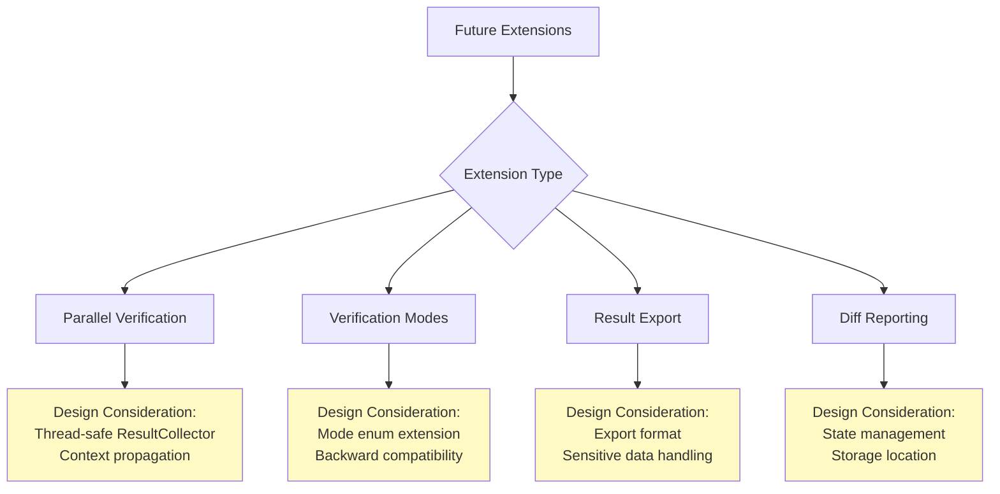

## 13. まとめ

### 13.1 アーキテクチャの特徴

1. **既存パターンとの調和**: Resource Manager Pattern と同様の設計原則を踏襲
2. **最小限の侵襲性**: 通常実行モードには影響を与えず、dry-run モードのみを拡張
3. **可視性の向上**: 検証結果を DryRunResult に統合し、既存の出力インフラを活用
4. **段階的実装**: フェーズ分けにより、リスクを最小化しながら実装

### 13.2 成功基準

- [ ] dry-run モードでファイル検証が実行される
- [ ] 検証失敗時も dry-run は継続実行される（exit 0）
- [ ] 検証結果が DryRunResult に記録される
- [ ] TEXT/JSON フォーマットで検証結果が適切に表示される
- [ ] 通常実行モードの動作は変更されない
- [ ] 既存の dry-run テストが全て成功する
