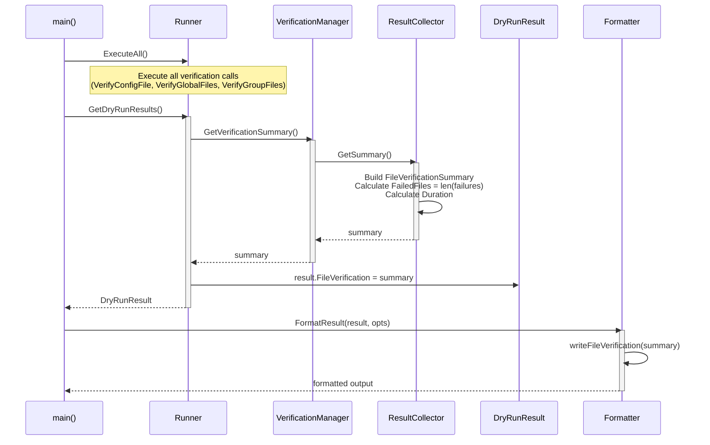

# Dry-Run モードでのファイル検証機能 - 詳細仕様書

## 1. 副作用抑制の仕様（重要な前提条件）

### 1.1 Dry-Run モードの副作用抑制原則

**重要**: dry-run モードでは、従来通り永続的な副作用を発生させない。本機能追加（ファイル検証の有効化）は、この原則を遵守する**読み取り専用操作**である。

#### 1.1.1 禁止される副作用

dry-run モードでは、以下の副作用は**発生しない**（従来通り）：

| 副作用の種類 | 具体例 | 本機能での扱い |
|------------|--------|--------------|
| ファイル書き込み | ハッシュファイル作成・更新 | **実施しない**（検証のみ） |
| ファイル書き込み | コマンド出力ファイル生成 | **実施しない**（従来通り） |
| ファイル書き込み | 一時ファイル作成 | **実施しない**（従来通り） |
| ネットワーク通信 | Slack 通知送信 | **実施しない**（従来通り） |
| ネットワーク通信 | 外部サービスへの通信 | **実施しない**（従来通り） |
| コマンド実行 | 実際のプロセス起動 | **実施しない**（従来通り） |
| システム状態変更 | 権限変更 | **実施しない**（従来通り） |

#### 1.1.2 許可される操作（読み取り専用）

dry-run モードで**許可される**読み取り専用操作：

| 操作の種類 | 具体例 | 本機能での実施内容 |
|----------|--------|------------------|
| ファイル読み取り | 設定ファイル読み取り | ✓ 実施（従来通り） |
| ファイル読み取り | ハッシュファイル読み取り | ✓ **本機能で追加**（読み取りのみ、書き込みなし） |
| ファイル読み取り | 検証対象ファイル読み取り | ✓ **本機能で追加**（SHA-256 計算のため） |
| メモリ内処理 | 実行計画生成 | ✓ 実施（従来通り） |
| メモリ内処理 | セキュリティ分析 | ✓ 実施（従来通り） |
| メモリ内処理 | 検証結果記録 | ✓ **本機能で追加**（`ResultCollector` へのメモリ内記録） |
| 標準出力 | TEXT/JSON 出力 | ✓ 実施（従来通り） |
| 標準出力 | ログメッセージ | ✓ 実施（従来通り、ERROR/WARN レベル含む） |

#### 1.1.3 ファイル検証の副作用分析

**本機能で実施する操作の詳細:**

```go
// FileValidator.Verify の動作（疑似コード）
func (v *Validator) Verify(filePath string) error {
    // 1. ハッシュファイルパスの生成（メモリ内操作）
    hashFilePath := v.getHashFilePath(filePath)

    // 2. ハッシュファイルの読み取り（READ-ONLY、副作用なし）
    expectedHash, err := safefileio.SafeReadFile(hashFilePath)
    if err != nil {
        return ErrHashFileNotExist  // 読み取り専用、エラー返却のみ
    }

    // 3. 検証対象ファイルの読み取り（READ-ONLY、副作用なし）
    fileContent, err := safefileio.SafeReadFile(filePath)
    if err != nil {
        return ErrFileReadError  // 読み取り専用、エラー返却のみ
    }

    // 4. ハッシュ計算（メモリ内操作、副作用なし）
    actualHash := v.algorithm.Calculate(fileContent)

    // 5. ハッシュ比較（メモリ内操作、副作用なし）
    if !bytes.Equal(expectedHash, actualHash) {
        return ErrHashMismatch  // メモリ内比較のみ
    }

    return nil  // 検証成功

    // 注: ファイル書き込み、ネットワーク通信、コマンド実行は一切行わない
}
```

**副作用の不在を保証する設計:**

1. **`FileValidator.Verify` は読み取り専用**: ハッシュファイルと検証対象ファイルを読み取るのみ
2. **`ResultCollector` はメモリ内記録**: 検証結果は構造体フィールドに記録（ファイル保存なし）
3. **ログ出力は標準出力/エラー出力**: ファイルへの書き込みなし
4. **検証失敗時も継続実行**: プログラム終了なし、メモリ内記録のみ

### 1.2 副作用抑制のテスト要件

**必須テストケース:**

| テストケース | 検証内容 |
|------------|---------|
| `TestDryRunNoFileWrites` | dry-run 実行後、ファイルシステムに書き込みが発生していないことを確認 |
| `TestDryRunNoNetworkCommunication` | dry-run 実行後、ネットワーク通信が発生していないことを確認 |
| `TestDryRunExitCode` | 検証失敗があっても exit code が 0 であることを確認 |
| `TestDryRunVerificationInMemory` | 検証結果が `DryRunResult` 構造体にのみ記録されることを確認 |

## 2. データ構造仕様

### 2.1 FileVerificationSummary

検証結果のサマリー情報を保持する構造体。

```go
// FileVerificationSummary represents the summary of file verification in dry-run mode
type FileVerificationSummary struct {
    TotalFiles    int                        `json:"total_files"`
    VerifiedFiles int                        `json:"verified_files"`
    SkippedFiles  int                        `json:"skipped_files"`
    FailedFiles   int                        `json:"failed_files"`
    Duration      time.Duration              `json:"duration"`
    HashDirStatus HashDirectoryStatus        `json:"hash_dir_status"`
    Failures      []FileVerificationFailure  `json:"failures,omitempty"`
}
```

**フィールド仕様:**

| フィールド | 型 | 説明 | 初期値 |
|----------|---|------|-------|
| `TotalFiles` | `int` | 検証対象ファイルの総数 | 0 |
| `VerifiedFiles` | `int` | 検証成功したファイル数 | 0 |
| `SkippedFiles` | `int` | スキップされたファイル数（標準パス等） | 0 |
| `FailedFiles` | `int` | 検証失敗したファイル数 | 0 |
| `Duration` | `time.Duration` | 検証処理の所要時間 | 0 |
| `HashDirStatus` | `HashDirectoryStatus` | ハッシュディレクトリの状態 | - |
| `Failures` | `[]FileVerificationFailure` | 検証失敗の詳細リスト | nil |

**不変条件（Invariants）:**
- `TotalFiles = VerifiedFiles + SkippedFiles + FailedFiles`
- `FailedFiles = len(Failures)`
- `Duration >= 0`

### 2.2 HashDirectoryStatus

ハッシュディレクトリの状態を表す構造体。

```go
// HashDirectoryStatus represents the status of the hash directory
type HashDirectoryStatus struct {
    Path      string `json:"path"`
    Exists    bool   `json:"exists"`
    Validated bool   `json:"validated"`
}
```

**フィールド仕様:**

| フィールド | 型 | 説明 |
|----------|---|------|
| `Path` | `string` | ハッシュディレクトリのパス（通常 `/etc/runner/hashes`） |
| `Exists` | `bool` | ディレクトリが存在するか |
| `Validated` | `bool` | ディレクトリの検証が完了したか |

**状態遷移:**

```mermaid
stateDiagram-v2
    [*] --> NotValidated: Path Set
    NotValidated --> Exists: Validation Success
    NotValidated --> NotExists: Directory Not Found
    Exists --> [*]: Verification Proceeds
    NotExists --> [*]: Skip All Verification

    state NotValidated {
        Validated = false
        Exists = false (default)
    }

    state Exists {
        Validated = true
        Exists = true
    }

    state NotExists {
        Validated = true
        Exists = false
    }
```

### 2.3 FileVerificationFailure

個別ファイルの検証失敗情報を保持する構造体。

```go
// FileVerificationFailure represents a single file verification failure
type FileVerificationFailure struct {
    Path    string                    `json:"path"`
    Reason  VerificationFailureReason `json:"reason"`
    Level   string                    `json:"level"`
    Message string                    `json:"message"`
    Context string                    `json:"context"`
}
```

**フィールド仕様:**

| フィールド | 型 | 説明 | 制約 |
|----------|---|------|------|
| `Path` | `string` | 検証失敗したファイルのパス | 絶対パス |
| `Reason` | `VerificationFailureReason` | 失敗理由の分類 | 定義済み列挙値 |
| `Level` | `string` | ログレベル | `"info"`, `"warn"`, `"error"` |
| `Message` | `string` | 人間可読なエラーメッセージ | 非空 |
| `Context` | `string` | 検証コンテキスト | `"config"`, `"global"`, `"group:<name>"`, `"env"` |

### 2.4 VerificationFailureReason

検証失敗理由を表す列挙型。

```go
// VerificationFailureReason represents the reason for verification failure
type VerificationFailureReason string

const (
    ReasonHashDirNotFound     VerificationFailureReason = "hash_directory_not_found"
    ReasonHashFileNotFound    VerificationFailureReason = "hash_file_not_found"
    ReasonHashMismatch        VerificationFailureReason = "hash_mismatch"
    ReasonFileReadError       VerificationFailureReason = "file_read_error"
    ReasonPermissionDenied    VerificationFailureReason = "permission_denied"
    ReasonStandardPathSkipped VerificationFailureReason = "standard_path_skipped"
)
```

**列挙値とログレベルの対応:**

| 理由 | ログレベル | 説明 |
|------|----------|------|
| `ReasonHashDirNotFound` | `INFO` | ハッシュディレクトリが存在しない（開発環境で正常） |
| `ReasonHashFileNotFound` | `WARN` | 特定ファイルのハッシュファイルが存在しない |
| `ReasonHashMismatch` | `ERROR` | ハッシュ値が一致しない（改ざんの可能性） |
| `ReasonFileReadError` | `ERROR` | ファイル読み込みに失敗 |
| `ReasonPermissionDenied` | `ERROR` | 権限不足でファイルにアクセスできない |
| `ReasonStandardPathSkipped` | `INFO` | 標準システムパスのためスキップ |

## 3. コンポーネント仕様

### 3.1 ResultCollector

検証結果を収集し、サマリーを生成するコンポーネント。

**副作用**: なし（メモリ内操作のみ）

#### 3.1.1 構造体定義

```go
// ResultCollector collects file verification results in dry-run mode
type ResultCollector struct {
    mu            sync.Mutex
    startTime     time.Time
    totalFiles    int
    verifiedFiles int
    skippedFiles  int
    failures      []FileVerificationFailure
    hashDirStatus HashDirectoryStatus
}
```

#### 3.1.2 コンストラクタ

```go
// NewResultCollector creates a new ResultCollector
func NewResultCollector(hashDirPath string) *ResultCollector {
    return &ResultCollector{
        startTime: time.Now(),
        hashDirStatus: HashDirectoryStatus{
            Path:      hashDirPath,
            Exists:    false,
            Validated: false,
        },
        failures: make([]FileVerificationFailure, 0),
    }
}
```

#### 2.1.3 メソッド仕様

**RecordSuccess**

```go
// RecordSuccess records a successful file verification
func (rc *ResultCollector) RecordSuccess(filePath, context string)
```

**動作:**
1. `mu` でロック
2. `totalFiles++`
3. `verifiedFiles++`
4. アンロック

**スレッドセーフティ:** `sync.Mutex` により並行アクセスに対応

---

**RecordFailure**

```go
// RecordFailure records a file verification failure
func (rc *ResultCollector) RecordFailure(filePath string, err error, context string)
```

**動作:**
1. `mu` でロック
2. `totalFiles++`
3. エラーを解析して `VerificationFailureReason` を決定
4. ログレベルを決定（reason に基づく）
5. `FileVerificationFailure` を作成
6. `failures` に追加
7. アンロック

**エラー解析ロジック:**

```go
func determineFailureReason(err error) VerificationFailureReason {
    if errors.Is(err, filevalidator.ErrHashDirNotExist) {
        return ReasonHashDirNotFound
    }
    if errors.Is(err, filevalidator.ErrHashFileNotExist) {
        return ReasonHashFileNotFound
    }
    if errors.Is(err, filevalidator.ErrHashMismatch) {
        return ReasonHashMismatch
    }
    if errors.Is(err, os.ErrPermission) {
        return ReasonPermissionDenied
    }
    return ReasonFileReadError
}

func determineLogLevel(reason VerificationFailureReason) string {
    switch reason {
    case ReasonHashDirNotFound, ReasonStandardPathSkipped:
        return "info"
    case ReasonHashFileNotFound:
        return "warn"
    default:
        return "error"
    }
}
```

---

**RecordSkip**

```go
// RecordSkip records a skipped file (e.g., standard system path)
func (rc *ResultCollector) RecordSkip(filePath, context, reason string)
```

**動作:**
1. `mu` でロック
2. `totalFiles++`
3. `skippedFiles++`
4. オプション: スキップ理由を `failures` に INFO レベルで記録
5. アンロック

---

**SetHashDirStatus**

```go
// SetHashDirStatus sets the hash directory validation status
func (rc *ResultCollector) SetHashDirStatus(exists, validated bool)
```

**動作:**
1. `mu` でロック
2. `hashDirStatus.Exists = exists`
3. `hashDirStatus.Validated = validated`
4. アンロック

---

**GetSummary**

```go
// GetSummary returns the file verification summary
func (rc *ResultCollector) GetSummary() FileVerificationSummary
```

**動作:**
1. `mu` でロック
2. サマリーを構築:
   ```go
   summary := FileVerificationSummary{
       TotalFiles:    rc.totalFiles,
       VerifiedFiles: rc.verifiedFiles,
       SkippedFiles:  rc.skippedFiles,
       FailedFiles:   len(rc.failures),
       Duration:      time.Since(rc.startTime),
       HashDirStatus: rc.hashDirStatus,
       Failures:      rc.failures,
   }
   ```
3. アンロック
4. `summary` を返す

**不変条件の検証:**
- `GetSummary` 呼び出し時に不変条件をアサート（開発ビルドのみ）

### 3.2 Verification Manager の拡張

**副作用**: なし（読み取り専用検証とメモリ内記録のみ）

#### 3.2.1 構造体の拡張

```go
// Manager provides file verification capabilities
type Manager struct {
    hashDir                     string
    fs                          common.FileSystem
    fileValidator               filevalidator.FileValidator
    security                    *security.Validator
    pathResolver                *PathResolver
    isDryRun                    bool
    skipHashDirectoryValidation bool
    resultCollector             *ResultCollector  // 新規追加
}
```

#### 2.2.2 NewManagerForDryRun の変更

**現在の実装:**
```go
func NewManagerForDryRun() (*Manager, error) {
    hashDir := cmdcommon.DefaultHashDirectory
    return newManagerInternal(hashDir,
        withCreationMode(CreationModeProduction),
        withSecurityLevel(SecurityLevelStrict),
        withSkipHashDirectoryValidationInternal(),
        withFileValidatorDisabledInternal(),  // ← これを削除
        withDryRunModeInternal(),
    )
}
```

**変更後の実装:**
```go
func NewManagerForDryRun() (*Manager, error) {
    hashDir := cmdcommon.DefaultHashDirectory
    return newManagerInternal(hashDir,
        withCreationMode(CreationModeProduction),
        withSecurityLevel(SecurityLevelStrict),
        withSkipHashDirectoryValidationInternal(),
        // withFileValidatorDisabledInternal() を削除 → File Validator を有効化
        withDryRunModeInternal(),
    )
}
```

#### 2.2.3 newManagerInternal の変更

`ResultCollector` の初期化を追加:

```go
func newManagerInternal(hashDir string, options ...InternalOption) (*Manager, error) {
    // ... existing code ...

    manager := &Manager{
        hashDir:                     hashDir,
        fs:                          opts.fs,
        isDryRun:                    opts.isDryRun,
        skipHashDirectoryValidation: opts.skipHashDirectoryValidation,
    }

    // Initialize file validator (for both normal and dry-run modes)
    if opts.fileValidatorEnabled {
        var err error
        manager.fileValidator, err = filevalidator.New(&filevalidator.SHA256{}, hashDir)
        if err != nil {
            // Dry-run mode: Record hash directory status and continue
            if manager.isDryRun {
                manager.resultCollector = NewResultCollector(hashDir)
                manager.resultCollector.SetHashDirStatus(false, true)
                slog.Info("Hash directory not found - skipping file verification",
                    "hash_directory", hashDir,
                    "mode", "dry-run")
                // Don't return error - continue without file validator
            } else {
                return nil, fmt.Errorf("failed to initialize file validator: %w", err)
            }
        }
    }

    // Initialize result collector for dry-run mode
    if manager.isDryRun && manager.resultCollector == nil {
        manager.resultCollector = NewResultCollector(hashDir)
        manager.resultCollector.SetHashDirStatus(true, true)
    }

    // ... rest of existing code ...
}
```

#### 2.2.4 verifyFileWithFallback の変更

**現在の実装:**
```go
func (m *Manager) verifyFileWithFallback(filePath string) error {
    if m.fileValidator == nil {
        // File validator is disabled (e.g., in dry-run mode) - skip verification
        return nil
    }
    return m.fileValidator.Verify(filePath)
}
```

**変更後の実装:**
```go
func (m *Manager) verifyFileWithFallback(filePath string, context string) error {
    if m.fileValidator == nil {
        // File validator is disabled (development environment without hash directory)
        if m.isDryRun && m.resultCollector != nil {
            // Record that verification was skipped due to missing hash directory
            m.resultCollector.RecordSkip(filePath, context, "hash_directory_not_found")
        }
        return nil
    }

    // Execute verification
    err := m.fileValidator.Verify(filePath)

    // Dry-run mode: Record result and continue
    if m.isDryRun && m.resultCollector != nil {
        if err != nil {
            m.resultCollector.RecordFailure(filePath, err, context)

            // Log based on failure reason
            reason := determineFailureReason(err)
            level := determineLogLevel(reason)

            switch level {
            case "info":
                slog.Info("File verification skipped",
                    "file", filePath,
                    "context", context,
                    "reason", reason)
            case "warn":
                slog.Warn("File verification failed",
                    "file", filePath,
                    "context", context,
                    "reason", reason)
            case "error":
                slog.Error("File verification failed",
                    "file", filePath,
                    "context", context,
                    "reason", reason,
                    "security_risk", getSecurityRisk(reason))
            }
        } else {
            m.resultCollector.RecordSuccess(filePath, context)
            slog.Debug("File verification succeeded",
                "file", filePath,
                "context", context)
        }
        return nil  // Always return nil in dry-run mode
    }

    // Normal mode: Return error as-is (strict mode)
    return err
}

func getSecurityRisk(reason VerificationFailureReason) string {
    if reason == ReasonHashMismatch {
        return "high"
    }
    return "medium"
}
```

#### 2.2.5 各検証メソッドの変更

**VerifyConfigFile:**
```go
func (m *Manager) VerifyAndReadConfigFile(configPath string) ([]byte, error) {
    // ... existing code ...

    // Read and verify file content atomically using filevalidator
    content, err := m.readAndVerifyFileWithFallback(configPath, "config")  // context 追加
    // ... rest of existing code ...
}
```

**VerifyGlobalFiles:**
```go
func (m *Manager) VerifyGlobalFiles(runtimeGlobal *runnertypes.RuntimeGlobal) (*Result, error) {
    // ... existing code ...

    for _, filePath := range runtimeGlobal.ExpandedVerifyFiles {
        if m.shouldSkipVerification(filePath) {
            result.SkippedFiles = append(result.SkippedFiles, filePath)
            if m.isDryRun && m.resultCollector != nil {
                m.resultCollector.RecordSkip(filePath, "global", "standard_path")
            }
            // ... existing log ...
            continue
        }

        // Verify file hash (context: "global")
        if err := m.verifyFileWithFallback(filePath, "global"); err != nil {
            // ... existing error handling ...
        } else {
            result.VerifiedFiles++
        }
    }

    // ... rest of existing code ...
}
```

**VerifyGroupFiles:**
```go
func (m *Manager) VerifyGroupFiles(groupSpec *runnertypes.GroupSpec) (*Result, error) {
    // ... existing code ...

    for file := range allFiles {
        if m.shouldSkipVerification(file) {
            result.SkippedFiles = append(result.SkippedFiles, file)
            if m.isDryRun && m.resultCollector != nil {
                m.resultCollector.RecordSkip(file, fmt.Sprintf("group:%s", groupSpec.Name), "standard_path")
            }
            // ... existing log ...
            continue
        }

        // Verify file hash (context: "group:<name>")
        if err := m.verifyFileWithFallback(file, fmt.Sprintf("group:%s", groupSpec.Name)); err != nil {
            // ... existing error handling ...
        } else {
            result.VerifiedFiles++
        }
    }

    // ... rest of existing code ...
}
```

#### 2.2.6 新規メソッド: GetVerificationSummary

```go
// GetVerificationSummary returns the file verification summary in dry-run mode
// Returns nil if not in dry-run mode or if no verification was performed
func (m *Manager) GetVerificationSummary() *FileVerificationSummary {
    if !m.isDryRun || m.resultCollector == nil {
        return nil
    }

    summary := m.resultCollector.GetSummary()
    return &summary
}
```

### 3.3 DryRunResult の拡張

**副作用**: なし（メモリ内構造体のみ）

#### 3.3.1 構造体の変更

**現在の定義:**
```go
type DryRunResult struct {
    Metadata         *ResultMetadata    `json:"metadata"`
    Status           ExecutionStatus    `json:"status"`
    Phase            ExecutionPhase     `json:"phase"`
    Error            *ExecutionError    `json:"error,omitempty"`
    Summary          *ExecutionSummary  `json:"summary"`
    ResourceAnalyses []ResourceAnalysis `json:"resource_analyses"`
    SecurityAnalysis *SecurityAnalysis  `json:"security_analysis"`
    EnvironmentInfo  *EnvironmentInfo   `json:"environment_info"`
    Errors           []DryRunError      `json:"errors"`
    Warnings         []DryRunWarning    `json:"warnings"`
}
```

**変更後の定義:**
```go
type DryRunResult struct {
    Metadata         *ResultMetadata           `json:"metadata"`
    Status           ExecutionStatus           `json:"status"`
    Phase            ExecutionPhase            `json:"phase"`
    Error            *ExecutionError           `json:"error,omitempty"`
    Summary          *ExecutionSummary         `json:"summary"`
    ResourceAnalyses []ResourceAnalysis        `json:"resource_analyses"`
    SecurityAnalysis *SecurityAnalysis         `json:"security_analysis"`
    EnvironmentInfo  *EnvironmentInfo          `json:"environment_info"`
    FileVerification *FileVerificationSummary  `json:"file_verification,omitempty"`  // 新規追加
    Errors           []DryRunError             `json:"errors"`
    Warnings         []DryRunWarning           `json:"warnings"`
}
```

#### 3.3.2 ExecutionStatus の変更

ファイル検証失敗を適切に表現するため、`ExecutionStatus` 型を整理する。

**現在の定義** ([internal/runner/resource/types.go](../../../internal/runner/resource/types.go)):
```go
type ExecutionStatus string

const (
    // StatusSuccess indicates all operations completed successfully
    StatusSuccess ExecutionStatus = "success"
    // StatusError indicates a fatal error occurred
    StatusError ExecutionStatus = "error"
    // StatusPartial indicates partial execution with some failures
    StatusPartial ExecutionStatus = "partial"
)
```

**変更後の定義:**
```go
type ExecutionStatus string

const (
    // StatusSuccess indicates all operations completed successfully
    StatusSuccess ExecutionStatus = "success"
    // StatusError indicates an error occurred (fatal or non-fatal)
    StatusError ExecutionStatus = "error"
)
```

**変更内容:**
- `StatusPartial` を削除（未使用のため）

**ステータス設定ロジック:**
- dry-run モードでファイル検証失敗がある場合: `StatusError`（exit code は 0）
- dry-run モードでファイル検証が全て成功した場合: `StatusSuccess`
- dry-run 処理自体の致命的エラー: `StatusError`（exit code は 1）

**設計判断の根拠:**
- ファイル検証失敗（特にハッシュ不一致）はセキュリティ上重大な問題
- `status: "error"` により JSON パーサーが適切に警告を表示可能
- exit code 0 は維持（dry-run は診断ツールとして動作）
- プログラム終了コードと `status` フィールドを分離することで、診断ツールとしての利便性とエラーの明確化を両立

### 3.4 Formatter の拡張

**副作用**: なし（標準出力への書き込みのみ）

#### 3.4.1 TextFormatter の拡張

**FormatResult メソッドの変更:**

```go
func (f *TextFormatter) FormatResult(result *DryRunResult, opts FormatterOptions) (string, error) {
    if result == nil {
        return "", ErrNilResult
    }

    var buf strings.Builder

    // Header
    f.writeHeader(&buf, result)

    // Summary
    f.writeSummary(&buf, result)

    // File Verification (新規追加)
    if result.FileVerification != nil {
        f.writeFileVerification(&buf, result.FileVerification, opts)
    }

    // Detailed information based on detail level
    switch opts.DetailLevel {
    case DetailLevelDetailed, DetailLevelFull:
        f.writeResourceAnalyses(&buf, result.ResourceAnalyses, opts)
        f.writeSecurityAnalysis(&buf, result.SecurityAnalysis, opts)
    }

    if opts.DetailLevel == DetailLevelFull {
        f.writeEnvironmentInfo(&buf, result.EnvironmentInfo)
    }

    // Errors and warnings
    f.writeErrorsAndWarnings(&buf, result.Errors, result.Warnings)

    return buf.String(), nil
}
```

**新規メソッド: writeFileVerification:**

```go
// writeFileVerification writes the file verification section
func (f *TextFormatter) writeFileVerification(buf *strings.Builder, summary *FileVerificationSummary, opts FormatterOptions) {
    buf.WriteString("\n=== File Verification Summary ===\n")

    // Overview
    fmt.Fprintf(buf, "Total Files:      %d\n", summary.TotalFiles)
    fmt.Fprintf(buf, "Verified:         %d\n", summary.VerifiedFiles)
    fmt.Fprintf(buf, "Skipped:          %d\n", summary.SkippedFiles)
    fmt.Fprintf(buf, "Failed:           %d\n", summary.FailedFiles)
    fmt.Fprintf(buf, "Duration:         %v\n", summary.Duration)
    buf.WriteString("\n")

    // Hash Directory Status
    fmt.Fprintf(buf, "Hash Directory:   %s\n", summary.HashDirStatus.Path)
    if summary.HashDirStatus.Exists {
        buf.WriteString("Status:           Exists\n")
    } else {
        buf.WriteString("Status:           Not Found (verification skipped)\n")
    }
    buf.WriteString("\n")

    // Failures (if any)
    if len(summary.Failures) > 0 {
        buf.WriteString("=== Verification Failures ===\n")

        for _, failure := range summary.Failures {
            // Determine level marker
            var marker string
            switch failure.Level {
            case "info":
                marker = "[INFO]"
            case "warn":
                marker = "[WARN]"
            case "error":
                marker = "[ERROR]"
            default:
                marker = "[?]"
            }

            // Mask sensitive paths if needed
            displayPath := failure.Path
            if !opts.ShowSensitive {
                displayPath = maskSensitivePath(failure.Path)
            }

            fmt.Fprintf(buf, "%s %s\n", marker, displayPath)
            fmt.Fprintf(buf, "  Reason:   %s\n", formatReason(failure.Reason))
            fmt.Fprintf(buf, "  Context:  %s\n", failure.Context)

            // Show message only in detailed mode
            if opts.DetailLevel >= DetailLevelDetailed && failure.Message != "" {
                fmt.Fprintf(buf, "  Message:  %s\n", failure.Message)
            }

            buf.WriteString("\n")
        }
    }
}

// maskSensitivePath masks sensitive parts of a file path
func maskSensitivePath(path string) string {
    // Keep only the last 2 components of the path
    parts := strings.Split(path, "/")
    if len(parts) <= 2 {
        return path
    }

    maskedParts := make([]string, len(parts))
    for i := 0; i < len(parts)-2; i++ {
        maskedParts[i] = "***"
    }
    copy(maskedParts[len(parts)-2:], parts[len(parts)-2:])

    return strings.Join(maskedParts, "/")
}

// formatReason formats a VerificationFailureReason for display
func formatReason(reason VerificationFailureReason) string {
    switch reason {
    case ReasonHashDirNotFound:
        return "Hash directory not found"
    case ReasonHashFileNotFound:
        return "Hash file not found"
    case ReasonHashMismatch:
        return "Hash value mismatch (potential tampering)"
    case ReasonFileReadError:
        return "File read error"
    case ReasonPermissionDenied:
        return "Permission denied"
    case ReasonStandardPathSkipped:
        return "Standard system path (skipped)"
    default:
        return string(reason)
    }
}
```

#### 2.4.2 JSONFormatter の拡張

JSON Formatter は構造体の自動シリアライゼーションに依存するため、追加実装は不要。`DryRunResult` に `FileVerification` フィールドが追加されることで、自動的に JSON 出力に含まれる。

**JSON 出力例:**
```json
{
  "metadata": { ... },
  "status": "error",
  "file_verification": {
    "total_files": 10,
    "verified_files": 8,
    "skipped_files": 0,
    "failed_files": 2,
    "duration": 150000000,
    "hash_dir_status": {
      "path": "/etc/runner/hashes",
      "exists": true,
      "validated": true
    },
    "failures": [
      {
        "path": "/opt/app/config.json",
        "reason": "hash_file_not_found",
        "level": "warn",
        "message": "Hash file not found",
        "context": "global"
      },
      {
        "path": "/usr/local/bin/myapp",
        "reason": "hash_mismatch",
        "level": "error",
        "message": "Hash value mismatch",
        "context": "group:build"
      }
    ]
  }
}
```

## 4. 実行フロー仕様

**副作用**: 全フローで読み取り専用操作とメモリ内処理のみ

### 4.1 初期化フロー

```mermaid
sequenceDiagram
    participant M as main()
    participant VM as VerificationManager
    participant FV as FileValidator
    participant RC as ResultCollector

    M->>VM: NewManagerForDryRun()
    activate VM

    VM->>FV: New(SHA256, hashDir)
    activate FV

    alt Hash Directory Exists
        FV-->>VM: validator, nil
        deactivate FV
        VM->>RC: NewResultCollector(hashDir)
        activate RC
        RC->>RC: SetHashDirStatus(true, true)
        RC-->>VM: collector
        deactivate RC
    else Hash Directory Not Found
        FV-->>VM: nil, ErrHashDirNotExist
        deactivate FV
        VM->>RC: NewResultCollector(hashDir)
        activate RC
        RC->>RC: SetHashDirStatus(false, true)
        RC-->>VM: collector
        deactivate RC
        Note over VM: fileValidator = nil<br/>Continue without validator
    end

    VM-->>M: manager
    deactivate VM
```

### 4.2 検証実行フロー

```mermaid
sequenceDiagram
    participant R as Runner
    participant VM as VerificationManager
    participant FV as FileValidator
    participant RC as ResultCollector

    R->>VM: VerifyGlobalFiles(global)
    activate VM

    loop For each file in global.VerifyFiles
        alt Should Skip Verification (Standard Path)
            VM->>RC: RecordSkip(file, "global", "standard_path")
            activate RC
            RC->>RC: totalFiles++<br/>skippedFiles++
            RC-->>VM:
            deactivate RC
        else File Validator is nil (Hash Dir Not Found)
            VM->>RC: RecordSkip(file, "global", "hash_directory_not_found")
            activate RC
            RC-->>VM:
            deactivate RC
        else Execute Verification
            VM->>FV: Verify(file)
            activate FV

            alt Verification Success
                FV-->>VM: nil
                deactivate FV
                VM->>RC: RecordSuccess(file, "global")
                activate RC
                RC->>RC: totalFiles++<br/>verifiedFiles++
                RC-->>VM:
                deactivate RC
            else Verification Failure
                FV-->>VM: error
                deactivate FV
                VM->>RC: RecordFailure(file, error, "global")
                activate RC
                RC->>RC: totalFiles++<br/>Parse error → reason<br/>Append to failures
                RC-->>VM:
                deactivate RC
                VM->>VM: Log WARN/ERROR based on reason
            end
        end
    end

    Note over VM: Dry-Run: Always return nil<br/>Normal: Return error on failure
    VM-->>R: nil (dry-run) / error (normal)
    deactivate VM
```

### 4.3 結果集約フロー



## 5. エラー処理仕様

### 5.1 エラー分類と処理

| エラー種別 | 発生箇所 | 通常モード | Dry-Run モード |
|----------|---------|----------|---------------|
| Hash Directory Not Found | `NewManagerForDryRun` | プログラム終了 | 継続（INFO ログ、検証スキップ） |
| Hash File Not Found | `FileValidator.Verify` | プログラム終了 | 継続（WARN ログ、失敗記録） |
| Hash Mismatch | `FileValidator.Verify` | プログラム終了 | 継続（ERROR ログ、失敗記録） |
| File Read Error | `FileValidator.Verify` | プログラム終了 | 継続（ERROR ログ、失敗記録） |
| Permission Denied | `FileValidator.Verify` | プログラム終了 | 継続（ERROR ログ、失敗記録） |

### 5.2 エラーログ仕様

**Hash Directory Not Found (INFO):**
```
INFO  Hash directory not found - skipping file verification
      hash_directory=/etc/runner/hashes
      mode=dry-run
      reason="Directory does not exist (acceptable in development environments)"
```

**Hash File Not Found (WARN):**
```
WARN  File verification failed
      file=/usr/local/bin/myapp
      context=group:build
      reason=hash_file_not_found
      hash_file=/etc/runner/hashes/usr_local_bin_myapp.sha256
```

**Hash Mismatch (ERROR):**
```
ERROR File verification failed
      file=/usr/local/bin/myapp
      context=group:build
      reason=hash_mismatch
      security_risk=high
```

**File Read Error (ERROR):**
```
ERROR File verification failed
      file=/etc/sensitive/config
      context=config
      reason=file_read_error
      error="permission denied"
```

## 6. テスト仕様

### 6.1 ユニットテスト

#### 6.1.1 ResultCollector のテスト

**TestResultCollector_RecordSuccess:**
```go
func TestResultCollector_RecordSuccess(t *testing.T) {
    rc := NewResultCollector("/etc/runner/hashes")

    rc.RecordSuccess("/bin/ls", "config")
    rc.RecordSuccess("/bin/cat", "global")

    summary := rc.GetSummary()

    assert.Equal(t, 2, summary.TotalFiles)
    assert.Equal(t, 2, summary.VerifiedFiles)
    assert.Equal(t, 0, summary.FailedFiles)
    assert.Equal(t, 0, len(summary.Failures))
}
```

**TestResultCollector_RecordFailure:**
```go
func TestResultCollector_RecordFailure(t *testing.T) {
    rc := NewResultCollector("/etc/runner/hashes")

    err := filevalidator.ErrHashFileNotExist
    rc.RecordFailure("/bin/ls", err, "config")

    summary := rc.GetSummary()

    assert.Equal(t, 1, summary.TotalFiles)
    assert.Equal(t, 0, summary.VerifiedFiles)
    assert.Equal(t, 1, summary.FailedFiles)
    assert.Equal(t, 1, len(summary.Failures))

    failure := summary.Failures[0]
    assert.Equal(t, "/bin/ls", failure.Path)
    assert.Equal(t, ReasonHashFileNotFound, failure.Reason)
    assert.Equal(t, "warn", failure.Level)
    assert.Equal(t, "config", failure.Context)
}
```

**TestResultCollector_Concurrency:**
```go
func TestResultCollector_Concurrency(t *testing.T) {
    rc := NewResultCollector("/etc/runner/hashes")

    var wg sync.WaitGroup
    for i := 0; i < 100; i++ {
        wg.Add(1)
        go func(n int) {
            defer wg.Done()
            if n%2 == 0 {
                rc.RecordSuccess(fmt.Sprintf("/file%d", n), "test")
            } else {
                rc.RecordFailure(fmt.Sprintf("/file%d", n), filevalidator.ErrHashFileNotExist, "test")
            }
        }(i)
    }

    wg.Wait()

    summary := rc.GetSummary()
    assert.Equal(t, 100, summary.TotalFiles)
    assert.Equal(t, 50, summary.VerifiedFiles)
    assert.Equal(t, 50, summary.FailedFiles)
}
```

#### 6.1.2 Verification Manager のテスト

**TestManager_VerifyFileWithFallback_DryRun:**
```go
func TestManager_VerifyFileWithFallback_DryRun(t *testing.T) {
    // Setup: Create manager with dry-run mode
    manager := createTestManager(t, withDryRun())

    // Create test file and hash
    testFile := createTestFile(t)
    recordHash(t, manager, testFile)

    // Execute verification
    err := manager.verifyFileWithFallback(testFile, "test")

    // Verify: No error in dry-run mode
    assert.NoError(t, err)

    // Verify: Success recorded
    summary := manager.GetVerificationSummary()
    assert.NotNil(t, summary)
    assert.Equal(t, 1, summary.VerifiedFiles)
    assert.Equal(t, 0, summary.FailedFiles)
}
```

**TestManager_VerifyFileWithFallback_DryRun_HashMismatch:**
```go
func TestManager_VerifyFileWithFallback_DryRun_HashMismatch(t *testing.T) {
    // Setup
    manager := createTestManager(t, withDryRun())
    testFile := createTestFile(t)
    recordHash(t, manager, testFile)

    // Modify file to cause hash mismatch
    modifyFile(t, testFile)

    // Execute verification
    err := manager.verifyFileWithFallback(testFile, "test")

    // Verify: No error in dry-run mode (warn-only)
    assert.NoError(t, err)

    // Verify: Failure recorded
    summary := manager.GetVerificationSummary()
    assert.NotNil(t, summary)
    assert.Equal(t, 0, summary.VerifiedFiles)
    assert.Equal(t, 1, summary.FailedFiles)

    failure := summary.Failures[0]
    assert.Equal(t, ReasonHashMismatch, failure.Reason)
    assert.Equal(t, "error", failure.Level)
}
```

### 6.2 統合テスト

#### 6.2.1 Verification Flow のテスト

**TestVerifyGlobalFiles_DryRun_MixedResults:**
```go
func TestVerifyGlobalFiles_DryRun_MixedResults(t *testing.T) {
    // Setup
    manager := createTestManager(t, withDryRun())

    // Create test files
    validFile := createTestFileWithHash(t, manager, "valid.txt")
    invalidFile := createTestFileWithHash(t, manager, "invalid.txt")
    modifyFile(t, invalidFile)  // Cause hash mismatch
    missingHashFile := createTestFile(t, "missing.txt")  // No hash recorded

    global := &runnertypes.RuntimeGlobal{
        ExpandedVerifyFiles: []string{validFile, invalidFile, missingHashFile},
    }

    // Execute verification
    result, err := manager.VerifyGlobalFiles(global)

    // Verify: No error in dry-run mode
    assert.NoError(t, err)

    // Verify: Summary
    summary := manager.GetVerificationSummary()
    assert.Equal(t, 3, summary.TotalFiles)
    assert.Equal(t, 1, summary.VerifiedFiles)  // validFile
    assert.Equal(t, 2, summary.FailedFiles)    // invalidFile + missingHashFile

    // Verify: Failure details
    assert.Len(t, summary.Failures, 2)

    // Check failure reasons
    reasons := map[VerificationFailureReason]int{}
    for _, f := range summary.Failures {
        reasons[f.Reason]++
    }
    assert.Equal(t, 1, reasons[ReasonHashMismatch])
    assert.Equal(t, 1, reasons[ReasonHashFileNotFound])
}
```

### 6.3 E2E テスト

#### 6.3.1 Dry-Run 実行のテスト

**TestDryRunE2E_HashDirectoryNotFound:**
```bash
#!/bin/bash
# Ensure hash directory does not exist
rm -rf /etc/runner/hashes

# Run dry-run
runner -c test.toml --dry-run --dry-run-format=json > output.json

# Verify exit code
[ $? -eq 0 ] || exit 1

# Verify JSON output
jq -e '.file_verification.hash_dir_status.exists == false' output.json
jq -e '.file_verification.total_files == 0' output.json
```

**TestDryRunE2E_HashFilesNotFound:**
```bash
#!/bin/bash
# Setup: Hash directory exists but no hash files
mkdir -p /etc/runner/hashes

# Run dry-run
runner -c test.toml --dry-run --dry-run-format=json > output.json

# Verify exit code
[ $? -eq 0 ] || exit 1

# Verify JSON output
jq -e '.file_verification.hash_dir_status.exists == true' output.json
jq -e '.file_verification.failed_files > 0' output.json
jq -e '.file_verification.failures[0].reason == "hash_file_not_found"' output.json
jq -e '.file_verification.failures[0].level == "warn"' output.json
```

**TestDryRunE2E_HashMismatch:**
```bash
#!/bin/bash
# Setup: Record hash for a file
record -f /usr/bin/ls

# Modify file to cause mismatch (simulate with different file)
cp /bin/cat /tmp/fake_ls
# ... bind mount or similar technique ...

# Run dry-run
runner -c test.toml --dry-run --dry-run-format=text > output.txt

# Verify exit code
[ $? -eq 0 ] || exit 1

# Verify text output contains ERROR marker
grep '\[ERROR\]' output.txt
grep 'Hash value mismatch' output.txt
grep 'security_risk=high' output.txt
```

## 7. パフォーマンス要件

### 7.1 計測指標

| 指標 | 目標値 | 測定方法 |
|------|-------|---------|
| 検証オーバーヘッド | < 30% | dry-run 実行時間の増加率 |
| メモリ使用量 | < 1 MB | `ResultCollector` + `FileVerificationSummary` のサイズ |
| 並行アクセス性能 | > 1000 ops/sec | `ResultCollector` の Record メソッドのスループット |

### 7.2 ベンチマーク

**BenchmarkResultCollector_RecordSuccess:**
```go
func BenchmarkResultCollector_RecordSuccess(b *testing.B) {
    rc := NewResultCollector("/etc/runner/hashes")

    b.ResetTimer()
    for i := 0; i < b.N; i++ {
        rc.RecordSuccess(fmt.Sprintf("/file%d", i), "test")
    }
}

// Expected: < 1000 ns/op
```

**BenchmarkResultCollector_RecordFailure:**
```go
func BenchmarkResultCollector_RecordFailure(b *testing.B) {
    rc := NewResultCollector("/etc/runner/hashes")
    err := filevalidator.ErrHashFileNotExist

    b.ResetTimer()
    for i := 0; i < b.N; i++ {
        rc.RecordFailure(fmt.Sprintf("/file%d", i), err, "test")
    }
}

// Expected: < 2000 ns/op (including error parsing)
```

## 8. セキュリティ仕様

### 8.1 センシティブ情報のマスキング

**ファイルパスのマスキング:**
```go
// maskSensitivePath implementation (already shown in Formatter section)
// Example:
// Input:  /home/user/secrets/config.json
// Output: /***/secrets/config.json (when ShowSensitive=false)
```

**ログ出力でのマスキング:**
```go
func logVerificationFailure(filePath string, reason VerificationFailureReason, context string, showSensitive bool) {
    displayPath := filePath
    if !showSensitive {
        displayPath = maskSensitivePath(filePath)
    }

    slog.Warn("File verification failed",
        "file", displayPath,
        "context", context,
        "reason", reason)
}
```

### 8.2 検証バイパスの防止

**原則:**
1. dry-run モードでも File Validator は実際に検証を実行
2. 検証ロジックは通常モードと同一（`FileValidator.Verify` を呼び出す）
3. 結果の処理のみが異なる（エラー時に継続 vs 終了）

**実装での保証:**
```go
// verifyFileWithFallback の実装により保証
func (m *Manager) verifyFileWithFallback(filePath string, context string) error {
    // ...

    // 重要: 両モードで同じ検証ロジックを実行
    err := m.fileValidator.Verify(filePath)

    // 結果の処理のみが異なる
    if m.isDryRun {
        // Record and continue
    } else {
        // Return error (terminate)
    }
}
```

## 9. 実装チェックリスト

### 9.1 Phase 1: Result Collector Implementation

- [ ] `FileVerificationSummary` 構造体の定義
- [ ] `HashDirectoryStatus` 構造体の定義
- [ ] `FileVerificationFailure` 構造体の定義
- [ ] `VerificationFailureReason` 列挙型の定義
- [ ] `ResultCollector` 構造体の定義
- [ ] `NewResultCollector` コンストラクタの実装
- [ ] `RecordSuccess` メソッドの実装
- [ ] `RecordFailure` メソッドの実装
- [ ] `RecordSkip` メソッドの実装
- [ ] `SetHashDirStatus` メソッドの実装
- [ ] `GetSummary` メソッドの実装
- [ ] `determineFailureReason` ヘルパー関数の実装
- [ ] `determineLogLevel` ヘルパー関数の実装
- [ ] `getSecurityRisk` ヘルパー関数の実装
- [ ] ユニットテスト（成功記録、失敗記録、スキップ記録、並行アクセス）

### 9.2 Phase 2: Verification Manager Extension

- [ ] `Manager` 構造体に `resultCollector` フィールドを追加
- [ ] `NewManagerForDryRun` で File Validator を有効化
- [ ] `newManagerInternal` で `ResultCollector` を初期化
- [ ] Hash Directory 不在時の処理（dry-run モード）
- [ ] `verifyFileWithFallback` に `context` パラメータを追加
- [ ] `verifyFileWithFallback` で warn-only モードを実装
- [ ] `readAndVerifyFileWithFallback` に `context` パラメータを追加
- [ ] `VerifyAndReadConfigFile` の context 渡しを更新
- [ ] `VerifyGlobalFiles` の context 渡しを更新
- [ ] `VerifyGroupFiles` の context 渡しを更新
- [ ] `VerifyEnvFile` の context 渡しを更新
- [ ] `GetVerificationSummary` メソッドの実装
- [ ] 統合テスト（各検証メソッドの dry-run モード）

### 9.3 Phase 3: DryRunResult and Formatter Extension

- [ ] `DryRunResult` に `FileVerification` フィールドを追加
- [ ] `TextFormatter.FormatResult` に File Verification セクションを追加
- [ ] `TextFormatter.writeFileVerification` メソッドの実装
- [ ] `maskSensitivePath` ヘルパー関数の実装
- [ ] `formatReason` ヘルパー関数の実装
- [ ] JSON 出力の確認（自動シリアライゼーション）
- [ ] フォーマッタテスト（TEXT/JSON）

### 9.4 Phase 4: E2E Testing and Documentation

- [ ] E2E テスト: Hash Directory Not Found
- [ ] E2E テスト: Hash Files Not Found
- [ ] E2E テスト: Hash Mismatch
- [ ] E2E テスト: All Success
- [ ] E2E テスト: Mixed Results
- [ ] パフォーマンステスト（検証オーバーヘッド、メモリ使用量）
- [ ] 既存の dry-run テストの回帰確認
- [ ] ドキュメント更新（ユーザーガイド、CHANGELOG）

## 10. まとめ

本詳細仕様書は、dry-run モードでのファイル検証機能の実装に必要な全ての技術的詳細を定義している。

**主要な実装ポイント:**

1. **ResultCollector**: 検証結果を並行安全に収集
2. **Verification Manager の拡張**: warn-only モードの実装
3. **DryRunResult の拡張**: 検証結果の統合
4. **Formatter の拡張**: TEXT/JSON での検証結果表示

**品質保証:**

- 各コンポーネントのユニットテスト
- 検証フローの統合テスト
- E2E テストによる実運用シナリオの検証
- パフォーマンステストによる性能要件の確認

本仕様に従って実装することで、要件定義書で定義された機能を確実に実現できる。
