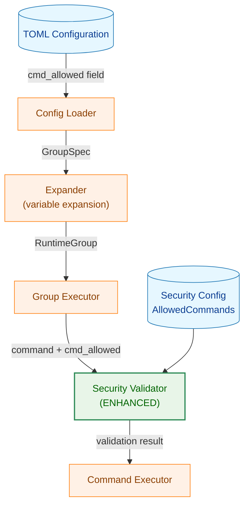
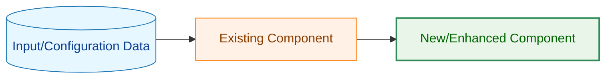
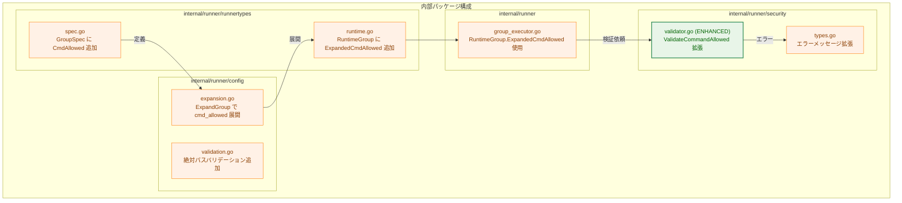
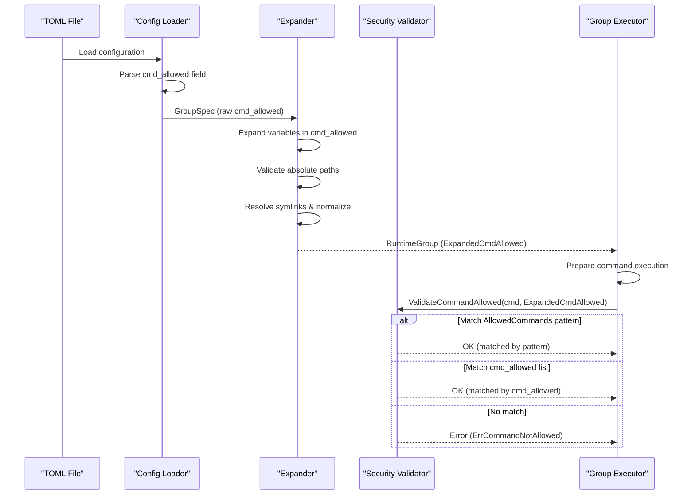

# アーキテクチャ設計書: グループレベルコマンド許可リスト

## 1. システム概要

### 1.1 アーキテクチャ目標
- TOML 設定への最小限の変更でグループレベルのコマンド許可を実現
- 既存の `AllowedCommands` メカニズムとの共存
- セキュリティレイヤーの一貫性を維持
- 変数展開システムとの統合

### 1.2 設計原則
- **セキュリティファースト**: `cmd_allowed` でもセキュリティチェックは継続
- **既存活用**: 既存の変数展開、パス検証ロジックを再利用
- **OR条件**: `AllowedCommands` と `cmd_allowed` のいずれかにマッチすればOK
- **YAGNI**: ワイルドカード等の複雑な機能は実装しない

## 2. システム構成

### 2.1 全体アーキテクチャ



**凡例（Legend）**



### 2.2 コンポーネント配置



### 2.3 データフロー



## 3. 主要コンポーネント詳細

### 3.1 データ構造の拡張

#### 3.1.1 GroupSpec への追加

**ファイル**: `internal/runner/runnertypes/spec.go`

```go
type GroupSpec struct {
    // ... 既存フィールド ...

    // CmdAllowed はこのグループで実行を許可する追加コマンドのリスト
    // 各要素は絶対パス（変数展開前）
    // nil または空の場合、グループレベルの追加許可は行わない
    CmdAllowed []string `toml:"cmd_allowed"`
}
```

**特性**:
- TOML の `cmd_allowed` フィールドから読み込まれる
- 変数（`%{var}`）を含む生のパス文字列
- 省略可能（デフォルト: nil）

#### 3.1.2 RuntimeGroup への追加

**ファイル**: `internal/runner/runnertypes/runtime.go`

```go
type RuntimeGroup struct {
    // ... 既存フィールド ...

    // ExpandedCmdAllowed は変数展開後の許可コマンドリスト
    // 各要素は以下の処理が完了している:
    // - 変数展開 (%{var} -> 実際の値)
    // - 絶対パス検証
    // - シンボリックリンク解決
    // - パス正規化 (filepath.Clean)
    ExpandedCmdAllowed []string
}
```

**特性**:
- `Expander.ExpandGroup()` で生成される
- すべて絶対パス
- シンボリックリンク解決済み
- 正規化済み（`filepath.Clean` 適用後）

### 3.2 設定ロードと変数展開

#### 3.2.1 TOML パース

**ファイル**: `internal/runner/config/loader.go`

**処理**:
1. TOML の `[[groups]]` セクションから `cmd_allowed` をパース
2. `GroupSpec.CmdAllowed` に格納
3. フィールドが省略されている場合は `nil`

**TOML 例**:
```toml
[[groups]]
name = "build"
cmd_allowed = [
    "/home/user/bin/tool1",
    "%{home}/bin/tool2",
]
```

#### 3.2.2 変数展開と正規化

**ファイル**: `internal/runner/config/expansion.go`

**関数**: `Expander.ExpandGroup()`

**処理フロー**:
```go
// 疑似コード
func (e *Expander) ExpandGroup(spec *GroupSpec, globalRuntime *RuntimeGlobal) (*RuntimeGroup, error) {
    runtime := &RuntimeGroup{Spec: spec}

    // ... 既存の変数展開処理 ...

    // cmd_allowed の展開
    if spec.CmdAllowed != nil {
        expandedCmdAllowed := make([]string, 0, len(spec.CmdAllowed))

        for _, rawPath := range spec.CmdAllowed {
            // 1. 変数展開
            expanded := e.expandVariables(rawPath, runtime.ExpandedVars)

            // 2. 絶対パス検証
            if !filepath.IsAbs(expanded) {
                return nil, fmt.Errorf("cmd_allowed path must be absolute: %s", expanded)
            }

            // 3. シンボリックリンク解決と正規化
            normalized, err := filepath.EvalSymlinks(expanded)
            if err != nil {
                return nil, fmt.Errorf("failed to resolve path %s: %w", expanded, err)
            }

            expandedCmdAllowed = append(expandedCmdAllowed, normalized)
        }

        runtime.ExpandedCmdAllowed = expandedCmdAllowed
    }

    return runtime, nil
}
```

**注意点**:
- ファイルが存在しない場合はエラーを返す（設定ロード時点で実在するファイルのみ許可）
- シンボリックリンク解決に失敗した場合もエラーを返す

#### 3.2.3 バリデーション

**ファイル**: `internal/runner/config/validation.go`

**検証項目**:
1. **絶対パス検証**: 展開後のパスが `/` で始まること
2. **パス長検証**: `MaxPathLength` を超えないこと
3. **不正文字検証**: NULL文字などを含まないこと

### 3.3 セキュリティバリデーション

#### 3.3.1 Validator の拡張

**ファイル**: `internal/runner/security/validator.go`

**既存メソッドの拡張**:

```go
// ValidateCommandAllowed は、コマンドが実行許可されているかを検証する
// AllowedCommands パターンまたは groupCmdAllowed リストをチェックする
//
// 検証ロジック:
// 1. AllowedCommands の正規表現パターンにマッチするかチェック
//    - マッチした場合: OK (return nil)
// 2. groupCmdAllowed が提供されている場合、リストに含まれるかチェック
//    - 含まれる場合: OK (return nil)
// 3. どちらもマッチしない場合: ErrCommandNotAllowed
//
// Parameters:
//   - cmdPath: 実行するコマンドのパス（絶対パス、変数展開済み）
//   - groupCmdAllowed: グループレベルの許可コマンドリスト（nil 可）
//
// Returns:
//   - error: 許可されていない場合は ErrCommandNotAllowed
func (v *Validator) ValidateCommandAllowed(cmdPath string, groupCmdAllowed []string) error {
    // 1. AllowedCommands パターンマッチ
    for _, pattern := range v.config.AllowedCommands {
        matched, err := regexp.MatchString(pattern, cmdPath)
        if err != nil {
            return fmt.Errorf("invalid allowed command pattern %s: %w", pattern, err)
        }
        if matched {
            return nil // OK: AllowedCommands にマッチ
        }
    }

    // 2. cmd_allowed リストチェック
    if groupCmdAllowed != nil {
        // コマンドパスを正規化（シンボリックリンク解決）
        normalizedCmd, err := filepath.EvalSymlinks(cmdPath)
        if err != nil {
            return fmt.Errorf("failed to resolve command path %s: %w", cmdPath, err)
        }

        for _, allowed := range groupCmdAllowed {
            if normalizedCmd == allowed {
                return nil // OK: cmd_allowed にマッチ
            }
        }
    }

    // 3. どちらもマッチしない場合はエラー
    return &CommandNotAllowedError{
        CommandPath:      cmdPath,
        AllowedPatterns:  v.config.AllowedCommands,
        GroupCmdAllowed:  groupCmdAllowed,
    }
}
```

#### 3.3.2 エラー型の拡張

**ファイル**: `internal/runner/security/errors.go`

```go
// CommandNotAllowedError は、コマンドが許可されていない場合のエラー
type CommandNotAllowedError struct {
    CommandPath      string
    AllowedPatterns  []string
    GroupCmdAllowed  []string
}

func (e *CommandNotAllowedError) Error() string {
    var buf strings.Builder
    buf.WriteString(fmt.Sprintf("command not allowed: %s\n", e.CommandPath))
    buf.WriteString("  - Not matched by global allowed_commands patterns\n")

    if len(e.GroupCmdAllowed) > 0 {
        buf.WriteString(fmt.Sprintf("  - Not in group-level cmd_allowed list: %v\n", e.GroupCmdAllowed))
    } else {
        buf.WriteString("  - Group-level cmd_allowed is not configured\n")
    }

    return buf.String()
}

func (e *CommandNotAllowedError) Is(target error) bool {
    return target == ErrCommandNotAllowed
}
```

### 3.4 グループ実行時の統合

#### 3.4.1 GroupExecutor での使用

**ファイル**: `internal/runner/group_executor.go`

**処理フロー**:

```go
func (g *DefaultGroupExecutor) ExecuteGroup(
    ctx context.Context,
    groupSpec *GroupSpec,
    runtimeGlobal *RuntimeGlobal,
) error {
    // RuntimeGroup を取得（ExpandedCmdAllowed を含む）
    runtimeGroup := /* expansion.goで生成済み */

    for _, cmd := range runtimeGroup.Commands {
        // セキュリティ検証（cmd_allowed を渡す）
        err := g.validator.ValidateCommandAllowed(
            cmd.ExpandedCmd,
            runtimeGroup.ExpandedCmdAllowed, // <- グループレベルの許可リスト
        )
        if err != nil {
            return fmt.Errorf("command validation failed for %s: %w", cmd.Name, err)
        }

        // コマンド実行
        // ...
    }

    return nil
}
```

## 4. セキュリティ考慮事項

### 4.1 パストラバーサル攻撃の防止

**対策**:
- 絶対パスのみ許可（相対パス拒否）
- `filepath.Clean` による正規化
- `../` などのパストラバーサル要素の除去

**実装箇所**: `config/expansion.go` の変数展開時

### 4.2 シンボリックリンク攻撃の防止

**対策**:
- `filepath.EvalSymlinks` でシンボリックリンクを解決
- 設定ロード時と実行時の両方で解決
- 解決後のパスで比較

**実装箇所**:
- `config/expansion.go`: 設定ロード時
- `security/validator.go`: コマンド検証時

### 4.3 他のセキュリティレイヤーの維持

**継続するチェック**:
- リスク評価（`internal/runner/risk`）
- ファイルパーミッション検証
- ハッシュ検証（`verify_files`）
- 特権実行時の追加チェック
- 環境変数のサニタイゼーション

**重要**: `cmd_allowed` はコマンドパターンマッチのみをバイパスし、他のセキュリティチェックは引き続き実行される。

## 5. パフォーマンス最適化

### 5.1 リスト検索の最適化

**現状の実装**:
- `groupCmdAllowed` はスライス（`[]string`）
- 検索は線形探索（O(n)）

**最適化の検討**:
- グループあたりの `cmd_allowed` エントリ数は少ない（通常 1-10）
- 線形探索で十分なパフォーマンス
- マップへの変換は不要（メモリオーバーヘッドの方が問題）

**結論**: 現状の線形探索で実装

### 5.2 シンボリックリンク解決のキャッシュ

**検討事項**:
- 同一コマンドの繰り返し実行時にキャッシュが有効
- ただし、シンボリックリンクの変更検知が困難
- セキュリティリスクとのトレードオフ

**結論**: 初期実装ではキャッシュしない（安全性優先）

## 6. テスト戦略

### 6.1 ユニットテスト

**対象コンポーネント**:
1. **TOML パース** (`config/loader_test.go`)
   - `cmd_allowed` フィールドの読み込み
   - 空配列、nil の扱い

2. **変数展開** (`config/expansion_test.go`)
   - `%{variable}` の展開
   - 絶対パス検証
   - シンボリックリンク解決

3. **セキュリティバリデーション** (`security/validator_test.go`)
   - AllowedCommands マッチ
   - cmd_allowed マッチ
   - 両方マッチしない場合のエラー

### 6.2 統合テスト

**テストシナリオ**:
1. グループレベル `cmd_allowed` のみでコマンド実行
2. AllowedCommands のみでコマンド実行（既存動作）
3. 両方設定されている場合の OR 条件
4. エラーケース（相対パス、存在しないコマンド）

### 6.3 セキュリティテスト

**テストケース**:
1. パストラバーサル攻撃
   - `cmd_allowed = ["../../etc/passwd"]` → エラー
2. シンボリックリンク攻撃
   - シンボリックリンクを使った不正アクセス → 防止
3. 他のセキュリティチェックのバイパス
   - `cmd_allowed` で許可されたコマンドでも、world-writable なら拒否

## 7. 既存コードへの影響

### 7.1 変更が必要なファイル

| ファイル | 変更内容 | 影響度 |
|---------|---------|-------|
| `internal/runner/runnertypes/spec.go` | `GroupSpec` にフィールド追加 | 低 |
| `internal/runner/runnertypes/runtime.go` | `RuntimeGroup` にフィールド追加 | 低 |
| `internal/runner/config/expansion.go` | `ExpandGroup` で `cmd_allowed` 展開 | 中 |
| `internal/runner/config/validation.go` | 絶対パスバリデーション追加 | 低 |
| `internal/runner/security/validator.go` | `ValidateCommandAllowed` 拡張 | 中 |
| `internal/runner/group_executor.go` | `ExpandedCmdAllowed` の使用 | 低 |

### 7.2 後方互換性

**保証事項**:
- `cmd_allowed` フィールドが定義されていない既存の TOML ファイルは、変更なしで動作
- `AllowedCommands` の動作は変更なし
- 既存のテストはすべてパス

## 8. 実装順序

### Phase 1: データ構造とパース
1. `GroupSpec` に `CmdAllowed` フィールド追加
2. `RuntimeGroup` に `ExpandedCmdAllowed` フィールド追加
3. TOML パースのテスト

### Phase 2: 変数展開
1. `Expander.ExpandGroup` での `cmd_allowed` 展開実装
2. 絶対パスバリデーション
3. シンボリックリンク解決
4. ユニットテスト

### Phase 3: セキュリティバリデーション
1. `Validator.ValidateCommandAllowed` の拡張
2. `CommandNotAllowedError` の拡張
3. ユニットテスト

### Phase 4: 統合
1. `GroupExecutor` での使用
2. 統合テスト
3. セキュリティテスト

### Phase 5: ドキュメント
1. ユーザーガイド更新
2. 設定例の追加
3. セキュリティ注意事項の記載

## 9. 参照

### 9.1 関連パッケージ
- `internal/runner/runnertypes`: データ型定義
- `internal/runner/config`: 設定ロードと変数展開
- `internal/runner/security`: セキュリティバリデーション
- `internal/safefileio`: 安全なファイル操作

### 9.2 関連ドキュメント
- 要件定義書: `01_requirements.md`
- 詳細仕様書: `03_detailed_spec.md`
- 実装計画: `04_implementation_plan.md`

---

**文書バージョン**: 1.0
**作成日**: 2025-11-25
**承認日**: [未承認]
**次回レビュー予定**: [実装完了後]
