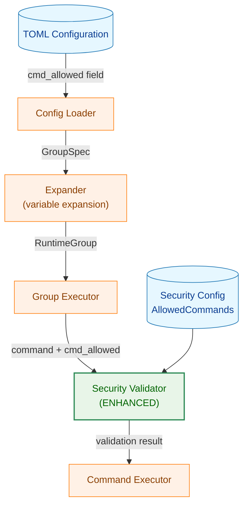

# グループレベルコマンド許可リスト - 実装計画書

## 進捗サマリー

**最終更新**: 2025-11-25

| Phase | タスク数 | 完了 | 進行中 | 未着手 | 進捗率 |
|-------|---------|------|--------|--------|--------|
| Phase 1: データ構造拡張 | 3 | 3 | 0 | 0 | 100% |
| Phase 2: 変数展開機能 | 5 | 5 | 0 | 0 | 100% |
| Phase 3: セキュリティ検証拡張 | 4 | 4 | 0 | 0 | 100% |
| Phase 4: 統合とテスト | 6 | 6 | 0 | 0 | 100% |
| Phase 5: ドキュメント整備 | 3 | 3 | 0 | 0 | 100% |
| **合計** | **21** | **21** | **0** | **0** | **100%** |

### 現在の状態

- ✅ **Phase 1完了**: データ構造拡張
- ✅ **Phase 2完了**: 変数展開機能
- ✅ **Phase 3完了**: セキュリティ検証拡張
- ✅ **Phase 4完了**: 統合とテスト
- ✅ **Phase 5完了**: ドキュメント整備

---

## 1. 実装概要

### 1.1 実装目標

- グループレベルで実行可能なコマンドのリスト（`cmd_allowed`）を定義可能にする
- 既存の `AllowedCommands` 正規表現パターンマッチ機能と共存（OR条件）
- 変数展開システムと統合し、`%{variable}` 形式の変数参照をサポート
- セキュリティレイヤーの一貫性を維持（他のセキュリティチェックは継続）

### 1.2 実装スコープ

- **対象**: グループレベルの TOML 設定拡張、セキュリティバリデーション
- **実装箇所**: 5個のパッケージ、8個のファイル
- **新規作成**: エラー型 2個
- **テストケース**: 単体18件、統合5件、セキュリティテスト4件

### 1.3 アーキテクチャ概要



## 2. 実装フェーズ計画

### 2.1 Phase 1: データ構造拡張 (0.5日)

**目標**: 設定構造体とランタイム構造体に `cmd_allowed` 関連フィールドを追加

#### 2.1.1 実装タスク

| タスクID | 説明 | 所要時間 | 依存関係 | 状態 |
|---------|------|----------|----------|------|
| CA-1.1 | `GroupSpec` に `CmdAllowed` フィールド追加 | 30分 | なし | [x] 完了 |
| CA-1.2 | `RuntimeGroup` に `ExpandedCmdAllowed` フィールド追加 | 30分 | なし | [x] 完了 |
| CA-1.3 | フィールドドキュメントコメント作成 | 30分 | CA-1.1, CA-1.2 | [x] 完了 |

#### 2.1.2 実装対象ファイル

**ファイル1**: `internal/runner/runnertypes/spec.go`

```go
type GroupSpec struct {
    // ... 既存フィールド ...

    // CmdAllowed はこのグループで実行を許可する追加コマンドのリスト
    // 各要素は絶対パス（変数展開前）
    //
    // 空の場合の動作:
    //   - nil: フィールドが省略された（グループレベルの追加許可なし）
    //   - []: 空配列が明示的に指定された（追加許可なし、nil と同じ動作）
    //
    // 例:
    //   cmd_allowed = ["/home/user/bin/tool1", "%{home}/bin/tool2"]
    CmdAllowed []string `toml:"cmd_allowed"`
}
```

**ファイル2**: `internal/runner/runnertypes/runtime.go`

```go
type RuntimeGroup struct {
    // ... 既存フィールド ...

    // ExpandedCmdAllowed は変数展開後の許可コマンドリスト
    //
    // 各要素は以下の処理が完了している:
    //   1. 変数展開: %{var} -> 実際の値
    //   2. 絶対パス検証: / で始まることを確認
    //   3. シンボリックリンク解決: filepath.EvalSymlinks
    //   4. パス正規化: filepath.Clean
    //
    // nil の場合:
    //   - GroupSpec.CmdAllowed が nil または空配列だった
    //   - グループレベルの追加許可は適用されない
    //
    // 例:
    //   ["/home/user/bin/tool1", "/usr/local/bin/node"]
    ExpandedCmdAllowed []string
}
```

#### 2.1.3 成果物チェックリスト

- [x] `GroupSpec.CmdAllowed` フィールド追加完了
- [x] `RuntimeGroup.ExpandedCmdAllowed` フィールド追加完了
- [x] フィールドドキュメントコメント作成完了
- [x] 既存テストが全て成功
- [x] `make lint` がパス

#### 2.1.4 検証基準

```bash
# 既存テストの実行
go test -tags test -v ./internal/runner/runnertypes

# Lint確認
make lint
```

### 2.2 Phase 2: 変数展開機能 (2日)

**目標**: `cmd_allowed` の変数展開、絶対パス検証、シンボリックリンク解決を実装

#### 2.2.1 実装タスク

| タスクID | 説明 | 所要時間 | 依存関係 | 状態 |
|---------|------|----------|----------|------|
| CA-2.1 | `InvalidPathError` エラー型実装 | 1時間 | Phase 1完了 | [x] 完了 |
| CA-2.2 | `expandCmdAllowed()` 関数実装 | 3時間 | CA-2.1 | [x] 完了 |
| CA-2.3 | `ExpandGroup()` に展開処理統合 | 2時間 | CA-2.2 | [x] 完了 |
| CA-2.4 | 単体テスト: 変数展開 | 2時間 | CA-2.2, CA-2.3 | [x] 完了 |
| CA-2.5 | 単体テスト: エラーケース | 1時間 | CA-2.4 | [x] 完了 |

#### 2.2.2 実装対象ファイル

**ファイル1**: `internal/runner/config/errors.go`

```go
// InvalidPathError は、パスが不正な場合のエラー
type InvalidPathError struct {
    Path   string // 不正なパス
    Reason string // 理由
}

func (e *InvalidPathError) Error() string {
    return fmt.Sprintf("invalid path %s: %s", e.Path, e.Reason)
}

func (e *InvalidPathError) Is(target error) bool {
    _, ok := target.(*InvalidPathError)
    return ok
}
```

**ファイル2**: `internal/runner/config/expansion.go`

```go
// expandCmdAllowed は cmd_allowed リストを展開する
//
// 処理内容:
//   1. 各パスの変数展開
//   2. 絶対パス検証
//   3. シンボリックリンク解決
//   4. パス正規化
//   5. 重複除去
//
// Parameters:
//   - rawPaths: 展開前のパスリスト（変数参照を含む可能性）
//   - vars: 変数マップ（%{key} -> value）
//   - groupName: グループ名（エラーメッセージ用）
//
// Returns:
//   - []string: 展開・正規化後のパスリスト
//   - error: 展開エラー
func (e *Expander) expandCmdAllowed(
    rawPaths []string,
    vars map[string]string,
    groupName string,
) ([]string, error) {
    result := make([]string, 0, len(rawPaths))
    seen := make(map[string]bool) // 重複除去用

    for i, rawPath := range rawPaths {
        // 1. 空文字列チェック
        if rawPath == "" {
            return nil, fmt.Errorf("group[%s] cmd_allowed[%d]: path cannot be empty", groupName, i)
        }

        // 2. 変数展開
        expanded, err := e.expandString(rawPath, vars)
        if err != nil {
            return nil, fmt.Errorf("group[%s] cmd_allowed[%d] %s: %w", groupName, i, rawPath, err)
        }

        // 3. 絶対パス検証
        if !filepath.IsAbs(expanded) {
            return nil, &InvalidPathError{
                Path:   expanded,
                Reason: "cmd_allowed paths must be absolute (start with '/')",
            }
        }

        // 4. パス長検証
        if len(expanded) > e.config.MaxPathLength {
            return nil, &InvalidPathError{
                Path:   expanded,
                Reason: fmt.Sprintf("path length exceeds maximum (%d)", e.config.MaxPathLength),
            }
        }

        // 5. シンボリックリンク解決と正規化
        normalized, err := filepath.EvalSymlinks(expanded)
        if err != nil {
            return nil, fmt.Errorf("group[%s] cmd_allowed[%d] %s: failed to resolve path: %w", groupName, i, expanded, err)
        }

        // 6. 重複チェックと追加
        if !seen[normalized] {
            result = append(result, normalized)
            seen[normalized] = true
        }
    }

    return result, nil
}
```

**ファイル3**: `internal/runner/config/expansion.go` (ExpandGroup拡張)

```go
func (e *Expander) ExpandGroup(
    spec *GroupSpec,
    globalRuntime *RuntimeGlobal,
) (*RuntimeGroup, error) {
    runtime := &RuntimeGroup{Spec: spec}

    // ... 既存の変数展開処理（env_import, vars, env_vars など） ...

    // cmd_allowed の展開
    if spec.CmdAllowed != nil && len(spec.CmdAllowed) > 0 {
        expandedCmdAllowed, err := e.expandCmdAllowed(
            spec.CmdAllowed,
            runtime.ExpandedVars,
            spec.Name,
        )
        if err != nil {
            return nil, fmt.Errorf("failed to expand cmd_allowed for group[%s]: %w", spec.Name, err)
        }
        runtime.ExpandedCmdAllowed = expandedCmdAllowed
    }

    // ... 既存の処理（VerifyFiles, WorkDir など） ...

    return runtime, nil
}
```

#### 2.2.3 テストファイル

**ファイル**: `internal/runner/config/expansion_cmd_allowed_test.go` (新規作成)

テストケース:
- 単一パス展開（変数なし）
- 単一変数展開（`%{home}/bin/tool`）
- 複数変数展開（`%{root}/%{app}/bin`）
- 複数パス展開
- 重複除去
- 空文字列エラー
- 未定義変数エラー
- 相対パスエラー
- パス長超過エラー
- シンボリックリンク解決失敗エラー

#### 2.2.4 成果物チェックリスト

- [x] `InvalidPathError` 型実装完了
- [x] `expandCmdAllowed()` 関数実装完了
- [x] `ExpandGroup()` への統合完了
- [x] 単体テスト実装完了（12ケース）
- [x] テストカバレッジ 100% (expandCmdAllowed関数)
- [x] `make test` がパス
- [x] `make lint` がパス

#### 2.2.5 検証基準

```bash
# テスト実行
go test -tags test -v ./internal/runner/config -run TestExpandCmdAllowed

# カバレッジ確認
go test -tags test -cover ./internal/runner/config
# 期待: coverage: >= 90%

# Lint確認
make lint
```

### 2.3 Phase 3: セキュリティ検証拡張 (1.5日)

**目標**: `ValidateCommandAllowed` を拡張し、`cmd_allowed` との OR 条件チェックを実装

#### 2.3.1 実装タスク

| タスクID | 説明 | 所要時間 | 依存関係 | 状態 |
|---------|------|----------|----------|------|
| CA-3.1 | `CommandNotAllowedError` 拡張 | 1時間 | Phase 2完了 | [x] 完了 |
| CA-3.2 | `ValidateCommandAllowed()` 拡張 | 3時間 | CA-3.1 | [x] 完了 |
| CA-3.3 | 単体テスト: パターンマッチ | 1.5時間 | CA-3.2 | [x] 完了 |
| CA-3.4 | 単体テスト: OR条件 | 1.5時間 | CA-3.3 | [x] 完了 |

#### 2.3.2 実装対象ファイル

**ファイル1**: `internal/runner/security/errors.go`

```go
// CommandNotAllowedError は、コマンドが許可されていない場合のエラー
type CommandNotAllowedError struct {
    CommandPath     string   // 実行しようとしたコマンドのパス
    AllowedPatterns []string // AllowedCommands パターン
    GroupCmdAllowed []string // グループレベルの cmd_allowed リスト
}

func (e *CommandNotAllowedError) Error() string {
    var buf strings.Builder
    buf.WriteString(fmt.Sprintf("command not allowed: %s\n", e.CommandPath))

    // AllowedCommands の情報
    buf.WriteString("  - Not matched by global allowed_commands patterns:\n")
    for _, pattern := range e.AllowedPatterns {
        buf.WriteString(fmt.Sprintf("      %s\n", pattern))
    }

    // cmd_allowed の情報
    if len(e.GroupCmdAllowed) > 0 {
        buf.WriteString("  - Not in group-level cmd_allowed list:\n")
        for _, allowed := range e.GroupCmdAllowed {
            buf.WriteString(fmt.Sprintf("      %s\n", allowed))
        }
    } else {
        buf.WriteString("  - Group-level cmd_allowed is not configured\n")
    }

    return buf.String()
}

func (e *CommandNotAllowedError) Is(target error) bool {
    return target == ErrCommandNotAllowed
}

func (e *CommandNotAllowedError) Unwrap() error {
    return ErrCommandNotAllowed
}
```

**ファイル2**: `internal/runner/security/validator.go`

```go
// ValidateCommandAllowed は、コマンドが実行許可されているかを検証する
//
// 検証ロジック:
//   1. AllowedCommands の正規表現パターンにマッチするかチェック
//      - マッチした場合: OK (return nil)
//   2. groupCmdAllowed が提供されている場合、リストに含まれるかチェック
//      - 含まれる場合: OK (return nil)
//   3. どちらもマッチしない場合: ErrCommandNotAllowed
//
// Parameters:
//   - cmdPath: 実行するコマンドのパス（絶対パス、変数展開済み）
//   - groupCmdAllowed: グループレベルの許可コマンドリスト（nil 可）
//
// Returns:
//   - error: 許可されていない場合は ErrCommandNotAllowed
func (v *Validator) ValidateCommandAllowed(
    cmdPath string,
    groupCmdAllowed []string,
) error {
    // 入力検証
    if cmdPath == "" {
        return fmt.Errorf("command path cannot be empty")
    }

    // 1. AllowedCommands パターンマッチ
    for _, pattern := range v.config.AllowedCommands {
        re, err := regexp.Compile(pattern)
        if err != nil {
            return fmt.Errorf("invalid allowed command pattern %s: %w", pattern, err)
        }

        if re.MatchString(cmdPath) {
            return nil // OK: AllowedCommands にマッチ
        }
    }

    // 2. cmd_allowed リストチェック
    if len(groupCmdAllowed) > 0 {
        // コマンドパスを正規化（シンボリックリンク解決）
        normalizedCmd, err := filepath.EvalSymlinks(cmdPath)
        if err != nil {
            return fmt.Errorf("failed to resolve command path %s: %w", cmdPath, err)
        }

        for _, allowed := range groupCmdAllowed {
            if normalizedCmd == allowed {
                return nil // OK: cmd_allowed にマッチ
            }
        }
    }

    // 3. どちらもマッチしない場合はエラー
    return &CommandNotAllowedError{
        CommandPath:     cmdPath,
        AllowedPatterns: v.config.AllowedCommands,
        GroupCmdAllowed: groupCmdAllowed,
    }
}
```

#### 2.3.3 テストファイル

**ファイル**: `internal/runner/security/validator_cmd_allowed_test.go` (新規作成)

テストケース:
- AllowedCommands パターンマッチ（単一パターン）
- AllowedCommands パターンマッチ（複数パターン）
- cmd_allowed 完全一致
- cmd_allowed リスト複数
- OR条件: 両方マッチ
- OR条件: AllowedCommands のみマッチ
- OR条件: cmd_allowed のみマッチ
- エラー: 両方不一致
- エラー: cmd_allowed が空配列

#### 2.3.4 成果物チェックリスト

- [x] `CommandNotAllowedError` 拡張完了
- [x] `ValidateCommandAllowed()` 拡張完了
- [x] 単体テスト実装完了（9ケース以上）
- [x] テストカバレッジ ≥ 90%
- [x] `make test` がパス
- [x] `make lint` がパス

#### 2.3.5 検証基準

```bash
# テスト実行
go test -tags test -v ./internal/runner/security -run TestValidateCommandAllowed

# カバレッジ確認
go test -tags test -cover ./internal/runner/security
# 期待: coverage: >= 90%

# Lint確認
make lint
```

### 2.4 Phase 4: 統合とテスト (2日)

**目標**: Runner との統合、エンドツーエンドテスト、セキュリティテストを実装

#### 2.4.1 実装タスク

| タスクID | 説明 | 所要時間 | 依存関係 | 状態 |
|---------|------|----------|----------|------|
| CA-4.1 | Group Executor での `ExpandedCmdAllowed` 使用 | 2時間 | Phase 3完了 | [x] 完了 |
| CA-4.2 | 統合テスト: 基本機能 | 2時間 | CA-4.1 | [x] 完了 |
| CA-4.3 | 統合テスト: 既存動作の維持 | 1時間 | CA-4.2 | [x] 完了 |
| CA-4.4 | セキュリティテスト: パストラバーサル | 1.5時間 | CA-4.1 | [x] 完了 |
| CA-4.5 | セキュリティテスト: シンボリックリンク | 1.5時間 | CA-4.4 | [x] 完了 |
| CA-4.6 | セキュリティテスト: 他チェックとの統合 | 2時間 | CA-4.5 | [x] 完了 |

#### 2.4.2 実装対象ファイル

**ファイル1**: `internal/runner/group_executor.go` (既存ファイルの変更)

```go
func (g *GroupExecutor) executeCommand(
    ctx context.Context,
    cmdSpec *runnertypes.CommandSpec,
    group *runnertypes.RuntimeGroup,
) error {
    // ... 既存の処理 ...

    // セキュリティ検証時に ExpandedCmdAllowed を渡す
    if err := g.validator.ValidateCommandAllowed(
        cmdPath,
        group.ExpandedCmdAllowed, // 追加
    ); err != nil {
        return fmt.Errorf("command validation failed: %w", err)
    }

    // ... 残りの処理 ...
}
```

#### 2.4.3 テストファイル

**ファイル1**: `cmd/runner/integration_cmd_allowed_test.go` (新規作成)

統合テストケース:
- グループレベル cmd_allowed でコマンド実行成功
- AllowedCommands のみでコマンド実行成功（既存動作）
- cmd_allowed と AllowedCommands の両方が設定されている場合
- 変数展開を含む cmd_allowed
- cmd_allowed が設定されていない場合の既存動作

**ファイル2**: `cmd/runner/integration_cmd_allowed_security_test.go` (新規作成)

セキュリティテストケース:
- パストラバーサル攻撃の防御（相対パス拒否）
- シンボリックリンク攻撃の検証
- ファイルパーミッションチェックとの統合
- リスク評価との統合

#### 2.4.4 成果物チェックリスト

- [ ] `GroupExecutor` での統合完了
- [ ] 統合テスト実装完了（5ケース）
- [ ] セキュリティテスト実装完了（4ケース）
- [ ] すべてのテストがパス
- [ ] `make test` がパス
- [ ] `make lint` がパス

#### 2.4.5 検証基準

```bash
# 統合テスト実行
go test -tags test -v ./cmd/runner -run TestIntegrationCmdAllowed

# セキュリティテスト実行
go test -tags test -v ./cmd/runner -run TestIntegrationCmdAllowedSecurity

# 全テスト実行
make test

# Lint確認
make lint
```

### 2.5 Phase 5: ドキュメント整備 (1日)

**目標**: ユーザードキュメント、サンプル設定、CHANGELOGの更新

#### 2.5.1 実装タスク

| タスクID | 説明 | 所要時間 | 依存関係 | 状態 |
|---------|------|----------|----------|------|
| CA-5.1 | README.md に機能説明追加 | 2時間 | Phase 4完了 | [x] 完了 |
| CA-5.2 | サンプル設定ファイル作成 | 1時間 | CA-5.1 | [x] 完了 |
| CA-5.3 | CHANGELOG.md 更新 | 1時間 | CA-5.2 | [x] 完了 |

#### 2.5.2 更新対象ファイル

**ファイル1**: `README.md`

追加セクション:
```markdown
#### グループレベルコマンド許可リスト

特定のグループでのみ実行可能なコマンドを定義できます。

```toml
allowed_commands = ["^/bin/.*", "^/usr/bin/.*"]

[[groups]]
name = "build"
env_import = ["home=HOME"]
cmd_allowed = [
    "%{home}/bin/custom_build_tool",
    "/opt/myapp/bin/processor",
]

[[groups.commands]]
name = "build"
cmd = "%{home}/bin/custom_build_tool"
args = ["--verbose"]
```

**特徴**:
- グローバルの `allowed_commands` と OR 条件で評価
- 変数展開（`%{variable}`）をサポート
- 絶対パスのみ許可
- 他のセキュリティチェック（パーミッション、リスク評価など）は継続
```

**ファイル2**: `sample/group_cmd_allowed.toml` (新規作成)

完全なサンプル設定ファイル

**ファイル3**: `CHANGELOG.md`

```markdown
## [Unreleased]

### Added
- グループレベルコマンド許可リスト機能（`cmd_allowed`）
  - 特定のグループでのみ実行可能なコマンドを定義可能
  - 変数展開（`%{variable}`）をサポート
  - 既存の `allowed_commands` と OR 条件で評価
```

#### 2.5.3 成果物チェックリスト

- [ ] README.md 更新完了
- [ ] サンプル設定ファイル作成完了
- [ ] CHANGELOG.md 更新完了
- [ ] ドキュメントのリンク切れがないことを確認
- [ ] サンプル設定ファイルが実際に動作することを確認

#### 2.5.4 検証基準

```bash
# サンプル設定の動作確認
./build/prod/runner -config sample/group_cmd_allowed.toml -dry-run

# ドキュメントのマークダウン検証
markdownlint README.md CHANGELOG.md
```

## 3. 実装優先度

### 3.1 優先度定義

| 優先度 | 説明 | 対象フェーズ |
|-------|------|------------|
| **P0** | 機能実現に必須 | Phase 1, 2, 3 |
| **P1** | 品質担保に重要 | Phase 4 |
| **P2** | ユーザー体験向上 | Phase 5 |

### 3.2 リスク評価

| リスク | 影響度 | 発生確率 | 軽減策 |
|-------|-------|---------|--------|
| シンボリックリンク解決の失敗 | 高 | 中 | エラーハンドリングの充実、テストケース追加 |
| 既存セキュリティチェックとの統合問題 | 高 | 低 | 統合テスト、セキュリティテストの実施 |
| パフォーマンス劣化 | 中 | 低 | `filepath.EvalSymlinks` の呼び出し最小化 |
| 変数展開エラーの複雑化 | 低 | 中 | エラーメッセージの改善 |

## 4. テスト計画

### 4.1 テストカバレッジ目標

| パッケージ | カバレッジ目標 | 重点領域 |
|-----------|-------------|---------|
| `internal/runner/config` | ≥ 90% | 変数展開、バリデーション |
| `internal/runner/security` | ≥ 90% | OR条件ロジック、エラーハンドリング |
| `cmd/runner` | ≥ 80% | 統合テスト、セキュリティテスト |

### 4.2 テスト種別

| 種別 | 件数 | 目的 |
|-----|-----|------|
| 単体テスト（変数展開） | 10 | `expandCmdAllowed()` の動作確認 |
| 単体テスト（セキュリティ検証） | 9 | `ValidateCommandAllowed()` の動作確認 |
| 統合テスト | 5 | エンドツーエンドの動作確認 |
| セキュリティテスト | 4 | 攻撃シナリオの防御確認 |
| **合計** | **28** | |

## 5. パフォーマンス要件

### 5.1 ベンチマーク目標

| 操作 | 目標時間 | 計測ポイント |
|-----|---------|------------|
| コマンド許可チェック | < 1ms | `ValidateCommandAllowed()` |
| 変数展開（グループあたり） | < 10ms | `expandCmdAllowed()` |

### 5.2 最適化方針

- AllowedCommands: 正規表現の事前コンパイル（既存機能）
- cmd_allowed: 線形探索（O(n)、通常 n=1-10 程度）
- シンボリックリンク解決のキャッシュは初期実装では行わない

## 6. マイルストーン

| マイルストーン | 完了予定日 | 成果物 |
|-------------|----------|--------|
| M1: データ構造拡張完了 | Day 1 | Phase 1完了 |
| M2: 変数展開機能完了 | Day 3 | Phase 2完了 |
| M3: セキュリティ検証拡張完了 | Day 4.5 | Phase 3完了 |
| M4: 統合とテスト完了 | Day 6.5 | Phase 4完了 |
| M5: ドキュメント整備完了 | Day 7.5 | Phase 5完了 |

## 7. 成功基準

### 7.1 機能要件

- [ ] グループレベルで `cmd_allowed` を設定可能
- [ ] 変数展開（`%{variable}`）が動作する
- [ ] AllowedCommands と cmd_allowed の OR 条件が動作する
- [ ] 他のセキュリティチェックが継続して機能する

### 7.2 非機能要件

- [ ] すべてのテストがパス
- [ ] テストカバレッジ ≥ 90%（config, security パッケージ）
- [ ] `make lint` がパス
- [ ] パフォーマンス要件を満たす（ベンチマーク確認）

### 7.3 ドキュメント要件

- [ ] README.md に機能説明が追加されている
- [ ] サンプル設定ファイルが動作する
- [ ] CHANGELOG.md が更新されている

## 8. 参照ドキュメント

- 要件定義書: `01_requirements.md`
- アーキテクチャ設計書: `02_architecture.md`
- 詳細仕様書: `03_detailed_spec.md`

---

**文書バージョン**: 1.0
**作成日**: 2025-11-25
**承認日**: [未承認]
**次回レビュー予定**: [Phase 1完了後]
