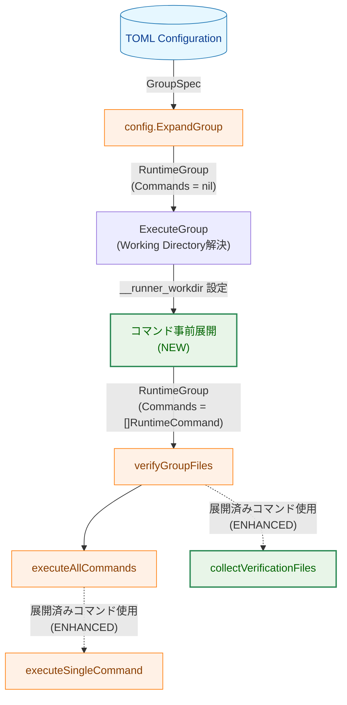
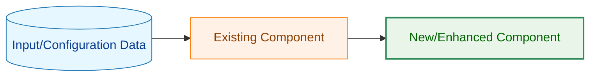
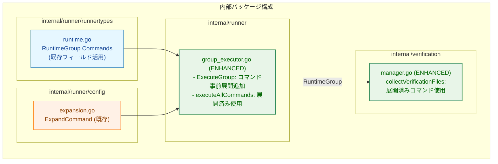
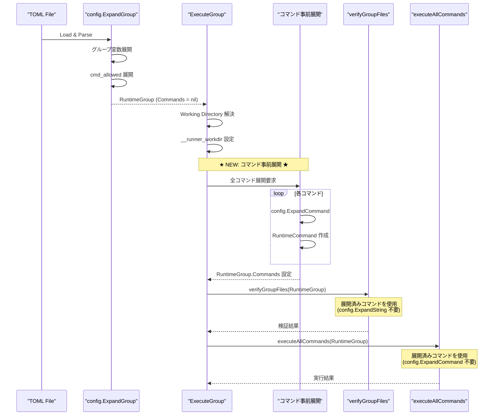
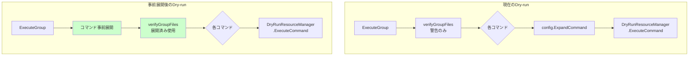

# アーキテクチャ設計書: グループ展開時のコマンド事前展開

## 1. システム概要

### 1.1 アーキテクチャ目標

- コマンド展開を `ExecuteGroup` 内で一元化し、重複処理を排除
- 検証時と実行時で同一の展開済みコマンドを参照可能にする
- コマンドレベル変数（`vars`, `env_import`）を検証時にも利用可能にする
- 既存の `RuntimeGroup.Commands` フィールドを活用

### 1.2 設計原則

- **Fail Fast**: コマンド展開エラーを実行前の早期段階で検出
- **Single Source of Truth**: 展開済みコマンドは `RuntimeGroup.Commands` に集約
- **最小限の変更**: 既存の API シグネチャを維持
- **段階的移行**: 各フェーズでテストが通る状態を維持

## 2. システム構成

### 2.1 全体アーキテクチャ



**凡例（Legend）**



### 2.2 コンポーネント配置



### 2.3 データフロー



## 3. 主要コンポーネント詳細

### 3.1 データ構造の活用

#### 3.1.1 RuntimeGroup.Commands の活用

**ファイル**: `internal/runner/runnertypes/runtime.go`

```go
type RuntimeGroup struct {
    // ... 既存フィールド ...

    // Commands contains the expanded runtime commands for this group
    // ★ 既存フィールド - 現在は未使用だが、本タスクで活用開始 ★
    Commands []*RuntimeCommand
}
```

**特性**:
- フィールドは既に定義済み（新規追加不要）
- `ExecuteGroup` 内のコマンド事前展開で設定
- 検証・実行の両フェーズで参照

#### 3.1.2 RuntimeCommand の構造（既存）

```go
type RuntimeCommand struct {
    Spec             *CommandSpec
    ExpandedVars     map[string]string  // グループ + コマンド変数
    ExpandedCmd      string             // 展開済みコマンドパス
    ExpandedArgs     []string           // 展開済み引数
    ExpandedEnv      map[string]string  // 展開済み環境変数
    EffectiveWorkDir string             // 作業ディレクトリ
    EffectiveTimeout common.Timeout     // 有効タイムアウト
    // ...
}
```

### 3.2 ExecuteGroup の変更

#### 3.2.1 現在のフロー

```
1. config.ExpandGroup → RuntimeGroup
2. Working Directory 解決
3. __runner_workdir 設定
4. verifyGroupFiles (検証時に変数展開)
5. executeAllCommands (実行時に変数展開)
```

#### 3.2.2 変更後のフロー

```
1. config.ExpandGroup → RuntimeGroup
2. Working Directory 解決
3. __runner_workdir 設定
4. ★ 全コマンド事前展開 → RuntimeGroup.Commands ★
5. verifyGroupFiles (展開済みコマンド使用)
6. executeAllCommands (展開済みコマンド使用)
```

### 3.3 検証フェーズの変更

#### 3.3.1 collectVerificationFiles の変更

**Before (現在)**:
```go
for _, command := range groupSpec.Commands {
    expandedCmd, err := config.ExpandString(
        command.Cmd,
        runtimeGroup.ExpandedVars,  // ← グループ変数のみ
        ...)
    // ...
}
```

**After (改善後)**:
```go
for _, runtimeCmd := range runtimeGroup.Commands {
    // 既に展開済み - config.ExpandString 不要
    resolvedPath, err := m.pathResolver.ResolvePath(runtimeCmd.ExpandedCmd)
    // ...
}
```

**メリット**:
- コマンドレベル変数が検証時に利用可能
- 展開処理の重複排除
- エラーハンドリングの簡素化

### 3.4 実行フェーズの変更

#### 3.4.1 executeAllCommands の変更

**Before (現在)**:
```go
for i := range groupSpec.Commands {
    cmdSpec := &groupSpec.Commands[i]
    runtimeCmd, err := config.ExpandCommand(cmdSpec, ...)
    // ...
}
```

**After (改善後)**:
```go
for i, runtimeCmd := range runtimeGroup.Commands {
    // 既に展開済み - config.ExpandCommand 不要
    // ...
}
```

**メリット**:
- ループ内でのコマンド展開が不要
- エラー処理の一元化
- コードの簡素化

## 4. セキュリティ考慮事項

### 4.1 `__runner_workdir` 変数の扱い

**重要**: `__runner_workdir` は作業ディレクトリ解決後に設定されるため、コマンド展開のタイミングに注意が必要。

**設計決定**:
- コマンド展開は `ExecuteGroup` 内で、`__runner_workdir` 設定後に実行
- `cmd` フィールドでの `__runner_workdir` 使用は技術的に可能（禁止しない）
- `args`, `env` での使用も同様にサポート

**タイミング図**:
```
1. ExpandGroup
   └── __runner_workdir: 未定義

2. Working Directory 解決
   └── __runner_workdir: 未定義

3. __runner_workdir 設定
   └── __runner_workdir: "/tmp/scr-xxx"

4. コマンド事前展開 ★
   └── __runner_workdir: 利用可能
```

### 4.2 エラー検出のタイミング変更

**Before**:
- 検証時: 変数未定義は警告（スキップ）
- 実行時: 変数未定義はエラー

**After**:
- コマンド展開時: 変数未定義はエラー（Fail Fast）

**セキュリティへの影響**:
- ✅ より厳格なエラーチェック
- ✅ 不正な設定を早期に検出
- ✅ 実行前にすべてのコマンドの正当性を確認

### 4.3 既存のセキュリティチェックの維持

以下のセキュリティチェックは変更なく維持される：

- コマンドパスの許可検証（`AllowedCommands` + `cmd_allowed`）
- リスク評価（`internal/runner/risk`）
- ファイルハッシュ検証（`verify_files`）
- 環境変数のサニタイゼーション
- 特権実行時の追加チェック

## 5. パフォーマンス最適化

### 5.1 展開処理の削減

| 処理 | Before | After | 削減量 |
|------|--------|-------|--------|
| 検証時の変数展開 | N 回 | 0 回 | 100% |
| 実行時の変数展開 | N 回 | 0 回 | 100% |
| グループ展開時の変数展開 | 0 回 | N 回 | -N 回 |
| **合計** | **2N 回** | **N 回** | **50%** |

※ N = グループ内のコマンド数

### 5.2 メモリ使用量

**変更による影響**:
- `RuntimeCommand` が `ExecuteGroup` の早期段階で作成される
- 現在は実行ループ内で逐次作成・破棄
- 事前展開後は全コマンドがメモリに保持される

**影響評価**:
- 100 コマンドで約 100KB〜500KB の増加（許容範囲）
- 通常のユースケース（1-10 コマンド）では影響なし

### 5.3 キャッシュの活用

- `globalRuntime.SystemEnv`: システム環境変数のキャッシュ（既存）
- 変数展開結果: `RuntimeCommand.ExpandedVars` に保持

## 6. Dry-run モードとの互換性

### 6.1 互換性評価

| 観点 | 評価 | 詳細 |
|------|------|------|
| **API 互換性** | ✅ 完全互換 | `DryRunResourceManager` のインターフェースは変更なし |
| **動作互換性** | ✅ 完全互換 | 展開済み `RuntimeCommand` を受け取る設計は変わらない |
| **エラー検出** | ✅ 改善 | コマンド展開エラーが dry-run 開始前に検出される |

### 6.2 Dry-run での変更点



## 7. 既存コードへの影響

### 7.1 変更が必要なファイル

| ファイル | 変更内容 | 影響度 |
|---------|---------|-------|
| `internal/runner/group_executor.go` | コマンド事前展開の追加、展開済みコマンドの使用 | 高 |
| `internal/verification/manager.go` | `collectVerificationFiles` で展開済みコマンド使用 | 中 |

### 7.2 変更不要なファイル

| ファイル | 理由 |
|---------|------|
| `internal/runner/runnertypes/runtime.go` | `Commands` フィールドは既存 |
| `internal/runner/config/expansion.go` | `ExpandCommand` は既存、変更なし |
| `internal/runner/security/validator.go` | セキュリティ検証は変更なし |

### 7.3 後方互換性

**保証事項**:
- 既存の TOML 設定ファイルは変更なしで動作
- `ExpandGroup`, `ExpandCommand` のシグネチャは維持
- テストケースの大部分は変更不要

**動作変更**:
- 検証時の展開エラーが警告からエラーに変更（Fail Fast）
- エラー発生タイミングが早期化

## 8. 実装順序

### Phase 1: コマンド事前展開の追加

1. `ExecuteGroup` でコマンド事前展開ロジックを追加
2. `__runner_workdir` 設定後に展開を実行
3. 単体テストの追加

### Phase 2: 検証フェーズの修正

1. `collectVerificationFiles` を展開済みコマンド使用に変更
2. 変数展開コードの削除
3. 単体テストの更新

### Phase 3: 実行フェーズの修正

1. `executeAllCommands` を展開済みコマンド使用に変更
2. `config.ExpandCommand` 呼び出しの削除
3. 統合テストの更新

### Phase 4: クリーンアップ

1. 不要なエラーハンドリングの削除
2. ドキュメントの更新
3. 最終テスト

## 9. 参照

### 9.1 関連パッケージ

- `internal/runner/runnertypes`: データ型定義
- `internal/runner/config`: 設定ロードと変数展開
- `internal/verification`: ファイル検証

### 9.2 関連ドキュメント

- 要件定義書: `01_requirements.md`
- 提案アーキテクチャ: `03_proposed_architecture.md`
- 詳細仕様書: `03_detailed_spec.md`

---

**文書バージョン**: 1.0
**作成日**: 2025-11-27
**承認日**: [レビュー後に記載]
**次回レビュー予定**: [実装完了後]
