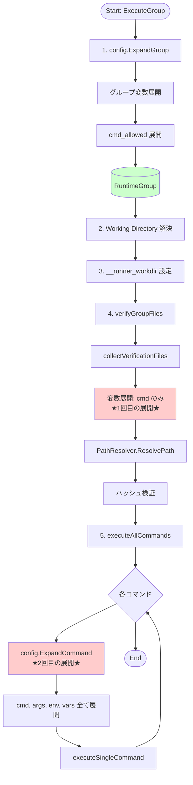
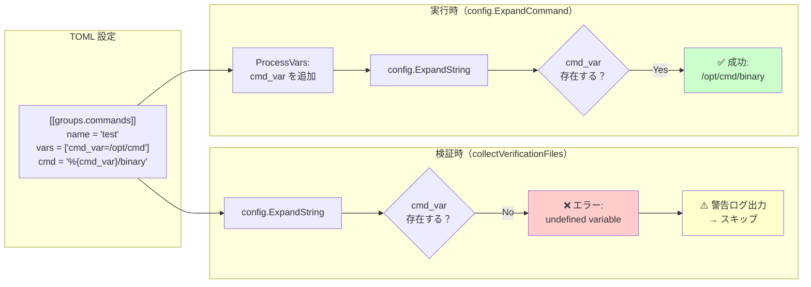
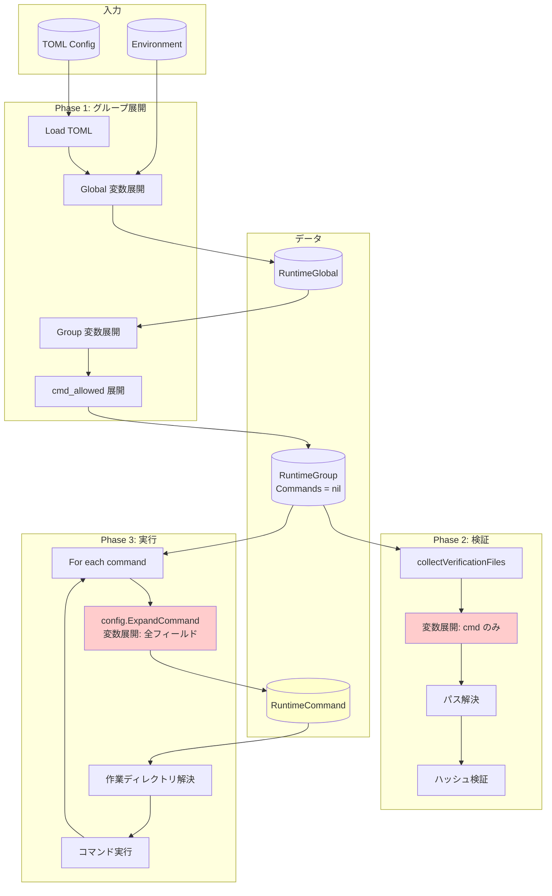

# 現在のアーキテクチャと問題点

## 1. 現在の実行フロー

### 1.1 全体フロー



### 1.2 変数展開タイミングの詳細

#### タイミング1: 検証時（collectVerificationFiles）

**場所**: `internal/verification/manager.go:298-324`

```go
func (m *Manager) collectVerificationFiles(runtimeGroup *RuntimeGroup) map[string]struct{} {
    // ...
    for _, command := range groupSpec.Commands {
        // ★ 1回目の展開: cmd フィールドのみ
        expandedCmd, err := config.ExpandString(
            command.Cmd,
            runtimeGroup.ExpandedVars,  // ← グループ変数のみ
            fmt.Sprintf("group[%s]", groupSpec.Name),
            "cmd")

        // パス解決
        resolvedPath, err := m.pathResolver.ResolvePath(expandedCmd)
        fileSet[resolvedPath] = struct{}{}
    }
}
```

**利用可能な変数**:
```
runtimeGroup.ExpandedVars = {
    "__runner_datetime": "20251127150139",
    "__runner_pid": "12345",
    "home": "/home/user",           // Global env_import
    "custom_tools": "/opt/tools",   // Global vars
    "project_dir": "/opt/project",  // Group vars
    "__runner_workdir": "/tmp/scr-xxx",
}
```

**利用できない変数**:
- ❌ Command `env_import`
- ❌ Command `vars`

#### タイミング2: 実行時（config.ExpandCommand）

**場所**: `internal/runner/group_executor.go:233`

```go
func (ge *DefaultGroupExecutor) executeAllCommands(...) {
    for i := range groupSpec.Commands {
        cmdSpec := &groupSpec.Commands[i]

        // ★ 2回目の展開: 全フィールド
        runtimeCmd, err := config.ExpandCommand(
            cmdSpec,
            runtimeGroup,
            runtimeGlobal,
            ...)

        // runtimeCmd.ExpandedCmd, ExpandedArgs, ExpandedEnv が設定される
        ge.executeSingleCommand(ctx, runtimeCmd, ...)
    }
}
```

**利用可能な変数**:
```
runtimeCmd.ExpandedVars = {
    // ... (全てのグループ変数) ...
    "cmd_specific": "value",        // Command env_import
    "output_file": "/tmp/out.txt",  // Command vars
}
```

## 2. 問題点の詳細

### 2.1 問題1: 参照可能な変数の不一致



**影響**:
- ユーザーが混乱: 「なぜ検証でエラーが出ないのに実行できるのか？」
- 回避策: コマンド変数をグループ変数に移動する必要がある（制限が厳しい）

### 2.2 問題2: 重複した展開処理

```mermaid
flowchart TD
    subgraph "現在の実装"
        Input1[CommandSpec.Cmd = '%{home}/bin/test']

        Expand1[1回目: collectVerificationFiles]
        Result1[expandedCmd = '/home/user/bin/test']
        Resolve1[ResolvePath]

        Expand2[2回目: config.ExpandCommand]
        Result2[RuntimeCommand.ExpandedCmd = '/home/user/bin/test']

        Input1 --> Expand1
        Expand1 --> Result1
        Result1 --> Resolve1

        Input1 --> Expand2
        Expand2 --> Result2
    end

    subgraph "コスト"
        CPU[CPU: 文字列処理 × 2]
        Memory[Memory: 一時オブジェクト × 2]
        Code[Code: 類似処理の重複]
    end

    Expand1 -.-> CPU
    Expand2 -.-> CPU
    Expand1 -.-> Memory
    Expand2 -.-> Memory
    Expand1 -.-> Code
    Expand2 -.-> Code

    style Expand1 fill:#ffcccc
    style Expand2 fill:#ffcccc
```

**影響**:
- パフォーマンス: 小さいが無駄なオーバーヘッド
- 保守性: 同じロジックを2箇所で管理

### 2.3 問題3: 未使用の RuntimeGroup.Commands フィールド

```go
// internal/runner/runnertypes/runtime.go:144-145
type RuntimeGroup struct {
    // ... other fields ...

    // Commands contains the expanded runtime commands for this group
    Commands []*RuntimeCommand  // ← 定義されているが未使用

    // ... other fields ...
}
```

**影響**:
- 設計意図が不明確
- フィールドが存在するのに使われていない（混乱を招く）
- 本来の設計意図は「事前展開」だった可能性

## 3. 具体例での問題の再現

### 3.1 シナリオ: コマンドレベル変数の使用

```toml
[global]
env_import = ["home=HOME"]

[[groups]]
name = "build_group"
vars = ["group_var=/opt/group"]

[[groups.commands]]
name = "build_cmd"
vars = ["cmd_var=/opt/command"]  # ← コマンドレベル変数
cmd = "%{cmd_var}/builder"       # ← この変数を参照
args = ["--output", "%{group_var}/output"]
```

### 3.2 実行時のログ

```
# 検証フェーズ
[WARN] Failed to expand command path
    group=build_group
    command=%{cmd_var}/builder
    error="undefined variable in group[build_group].cmd: 'cmd_var'
          (context: %{cmd_var}/builder)"

# 実行フェーズ
[INFO] Executing command command=build_cmd index=1 total=1
[INFO] Command completed successfully exit_code=0
```

### 3.3 ユーザーの疑問

1. **警告が出ているのに実行される？**
   - 検証時: 変数が見えないので警告
   - 実行時: 変数が展開されて正常実行
   - 結果: ユーザーは混乱

2. **なぜコマンドレベル変数が使えない？**
   - グループ変数に移動すれば動く
   - しかし、なぜそうしなければならないのかが分からない

3. **どう設定すれば良い？**
   - ドキュメントにも明示されていない
   - エラーメッセージも不親切

## 4. データフロー

### 4.1 現在のデータフロー



**注目点**:
- `RuntimeGroup.Commands` は `nil` のまま（未使用）
- `RuntimeCommand` は実行直前に毎回作成される
- 変数展開が2回実行される（検証時と実行時）

## 5. 比較: 現在 vs 理想

| 項目 | 現在 | 理想（提案） |
|------|------|-------------|
| **展開タイミング** | 検証時 + 実行時（2回） | グループ展開時（1回） |
| **利用可能な変数（検証時）** | グループレベルまで | コマンドレベルまで（全て） |
| **RuntimeGroup.Commands** | 未使用（`nil`） | 使用（展開済みコマンド） |
| **collectVerificationFiles** | `config.ExpandString` を呼び出す | `runtimeCmd.ExpandedCmd` を参照 |
| **executeAllCommands** | `config.ExpandCommand` を呼び出す | `runtimeGroup.Commands` を使用 |
| **コードの重複** | あり（2箇所で展開） | なし（1箇所のみ） |
| **ユーザー体験** | 混乱しやすい | 一貫性がある |

## 6. まとめ

### 6.1 現在のアーキテクチャの問題

1. **非一貫性**: 検証時と実行時で参照できる変数が異なる
2. **非効率**: 同じ展開処理を2回実行
3. **不明確**: 未使用フィールドの存在

### 6.2 改善の必要性

- ユーザーエクスペリエンスの向上
- コードの保守性向上
- パフォーマンスの最適化
- 設計の一貫性確保

次のドキュメント（03_proposed_architecture.md）で、改善案を詳細に説明する。
