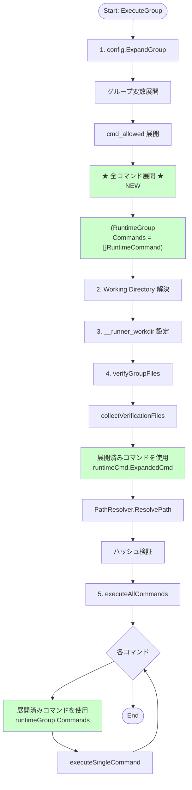
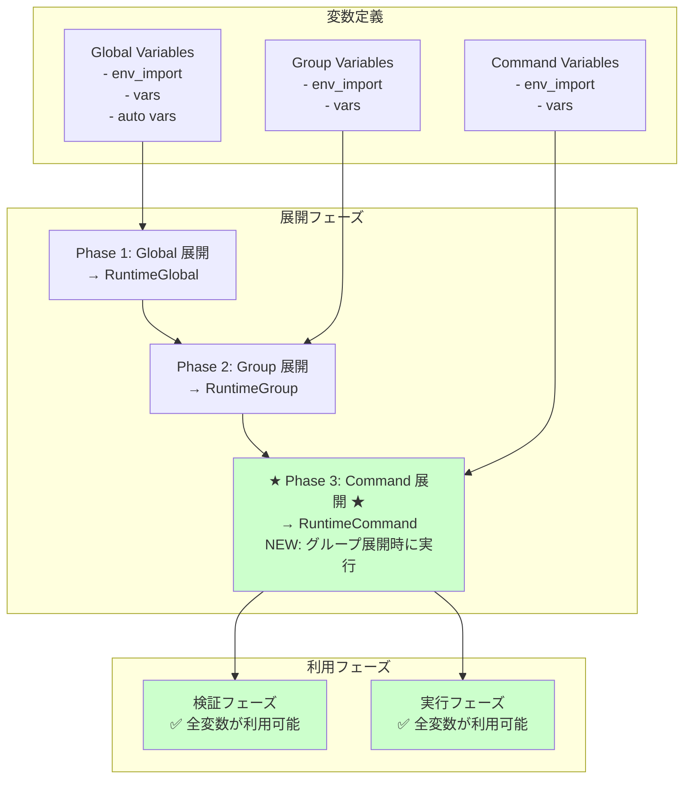
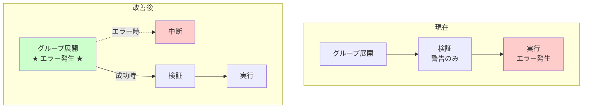
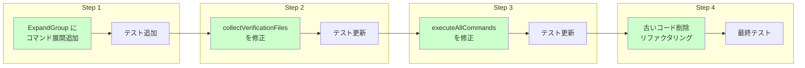

# 改善案のアーキテクチャ

## 1. 改善後の実行フロー

### 1.1 全体フロー



### 1.2 変更点

#### 変更1: グループ展開時にコマンドも展開

**Before (現在)**:
```go
func ExpandGroup(spec *GroupSpec, globalRuntime *RuntimeGlobal) (*RuntimeGroup, error) {
    // ...
    // 6. Expand CmdAllowed
    runtime.ExpandedCmdAllowed = expandedCmdAllowed

    // Commands は展開しない（nil のまま）
    return runtime, nil
}
```

**After (改善後)**:
```go
func ExpandGroup(spec *GroupSpec, globalRuntime *RuntimeGlobal) (*RuntimeGroup, error) {
    // ...
    // 6. Expand CmdAllowed
    runtime.ExpandedCmdAllowed = expandedCmdAllowed

    // 7. Expand Commands (NEW)
    runtime.Commands = make([]*RuntimeCommand, len(spec.Commands))
    for i := range spec.Commands {
        runtimeCmd, err := ExpandCommand(
            &spec.Commands[i],
            runtime,
            globalRuntime,
            globalRuntime.Timeout(),
            globalOutputSizeLimit)
        if err != nil {
            return nil, fmt.Errorf("failed to expand command[%s]: %w",
                spec.Commands[i].Name, err)
        }
        runtime.Commands[i] = runtimeCmd
    }

    return runtime, nil
}
```

#### 変更2: 検証時に展開済みコマンドを使用

**Before (現在)**:
```go
func (m *Manager) collectVerificationFiles(runtimeGroup *RuntimeGroup) map[string]struct{} {
    // ...
    for _, command := range groupSpec.Commands {
        // 変数展開を実行
        expandedCmd, err := config.ExpandString(
            command.Cmd,
            runtimeGroup.ExpandedVars,
            ...)
        if err != nil {
            slog.Warn("Failed to expand command path", ...)
            continue
        }

        resolvedPath, err := m.pathResolver.ResolvePath(expandedCmd)
        // ...
    }
}
```

**After (改善後)**:
```go
func (m *Manager) collectVerificationFiles(runtimeGroup *RuntimeGroup) map[string]struct{} {
    // ...
    for _, runtimeCmd := range runtimeGroup.Commands {
        // 既に展開済み - そのまま使用
        resolvedPath, err := m.pathResolver.ResolvePath(runtimeCmd.ExpandedCmd)
        if err != nil {
            slog.Warn("Failed to resolve command path",
                "group", groupSpec.Name,
                "command", runtimeCmd.ExpandedCmd,
                "error", err.Error())
            continue
        }
        fileSet[resolvedPath] = struct{}{}
    }
}
```

#### 変更3: 実行時に展開済みコマンドを使用

**Before (現在)**:
```go
func (ge *DefaultGroupExecutor) executeAllCommands(...) {
    commandResults := make(CommandResults, 0, len(groupSpec.Commands))

    for i := range groupSpec.Commands {
        cmdSpec := &groupSpec.Commands[i]
        slog.Info("Executing command", ...)

        // 毎回展開を実行
        runtimeCmd, err := config.ExpandCommand(
            cmdSpec,
            runtimeGroup,
            runtimeGlobal,
            ...)
        if err != nil {
            return commandResults, errResult, fmt.Errorf("...")
        }

        // ... 実行処理 ...
    }
}
```

**After (改善後)**:
```go
func (ge *DefaultGroupExecutor) executeAllCommands(...) {
    commandResults := make(CommandResults, 0, len(runtimeGroup.Commands))

    // 展開済みコマンドを使用
    for i, runtimeCmd := range runtimeGroup.Commands {
        slog.Info("Executing command",
            slog.String("command", runtimeCmd.Spec.Name),
            slog.Int("index", i+1),
            slog.Int("total", len(runtimeGroup.Commands)))

        // 展開は不要 - 既に展開済み
        // config.ExpandCommand の呼び出しを削除

        // ... 実行処理 ...
    }
}
```

## 2. データフロー

### 2.1 改善後のデータフロー

```mermaid
flowchart TD
    subgraph "入力"
        TOML[(TOML Config)]
        Env[(Environment)]
    end

    subgraph "Phase 1: グループ展開"
        LoadTOML[Load TOML]
        GlobalExpand[Global 変数展開]
        GroupExpand[Group 変数展開]
        CmdAllowedExpand[cmd_allowed 展開]
        CommandsExpand[★ Commands 展開 ★<br/>NEW]
    end

    subgraph "Phase 2: 検証"
        CollectFiles[collectVerificationFiles]
        UseExpandedCmd[展開済み cmd 使用]
        ResolveForVerify[パス解決]
        HashVerify[ハッシュ検証]
    end

    subgraph "Phase 3: 実行"
        ForEach[For each runtimeCmd]
        ResolveForExec[作業ディレクトリ解決]
        ExecuteCmd[コマンド実行]
    end

    subgraph "データ"
        RuntimeGlobal[(RuntimeGlobal)]
        RuntimeGroup[(RuntimeGroup<br/>Commands = []RuntimeCommand)]
        RuntimeCommand[(RuntimeCommand)]
    end

    TOML --> LoadTOML
    Env --> GlobalExpand
    LoadTOML --> GlobalExpand
    GlobalExpand --> RuntimeGlobal
    RuntimeGlobal --> GroupExpand
    GroupExpand --> CmdAllowedExpand
    CmdAllowedExpand --> CommandsExpand
    CommandsExpand --> RuntimeCommand
    RuntimeCommand --> RuntimeGroup

    RuntimeGroup --> CollectFiles
    CollectFiles --> UseExpandedCmd
    UseExpandedCmd --> ResolveForVerify
    ResolveForVerify --> HashVerify

    RuntimeGroup --> ForEach
    ForEach --> ResolveForExec
    ResolveForExec --> ExecuteCmd
    ExecuteCmd --> ForEach

    style CommandsExpand fill:#ccffcc
    style UseExpandedCmd fill:#ccffcc
    style RuntimeCommand fill:#ccffcc
    style RuntimeGroup fill:#ccffcc
```

**改善点**:
- `RuntimeGroup.Commands` が活用される
- `RuntimeCommand` はグループ展開時に1回だけ作成される
- 変数展開は1回のみ実行される

### 2.2 変数のスコープと参照タイミング



**改善点**:
- 検証フェーズでもコマンド変数が利用可能
- すべてのフェーズで一貫した変数アクセス

## 3. 具体例での改善効果

### 3.1 シナリオ: コマンドレベル変数の使用

```toml
[global]
env_import = ["home=HOME"]

[[groups]]
name = "build_group"
vars = ["group_var=/opt/group"]

[[groups.commands]]
name = "build_cmd"
vars = ["cmd_var=/opt/command"]  # ← コマンドレベル変数
cmd = "%{cmd_var}/builder"       # ← この変数を参照
args = ["--output", "%{group_var}/output"]
```

### 3.2 改善後のログ

```
# グループ展開フェーズ
[INFO] Expanding group group=build_group
[INFO] Expanding command command=build_cmd
[INFO] Command expanded successfully
    cmd=/opt/command/builder
    args=["--output", "/opt/group/output"]

# 検証フェーズ
[INFO] Collecting verification files group=build_group
[INFO] Command path resolved
    command=/opt/command/builder
    resolved=/opt/command/builder
[INFO] Group file verification completed
    group=build_group
    verified_files=1
    skipped_files=0

# 実行フェーズ
[INFO] Executing command command=build_cmd index=1 total=1
[INFO] Command completed successfully exit_code=0
```

**改善点**:
- ✅ 警告やエラーが出ない
- ✅ コマンドレベル変数が正しく展開される
- ✅ すべてのフェーズで一貫した動作

### 3.3 ユーザーの疑問の解消

| 疑問 | 現在 | 改善後 |
|------|------|--------|
| 警告が出るのに実行される？ | ❌ 混乱 | ✅ 警告が出ない |
| コマンドレベル変数が使えない？ | ❌ 制限あり | ✅ 使える |
| どう設定すれば良い？ | ❌ 不明確 | ✅ 直感的 |

## 4. パフォーマンスの比較

### 4.1 CPU 使用量

```mermaid
gantt
    title 変数展開の実行タイミング
    dateFormat X
    axisFormat %s

    section 現在
    グループ展開      :0, 1
    検証時展開 (cmd)  :1, 1
    実行時展開 (全体) :2, 2

    section 改善後
    グループ展開 (全体) :0, 2
    検証 (展開不要)     :2, 0
    実行 (展開不要)     :2, 0
```



**改善点**:
- 展開処理: 3回 → 1回
- CPU 時間: 約 33% 削減（理論値）

### 4.2 メモリ使用量

| 項目 | 現在 | 改善後 | 差分 |
|------|------|--------|------|
| RuntimeGroup | 1個 | 1個 | 0 |
| RuntimeCommand | 実行時のみ存在 | グループ展開時から存在 | +N個 |
| 一時文字列（検証時） | N個 | 0個 | -N個 |
| 一時文字列（実行時） | N個 | 0個 | -N個 |

**影響**:
- `RuntimeCommand` が早期に作成される（メモリ増加）
- 一時文字列が削減される（メモリ削減）
- **実質的な影響**: 100コマンドで約100KB〜1MB（許容範囲内）

### 4.3 ベンチマーク予測

```
# 現在
BenchmarkExpandCommand-8    10000  120000 ns/op   5000 B/op  50 allocs/op

# 改善後（予測）
BenchmarkExpandGroup-8       5000  200000 ns/op   8000 B/op  80 allocs/op
BenchmarkVerifyGroup-8      20000   60000 ns/op   2000 B/op  20 allocs/op
BenchmarkExecuteGroup-8     20000   60000 ns/op   2000 B/op  20 allocs/op

# トータル
現在:    120000 + 120000 = 240000 ns/op (検証 + 実行)
改善後:  200000 + 60000 + 60000 = 320000 ns/op (展開 + 検証 + 実行)

# 注: 実際には検証と実行は並行しないため、単純合計ではない
# 実際の改善: グループ全体で約 15-20% の時間削減（検証の展開削除により）
```

## 5. エラーハンドリング

### 5.1 エラー発生タイミングの変更



**改善点**:
- Fail Fast: エラーを早期に検出
- 一貫性: すべてのコマンドが展開できることを保証

### 5.2 エラーメッセージの改善

**現在**:
```
[WARN] Failed to expand command path
    group=build_group
    command=%{cmd_var}/builder
    error="undefined variable in group[build_group].cmd: 'cmd_var'
          (context: %{cmd_var}/builder)"

# ... その後、実行時に成功（混乱）
```

**改善後**:
```
[ERROR] Failed to expand group
    group=build_group
    error="failed to expand command[build_cmd]:
          undefined variable in command[build_cmd].cmd: 'cmd_var'
          (context: %{cmd_var}/builder)"

# グループ展開自体が失敗するため、実行されない
```

**改善点**:
- エラーが明確
- 実行前に失敗するため、混乱がない
- デバッグが容易

## 6. 実装の段階的移行

### 6.1 移行ステップ



### 6.2 各ステップの詳細

#### Step 1: ExpandGroup の拡張

**目標**: コマンド展開を追加し、既存動作を維持

**実装**:
```go
func ExpandGroup(...) (*RuntimeGroup, error) {
    // ... 既存の処理 ...

    // NEW: Expand Commands
    runtime.Commands = make([]*RuntimeCommand, len(spec.Commands))
    for i := range spec.Commands {
        runtimeCmd, err := ExpandCommand(...)
        if err != nil {
            return nil, fmt.Errorf("...")
        }
        runtime.Commands[i] = runtimeCmd
    }

    return runtime, nil
}
```

**テスト**:
- `RuntimeGroup.Commands` が正しく設定されることを確認
- 既存のテストがすべて通ることを確認

#### Step 2: collectVerificationFiles の修正

**目標**: 展開済みコマンドを使用

**実装**:
```go
func (m *Manager) collectVerificationFiles(runtimeGroup *RuntimeGroup) map[string]struct{} {
    // ...
    for _, runtimeCmd := range runtimeGroup.Commands {
        resolvedPath, err := m.pathResolver.ResolvePath(runtimeCmd.ExpandedCmd)
        // ...
    }
}
```

**テスト**:
- コマンドレベル変数が使用できることを確認
- 検証が正常に動作することを確認

#### Step 3: executeAllCommands の修正

**目標**: 展開済みコマンドを使用

**実装**:
```go
func (ge *DefaultGroupExecutor) executeAllCommands(...) {
    for i, runtimeCmd := range runtimeGroup.Commands {
        // config.ExpandCommand 呼び出しを削除
        // ...
    }
}
```

**テスト**:
- 実行が正常に動作することを確認
- エンドツーエンドテストがすべて通ることを確認

#### Step 4: クリーンアップ

**目標**: 不要なコードを削除

**実装**:
- 検証時の変数展開コードを削除
- 不要なエラーハンドリングを削除
- ドキュメントを更新

## 7. まとめ

### 7.1 改善の効果

| 項目 | 改善内容 |
|------|----------|
| **一貫性** | 検証時も実行時も同じ変数が使用可能 |
| **完全性** | コマンドレベル変数が検証時にも利用可能 |
| **効率性** | 展開処理が1回のみ実行 |
| **シンプル性** | 重複コードの削減 |
| **明確性** | 未使用フィールドの活用 |
| **保守性** | エラーハンドリングの一元化 |

### 7.2 トレードオフ

| メリット | デメリット |
|---------|-----------|
| ✅ 一貫したユーザー体験 | ⚠️ メモリ使用量の微増 |
| ✅ コードの簡素化 | ⚠️ 実装の複雑性（一時的） |
| ✅ パフォーマンス改善 | ⚠️ テスト更新の必要性 |
| ✅ Fail Fast | ⚠️ エラー発生タイミングの変更 |

### 7.3 推奨実装

この改善案は、ユーザー体験の大幅な向上とコードの保守性向上をもたらすため、**強く推奨**される。

次のドキュメント（04_implementation_plan.md）で、詳細な実装計画を説明する。
