# コマンドテンプレート機能 - アーキテクチャ設計書

## 1. システム概要

### 1.1 目的

コマンドテンプレート機能は、TOML 設定ファイル内で繰り返し使用されるコマンド定義を一元化し、再利用性と保守性を向上させる。

### 1.2 設計原則

1. **既存アーキテクチャとの一貫性**: 現在の `%{var}` 変数展開と同様の段階的処理モデルを採用
2. **Defense in Depth**: 入力検証→展開処理→出力検証の多層防御
3. **Fail-Safe Defaults**: 不明確な入力はエラーとして拒否
4. **YAGNI**: 必要最小限の機能に絞り、将来の拡張ポイントを残す

## 2. 全体アーキテクチャ

### 2.1 コンポーネント構成図

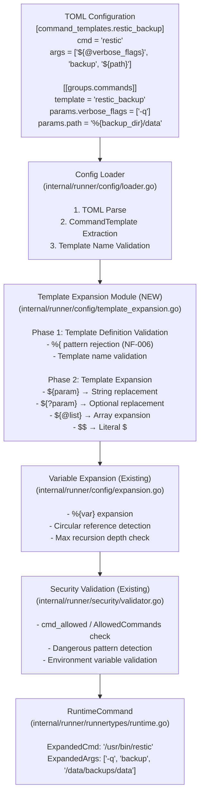

### 2.2 データフロー図

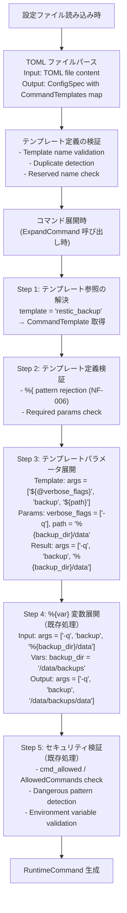

## 3. モジュール構成

### 3.1 新規モジュール

```
internal/runner/
├── config/
│   ├── loader.go                    # 修正: テンプレート読み込み追加
│   ├── template_expansion.go        # 新規: テンプレート展開ロジック
│   ├── template_expansion_test.go   # 新規: テンプレート展開テスト
│   └── expansion.go                 # 修正: ExpandCommand にテンプレート統合
└── runnertypes/
    └── spec.go                      # 修正: CommandTemplate 型追加
```

### 3.2 モジュール間の依存関係

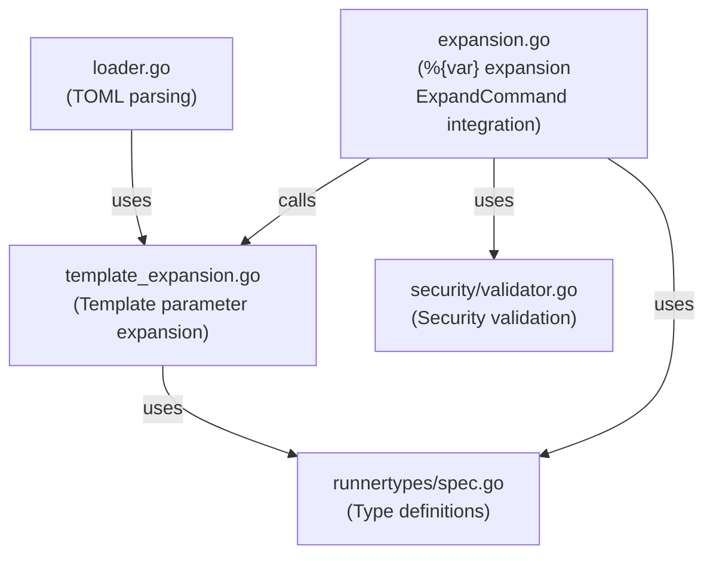

## 4. 展開処理の設計

### 4.1 二段階展開モデル

テンプレート機能では、以下の二段階で展開処理を行う：

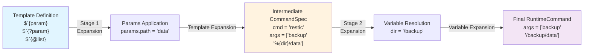

### 4.2 展開記法の比較

| 記法 | Stage | 用途 | 再帰展開 | データソース |
|------|-------|------|----------|--------------|
| `${param}` | 1 | 文字列パラメータ | No | params |
| `${?param}` | 1 | オプショナルパラメータ | No | params |
| `${@list}` | 1 | 配列パラメータ | No | params |
| `%{var}` | 2 | 内部変数参照 | Yes | vars, env_import |

### 4.3 セキュリティ境界

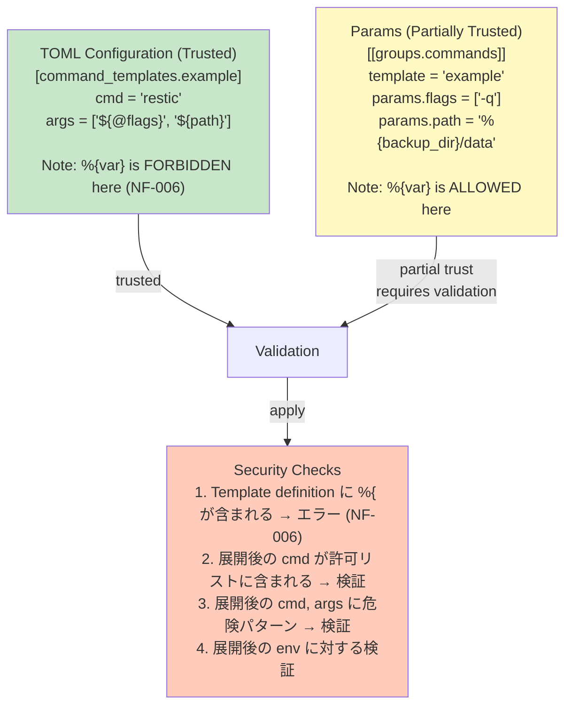

## 5. 型システム設計

### 5.1 主要な型の関係

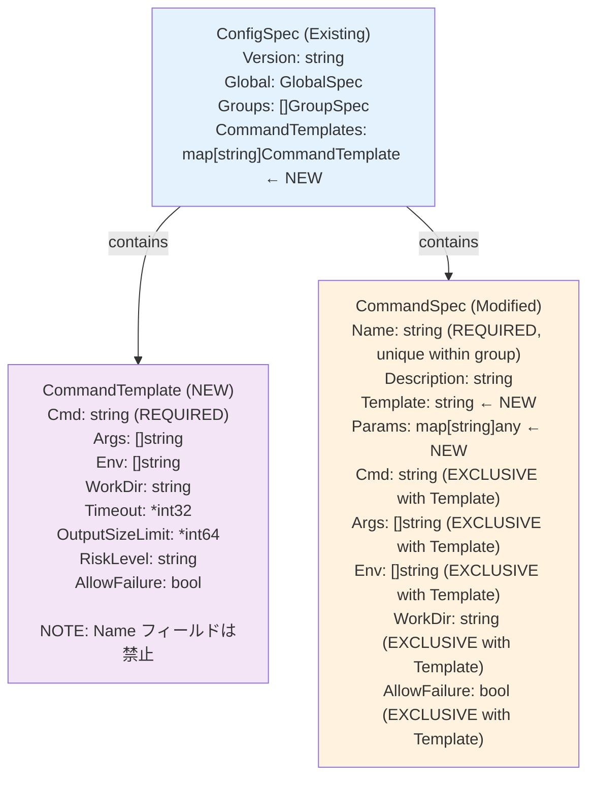

### 5.2 Params の型表現

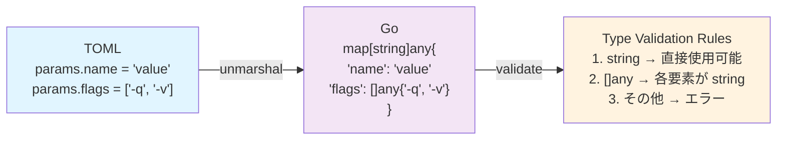

## 6. エラーハンドリング設計

### 6.1 エラー階層

```mermaid
graph TD
    A["TemplateError"]
    B["ErrTemplateNotFound"]
    C["ErrDuplicateTemplateName"]
    D["ErrReservedTemplateName"]
    E["ErrTemplateFieldConflict"]
    F1["ErrTemplateContainsNameField"]
    F2["ErrTemplateContainsForbiddenPattern"]

    F["ParamError"]
    G["ErrRequiredParamMissing"]
    H["ErrTypeMismatch"]
    I["ErrInvalidArrayElement"]
    J["ErrUnsupportedParamType"]
    K["ErrInvalidParamName"]
    L["ErrUnusedParam (Warning)"]

    M["ExpansionError"]
    N["ErrUnclosedPlaceholder"]
    O1["ErrEmptyPlaceholder"]
    P1["ErrEmptyPlaceholderName"]
    Q1["ErrInvalidPlaceholderName"]
    R1["ErrArrayInMixedContext"]
    S1["ErrMultipleValuesInStringContext"]

    T["CommandSpecError"]
    U["ErrTemplateAndCmdConflict"]
    V["ErrTemplateAndArgsConflict"]
    W["ErrTemplateAndEnvConflict"]
    X["ErrTemplateAndWorkdirConflict"]
    Y["ErrTemplateAndAllowFailureConflict"]

    A --> B
    A --> C
    A --> D
    A --> E
    A --> F1
    A --> F2

    F --> G
    F --> H
    F --> I
    F --> J
    F --> K
    F --> L

    M --> N
    M --> O1
    M --> P1
    M --> Q1
    M --> R1
    M --> S1

    T --> U
    T --> V
    T --> W
    T --> X
    T --> Y

    style A fill:#ffebee
    style F fill:#ffebee
    style M fill:#ffebee
    style T fill:#ffebee
```

### 6.2 エラーメッセージのフォーマット

```
┌─────────────────────────────────────────────────────────────────────────────┐
│  Error Message Format:                                                      │
│                                                                             │
│  [context] [field]: [error type]: [details]                                │
│                                                                             │
│  Examples:                                                                  │
│  ─────────────────────────────────────────────────────────────────          │
│  group[backup] command[daily]: template "restic_backup" not found          │
│                                                                             │
│  template "echo_var" contains forbidden pattern "%{" in args[0]:           │
│  variable references are not allowed in template definitions for           │
│  security reasons (see NF-006)                                              │
│                                                                             │
│  group[backup] command[daily]: required parameter "backup_path" not        │
│  provided for template "restic_backup"                                      │
│                                                                             │
│  WARNING: group[backup] command[daily]: unused parameter "extra"           │
│  in template "restic_backup"                                                │
│                                                                             │
│  template definition "restic_backup" cannot contain "name" field            │
│                                                                             │
│  group[backup] command[daily]: cannot specify both "template" and "cmd"    │
│  fields in command definition                                               │
│                                                                             │
│  group[backup] command[daily]: cannot specify both "template" and "args"   │
│  fields in command definition                                               │
│                                                                             │
└─────────────────────────────────────────────────────────────────────────────┘
```

## 7. 後方互換性

### 7.1 既存機能への影響

```
┌─────────────────────────────────────────────────────────────────────────────┐
│                    Backward Compatibility Matrix                            │
│                                                                             │
│  既存機能                        影響    対応                               │
│  ──────────────────────────────────────────────────────────────────         │
│  [[groups.commands]] (従来形式)   なし   template なしで従来通り動作        │
│  %{var} 変数展開                 なし   Stage 2 で従来通り処理              │
│  env_import                      なし   変更なし                            │
│  cmd_allowed                     なし   展開後の cmd に対して検証           │
│  security validation             なし   展開後に従来通り検証                │
│  verify_files                    なし   変更なし                            │
│                                                                             │
│  ┌───────────────────────────────────────────────────────────────────────┐  │
│  │  既存の TOML ファイルは無修正で動作する                               │  │
│  │  command_templates セクションは完全にオプショナル                     │  │
│  └───────────────────────────────────────────────────────────────────────┘  │
│                                                                             │
└─────────────────────────────────────────────────────────────────────────────┘
```

### 7.2 段階的移行パス

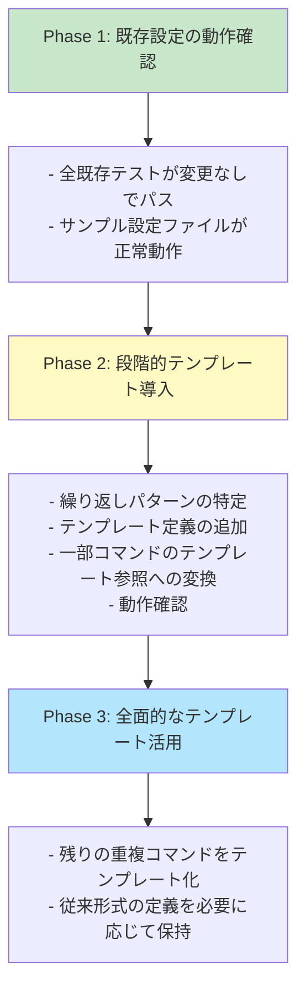

## 8. テスト戦略

### 8.1 テストピラミッド

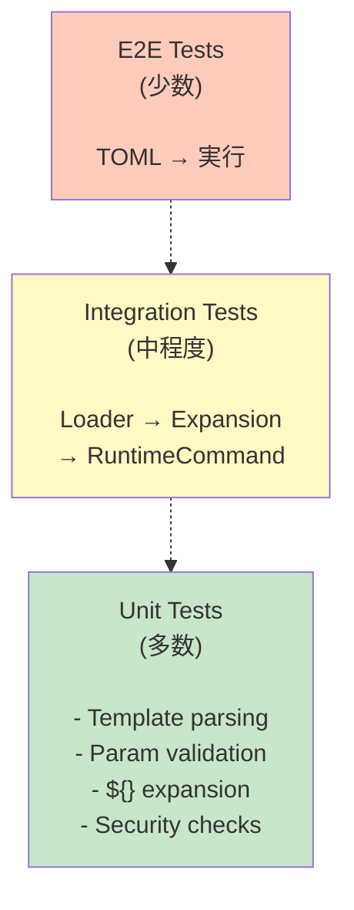

### 8.2 テストカテゴリ

```
┌─────────────────────────────────────────────────────────────────────────────┐
│                         Test Categories                                     │
│                                                                             │
│  1. Parsing Tests                                                           │
│     - Valid template definitions                                            │
│     - Invalid template names                                                │
│     - Duplicate template names                                              │
│     - Reserved names rejection                                              │
│                                                                             │
│  2. Expansion Tests                                                         │
│     - ${param} string replacement                                           │
│     - ${?param} optional replacement (empty → remove)                       │
│     - ${@list} array expansion                                              │
│     - $$ literal escape                                                     │
│     - Mixed placeholders                                                    │
│     - Non-recursive expansion                                               │
│                                                                             │
│  3. Validation Tests                                                        │
│     - Required params missing                                               │
│     - Unused params warning                                                 │
│     - %{ pattern rejection                                                  │
│     - Command injection patterns                                            │
│     - Type mismatch errors                                                  │
│                                                                             │
│  4. Integration Tests                                                       │
│     - Template + %{var} combined expansion                                  │
│     - Security validation after expansion                                   │
│     - cmd_allowed check after expansion                                     │
│                                                                             │
│  5. Backward Compatibility Tests                                            │
│     - All existing tests pass unchanged                                     │
│     - Sample configs work without modification                              │
│                                                                             │
└─────────────────────────────────────────────────────────────────────────────┘
```

## 9. 将来の拡張ポイント

### 9.1 スコープ外だが拡張可能な機能

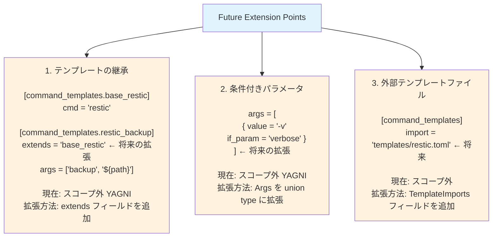

## 10. 設計決定の記録

### 10.1 主要な設計決定

| 決定事項 | 選択 | 根拠 |
|----------|------|------|
| パラメータ記法 | `${}`, `${?}`, `${@}` | Shell/Ruby との類似性、直感的 |
| 展開順序 | テンプレート → %{var} | 実装がシンプル、一貫性が高い（案2採用、ADR参照） |
| テンプレート定義での %{ | 禁止 | セキュリティ（コンテキスト依存リスク防止, NF-006） |
| params での %{ | 許可 | 柔軟性（ローカル変数参照を明示的に指定） |
| 再帰展開 | 非再帰 | DoS 防止（Billion Laughs 類似攻撃） |
| 未使用 params | 警告のみ | 厳格すぎるとリファクタリングが困難 |
| テンプレート配置 | groups より前 | TOML の解析順序、可読性 |
| テンプレート定義での name | 禁止 | name は呼び出し側で指定（同じテンプレートから複数コマンドを区別） |
| template と cmd/args/env等 | 排他的（エラー） | シンプルさ優先、YAGNI（案A採用、部分上書きは将来拡張可能） |
| name フィールドの必須性 | 常に必須 | 既存仕様との一貫性、グループ内でユニーク識別が必要 |

### 10.2 トレードオフ

```
┌─────────────────────────────────────────────────────────────────────────────┐
│                         Trade-offs                                          │
│                                                                             │
│  シンプルさ vs 柔軟性                                                       │
│  ─────────────────────────────────────────────────────────────              │
│  選択: シンプルさ優先                                                       │
│  影響: 継承機能や条件分岐は非サポート                                       │
│  理由: YAGNI、初期リリースでの安定性重視                                    │
│                                                                             │
│  セキュリティ vs 利便性                                                     │
│  ─────────────────────────────────────────────────────────────              │
│  選択: セキュリティ優先                                                     │
│  影響: テンプレート定義で %{} 使用不可 (NF-006)                               │
│  理由: インジェクション攻撃の完全防止                                       │
│                                                                             │
│  厳格さ vs 寛容さ                                                           │
│  ─────────────────────────────────────────────────────────────              │
│  選択: バランス（エラー/警告の使い分け）                                    │
│  影響: 未使用 params は警告のみ、必須 params 欠如はエラー                   │
│  理由: 開発者体験とエラー検出のバランス                                     │
│                                                                             │
└─────────────────────────────────────────────────────────────────────────────┘
```
