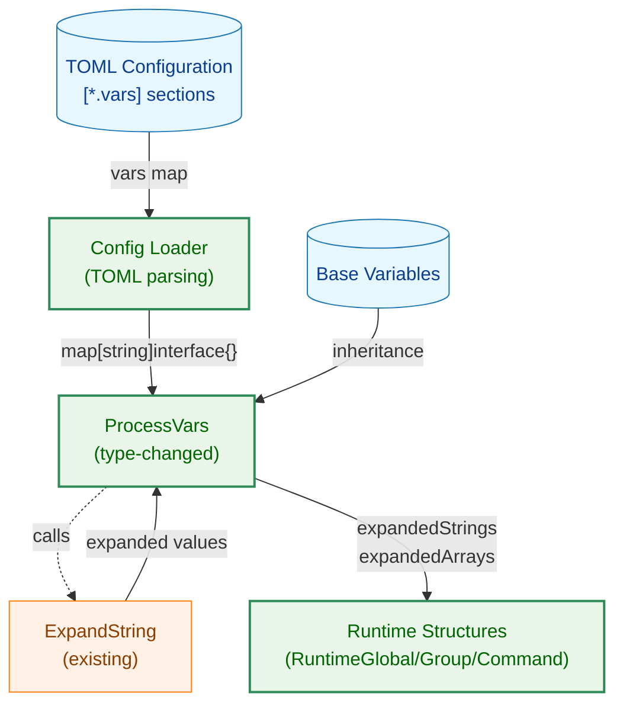
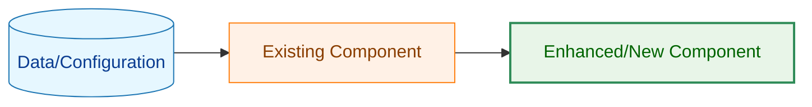
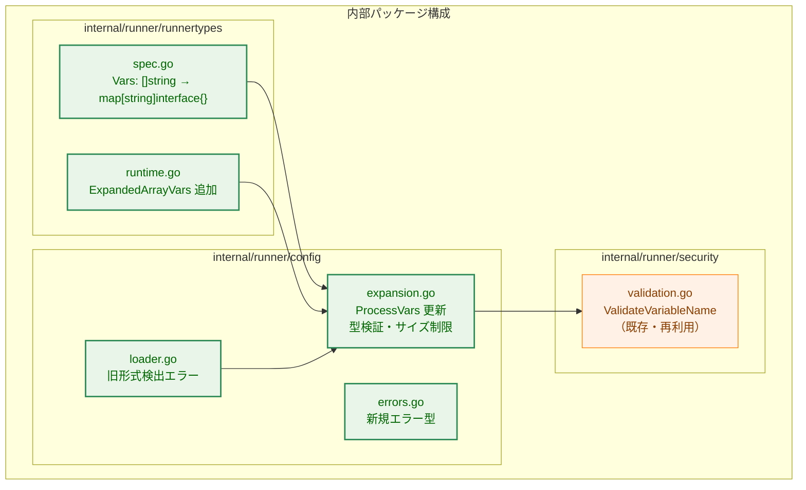
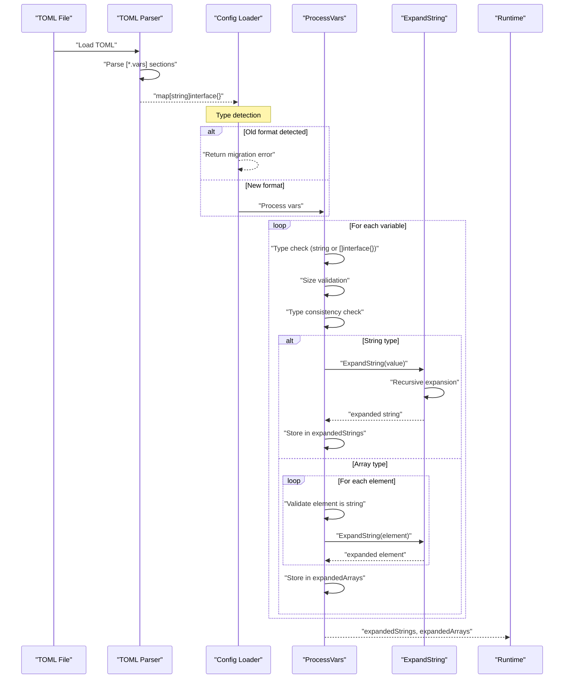
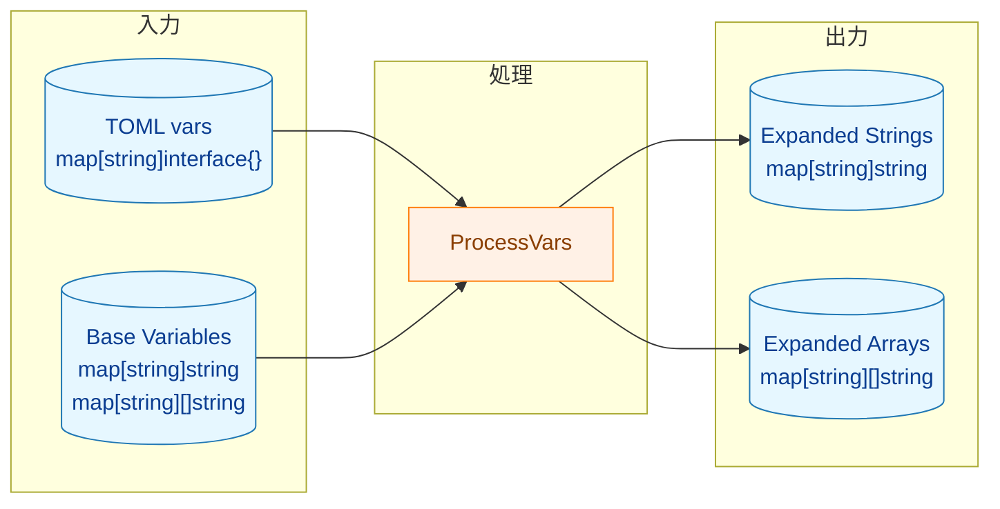
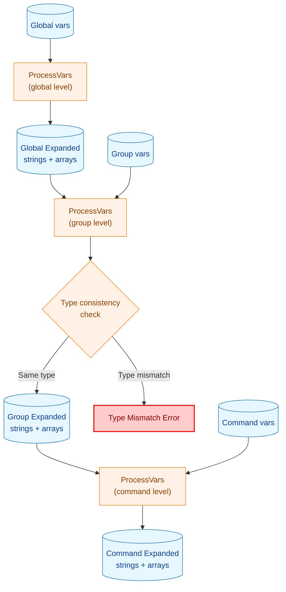
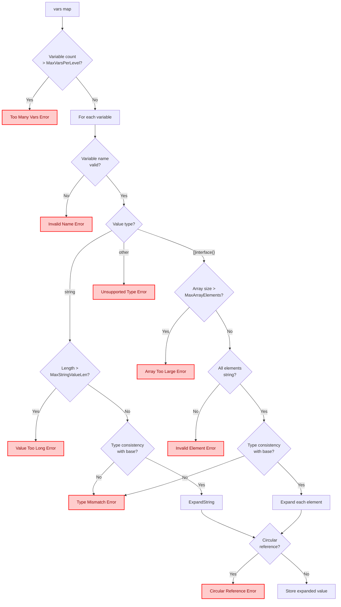
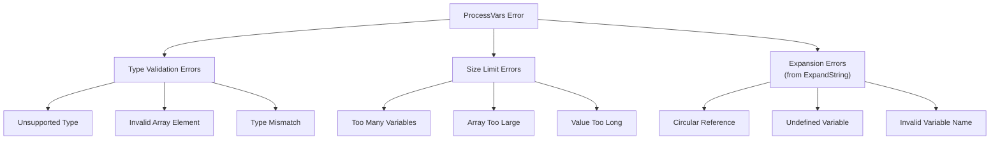
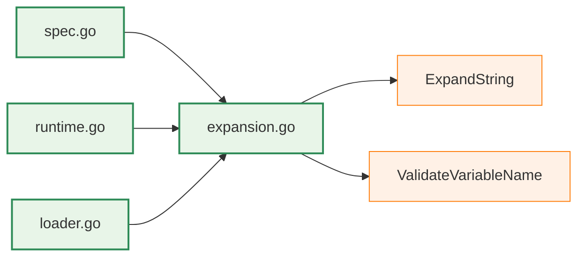

# アーキテクチャ設計書: vars テーブル形式への変更

## 1. システム概要

### 1.1 アーキテクチャ目標

- 既存の変数展開機能（`ExpandString`）の完全な再利用
- 配列ベース形式からテーブル形式への移行（後方互換性なし）
- 文字列型と文字列配列型の両方をサポート
- セキュリティの堅牢性確保（型検証、サイズ制限、循環依存検出）
- 既存の処理フローへの影響最小化

### 1.2 設計原則

- **既存活用**: `ExpandString` 関数の再帰展開機能を再利用
- **セキュリティファースト**: 型検証・サイズ制限を展開前に実施、意味的検証は使用時点で実施
- **最小変更**: `ProcessVars` 関数の入力型変更のみ
- **一貫性**: global、group、command の全レベルで同じテーブル形式

## 2. システム構成

### 2.1 全体アーキテクチャ



**凡例（Legend）**



### 2.2 コンポーネント配置



### 2.3 データフロー



## 3. コンポーネント設計

### 3.1 データフローの概要

変数処理は以下の流れで行われる：



### 3.2 型分離の設計

配列変数と文字列変数を別のマップで管理することで、型安全性を確保する：

| 格納先 | 型 | 用途 |
|--------|-----|------|
| `ExpandedVars` | `map[string]string` | 文字列変数（既存） |
| `ExpandedArrayVars` | `map[string][]string` | 配列変数（新規） |

**設計理由**:
1. `map[string]interface{}` を避け、型安全性を向上
2. 使用時に型アサーション不要
3. 文字列変数と配列変数の混同を防止

### 3.3 変数継承と型整合性



### 3.4 継承の階層構造

```
Global Level
├── ExpandedVars (strings)
├── ExpandedArrayVars (arrays)
│
└── Group Level (inherits from global)
    ├── ExpandedVars (global + group strings)
    ├── ExpandedArrayVars (global + group arrays)
    │
    └── Command Level (inherits from group)
        ├── ExpandedVars (global + group + command strings)
        └── ExpandedArrayVars (global + group + command arrays)
```

## 4. セキュリティアーキテクチャ

### 4.1 セキュリティ処理フロー



### 4.2 セキュリティレイヤー

| レイヤー | 検証内容 | 実施タイミング |
|---------|---------|---------------|
| 構造検証 | 変数名バリデーション、型検証、サイズ制限 | vars定義時（ProcessVars） |
| 展開検証 | 循環依存検出、未定義変数検出 | 変数展開時（ExpandString） |
| 意味検証 | 危険パターン検出、パス検証 | 使用時点（cmd, args, env等） |

### 4.3 制限値

| リソース | 制限値 | 定数名 |
|---------|--------|--------|
| 変数数/レベル | 1000 | `MaxVarsPerLevel` |
| 配列要素数/変数 | 1000 | `MaxArrayElements` |
| 文字列長/値 | 10KB | `MaxStringValueLen` |
| 展開深度 | 100 | `MaxRecursionDepth`（既存） |

### 4.4 脅威と対策

| 脅威 | 対策 |
|------|------|
| 大量変数によるDoS | `MaxVarsPerLevel` による制限 |
| 大量配列要素によるDoS | `MaxArrayElements` による制限 |
| 長大文字列によるメモリ枯渇 | `MaxStringValueLen` による制限 |
| 循環依存による無限ループ | `MaxRecursionDepth` と visited マップ（既存） |
| 型の不整合によるバグ | 型整合性検証（上書き時） |
| 不正な変数名 | `ValidateVariableName`（既存） |

## 5. TOML 構造設計

### 5.1 新しいTOML構造

```toml
# Global level
[global.vars]
base_dir = "/opt/myapp"
env_type = "production"
config_files = ["%{base_dir}/config.yml", "%{base_dir}/secrets.yml"]

# Group level
[[groups]]
name = "deploy"

[groups.vars]
deploy_target = "production"
deploy_path = "/var/www/%{deploy_target}"

# Command level
[[groups.commands]]
name = "backup"
cmd = "/usr/bin/cp"

[groups.commands.vars]
backup_suffix = ".bak"
```

### 5.2 TOML パース結果の型

| TOML値 | Go型 | 処理 |
|--------|------|------|
| `"string"` | `string` | そのまま ExpandString |
| `["a", "b"]` | `[]interface{}` | 各要素を string に変換後 ExpandString |
| `123` | `int64` | エラー（非サポート） |
| `true` | `bool` | エラー（非サポート） |

## 6. パフォーマンス設計

### 6.1 性能最適化戦略

- **一回のみの展開**: 設定ファイル読み込み時に全変数を展開
- **既存実装の再利用**: `ExpandString` の効率的な再帰展開
- **最小限のメモリコピー**: `maps.Clone` による効率的な継承

### 6.2 パフォーマンス要件

| メトリクス | 目標値 | 根拠 |
|----------|-------|------|
| 変数展開時間（変数あたり） | < 1ms | 既存 ExpandString の実績 |
| 配列展開時間（要素あたり） | < 0.1ms | 文字列展開と同等 |
| メモリ増加量 | < 20% | 配列変数の追加分 |

### 6.3 スケーラビリティ

- **変数数**: 通常数個〜数十個、最大1000個/レベル
- **配列要素数**: 通常数個〜数十個、最大1000個/変数
- **展開深度**: 最大100（既存制限）

## 7. エラーハンドリング設計

### 7.1 エラー階層



### 7.2 エラーメッセージ設計原則

- 変数名は常に `%q` で引用符付き表示
- エラー発生箇所を特定可能（レベル、フィールド名、インデックス）
- 期待値と実際の値を表示
- 可能な場合は修正方法のヒントを提供

## 8. 段階的実装計画

### 8.1 Phase 1: 型定義の変更

- [ ] `spec.go`: `Vars` フィールドを `map[string]interface{}` に変更
- [ ] `runtime.go`: `ExpandedArrayVars` フィールドを追加
- [ ] TOML パース時の型変換テスト

### 8.2 Phase 2: 変数展開ロジックの更新

- [ ] `expansion.go`: 制限値定数の追加
- [ ] `expansion.go`: `ProcessVars` のシグネチャ変更
- [ ] `expansion.go`: 型検証・サイズ検証・型整合性検証の実装
- [ ] `expansion.go`: 配列変数の展開処理
- [ ] `errors.go`: 新規エラー型の追加

### 8.3 Phase 3: 統合とテスト

- [ ] `loader.go`: 旧形式検出エラーの実装
- [ ] `ExpandGlobal`, `ExpandGroup`, `ExpandCommand` の更新
- [ ] 単体テスト・統合テストの作成

### 8.4 Phase 4: サンプルとドキュメント

- [ ] `sample/*.toml`: 全サンプルファイルの更新
- [ ] `cmd/runner/testdata/*.toml`: テストデータの更新
- [ ] ドキュメントの更新

## 9. 依存関係とリスク

### 9.1 内部依存関係



### 9.2 リスクと対策

| リスク | 影響度 | 対策 |
|-------|-------|------|
| 型アサーションエラー | 高 | type switch による安全な型判定 |
| 既存設定ファイルの破壊 | 高 | 明確なエラーメッセージと移行ガイド |
| 配列変数の誤用 | 中 | 型整合性検証による早期エラー検出 |
| map の反復順序 | 低 | 順序非依存の設計（既存） |

### 9.3 後方互換性

**後方互換性は維持しない**（要件定義書に基づく決定）

- 旧形式の設定ファイルは TOML パースエラー
- エラーメッセージで新形式への移行を案内
- 移行ツールは別タスクとして検討

## 10. 監視・運用設計

### 10.1 ログ出力

| レベル | 内容 |
|--------|------|
| Debug | 変数展開の詳細（展開前後の値） |
| Info | 設定ファイル読み込み成功 |
| Warn | 制限値に近づいた場合（例: 変数数800超） |
| Error | 展開エラー、型エラー、制限超過 |

### 10.2 トラブルシューティング

| 問題 | 原因 | 対処 |
|------|------|------|
| パースエラー | 旧形式の設定ファイル | テーブル形式に移行 |
| 型不整合エラー | 異なる型での変数上書き | 型を統一するか変数名を変更 |
| 循環依存エラー | 変数間の循環参照 | 依存関係を見直し |
| 未定義変数エラー | 存在しない変数の参照 | 変数定義を追加 |
