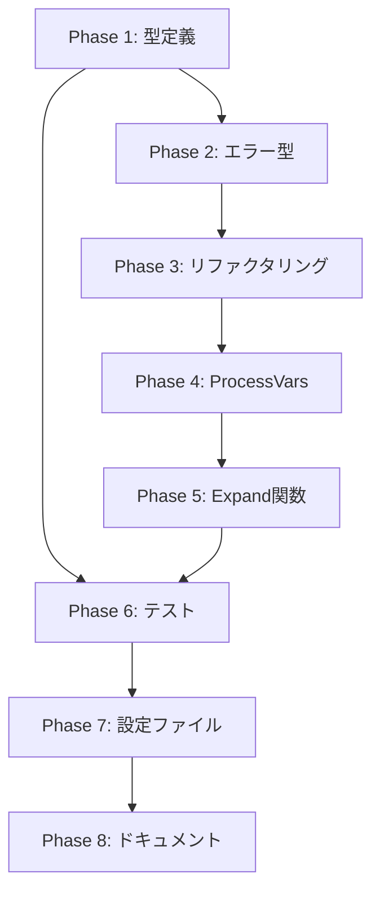

# 実装計画書: vars テーブル形式への変更

## 0. 概要

本ドキュメントは、`vars` フィールドを配列ベース形式（`vars = ["key=value"]`）からテーブル形式（`[*.vars]` セクション）に変更する実装計画を定義する。

### 関連ドキュメント

- 要件定義書: `01_requirements.md`
- アーキテクチャ設計書: `02_architecture.md`
- 詳細仕様書: `03_detailed_specification.md`

### 変更の目的

1. 文字列と文字列配列の両方をサポート（コマンドテンプレート機能対応）
2. TOMLネイティブの型システムを活用
3. パース処理の簡略化

## 1. 実装フェーズ

### Phase 1: 型定義の変更

**目標**: データ構造を新形式に対応させる

#### 1.1 spec.go の変更

| 項目 | 変更内容 |
|------|---------|
| `GlobalSpec.Vars` | `[]string` → `map[string]interface{}` |
| `GroupSpec.Vars` | `[]string` → `map[string]interface{}` |
| `CommandSpec.Vars` | `[]string` → `map[string]interface{}` |

**コード変更例**:
```go
// Before
Vars []string `toml:"vars"`

// After
Vars map[string]interface{} `toml:"vars"`
```

**コメント更新**: 各フィールドのGoDocコメントを更新し、新しいTOML形式の例を記載

#### 1.2 runtime.go の変更

| 項目 | 変更内容 |
|------|---------|
| `RuntimeGlobal` | `ExpandedArrayVars map[string][]string` フィールド追加 |
| `RuntimeGroup` | `ExpandedArrayVars map[string][]string` フィールド追加 |
| `RuntimeCommand` | `ExpandedArrayVars map[string][]string` フィールド追加 |

**コンストラクタ更新**:
- `NewRuntimeGlobal`: `ExpandedArrayVars` を `make(map[string][]string)` で初期化
- `NewRuntimeGroup`: `ExpandedArrayVars` を `make(map[string][]string)` で初期化
- `NewRuntimeCommand`: `ExpandedArrayVars` を `make(map[string][]string)` で初期化

### Phase 2: エラー型の追加

**目標**: 新しい検証エラーを適切に報告するエラー型を定義

#### 2.1 errors.go に追加するエラー型

| エラー型 | 用途 |
|---------|------|
| `ErrTooManyVariablesDetail` | 変数数が `MaxVarsPerLevel` を超過 |
| `ErrTypeMismatchDetail` | 継承時の型不一致（string ↔ array） |
| `ErrValueTooLongDetail` | 文字列値が `MaxStringValueLen` を超過 |
| `ErrArrayTooLargeDetail` | 配列要素数が `MaxArrayElements` を超過 |
| `ErrInvalidArrayElementDetail` | 配列要素が文字列以外の型 |
| `ErrArrayElementTooLongDetail` | 配列要素が `MaxStringValueLen` を超過 |
| `ErrUnsupportedTypeDetail` | サポートされていない型（int, bool等） |
| `ErrArrayVariableInStringContextDetail` | 配列変数を文字列コンテキストで参照 |

#### 2.2 既存エラー型の拡張

- `ErrUndefinedVariableDetail`: `Chain []string` フィールドを追加（展開パスの表示用）

### Phase 3: 変数展開ロジックのリファクタリング

**目標**: 既存の `expandStringRecursive` と新規の `varExpander` でコードを共有

#### 3.1 共通展開ロジックの抽出

**新規追加**:
```go
// variableResolver は変数名を展開値に解決する関数型
type variableResolver func(
    varName string,
    field string,
    visited map[string]struct{},
    expansionChain []string,
    depth int,
) (string, error)

// expandStringWithResolver は共通の変数展開ロジック
func expandStringWithResolver(
    input string,
    resolver variableResolver,
    level string,
    field string,
    visited map[string]struct{},
    expansionChain []string,
    depth int,
) (string, error)
```

#### 3.2 既存関数のリファクタリング

- `expandStringRecursive`: `expandStringWithResolver` を呼び出すラッパーに変更
- 既存の `ExpandString` のシグネチャと動作は維持（後方互換性）

#### 3.3 varExpander 構造体の追加

```go
type varExpander struct {
    expandedVars map[string]string      // 展開済み変数（メモ化用）
    rawVars      map[string]interface{} // 未展開変数
    level        string                  // エラーメッセージ用コンテキスト
}

func newVarExpander(...) *varExpander
func (e *varExpander) expandString(input, field string) (string, error)
func (e *varExpander) resolveVariable(...) (string, error)
```

### Phase 4: ProcessVars の更新

**目標**: 新しい型とシグネチャで変数処理を実装

#### 4.1 シグネチャ変更

```go
// Before
func ProcessVars(vars []string, baseExpandedVars map[string]string, level string) (map[string]string, error)

// After
func ProcessVars(
    vars map[string]interface{},
    baseExpandedVars map[string]string,
    baseExpandedArrays map[string][]string,
    level string,
) (map[string]string, map[string][]string, error)
```

#### 4.2 処理フロー

**Phase A: 検証とパース**
1. 変数数制限チェック（`MaxVarsPerLevel`）
2. 各変数について:
   - 変数名バリデーション（`ValidateVariableName`）
   - 型整合性チェック（base変数との型一致）
   - 値の型検証（string or []interface{}）
   - サイズ制限チェック（文字列長、配列要素数）
3. 文字列変数と配列変数を分離

**Phase B: 遅延展開**
1. `varExpander` を生成
2. 文字列変数を展開（順序非依存）
3. 配列変数の各要素を展開

#### 4.3 制限値定数の追加

```go
const (
    MaxVarsPerLevel   = 1000      // 変数数/レベル
    MaxArrayElements  = 1000      // 配列要素数/変数
    MaxStringValueLen = 10 * 1024 // 文字列長/値 (10KB)
)
```

### Phase 5: Expand関数群の更新

**目標**: `ExpandGlobal`, `ExpandGroup`, `ExpandCommand` を新形式に対応

#### 5.1 ExpandGlobal

- `ProcessVars` の呼び出しを新シグネチャに更新
- `ExpandedArrayVars` の設定を追加

#### 5.2 ExpandGroup

- 配列変数の継承処理を追加（`maps.Copy` を使用）
- `ProcessVars` の呼び出しを新シグネチャに更新

#### 5.3 ExpandCommand

- 配列変数の継承処理を追加
- `ProcessVars` の呼び出しを新シグネチャに更新

### Phase 6: テスト

**目標**: 全機能のテストを実施

#### 6.1 単体テスト（expansion_test.go）

| テストケース | 説明 |
|-------------|------|
| 基本的な文字列変数 | 単純な文字列値の展開 |
| 基本的な配列変数 | 文字列配列の展開 |
| 文字列内の変数展開 | `%{var}` の展開 |
| 配列要素内の変数展開 | 各要素の `%{var}` 展開 |
| 空配列 | `[]` が許可されること |
| 型の上書き（同型） | string→string, array→array |
| 型不一致エラー | string↔array の変換拒否 |
| サポートされていない型 | int, bool 等の拒否 |
| 配列要素の型エラー | 非文字列要素の検出 |
| 変数数制限 | `MaxVarsPerLevel` 超過 |
| 配列サイズ制限 | `MaxArrayElements` 超過 |
| 文字列長制限 | `MaxStringValueLen` 超過 |
| 未定義変数参照 | エラー検出 |
| 循環参照 | エラー検出 |
| 順序非依存展開 | 前方参照の正しい展開 |
| 連鎖依存 | a→b→c の展開 |
| 配列変数の文字列参照 | エラー検出 |
| base変数の参照 | 継承変数からの展開 |

#### 6.2 統合テスト（loader_test.go）

| テストケース | 説明 |
|-------------|------|
| 完全なTOML読み込み | global/group/command の vars |

#### 6.3 ベンチマークテスト

| テストケース | 説明 |
|-------------|------|
| 基本的な展開 | 4変数の展開時間 |
| 大きな配列 | 100要素配列の展開時間 |
| 連鎖依存 | 4段階の依存解決時間 |
| 多数の変数 | 500変数の展開時間 |

### Phase 7: 設定ファイルの更新

**目標**: 全てのサンプルファイルとテストデータを新形式に変換

#### 7.1 sample/*.toml

| ファイル | 主な変更 |
|---------|---------|
| `auto_env_example.toml` | vars セクション形式に変更 |
| `auto_env_group.toml` | vars セクション形式に変更 |
| `auto_env_test.toml` | vars セクション形式に変更 |
| `comprehensive.toml` | vars セクション形式に変更 |
| `variable_expansion_*.toml` | vars セクション形式に変更 |
| `vars_env_separation_e2e.toml` | vars セクション形式に変更 |
| その他 | 該当箇所を更新 |

#### 7.2 cmd/runner/testdata/*.toml

全テストデータファイルを新形式に変換

### Phase 8: ドキュメント更新

**目標**: ユーザードキュメントを新形式に対応

#### 8.1 更新対象

| ファイル | 変更内容 |
|---------|---------|
| `README.md` | vars の使用例を更新 |
| `README.ja.md` | vars の使用例を更新 |
| `docs/user/toml_config/04_global_level.md` | vars セクションの説明更新 |
| `docs/user/toml_config/04_global_level.ja.md` | vars セクションの説明更新 |
| `docs/user/toml_config/07_variable_expansion.md` | 新形式の説明追加 |
| `docs/user/toml_config/07_variable_expansion.ja.md` | 新形式の説明追加 |
| `CHANGELOG.md` | 破壊的変更を記載 |

## 2. 実装順序と依存関係



### 作業単位の分割

| 作業単位 | Phase | 見積もり |
|---------|-------|---------|
| データ構造変更 | P1-P2 | 0.5日 |
| コア実装 | P3-P5 | 1.5日 |
| テスト | P6 | 1日 |
| 設定ファイル・ドキュメント | P7-P8 | 0.5日 |
| **合計** | | **3.5日** |

## 3. 実装チェックリスト

### 3.1 Phase 1: 型定義の変更

- [ ] `spec.go`: `GlobalSpec.Vars` を `map[string]interface{}` に変更
- [ ] `spec.go`: `GroupSpec.Vars` を `map[string]interface{}` に変更
- [ ] `spec.go`: `CommandSpec.Vars` を `map[string]interface{}` に変更
- [ ] `runtime.go`: `RuntimeGlobal.ExpandedArrayVars` フィールド追加
- [ ] `runtime.go`: `RuntimeGroup.ExpandedArrayVars` フィールド追加
- [ ] `runtime.go`: `RuntimeCommand.ExpandedArrayVars` フィールド追加
- [ ] `runtime.go`: `NewRuntimeGlobal` で `ExpandedArrayVars` を初期化
- [ ] `runtime.go`: `NewRuntimeGroup` で `ExpandedArrayVars` を初期化
- [ ] `runtime.go`: `NewRuntimeCommand` で `ExpandedArrayVars` を初期化

### 3.2 Phase 2: エラー型の追加

- [ ] `errors.go`: `ErrTooManyVariablesDetail` 追加
- [ ] `errors.go`: `ErrTypeMismatchDetail` 追加
- [ ] `errors.go`: `ErrValueTooLongDetail` 追加
- [ ] `errors.go`: `ErrArrayTooLargeDetail` 追加
- [ ] `errors.go`: `ErrInvalidArrayElementDetail` 追加
- [ ] `errors.go`: `ErrArrayElementTooLongDetail` 追加
- [ ] `errors.go`: `ErrUnsupportedTypeDetail` 追加
- [ ] `errors.go`: `ErrArrayVariableInStringContextDetail` 追加
- [ ] `errors.go`: `ErrUndefinedVariableDetail` に `Chain` フィールド追加

### 3.3 Phase 3: リファクタリング

- [ ] `expansion.go`: `variableResolver` 型の定義
- [ ] `expansion.go`: `expandStringWithResolver` 関数の実装
- [ ] `expansion.go`: `expandStringRecursive` のリファクタリング

### 3.4 Phase 4: ProcessVars の更新

- [ ] `expansion.go`: 制限値定数の追加
- [ ] `expansion.go`: `varExpander` 構造体の追加
- [ ] `expansion.go`: `newVarExpander` コンストラクタの追加
- [ ] `expansion.go`: `varExpander.expandString` メソッドの追加
- [ ] `expansion.go`: `varExpander.resolveVariable` メソッドの追加
- [ ] `expansion.go`: `ProcessVars` のシグネチャ変更
- [ ] `expansion.go`: 型検証の実装
- [ ] `expansion.go`: サイズ検証の実装
- [ ] `expansion.go`: 型整合性検証の実装
- [ ] `expansion.go`: 配列変数の展開処理の実装

### 3.5 Phase 5: Expand関数群の更新

- [ ] `expansion.go`: `ExpandGlobal` の更新
- [ ] `expansion.go`: `ExpandGroup` の更新
- [ ] `expansion.go`: `ExpandCommand` の更新

### 3.6 Phase 6: テスト

- [ ] `expansion_test.go`: 基本的な文字列変数テスト
- [ ] `expansion_test.go`: 基本的な配列変数テスト
- [ ] `expansion_test.go`: 変数展開テスト
- [ ] `expansion_test.go`: 型整合性テスト
- [ ] `expansion_test.go`: サイズ制限テスト
- [ ] `expansion_test.go`: 順序非依存展開テスト
- [ ] `expansion_test.go`: エラーケーステスト
- [ ] `expansion_test.go`: `varExpander` 単体テスト
- [ ] `expansion_test.go`: ベンチマークテスト
- [ ] 既存テストの更新（新形式対応）

### 3.7 Phase 7: 設定ファイルの更新

- [ ] `sample/auto_env_example.toml`
- [ ] `sample/auto_env_group.toml`
- [ ] `sample/auto_env_test.toml`
- [ ] `sample/comprehensive.toml`
- [ ] `sample/variable_expansion_basic.toml`
- [ ] `sample/variable_expansion_advanced.toml`
- [ ] `sample/variable_expansion_security.toml`
- [ ] `sample/variable_expansion_test.toml`
- [ ] `sample/vars_env_separation_e2e.toml`
- [ ] その他の `sample/*.toml`
- [ ] `cmd/runner/testdata/*.toml`

### 3.8 Phase 8: ドキュメント更新

- [ ] `README.md`
- [ ] `README.ja.md`
- [ ] `docs/user/toml_config/04_global_level.md`
- [ ] `docs/user/toml_config/04_global_level.ja.md`
- [ ] `docs/user/toml_config/07_variable_expansion.md`
- [ ] `docs/user/toml_config/07_variable_expansion.ja.md`
- [ ] `CHANGELOG.md`

## 4. リスクと対策

| リスク | 影響度 | 対策 |
|--------|--------|------|
| 既存設定ファイルの破損 | 高 | 旧形式検出でわかりやすいエラーメッセージを表示 |
| 型変換エラー | 中 | type switch による安全な型アサーション |
| 循環依存の見落とし | 中 | 既存の visited マップを活用（実証済み） |
| map 反復順序の非決定性 | 低 | 遅延展開とメモ化で順序非依存を実現 |
| パフォーマンス低下 | 低 | ベンチマークテストで監視 |

## 5. ロールバック計画

実装に問題が発生した場合のロールバック手順:

1. 全ての変更をリバート（git revert）
2. 設定ファイルを旧形式に戻す
3. ドキュメントを更新して旧形式の継続使用を案内

**注意**: 本変更は破壊的変更であり、リリース後のロールバックはユーザーの設定ファイル変更を伴う。リリース前に十分なテストを実施すること。

## 6. 完了条件

- [ ] 全ての Phase のチェックリスト項目が完了
- [ ] `make test` が成功
- [ ] `make lint` が成功（警告なし）
- [ ] `make build` が成功
- [ ] 新形式のサンプルファイルで動作確認
- [ ] ドキュメントのレビュー完了
- [ ] CHANGELOG.md に変更を記載
