# テンプレート定義でのグローバル変数参照 - アーキテクチャ設計書

## 1. 設計の全体像

### 1.1 設計原則

本機能の設計において、以下の原則を採用する：

1. **名前空間による明示的な分離**
   - グローバルとローカルの変数スコープを変数名の命名規則で区別
   - コンパイル時（設定読み込み時）に全ての違反を検出

2. **型安全性の向上**
   - 変数のスコープ情報を型レベルで表現
   - 不正な組み合わせをコンパイル時に防止

3. **単一責任の原則**
   - 変数名の検証、変数の解決、展開処理を明確に分離
   - 各モジュールが独立してテスト可能

4. **防御的設計**
   - 不正な状態を表現不可能にする
   - エラーは早期に、明確に

### 1.2 コンセプトモデル

```mermaid
graph TB
    subgraph "変数の名前空間"
        GV["グローバル変数<br/>Global Variables"]
        LV["ローカル変数<br/>Local Variables"]
    end

    subgraph "定義場所"
        GD["[global.vars]"]
        GRD["[groups.vars]"]
        CMD["[groups.commands.vars]"]
    end

    subgraph "参照場所"
        TPL["テンプレート定義<br/>Template Definition"]
        PRM["パラメータ<br/>params.*"]
    end

    GD -->|定義| GV
    GRD -->|定義| LV
    CMD -->|定義| LV

    GV -->|参照可能| TPL
    GV -->|参照可能| PRM
    LV -->|参照可能| PRM
    LV -.->|参照不可| TPL

    style GV fill:#e1f5ff
    style LV fill:#fff4e1
    style TPL fill:#f0f0f0
    style PRM fill:#f0f0f0
```



**設計の核心**:
- 変数名の最初の文字（大文字 vs 小文字）が名前空間を決定
- 名前空間と定義場所、参照場所の関係は静的に検証可能
- overrideという概念は存在しない（名前空間が完全に分離）

## 2. データモデル設計

### 2.1 変数スコープの型表現

従来の設計では変数はすべて `map[string]string` として扱われていたが、これではスコープ情報が失われる。新しい設計ではスコープを型で表現する。


**設計のポイント**:

1. **型による区別**: `GlobalVariable` と `LocalVariable` は異なる型
2. **変数名の検証**: 各型のコンストラクタで命名規則を検証
3. **VariableSet**: グローバルとローカルを分離して保持
4. **不正な状態の排除**: 型システムにより、誤ったスコープの変数を誤った場所で使用することを防止

### 2.2 変数名の命名規則


**実装の詳細**:

- **判定ロジック**: 変数名の先頭文字が ASCII の範囲内（'A'-'Z' または 'a'-'z', '_'）であるかを確認
- **文字種制限**: 変数名全体が英数字とアンダースコア（`[a-zA-Z0-9_]+`）で構成されていることを検証
- **後方互換性**: 既存の `ValidateVariableName` を再利用し、その上にスコープ検証を追加

## 3. アーキテクチャ

### 3.1 モジュール構成


### 3.2 処理フロー


**フェーズの説明**:

1. **Phase 1 - 変数の登録**: 全ての変数を命名規則に従って登録・検証
2. **Phase 2 - テンプレートの検証**: テンプレート内の変数参照が全てグローバル変数であることを確認
3. **Phase 3 - コマンドの展開**: テンプレート展開 → 変数展開の順で処理
4. **Phase 4 - セキュリティ検証**: 展開後のコマンドに対する既存のセキュリティチェック

### 3.3 変数解決の仕組み


**重要な特性**:

1. **決定的な解決**: 変数名を見るだけでグローバル/ローカルが判断できる
2. **override不可**: 名前空間が分離されているため、同名の変数が複数存在しない
3. **明確なエラー**: 未定義の場合、どちらの名前空間を探したかが明確
4. **非再帰的展開**: 変数の値に含まれる `%{...}` は展開されない（そのまま文字列として扱われる）

## 4. テンプレート展開の詳細設計

### 4.1 展開の2段階処理


**例**:

```toml
# 入力
[global.vars]
AwsPath = "/usr/bin/aws"

[command_templates.s3_sync]
cmd = "%{AwsPath}"
args = ["${@flags}", "s3", "sync", "${src}", "${dst}"]

[[groups.commands]]
template = "s3_sync"
params.flags = ["-v"]
params.src = "/data"
params.dst = "s3://bucket"

# Stage 1: テンプレート展開（${...} を置換）
# cmd = "%{AwsPath}"
# args = ["-v", "s3", "sync", "/data", "s3://bucket"]

# Stage 2: 変数展開（%{...} を置換）
# cmd = "/usr/bin/aws"
# args = ["-v", "s3", "sync", "/data", "s3://bucket"]
```

### 4.2 テンプレート定義での変数参照の検証


**検証のタイミング**:

1. **テンプレート定義時**: `ValidateTemplateDefinition()` 内で実行
2. **設定読み込み時**: 全てのテンプレートを検証してからコマンド展開に進む
3. **早期エラー検出**: 実行前に全ての問題を検出

## 5. エラーハンドリング設計

### 5.1 エラーの分類と対処


### 5.2 エラーメッセージの設計

**原則**:

1. **何が問題か**: 明確な問題の説明
2. **どこで発生したか**: ファイル、セクション、変数名
3. **なぜダメか**: ルールの簡潔な説明
4. **どう修正するか**: 具体的な修正例

**例**:

```
Error in [global.vars]: Variable "aws_path" must start with uppercase letter
  Location: config.toml, line 5
  Rule: Global variables must start with uppercase (A-Z)
  Example: "AwsPath", "AWS_PATH", "DefaultTimeout"

  Hint: Global variables can be used in template definitions.
        Use lowercase for group-specific variables instead.

Error in template "s3_sync" field "cmd": Cannot reference local variable "data_dir"
  Location: config.toml, line 23
  Rule: Templates can only reference global variables (uppercase start)

  Hint: Use a parameter instead:
    Template:  cmd = "${data_dir}"
    Command:   params.data_dir = "%{data_dir}"

Error in template "s3_sync": Global variable "AwsPath" is not defined
  Location: config.toml, line 23 (references undefined variable)
  Rule: All variables referenced in templates must be defined in [global.vars]

  Hint: Add to [global.vars]:
    AwsPath = "/path/to/aws"
```

## 6. セキュリティ設計

### 6.1 セキュリティ境界


**セキュリティ原則**:

1. **Defense in Depth（多層防御）**:
   - 命名規則検証（第1層）
   - スコープ検証（第2層）
   - テンプレート検証（第3層）
   - 既存のセキュリティ検証（第4層）

2. **Fail-Safe Defaults**:
   - デフォルトは拒否
   - 明示的に許可されたもののみ通過

3. **Principle of Least Privilege**:
   - テンプレートはグローバル変数のみアクセス可能
   - ローカル変数へのアクセスは明示的にparamsを経由

### 6.2 攻撃シナリオと対策

| 攻撃シナリオ | 対策 |
|------------|------|
| **命名規則の悪用**: 大文字始まりのローカル変数を定義し、テンプレートに混入させる | 定義場所で命名規則を検証し、違反を拒否 |
| **スコープの混乱**: テンプレートでローカル変数を参照し、グループ固有の機密情報にアクセス | テンプレート検証時に参照を検出し、拒否 |
| **未定義変数の注入**: 存在しない変数をテンプレートで参照し、実行時エラーを引き起こす | テンプレート検証時に全ての参照を解決し、未定義を検出 |
| **予約済み変数の悪用**: `__` プレフィックスで将来の機能を先取り | 予約済みプレフィックスの定義を全て拒否 |

## 7. パフォーマンス設計

### 7.1 最適化戦略


**最適化のポイント**:

1. **事前検証**: 全ての検証を設定読み込み時に完了
2. **1回の展開**: テンプレート展開と変数展開は設定読み込み時に1回のみ
3. **キャッシュ不要**: 展開結果を保持するため、実行時の再展開は不要
4. **並列化の可能性**: 独立したテンプレートの検証は並列実行可能（将来の最適化）

### 7.2 メモリ効率

**設計方針**:

- 変数は `map[string]string` として保持（シンプル）
- スコープ情報は変数名から導出（追加メモリ不要）
- 展開済みコマンドのみを保持（中間状態は破棄）

## 8. テスト戦略

### 8.1 テストの階層


### 8.2 重要なテストケース

**命名規則検証**:
- ✅ 大文字始まりのグローバル変数
- ✅ 小文字始まりのローカル変数
- ✅ アンダースコア始まりのローカル変数
- ❌ 小文字始まりのグローバル変数定義
- ❌ 大文字始まりのローカル変数定義
- ❌ `__` 始まりの変数定義

**スコープ検証**:
- ✅ テンプレートでグローバル変数参照
- ✅ paramsでグローバル変数参照
- ✅ paramsでローカル変数参照
- ❌ テンプレートでローカル変数参照
- ❌ テンプレートで未定義グローバル変数参照

**展開検証**:
- ✅ グローバル変数を含むテンプレートの展開
- ✅ params内のローカル変数参照の展開
- ✅ params内のグローバル変数参照の展開
- ✅ 複雑なネスト構造の展開

## 9. 既存コードとの統合

### 9.1 影響を受けるモジュール


### 9.2 インターフェース設計

**新しい抽象化**:

```go
// VariableRegistry は変数の登録と解決を管理する
type VariableRegistry interface {
    // RegisterGlobal はグローバル変数を登録する（命名規則を検証）
    RegisterGlobal(name, value string) error

    // RegisterLocal はローカル変数を登録する（命名規則を検証）
    RegisterLocal(name, value string) error

    // Resolve は変数名から値を解決する（スコープを自動判定）
    Resolve(name string) (string, error)

    // HasGlobal はグローバル変数が定義されているか確認する
    HasGlobal(name string) bool

    // HasLocal はローカル変数が定義されているか確認する
    HasLocal(name string) bool
}
```

**既存インターフェースへの影響**:

- `Config` 構造体: 変更なし（内部実装のみ変更）
- `CommandSpec` 構造体: 変更なし
- `ExpandedCommand` 構造体: 変更なし
- セキュリティ検証: 変更なし（展開後のコマンドを検証）

## 10. 段階的な実装戦略

### 10.1 実装の優先順位


### 10.2 リスク軽減策

**技術的リスク**:

1. **既存機能の破壊**: 全既存テストが通過することを各フェーズで確認
2. **パフォーマンス劣化**: ベンチマークテストで性能を監視
3. **複雑性の増加**: コードレビューとペアプログラミングで品質を維持

**運用リスク**:

1. **後方互換性**: 既存設定が動作しないケースは明確なエラーメッセージで対処
2. **学習曲線**: 充実したドキュメントとサンプルで対処
3. **デバッグの困難さ**: dry-runモードでの詳細な情報表示

## 11. 将来の拡張性

### 11.1 拡張可能な設計

この設計により、将来以下の機能を追加することが容易になる:

1. **型付き変数**: 文字列以外の型（数値、真偽値、配列）のサポート
2. **変数の検証**: 値の範囲チェック、正規表現マッチング
3. **環境変数の統合**: `%{env:PATH}` のような記法
4. **計算式**: `%{timeout * 2}` のような簡単な演算
5. **条件付きテンプレート**: `${?debug_mode}` による動的な挙動変更

### 11.2 設計の柔軟性

**名前空間の拡張**:

```
現在: 大文字 = Global, 小文字 = Local
将来:
  - %{Global}    - グローバル変数
  - %{local}     - ローカル変数
  - %{env:VAR}   - 環境変数
  - %{sys:cpu}   - システム情報
  - %{__runner}  - システム予約変数
```

**型システムの拡張**:

```
現在: string のみ
将来:
  - string
  - int
  - bool
  - []string
  - map[string]string
```

## 12. まとめ

### 12.1 設計の利点

1. **型安全性**: スコープ情報を型で表現し、誤用を防止
2. **明示性**: 変数名を見るだけでスコープが判断可能
3. **保守性**: 単一責任の原則に基づく明確なモジュール分割
4. **セキュリティ**: 多層防御による堅牢な設計
5. **拡張性**: 将来の機能追加を考慮した柔軟な設計

### 12.2 トレードオフ

| 側面 | トレードオフ | 選択した理由 |
|------|------------|------------|
| 複雑性 | 型による厳密性 vs シンプルさ | 長期的な保守性を優先 |
| 後方互換性 | 既存設定の動作 vs 新機能 | 明確なマイグレーション経路を提供 |
| パフォーマンス | 検証の厳密性 vs 速度 | 設定読み込み時の1回のみなので影響は小さい |
| 学習曲線 | 機能の豊富さ vs 理解しやすさ | 命名規則という直感的なルールで対処 |

### 12.3 成功基準

以下の基準を満たすことで、設計が成功したと判断する:

- [ ] 全ての既存テストが通過する
- [ ] 新機能のテストカバレッジが90%以上
- [ ] エラーメッセージが明確で、修正方法が分かりやすい
- [ ] ドキュメントを読むだけで機能を理解できる
- [ ] パフォーマンスの劣化が5%以内
- [ ] セキュリティ検証が全て通過する
