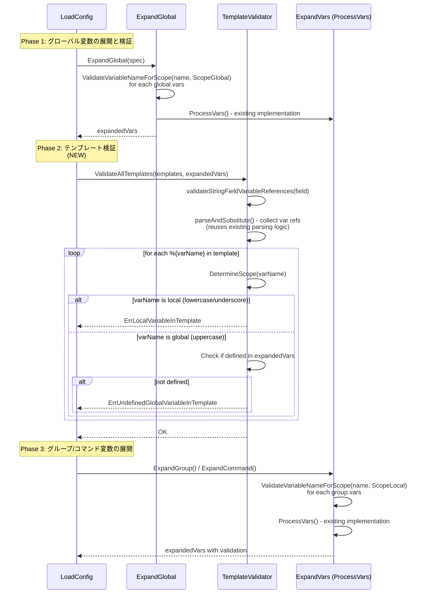

# テンプレート定義でのグローバル変数参照 - 詳細仕様書

## 1. 概要

本文書は、テンプレート定義でグローバル変数を参照可能にする機能の詳細な実装仕様を定義する。

### 1.1 関連文書

- [01_requirements.md](./01_requirements.md) - 要件定義書
- [02_architecture.md](./02_architecture.md) - アーキテクチャ設計書

### 1.2 実装の範囲

以下のモジュールを新規作成または修正する:

```
internal/runner/variable/
├── scope.go                    # 新規: 変数スコープの型定義
├── scope_test.go               # 新規: スコープ検証のテスト
├── registry.go                 # 新規: 変数レジストリの実装
├── registry_test.go            # 新規: レジストリのテスト

internal/runner/config/
├── expansion.go                # 修正: 変数展開処理の拡張
├── expansion_unit_test.go      # 修正: 既存テストの更新
├── template_expansion.go       # 修正: テンプレート検証の追加
├── template_expansion_test.go  # 修正: テンプレート検証テストの追加
└── errors.go                   # 修正: 新しいエラー型の追加
```

## 2. データ構造の詳細仕様

### 2.1 変数スコープの型定義

#### 2.1.1 VariableScope 列挙型

```go
// Package: internal/runner/variable
// File: scope.go

package variable

// VariableScope represents the scope of a variable (global or local)
type VariableScope int

const (
	// ScopeError represents an invalid scope (error sentinel value)
	// Returned by DetermineScope when the variable name is invalid
	ScopeError VariableScope = iota

	// ScopeGlobal represents a global variable (uppercase start)
	// Defined in: [global.vars]
	// Accessible from: templates, params
	ScopeGlobal

	// ScopeLocal represents a local variable (lowercase/underscore start)
	// Defined in: [groups.vars], [groups.commands.vars]
	// Accessible from: params only
	ScopeLocal
)

// String returns the string representation of the scope
func (s VariableScope) String() string {
	switch s {
	case ScopeGlobal:
		return "global"
	case ScopeLocal:
		return "local"
	case ScopeError:
		return "error"
	default:
		return "unknown"
	}
}
```

**設計の根拠**:
- 列挙型により、スコープの種類を型安全に表現
- `ScopeError` をエラーケース（無効なスコープ）として定義（`DetermineScope` がエラー時に `ScopeError, error` を返す）
- エラーとして機能し、同時に有効な定数値として扱える
- `String()` メソッドによる人間が読めるエラーメッセージの生成

#### 2.1.2 命名規則の検証関数

```go
// DetermineScope determines the scope of a variable based on its name.
// It returns the scope and an error if the name is invalid.
//
// Naming rules:
//   - Names starting with "__" (double underscore): reserved, always invalid
//   - Names starting with uppercase (A-Z): global scope
//   - Names starting with lowercase (a-z) or single underscore: local scope
//   - All other characters: invalid
//
// Valid characters after the first character: A-Z, a-z, 0-9, _
//
// Examples:
//   - "AwsPath" → ScopeGlobal, nil
//   - "AWS_PATH" → ScopeGlobal, nil
//   - "data_dir" → ScopeLocal, nil
//   - "_internal" → ScopeLocal, nil
//   - "__reserved" → ScopeError, ErrReservedVariableName
//   - "123invalid" → ScopeError, ErrInvalidVariableName
func DetermineScope(name string) (VariableScope, error) {
	if name == "" {
		return ScopeError, &ErrInvalidVariableName{
			Name:   name,
			Reason: "variable name cannot be empty",
		}
	}

	// Check for reserved prefix
	if strings.HasPrefix(name, "__") {
		return ScopeError, &ErrReservedVariableName{
			Name: name,
		}
	}

	// Check first character to determine scope
	first := rune(name[0])
	switch {
	case first >= 'A' && first <= 'Z':
		// Uppercase start → global
		return ScopeGlobal, nil
	case first >= 'a' && first <= 'z':
		// Lowercase start → local
		return ScopeLocal, nil
	case first == '_':
		// Single underscore start → local
		return ScopeLocal, nil
	default:
		return ScopeError, &ErrInvalidVariableName{
			Name:   name,
			Reason: fmt.Sprintf("variable name must start with A-Z, a-z, or _ (got %q)", first),
		}
	}
}

// ValidateVariableNameForScope validates that a variable name follows
// the naming rules for the specified scope.
//
// This function first determines the scope from the name and then
// checks if it matches the expected scope.
//
// Parameters:
//   - name: the variable name to validate
//   - expectedScope: the scope where the variable is being defined
//   - location: human-readable location for error messages (e.g., "[global.vars]")
//
// Returns:
//   - error: validation error if the name is invalid or doesn't match the expected scope
func ValidateVariableNameForScope(name string, expectedScope VariableScope, location string) error {
	// First, determine the scope from the name
	actualScope, err := DetermineScope(name)
	if err != nil {
		return fmt.Errorf("%s: %w", location, err)
	}

	// Check if the scope matches
	if actualScope != expectedScope {
		return &ErrScopeMismatch{
			Name:          name,
			Location:      location,
			ExpectedScope: expectedScope,
			ActualScope:   actualScope,
		}
	}

	// Validate full variable name using existing security validation
	// This checks for valid characters throughout the name
	if err := security.ValidateVariableName(name); err != nil {
		return fmt.Errorf("%s: variable %q: %w", location, name, err)
	}

	return nil
}
```

**実装の詳細**:

1. **スコープ判定ロジック**:
   - 予約済みプレフィックス (`__`) のチェック → エラー
   - 先頭文字が大文字 (A-Z) → グローバルスコープ
   - 先頭文字が小文字 (a-z) または `_` → ローカルスコープ
   - その他 → エラー

2. **既存の検証との統合**:
   - `security.ValidateVariableName()` を呼び出して、変数名全体の文字種を検証
   - これにより、既存のセキュリティチェックを再利用

### 2.2 変数レジストリ

**実装上の注意**:

このセクションで定義する `VariableRegistry` は、**要件定義書 5.2節「型による安全性の向上」で要求されている**コア機能です。

**Phase 1で実装すべき機能**:

1. **命名規則検証**: `DetermineScope()` と `ValidateVariableNameForScope()`
2. **テンプレート変数参照検証**: `validateStringFieldVariableReferences()`
3. **変数レジストリ**: グローバルとローカルの名前空間を分離して管理
   - `RegisterGlobal()` - グローバル変数の登録（大文字始まりを強制）
   - `WithLocals()` - ローカル変数を追加した新しいレジストリ生成
   - `Resolve()` - 変数名からスコープを自動判定して値を解決

**理由**:
- **F-003要件**: paramsでグローバル変数とローカル変数の両方を参照可能にするため
- **セキュリティ**: 名前空間の厳格な分離を実現するため
- **型安全性**: 要件5.2節で明示的に要求されている

**Phase 1で実装しないメソッド（YAGNI原則）**:
- `HasGlobal()`, `HasLocal()` - `Resolve()` のエラーハンドリングで代替可能

**Phase 1で実装すべきメソッド（dry-run出力用）**:
- `GlobalVars()` - グローバル変数の一覧をソート済みスライスで返す（dry-run出力で使用）
- `LocalVars()` - ローカル変数の一覧をソート済みスライスで返す（dry-run出力で使用）

これらのメソッドは、dry-run時に変数の状態を表示するために必要です。戻り値は安定した出力のため、名前順にソートされたスライス形式とします。

**統合方針**:
- `ProcessVars()` と `ExpandString()` は既存実装を維持
- グローバル変数とローカル変数の展開時に `VariableRegistry` を使用
- 展開結果は `map[string]string` として保持（既存コードとの互換性）

**重複変数定義の検出**:

TOMLパーサー（go-toml/v2）は、TOML仕様に従い、同一スコープ内での重複キー定義を自動的に検出し拒否します。以下の全てのレベルで重複が検出されます：

- `[global.vars]`: グローバル変数の重複
- `[groups.vars]`: グループレベル変数の重複
- `[groups.commands.vars]`: コマンドレベル変数の重複

エラーメッセージ例: `toml: key TestVar is already defined`

したがって、アプリケーションレベルで追加の重複チェックロジックを実装する必要はありません。TOMLパーサーが設定ファイルの読み込み時点で重複を保証します。

参照: [internal/runner/config/duplicate_vars_test.go](../../../internal/runner/config/duplicate_vars_test.go)

#### 2.2.1 VariableRegistry インターフェース

```go
// Package: internal/runner/variable
// File: registry.go

package variable

// VariableRegistry manages variable registration and resolution with scope enforcement.
// It separates global and local variables into distinct namespaces based on naming conventions.
//
// This interface is required by the requirements document (section 5.2) to enforce
// type safety and namespace separation between global and local variables.
type VariableRegistry interface {
	// RegisterGlobal registers a global variable (must start with uppercase)
	// Returns error if the name doesn't follow global naming rules
	RegisterGlobal(name, value string) error

	// WithLocals creates a new registry with the current global variables and the provided local variables.
	// It validates that all local variable names follow local naming rules.
	// The returned registry is independent of the original one regarding local variables.
	WithLocals(locals map[string]string) (VariableRegistry, error)

	// Resolve resolves a variable name to its value
	// The scope is automatically determined from the variable name (F-003 requirement)
	// Returns error if the variable is not defined
	Resolve(name string) (string, error)

	// GlobalVars returns all global variables as a sorted slice of key-value pairs
	// Used for dry-run output to display variable state in a stable order
	GlobalVars() []VariableEntry

	// LocalVars returns all local variables as a sorted slice of key-value pairs
	// Used for dry-run output to display variable state in a stable order
	LocalVars() []VariableEntry
}

// VariableEntry represents a single variable for display purposes
type VariableEntry struct {
	Name  string `json:"name"`
	Value string `json:"value"`
}
```

#### 2.2.2 実装: variableRegistry

```go
// variableRegistry is the concrete implementation of VariableRegistry
type variableRegistry struct {
	globals map[string]string
	locals  map[string]string
	mu      sync.RWMutex // Protects concurrent access to maps
}

// NewVariableRegistry creates a new variable registry
func NewVariableRegistry() VariableRegistry {
	return &variableRegistry{
		globals: make(map[string]string),
		locals:  make(map[string]string),
	}
}

func (r *variableRegistry) RegisterGlobal(name, value string) error {
	// Validate that the name is a valid global variable name
	if err := ValidateVariableNameForScope(name, ScopeGlobal, "[global.vars]"); err != nil {
		return err
	}

	r.mu.Lock()
	defer r.mu.Unlock()

	// No need to check for duplicates here because:
	// 1. The TOML parser guarantees no duplicate keys at parse time
	// 2. This registry is only populated from validated TOML content
	// If dynamic registration is needed in the future, add duplicate checking then.

	r.globals[name] = value
	return nil
}

func (r *variableRegistry) WithLocals(locals map[string]string) (VariableRegistry, error) {
	// Validate all local variable names first
	for name := range locals {
		if err := ValidateVariableNameForScope(name, ScopeLocal, "[local scope]"); err != nil {
			return nil, err
		}
	}

	r.mu.RLock()
	defer r.mu.RUnlock()

	// Create new registry with copy of globals
	newRegistry := &variableRegistry{
		globals: make(map[string]string, len(r.globals)),
		locals:  make(map[string]string, len(locals)),
	}

	// Copy globals
	for k, v := range r.globals {
		newRegistry.globals[k] = v
	}

	// Set locals
	for k, v := range locals {
		newRegistry.locals[k] = v
	}

	return newRegistry, nil
}

func (r *variableRegistry) Resolve(name string) (string, error) {
	// Determine scope from name
	scope, err := DetermineScope(name)
	if err != nil {
		return "", err
	}

	r.mu.RLock()
	defer r.mu.RUnlock()

	switch scope {
	case ScopeGlobal:
		if value, exists := r.globals[name]; exists {
			return value, nil
		}
		return "", &ErrUndefinedGlobalVariable{
			Name: name,
		}

	case ScopeLocal:
		if value, exists := r.locals[name]; exists {
			return value, nil
		}
		return "", &ErrUndefinedLocalVariable{
			Name: name,
		}

	default:
		// This should never happen if DetermineScope is correct
		return "", &ErrInvalidVariableName{
			Name:   name,
			Reason: fmt.Sprintf("unknown scope: %v", scope),
		}
	}
}

func (r *variableRegistry) GlobalVars() []VariableEntry {
	r.mu.RLock()
	defer r.mu.RUnlock()

	// Create sorted slice of variable entries
	entries := make([]VariableEntry, 0, len(r.globals))
	for name, value := range r.globals {
		entries = append(entries, VariableEntry{
			Name:  name,
			Value: value,
		})
	}

	// Sort by name for stable output
	sort.Slice(entries, func(i, j int) bool {
		return entries[i].Name < entries[j].Name
	})

	return entries
}

func (r *variableRegistry) LocalVars() []VariableEntry {
	r.mu.RLock()
	defer r.mu.RUnlock()

	// Create sorted slice of variable entries
	entries := make([]VariableEntry, 0, len(r.locals))
	for name, value := range r.locals {
		entries = append(entries, VariableEntry{
			Name:  name,
			Value: value,
		})
	}

	// Sort by name for stable output
	sort.Slice(entries, func(i, j int) bool {
		return entries[i].Name < entries[j].Name
	})

	return entries
}
```

**実装のポイント**:

1. **同期化**: `sync.RWMutex` により、並行アクセスを安全に処理
2. **名前空間の分離**: `globals` と `locals` を別々のマップで管理
3. **自動スコープ判定**: `Resolve()` は変数名からスコープを自動判定（F-003要件）
4. **不変性**: `WithLocals()` は新しいレジストリを返し、元のレジストリは変更しない
5. **安定した出力**: `GlobalVars()` と `LocalVars()` は名前順にソートされたスライスを返す
6. **dry-run対応**: スライス形式により、呼び出し側でのソート処理が不要

### 2.3 エラー型の定義

#### 2.3.1 スコープ関連のエラー

```go
// Package: internal/runner/variable
// File: scope.go

// ErrReservedVariableName is returned when a variable name uses the reserved prefix
type ErrReservedVariableName struct {
	Name string
}

func (e *ErrReservedVariableName) Error() string {
	return fmt.Sprintf("variable name %q is reserved (starts with '__')", e.Name)
}

// ErrInvalidVariableName is returned when a variable name doesn't follow naming rules
type ErrInvalidVariableName struct {
	Name   string
	Reason string
}

func (e *ErrInvalidVariableName) Error() string {
	return fmt.Sprintf("invalid variable name %q: %s", e.Name, e.Reason)
}

// ErrScopeMismatch is returned when a variable is defined in the wrong scope
type ErrScopeMismatch struct {
	Name          string
	Location      string
	ExpectedScope VariableScope
	ActualScope   VariableScope
}

func (e *ErrScopeMismatch) Error() string {
	return fmt.Sprintf(
		"%s: variable %q must be %s (starts with %s), but is defined as %s (starts with %s)",
		e.Location,
		e.Name,
		e.ExpectedScope,
		e.scopeStartCharDescription(e.ExpectedScope),
		e.ActualScope,
		e.scopeStartCharDescription(e.ActualScope),
	)
}

func (e *ErrScopeMismatch) scopeStartCharDescription(scope VariableScope) string {
	switch scope {
	case ScopeGlobal:
		return "uppercase A-Z"
	case ScopeLocal:
		return "lowercase a-z or underscore _"
	default:
		return "unknown"
	}
}

// ErrUndefinedGlobalVariable is returned when a global variable is not defined
type ErrUndefinedGlobalVariable struct {
	Name string
}

func (e *ErrUndefinedGlobalVariable) Error() string {
	return fmt.Sprintf("undefined global variable %q", e.Name)
}

// ErrUndefinedLocalVariable is returned when a local variable is not defined
type ErrUndefinedLocalVariable struct {
	Name string
}

func (e *ErrUndefinedLocalVariable) Error() string {
	return fmt.Sprintf("undefined local variable %q", e.Name)
}

// Note: ErrDuplicateVariableDefinition is NOT needed because the TOML parser
// automatically detects and rejects duplicate keys at parse time.
// See: docs/tasks/0065_global_vars_in_templates/duplicate_variable_detection.md
```

#### 2.3.2 テンプレート検証のエラー

```go
// Package: internal/runner/config
// File: errors.go

// ErrLocalVariableInTemplate is returned when a template references a local variable
type ErrLocalVariableInTemplate struct {
	TemplateName string
	Field        string // e.g., "cmd", "args[0]", "env[PATH]"
	VariableName string
}

func (e *ErrLocalVariableInTemplate) Error() string {
	return fmt.Sprintf(
		"template %q field %q: cannot reference local variable %q (templates can only reference global variables starting with uppercase)",
		e.TemplateName,
		e.Field,
		e.VariableName,
	)
}

// ErrUndefinedGlobalVariableInTemplate is returned when a template references an undefined global variable
type ErrUndefinedGlobalVariableInTemplate struct {
	TemplateName string
	Field        string
	VariableName string
}

func (e *ErrUndefinedGlobalVariableInTemplate) Error() string {
	return fmt.Sprintf(
		"template %q field %q: global variable %q is not defined in [global.vars]",
		e.TemplateName,
		e.Field,
		e.VariableName,
	)
}
```

## 3. 処理フローの詳細仕様

### 3.1 設定読み込み時の処理



**重要な設計のポイント**:

1. **既存実装の再利用**: `ProcessVars()` と `ExpandString()` の既存実装は変更しない
2. **検証の統合**: 命名規則検証を展開処理の前段階で実施
3. **パース無関係の分離**: テンプレート変数参照抽出は `parseAndSubstitute()` の既存ロジックを再利用

### 3.2 変数展開の詳細

#### 3.2.1 テンプレート展開（Stage 1）

テンプレート展開では、`${...}` プレースホルダーを params 値で置換する。この段階では `%{...}` はそのまま残す。

```go
// 既存の template_expansion.go の処理
// 変更なし（既存の実装を継続使用）
```

#### 3.2.2 変数展開（Stage 2）

変数展開では、`%{...}` 参照を変数値で置換する。グローバル変数とローカル変数の両方を解決する。

既存の `ExpandString()` と `ProcessVars()` を使用します。これらは `parseAndSubstitute()` を内部で利用し、一貫性のある変数参照解析を行います。

```go
// Package: internal/runner/config
// File: expansion.go

// 既存の実装を再利用（変更なし）
// ExpandString expands %{VAR} references in a string
func ExpandString(
	input string,
	expandedVars map[string]string,
	level string,
	field string,
) (string, error) {
	// ... existing implementation ...
	// Uses parseAndSubstitute internally
}

// ProcessVars processes variable definitions with namevalidation
func ProcessVars(
	vars map[string]any,
	baseExpandedVars map[string]string,
	baseExpandedArrayVars map[string][]string,
	envImportVars map[string]string,
	level string,
) (map[string]string, map[string][]string, error) {
	// ... existing implementation ...
	// For global.vars, ensure DetermineScope validation is added
	// For group/command vars, ensure DetermineScope validation is added
}
```

### 3.3 テンプレート検証の詳細仕様

テンプレート検証は、テンプレート定義内の `%{VAR}` 参照が全てグローバル変数であり、かつ定義されていることを確認します。

**実装の基本方針**:
1. 既存の `parseAndSubstitute()` ロジックを再利用して、変数参照を抽出
2. 抽出した各変数参照について、スコープと定義を検証
3. エラーが発見された場合、詳細なエラーメッセージを返す

```go
// Package: internal/runner/config
// File: template_expansion.go

// ValidateTemplateVariableReferences validates that all %{VAR} references in a template
// are global variables and are defined in [global.vars].
//
// This function uses parseAndSubstitute to extract variable references with the same
// parsing logic as the actual expansion, ensuring consistency between validation and expansion.
//
// Parameters:
//   - template: the command template to validate
//   - templateName: name of the template for error messages
//   - globalVars: map of defined global variables
//
// Returns:
//   - error: validation error if any variable reference is invalid
func ValidateTemplateVariableReferences(
	template *runnertypes.CommandTemplate,
	templateName string,
	globalVars map[string]string,
) error {
	// Fields to check for variable references
	fieldsToCheck := []struct {
		name  string
		value string
	}{
		{"cmd", template.Cmd},
		{"workdir", template.WorkDir},
	}

	// Check string fields
	for _, field := range fieldsToCheck {
		if field.value == "" {
			continue
		}
		if err := validateStringFieldVariableReferences(field.value, templateName, field.name, globalVars); err != nil {
			return err
		}
	}

	// Check args array
	for i, arg := range template.Args {
		fieldName := fmt.Sprintf("args[%d]", i)
		if err := validateStringFieldVariableReferences(arg, templateName, fieldName, globalVars); err != nil {
			return err
		}
	}

	// Check env array
	for i, envMapping := range template.Env {
		// Parse "KEY=value" format
		_, value, ok := common.ParseKeyValue(envMapping)
		if !ok {
			// Invalid format - this should have been caught during parsing
			// but we check here for defensive programming
			continue
		}

		fieldName := fmt.Sprintf("env[%d]", i)
		if err := validateStringFieldVariableReferences(value, templateName, fieldName, globalVars); err != nil {
			return err
		}
	}

	return nil
}

// validateStringFieldVariableReferences validates variable references in a single string field
// by collecting all %{VAR} references and checking each one against scope and definition rules.
//
// This function reuses the parsing logic from parseAndSubstitute (which is used for actual variable
// expansion) to ensure consistent extraction of variable references across the codebase.
func validateStringFieldVariableReferences(
	input string,
	templateName string,
	fieldName string,
	globalVars map[string]string,
) error {
	// Collect all %{VAR} references by using a resolver that saves variable names
	// instead of expanding them. This reuses the same parsing logic as expansion.go.
	var collectedRefs []string
	refCollector := func(
		varName string,
		field string,
		visited map[string]struct{},
		chain []string,
		depth int,
	) (string, error) {
		// Just collect the variable name without resolving
		collectedRefs = append(collectedRefs, varName)
		// Return non-empty string to satisfy resolver interface
		return "", nil
	}

	// Use parseAndSubstitute to extract variable names using the same logic as expansion
	// If parseAndSubstitute returns an error (e.g., unclosed %{), report it as-is
	_, err := parseAndSubstitute(
		input,
		refCollector,
		fmt.Sprintf("template[%s]", templateName),
		fieldName,
		make(map[string]struct{}), // empty visited set
		make([]string, 0),          // empty expansion chain
		0,                          // depth 0
	)
	if err != nil {
		// parseAndSubstitute validates variable names and reports errors
		// If there's a parsing error, return it as-is
		return err
	}

	// Now validate each collected reference
	for _, varName := range collectedRefs {
		// Determine scope
		scope, err := variable.DetermineScope(varName)
		if err != nil {
			// Invalid variable name (e.g., reserved prefix)
			// Note: parseAndSubstitute already validated the name, so this should not happen
			return &ErrInvalidVariableNameDetail{
				Level:        fmt.Sprintf("template[%s]", templateName),
				Field:        fieldName,
				VariableName: varName,
				Reason:       err.Error(),
			}
		}

		// Check if it's a local variable (not allowed in templates)
		if scope == variable.ScopeLocal {
			return &ErrLocalVariableInTemplate{
				TemplateName: templateName,
				Field:        fieldName,
				VariableName: varName,
			}
		}

		// Check if the global variable is defined
		if _, exists := globalVars[varName]; !exists {
			return &ErrUndefinedGlobalVariableInTemplate{
				TemplateName: templateName,
				Field:        fieldName,
				VariableName: varName,
			}
		}
	}

	return nil
}

// ValidateAllTemplates validates all templates in the configuration
// This is called during config loading, after global vars are processed
func ValidateAllTemplates(
	templates map[string]runnertypes.CommandTemplate,
	globalVars map[string]string,
) error {
	for templateName, template := range templates {
		if err := ValidateTemplateVariableReferences(&template, templateName, globalVars); err != nil {
			return err
		}
	}
	return nil
}
```

## 4. 統合ポイントの詳細

### 4.1 既存実装との統合の原則

**重要な設計原則**: 変数参照の抽出・解析ロジックは **単一の実装** (`parseAndSubstitute`) を再利用する。

現在のコードベースでは、変数展開に使用する `parseAndSubstitute` 関数が以下の処理を行っています：

1. **エスケープシーケンスの処理**: `\%` → `%`, `\\` → `\` など
2. **変数参照の抽出と検証**: `%{VAR}` パターンの検出と変数名の抽出
3. **変数名の検証**: `security.ValidateVariableName()` を呼び出して名前の妥当性を確認
4. **エラーハンドリング**: 構文エラー（閉じられていない `%{` など）の検出

したがって、テンプレート検証で変数参照を抽出する際にも、この `parseAndSubstitute` と同じロジックを使用すべき。

**メリット**:
- 変数参照の抽出ロジックが1箇所に集中
- 展開時と検証時で同じパースルールが適用される
- バグ修正や拡張が容易

### 4.2 config.LoadConfig への統合

```go
// Package: internal/runner/config
// File: loader.go

func LoadConfig(configPath string, fs common.FileSystem) (*Config, error) {
	// ... existing parsing code ...

	// Phase 1: Expand global (including variable registration)
	globalRuntime, err := ExpandGlobal(&config.Global)
	if err != nil {
		return nil, fmt.Errorf("failed to expand global config: %w", err)
	}

	// Phase 2: Validate templates (NEW)
	// This ensures that all %{VAR} references in templates are global variables
	// and are defined in [global.vars]
	// validateStringFieldVariableReferences reuses parseAndSubstitute for consistent
	// variable reference extraction.
	if err := ValidateAllTemplates(config.CommandTemplates, globalRuntime.ExpandedVars); err != nil {
		return nil, fmt.Errorf("template validation failed: %w", err)
	}

	// Phase 3: Expand groups
	runtimeGroups := make([]*runnertypes.RuntimeGroup, len(config.Groups))
	for i, groupSpec := range config.Groups {
		runtimeGroup, err := ExpandGroup(&groupSpec, globalRuntime)
		if err != nil {
			return nil, fmt.Errorf("failed to expand group %q: %w", groupSpec.Name, err)
		}
		runtimeGroups[i] = runtimeGroup
	}

	// ... rest of the existing code ...
}
```

### 4.3 変数展開での命名規則検証

**実装の統合戦略**:

現在のコードベースは `ProcessVars()` と `ExpandString()` を使用しています。この実装を活用しながら、命名規則検証を統合します：

```go
// Package: internal/runner/config
// File: expansion.go

// ProcessVars の既存実装を活用しながら、命名規則検証を追加
// (疑似コード）
func expandGlobalVars(spec *runnertypes.GlobalSpec) (map[string]string, error) {
	// Validate variable names follow global naming rules (uppercase start)
	// ADDED: Scope validation before processing
	for varName := range spec.Vars {
		if err := variable.ValidateVariableNameForScope(varName, variable.ScopeGlobal, "[global.vars]"); err != nil {
			return nil, fmt.Errorf("failed to validate global variable name: %w", err)
		}
	}

	// Use existing ProcessVars implementation
	// This handles expansion using the shared parseAndSubstitute logic
	expandedVars, _, err := ProcessVars(spec.Vars, baseVars, nil, envImportVars, "global")
	if err != nil {
		return nil, fmt.Errorf("failed to process global vars: %w", err)
	}

	return expandedVars, nil
}
```

**設計のポイント**:

1. **命名規則検証（新規）**: 変数定義時に `ValidateVariableNameForScope()` で検証
2. **変数展開（既存）**: 既存の `ProcessVars()` と `ExpandString()` を再利用
3. **テンプレート検証（新規）**: `validateStringFieldVariableReferences()` で `parseAndSubstitute` を再利用

VariableRegistry の実装は、将来の機能拡張（例：より詳細な権限制御）に備えたものですが、当初の実装では命名規則検証に焦点を当てます。

### 4.4 ExpandGlobal の修正

```go
// Package: internal/runner/config
// File: expansion.go

func ExpandGlobal(spec *runnertypes.GlobalSpec) (*runnertypes.RuntimeGlobal, error) {
	// ... existing code up to ProcessVars ...

	// 2. Process Vars with scope validation (MODIFIED)
	// Validate that all global.vars follow global naming rules (uppercase start)
	for varName := range spec.Vars {
		if err := variable.ValidateVariableNameForScope(varName, variable.ScopeGlobal, "[global.vars]"); err != nil {
			return nil, fmt.Errorf("failed to validate global variable name: %w", err)
		}
	}

	expandedVars, expandedArrays, err := ProcessVars(spec.Vars, runtime.ExpandedVars, runtime.ExpandedArrayVars, runtime.EnvImportVars, "global")
	if err != nil {
		return nil, fmt.Errorf("failed to process global vars: %w", err)
	}
	runtime.ExpandedVars = expandedVars
	runtime.ExpandedArrayVars = expandedArrays

	// ... rest of existing code ...
}
```

### 4.5 ExpandGroup の修正

```go
// Package: internal/runner/config
// File: expansion.go

func ExpandGroup(spec *runnertypes.GroupSpec, globalRuntime *runnertypes.RuntimeGlobal) (*runnertypes.RuntimeGroup, error) {
	// ... existing code up to ProcessVars ...

	// 3. Process Vars (group-level) with scope validation (MODIFIED)
	// Validate that all group.vars follow local naming rules (lowercase/underscore start)
	for varName := range spec.Vars {
		if err := variable.ValidateVariableNameForScope(varName, variable.ScopeLocal, fmt.Sprintf("[groups.%s.vars]", spec.Name)); err != nil {
			return nil, fmt.Errorf("failed to validate group variable name: %w", err)
		}
	}

	expandedVars, expandedArrays, err := ProcessVars(spec.Vars, runtime.ExpandedVars, runtime.ExpandedArrayVars, runtime.EnvImportVars, fmt.Sprintf("group[%s]", spec.Name))
	if err != nil {
		return nil, fmt.Errorf("failed to process group[%s] vars: %w", spec.Name, err)
	}
	runtime.ExpandedVars = expandedVars
	runtime.ExpandedArrayVars = expandedArrays

	// ... rest of existing code ...
}
```

### 4.6 expandCommandVars の修正

```go
// Package: internal/runner/config
// File: expansion.go

func expandCommandVars(
	spec *runnertypes.CommandSpec,
	runtime *runnertypes.RuntimeCommand,
) error {
	// Validate that all command.vars follow local naming rules (ADDED)
	for varName := range spec.Vars {
		if err := variable.ValidateVariableNameForScope(varName, variable.ScopeLocal, fmt.Sprintf("[commands.%s.vars]", spec.Name)); err != nil {
			return fmt.Errorf("failed to validate command variable name: %w", err)
		}
	}

	expandedVars, expandedArrays, err := ProcessVars(
		spec.Vars,
		runtime.ExpandedVars,
		runtime.ExpandedArrayVars,
		runtime.EnvImportVars,
		fmt.Sprintf("command[%s]", spec.Name),
	)
	if err != nil {
		return fmt.Errorf("failed to process command[%s] vars: %w", spec.Name, err)
	}

	runtime.ExpandedVars = expandedVars
	runtime.ExpandedArrayVars = expandedArrays

	return nil
}
```

## 5. テスト仕様

### 5.1 ユニットテスト

#### 5.1.1 scope_test.go

```go
// Package: internal/runner/variable
// File: scope_test.go

package variable_test

import (
	"testing"

	"github.com/isseis/go-safe-cmd-runner/internal/runner/variable"
	"github.com/stretchr/testify/assert"
	"github.com/stretchr/testify/require"
)

func TestDetermineScope(t *testing.T) {
	tests := []struct {
		name          string
		varName       string
		expectedScope variable.VariableScope
		expectError   bool
		errorType     any // Type to check with errors.As
	}{
		// Global variables (uppercase start)
		{
			name:          "uppercase single letter",
			varName:       "A",
			expectedScope: variable.ScopeGlobal,
			expectError:   false,
		},
		{
			name:          "UpperCamelCase",
			varName:       "AwsPath",
			expectedScope: variable.ScopeGlobal,
			expectError:   false,
		},
		{
			name:          "ALL_CAPS_WITH_UNDERSCORES",
			varName:       "AWS_PATH",
			expectedScope: variable.ScopeGlobal,
			expectError:   false,
		},
		{
			name:          "Mixed_Case_With_Underscores",
			varName:       "Default_Timeout",
			expectedScope: variable.ScopeGlobal,
			expectError:   false,
		},

		// Local variables (lowercase start)
		{
			name:          "lowercase single letter",
			varName:       "a",
			expectedScope: variable.ScopeLocal,
			expectError:   false,
		},
		{
			name:          "snake_case",
			varName:       "data_dir",
			expectedScope: variable.ScopeLocal,
			expectError:   false,
		},
		{
			name:          "camelCase",
			varName:       "dataDir",
			expectedScope: variable.ScopeLocal,
			expectError:   false,
		},

		// Local variables (underscore start)
		{
			name:          "single underscore",
			varName:       "_",
			expectedScope: variable.ScopeLocal,
			expectError:   false,
		},
		{
			name:          "underscore prefix",
			varName:       "_internal",
			expectedScope: variable.ScopeLocal,
			expectError:   false,
		},

		// Reserved variables (double underscore)
		{
			name:        "double underscore",
			varName:     "__reserved",
			expectError: true,
			errorType:   &variable.ErrReservedVariableName{},
		},
		{
			name:        "double underscore uppercase",
			varName:     "__RESERVED",
			expectError: true,
			errorType:   &variable.ErrReservedVariableName{},
		},

		// Invalid names
		{
			name:        "empty name",
			varName:     "",
			expectError: true,
			errorType:   &variable.ErrInvalidVariableName{},
		},
		{
			name:        "starts with digit",
			varName:     "123invalid",
			expectError: true,
			errorType:   &variable.ErrInvalidVariableName{},
		},
		{
			name:        "starts with special char",
			varName:     "$invalid",
			expectError: true,
			errorType:   &variable.ErrInvalidVariableName{},
		},
	}

	for _, tt := range tests {
		t.Run(tt.name, func(t *testing.T) {
			scope, err := variable.DetermineScope(tt.varName)

			if tt.expectError {
				require.Error(t, err)
				if tt.errorType != nil {
					assert.ErrorAs(t, err, &tt.errorType)
				}
			} else {
				require.NoError(t, err)
				assert.Equal(t, tt.expectedScope, scope)
			}
		})
	}
}

func TestValidateVariableNameForScope(t *testing.T) {
	tests := []struct {
		name          string
		varName       string
		expectedScope variable.VariableScope
		location      string
		expectError   bool
		errorContains string
	}{
		// Valid global variables
		{
			name:          "valid global uppercase",
			varName:       "AwsPath",
			expectedScope: variable.ScopeGlobal,
			location:      "[global.vars]",
			expectError:   false,
		},

		// Valid local variables
		{
			name:          "valid local lowercase",
			varName:       "data_dir",
			expectedScope: variable.ScopeLocal,
			location:      "[groups.vars]",
			expectError:   false,
		},

		// Scope mismatches
		{
			name:          "global scope but lowercase name",
			varName:       "aws_path",
			expectedScope: variable.ScopeGlobal,
			location:      "[global.vars]",
			expectError:   true,
			errorContains: "must be global",
		},
		{
			name:          "local scope but uppercase name",
			varName:       "DataDir",
			expectedScope: variable.ScopeLocal,
			location:      "[groups.vars]",
			expectError:   true,
			errorContains: "must be local",
		},

		// Reserved names
		{
			name:          "reserved in global",
			varName:       "__reserved",
			expectedScope: variable.ScopeGlobal,
			location:      "[global.vars]",
			expectError:   true,
			errorContains: "reserved",
		},
		{
			name:          "reserved in local",
			varName:       "__reserved",
			expectedScope: variable.ScopeLocal,
			location:      "[groups.vars]",
			expectError:   true,
			errorContains: "reserved",
		},
	}

	for _, tt := range tests {
		t.Run(tt.name, func(t *testing.T) {
			err := variable.ValidateVariableNameForScope(tt.varName, tt.expectedScope, tt.location)

			if tt.expectError {
				require.Error(t, err)
				if tt.errorContains != "" {
					assert.Contains(t, err.Error(), tt.errorContains)
				}
			} else {
				require.NoError(t, err)
			}
		})
	}
}
```

#### 5.1.2 registry_test.go

```go
// Package: internal/runner/variable
// File: registry_test.go

package variable_test

import (
	"testing"

	"github.com/isseis/go-safe-cmd-runner/internal/runner/variable"
	"github.com/stretchr/testify/assert"
	"github.com/stretchr/testify/require"
)

func TestVariableRegistry_RegisterGlobal(t *testing.T) {
	tests := []struct {
		name        string
		varName     string
		value       string
		expectError bool
	}{
		{
			name:        "valid global variable",
			varName:     "AwsPath",
			value:       "/usr/bin/aws",
			expectError: false,
		},
		{
			name:        "lowercase name rejected",
			varName:     "aws_path",
			value:       "/usr/bin/aws",
			expectError: true,
		},
		{
			name:        "reserved name rejected",
			varName:     "__reserved",
			value:       "value",
			expectError: true,
		},
		// Note: No test for duplicate registration because:
		// 1. The TOML parser prevents duplicates at parse time
		// 2. The registry is only populated from validated TOML content
		// 3. YAGNI: If dynamic registration is needed later, add duplicate checking then
	}

	for _, tt := range tests {
		t.Run(tt.name, func(t *testing.T) {
			registry := variable.NewVariableRegistry()
			err := registry.RegisterGlobal(tt.varName, tt.value)

			if tt.expectError {
				require.Error(t, err)
			} else {
				require.NoError(t, err)
				// Verify the variable was registered by resolving it
				value, err := registry.Resolve(tt.varName)
				require.NoError(t, err)
				assert.Equal(t, tt.value, value)
			}
		})
	}
}

func TestVariableRegistry_WithLocals(t *testing.T) {
	tests := []struct {
		name        string
		locals      map[string]string
		expectError bool
	}{
		{
			name: "valid local variables",
			locals: map[string]string{
				"data_dir":  "/data",
				"_internal": "value",
			},
			expectError: false,
		},
		{
			name: "uppercase name rejected",
			locals: map[string]string{
				"DataDir": "/data",
			},
			expectError: true,
		},
		{
			name: "reserved name rejected",
			locals: map[string]string{
				"__reserved": "value",
			},
			expectError: true,
		},
	}

	for _, tt := range tests {
		t.Run(tt.name, func(t *testing.T) {
			registry := variable.NewVariableRegistry()
			newRegistry, err := registry.WithLocals(tt.locals)

			if tt.expectError {
				require.Error(t, err)
			} else {
				require.NoError(t, err)
				// Verify locals were registered by resolving them
				for k, expectedValue := range tt.locals {
					value, err := newRegistry.Resolve(k)
					require.NoError(t, err)
					assert.Equal(t, expectedValue, value)
				}
				// Original registry should not have locals
				for k := range tt.locals {
					_, err := registry.Resolve(k)
					assert.Error(t, err) // Should be undefined
				}
			}
		})
	}
}

func TestVariableRegistry_Resolve(t *testing.T) {
	registry := variable.NewVariableRegistry()

	// Register test variables
	require.NoError(t, registry.RegisterGlobal("AwsPath", "/usr/bin/aws"))

	// Create child registry with locals
	childRegistry, err := registry.WithLocals(map[string]string{
		"data_dir": "/data",
	})
	require.NoError(t, err)

	tests := []struct {
		name          string
		registry      variable.VariableRegistry
		varName       string
		expectedValue string
		expectError   bool
	}{
		{
			name:          "resolve global variable from parent",
			registry:      registry,
			varName:       "AwsPath",
			expectedValue: "/usr/bin/aws",
			expectError:   false,
		},
		{
			name:          "resolve global variable from child",
			registry:      childRegistry,
			varName:       "AwsPath",
			expectedValue: "/usr/bin/aws",
			expectError:   false,
		},
		{
			name:          "resolve local variable from child",
			registry:      childRegistry,
			varName:       "data_dir",
			expectedValue: "/data",
			expectError:   false,
		},
		{
			name:        "local variable not in parent",
			registry:    registry,
			varName:     "data_dir",
			expectError: true,
		},
		{
			name:        "undefined global variable",
			registry:    childRegistry,
			varName:     "UndefinedGlobal",
			expectError: true,
		},
	}

	for _, tt := range tests {
		t.Run(tt.name, func(t *testing.T) {
			value, err := tt.registry.Resolve(tt.varName)

			if tt.expectError {
				require.Error(t, err)
			} else {
				require.NoError(t, err)
				assert.Equal(t, tt.expectedValue, value)
			}
		})
	}
}

func TestVariableRegistry_NamespaceIsolation(t *testing.T) {
	registry := variable.NewVariableRegistry()

	// Register variables with similar names in different namespaces
	require.NoError(t, registry.RegisterGlobal("Path", "/global"))

	childRegistry, err := registry.WithLocals(map[string]string{
		"path": "/local",
	})
	require.NoError(t, err)

	// Verify isolation: "Path" (global) and "path" (local) are separate
	globalValue, err := childRegistry.Resolve("Path")
	require.NoError(t, err)
	assert.Equal(t, "/global", globalValue)

	localValue, err := childRegistry.Resolve("path")
	require.NoError(t, err)
	assert.Equal(t, "/local", localValue)

	// Verify that the names don't interfere with each other
	// Each variable exists only in its own namespace
}
```

### 5.2 統合テスト

#### 5.2.1 template_validation_test.go

```go
// Package: internal/runner/config
// File: template_validation_test.go

package config_test

import (
	"testing"

	"github.com/isseis/go-safe-cmd-runner/internal/runner/config"
	"github.com/isseis/go-safe-cmd-runner/internal/runner/runnertypes"
	"github.com/stretchr/testify/assert"
	"github.com/stretchr/testify/require"
)

func TestValidateTemplateVariableReferences_Success(t *testing.T) {
	// Global variables
	globalVars := map[string]string{
		"AwsPath":   "/usr/bin/aws",
		"AwsRegion": "us-west-2",
	}

	// Template that only references global variables
	template := &runnertypes.CommandTemplate{
		Cmd:  "%{AwsPath}",
		Args: []string{"--region", "%{AwsRegion}", "s3", "ls"},
	}

	err := config.ValidateTemplateVariableReferences(template, "s3_ls", globalVars)
	require.NoError(t, err)
}

func TestValidateTemplateVariableReferences_LocalVariableError(t *testing.T) {
	globalVars := map[string]string{
		"AwsPath": "/usr/bin/aws",
	}

	// Template that references a local variable (lowercase)
	template := &runnertypes.CommandTemplate{
		Cmd:  "%{AwsPath}",
		Args: []string{"s3", "sync", "%{data_dir}", "s3://bucket"},
	}

	err := config.ValidateTemplateVariableReferences(template, "s3_sync", globalVars)
	require.Error(t, err)

	// Check error type
	var localVarErr *config.ErrLocalVariableInTemplate
	assert.ErrorAs(t, err, &localVarErr)
	assert.Equal(t, "s3_sync", localVarErr.TemplateName)
	assert.Equal(t, "data_dir", localVarErr.VariableName)
}

func TestValidateTemplateVariableReferences_UndefinedGlobalError(t *testing.T) {
	globalVars := map[string]string{
		"AwsPath": "/usr/bin/aws",
	}

	// Template that references an undefined global variable
	template := &runnertypes.CommandTemplate{
		Cmd:  "%{PythonPath}", // Not defined
		Args: []string{"script.py"},
	}

	err := config.ValidateTemplateVariableReferences(template, "python_script", globalVars)
	require.Error(t, err)

	// Check error type
	var undefErr *config.ErrUndefinedGlobalVariableInTemplate
	assert.ErrorAs(t, err, &undefErr)
	assert.Equal(t, "python_script", undefErr.TemplateName)
	assert.Equal(t, "PythonPath", undefErr.VariableName)
}

func TestValidateTemplateVariableReferences_EnvField(t *testing.T) {
	globalVars := map[string]string{
		"LogLevel": "INFO",
	}

	template := &runnertypes.CommandTemplate{
		Cmd:  "/bin/app",
		Args: []string{},
		Env:  []string{"LOG_LEVEL=%{LogLevel}"},
	}

	err := config.ValidateTemplateVariableReferences(template, "app", globalVars)
	require.NoError(t, err)
}

func TestValidateTemplateVariableReferences_WorkDirField(t *testing.T) {
	globalVars := map[string]string{
		"WorkDir": "/tmp/runner",
	}

	template := &runnertypes.CommandTemplate{
		Cmd:     "/bin/app",
		WorkDir: "%{WorkDir}",
	}

	err := config.ValidateTemplateVariableReferences(template, "app", globalVars)
	require.NoError(t, err)
}
```

#### 5.2.2 end_to_end_expansion_test.go

```go
// Package: internal/runner/config
// File: end_to_end_expansion_test.go

package config_test

import (
	"testing"

	"github.com/isseis/go-safe-cmd-runner/internal/common"
	"github.com/isseis/go-safe-cmd-runner/internal/runner/config"
	"github.com/isseis/go-safe-cmd-runner/internal/runner/runnertypes"
	"github.com/stretchr/testify/assert"
	"github.com/stretchr/testify/require"
)

func TestEndToEndExpansion_GlobalVariablesInTemplates(t *testing.T) {
	// Simulate a complete config with global vars and templates
	spec := &runnertypes.GlobalSpec{
		Vars: map[string]any{
			"AwsPath":   "/usr/bin/aws",
			"AwsRegion": "us-west-2",
		},
	}

	// Expand global
	globalRuntime, err := config.ExpandGlobal(spec)
	require.NoError(t, err)

	// Verify global vars are expanded
	assert.Equal(t, "/usr/bin/aws", globalRuntime.ExpandedVars["AwsPath"])
	assert.Equal(t, "us-west-2", globalRuntime.ExpandedVars["AwsRegion"])

	// Create template
	templates := map[string]runnertypes.CommandTemplate{
		"s3_sync": {
			Cmd:  "%{AwsPath}",
			Args: []string{"--region", "%{AwsRegion}", "s3", "sync", "${src}", "${dst}"},
		},
	}

	// Validate template
	err = config.ValidateAllTemplates(templates, globalRuntime.ExpandedVars)
	require.NoError(t, err)

	// Create command spec using the template
	cmdSpec := &runnertypes.CommandSpec{
		Name:     "sync_data",
		Template: "s3_sync",
		Params: map[string]any{
			"src": "/data",
			"dst": "s3://bucket",
		},
	}

	// Expand command
	groupSpec := &runnertypes.GroupSpec{
		Name: "test-group",
	}
	runtimeGroup, err := config.ExpandGroup(groupSpec, globalRuntime)
	require.NoError(t, err)

	runtimeCmd, err := config.ExpandCommand(
		cmdSpec,
		templates,
		runtimeGroup,
		globalRuntime,
		common.Timeout(0),
		common.OutputSizeLimit(0),
	)
	require.NoError(t, err)

	// Verify final expansion
	assert.Equal(t, "/usr/bin/aws", runtimeCmd.ExpandedCmd)
	assert.Equal(t, []string{"--region", "us-west-2", "s3", "sync", "/data", "s3://bucket"}, runtimeCmd.ExpandedArgs)
}

func TestEndToEndExpansion_LocalVariablesInParams(t *testing.T) {
	// Global vars
	globalSpec := &runnertypes.GlobalSpec{
		Vars: map[string]any{
			"AwsPath": "/usr/bin/aws",
		},
	}

	globalRuntime, err := config.ExpandGlobal(globalSpec)
	require.NoError(t, err)

	// Group with local variables
	groupSpec := &runnertypes.GroupSpec{
		Name: "backup",
		Vars: map[string]any{
			"data_dir":      "/data/prod",
			"backup_bucket": "s3://prod-backup",
		},
	}

	runtimeGroup, err := config.ExpandGroup(groupSpec, globalRuntime)
	require.NoError(t, err)

	// Verify local vars are expanded
	assert.Equal(t, "/data/prod", runtimeGroup.ExpandedVars["data_dir"])
	assert.Equal(t, "s3://prod-backup", runtimeGroup.ExpandedVars["backup_bucket"])

	// Template
	templates := map[string]runnertypes.CommandTemplate{
		"s3_sync": {
			Cmd:  "%{AwsPath}",
			Args: []string{"s3", "sync", "${src}", "${dst}"},
		},
	}

	// Command using local variables in params
	cmdSpec := &runnertypes.CommandSpec{
		Name:     "sync_data",
		Template: "s3_sync",
		Params: map[string]any{
			"src": "%{data_dir}",      // Local variable reference
			"dst": "%{backup_bucket}", // Local variable reference
		},
	}

	runtimeCmd, err := config.ExpandCommand(
		cmdSpec,
		templates,
		runtimeGroup,
		globalRuntime,
		common.Timeout(0),
		common.OutputSizeLimit(0),
	)
	require.NoError(t, err)

	// Verify expansion
	assert.Equal(t, "/usr/bin/aws", runtimeCmd.ExpandedCmd)
	assert.Equal(t, []string{"s3", "sync", "/data/prod", "s3://prod-backup"}, runtimeCmd.ExpandedArgs)
}

func TestEndToEndExpansion_ScopeMismatchErrors(t *testing.T) {
	t.Run("lowercase in global.vars", func(t *testing.T) {
		spec := &runnertypes.GlobalSpec{
			Vars: map[string]any{
				"aws_path": "/usr/bin/aws", // Should be AwsPath
			},
		}

		_, err := config.ExpandGlobal(spec)
		require.Error(t, err)
		assert.Contains(t, err.Error(), "must be global")
	})

	t.Run("uppercase in groups.vars", func(t *testing.T) {
		globalSpec := &runnertypes.GlobalSpec{}
		globalRuntime, err := config.ExpandGlobal(globalSpec)
		require.NoError(t, err)

		groupSpec := &runnertypes.GroupSpec{
			Name: "test",
			Vars: map[string]any{
				"DataDir": "/data", // Should be data_dir
			},
		}

		_, err = config.ExpandGroup(groupSpec, globalRuntime)
		require.Error(t, err)
		assert.Contains(t, err.Error(), "must be local")
	})
}
```

### 5.3 エラーメッセージのテスト

```go
// Package: internal/runner/variable
// File: scope_test.go

func TestErrorMessages(t *testing.T) {
	tests := []struct {
		name            string
		setup           func() error
		expectedMessage string
	}{
		{
			name: "reserved variable name",
			setup: func() error {
				_, err := variable.DetermineScope("__reserved")
				return err
			},
			expectedMessage: `variable name "__reserved" is reserved (starts with '__')`,
		},
		{
			name: "scope mismatch global",
			setup: func() error {
				return variable.ValidateVariableNameForScope("aws_path", variable.ScopeGlobal, "[global.vars]")
			},
			expectedMessage: `[global.vars]: variable "aws_path" must be global (starts with uppercase A-Z), but is defined as local (starts with lowercase a-z or underscore _)`,
		},
		{
			name: "scope mismatch local",
			setup: func() error {
				return variable.ValidateVariableNameForScope("DataDir", variable.ScopeLocal, "[groups.vars]")
			},
			expectedMessage: `[groups.vars]: variable "DataDir" must be local (starts with lowercase a-z or underscore _), but is defined as global (starts with uppercase A-Z)`,
		},
	}

	for _, tt := range tests {
		t.Run(tt.name, func(t *testing.T) {
			err := tt.setup()
			require.Error(t, err)
			assert.Equal(t, tt.expectedMessage, err.Error())
		})
	}
}
```

## 6. パフォーマンス考慮事項

### 6.1 計算量

| 操作 | 計算量 | 説明 |
|------|--------|------|
| `DetermineScope(name)` | O(1) | 先頭文字のチェックのみ |
| `RegisterGlobal(name, value)` | O(1) | マップへの挿入 |
| `Resolve(name)` | O(1) | マップからの検索 |
| `ValidateTemplateVariableReferences(template)` | O(n) | n = テンプレート内の文字数 |
| `ValidateAllTemplates(templates)` | O(t × n) | t = テンプレート数, n = 平均サイズ |

### 6.2 メモリ使用量

- **VariableRegistry**: 変数数に比例（既存の実装と同等）
- **追加のオーバーヘッド**: ほぼゼロ（スコープ情報は変数名から導出）

### 6.3 最適化の機会

1. **事前検証**: 全ての検証を設定読み込み時に完了（実行時のオーバーヘッドなし）
2. **1回の展開**: 変数展開は設定読み込み時に1回のみ実行
3. **キャッシュ不要**: 展開済みの値を保持するため、再展開は不要

## 7. セキュリティ考慮事項

### 7.1 攻撃ベクトルと対策

| 攻撃シナリオ | 対策 |
|------------|------|
| **命名規則の悪用**: 大文字始まりのローカル変数を定義し、テンプレートに混入 | `ValidateVariableNameForScope()` で定義場所での命名規則を検証 |
| **スコープの混乱**: テンプレートでローカル変数を参照 | `ValidateTemplateVariableReferences()` で参照を検出 |
| **未定義変数の注入**: 存在しない変数をテンプレートで参照 | テンプレート検証時に全ての参照を解決 |
| **予約済み変数の悪用**: `__` プレフィックスの使用 | `DetermineScope()` で予約済みプレフィックスを拒否 |

### 7.2 多層防御

1. **第1層**: 命名規則検証（定義時）
2. **第2層**: スコープ検証（テンプレート検証時）
3. **第3層**: 存在検証（テンプレート検証時）
4. **第4層**: 既存のセキュリティ検証（展開後のコマンドパス検証等）

## 8. 再利用すべき既存実装

本セクションでは、新規実装において再利用すべき既存のコードを明示する。これにより、コードの重複を避け、メンテナンス性を向上させる。

### 8.1 変数名の検証ロジック

**既存関数**: `security.ValidateVariableName`
**場所**: `internal/runner/environment/environment_validation.go`
**機能**: 変数名の形式検証（正規表現によるチェック）

**対応**:
- 新規作成する `ValidateVariableNameForScope` 関数内で、この既存関数を呼び出す
- 正規表現チェックなどの基本的な変数名検証ロジックを再実装しない
- `ValidateVariableNameForScope` は、基本検証に加えてスコープ固有の命名規則を検証する層として機能する

**実装例**:
```go
// ValidateVariableNameForScope validates that a variable name follows
// the naming conventions for its scope.
func ValidateVariableNameForScope(name string, scope VariableScope) error {
	// First, perform basic validation using the existing function
	if err := security.ValidateVariableName(name); err != nil {
		return err
	}

	// Then add scope-specific naming rule validation
	// (uppercase for global, lowercase/underscore for local)
	// ...
}
```

### 8.2 変数参照のパース処理

**既存関数**: `parseAndSubstitute`
**場所**: `internal/runner/config/expansion.go`
**機能**: 文字列から `%{VAR}` 形式の変数参照を抽出し、値に置換する

**対応**:
- 新規作成する `validateStringFieldVariableReferences` 関数内で、このパースロジックを再利用する
- `%{VAR}` の抽出ロジックを新たに実装しない
- パース結果から変数名を取得し、スコープと存在を検証する

**実装方針**:
```go
// validateStringFieldVariableReferences validates variable references in a single string field
// by collecting all %{VAR} references and checking each one against scope and definition rules.
//
// This function reuses the parsing logic from parseAndSubstitute (which is used for actual variable
// expansion) to ensure consistent extraction of variable references across the codebase.
func validateStringFieldVariableReferences(
	input string,
	templateName string,
	fieldName string,
	globalVars map[string]string,
) error {
	// Use existing parseAndSubstitute to extract variable references
	// Parse the variables but don't actually substitute - we only need the variable names
	// ...
}
```

### 8.3 変数展開処理

**既存関数**: `ProcessVars`
**場所**: `internal/runner/config/expansion.go`
**機能**: 変数マップを受け取り、文字列内の変数参照を実際の値に展開する

**対応**:
- `ExpandGlobal`, `ExpandGroup` などの関数を修正する際、スコープ検証を追加した上で、実際の展開処理はこの関数に委譲する
- 変数展開のロジックを重複実装しない
- 既存の展開処理の動作を変更せず、その前段階でスコープ検証を追加する

**実装方針**:
```go
func ExpandGlobal(template *TemplateConfig, globalVars map[string]string) error {
	// 1. Validate that template only references global variables
	if err := ValidateTemplateVariableReferences(template, globalVars); err != nil {
		return err
	}

	// 2. Perform actual expansion using existing ProcessVars
	return ProcessVars(template, globalVars)
}
```

### 8.4 再利用の原則

1. **DRY原則**: 既存の実装が存在する場合、新規実装せず再利用する
2. **検証と処理の分離**: 検証ロジック（新規）と処理ロジック（既存）を明確に分離する
3. **段階的な追加**: 既存の動作を変更せず、前段階または後段階に検証を追加する
4. **一貫性の保持**: パースロジックなどは、検証時と実際の処理時で同一の関数を使用する

## 9. 実装の優先順位

### Phase 1: 基礎実装（3-5日）

1. `internal/runner/variable/scope.go` の実装
2. `internal/runner/variable/scope_test.go` の実装
3. `internal/runner/variable/registry.go` の実装
4. `internal/runner/variable/registry_test.go` の実装

**完了条件**:
- 全てのユニットテストが通過
- テストカバレッジ 90% 以上

### Phase 2: 統合（3-4日）

1. `internal/runner/config/expansion.go` の修正
2. `internal/runner/config/template_expansion.go` の修正
3. `internal/runner/config/errors.go` の修正
4. 既存テストの更新

**完了条件**:
- 既存の全テストが通過
- 統合テストの追加
- ドキュメントの更新

### Phase 3: 検証と最適化（2-3日）

1. エンドツーエンドテストの追加
2. エラーメッセージの改善
3. パフォーマンステスト
4. セキュリティレビュー

**完了条件**:
- 全ての成功基準を満たす
- セキュリティチェックリストの完了
- ドキュメントの最終レビュー

## 10. 成功基準

以下の基準を全て満たすことで、実装が成功したと判断する:

- [ ] グローバル変数の命名規則違反を検出できる
- [ ] ローカル変数の命名規則違反を検出できる
- [ ] テンプレート内のローカル変数参照を検出できる
- [ ] テンプレート内の未定義グローバル変数参照を検出できる
- [ ] 全てのエラーメッセージが明確で修正方法を含む
- [ ] 展開後のコマンドが既存のセキュリティ検証を通過する
- [ ] 既存の全テストが通過する
- [ ] 新機能のテストカバレッジが90%以上
- [ ] パフォーマンスの劣化が5%以内
- [ ] ドキュメントが完全で理解しやすい

## 11. リスクと軽減策

### 技術的リスク

| リスク | 影響 | 確率 | 軽減策 |
|--------|------|------|--------|
| 既存機能の破壊 | 高 | 中 | 全既存テストの通過を各フェーズで確認 |
| パフォーマンス劣化 | 中 | 低 | ベンチマークテストで監視 |
| 複雑性の増加 | 中 | 中 | コードレビューとペアプログラミング |

### 運用リスク

| リスク | 影響 | 確率 | 軽減策 |
|--------|------|------|--------|
| 後方互換性 | 高 | 中 | 明確なエラーメッセージと移行ガイド |
| 学習曲線 | 中 | 中 | 充実したドキュメントとサンプル |
| デバッグの困難さ | 中 | 低 | dry-runモードでの詳細情報表示 |

## 12. 用語集

| 用語 | 定義 |
|------|------|
| **グローバル変数** | `[global.vars]`で定義される、大文字始まりの変数。全てのテンプレートとグループから参照可能。 |
| **ローカル変数** | `[groups.vars]`または`[groups.commands.vars]`で定義される、小文字始まりの変数。定義されたスコープ内でのみ参照可能。 |
| **名前空間** | 変数名の最初の文字（大文字 vs 小文字）によって区別されるスコープ。 |
| **予約済み変数** | `__`で始まる変数名。将来の拡張用に予約。 |
| **スコープ** | 変数が定義され、参照可能な範囲。グローバルスコープとローカルスコープが存在。 |
| **テンプレート検証** | テンプレート定義内の変数参照が全てグローバル変数であることを確認する処理。 |
