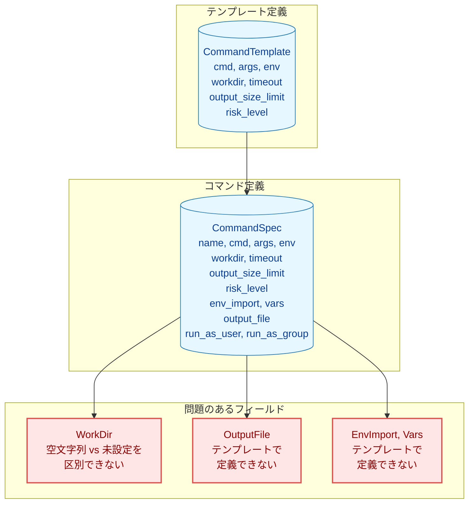

# テンプレート継承機能拡張 - 要件定義書

## 1. 概要

### 1.1 背景

タスク 0062 でコマンドテンプレート機能が導入され、コマンド定義の再利用性と保守性が向上した。しかし、現在の実装ではテンプレートからコマンドへの継承に一貫性のない部分がある。

#### 現状の問題点



1. **WorkDir の扱いが不統一**
   - 現在は空文字列チェックでフォールバック
   - ポインタ型ではないため、「明示的に空文字列（カレントディレクトリ）を設定」と「未設定（テンプレートから継承）」を区別できない
   - 他の実行設定フィールド（Timeout, OutputSizeLimit, RiskLevel）は既にポインタ型で統一されている

2. **OutputFile がテンプレートで定義できない**
   - 共通の出力ファイルパターンをテンプレートで定義できない
   - 例: ログファイルパス `/var/log/${service}/${date}.log`

3. **EnvImport, Vars の継承がない**
   - テンプレートで必要な環境変数のインポートを定義できない
   - テンプレートで共通の変数定義を設定できない

### 1.2 目的

テンプレート機能を拡張し、以下を実現する：

1. **WorkDir の継承モデル統一**: ポインタ型に変更し、他のフィールドと一貫した動作を実現
2. **OutputFile のテンプレートサポート**: 共通の出力ファイルパターンをテンプレートで定義可能に
3. **EnvImport, Vars の継承サポート**: テンプレートで定義し、コマンドレベルとマージ可能に

### 1.3 スコープ

#### 対象範囲 (In Scope)

- WorkDir フィールドのポインタ型への変更
- OutputFile フィールドのテンプレートへの追加
- EnvImport, Vars フィールドのテンプレートへの追加
- マージセマンティクスの定義と実装
- 後方互換性の維持

#### 対象外 (Out of Scope)

- RunAsUser, RunAsGroup のテンプレートサポート
  - セキュリティ上の理由で、各コマンドで明示的に指定すべき
  - テンプレートでの強制は柔軟性を損なう
- テンプレートの継承・拡張機能（テンプレートから別のテンプレートを参照）
- 条件付きテンプレート展開

## 2. 機能要件

### 2.1 WorkDir のポインタ型への変更

#### F-001: WorkDir フィールドの型変更

**概要**: WorkDir フィールドを `string` から `*string` に変更し、継承セマンティクスを明確化する。

**現状の動作**:
```go
// 現在の実装 (expansion.go lines 1338-1342)
finalWorkDir := cmdSpec.WorkDir
if finalWorkDir == "" {
    finalWorkDir = expandedWorkDir  // テンプレートの値
}
```

**問題点**:
- `WorkDir = ""` が「カレントディレクトリを使用」と「未指定（テンプレートから継承）」の両方を意味
- 意図が不明確で、誤った動作の原因になりうる

**要求される動作**:

| コマンドの WorkDir | テンプレートの WorkDir | 最終的な WorkDir |
|-------------------|---------------------|-----------------|
| nil               | nil                 | カレントディレクトリ |
| nil               | "/some/path"        | "/some/path"（継承） |
| "" (空文字列)      | "/some/path"        | カレントディレクトリ（明示的オーバーライド） |
| "/other/path"     | "/some/path"        | "/other/path"（明示的オーバーライド） |

**後方互換性**:
- TOML で `workdir` を省略した場合、nil として解釈（継承を試みる）
- TOML で `workdir = ""` と明示した場合、空文字列ポインタとして解釈（カレントディレクトリを強制）
- TOML パーサーは `workdir = ""` を空文字列として区別できる必要がある

### 2.2 OutputFile のテンプレートサポート

#### F-002: OutputFile フィールドのテンプレート追加

**概要**: CommandTemplate に OutputFile フィールドを追加し、出力ファイルパターンをテンプレートで定義可能にする。

**ユースケース**:
```toml
[command_templates.backup_with_log]
cmd = "restic"
args = ["backup", "${path}"]
output_file = "/var/log/backup/${service_name}.log"

[[groups.commands]]
template = "backup_with_log"
params.path = "/data"
params.service_name = "database"
```

**継承ルール**:
- コマンドで output_file が指定されていれば、テンプレートの値をオーバーライド
- コマンドで指定されていなければ、テンプレートの値を継承
- テンプレートの output_file でもパラメータ展開（`${param}`）と変数展開（`%{var}`）をサポート

### 2.3 EnvImport のテンプレートサポート

#### F-003: EnvImport フィールドのテンプレート追加

**概要**: CommandTemplate に EnvImport フィールドを追加し、環境変数インポート設定をテンプレートで定義可能にする。

**ユースケース**:
```toml
[command_templates.aws_cli]
cmd = "aws"
env_import = ["AWS_ACCESS_KEY_ID", "AWS_SECRET_ACCESS_KEY", "AWS_DEFAULT_REGION"]

[[groups.commands]]
template = "aws_cli"
args = ["s3", "ls"]
env_import = ["AWS_PROFILE"]  # 追加でインポート
```

**マージルール**:
- テンプレートとコマンドの EnvImport は**和集合（union）**としてマージ
- 同じ変数名が両方に存在する場合は重複排除
- コマンドレベルで追加のインポートを指定可能

### 2.4 Vars のテンプレートサポート

#### F-004: Vars フィールドのテンプレート追加

**概要**: CommandTemplate に Vars フィールドを追加し、変数定義をテンプレートで定義可能にする。

**ユースケース**:
```toml
[command_templates.restic]
cmd = "restic"
vars.repo = "/backup/restic-repo"
vars.password_command = "cat /etc/restic/password"

[[groups.commands]]
template = "restic"
args = ["backup", "${path}"]
vars.path = "/data"  # テンプレートの vars にマージ
```

**マージルール**:
- テンプレートとコマンドの Vars は**マップのマージ**として処理
- 同じキーが存在する場合は**コマンドの値が優先**（オーバーライド）
- テンプレートでデフォルト値を提供し、コマンドで必要に応じて上書き

## 3. 非機能要件

### 3.1 後方互換性

#### NF-001: 既存設定ファイルの互換性

- 既存の TOML 設定ファイルは変更なしで動作すること
- WorkDir の空文字列チェックによるフォールバックは維持（nil と解釈）
- テンプレートの新規フィールドはすべてオプショナル

### 3.2 パフォーマンス

#### NF-002: 展開処理のオーバーヘッド

- マージ処理による実行時オーバーヘッドは最小限に抑える
- 大量のコマンド定義でもリニアなスケーリングを維持

### 3.3 エラー処理

#### NF-003: 明確なエラーメッセージ

- 継承やマージでエラーが発生した場合、どのフィールドでどの値が問題かを明示
- デバッグ用に継承元（テンプレート or コマンド）を示す情報をログ出力

### 3.4 ドキュメント

#### NF-004: ユーザードキュメントの更新

- テンプレート機能のドキュメントを拡張
- マージセマンティクスの詳細な説明
- 移行ガイド（WorkDir の動作変更について）

## 4. 制約事項

### 4.1 技術的制約

- Go の TOML パーサー（go-toml/v2）の制約に従う
- ポインタ型フィールドの TOML マッピング動作を考慮
- 既存のセキュリティ検証フローとの整合性を維持

### 4.2 セキュリティ制約

- RunAsUser, RunAsGroup はテンプレートサポート対象外
- テンプレートでの env_import はコマンドの env_allowlist の検証を通過する必要がある
- output_file の変数展開はセキュリティ検証（パス検証）を通過する必要がある

## 5. 受け入れ基準

### 5.1 WorkDir

- [ ] WorkDir が nil のコマンドでテンプレートの WorkDir を継承できる
- [ ] WorkDir が空文字列のコマンドでカレントディレクトリを明示的に使用できる
- [ ] 既存の設定ファイル（workdir 省略）が正しく動作する

### 5.2 OutputFile

- [ ] テンプレートで output_file を定義できる
- [ ] コマンドで output_file をオーバーライドできる
- [ ] output_file でパラメータ展開（`${param}`）が動作する
- [ ] output_file で変数展開（`%{var}`）が動作する

### 5.3 EnvImport

- [ ] テンプレートで env_import を定義できる
- [ ] コマンドとテンプレートの env_import が和集合としてマージされる
- [ ] 重複する変数名が適切に排除される

### 5.4 Vars

- [ ] テンプレートで vars を定義できる
- [ ] コマンドとテンプレートの vars がマージされる
- [ ] 同じキーはコマンドの値が優先される

## 6. 用語集

| 用語 | 定義 |
|-----|------|
| テンプレート | `[command_templates.<name>]` で定義される再利用可能なコマンド定義 |
| 継承 | テンプレートからコマンドへのフィールド値の引き継ぎ |
| オーバーライド | コマンドレベルでテンプレートの値を上書きすること |
| マージ | テンプレートとコマンドの値を組み合わせること（EnvImport, Vars） |
| パラメータ展開 | `${param}` 形式の変数を params の値で置換する処理 |
| 変数展開 | `%{var}` 形式の変数を vars や自動変数で置換する処理 |
