# テンプレートファイルのInclude機能 - アーキテクチャ設計書

## 1. 設計の全体像

### 1.1 設計原則

本機能の設計において、以下の原則を採用する：

1. **既存設計の尊重**
   - 既存のテンプレート機能を最大限活用
   - 設定ファイルの読み込みフローへの最小限の変更

2. **セキュリティファースト**
   - Includeファイルもチェックサム検証対象
   - パストラバーサル攻撃の防止
   - シンボリックリンクの安全な処理

3. **明確なエラーハンドリング**
   - Include関連のエラーは詳細な情報を提供
   - ファイルパス、定義場所、エラー原因を明示

4. **段階的な機能拡張**
   - 多段includeは禁止（将来拡張の余地を残す）
   - テンプレートファイルは `command_templates` のみ（責務の明確化）

### 1.2 コンセプトモデル

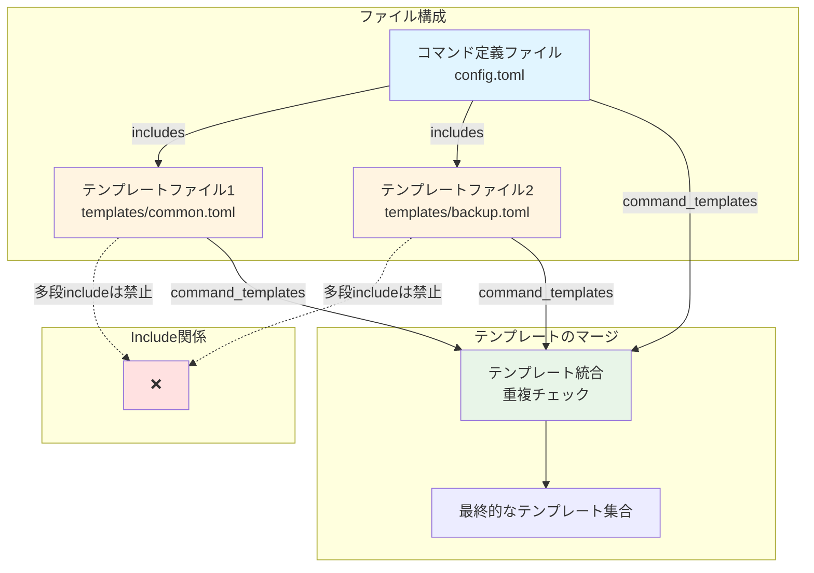

**設計の核心**:
- コマンド定義ファイルが複数のテンプレートファイルを参照
- テンプレートファイルは再利用可能な `command_templates` 定義のみを含む
- すべてのテンプレートは読み込み時に統合され、重複がチェックされる
- 多段include（テンプレートファイルからのinclude）は禁止

## 2. システム構成

### 2.1 全体アーキテクチャ

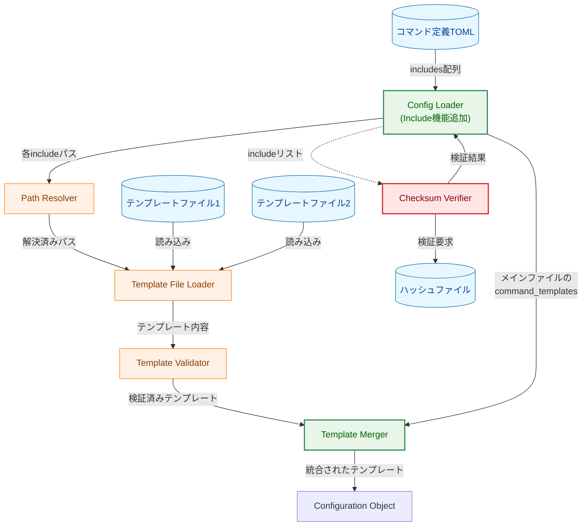

**凡例（Legend）**

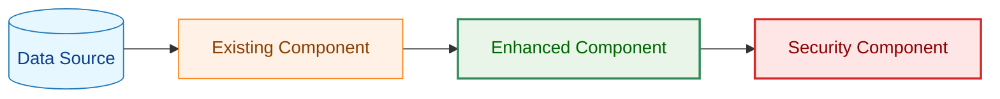

### 2.2 コンポーネント配置

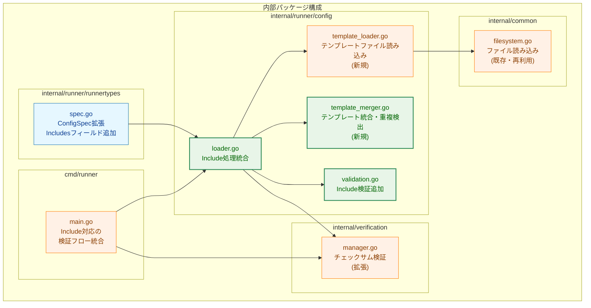

### 2.3 データフロー

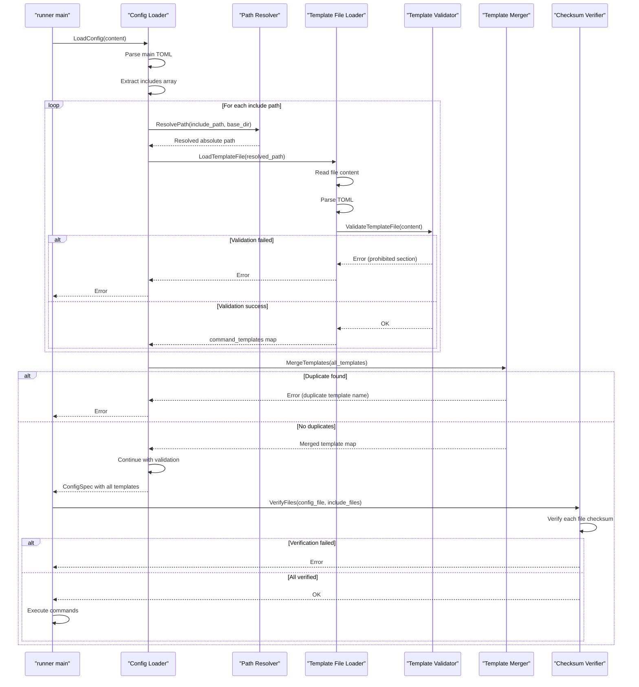

## 3. コンポーネント設計

### 3.1 データ構造の拡張

#### 3.1.1 ConfigSpec 構造体の拡張

```go
// internal/runner/runnertypes/spec.go
type ConfigSpec struct {
    Version          string                      `toml:"version"`

    // 新規フィールド: Includeするテンプレートファイルのリスト
    Includes         []string                    `toml:"includes"`

    Global           GlobalSpec                  `toml:"global"`
    CommandTemplates map[string]CommandTemplate  `toml:"command_templates"`
    Groups           []GroupSpec                 `toml:"groups"`
}
```

**設計のポイント**:
- `Includes` は文字列配列として定義
- 省略可能（デフォルトは空配列）
- パスは相対パスまたは絶対パスを受け付ける
- **重要**: コマンド定義ファイルも `DisallowUnknownFields()` でパースすることで、未定義のフィールド・セクションを検出

#### 3.1.2 テンプレートファイル専用構造体

```go
// internal/runner/config/template_loader.go
type TemplateFileSpec struct {
    Version          string                      `toml:"version"`
    CommandTemplates map[string]CommandTemplate  `toml:"command_templates"`
}
```

**設計のポイント**:
- テンプレートファイルは `version` と `command_templates` のみを許可
- `toml.Decoder.DisallowUnknownFields()` を使用して、未定義のフィールド・セクションをすべてエラーとする
- これにより `includes`, `[global]`, `[[groups]]`, `[misc]` など、定義されていないあらゆるフィールドを検出可能
- 明示的な禁止リストではなく、許可リスト方式で安全性を確保

### 3.2 パス解決

#### 3.2.1 相対パス解決の戦略

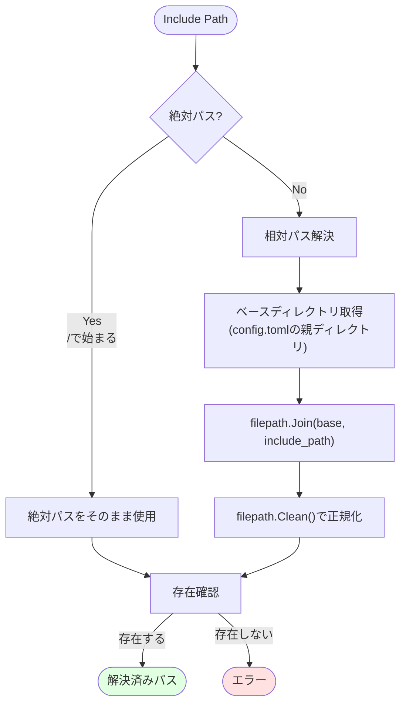

**実装の詳細**:
- ベースディレクトリはコマンド定義TOMLファイルの親ディレクトリ
- `filepath.Join()` でパスを結合
- `filepath.Clean()` で正規化（`.`, `..` の解決）
- パストラバーサル対策として、解決後のパスが想定範囲外でないか確認

#### 3.2.2 パス解決インターフェース

```go
// internal/runner/config/path_resolver.go
type PathResolver interface {
    // ResolvePath resolves an include path relative to the base directory.
    // Returns the absolute path or an error if the file does not exist.
    ResolvePath(includePath string, baseDir string) (string, error)
}
```

**責務**:
- 相対パスと絶対パスの両方に対応
- ファイルの存在確認
- セキュリティ検証（パストラバーサル防止）

### 3.3 テンプレートファイルの読み込みと検証

#### 3.3.1 読み込みプロセス

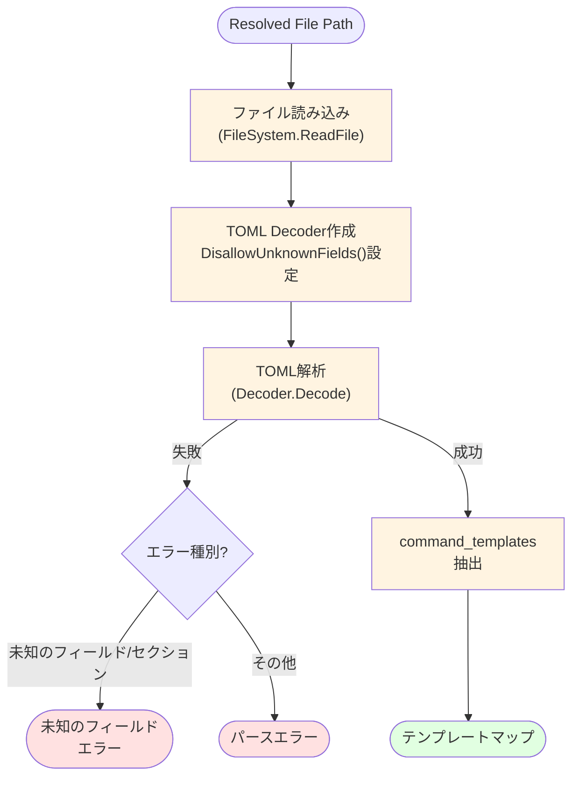

**検証項目**:
1. TOMLとしてパース可能か
2. `version` と `command_templates` 以外のフィールド・セクションが存在しないか
   - `DisallowUnknownFields()` により、`includes`, `[global]`, `[[groups]]`, `[misc]` など未定義のあらゆるフィールドを自動検出
3. 許可リスト方式により、新たな禁止項目の追加が不要

#### 3.3.2 テンプレートローダーインターフェース

```go
// internal/runner/config/template_loader.go
type TemplateFileLoader interface {
    // LoadTemplateFile loads and validates a template file.
    // Returns the command_templates map or an error.
    LoadTemplateFile(path string) (map[string]CommandTemplate, error)
}
```

**責務**:
- テンプレートファイルの読み込み
- TOML解析
- 禁止セクション・フィールドの検出
- `command_templates` の抽出

### 3.4 テンプレートのマージと重複検出

#### 3.4.1 マージ戦略

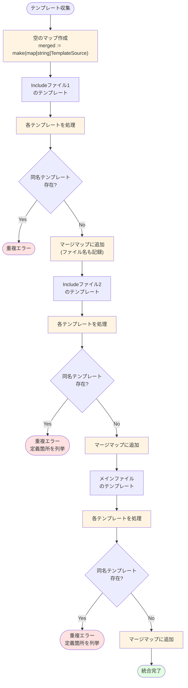

**重複検出の詳細**:
- テンプレート名をキーとしたマップを使用
- 各テンプレートの定義元ファイル名を記録
- 重複発見時は、すべての定義箇所を含むエラーを返す

#### 3.4.2 マージャーインターフェース

```go
// internal/runner/config/template_merger.go
type TemplateMerger interface {
    // MergeTemplates merges templates from multiple sources.
    // Returns merged templates or an error if duplicates are found.
    MergeTemplates(sources []TemplateSource) (map[string]CommandTemplate, error)
}

type TemplateSource struct {
    FilePath  string                      // 定義元ファイルパス
    Templates map[string]CommandTemplate  // テンプレート定義
}
```

**責務**:
- 複数のテンプレートソースを統合
- 重複するテンプレート名の検出
- 重複エラー時の詳細情報提供

### 3.5 チェックサム検証の統合

#### 3.5.1 検証フロー

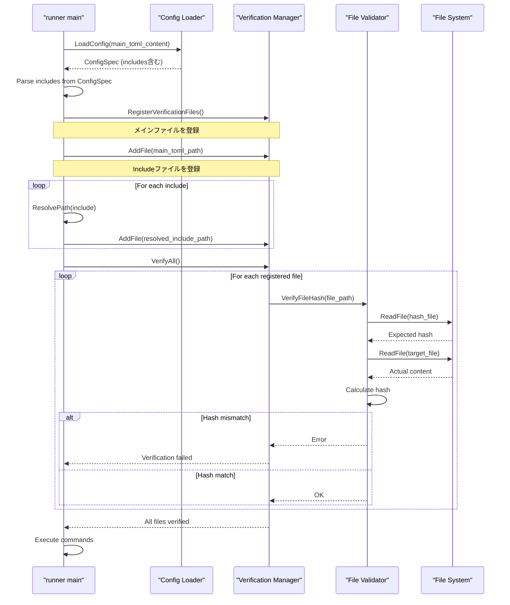

**検証のポイント**:
1. メインのコマンド定義ファイルを検証リストに追加
2. `includes` 配列の各ファイル（解決済みパス）を検証リストに追加
3. すべてのファイルのチェックサムを検証
4. 1つでも失敗したら実行を中止

#### 3.5.2 Verification Managerの拡張

```go
// internal/verification/manager.go
type Manager interface {
    // AddFile adds a file to the verification list
    AddFile(filePath string) error

    // VerifyAll verifies all registered files
    VerifyAll() error
}
```

**既存実装への影響**:
- 基本的な検証ロジックは既存のまま
- 複数ファイルの登録・検証に対応（既存機能の拡張）

## 4. エラーハンドリング設計

### 4.1 エラー型の定義

```go
// internal/runner/config/errors.go

// ErrIncludedFileNotFound is returned when an included file does not exist
type ErrIncludedFileNotFound struct {
    IncludePath    string // includes配列に記述されたパス
    ResolvedPath   string // 解決後の絶対パス
    ReferencedFrom string // includeを記述したファイル
}

// ErrConfigFileInvalidFormat is returned when a config file contains
// fields or sections other than version, includes, global, command_templates, and groups
type ErrConfigFileInvalidFormat struct {
    ConfigFile string // コマンド定義ファイルのパス
    ParseError error  // go-tomlからの元のエラー（未知のフィールド情報を含む）
}

// ErrTemplateFileInvalidFormat is returned when a template file contains
// fields or sections other than version and command_templates
type ErrTemplateFileInvalidFormat struct {
    TemplateFile string // テンプレートファイルのパス
    ParseError   error  // go-tomlからの元のエラー（未知のフィールド情報を含む）
}

// ErrDuplicateTemplateName is returned when the same template name
// is defined in multiple locations
type ErrDuplicateTemplateName struct {
    Name      string   // 重複しているテンプレート名
    Locations []string // 定義されているファイルパスの配列
}
```

**エラー型の設計変更**:
- `ErrMultiLevelInclude` と `ErrTemplateFileContainsProhibitedSection` を統合
- コマンド定義ファイル用に `ErrConfigFileInvalidFormat` を追加
- テンプレートファイル用に `ErrTemplateFileInvalidFormat` を使用
- `DisallowUnknownFields()` によって自動検出されるため、個別のチェックロジックが不要

### 4.2 エラーメッセージの設計

各エラー型は、ユーザーが問題を特定し修正できる詳細情報を提供する：

```go
func (e *ErrIncludedFileNotFound) Error() string {
    return fmt.Sprintf(
        "included file not found: %q\n"+
        "  Include path: %s (as written)\n"+
        "  Resolved path: %s\n"+
        "  Referenced from: %s",
        e.IncludePath,
        e.IncludePath,
        e.ResolvedPath,
        e.ReferencedFrom,
    )
}

func (e *ErrConfigFileInvalidFormat) Error() string {
    return fmt.Sprintf(
        "config file contains invalid fields or sections: %s\n"+
        "  File: %s\n"+
        "  Config files can only contain 'version', 'includes', 'global', 'command_templates', and 'groups'\n"+
        "  Detail: %v",
        e.ConfigFile,
        e.ConfigFile,
        e.ParseError,
    )
}

func (e *ErrTemplateFileInvalidFormat) Error() string {
    return fmt.Sprintf(
        "template file contains invalid fields or sections: %s\n"+
        "  File: %s\n"+
        "  Template files can only contain 'version' and 'command_templates'\n"+
        "  Detail: %v",
        e.TemplateFile,
        e.TemplateFile,
        e.ParseError,
    )
}

func (e *ErrDuplicateTemplateName) Error() string {
    locations := strings.Join(e.Locations, "\n    - ")
    return fmt.Sprintf(
        "duplicate command template name %q\n"+
        "  Defined in:\n    - %s",
        e.Name,
        locations,
    )
}
```

## 5. セキュリティ考慮事項

### 5.1 パストラバーサル対策

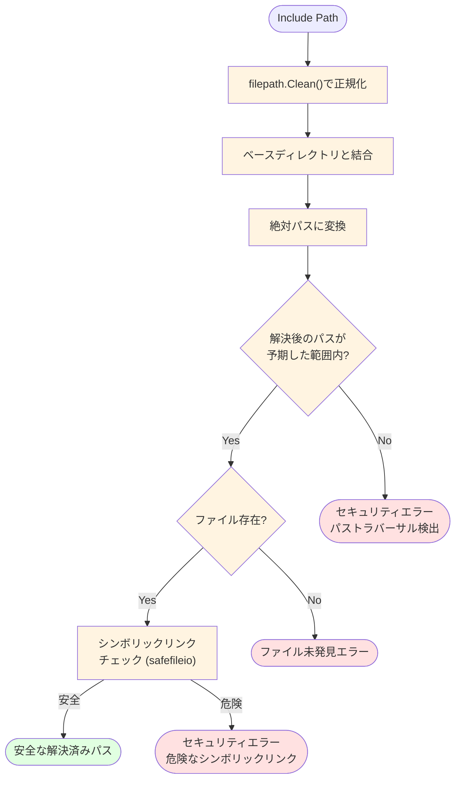

**実装方針**:
1. `filepath.Clean()` でパスを正規化
2. ベースディレクトリを基準に絶対パスを構築
3. 解決後のパスが意図した範囲内か確認
4. シンボリックリンクは `safefileio` パッケージで安全に処理

### 5.2 チェックサム検証の強制

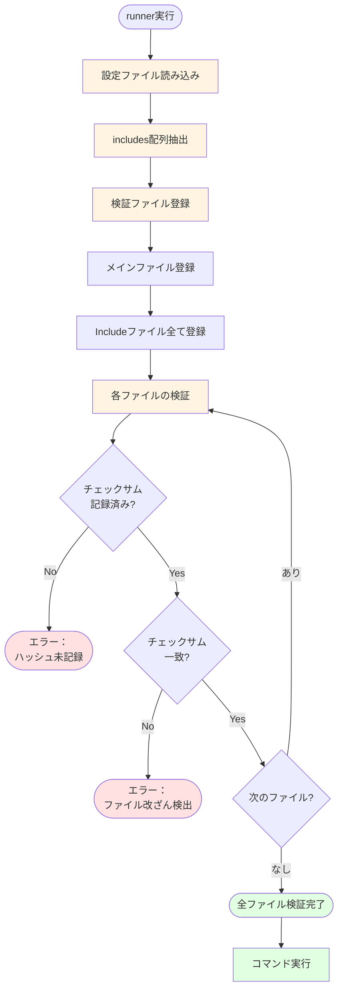

**セキュリティポリシー**:
- Includeファイルのチェックサムが記録されていない場合は実行拒否
- 1つでもチェックサム検証に失敗したら実行拒否
- ユーザーは事前に全ファイルに対して `record` コマンドを実行する必要がある

## 6. 処理フロー詳細

### 6.1 設定ファイル読み込みフロー

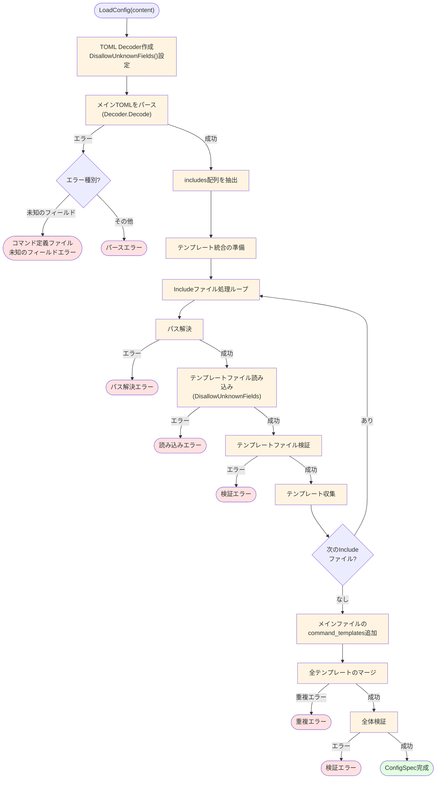

### 6.2 実行時検証フロー

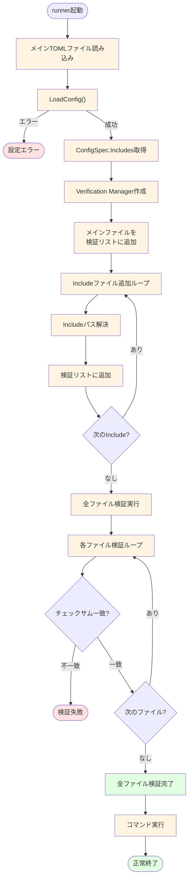

## 7. テスト戦略

### 7.1 ユニットテスト

各コンポーネントを独立してテスト：

1. **Path Resolver**
   - 相対パス解決の正確性
   - 絶対パスの処理
   - パストラバーサル検出
   - ファイル未発見の処理

2. **Config File Loader**
   - コマンド定義ファイルの読み込み（`DisallowUnknownFields()`使用）
   - 未定義のフィールド・セクション検出
   - パースエラー処理

3. **Template File Loader**
   - 正常なテンプレートファイルの読み込み（`DisallowUnknownFields()`使用）
   - 未定義のフィールド・セクション検出
   - パースエラー処理

4. **Template Merger**
   - 複数ソースからのマージ
   - 重複検出
   - 空のテンプレート処理
   - エラーメッセージの正確性

### 7.2 統合テスト

実際のファイル構成でエンドツーエンドをテスト：

```
testdata/
├── valid_single_include/
│   ├── config.toml          # 単一includeの正常系
│   └── templates/
│       └── common.toml
├── valid_multiple_includes/
│   ├── config.toml          # 複数includeの正常系
│   └── templates/
│       ├── backup.toml
│       └── restore.toml
├── duplicate_template/
│   ├── config.toml          # 重複エラーケース
│   └── templates/
│       ├── temp1.toml       # backup テンプレート定義
│       └── temp2.toml       # backup テンプレート定義（重複）
├── multi_level_include/
│   ├── config.toml
│   └── templates/
│       └── invalid.toml     # includes含む（エラー）
├── prohibited_section_in_template/
│   ├── config.toml
│   └── templates/
│       └── invalid.toml     # [global]含む（エラー）
├── unknown_field_in_config/
│   └── config.toml          # [misc]など未定義セクション含む（エラー）
└── relative_path_test/
    ├── configs/
    │   └── app.toml         # ../templates/common.toml を参照
    └── templates/
        └── common.toml
```

### 7.3 セキュリティテスト

1. **パストラバーサル攻撃**
   - `../../etc/passwd` のような危険なパス
   - シンボリックリンクによる攻撃

2. **チェックサム検証バイパス**
   - ハッシュファイルがない状態での実行試行
   - Includeファイルのみハッシュが欠けている状態

## 8. 実装の優先順位

### フェーズ1: 基本機能

1. `ConfigSpec` への `Includes` フィールド追加
2. Path Resolver の実装
3. Template File Loader の実装（基本的な読み込みと検証）
4. Template Merger の実装（重複検出）

### フェーズ2: 検証機能

1. エラー型の定義と実装
2. テンプレートファイルの禁止セクション検出
3. 多段include検出
4. 詳細なエラーメッセージ

### フェーズ3: セキュリティ統合

1. Verification Manager との統合
2. チェックサム検証フローへの組み込み
3. パストラバーサル対策の実装
4. シンボリックリンク安全性チェック

### フェーズ4: テストとドキュメント

1. ユニットテスト作成
2. 統合テスト作成
3. セキュリティテスト作成
4. ユーザードキュメント作成

## 9. 将来の拡張性

現在の設計は将来的な機能拡張を考慮している：

### 9.1 オプショナルInclude

```toml
# 将来の拡張案
includes = [
    {path = "templates/common.toml"},
    {path = "templates/optional.toml", optional = true}
]
```

現在の `[]string` から `[]IncludeSpec` への変更で対応可能。

### 9.2 Include時の名前空間プレフィックス

```toml
# 将来の拡張案
includes = [
    {path = "templates/common.toml", prefix = "common_"}
]
# → common_backup, common_restore としてインポート
```

Template Merger での処理追加で対応可能。

### 9.3 条件付きInclude

```toml
# 将来の拡張案
includes = [
    {path = "templates/linux.toml", os = "linux"},
    {path = "templates/darwin.toml", os = "darwin"}
]
```

Path Resolver での条件評価追加で対応可能。

## 10. 参考資料

- 既存のテンプレート機能: `internal/runner/config/template_expansion.go`
- 設定ファイルローダー: `internal/runner/config/loader.go`
- ファイル検証: `internal/verification/manager.go`
- 安全なファイルI/O: `internal/safefileio/`
- テンプレート検証: `internal/runner/config/validation.go`
