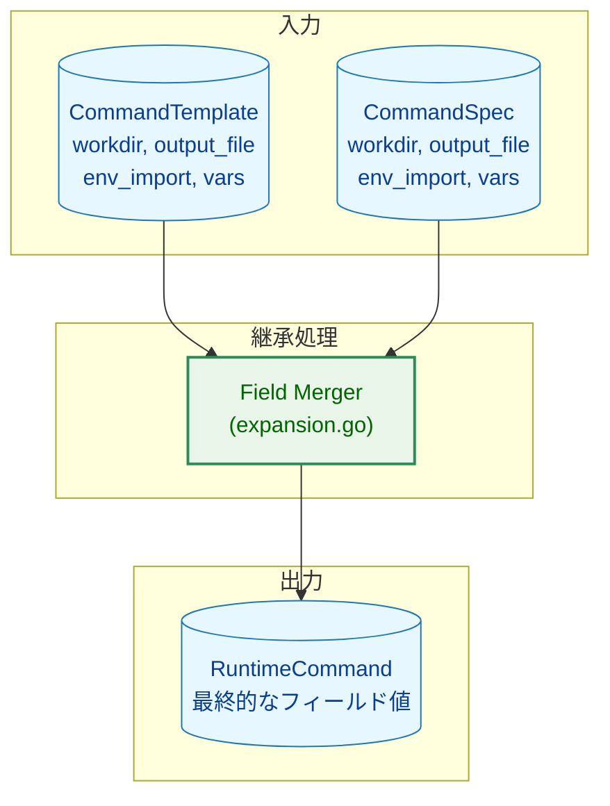
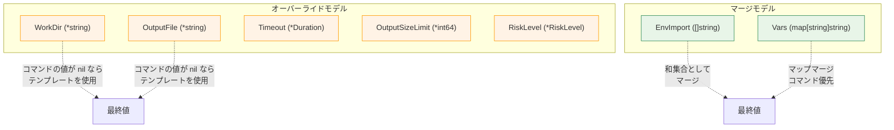
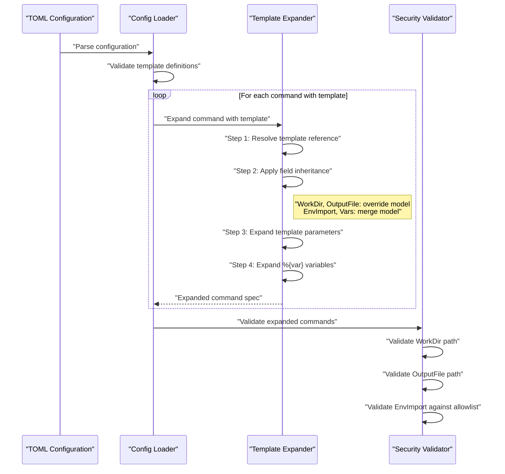
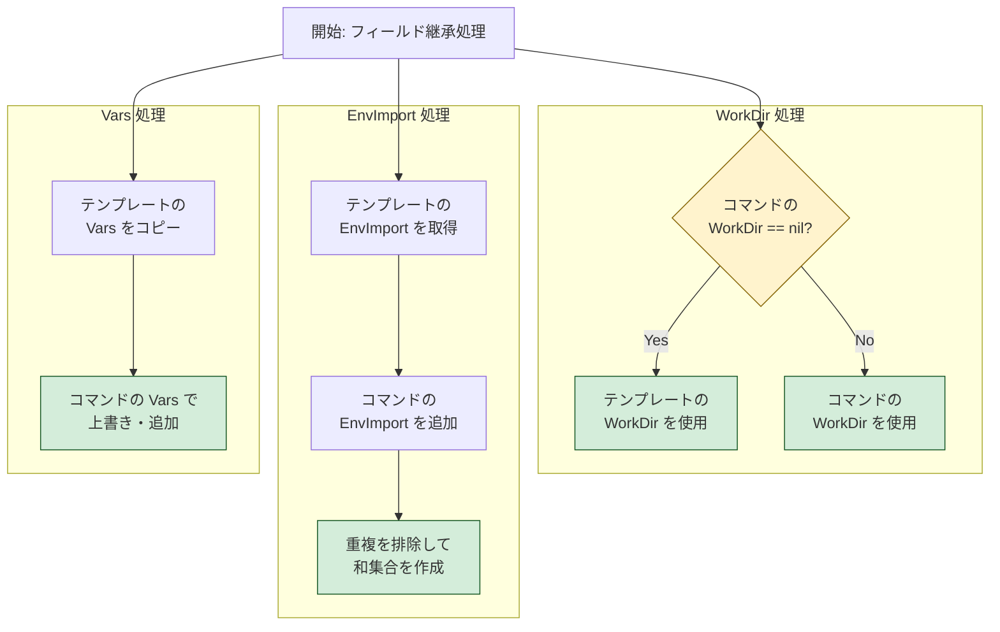
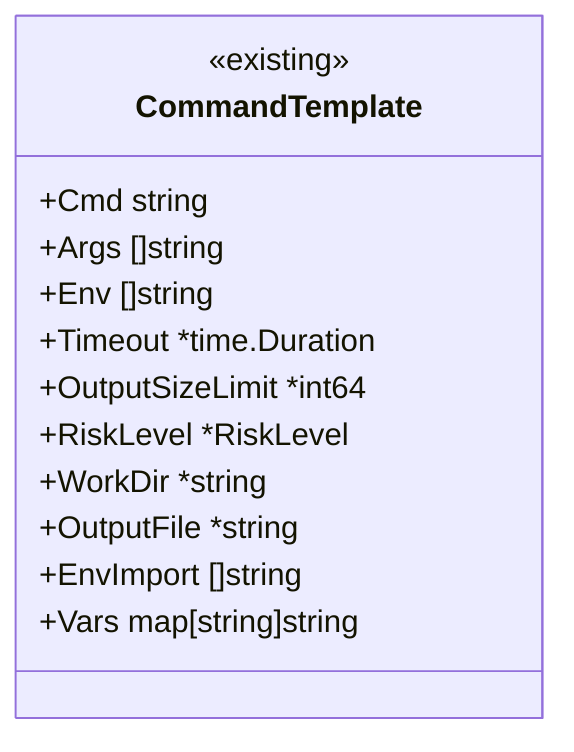
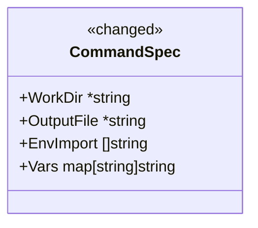
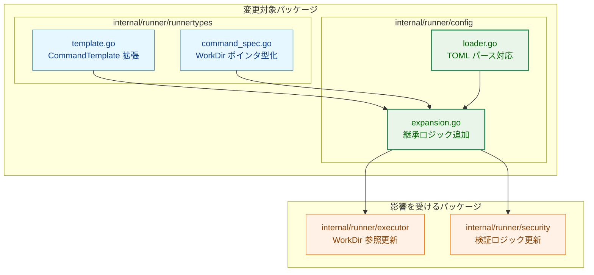
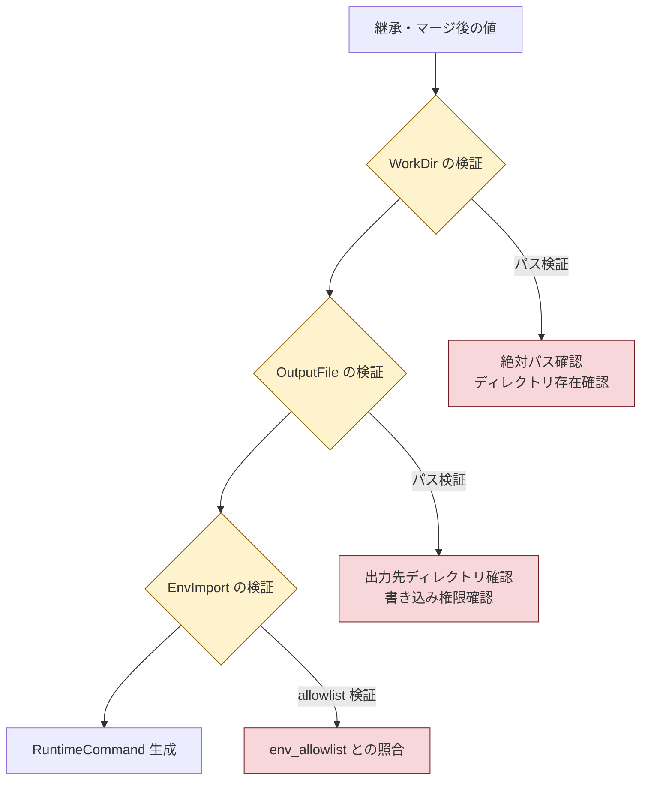

# テンプレート継承機能拡張 - アーキテクチャ設計書

## 1. システム概要

### 1.1 目的

テンプレート継承機能を拡張し、WorkDir, OutputFile, EnvImport, Vars の継承とマージをサポートする。既存のテンプレート展開アーキテクチャ（タスク 0062）に準拠し、一貫した継承モデルを実現する。

### 1.2 設計原則

1. **既存パターンとの一貫性**: Timeout, OutputSizeLimit, RiskLevel で採用されている継承パターンに準拠
2. **明示的な意図表現**: nil（未指定）と 空/ゼロ値（明示的な設定）を区別
3. **Defense in Depth**: 継承後もセキュリティ検証を実施
4. **最小変更原則**: 既存コードへの影響を最小化

## 2. 全体アーキテクチャ

### 2.1 継承フロー概要



### 2.2 フィールド別継承モデル



**凡例（Legend）**

| モデル | 対象フィールド | セマンティクス |
|-------|-------------|--------------|
| オーバーライド | WorkDir, OutputFile, Timeout など | コマンドの値が nil ならテンプレートを使用、非 nil ならコマンドの値 |
| マージ | EnvImport, Vars | テンプレートとコマンドの値を組み合わせ |

## 3. データフロー

### 3.1 展開処理全体フロー



### 3.2 フィールド継承の詳細フロー



## 4. コンポーネント設計

### 4.1 データ構造の変更

#### 4.1.1 CommandTemplate の拡張



#### 4.1.2 CommandSpec の WorkDir 変更



### 4.2 継承ロジック

#### 4.2.1 オーバーライドモデル（WorkDir, OutputFile）

```
入力:
  template.WorkDir = "/template/path"
  command.WorkDir = nil

処理:
  if command.WorkDir == nil {
      result.WorkDir = template.WorkDir
  } else {
      result.WorkDir = command.WorkDir
  }

出力:
  result.WorkDir = "/template/path"
```

#### 4.2.2 マージモデル（EnvImport）

```
入力:
  template.EnvImport = ["VAR_A", "VAR_B"]
  command.EnvImport = ["VAR_B", "VAR_C"]

処理:
  result.EnvImport = unique(template.EnvImport + command.EnvImport)

出力:
  result.EnvImport = ["VAR_A", "VAR_B", "VAR_C"]
```

#### 4.2.3 マージモデル（Vars）

```
入力:
  template.Vars = {"key1": "template_value1", "key2": "template_value2"}
  command.Vars = {"key2": "command_value2", "key3": "command_value3"}

処理:
  result.Vars = copy(template.Vars)
  for key, value in command.Vars {
      result.Vars[key] = value  // コマンドが優先
  }

出力:
  result.Vars = {"key1": "template_value1", "key2": "command_value2", "key3": "command_value3"}
```

## 5. コンポーネント配置

### 5.1 パッケージ構成



### 5.2 主要な変更ファイル

| ファイル | 変更内容 |
|---------|---------|
| `internal/runner/runnertypes/template.go` | CommandTemplate に WorkDir, OutputFile, EnvImport, Vars を追加 |
| `internal/runner/runnertypes/command_spec.go` | CommandSpec の WorkDir を *string に変更 |
| `internal/runner/config/expansion.go` | 継承・マージロジックの実装 |
| `internal/runner/config/loader.go` | TOML パース時の nil 判定対応 |

## 6. セキュリティ考慮事項

### 6.1 検証フロー



### 6.2 RunAsUser, RunAsGroup について

これらのフィールドは意図的にテンプレートサポート対象外としている：

- セキュリティ上重要なフィールドであり、各コマンドで明示的に指定すべき
- テンプレートでの暗黙的な設定は、セキュリティレビューを困難にする
- 誤設定のリスクが高く、意図しない権限でコマンドが実行される可能性がある

## 7. 後方互換性

### 7.1 TOML パース動作

| TOML 記述 | 解釈 | 動作 |
|----------|------|------|
| フィールド省略 | nil ポインタ | テンプレートから継承 |
| `workdir = ""` | 空文字列ポインタ | カレントディレクトリを明示 |
| `workdir = "/path"` | 値ありポインタ | 指定パスを使用 |

### 7.2 既存設定の移行

既存の設定ファイルは変更なしで動作する：

- `workdir` を省略している場合 → nil として解釈され、従来通りテンプレートから継承
- `workdir` に値を設定している場合 → 従来通りその値を使用

## 8. テスト戦略

### 8.1 単体テスト

- 各フィールドの継承動作（nil → テンプレート値）
- 各フィールドのオーバーライド動作（非 nil → コマンド値）
- EnvImport の和集合マージ
- Vars のマップマージ（コマンド優先）
- エッジケース（両方 nil、両方空、など）

### 8.2 統合テスト

- 実際の TOML ファイルを使用した継承動作
- セキュリティ検証との組み合わせ
- 変数展開との組み合わせ

## 9. 実装順序

1. **Phase 1**: データ構造の変更（CommandTemplate, CommandSpec）
2. **Phase 2**: 継承ロジックの実装（expansion.go）
3. **Phase 3**: TOML パースの対応（loader.go）
4. **Phase 4**: セキュリティ検証の更新
5. **Phase 5**: テストの追加と既存テストの修正
6. **Phase 6**: ドキュメントの更新
