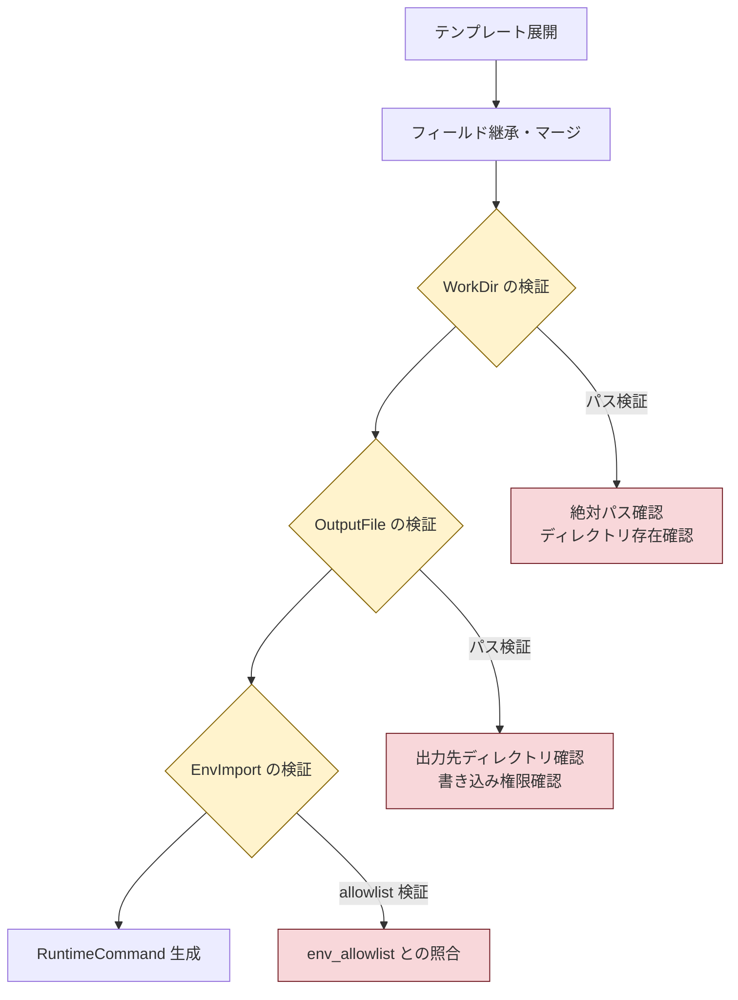

# テンプレート継承機能拡張 - 詳細仕様書

## 1. 型定義

### 1.1 CommandTemplate の拡張

既存の `CommandTemplate` 構造体に以下のフィールドを追加する。

**ファイル**: `internal/runner/runnertypes/spec.go`

```go
type CommandTemplate struct {
	// 既存フィールド
	Cmd             string   `toml:"cmd"`
	Args            []string `toml:"args"`
	EnvVars         []string `toml:"env_vars"`
	WorkDir         string   `toml:"workdir"`  // 型変更: string → *string
	Timeout         *int32   `toml:"timeout"`
	OutputSizeLimit *int64   `toml:"output_size_limit"`
	RiskLevel       *string  `toml:"risk_level"`

	// 新規追加フィールド
	OutputFile *string          `toml:"output_file"` // 出力ファイルパス (nil: 未指定)
	EnvImport  []string         `toml:"env_import"`  // 環境変数インポート設定
	Vars       map[string]any   `toml:"vars"`        // 変数定義
}
```

**変更内容**:
1. **WorkDir の型変更**: `string` → `*string`
   - nil: 未指定（継承可能）
   - 空文字列ポインタ: カレントディレクトリを明示
   - 値ありポインタ: 指定されたパスを使用

2. **OutputFile の追加**: `*string` 型
   - nil: 出力ファイル未指定
   - 非 nil: 出力ファイルパスを指定

3. **EnvImport の追加**: `[]string` 型
   - 環境変数インポート設定をテンプレートレベルで定義可能

4. **Vars の追加**: `map[string]any` 型
   - 変数定義をテンプレートレベルで定義可能

### 1.2 CommandSpec の WorkDir 型変更

**ファイル**: `internal/runner/runnertypes/spec.go`

```go
type CommandSpec struct {
	// Basic information
	Name        string `toml:"name"`
	Description string `toml:"description"`

	// Template reference
	Template string                 `toml:"template"`
	Params   map[string]interface{} `toml:"params"`

	// Command definition
	Cmd     string   `toml:"cmd"`
	Args    []string `toml:"args"`
	EnvVars []string `toml:"env_vars"`
	WorkDir *string  `toml:"workdir"` // 型変更: string → *string

	// 既存のその他のフィールド...
	OutputFile      *string          `toml:"output_file"`
	EnvImport       []string         `toml:"env_import"`
	Vars            map[string]any   `toml:"vars"`
	Timeout         *int32           `toml:"timeout"`
	OutputSizeLimit *int64           `toml:"output_size_limit"`
	RiskLevel       *string          `toml:"risk_level"`
	RunAsUser       string           `toml:"run_as_user"`
	RunAsGroup      string           `toml:"run_as_group"`
}
```

**変更内容**:
- **WorkDir の型変更**: `string` → `*string`
  - 他の実行設定フィールド（Timeout, OutputSizeLimit, RiskLevel）と一貫した継承モデルを実現

## 2. 継承・マージアルゴリズム

### 2.1 オーバーライドモデル（WorkDir, OutputFile）

オーバーライドモデルは、コマンドの値が nil の場合のみテンプレートから継承する。

```go
// OverrideStringPointer applies the override model for *string fields.
//
// Inheritance rule:
//   - If command value is nil, inherit from template
//   - If command value is non-nil (including empty string), use command value
//
// Parameters:
//   - cmdValue: Command-level value (nil or *string)
//   - templateValue: Template-level value (nil or *string)
//
// Returns:
//   - Final value after applying inheritance
func OverrideStringPointer(cmdValue *string, templateValue *string) *string {
	if cmdValue == nil {
		return templateValue
	}
	return cmdValue
}
```

**使用例**:

| コマンドの値 | テンプレートの値 | 最終的な値 | 説明 |
|------------|----------------|-----------|------|
| nil | nil | nil | カレントディレクトリ |
| nil | "/template/path" | "/template/path" | テンプレートから継承 |
| "" (空文字列) | "/template/path" | "" | カレントディレクトリ（明示的オーバーライド） |
| "/cmd/path" | "/template/path" | "/cmd/path" | コマンドの値を使用 |

### 2.2 マージモデル（EnvImport）

EnvImport は和集合としてマージされる。

```go
// MergeEnvImport merges environment import lists from template and command.
//
// Merge rule:
//   - Union (no duplicates) of template and command env_import
//   - Order: template entries first, then command entries
//   - Duplicates are removed (case-sensitive comparison)
//
// Parameters:
//   - templateEnvImport: Template-level env_import
//   - cmdEnvImport: Command-level env_import
//
// Returns:
//   - Merged env_import list with duplicates removed
func MergeEnvImport(templateEnvImport []string, cmdEnvImport []string) []string {
	seen := make(map[string]struct{})
	var result []string

	// Add template entries first
	for _, item := range templateEnvImport {
		if _, exists := seen[item]; !exists {
			seen[item] = struct{}{}
			result = append(result, item)
		}
	}

	// Add command entries
	for _, item := range cmdEnvImport {
		if _, exists := seen[item]; !exists {
			seen[item] = struct{}{}
			result = append(result, item)
		}
	}

	return result
}
```

**使用例**:

```
入力:
  template.EnvImport = ["VAR_A", "VAR_B"]
  command.EnvImport = ["VAR_B", "VAR_C"]

処理:
  1. テンプレートから VAR_A, VAR_B を追加
  2. コマンドから VAR_C を追加（VAR_B は重複のため除外）

出力:
  result.EnvImport = ["VAR_A", "VAR_B", "VAR_C"]
```

### 2.3 マージモデル（Vars）

Vars はマップマージとして処理され、コマンドの値が優先される。

```go
// MergeVars merges variable definitions from template and command.
//
// Merge rule:
//   - Start with a copy of template vars
//   - Overlay command vars (command values override template values for same keys)
//   - Command values take precedence on key conflicts
//
// Parameters:
//   - templateVars: Template-level vars
//   - cmdVars: Command-level vars
//
// Returns:
//   - Merged vars map with command values taking precedence
func MergeVars(templateVars map[string]any, cmdVars map[string]any) map[string]any {
	if len(templateVars) == 0 && len(cmdVars) == 0 {
		return make(map[string]any)
	}

	// Create result map with capacity
	result := make(map[string]any, len(templateVars)+len(cmdVars))

	// Copy template vars
	for key, value := range templateVars {
		result[key] = value
	}

	// Overlay command vars (overrides template)
	for key, value := range cmdVars {
		result[key] = value
	}

	return result
}
```

**使用例**:

```
入力:
  template.Vars = {
    "key1": "template_value1",
    "key2": "template_value2"
  }
  command.Vars = {
    "key2": "command_value2",
    "key3": "command_value3"
  }

処理:
  1. テンプレートの vars をコピー: {"key1": "template_value1", "key2": "template_value2"}
  2. コマンドの vars でオーバーレイ:
     - "key2" は上書き → "command_value2"
     - "key3" を追加 → "command_value3"

出力:
  result.Vars = {
    "key1": "template_value1",
    "key2": "command_value2",
    "key3": "command_value3"
  }
```

## 3. 継承統合関数

### 3.1 ApplyTemplateInheritance 関数

テンプレート展開後の CommandSpec にテンプレートフィールドを継承・マージする。

**ファイル**: `internal/runner/config/expansion.go`

```go
// ApplyTemplateInheritance applies template field inheritance to an expanded CommandSpec.
//
// This function is called AFTER template parameter expansion (${param}) and applies
// field-level inheritance for WorkDir, OutputFile, EnvImport, and Vars.
//
// Inheritance models:
//   - WorkDir: Override model (nil in command → use template value)
//   - OutputFile: Override model (nil in command → use template value)
//   - EnvImport: Merge model (union of template and command)
//   - Vars: Merge model (map merge, command values override template)
//
// Parameters:
//   - expandedSpec: CommandSpec after template parameter expansion
//   - template: Original CommandTemplate
//
// Returns:
//   - CommandSpec with template fields inherited/merged
func ApplyTemplateInheritance(
	expandedSpec *CommandSpec,
	template *CommandTemplate,
) *CommandSpec {
	// WorkDir: Override model
	if expandedSpec.WorkDir == nil && template.WorkDir != nil {
		expandedSpec.WorkDir = template.WorkDir
	}

	// OutputFile: Override model
	if expandedSpec.OutputFile == nil && template.OutputFile != nil {
		expandedSpec.OutputFile = template.OutputFile
	}

	// EnvImport: Merge model
	expandedSpec.EnvImport = MergeEnvImport(template.EnvImport, expandedSpec.EnvImport)

	// Vars: Merge model
	expandedSpec.Vars = MergeVars(template.Vars, expandedSpec.Vars)

	return expandedSpec
}
```

### 3.2 expandTemplateToSpec の更新

既存の `expandTemplateToSpec` 関数を更新し、継承処理を統合する。

```go
// expandTemplateToSpec expands a template into a CommandSpec.
//
// Processing steps:
//   1. Validate template definition
//   2. Collect used parameters
//   3. Expand template parameters (${param})
//   4. Apply field inheritance (WorkDir, OutputFile, EnvImport, Vars)
//
// Returns:
//   - Expanded CommandSpec
//   - Warnings (e.g., unused params)
//   - Error if any
func expandTemplateToSpec(
	cmdSpec *CommandSpec,
	template *CommandTemplate,
) (*CommandSpec, []string, error) {
	var warnings []string
	params := cmdSpec.Params
	templateName := cmdSpec.Template

	// Step 1: Collect used parameters for warning detection
	usedParams, err := CollectUsedParams(template)
	if err != nil {
		return nil, nil, err
	}

	// Check for unused params
	for paramName := range params {
		if _, ok := usedParams[paramName]; !ok {
			warnings = append(warnings, fmt.Sprintf(
				"unused parameter %q in template %q",
				paramName, templateName,
			))
		}
	}

	// Step 2: Expand cmd
	expandedCmd, err := expandTemplateString(template.Cmd, params, templateName, "cmd")
	if err != nil {
		return nil, nil, err
	}

	// Step 3: Expand args
	expandedArgs, err := ExpandTemplateArgs(template.Args, params, templateName)
	if err != nil {
		return nil, nil, err
	}

	// Step 4: Expand env_vars
	expandedEnvVars, err := expandTemplateEnv(template.EnvVars, params, templateName)
	if err != nil {
		return nil, nil, err
	}

	// Step 5: Expand workdir (if non-nil)
	var expandedWorkDir *string
	if template.WorkDir != nil {
		wd, err := expandTemplateString(*template.WorkDir, params, templateName, "workdir")
		if err != nil {
			return nil, nil, err
		}
		expandedWorkDir = &wd
	}

	// Step 6: Expand output_file (if non-nil)
	var expandedOutputFile *string
	if template.OutputFile != nil {
		of, err := expandTemplateString(*template.OutputFile, params, templateName, "output_file")
		if err != nil {
			return nil, nil, err
		}
		expandedOutputFile = &of
	}

	// Step 7: Create expanded CommandSpec with basic fields
	expanded := &CommandSpec{
		Name:            cmdSpec.Name,
		Description:     cmdSpec.Description,
		Cmd:             expandedCmd,
		Args:            expandedArgs,
		EnvVars:         expandedEnvVars,
		WorkDir:         expandedWorkDir,
		OutputFile:      expandedOutputFile,
		Timeout:         template.Timeout,
		OutputSizeLimit: template.OutputSizeLimit,
		RiskLevel:       template.RiskLevel,
		// Preserve command-level fields
		EnvImport: cmdSpec.EnvImport,
		Vars:      cmdSpec.Vars,
		RunAsUser: cmdSpec.RunAsUser,
		RunAsGroup: cmdSpec.RunAsGroup,
	}

	// Step 8: Apply field inheritance (WorkDir, OutputFile, EnvImport, Vars)
	expanded = ApplyTemplateInheritance(expanded, template)

	return expanded, warnings, nil
}
```

## 4. TOML パース処理

### 4.1 ポインタ型フィールドのパース動作

Go の `go-toml/v2` パーサーは以下のように動作する:

| TOML 記述 | Go での解釈 | 動作 |
|----------|------------|------|
| フィールド省略 | `nil` ポインタ | テンプレートから継承 |
| `workdir = ""` | 空文字列へのポインタ | カレントディレクトリを明示 |
| `workdir = "/path"` | "/path" へのポインタ | 指定パスを使用 |

この動作は既存の Timeout, OutputSizeLimit, RiskLevel と一貫している。

### 4.2 TOML パース例

```toml
# テンプレート定義
[command_templates.with_workdir]
cmd = "pwd"
workdir = "/template/dir"
output_file = "/var/log/output.log"
env_import = ["VAR_A", "VAR_B"]
vars.template_var = "template_value"

# コマンド定義例 1: WorkDir を継承
[[groups.commands]]
name = "inherit_workdir"
template = "with_workdir"
# workdir 省略 → nil → テンプレートの "/template/dir" を継承

# コマンド定義例 2: WorkDir をオーバーライド
[[groups.commands]]
name = "override_workdir"
template = "with_workdir"
workdir = "/custom/dir"
# workdir = "/custom/dir" → テンプレートの値を上書き

# コマンド定義例 3: カレントディレクトリを明示
[[groups.commands]]
name = "explicit_current_dir"
template = "with_workdir"
workdir = ""
# workdir = "" → 空文字列を明示的に設定（カレントディレクトリ）

# コマンド定義例 4: EnvImport と Vars のマージ
[[groups.commands]]
name = "merge_fields"
template = "with_workdir"
env_import = ["VAR_C"]  # テンプレートと和集合 → ["VAR_A", "VAR_B", "VAR_C"]
vars.command_var = "command_value"  # テンプレートとマージ
# 最終的な vars: {template_var: "template_value", command_var: "command_value"}
```

## 5. セキュリティ検証

### 5.1 検証タイミング

継承・マージ処理の**後**にセキュリティ検証を実施する。



### 5.2 WorkDir のセキュリティ検証

```go
// ValidateWorkDir validates the working directory path.
//
// Validation rules:
//   - If workdir is nil or empty, no validation (use current directory)
//   - If workdir is non-empty:
//     - Must be an absolute path
//     - Directory must exist (or be creatable if configured)
//     - No symlink attacks (checked by safefileio)
//
// This validation is applied AFTER template inheritance.
func ValidateWorkDir(workdir *string) error {
	if workdir == nil || *workdir == "" {
		return nil // Current directory, no validation needed
	}

	path := *workdir

	// Must be absolute path
	if !filepath.IsAbs(path) {
		return &ErrInvalidWorkDir{
			Path:   path,
			Reason: "working directory must be an absolute path",
		}
	}

	// Directory existence check (delegated to existing validation)
	// This is done during RuntimeCommand creation

	return nil
}
```

### 5.3 OutputFile のセキュリティ検証

```go
// ValidateOutputFile validates the output file path.
//
// Validation rules:
//   - If output_file is nil or empty, no validation (no output redirection)
//   - If output_file is non-empty:
//     - Parent directory must exist
//     - No path traversal patterns
//     - Write permission check
//     - No symlink attacks (checked by safefileio)
//
// This validation is applied AFTER template inheritance.
func ValidateOutputFile(outputFile *string) error {
	if outputFile == nil || *outputFile == "" {
		return nil // No output redirection, no validation needed
	}

	path := *outputFile

	// Delegate to existing output path validation
	// (implemented in internal/runner/output package)

	return nil
}
```

### 5.4 EnvImport のセキュリティ検証

```go
// ValidateEnvImport validates that all imported environment variables
// are in the allowed list.
//
// This validation is applied AFTER merge of template and command env_import.
//
// Parameters:
//   - envImport: Merged env_import list
//   - envAllowed: Allowed environment variables (from env_allowed)
//
// Returns:
//   - Error if any env_import entry is not in env_allowed
func ValidateEnvImport(envImport []string, envAllowed []string) error {
	allowedSet := make(map[string]struct{})
	for _, allowed := range envAllowed {
		allowedSet[allowed] = struct{}{}
	}

	for _, imported := range envImport {
		if _, ok := allowedSet[imported]; !ok {
			return &ErrEnvImportNotAllowed{
				Variable: imported,
			}
		}
	}

	return nil
}
```

## 6. エラー型定義

### 6.1 継承関連エラー

```go
// ErrInvalidWorkDir is returned when working directory is invalid.
type ErrInvalidWorkDir struct {
	Path   string
	Reason string
}

func (e *ErrInvalidWorkDir) Error() string {
	return fmt.Sprintf("invalid working directory %q: %s", e.Path, e.Reason)
}

// ErrEnvImportNotAllowed is returned when env_import contains
// a variable not in env_allowed.
type ErrEnvImportNotAllowed struct {
	Variable string
}

func (e *ErrEnvImportNotAllowed) Error() string {
	return fmt.Sprintf("environment variable %q in env_import is not in env_allowed", e.Variable)
}
```

## 7. テストケース

### 7.1 WorkDir 継承のテストケース

```go
func TestWorkDirInheritance(t *testing.T) {
	tests := []struct {
		name             string
		templateWorkDir  *string
		commandWorkDir   *string
		expectedWorkDir  *string
	}{
		{
			name:             "both nil",
			templateWorkDir:  nil,
			commandWorkDir:   nil,
			expectedWorkDir:  nil,
		},
		{
			name:             "inherit from template",
			templateWorkDir:  strPtr("/template/path"),
			commandWorkDir:   nil,
			expectedWorkDir:  strPtr("/template/path"),
		},
		{
			name:             "override with command",
			templateWorkDir:  strPtr("/template/path"),
			commandWorkDir:   strPtr("/command/path"),
			expectedWorkDir:  strPtr("/command/path"),
		},
		{
			name:             "explicit empty string",
			templateWorkDir:  strPtr("/template/path"),
			commandWorkDir:   strPtr(""),
			expectedWorkDir:  strPtr(""),
		},
	}

	for _, tt := range tests {
		t.Run(tt.name, func(t *testing.T) {
			result := OverrideStringPointer(tt.commandWorkDir, tt.templateWorkDir)
			if !equalStringPtr(result, tt.expectedWorkDir) {
				t.Errorf("expected %v, got %v", tt.expectedWorkDir, result)
			}
		})
	}
}

func strPtr(s string) *string {
	return &s
}

func equalStringPtr(a, b *string) bool {
	if a == nil && b == nil {
		return true
	}
	if a == nil || b == nil {
		return false
	}
	return *a == *b
}
```

### 7.2 EnvImport マージのテストケース

```go
func TestMergeEnvImport(t *testing.T) {
	tests := []struct {
		name         string
		templateEnv  []string
		commandEnv   []string
		expectedEnv  []string
	}{
		{
			name:         "both empty",
			templateEnv:  []string{},
			commandEnv:   []string{},
			expectedEnv:  []string{},
		},
		{
			name:         "template only",
			templateEnv:  []string{"VAR_A", "VAR_B"},
			commandEnv:   []string{},
			expectedEnv:  []string{"VAR_A", "VAR_B"},
		},
		{
			name:         "command only",
			templateEnv:  []string{},
			commandEnv:   []string{"VAR_C", "VAR_D"},
			expectedEnv:  []string{"VAR_C", "VAR_D"},
		},
		{
			name:         "merge with duplicates",
			templateEnv:  []string{"VAR_A", "VAR_B"},
			commandEnv:   []string{"VAR_B", "VAR_C"},
			expectedEnv:  []string{"VAR_A", "VAR_B", "VAR_C"},
		},
		{
			name:         "merge no duplicates",
			templateEnv:  []string{"VAR_A", "VAR_B"},
			commandEnv:   []string{"VAR_C", "VAR_D"},
			expectedEnv:  []string{"VAR_A", "VAR_B", "VAR_C", "VAR_D"},
		},
	}

	for _, tt := range tests {
		t.Run(tt.name, func(t *testing.T) {
			result := MergeEnvImport(tt.templateEnv, tt.commandEnv)
			if !equalStringSlice(result, tt.expectedEnv) {
				t.Errorf("expected %v, got %v", tt.expectedEnv, result)
			}
		})
	}
}
```

### 7.3 Vars マージのテストケース

```go
func TestMergeVars(t *testing.T) {
	tests := []struct {
		name         string
		templateVars map[string]any
		commandVars  map[string]any
		expectedVars map[string]any
	}{
		{
			name:         "both empty",
			templateVars: map[string]any{},
			commandVars:  map[string]any{},
			expectedVars: map[string]any{},
		},
		{
			name:         "template only",
			templateVars: map[string]any{"key1": "value1"},
			commandVars:  map[string]any{},
			expectedVars: map[string]any{"key1": "value1"},
		},
		{
			name:         "command only",
			templateVars: map[string]any{},
			commandVars:  map[string]any{"key2": "value2"},
			expectedVars: map[string]any{"key2": "value2"},
		},
		{
			name:         "merge with override",
			templateVars: map[string]any{"key1": "template_value1", "key2": "template_value2"},
			commandVars:  map[string]any{"key2": "command_value2", "key3": "command_value3"},
			expectedVars: map[string]any{"key1": "template_value1", "key2": "command_value2", "key3": "command_value3"},
		},
		{
			name:         "merge no conflict",
			templateVars: map[string]any{"key1": "value1"},
			commandVars:  map[string]any{"key2": "value2"},
			expectedVars: map[string]any{"key1": "value1", "key2": "value2"},
		},
	}

	for _, tt := range tests {
		t.Run(tt.name, func(t *testing.T) {
			result := MergeVars(tt.templateVars, tt.commandVars)
			if !equalVarsMap(result, tt.expectedVars) {
				t.Errorf("expected %v, got %v", tt.expectedVars, result)
			}
		})
	}
}
```

### 7.4 統合テストケース

```go
func TestTemplateInheritanceIntegration(t *testing.T) {
	toml := `
version = "1.0"

[command_templates.full_template]
cmd = "pwd"
workdir = "/template/dir"
output_file = "/var/log/output.log"
env_import = ["TEMPLATE_VAR_A", "TEMPLATE_VAR_B"]
vars.template_key = "template_value"

[[groups]]
name = "test_group"

[[groups.commands]]
name = "inherit_all"
template = "full_template"
# すべてテンプレートから継承

[[groups.commands]]
name = "override_workdir"
template = "full_template"
workdir = "/custom/dir"
# WorkDir のみオーバーライド

[[groups.commands]]
name = "merge_fields"
template = "full_template"
env_import = ["COMMAND_VAR_C"]
vars.command_key = "command_value"
# EnvImport と Vars をマージ
`

	loader := NewLoader()
	cfg, err := loader.LoadConfig([]byte(toml))
	require.NoError(t, err)

	// Test "inherit_all" command
	cmd1 := cfg.Groups[0].Commands[0]
	assert.Equal(t, "inherit_all", cmd1.Name)
	// WorkDir は継承される
	assert.NotNil(t, cmd1.WorkDir)
	assert.Equal(t, "/template/dir", *cmd1.WorkDir)
	// OutputFile も継承される
	assert.NotNil(t, cmd1.OutputFile)
	assert.Equal(t, "/var/log/output.log", *cmd1.OutputFile)
	// EnvImport も継承される
	assert.Equal(t, []string{"TEMPLATE_VAR_A", "TEMPLATE_VAR_B"}, cmd1.EnvImport)

	// Test "override_workdir" command
	cmd2 := cfg.Groups[0].Commands[1]
	assert.Equal(t, "override_workdir", cmd2.Name)
	// WorkDir はオーバーライド
	assert.NotNil(t, cmd2.WorkDir)
	assert.Equal(t, "/custom/dir", *cmd2.WorkDir)
	// OutputFile は継承
	assert.NotNil(t, cmd2.OutputFile)
	assert.Equal(t, "/var/log/output.log", *cmd2.OutputFile)

	// Test "merge_fields" command
	cmd3 := cfg.Groups[0].Commands[2]
	assert.Equal(t, "merge_fields", cmd3.Name)
	// EnvImport はマージされる
	assert.ElementsMatch(t, []string{"TEMPLATE_VAR_A", "TEMPLATE_VAR_B", "COMMAND_VAR_C"}, cmd3.EnvImport)
	// Vars はマージされる
	assert.Equal(t, "template_value", cmd3.Vars["template_key"])
	assert.Equal(t, "command_value", cmd3.Vars["command_key"])
}
```

## 8. 実装ファイル一覧

| ファイル | 変更内容 |
|---------|---------|
| `internal/runner/runnertypes/spec.go` | CommandTemplate と CommandSpec の型定義変更 |
| `internal/runner/config/expansion.go` | 継承・マージロジックの実装 |
| `internal/runner/config/template_inheritance.go` | 継承ヘルパー関数の実装（新規） |
| `internal/runner/config/template_inheritance_test.go` | 継承機能のユニットテスト（新規） |
| `internal/runner/executor/*.go` | WorkDir 参照の更新（*string 対応） |
| `internal/runner/security/*.go` | セキュリティ検証の更新 |

## 9. 後方互換性

### 9.1 既存設定ファイルとの互換性

既存の設定ファイルは以下の理由で変更なしで動作する:

1. **WorkDir の型変更**:
   - TOML で `workdir` を省略 → nil として解釈（従来通り）
   - TOML で `workdir = ""` → 空文字列ポインタとして解釈（カレントディレクトリ）
   - TOML で `workdir = "/path"` → "/path" ポインタとして解釈（従来通り）

2. **新規フィールドはオプショナル**:
   - `OutputFile`, `EnvImport`, `Vars` は省略可能
   - 省略した場合は nil または空として扱われる

### 9.2 移行パス

既存のコードで `WorkDir string` を使用している箇所は、以下のように更新する必要がある:

```go
// 変更前
if cmdSpec.WorkDir == "" {
	// カレントディレクトリを使用
}

// 変更後
if cmdSpec.WorkDir == nil || *cmdSpec.WorkDir == "" {
	// カレントディレクトリを使用
}
```

ヘルパー関数を提供して移行を簡素化する:

```go
// GetWorkDirOrEmpty returns the working directory or empty string if nil.
func GetWorkDirOrEmpty(workdir *string) string {
	if workdir == nil {
		return ""
	}
	return *workdir
}
```

## 10. パフォーマンス考慮事項

### 10.1 メモリ使用量

- ポインタ型への変更により、各 CommandSpec/CommandTemplate で追加されるメモリは最大 8バイト（64bit環境）
- マップのコピー（Vars マージ）は shallow copy で十分
- 大量のコマンド定義でもリニアなスケーリングを維持

### 10.2 計算量

- `MergeEnvImport`: O(n + m) where n = len(templateEnvImport), m = len(cmdEnvImport)
- `MergeVars`: O(n + m) where n = len(templateVars), m = len(cmdVars)
- ハッシュマップの使用により重複排除は効率的

## 11. セキュリティ考慮事項のまとめ

1. **RunAsUser, RunAsGroup はテンプレートサポート対象外**
   - セキュリティ上重要なフィールドは各コマンドで明示的に指定すべき

2. **継承後のセキュリティ検証**
   - WorkDir, OutputFile, EnvImport は継承・マージ後に検証
   - 既存のセキュリティ検証フローを維持

3. **変数展開との順序**
   - テンプレート展開 → フィールド継承 → 変数展開 → セキュリティ検証
   - この順序により、最終的な値に対して検証を実施
