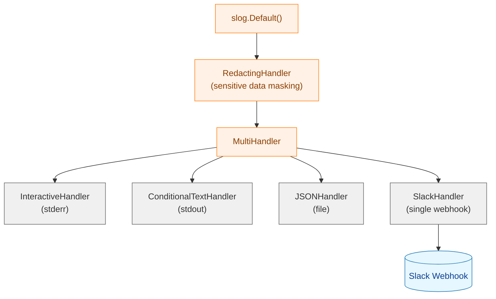
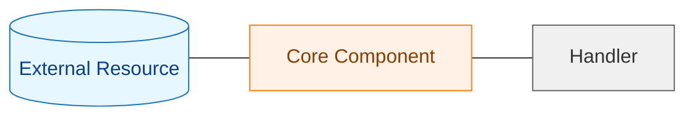
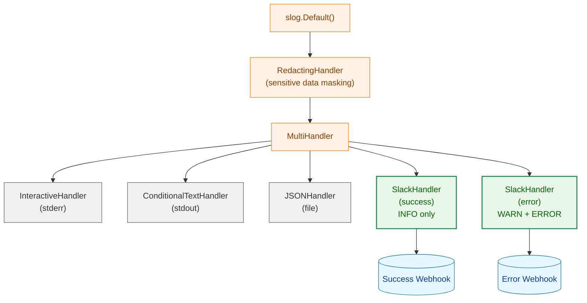
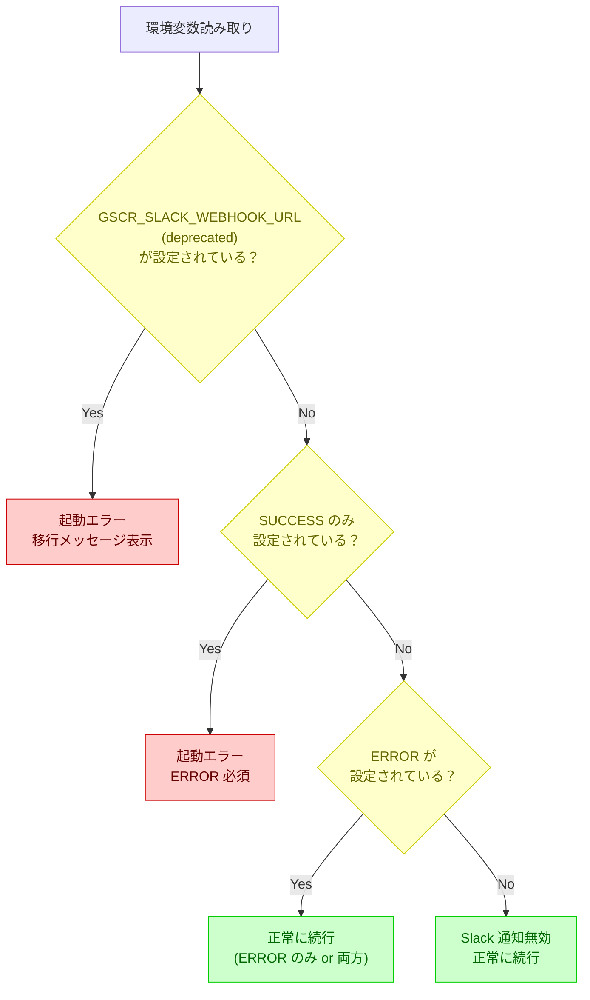
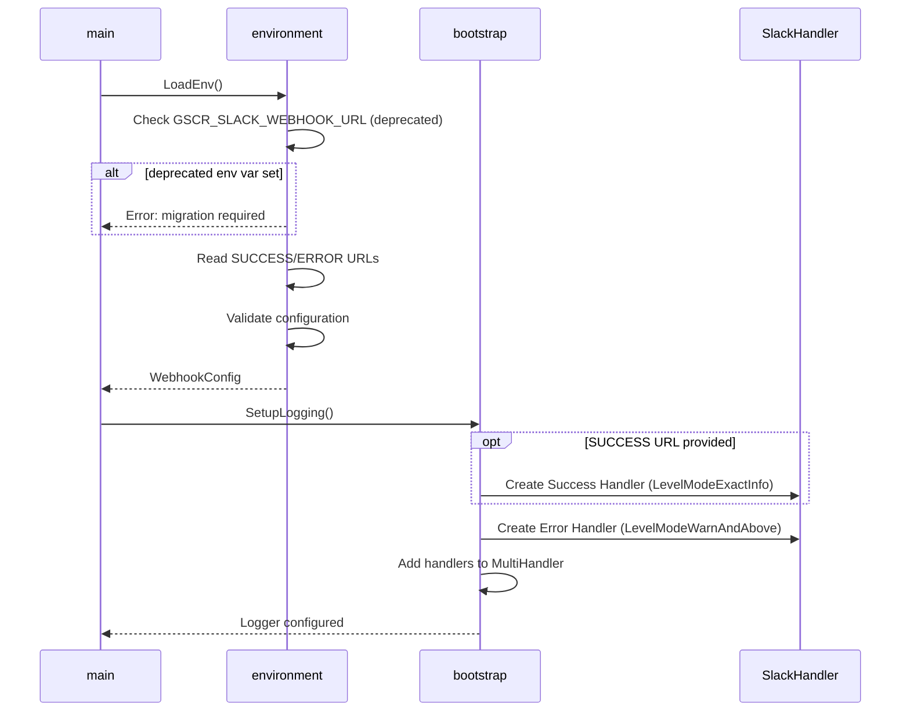
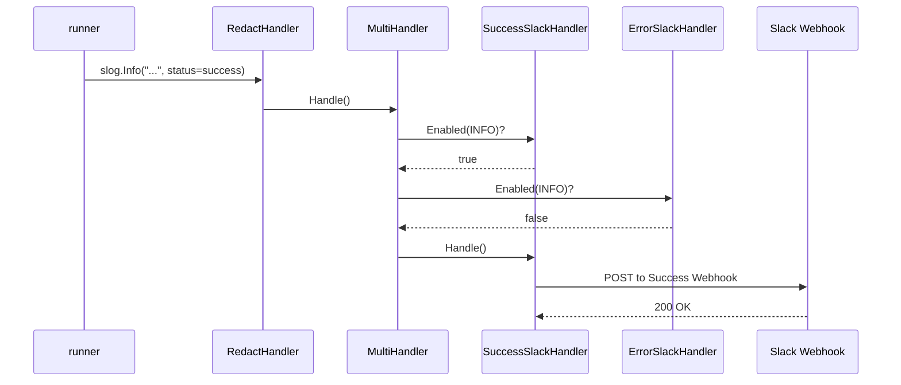
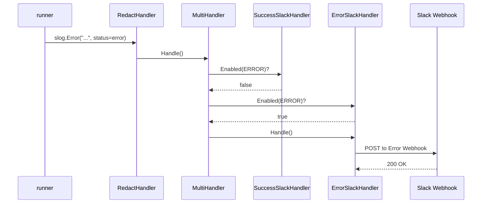

# Slack Webhook 分離機能 アーキテクチャ設計書

## 1. 概要

### 1.1 目的

本文書は、要件定義書（01_requirements.md）に基づき、正常時と異常時で異なる Slack webhook に通知を振り分ける機能のアーキテクチャ設計を定義する。

### 1.2 設計方針

- **既存アーキテクチャとの親和性**: 既存の `MultiHandler` パターンを活用
- **単一責任の原則**: 各 `SlackHandler` は単一のログレベル範囲のみを担当
- **後方互換性**: 既存環境変数・TOML 設定を検出し、移行を促すエラーを出力
- **Fail Fast**: 設定エラーは起動時に即座に検出・報告

## 2. 現行アーキテクチャ

### 2.1 現在のロギング構成



**凡例（Legend）**



### 2.2 現在の SlackHandler

- 単一の webhook URL を使用
- `slog.LevelInfo` 以上のすべてのログを処理
- `slack_notify: true` 属性を持つログのみ送信

### 2.3 現在の通知対象メッセージ

| message_type | 発生元 | ログレベル |
|-------------|--------|----------|
| `command_group_summary` | runner.go | INFO（固定） |
| `pre_execution_error` | pre_execution_error.go | ERROR |
| `security_alert` | audit/logger.go | ERROR/WARN |
| `privilege_escalation_failure` | audit/logger.go | WARN |
| `user_group_command_failure` | audit/logger.go | ERROR |

## 3. 新アーキテクチャ

### 3.1 ロギング構成（変更後）



### 3.2 SlackHandler の分離設計

2つの独立した `SlackHandler` インスタンスを作成し、それぞれ異なるログレベルフィルタを適用する。

#### 3.2.1 Success SlackHandler

- **Level Filter**: `slog.LevelInfo` のみ（`level == slog.LevelInfo`）
- **Webhook**: `GSCR_SLACK_WEBHOOK_URL_SUCCESS`
- **対象**: `command_group_summary` (status=success)

#### 3.2.2 Error SlackHandler

- **Level Filter**: `slog.LevelWarn` 以上（`level >= slog.LevelWarn`）
- **Webhook**: `GSCR_SLACK_WEBHOOK_URL_ERROR`
- **対象**:
  - `command_group_summary` (status=error)
  - `pre_execution_error`
  - `security_alert`
  - `privilege_escalation_failure`
  - `user_group_command_failure`

### 3.3 ログレベル振り分け詳細

#### 3.3.1 command_group_summary のログレベル変更

現在は status に関わらず `INFO` レベル固定だが、以下のように変更する：

| status | 変更前 | 変更後 | 送信先 |
|--------|--------|--------|--------|
| success | INFO | INFO | Success webhook |
| error | INFO | **ERROR** | Error webhook |

#### 3.3.2 その他メッセージタイプ（変更なし）

| message_type | ログレベル | 送信先 |
|-------------|-----------|--------|
| pre_execution_error | ERROR | Error webhook |
| security_alert | ERROR/WARN | Error webhook |
| privilege_escalation_failure | WARN | Error webhook |
| user_group_command_failure | ERROR | Error webhook |

### 3.4 Level Filter 実装方式

`SlackHandler` に新しいフィルタリングモードを導入する。

```go
// SlackHandlerLevelMode defines how the handler filters log levels
type SlackHandlerLevelMode int

const (
    // LevelModeDefault handles all levels >= configured level (existing behavior)
    LevelModeDefault SlackHandlerLevelMode = iota
    // LevelModeExactInfo handles only INFO level (for success webhook)
    LevelModeExactInfo
    // LevelModeWarnAndAbove handles only WARN and above (for error webhook)
    LevelModeWarnAndAbove
)
```

## 4. コンポーネント詳細設計

### 4.1 SlackHandler の拡張

#### 4.1.1 SlackHandlerOptions の変更

```go
// SlackHandlerOptions holds configuration for creating a SlackHandler
type SlackHandlerOptions struct {
    WebhookURL    string
    RunID         string
    HTTPClient    *http.Client
    BackoffConfig BackoffConfig
    IsDryRun      bool
    LevelMode     SlackHandlerLevelMode  // NEW: Level filtering mode
}
```

#### 4.1.2 Enabled メソッドの拡張

```go
func (s *SlackHandler) Enabled(_ context.Context, level slog.Level) bool {
    switch s.levelMode {
    case LevelModeExactInfo:
        return level == slog.LevelInfo
    case LevelModeWarnAndAbove:
        return level >= slog.LevelWarn
    default:
        return level >= s.level
    }
}
```

### 4.2 環境変数の設計

#### 4.2.1 新しい環境変数

| 環境変数名 | 用途 | 必須 |
|-----------|------|-----|
| `GSCR_SLACK_WEBHOOK_URL_SUCCESS` | 正常通知用 webhook | 条件付き |
| `GSCR_SLACK_WEBHOOK_URL_ERROR` | 異常通知用 webhook | 条件付き |

#### 4.2.2 設定バリデーションロジック



### 4.3 LoggerConfig の変更

```go
// LoggerConfig holds all configuration for logger setup
type LoggerConfig struct {
    Level                  slog.Level
    LogDir                 string
    RunID                  string
    SlackWebhookURLSuccess string  // NEW: Success webhook URL
    SlackWebhookURLError   string  // NEW: Error webhook URL
    ConsoleWriter          io.Writer
    DryRun                 bool
}
```

### 4.4 logGroupExecutionSummary の変更

```go
func (r *Runner) logGroupExecutionSummary(
    groupSpec *runnertypes.GroupSpec,
    result *groupExecutionResult,
    duration time.Duration,
) {
    // Determine log level based on execution status
    logLevel := slog.LevelInfo
    if result.status == GroupExecutionStatusError {
        logLevel = slog.LevelError
    }

    slog.Log(context.Background(), logLevel,
        "Command group execution completed",
        common.GroupSummaryAttrs.Group, groupSpec.Name,
        common.GroupSummaryAttrs.Status, result.status,
        common.GroupSummaryAttrs.Commands, result.commands,
        common.GroupSummaryAttrs.DurationMs, duration.Milliseconds(),
        "run_id", r.runID,
        "slack_notify", true,
        "message_type", "command_group_summary",
    )
}
```

## 5. 変更対象ファイル一覧

| ファイル | 変更内容 | 影響度 |
|---------|---------|-------|
| internal/logging/slack_handler.go | LevelMode フィールド追加、Enabled メソッド変更 | 中 |
| internal/logging/pre_execution_error.go | 環境変数定数の追加・更新 | 低 |
| internal/runner/bootstrap/logger.go | LoggerConfig 変更、2つの SlackHandler 作成 | 高 |
| internal/runner/bootstrap/environment.go | 新環境変数の読み取り、旧環境変数の検出 | 中 |
| internal/runner/runner.go | logGroupExecutionSummary のログレベル変更 | 低 |
| cmd/runner/main.go | 環境変数の受け渡し | 低 |

## 6. シーケンス図

### 6.1 起動時の設定検証



### 6.2 通知送信時のフロー（成功時）



### 6.3 通知送信時のフロー（失敗時）



## 7. エラーメッセージ設計

### 7.1 旧環境変数検出時

```
Error: GSCR_SLACK_WEBHOOK_URL is deprecated.

Please migrate to the new webhook configuration:
  export GSCR_SLACK_WEBHOOK_URL_SUCCESS="<your_webhook_url>"
  export GSCR_SLACK_WEBHOOK_URL_ERROR="<your_webhook_url>"

For more information, see the migration guide at:
  https://github.com/isseis/go-safe-cmd-runner/docs/user/runner_command.md#slack-webhook-configuration
```

### 7.2 SUCCESS のみ設定時

```
Error: Invalid Slack webhook configuration.

GSCR_SLACK_WEBHOOK_URL_SUCCESS is set but GSCR_SLACK_WEBHOOK_URL_ERROR is not.
Error notifications must be enabled to prevent silent failures.

Please set GSCR_SLACK_WEBHOOK_URL_ERROR:
  export GSCR_SLACK_WEBHOOK_URL_ERROR="<your_webhook_url>"

To use the same webhook for both success and error notifications:
  export GSCR_SLACK_WEBHOOK_URL_SUCCESS="<your_webhook_url>"
  export GSCR_SLACK_WEBHOOK_URL_ERROR="<your_webhook_url>"
```

### 7.3 TOML に slack_webhook_url 記述時

```
Error: slack_webhook_url in TOML configuration is not supported.

Webhook URLs contain sensitive credentials and should not be stored in
version-controlled configuration files.

Please use environment variables instead:
  export GSCR_SLACK_WEBHOOK_URL_SUCCESS="<your_webhook_url>"
  export GSCR_SLACK_WEBHOOK_URL_ERROR="<your_webhook_url>"

Remove 'slack_webhook_url' from your TOML configuration file to continue.
```

## 8. テスト設計

### 8.1 ユニットテスト

#### 8.1.1 SlackHandler レベルフィルタテスト

| テストケース | 入力 | 期待結果 |
|-------------|------|---------|
| LevelModeExactInfo + INFO | INFO ログ | 処理される |
| LevelModeExactInfo + WARN | WARN ログ | スキップ |
| LevelModeExactInfo + ERROR | ERROR ログ | スキップ |
| LevelModeWarnAndAbove + INFO | INFO ログ | スキップ |
| LevelModeWarnAndAbove + WARN | WARN ログ | 処理される |
| LevelModeWarnAndAbove + ERROR | ERROR ログ | 処理される |

#### 8.1.2 環境変数バリデーションテスト

| テストケース | SUCCESS | ERROR | OLD | 期待結果 |
|-------------|---------|-------|-----|---------|
| 両方設定 | ✓ | ✓ | - | 正常 |
| ERROR のみ | - | ✓ | - | 正常（INFO通知なし） |
| SUCCESS のみ | ✓ | - | - | エラー |
| 両方未設定 | - | - | - | Slack無効 |
| 旧変数設定 | - | - | ✓ | エラー（移行メッセージ） |
| 同一URL | ✓ | ✓ | - | 正常（URL同一） |

### 8.2 統合テスト

モックサーバーを使用した webhook 送信テスト：

```go
func TestSlackWebhookSeparation(t *testing.T) {
    successReceived := make(chan SlackMessage, 1)
    errorReceived := make(chan SlackMessage, 1)

    successServer := httptest.NewServer(http.HandlerFunc(func(w http.ResponseWriter, r *http.Request) {
        var msg SlackMessage
        json.NewDecoder(r.Body).Decode(&msg)
        successReceived <- msg
        w.WriteHeader(http.StatusOK)
    }))
    defer successServer.Close()

    errorServer := httptest.NewServer(http.HandlerFunc(func(w http.ResponseWriter, r *http.Request) {
        var msg SlackMessage
        json.NewDecoder(r.Body).Decode(&msg)
        errorReceived <- msg
        w.WriteHeader(http.StatusOK)
    }))
    defer errorServer.Close()

    // Test success notification goes to success webhook
    // Test error notification goes to error webhook
}
```

## 9. 移行ガイドライン

### 9.1 既存設定からの移行手順

1. **環境変数の確認**
   ```bash
   echo $GSCR_SLACK_WEBHOOK_URL
   ```

2. **新しい環境変数の設定**
   ```bash
   # 同一チャンネルに送信する場合
   export GSCR_SLACK_WEBHOOK_URL_SUCCESS="$GSCR_SLACK_WEBHOOK_URL"
   export GSCR_SLACK_WEBHOOK_URL_ERROR="$GSCR_SLACK_WEBHOOK_URL"

   # 異なるチャンネルに送信する場合
   export GSCR_SLACK_WEBHOOK_URL_SUCCESS="https://hooks.slack.com/services/.../success..."
   export GSCR_SLACK_WEBHOOK_URL_ERROR="https://hooks.slack.com/services/.../error..."
   ```

3. **旧環境変数の削除**
   ```bash
   unset GSCR_SLACK_WEBHOOK_URL
   ```

4. **動作確認**
   ```bash
   ./runner --dry-run sample/starter.toml group1
   ```

### 9.2 TOML からの移行

TOML ファイルに `slack_webhook_url` が記述されている場合：

1. TOML ファイルから `slack_webhook_url` 行を削除
2. 上記の環境変数設定手順に従う

## 10. 制約事項・前提条件

1. **環境変数のみサポート**: セキュリティ上の理由から、TOML での webhook URL 設定はサポートしない
2. **HTTPS 必須**: webhook URL は HTTPS スキームのみ許可
3. **CLI ログレベルとの独立性**: `--log-level` オプションは Slack 通知に影響しない
4. **リトライ動作**: 既存のリトライ設定を維持（3回、指数バックオフ）
