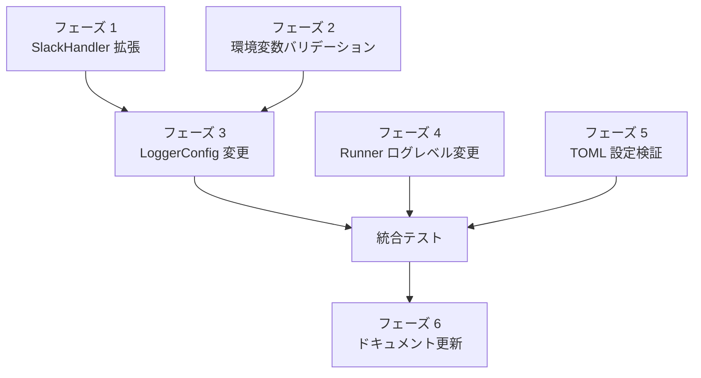

# Slack Webhook 分離機能 実装計画書

## 1. 概要

本文書は、Slack Webhook 分離機能の実装計画を定義する。

## 2. 実装フェーズ

### フェーズ 1: SlackHandler の拡張
### フェーズ 2: 環境変数バリデーション
### フェーズ 3: LoggerConfig の変更
### フェーズ 4: Runner のログレベル変更
### フェーズ 5: TOML 設定検証
### フェーズ 6: ドキュメント更新

## 3. 実装タスク

### フェーズ 1: SlackHandler の拡張

- [x] **1.1** `SlackHandlerLevelMode` 型と定数の追加
  - ファイル: `internal/logging/slack_handler.go`
  - 内容: `LevelModeDefault`, `LevelModeExactInfo`, `LevelModeWarnAndAbove` 定義

- [x] **1.2** `SlackHandlerOptions` に `LevelMode` フィールド追加
  - ファイル: `internal/logging/slack_handler.go`
  - 内容: 構造体に `LevelMode SlackHandlerLevelMode` を追加

- [x] **1.3** `SlackHandler` 構造体に `levelMode` フィールド追加
  - ファイル: `internal/logging/slack_handler.go`
  - 内容: 構造体に `levelMode SlackHandlerLevelMode` を追加

- [x] **1.4** `Enabled` メソッドの変更
  - ファイル: `internal/logging/slack_handler.go`
  - 内容: `levelMode` に応じたフィルタリングロジック実装

- [x] **1.5** `NewSlackHandler` の変更
  - ファイル: `internal/logging/slack_handler.go`
  - 内容: `LevelMode` オプションの処理追加

- [x] **1.6** `WithAttrs`/`WithGroup` での `levelMode` 引き継ぎ
  - ファイル: `internal/logging/slack_handler.go`
  - 内容: 新しいハンドラ作成時に `levelMode` をコピー

- [x] **1.7** SlackHandler LevelMode ユニットテスト作成
  - ファイル: `internal/logging/slack_handler_test.go`
  - 内容: テストケース SH-LM-01 〜 SH-LM-10 の実装

### フェーズ 2: 環境変数バリデーション

- [x] **2.1** 環境変数定数の追加
  - ファイル: `internal/logging/pre_execution_error.go`
  - 内容: `SlackWebhookURLSuccessEnvVar`, `SlackWebhookURLErrorEnvVar` 定義

- [x] **2.2** `SlackWebhookConfig` 構造体の作成
  - ファイル: `internal/runner/bootstrap/environment.go`
  - 内容: `SuccessURL`, `ErrorURL` フィールドを持つ構造体

- [x] **2.3** エラー型の定義
  - ファイル: `internal/runner/bootstrap/environment.go`
  - 内容: `ErrDeprecatedSlackWebhook`, `ErrSuccessWithoutError` 定義

- [x] **2.4** `ValidateSlackWebhookEnv` 関数の実装
  - ファイル: `internal/runner/bootstrap/environment.go`
  - 内容: 環境変数の読み取りとバリデーションロジック

- [x] **2.5** エラーメッセージフォーマット関数の実装
  - ファイル: `internal/runner/bootstrap/environment.go`
  - 内容: `FormatDeprecatedSlackWebhookError`, `FormatSuccessWithoutErrorError`

- [x] **2.6** 環境変数バリデーションユニットテスト作成
  - ファイル: `internal/runner/bootstrap/environment_test.go`
  - 内容: テストケース ENV-01 〜 ENV-07 の実装

### フェーズ 3: LoggerConfig の変更

- [ ] **3.1** `LoggerConfig` 構造体の変更
  - ファイル: `internal/runner/bootstrap/logger.go`
  - 内容: `SlackWebhookURL` を `SlackWebhookURLSuccess`, `SlackWebhookURLError` に置換

- [ ] **3.2** `SetupLoggerWithConfig` の変更
  - ファイル: `internal/runner/bootstrap/logger.go`
  - 内容: 2つの SlackHandler 作成ロジックの実装

- [ ] **3.3** `SetupLoggingOptions` 構造体の変更
  - ファイル: `internal/runner/bootstrap/environment.go`
  - 内容: `SlackWebhookURL` を `SlackWebhookURLSuccess`, `SlackWebhookURLError` に置換

- [ ] **3.4** `SetupLogging` 関数の変更
  - ファイル: `internal/runner/bootstrap/environment.go`
  - 内容: 新しいフィールドを `LoggerConfig` に渡すよう更新

- [ ] **3.5** `cmd/runner/main.go` の変更
  - ファイル: `cmd/runner/main.go`
  - 内容: 環境変数バリデーション呼び出し、`SetupLoggingOptions` への設定

- [ ] **3.6** LoggerConfig 統合テスト作成
  - ファイル: `internal/runner/bootstrap/logger_test.go`
  - 内容: 2つのハンドラが正しく作成されることを検証

### フェーズ 4: Runner のログレベル変更

- [ ] **4.1** `logGroupExecutionSummary` のログレベル変更
  - ファイル: `internal/runner/runner.go`
  - 内容: status=error 時に `slog.LevelError` を使用

- [ ] **4.2** Runner ユニットテスト更新
  - ファイル: `internal/runner/runner_test.go`
  - 内容: ログレベル変更の検証

### フェーズ 5: TOML 設定検証

- [ ] **5.1** TOML 検証関数の実装
  - ファイル: `internal/runner/config/loader.go`
  - 内容: `checkSlackWebhookField` 関数（既存の `checkTemplateNameField` と同様のパターン）

- [ ] **5.2** エラー型の実装
  - ファイル: `internal/runner/config/loader.go`
  - 内容: `ErrSlackWebhookInTOML` エラー変数

- [ ] **5.3** エラーメッセージフォーマットの実装
  - ファイル: `internal/runner/bootstrap/environment.go`
  - 内容: `FormatSlackWebhookInTOMLError` 関数

- [ ] **5.4** ローダーへの検証統合
  - ファイル: `internal/runner/config/loader.go`
  - 内容: `loadConfigInternal` 内で `checkSlackWebhookField` を呼び出し

- [ ] **5.5** TOML 検証ユニットテスト作成
  - ファイル: `internal/runner/config/loader_test.go`
  - 内容: テストケース TOML-01, TOML-02 の実装
    - TOML-01: slack_webhook_url 記述時にエラー
    - TOML-02: slack_webhook_url なしで正常パース

### フェーズ 6: ドキュメント更新

- [ ] **6.1** runner_command.md の更新
  - ファイル: `docs/user/runner_command.md`
  - 内容: 新しい環境変数の説明、移行手順

- [ ] **6.2** runner_command.ja.md の更新
  - ファイル: `docs/user/runner_command.ja.md`
  - 内容: 同上（日本語版）

- [ ] **6.3** README.md の更新
  - ファイル: `README.md`
  - 内容: 環境変数一覧の更新

- [ ] **6.4** README.ja.md の更新
  - ファイル: `README.ja.md`
  - 内容: 同上（日本語版）

- [ ] **6.5** dot.env.sample の更新
  - ファイル: `sample/dot.env.sample`
  - 内容: 新しい環境変数のサンプル

- [ ] **6.6** translation_glossary.md の更新
  - ファイル: `docs/translation_glossary.md`
  - 内容: 新用語の追加

## 4. 統合テスト

- [ ] **IT-01** 成功通知の振り分けテスト
  - 内容: INFO ログが SUCCESS webhook にのみ送信される

- [ ] **IT-02** 失敗通知の振り分けテスト
  - 内容: ERROR ログが ERROR webhook にのみ送信される

- [ ] **IT-03** WARN 通知の振り分けテスト
  - 内容: WARN ログが ERROR webhook にのみ送信される

- [ ] **IT-04** ERROR のみ設定時テスト
  - 内容: INFO ログは送信されない

- [ ] **IT-05** dry-run モードテスト
  - 内容: どちらの webhook にも送信されない

- [ ] **IT-06** E2E テスト更新
  - ファイル: `internal/runner/e2e_slack_webhook_test.go`
  - 内容: 新しい環境変数を使用するように更新

## 5. 完了条件

### 5.1 コード品質

- [ ] `make lint` がエラーなく完了
- [ ] `make test` がすべて成功
- [ ] `make build` が成功

### 5.2 テストカバレッジ

- [ ] 新規コードのカバレッジ 80% 以上
- [ ] 全受け入れ条件に対応するテストが存在

### 5.3 ドキュメント

- [ ] すべてのドキュメントが更新済み
- [ ] 移行手順が明確に記載されている

## 6. リスクと対策

| リスク | 影響度 | 対策 |
|--------|--------|------|
| 既存テストの破損 | 中 | 段階的な変更、各フェーズでのテスト実行 |
| 後方互換性の問題 | 高 | 廃止環境変数検出時の明確なエラーメッセージ |
| ドキュメントの不整合 | 低 | 実装完了後のドキュメントレビュー |

## 7. 依存関係

## 8. チェックリスト

### 実装開始前

- [ ] 要件定義書のレビュー完了
- [ ] アーキテクチャ設計書のレビュー完了
- [ ] 詳細仕様書のレビュー完了

### 各フェーズ完了時

- [ ] ユニットテストが成功
- [ ] `make lint` が成功
- [ ] コードレビュー完了

### 全体完了時

- [ ] 全テストが成功
- [ ] 受け入れ条件がすべて満たされている
- [ ] ドキュメントが更新されている
- [ ] 移行手順が動作確認済み
