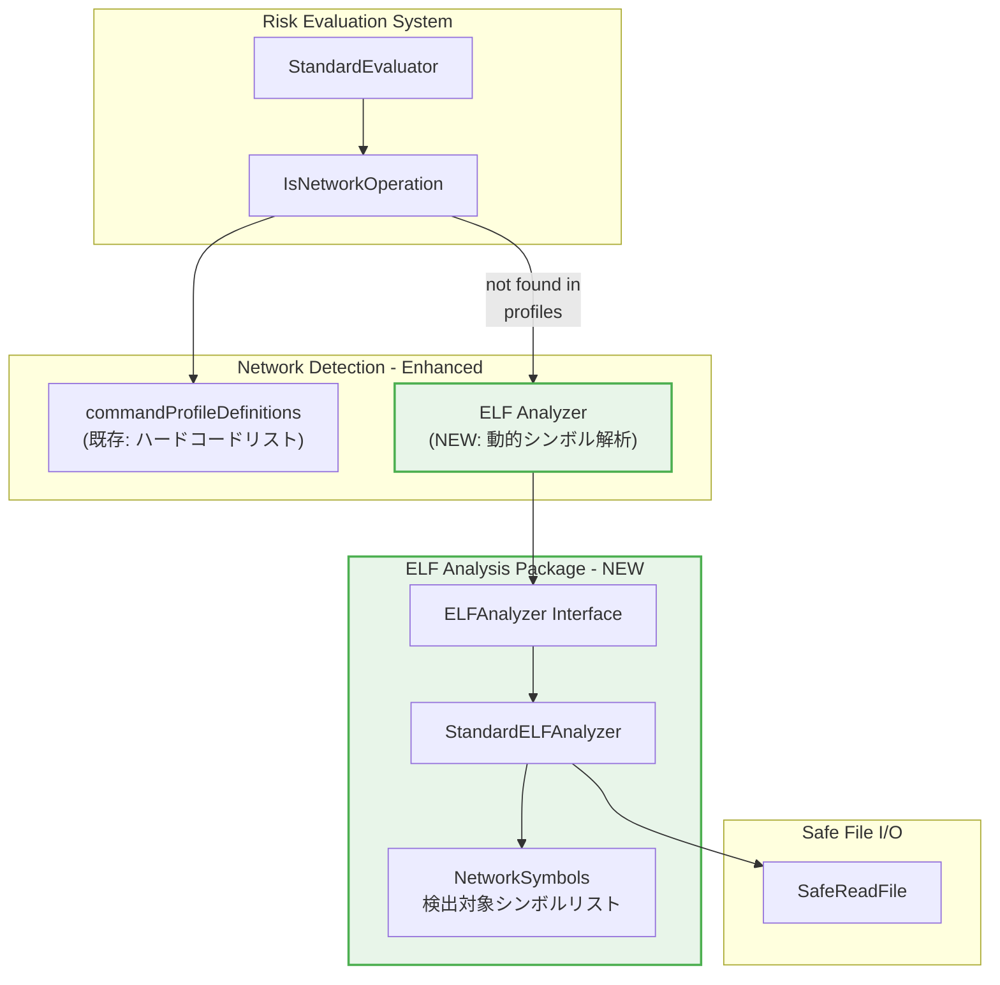
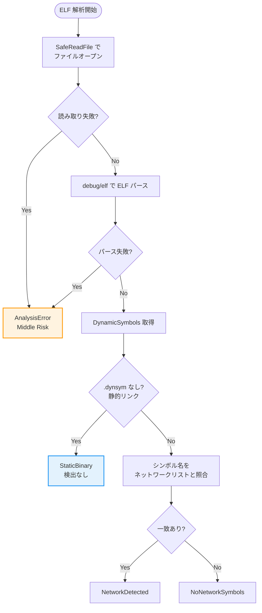
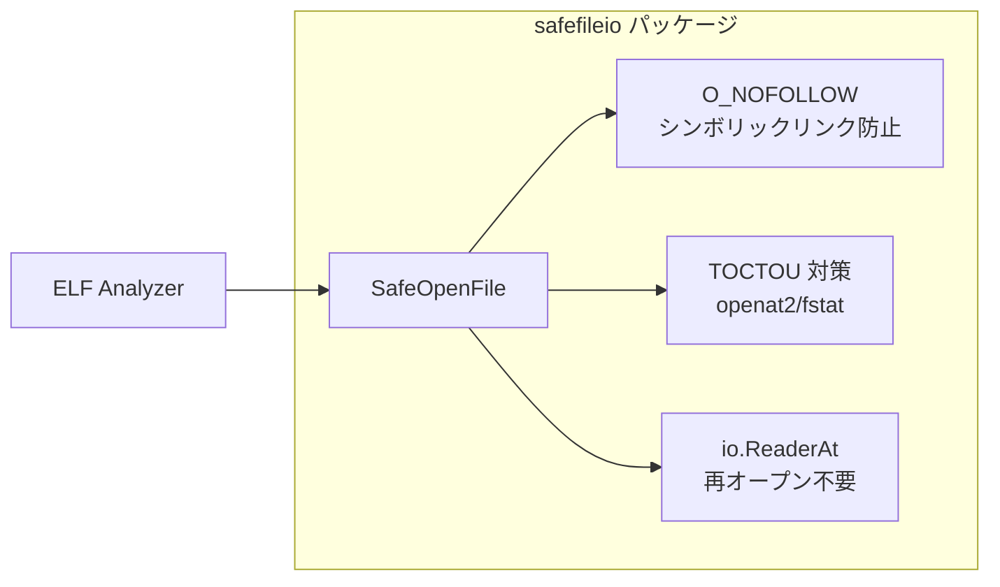

# ELF 動的シンボル解析によるネットワーク操作検出 アーキテクチャ設計書

## 1. システム概要

### 1.1 目的

既存の `IsNetworkOperation` 関数を拡張し、`commandProfileDefinitions` にハードコーディングされていないコマンドに対しても、ELF バイナリの動的シンボルテーブル（`.dynsym`）を解析することでネットワーク操作の可能性を検出する。

### 1.2 設計原則

- **Security by Default**: 解析失敗時は安全側に倒し、ネットワーク操作の可能性ありとして扱う
- **Non-Breaking Change**: 既存の `commandProfileDefinitions` による判定結果を変更しない
- **Zero External Dependencies**: Go 標準ライブラリ（`debug/elf`）のみを使用
- **Performance Conscious**: ELF ヘッダとシンボルテーブルのみを読み取る軽量な解析
- **Testability**: インターフェースによる抽象化でモックを容易に

## 2. システムアーキテクチャ

### 2.1 全体構成図



### 2.2 コンポーネント構成

#### 2.2.1 新規追加コンポーネント

**ELF Analysis Package** (`internal/runner/security/elfanalyzer/`)

| コンポーネント | 責務 |
|--------------|------|
| `ELFAnalyzer` | ELF 解析のインターフェース定義 |
| `StandardELFAnalyzer` | 標準実装：`.dynsym` セクションからネットワークシンボルを検出 |
| `NetworkSymbols` | 検出対象ネットワーク関連シンボルのリスト管理 |

#### 2.2.2 拡張コンポーネント

**Security Package** (`internal/runner/security/`)

| コンポーネント | 変更内容 |
|--------------|---------|
| `command_analysis.go` | `IsNetworkOperation` に ELF 解析フォールバックを追加 |

### 2.3 パッケージ構成

```
internal/
├── runner/
│   └── security/
│       ├── command_analysis.go      # IsNetworkOperation の拡張
│       └── elfanalyzer/             # NEW: ELF 解析パッケージ
│           ├── analyzer.go          # インターフェース定義
│           ├── analyzer_impl.go     # StandardELFAnalyzer 実装
│           ├── network_symbols.go   # ネットワークシンボルリスト
│           └── analyzer_test.go     # ユニットテスト
└── safefileio/                      # 既存: 安全なファイル読み取り
```

## 3. データフロー

### 3.1 ネットワーク操作判定フロー


### 3.2 ELF 解析詳細フロー



## 4. インターフェース設計

### 4.1 ELFAnalyzer Interface

```go
// Package elfanalyzer provides ELF binary analysis for network operation detection.
package elfanalyzer

// AnalysisResult represents the result of ELF network symbol analysis
type AnalysisResult int

const (
    // NetworkDetected indicates network-related symbols were found in .dynsym
    NetworkDetected AnalysisResult = iota
    // NoNetworkSymbols indicates no network-related symbols were found
    NoNetworkSymbols
    // NotELFBinary indicates the file is not an ELF binary (script, etc.)
    NotELFBinary
    // StaticBinary indicates a statically linked binary with no .dynsym
    StaticBinary
    // AnalysisError indicates an error occurred during analysis
    AnalysisError
)

// DetectedSymbol contains information about a detected network symbol
type DetectedSymbol struct {
    Name     string // Symbol name (e.g., "socket", "connect")
    Category string // Category (e.g., "socket", "http", "tls")
}

// AnalysisOutput contains the detailed result of ELF analysis
type AnalysisOutput struct {
    Result          AnalysisResult
    DetectedSymbols []DetectedSymbol // Symbols that were detected (for logging/debugging)
    Error           error            // Error details if Result == AnalysisError
}

// ELFAnalyzer analyzes ELF binaries to detect network operation capability
type ELFAnalyzer interface {
    // AnalyzeNetworkSymbols checks if the binary at the given path contains
    // network-related symbols in its .dynsym section.
    // The path should be an absolute path to the executable.
    AnalyzeNetworkSymbols(path string) AnalysisOutput
}
```

### 4.2 IsNetworkOperation 拡張シグネチャ

既存の関数シグネチャは変更せず、内部実装のみ拡張する：

```go
// IsNetworkOperation checks if the command performs network operations.
// This function considers:
// 1. commandProfileDefinitions (hardcoded list) - takes priority
// 2. ELF .dynsym analysis for unknown commands (NEW)
// 3. Argument-based detection (URLs, SSH addresses)
// Returns (isNetwork, isHighRisk) where isHighRisk indicates security concerns.
func IsNetworkOperation(cmdName string, args []string) (bool, bool)
```

## 5. コンポーネント詳細設計

### 5.1 StandardELFAnalyzer

```go
// StandardELFAnalyzer implements ELFAnalyzer using Go's debug/elf package
type StandardELFAnalyzer struct {
    networkSymbols map[string]string // symbol name -> category
    fs             safefileio.FileSystem
}

// NewStandardELFAnalyzer creates a new analyzer with default network symbols
func NewStandardELFAnalyzer(fs safefileio.FileSystem) *StandardELFAnalyzer

// AnalyzeNetworkSymbols implements ELFAnalyzer interface
func (a *StandardELFAnalyzer) AnalyzeNetworkSymbols(path string) AnalysisOutput
```

### 5.2 Network Symbols Registry

```go
// NetworkSymbolCategory defines categories of network symbols
type NetworkSymbolCategory string

const (
    CategorySocket NetworkSymbolCategory = "socket"  // POSIX socket API
    CategoryHTTP   NetworkSymbolCategory = "http"    // HTTP libraries
    CategoryTLS    NetworkSymbolCategory = "tls"     // TLS/SSL libraries
)

// DefaultNetworkSymbols returns the default set of network-related symbols
func DefaultNetworkSymbols() map[string]string {
    return map[string]string{
        // Socket API
        "socket":        "socket",
        "connect":       "socket",
        "bind":          "socket",
        "listen":        "socket",
        "accept":        "socket",
        "accept4":       "socket",
        "send":          "socket",
        "sendto":        "socket",
        "sendmsg":       "socket",
        "recv":          "socket",
        "recvfrom":      "socket",
        "recvmsg":       "socket",
        "getaddrinfo":   "socket",
        "getnameinfo":   "socket",
        "gethostbyname": "socket",
        "gethostbyname2":"socket",
        "inet_ntop":     "socket",
        "inet_pton":     "socket",
        "getpeername":   "socket",
        "getsockname":   "socket",

        // libcurl
        "curl_easy_init":    "http",
        "curl_easy_perform": "http",
        "curl_multi_perform":"http",

        // OpenSSL
        "SSL_connect": "tls",
        "SSL_read":    "tls",
        "SSL_write":   "tls",
        "SSL_new":     "tls",

        // GnuTLS
        "gnutls_handshake":   "tls",
        "gnutls_record_send": "tls",
        "gnutls_record_recv": "tls",
    }
}
```

## 6. エラーハンドリング

### 6.1 エラー分類と対応

| エラー種別 | 発生条件 | 対応 | リスク判定 |
|-----------|---------|------|-----------|
| ファイル読み取りエラー | パス解決失敗、権限不足 | ログ出力、解析スキップ | Middle Risk |
| 非 ELF ファイル | マジックナンバー不一致 | 解析スキップ | 既存ロジックに委ねる |
| ELF パースエラー | 不正な ELF 構造 | ログ出力、解析スキップ | Middle Risk |
| .dynsym 不在 | 静的リンクバイナリ | 検出なしとして返す | 既存ロジックに委ねる |

### 6.2 ログ出力

```go
// ELF 解析失敗時のログメッセージ例
slog.Warn("ELF analysis failed, treating as potential network operation",
    "command", cmdName,
    "path", resolvedPath,
    "error", err,
    "reason", "Unable to determine network capability, assuming middle risk for safety")
```

## 7. セキュリティ考慮事項

### 7.1 ファイル読み取りの安全性



- 既存の `safefileio.SafeOpenFile` を使用してシンボリックリンク攻撃を防止
- `File` インターフェースが `io.ReaderAt` を実装することで、`debug/elf.NewFile` に安全に渡せる
- ファイルを再オープンする必要がないため、TOCTOU 競合状態を完全に排除
- ファイルパスの検証は呼び出し元（`extractAllCommandNames`）で実施済み

### 7.2 悪意のある ELF ファイルへの耐性

- Go 標準ライブラリ `debug/elf` の安全性に依存
- パースエラー時はパニックせず、`AnalysisError` を返す
- 大きすぎるシンボルテーブルに対する制限は `debug/elf` に委ねる

## 8. パフォーマンス特性

### 8.1 解析の軽量性

ELF `.dynsym` 解析は以下の理由で十分に軽量：

1. **ヘッダのみ読み取り**: ファイル全体ではなく、ELF ヘッダとセクションヘッダのみを読み取る
2. **シンボルテーブルのみ走査**: コードセクションやデバッグ情報は読み取らない
3. **早期リターン**: ネットワークシンボルが見つかった時点で走査を終了可能

### 8.2 キャッシュ戦略

本タスク（1st step）ではキャッシュを実装しない。

**理由**:
- `.dynsym` 解析は十分に軽量（数ミリ秒）
- バイナリの更新検出ロジックが複雑になる
- 2nd step（objdump 解析）ではキャッシュが必要だが、それは別タスクで対応

## 9. テスト戦略

### 9.1 テストフィクスチャ

```
internal/runner/security/elfanalyzer/
├── testdata/
│   ├── with_network_symbols      # socket/connect を使用するバイナリ
│   ├── without_network_symbols   # ネットワークシンボルなしのバイナリ
│   ├── static_binary             # 静的リンクされたバイナリ
│   ├── not_elf_script            # シェルスクリプト
│   └── corrupted_elf             # 破損した ELF ファイル
```

### 9.2 テストバイナリの生成

テストフィクスチャは以下の方法で生成：

```bash
# ネットワークシンボルありのバイナリ
cat > /tmp/with_net.c << 'EOF'
#include <sys/socket.h>
int main() { socket(AF_INET, SOCK_STREAM, 0); return 0; }
EOF
gcc -o testdata/with_network_symbols /tmp/with_net.c

# ネットワークシンボルなしのバイナリ
cat > /tmp/no_net.c << 'EOF'
#include <stdio.h>
int main() { printf("hello\n"); return 0; }
EOF
gcc -o testdata/without_network_symbols /tmp/no_net.c
```

## 10. 2nd Step との統合計画

### 10.1 拡張ポイント

本設計は 2nd step（タスク 0070: objdump syscall 解析）との統合を考慮：


### 10.2 インターフェースの互換性

`ELFAnalyzer` インターフェースは 2nd step でも再利用可能：
- `AnalysisResult.StaticBinary` を返すことで、2nd step の解析にフォールバック可能
- 検出結果の構造体は拡張可能な設計
