# アーキテクチャ設計書: ELF 機械語解析による syscall 静的解析

## 1. システム概要

### 1.1 アーキテクチャ目標

- Go 標準/準公式ライブラリのみを使用した ELF 機械語解析
- 静的リンクバイナリ（特に Go バイナリ）のネットワーク syscall 検出
- 事前解析 + 解析結果保存方式による実行時コストの最小化
- 既存の `elfanalyzer` パッケージおよび `filevalidator` パッケージとの統合

### 1.2 設計原則

- **Security First**: 番号不明の syscall は high risk として扱う
- **外部依存排除**: objdump 等の外部コマンドに依存しない
- **既存活用**: `filevalidator` の解析結果ストアと `elfanalyzer` の解析基盤を再利用
- **拡張性**: アーキテクチャ別の syscall 番号/命令パターンの分離

### 1.3 スコープと位置づけ

本タスクは 2 段階のうちの 2nd step であり、1st step（タスク 0069）で検出できない静的リンクされたバイナリを対象とする。

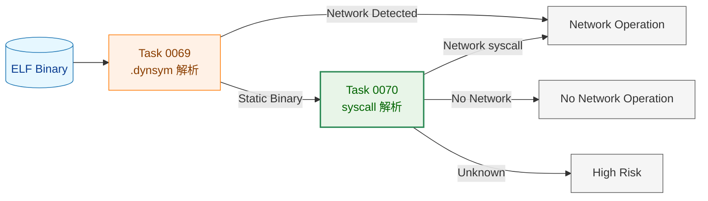

**凡例（Legend）**

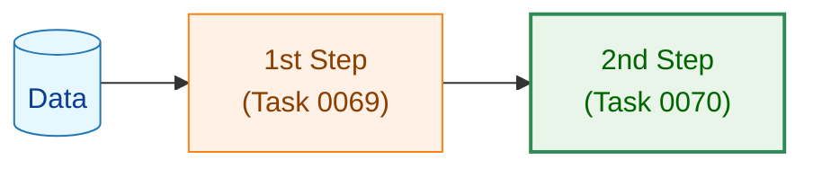

## 2. システム構成

### 2.1 全体アーキテクチャ

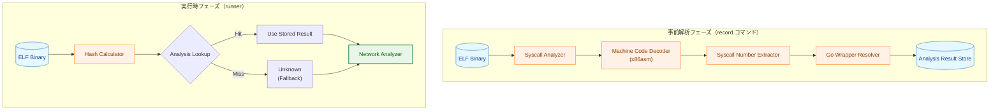

### 2.2 コンポーネント配置

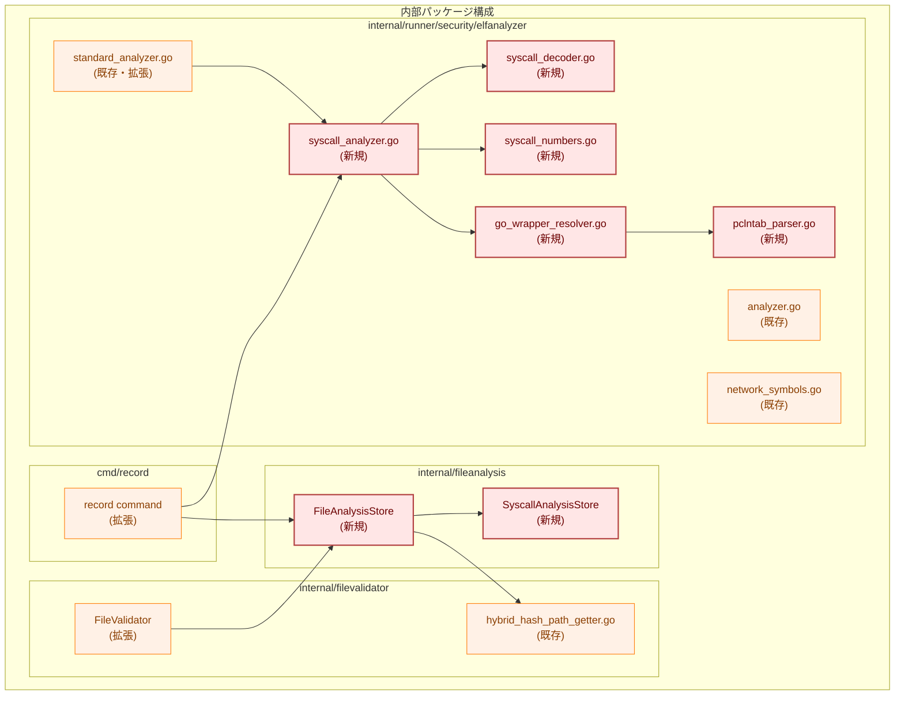

**注記**: `internal/fileanalysis` パッケージはファイル解析結果の共通層であり、`filevalidator` と `elfanalyzer` の両方から利用される。

### 2.3 データフロー（事前解析）

解析は2つの独立したパスで構成される。

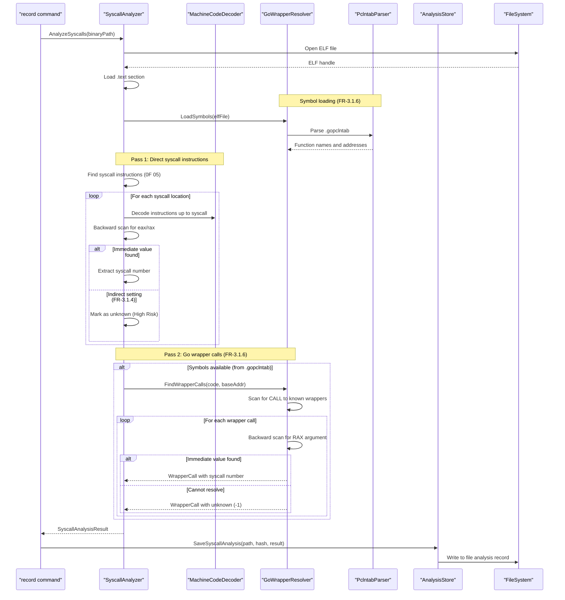

**注記**:
- Pass 1 と Pass 2 は独立した解析パスであり、それぞれ異なる検出対象を持つ
- Pass 1: `syscall` 命令（0F 05）を直接検出し、逆方向スキャンで syscall 番号を特定
- Pass 2: Go syscall ラッパー関数（`syscall.Syscall` 等）への CALL 命令を検出し、引数から syscall 番号を特定
- 逆方向スキャンでは、x86_64 の可変長命令の性質上、直接逆方向にデコードすることは困難なため、前方向にデコードして命令リストを構築し、そのリストを逆順に走査する
- **Strip されたバイナリ対応**: `.gopclntab` から関数情報を復元（Go ランタイムがスタックトレース生成とガベージコレクションに必要なため strip 後も保持される）

### 2.4 データフロー（実行時）

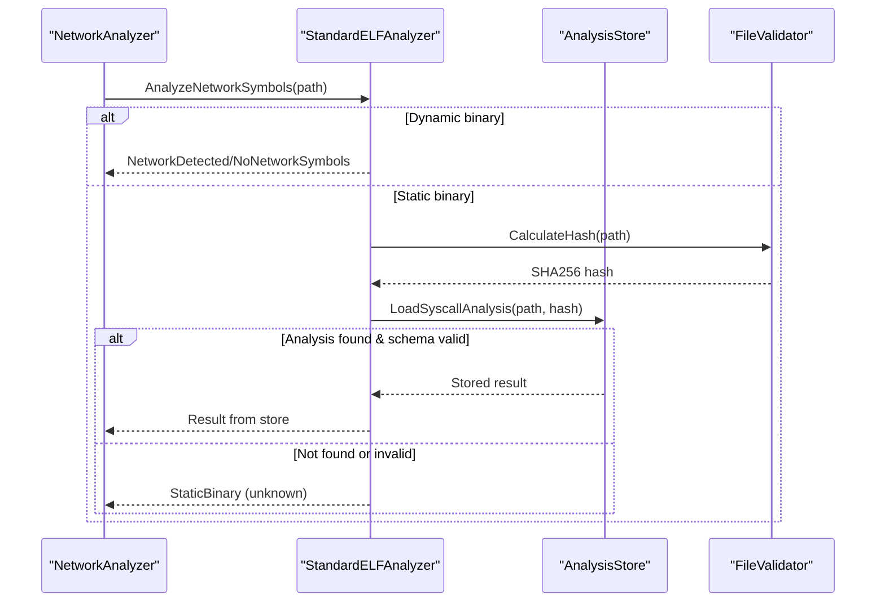

## 3. コンポーネント設計

### 3.1 SyscallAnalyzer

syscall 命令の検出と syscall 番号の抽出を行うメインコンポーネント。

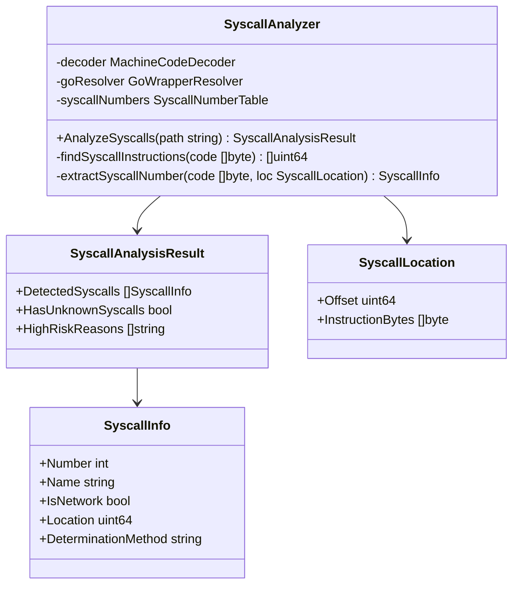

### 3.2 MachineCodeDecoder

x86_64 機械語のデコードを担当。`golang.org/x/arch/x86/x86asm` をラップ。

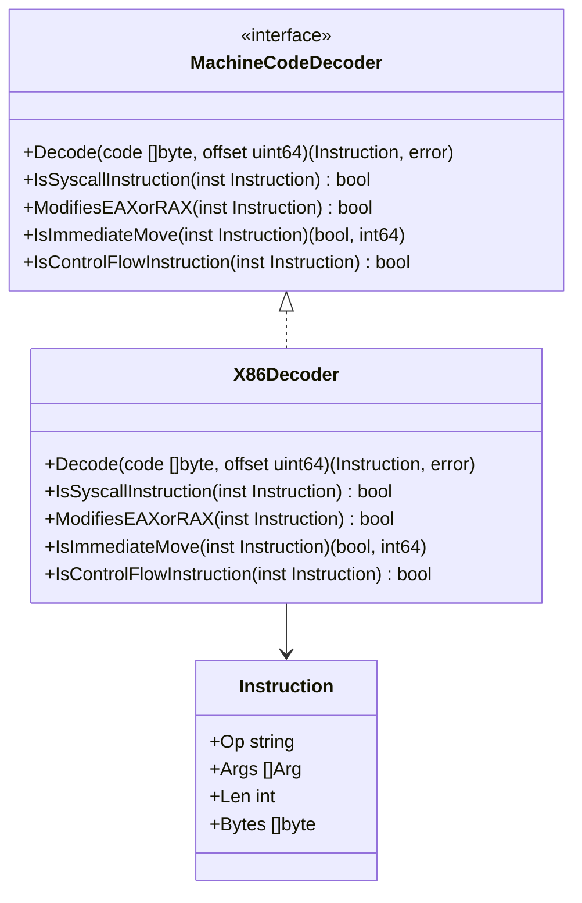

### 3.3 PclntabParser

Go バイナリの `.gopclntab` セクション（pclntab: Program Counter Line Table）から関数情報を復元。
Strip されたバイナリでも関数名とアドレスを取得可能。

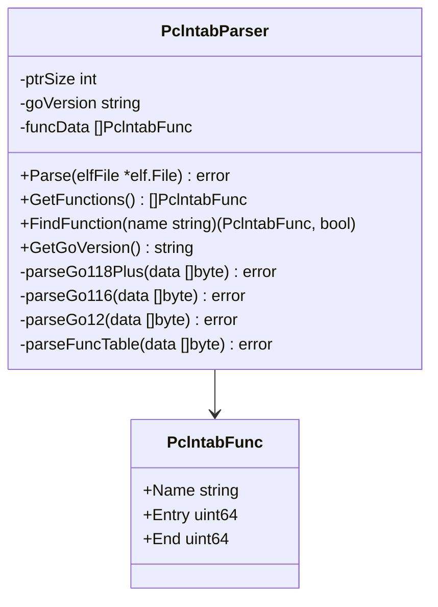

**pclntab について**:
- Go ランタイムがスタックトレース生成とガベージコレクションに使用するため、strip 後も `.gopclntab` セクションは保持される
- マジックナンバーで Go バージョンを識別:
  - Go 1.2-1.15: `0xFFFFFFFB`
  - Go 1.16-1.17: `0xFFFFFFFA`
  - Go 1.18-1.19: `0xFFFFFFF0`
  - Go 1.20+: `0xFFFFFFF1`

### 3.4 GoWrapperResolver

Go の syscall ラッパー関数を解析し、呼び出し元で syscall 番号を特定。
直接の syscall 命令解析とは**別の解析パス**として動作する。
`.gopclntab` から関数情報を取得し、strip されたバイナリでも解析可能。

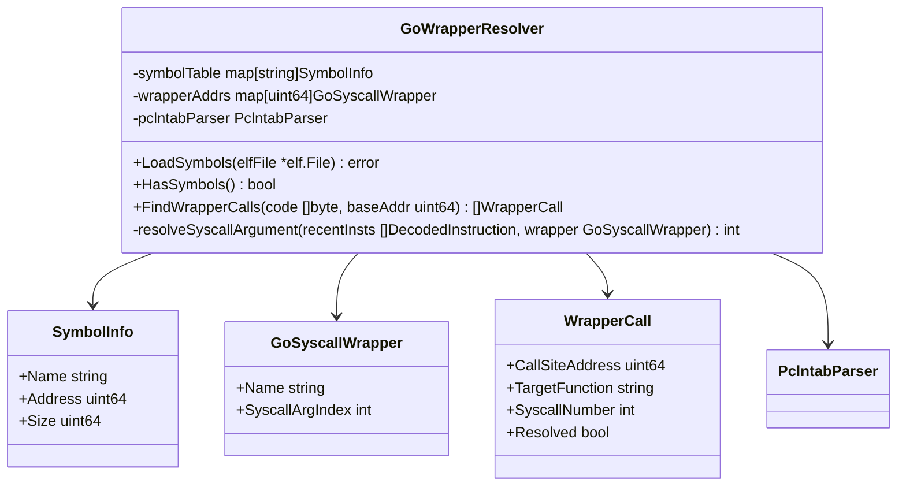

### 3.5 SyscallAnalysisStore

syscall 解析結果の読み書きを担当。解析結果ファイルの syscall_analysis フィールドを操作。

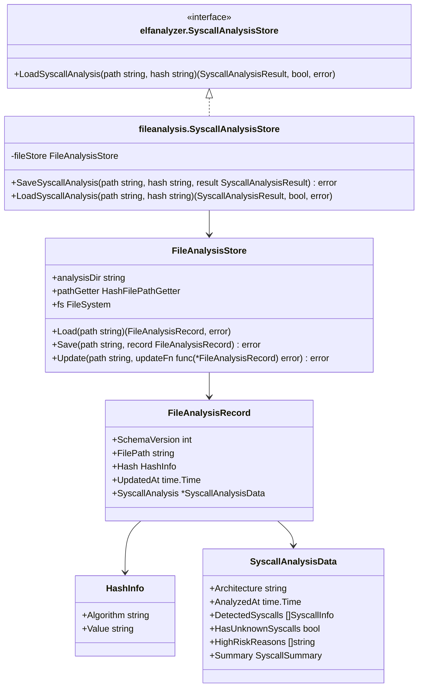

**注記**:
- `elfanalyzer.SyscallAnalysisStore` インターフェースは `LoadSyscallAnalysis` のみを定義する。これは elfanalyzer パッケージが解析結果を読み取るだけで、書き込みは record コマンドが `fileanalysis.SyscallAnalysisStore` を直接使用して行うためである。
- `fileanalysis.SyscallAnalysisStore` は具象型であり、`SaveSyscallAnalysis` と `LoadSyscallAnalysis` の両方を実装する。
- `FileAnalysisStore` は filevalidator と elfanalyzer の両方から利用される共通の解析結果読み書き層である。各パッケージは自分の関心事（ハッシュ検証または syscall 解析）のみを扱い、解析結果ファイルの詳細を意識しない。

### 3.6 SyscallNumberTable

アーキテクチャ別の syscall 番号とネットワーク判定。

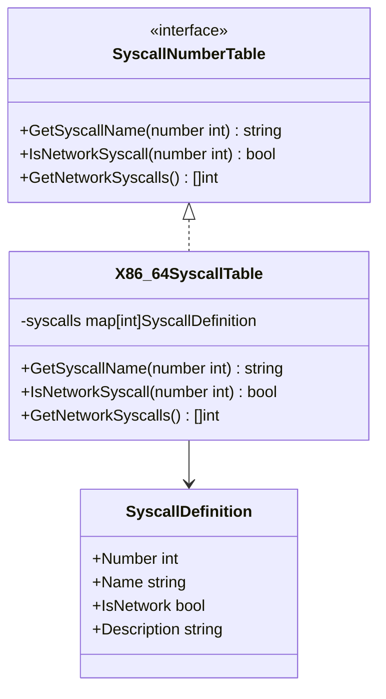

## 4. 統合設計

### 4.1 IsNetworkOperation フォールバックチェーン

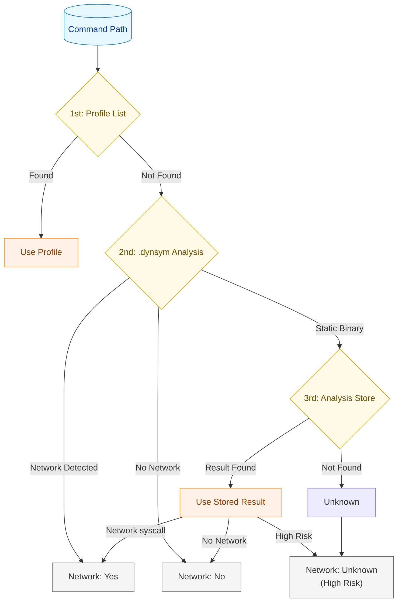

### 4.2 StandardELFAnalyzer への統合

```go
// 既存の StandardELFAnalyzer.AnalyzeNetworkSymbols の拡張ポイント
// StaticBinary が返される箇所で syscall 解析結果を参照

func (a *StandardELFAnalyzer) AnalyzeNetworkSymbols(path string) AnalysisOutput {
    // ... 既存の処理 ...

    // 静的バイナリの場合、syscall 解析結果を参照
    if !hasDynsym {
        // Task 0070: syscall analysis lookup
        if a.syscallStore != nil {
            hash, err := a.calculateHash(path)
            if err == nil {
                result, found, err := a.syscallStore.LoadSyscallAnalysis(path, hash)
                if err == nil && found {
                    return convertSyscallResultToAnalysisOutput(result)
                }
            }
        }
        return AnalysisOutput{Result: StaticBinary}
    }

    // ... 既存の処理 ...
}
```

### 4.3 record コマンドへの統合

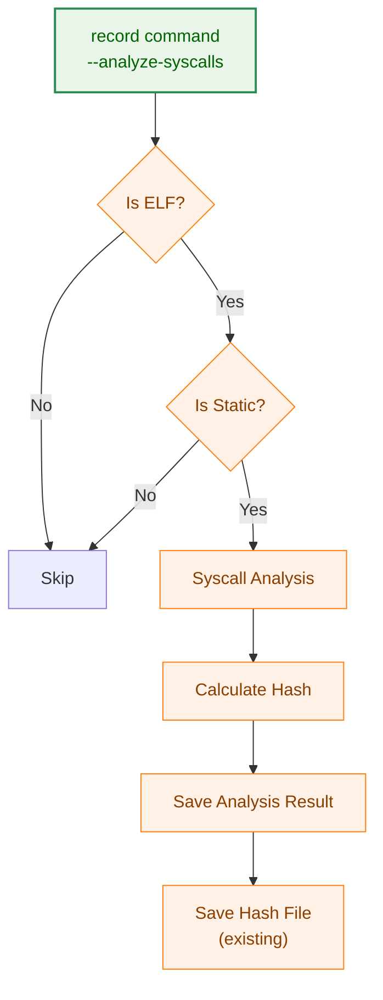

## 5. 解析結果ストア設計

### 5.1 統合ストア方式

ハッシュ検証情報と syscall 解析結果を単一の解析結果ファイルに統合する。

**設計方針**:
- **解析結果ファイル**: 1ファイルに両方の情報を格納
- **利用側インターフェース**: 分離を維持（各パッケージは自分の関心事のみを扱う）

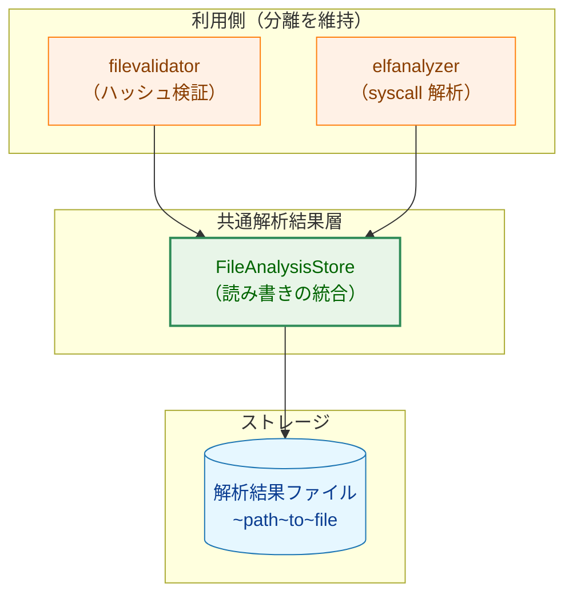

**メリット**:
- 解析結果ファイル数が半減（管理の簡素化）
- 1回のファイル読み込みで両方の情報を取得可能
- 解析結果ディレクトリの管理が単純化

### 5.2 解析結果ファイル形式

```json
{
  "schema_version": 1,
  "file_path": "/usr/local/bin/myapp",
  "hash": {
    "algorithm": "sha256",
    "value": "abc123..."
  },
  "updated_at": "2025-02-05T10:30:00Z",
  "syscall_analysis": {
    "architecture": "x86_64",
    "analyzed_at": "2025-02-05T10:30:00Z",
    "detected_syscalls": [
      {"number": 41, "name": "socket", "is_network": true, "location": 4096, "determination_method": "immediate"},
      {"number": 42, "name": "connect", "is_network": true, "location": 4128, "determination_method": "immediate"},
      {"number": 1, "name": "write", "is_network": false, "location": 4256, "determination_method": "immediate"}
    ],
    "has_unknown_syscalls": false,
    "high_risk_reasons": [],
    "summary": {
      "has_network_syscalls": true,
      "is_high_risk": false,
      "total_syscalls": 20,
      "network_syscalls": 5
    }
  }
}
```

**フィールド説明**:
- `hash`: ファイルの内容ハッシュ情報（filevalidator.HashInfo 形式に準拠）
  - `algorithm`: ハッシュアルゴリズム名（例: "sha256"）
  - `value`: ハッシュ値（16進数文字列）
- `syscall_analysis`: syscall 解析結果（オプション、ELF ファイルの場合のみ）
  - 非 ELF ファイルや動的リンクバイナリの場合、このフィールドは存在しない

### 5.3 解析結果ファイル命名規則

既存の `HybridHashFilePathGetter` の命名規則を維持：

- 解析結果ファイル: `~path~to~file`

**保存先**: 解析結果ファイルは既存の `--hash-dir` で指定されたディレクトリに保存する。

### 5.4 解析結果無効化条件

1. ファイルハッシュの不一致
2. スキーマバージョンの不一致
3. アーキテクチャの不一致
4. 解析結果ファイルの破損（JSON パースエラー）

## 6. セキュリティアーキテクチャ

### 6.1 セキュリティ処理フロー

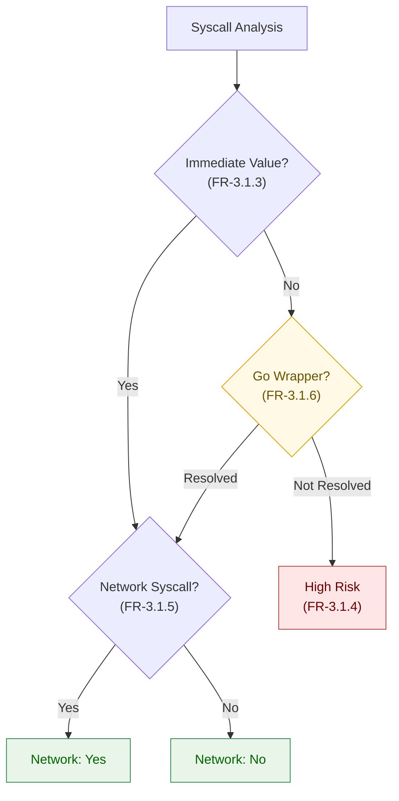

**注記**: フロー内の FR 番号は要件定義書の機能要件に対応する。

### 6.2 High Risk 判定条件

| 条件 | 判定 | 理由 | 要件 |
|------|------|------|------|
| syscall 番号が即値で決定可能 | 番号に基づく | 静的に確定 | FR-3.1.3 |
| Go ラッパー経由で番号特定可能 | 番号に基づく | 呼び出し元で確定 | FR-3.1.6 |
| レジスタ間 mov | High Risk | 動的に決定 | FR-3.1.4 |
| メモリからのロード | High Risk | 実行時依存 | FR-3.1.4 |
| スキャン範囲外 | High Risk | 解析限界 | FR-3.1.4 |
| 制御フロー境界 | High Risk | 静的解析限界 | FR-3.1.4 |
| Go ラッパーの引数が特定不能 | High Risk | syscall 番号が静的に決定できない | FR-3.1.6 |

### 6.3 解析結果ファイルのセキュリティ

- 解析結果ファイルの読み書きは `safefileio` を使用
- シンボリックリンク攻撃への防御
- ファイルハッシュによる改竄検知（NFR-4.2.1）
- スキーマバージョンによる解析結果無効化（FR-3.2.1）

## 7. パフォーマンス設計

### 7.1 事前解析のパフォーマンス

| 処理 | 目標 | 備考 |
|------|------|------|
| 小規模バイナリ (< 1MB) | < 1秒 | 一般的な Go バイナリ |
| 中規模バイナリ (1-10MB) | < 5秒 | 標準的なアプリケーション |
| 大規模バイナリ (> 10MB) | < 30秒 | 大規模アプリケーション |

### 7.2 実行時のパフォーマンス

| 処理 | 目標 | 備考 |
|------|------|------|
| ハッシュ計算 | < 100ms | 解析結果特定用 |
| 解析結果読み込み | < 10ms | ファイル I/O |
| 合計 | < 200ms | 実行時オーバーヘッド（NFR-4.1.1） |

### 7.3 最適化戦略

1. **セクション絞り込み**: `.text` セクションのみを解析
2. **早期終了**: ネットワーク syscall 検出時点で終了（オプション）
3. **並列デコード**: 大規模バイナリでの並列処理（将来拡張）

## 8. エラーハンドリング設計

### 8.1 エラー階層

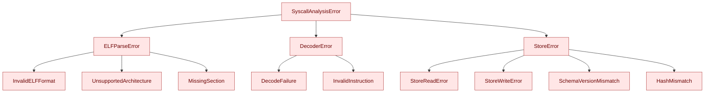

### 8.2 エラー回復戦略

| エラー種別 | 回復戦略 | 結果 |
|-----------|---------|------|
| ELF パースエラー | スキップ | NotELFBinary |
| 非対応アーキテクチャ | スキップ | StaticBinary |
| デコードエラー | 継続 | 部分解析 + High Risk |
| ストア読み込みエラー | フォールバック | Unknown |
| ストア書き込みエラー | ログ出力 | 解析結果は利用可能 |

## 9. テスト戦略

### 9.1 テスト階層

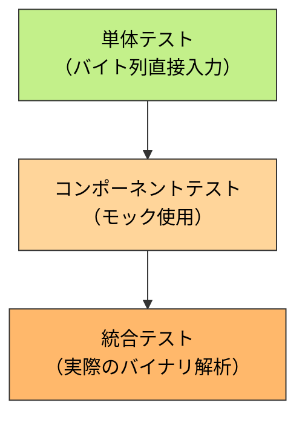

### 9.2 テストカテゴリ

**単体テスト**:
- MachineCodeDecoder: バイト列からの命令デコード
- SyscallNumberTable: 番号からの syscall 名解決
- GoWrapperResolver: シンボル解析ロジック

**コンポーネントテスト**:
- SyscallAnalyzer: モックデコーダーを使用した解析フロー
- SyscallAnalysisStore: 解析結果の保存/読み込み

**統合テスト** (gcc 依存):
- 実際の C プログラムのコンパイル → 解析
- Go プログラムのコンパイル → 解析
- record コマンドとの統合

## 10. 段階的実装計画

### Phase 1: 基盤コンポーネント

- [ ] MachineCodeDecoder インターフェースと X86Decoder 実装
- [ ] SyscallNumberTable と X86_64SyscallTable 実装
- [ ] 単体テストの作成

### Phase 2: SyscallAnalyzer

- [ ] SyscallAnalyzer の基本実装
- [ ] 逆方向スキャンロジックの実装
- [ ] SyscallAnalysisResult の設計と実装

### Phase 3: GoWrapperResolver

- [ ] シンボルテーブル解析
- [ ] Go syscall ラッパーの検出
- [ ] 呼び出し元での引数解析

### Phase 4: 統合解析結果ストア機構

- [ ] FileAnalysisStore の実装（internal/fileanalysis パッケージ）
- [ ] 解析結果スキーマの設計（FileAnalysisRecord 構造体）
- [ ] SyscallAnalysisStore インターフェースと SyscallAnalysisStore 実装
- [ ] filevalidator の統合解析結果ストア対応

### Phase 5: 統合

- [ ] StandardELFAnalyzer への統合
- [ ] record コマンドへの統合
- [ ] 統合テストの実装

### Phase 6: ドキュメントと最終調整

- [ ] ユーザードキュメントの作成
- [ ] パフォーマンスチューニング
- [ ] セキュリティレビュー

## 11. 設計上の判断と代替案

### 11.1 逆方向スキャンの実装方式

**採用案**: 前方デコード + 逆順走査
- syscall 命令の位置まで前方デコードして命令リストを構築
- 構築したリストを逆順に走査

**代替案（不採用）**: 直接逆方向デコード
- x86_64 は可変長命令（1〜15バイト）のため、任意の位置から逆方向に正確にデコードすることは困難
- 命令境界の特定に失敗するリスクが高い

### 11.2 AnalysisResult の拡張

既存の `StaticBinary` 結果を、syscall 解析結果に応じて以下のように変換：

| 解析結果 | 変換後の AnalysisResult | 理由 |
|--------------|----------------------|------|
| ネットワーク syscall あり | `NetworkDetected` | 確実にネットワーク操作を行う |
| ネットワーク syscall なし | `NoNetworkSymbols` | ネットワーク操作を行わない |
| High Risk | `AnalysisError` | 安全側に倒す（高リスクとして扱う） |
| 解析結果なし | `StaticBinary` | 従来と同じ（不明として扱う） |

### 11.3 GoWrapperResolver のシンボルソース統一

**採用案**: `.gopclntab` のみを使用
- プロダクションバイナリは strip されているのが通常であるため、`.symtab` が存在することは稀
- Go バイナリでは `.symtab` が存在する場合でも `.gopclntab` も必ず存在するため、`.symtab` パスは冗長
- 実装コストが低い（Go `debug/elf` パッケージの数行のコード）一方、テスト・保守負担が増加
- シンボル取得の優先順位ロジックの複雑さが不要になる

**代替案（不採用）**: `.symtab` と `.gopclntab` の両方に対応
- 開発・デバッグ時のバイナリには対応できるが、実際のユースケースではほぼ無意味
- Go 非バイナリの場合、GoWrapperResolver 自体が不要なため、`.symtab` 対応の汎用性も低い

### 11.4 統合解析結果ストア方式

**採用案**: ハッシュ検証情報と syscall 解析結果を単一ファイルに統合
- 解析結果ファイル数が半減（管理の簡素化）
- 1回のファイル読み込みで両方の情報を取得可能
- 利用側インターフェースは分離を維持（各パッケージは自分の関心事のみを扱う）

**代替案（不採用）**: ファイル名プレフィックスで区別した別ファイル
- `~path~to~file`（ハッシュ検証）と `syscall~path~to~file`（syscall 解析）
- 解析結果ファイル数が2倍になる
- 同じ対象ファイルに対して2回の I/O が必要になる場合がある
