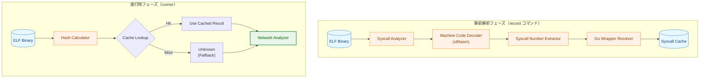
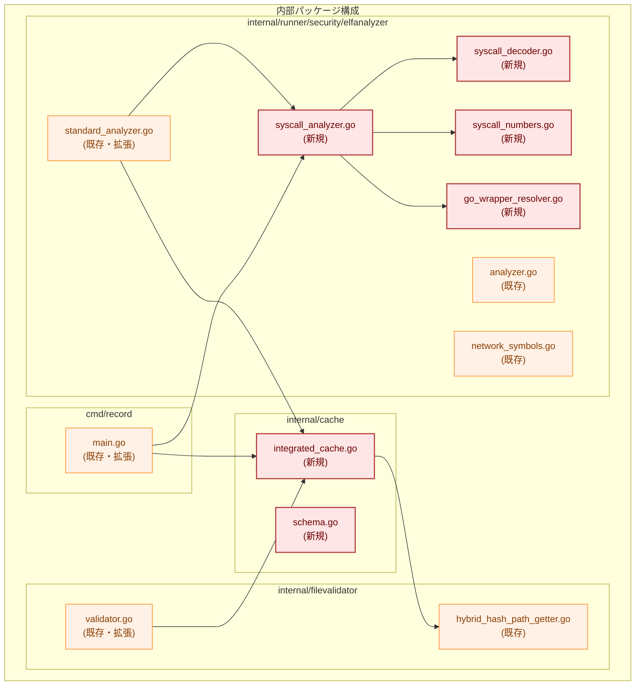
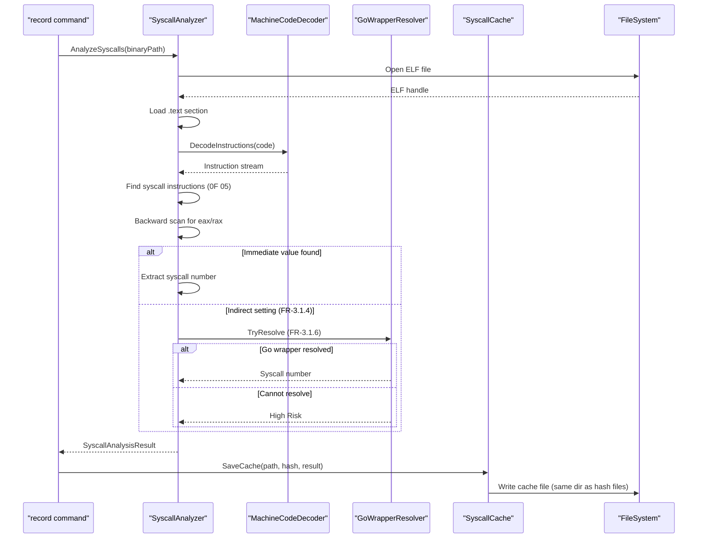
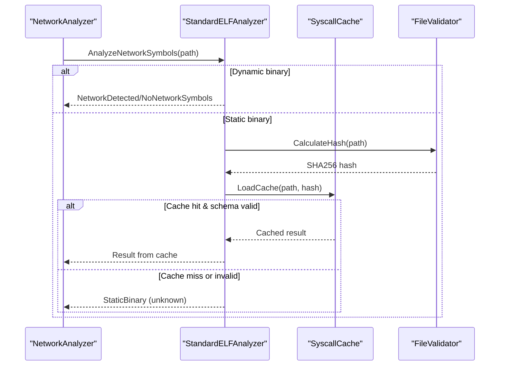
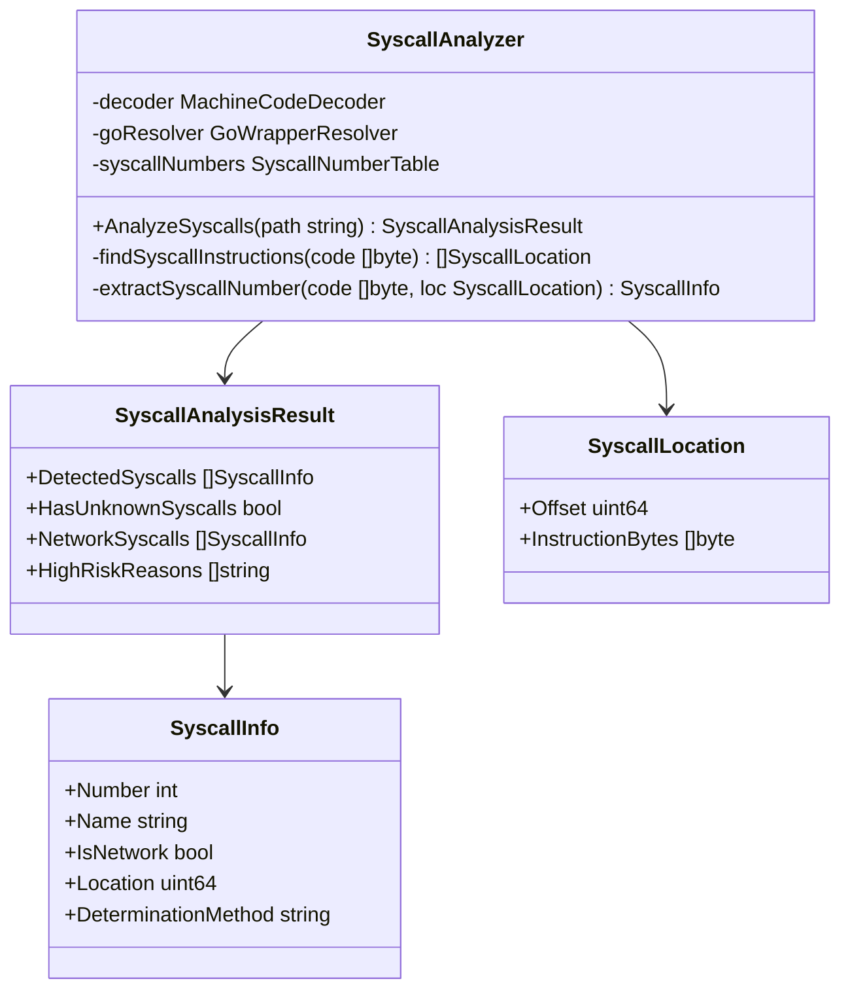
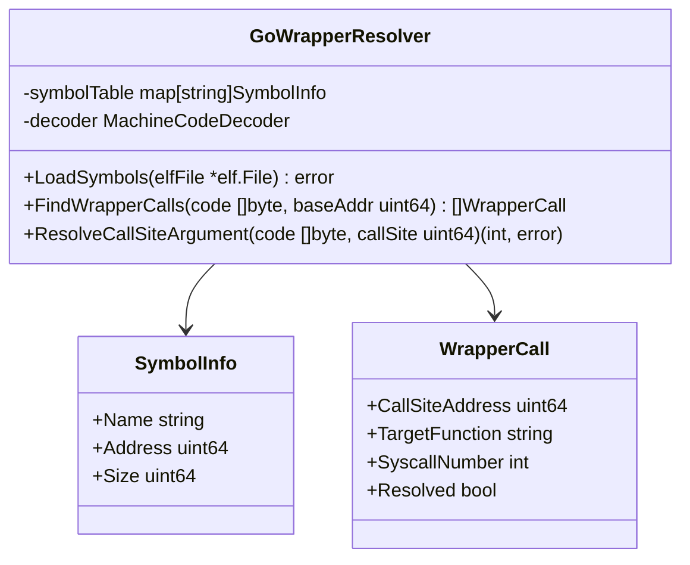
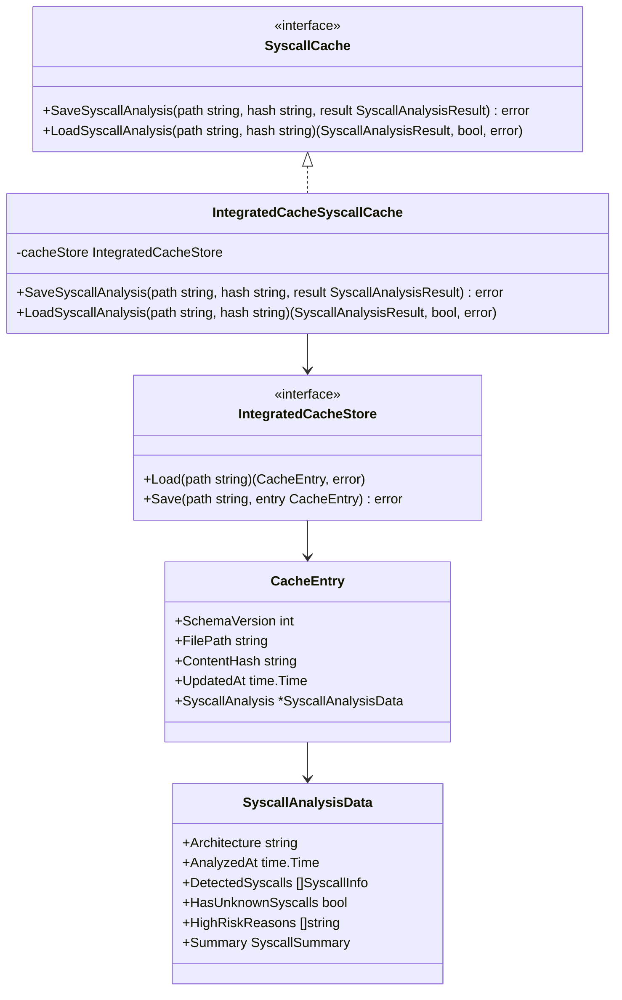
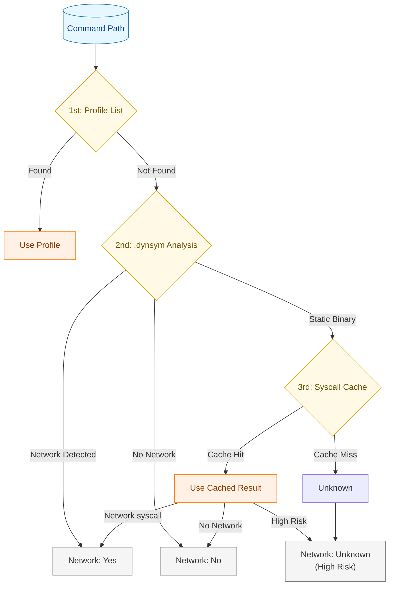
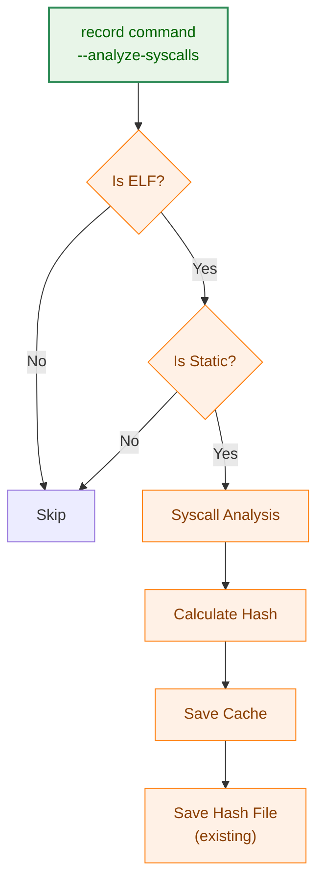
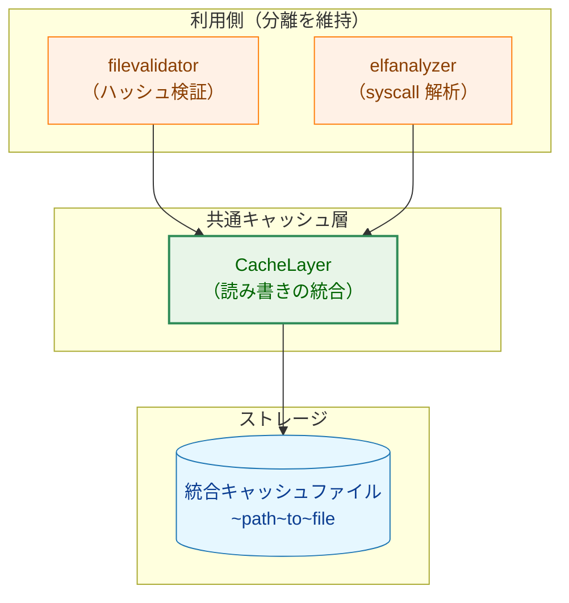

# アーキテクチャ設計書: ELF 機械語解析による syscall 静的解析

## 1. システム概要

### 1.1 アーキテクチャ目標

- Go 標準/準公式ライブラリのみを使用した ELF 機械語解析
- 静的リンクバイナリ（特に Go バイナリ）のネットワーク syscall 検出
- 事前解析 + キャッシュ方式による実行時コストの最小化
- 既存の `elfanalyzer` パッケージおよび `filevalidator` パッケージとの統合

### 1.2 設計原則

- **Security First**: 番号不明の syscall は high risk として扱う
- **外部依存排除**: objdump 等の外部コマンドに依存しない
- **既存活用**: `filevalidator` のキャッシュ機構と `elfanalyzer` の解析基盤を再利用
- **拡張性**: アーキテクチャ別の syscall 番号/命令パターンの分離

### 1.3 スコープと位置づけ

本タスクは 2 段階のうちの 2nd step であり、1st step（タスク 0069）で検出できない静的リンクされたバイナリを対象とする。


**凡例（Legend）**


## 2. システム構成

### 2.1 全体アーキテクチャ



### 2.2 コンポーネント配置



**注記**: `internal/cache` パッケージは統合キャッシュの共通層であり、`filevalidator` と `elfanalyzer` の両方から利用される。

### 2.3 データフロー（事前解析）



**注記**: 逆方向スキャンの実装では、x86_64 の可変長命令の性質上、直接逆方向にデコードすることは困難である。そのため、syscall 命令の位置まで前方向にデコードして命令リストを構築し、そのリストを逆順に走査する方式を採用する。

### 2.4 データフロー（実行時）



## 3. コンポーネント設計

### 3.1 SyscallAnalyzer

syscall 命令の検出と syscall 番号の抽出を行うメインコンポーネント。



### 3.2 MachineCodeDecoder

x86_64 機械語のデコードを担当。`golang.org/x/arch/x86/x86asm` をラップ。


### 3.3 GoWrapperResolver

Go の syscall ラッパー関数を解析し、呼び出し元で syscall 番号を特定。



### 3.4 SyscallCache

syscall 解析結果の読み書きを担当。統合キャッシュファイルの syscall_analysis フィールドを操作。



**注記**: `IntegratedCacheStore` は filevalidator と elfanalyzer の両方から利用される共通のキャッシュ読み書き層である。各パッケージは自分の関心事（ハッシュ検証または syscall 解析）のみを扱い、キャッシュファイルの詳細を意識しない。

### 3.5 SyscallNumberTable

アーキテクチャ別の syscall 番号とネットワーク判定。


## 4. 統合設計

### 4.1 IsNetworkOperation フォールバックチェーン



### 4.2 StandardELFAnalyzer への統合

```go
// 既存の StandardELFAnalyzer.AnalyzeNetworkSymbols の拡張ポイント
// StaticBinary が返される箇所で syscall キャッシュを参照

func (a *StandardELFAnalyzer) AnalyzeNetworkSymbols(path string) AnalysisOutput {
    // ... 既存の処理 ...

    // 静的バイナリの場合、syscall キャッシュを参照
    if !hasDynsym {
        // Task 0070: syscall cache lookup
        if a.syscallCache != nil {
            hash, err := a.calculateHash(path)
            if err == nil {
                result, found, err := a.syscallCache.LoadSyscallAnalysis(path, hash)
                if err == nil && found {
                    return convertSyscallResultToAnalysisOutput(result)
                }
            }
        }
        return AnalysisOutput{Result: StaticBinary}
    }

    // ... 既存の処理 ...
}
```

### 4.3 record コマンドへの統合



## 5. キャッシュ設計

### 5.1 統合キャッシュ方式

ハッシュ検証情報と syscall 解析結果を単一のキャッシュファイルに統合する。

**設計方針**:
- **キャッシュファイル**: 1ファイルに両方の情報を格納
- **利用側インターフェース**: 分離を維持（各パッケージは自分の関心事のみを扱う）



**メリット**:
- キャッシュファイル数が半減（管理の簡素化）
- 1回のファイル読み込みで両方の情報を取得可能
- キャッシュディレクトリの管理が単純化

### 5.2 キャッシュファイル形式

```json
{
  "schema_version": 1,
  "file_path": "/usr/local/bin/myapp",
  "content_hash": "sha256:abc123...",
  "updated_at": "2025-02-05T10:30:00Z",
  "syscall_analysis": {
    "architecture": "x86_64",
    "analyzed_at": "2025-02-05T10:30:00Z",
    "detected_syscalls": [
      {"number": 41, "name": "socket", "is_network": true, "count": 3},
      {"number": 42, "name": "connect", "is_network": true, "count": 2},
      {"number": 1, "name": "write", "is_network": false, "count": 15}
    ],
    "has_unknown_syscalls": false,
    "high_risk_reasons": [],
    "summary": {
      "has_network_syscalls": true,
      "is_high_risk": false,
      "total_syscalls": 20,
      "network_syscalls": 5
    }
  }
}
```

**フィールド説明**:
- `content_hash`: ファイルの内容ハッシュ（既存の filevalidator が使用）
- `syscall_analysis`: syscall 解析結果（オプション、ELF ファイルの場合のみ）
  - 非 ELF ファイルや動的リンクバイナリの場合、このフィールドは存在しない

### 5.3 キャッシュファイル命名規則

既存の `HybridHashFilePathGetter` の命名規則を維持：

- キャッシュファイル: `~path~to~file`

**保存先**: キャッシュファイルは既存の `--hash-dir` で指定されたディレクトリに保存する。

### 5.4 キャッシュ無効化条件

1. ファイルハッシュの不一致
2. スキーマバージョンの不一致
3. アーキテクチャの不一致
4. キャッシュファイルの破損（JSON パースエラー）

## 6. セキュリティアーキテクチャ

### 6.1 セキュリティ処理フロー


**注記**: フロー内の FR 番号は要件定義書の機能要件に対応する。

### 6.2 High Risk 判定条件

| 条件 | 判定 | 理由 | 要件 |
|------|------|------|------|
| syscall 番号が即値で決定可能 | 番号に基づく | 静的に確定 | FR-3.1.3 |
| Go ラッパー経由で番号特定可能 | 番号に基づく | 呼び出し元で確定 | FR-3.1.6 |
| レジスタ間 mov | High Risk | 動的に決定 | FR-3.1.4 |
| メモリからのロード | High Risk | 実行時依存 | FR-3.1.4 |
| スキャン範囲外 | High Risk | 解析限界 | FR-3.1.4 |
| 制御フロー境界 | High Risk | 静的解析限界 | FR-3.1.4 |
| strip されたバイナリ | High Risk | シンボル情報なし | FR-3.1.6 |

### 6.3 キャッシュセキュリティ

- キャッシュファイルの読み書きは `safefileio` を使用
- シンボリックリンク攻撃への防御
- ファイルハッシュによる改竄検知（NFR-4.2.1）
- スキーマバージョンによるキャッシュ無効化（FR-3.2.1）

## 7. パフォーマンス設計

### 7.1 事前解析のパフォーマンス

| 処理 | 目標 | 備考 |
|------|------|------|
| 小規模バイナリ (< 1MB) | < 1秒 | 一般的な Go バイナリ |
| 中規模バイナリ (1-10MB) | < 5秒 | 標準的なアプリケーション |
| 大規模バイナリ (> 10MB) | < 30秒 | 大規模アプリケーション |

### 7.2 実行時のパフォーマンス

| 処理 | 目標 | 備考 |
|------|------|------|
| ハッシュ計算 | < 100ms | キャッシュキー生成 |
| キャッシュ読み込み | < 10ms | ファイル I/O |
| 合計 | < 200ms | 実行時オーバーヘッド（NFR-4.1.1） |

### 7.3 最適化戦略

1. **セクション絞り込み**: `.text` セクションのみを解析
2. **早期終了**: ネットワーク syscall 検出時点で終了（オプション）
3. **並列デコード**: 大規模バイナリでの並列処理（将来拡張）

## 8. エラーハンドリング設計

### 8.1 エラー階層


### 8.2 エラー回復戦略

| エラー種別 | 回復戦略 | 結果 |
|-----------|---------|------|
| ELF パースエラー | スキップ | NotELFBinary |
| 非対応アーキテクチャ | スキップ | StaticBinary |
| デコードエラー | 継続 | 部分解析 + High Risk |
| キャッシュ読み込みエラー | フォールバック | Unknown |
| キャッシュ書き込みエラー | ログ出力 | 解析結果は利用可能 |

## 9. テスト戦略

### 9.1 テスト階層


### 9.2 テストカテゴリ

**単体テスト**:
- MachineCodeDecoder: バイト列からの命令デコード
- SyscallNumberTable: 番号からの syscall 名解決
- GoWrapperResolver: シンボル解析ロジック

**コンポーネントテスト**:
- SyscallAnalyzer: モックデコーダーを使用した解析フロー
- SyscallCache: キャッシュの保存/読み込み

**統合テスト** (gcc 依存):
- 実際の C プログラムのコンパイル → 解析
- Go プログラムのコンパイル → 解析
- record コマンドとの統合

## 10. 段階的実装計画

### Phase 1: 基盤コンポーネント

- [ ] MachineCodeDecoder インターフェースと X86Decoder 実装
- [ ] SyscallNumberTable と X86_64SyscallTable 実装
- [ ] 単体テストの作成

### Phase 2: SyscallAnalyzer

- [ ] SyscallAnalyzer の基本実装
- [ ] 逆方向スキャンロジックの実装
- [ ] SyscallAnalysisResult の設計と実装

### Phase 3: GoWrapperResolver

- [ ] シンボルテーブル解析
- [ ] Go syscall ラッパーの検出
- [ ] 呼び出し元での引数解析

### Phase 4: 統合キャッシュ機構

- [ ] IntegratedCacheStore の実装（internal/cache パッケージ）
- [ ] 統合キャッシュスキーマの設計（CacheEntry 構造体）
- [ ] SyscallCache インターフェースと IntegratedCacheSyscallCache 実装
- [ ] filevalidator の統合キャッシュ対応

### Phase 5: 統合

- [ ] StandardELFAnalyzer への統合
- [ ] record コマンドへの統合
- [ ] 統合テストの実装

### Phase 6: ドキュメントと最終調整

- [ ] ユーザードキュメントの作成
- [ ] パフォーマンスチューニング
- [ ] セキュリティレビュー

## 11. 設計上の判断と代替案

### 11.1 逆方向スキャンの実装方式

**採用案**: 前方デコード + 逆順走査
- syscall 命令の位置まで前方デコードして命令リストを構築
- 構築したリストを逆順に走査

**代替案（不採用）**: 直接逆方向デコード
- x86_64 は可変長命令（1〜15バイト）のため、任意の位置から逆方向に正確にデコードすることは困難
- 命令境界の特定に失敗するリスクが高い

### 11.2 AnalysisResult の拡張

既存の `StaticBinary` 結果を、syscall キャッシュの結果に応じて以下のように変換：

| キャッシュ結果 | 変換後の AnalysisResult | 理由 |
|--------------|----------------------|------|
| ネットワーク syscall あり | `NetworkDetected` | 確実にネットワーク操作を行う |
| ネットワーク syscall なし | `NoNetworkSymbols` | ネットワーク操作を行わない |
| High Risk | `AnalysisError` | 安全側に倒す（中リスクとして扱う） |
| キャッシュなし | `StaticBinary` | 従来と同じ（不明として扱う） |

### 11.3 統合キャッシュ方式

**採用案**: ハッシュ検証情報と syscall 解析結果を単一ファイルに統合
- キャッシュファイル数が半減（管理の簡素化）
- 1回のファイル読み込みで両方の情報を取得可能
- 利用側インターフェースは分離を維持（各パッケージは自分の関心事のみを扱う）

**代替案（不採用）**: ファイル名プレフィックスで区別した別ファイル
- `~path~to~file`（ハッシュ検証）と `syscall~path~to~file`（syscall 解析）
- キャッシュファイル数が2倍になる
- 同じ対象ファイルに対して2回の I/O が必要になる場合がある
