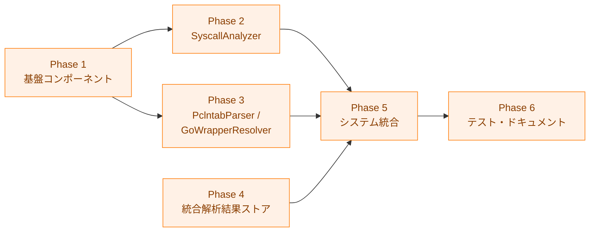

# 実装計画書: ELF 機械語解析による syscall 静的解析

## 概要

本ドキュメントは、ELF 機械語解析による syscall 静的解析機能の実装進捗を追跡する。
詳細仕様は [03_detailed_specification.md](03_detailed_specification.md) を参照。

## 依存関係

**注記**: Phase 2 と Phase 3 は Phase 1 完了後に並行して実施可能。
Phase 4 は Phase 2・3 と独立して実施可能。

## Phase 1: 基盤コンポーネント

エラー型、機械語デコーダー、syscall 番号テーブルを実装する。
他の全 Phase の土台となる。

### 1.1 エラー定義

- [ ] `internal/runner/security/elfanalyzer/errors.go` を新規作成
  - `ErrNoTextSection`
  - `ErrNoSymbolTable`
  - `UnsupportedArchitectureError`
  - 仕様: 詳細仕様書 §5

### 1.2 MachineCodeDecoder

- [ ] `internal/runner/security/elfanalyzer/syscall_decoder.go` を新規作成
  - `DecodedInstruction` 構造体
  - `MachineCodeDecoder` インターフェース
  - `X86Decoder` 実装（`golang.org/x/arch/x86/x86asm` をラップ）
  - 仕様: 詳細仕様書 §2.2
- [ ] `go.mod` に `golang.org/x/arch` 依存を追加
- [ ] `syscall_decoder_test.go` を新規作成
  - `TestX86Decoder_Decode`: 基本デコード
  - `TestX86Decoder_IsSyscallInstruction`: syscall 命令検出
  - `TestX86Decoder_ModifiesEAXorRAX`: レジスタ変更検出
  - `TestX86Decoder_IsImmediateMove`: 即値 MOV 検出
  - `TestX86Decoder_IsControlFlowInstruction`: 制御フロー命令検出
  - 受け入れ条件: AC-1

### 1.3 SyscallNumberTable

- [ ] `internal/runner/security/elfanalyzer/syscall_numbers.go` を新規作成
  - `SyscallNumberTable` インターフェース
  - `SyscallDefinition` 構造体
  - `X86_64SyscallTable` 実装
    （ネットワーク syscall 10 種 + 主要な非ネットワーク syscall）
  - 仕様: 詳細仕様書 §2.3、要件 FR-3.1.5
- [ ] `syscall_numbers_test.go` を新規作成
  - `TestX86_64SyscallTable_GetSyscallName`
  - `TestX86_64SyscallTable_IsNetworkSyscall`
  - `TestX86_64SyscallTable_GetNetworkSyscalls`
  - 受け入れ条件: AC-2

## Phase 2: SyscallAnalyzer

直接 syscall 命令（`0F 05`）の検出と逆方向スキャンによる
syscall 番号抽出を実装する。
これは Pass 1（直接 syscall 命令解析）に対応する。

### 2.1 SyscallAnalyzer 本体

- [ ] `internal/runner/security/elfanalyzer/syscall_analyzer.go`
  を新規作成
  - `SyscallAnalysisResult`, `SyscallInfo`, `SyscallSummary` 構造体
  - `SyscallAnalyzer` 構造体と `NewSyscallAnalyzer()` コンストラクタ
  - `AnalyzeSyscallsFromELF(elfFile)`:
  - `findSyscallInstructions()`: `0F 05` パターンの検出
  - `extractSyscallInfo()`:
    逆方向スキャンによる syscall 番号抽出
  - `backwardScanForSyscallNumber()`: 前方デコード + 逆順走査
  - `decodeInstructionsInWindow()`:
  - 仕様: 詳細仕様書 §2.1
  - 要件: FR-3.1.2, FR-3.1.3, FR-3.1.4

### 2.2 逆方向スキャンのテスト

- [ ] `syscall_analyzer_test.go` を新規作成
  - `TestSyscallAnalyzer_BackwardScan`:
    - `mov $0x29, %eax` + `syscall`
      → socket(41) 検出（immediate）
    - `mov $0x2a, %eax` + 無関係命令 + `syscall`
      → connect(42) 検出
    - `mov %ebx, %eax` + `syscall`
      → unknown:indirect_setting（High Risk）
    - `jmp` + `mov $0x29, %eax` + `syscall`
      → unknown:control_flow_boundary（High Risk）
    - `syscall` のみ
      → unknown:scan_limit_exceeded（High Risk）
    - `mov (%rsp), %eax` + `syscall`
      → メモリロード（High Risk）
  - `TestSyscallAnalyzer_MultipleSyscalls`:
    複数 syscall 命令の検出
  - `TestSyscallAnalyzer_NoSyscalls`: syscall 命令なし
  - 受け入れ条件: AC-1, AC-3

## Phase 3: PclntabParser / GoWrapperResolver

Go バイナリの `.gopclntab` 解析と syscall ラッパー関数の解決を
実装する。これは Pass 2（Go ラッパー呼び出し解析）に対応する。

### 3.1 PclntabParser

- [ ] `internal/runner/security/elfanalyzer/pclntab_parser.go`
  を新規作成
  - `PclntabFunc` 構造体
  - `PclntabParser` 構造体と
    `NewPclntabParser()` コンストラクタ
  - `Parse(elfFile)`:
    `.gopclntab` セクションの読み取りとマジックナンバー判定
  - `parseGo118Plus(data)`: Go 1.18+ 形式の解析
  - `parseGo116(data)`: Go 1.16-1.17 形式の解析
  - `parseGo12(data)`:
    Go 1.2-1.15 形式の解析（ベストエフォート）
  - `parseFuncTable(data)`:
    pcHeader + functab からの関数エントリ抽出
    - `textStart`, `funcnameOffset`, `ftabOffset`, `nfunc`
      を読み取り、関数名とエントリーポイントを復元する
    - 解析失敗時のエラーハンドリング
      （境界検証、null 終端）を実装する
  - `GetFunctions()`, `FindFunction(name)`,
    `GetGoVersion()`
  - 仕様: 詳細仕様書 §2.4
  - 要件: FR-3.1.6
  - 設計判断: Go 1.18+ の pclntab 形式に限定して
    関数名・アドレスの抽出を実装する。
    Go 1.2-1.17 はベストエフォートとし、
    解析不能時は `ErrInvalidPclntab` を返す
    （詳細仕様書 §2.4 参照）。
- [ ] `pclntab_parser_test.go` を新規作成
  - `TestPclntabParser_MagicNumbers`: マジックナンバー判定
  - `TestPclntabParser_InvalidData`:
    不正データのエラーハンドリング
  - `TestPclntabParser_NoPclntab`: セクションなし

### 3.2 GoWrapperResolver

- [ ] `internal/runner/security/elfanalyzer/go_wrapper_resolver.go`
  を新規作成
  - `GoSyscallWrapper`, `SymbolInfo`, `WrapperCall` 構造体
  - `knownGoWrappers` 変数
    （`syscall.Syscall`, `syscall.Syscall6` 等）
  - `GoWrapperResolver` 構造体と
    `NewGoWrapperResolver()` コンストラクタ
  - `LoadSymbols(elfFile)`:
    `.gopclntab` から関数情報を取得
  - `HasSymbols()`: シンボル取得成功の確認
  - `FindWrapperCalls(code, baseAddr)`:
    CALL 命令の走査と syscall 番号の解決
  - `resolveSyscallArgument()`:
    Go 1.17+ ABI（RAX）での引数解析
  - `resolveWrapper()`:
    CALL ターゲットが既知ラッパーか判定
  - 仕様: 詳細仕様書 §2.5
  - 要件: FR-3.1.6
- [ ] `go_wrapper_resolver_test.go` を新規作成
  - `TestGoWrapperResolver_HasSymbols`:
    シンボル有無の確認
  - `TestGoWrapperResolver_FindWrapperCalls`:
    ラッパー呼び出しの検出
  - `TestGoWrapperResolver_ResolveSyscallArgument`:
    引数解析
  - 受け入れ条件: AC-10

### 3.3 SyscallAnalyzer への Pass 2 統合

- [ ] `syscall_analyzer.go` の `analyzeSyscallsInCode()` に
  Pass 2 を統合
  - `.gopclntab` の関数抽出結果が `GoWrapperResolver`
    に反映されることを確認する
  - `GoWrapperResolver` の結果を
    `SyscallAnalysisResult` に集約
  - いずれかのパスで番号不明の syscall が検出された場合、
    全体を High Risk と判定
  - 仕様: 詳細仕様書 §2.1 `analyzeSyscallsInCode`

## Phase 4: 統合解析結果ストア

ハッシュ検証情報と syscall 解析結果を統合管理する共通層を
実装する。Phase 2・3 と独立して実施可能。

### 4.1 スキーマ定義

- [ ] `internal/fileanalysis/` パッケージを新規作成
- [ ] `internal/fileanalysis/schema.go` を新規作成
  - `CurrentSchemaVersion` 定数
  - `FileAnalysisRecord` 構造体（JSON タグ付き）
  - `SyscallAnalysisData`, `SyscallInfoData`,
    `SyscallSummaryData` 構造体
  - 仕様: 詳細仕様書 §2.6、アーキテクチャ §5.2

### 4.2 エラー定義

- [ ] `internal/fileanalysis/errors.go` を新規作成
  - `ErrRecordNotFound`
  - `SchemaVersionMismatchError`
  - `RecordCorruptedError`
  - 仕様: 詳細仕様書 §2.7

### 4.3 FileAnalysisStore

- [ ] `internal/fileanalysis/file_analysis_store.go` を新規作成
  - `FileAnalysisStore` 構造体と
    `NewFileAnalysisStore()` コンストラクタ
  - `Load(filePath)`:
    解析結果ファイルの読み込み + スキーマバージョン検証
  - `Save(filePath, record)`:
    解析結果ファイルの書き込み（`safefileio` 使用）
  - `Update(filePath, updateFn)`:
    read-modify-write 操作
  - 仕様: 詳細仕様書 §2.5.1
  - 要件: FR-3.2.1, FR-3.2.2, NFR-4.2.2
- [ ] `file_analysis_store_test.go` を新規作成
  - `TestFileAnalysisStore_SaveAndLoad`:
    保存・読み込み往復テスト
  - `TestFileAnalysisStore_SchemaVersionMismatch`:
    スキーマバージョン不一致
  - `TestFileAnalysisStore_RecordNotFound`:
    レコード不在
  - `TestFileAnalysisStore_CorruptedRecord`: 不正 JSON
  - `TestFileAnalysisStore_PreservesExistingFields`:
    既存フィールド保持
  - 受け入れ条件: AC-4, AC-5

### 4.4 SyscallAnalysisStore

- [ ] `internal/fileanalysis/syscall_store.go` を新規作成
  - `SyscallAnalysisStore` 構造体と
    `NewSyscallAnalysisStore()` コンストラクタ
  - `SaveSyscallAnalysis(path, hash, result)`:
    syscall 解析結果の保存
  - `LoadSyscallAnalysis(path, expectedHash)`:
    解析結果の読み込み + ハッシュ検証
  - 型変換ヘルパー関数群
  - 仕様: 詳細仕様書 §2.5.2
  - 要件: NFR-4.2.1
- [ ] `syscall_store_test.go` を新規作成
  - `TestSyscallAnalysisStore_SaveAndLoad`:
    保存・読み込み往復テスト
  - `TestSyscallAnalysisStore_HashMismatch`:
    ハッシュ不一致時に found=false
  - `TestSyscallAnalysisStore_NoSyscallAnalysis`:
    syscall 解析結果がない場合
  - 受け入れ条件: AC-4, AC-5

### 4.5 filevalidator の統合ストア移行

- [ ] `internal/filevalidator/validator.go` を修正
  - `Validator` 構造体に `FileAnalysisStore`
    への参照を追加
  - `RecordHash()`: `FileAnalysisStore.Update()` 経由で
    `FileAnalysisRecord.FileHash` フィールドを更新
  - `VerifyHash()`: `FileAnalysisStore.Load()` 経由で
    ハッシュ値を検証
  - 既存のハッシュファイル形式（テキスト形式）の
    読み込みサポート（後方互換性）
    - 旧形式ファイルが存在する場合、新形式へ自動移行
  - 仕様: 詳細仕様書 §2.8（新規追加予定）
  - 要件: FR-3.2.1, FR-3.2.2, NFR-4.2.2
- [ ] `internal/filevalidator/validator_test.go` を更新
  - `TestValidator_RecordAndVerifyHash`:
    新形式での保存・検証往復テスト
  - `TestValidator_BackwardCompatibility`:
    旧形式ハッシュファイルの読み込みテスト
  - `TestValidator_MigrationFromOldFormat`:
    旧形式から新形式への自動移行テスト
  - `TestValidator_PreservesExistingFields`:
    既存 syscall 解析結果の保持確認
  - 受け入れ条件: AC-11（新規追加）

### 4.6 詳細仕様書への追加

- [ ] `03_detailed_specification.md` に §2.8 を追加
  - `filevalidator.Validator` の統合ストア対応
  - 後方互換性の実装方針
    - 旧形式（テキスト）の検出方法
    - 新形式への移行ロジック
  - エラーハンドリング
  - 移行期の動作仕様

## Phase 5: システム統合

各コンポーネントを既存システムに統合する。

### 5.1 StandardELFAnalyzer への統合

- [ ] `standard_analyzer.go` に syscall 解析結果参照を追加
  - `SyscallAnalysisStore` インターフェース定義
    （elfanalyzer パッケージ内、循環依存回避）
  - `StandardELFAnalyzer` に `syscallStore`, `hashAlgo`
    フィールドを追加
  - `NewStandardELFAnalyzerWithSyscallStore()`
    コンストラクタ
  - `lookupSyscallAnalysis()`:
    ハッシュ計算 → ストア参照 → 結果変換
  - `convertSyscallResult()`:
    `SyscallAnalysisResult` → `AnalysisOutput` 変換
    - ネットワーク syscall あり → `NetworkDetected`
    - ネットワーク syscall なし → `NoNetworkSymbols`
    - High Risk → `AnalysisError`（高リスクとして扱う）
    - 解析結果なし → `StaticBinary`（従来と同じ）
  - `AnalyzeNetworkSymbols()` の静的バイナリ分岐に
    syscall 参照を追加
  - 仕様: 詳細仕様書 §3、アーキテクチャ §4.2
  - 要件: FR-3.4.1, FR-3.4.2
- [ ] `standard_analyzer_test.go` に追加テスト
  - `TestStandardELFAnalyzer_SyscallLookup_NetworkDetected`
  - `TestStandardELFAnalyzer_SyscallLookup_NoNetwork`
  - `TestStandardELFAnalyzer_SyscallLookup_HighRisk`
  - `TestStandardELFAnalyzer_SyscallLookup_NotFound`
  - `TestStandardELFAnalyzer_SyscallLookup_HashMismatch`
  - 受け入れ条件: AC-6, AC-8, AC-9

### 5.2 record コマンドへの統合

- [ ] `cmd/record/main.go` に `--analyze-syscalls` オプションを追加
  - 静的 ELF バイナリの判定
  - `SyscallAnalyzer` による解析実行
  - ハッシュ計算と解析結果の保存
  - 非 ELF ファイルや動的リンクバイナリのスキップ
  - 仕様: 詳細仕様書 §4
  - 要件: FR-3.3.1
- [ ] `cmd/record/main_test.go` に追加テスト
  - `--analyze-syscalls` オプションの動作確認
  - 非 ELF ファイルのスキップ確認
  - 受け入れ条件: AC-7

### 5.3 既存テストの維持確認

- [ ] 既存テスト全件パスの確認（`make test`）
- [ ] lint パスの確認（`make lint`）
- [ ] 受け入れ条件: AC-9

## Phase 6: 統合テスト・ドキュメント

### 6.1 統合テスト（gcc 依存）

- [ ] `syscall_analyzer_integration_test.go` を新規作成
  （`//go:build integration` タグ）
  - C プログラム（`socket()` 呼び出し）のコンパイル
    → 解析 → ネットワーク syscall 検出
  - gcc が存在しない場合はスキップ
  - 仕様: 詳細仕様書 §6.4
- [ ] Go プログラムのコンパイル → 解析
  → ラッパー解決の統合テスト
  - 受け入れ条件: AC-10
- [ ] record コマンド → runner フォールバックチェーンの
  E2E テスト
  - 受け入れ条件: AC-8

### 6.2 ドキュメント

- [ ] `docs/development/` に x86_64 命令デコードの技術詳細を追加
  - デコード失敗時の動作と再同期メカニズム
  - 設計判断の根拠
    （デコード失敗を High Risk としない理由）
  - 仕様: 詳細仕様書 §9.1
- [ ] `docs/development/pclntab_maintenance.md` の作成
  - pclntab 解析の制約と前提の明記
  - Go メジャーリリース時の確認手順
  - 要件: 要件定義書 §3.1.6 メンテナンスコスト

### 6.3 パフォーマンス確認

- [ ] 小規模バイナリ (< 1MB): < 1秒の目標確認
- [ ] 中規模バイナリ (1-10MB): < 5秒の目標確認
- [ ] 実行時オーバーヘッド
  （ハッシュ計算 + 解析結果読み込み）: < 200ms
  - 要件: NFR-4.1.1, NFR-4.1.2

## 受け入れ条件とテストのマッピング

| 受け入れ条件 | Phase | テスト |
|------------|-------|--------|
| AC-1: syscall 命令の検出 | 1, 2 | `TestX86Decoder_*`, `TestSyscallAnalyzer_BackwardScan` |
| AC-2: ネットワーク syscall 判定 | 1 | `TestX86_64SyscallTable_IsNetworkSyscall` |
| AC-3: 間接設定の high risk 判定 | 2 | `TestSyscallAnalyzer_BackwardScan` (indirect cases) |
| AC-4: 解析結果の保存と読み込み | 4 | `TestSyscallAnalysisStore_SaveAndLoad` |
| AC-5: 解析結果の整合性検証 | 4 | `TestFileAnalysisStore_SchemaVersionMismatch` |
| AC-6: 解析結果不在時の安全動作 | 5 | `TestStandardELFAnalyzer_SyscallLookup_NotFound` |
| AC-7: 非 ELF エラーハンドリング | 5 | `TestSyscallAnalyzer_NonELF` |
| AC-8: フォールバックチェーン統合 | 5, 6 | `TestStandardELFAnalyzer_SyscallLookup_*`, E2E |
| AC-9: 既存機能への非影響 | 5 | 既存テスト全件パス |
| AC-10: Go syscall ラッパー解決 | 3, 6 | `TestGoWrapperResolver_*`, 統合テスト |
| AC-11: filevalidator 統合ストア移行 | 4 | `TestValidator_BackwardCompatibility`, `TestValidator_MigrationFromOldFormat` |
