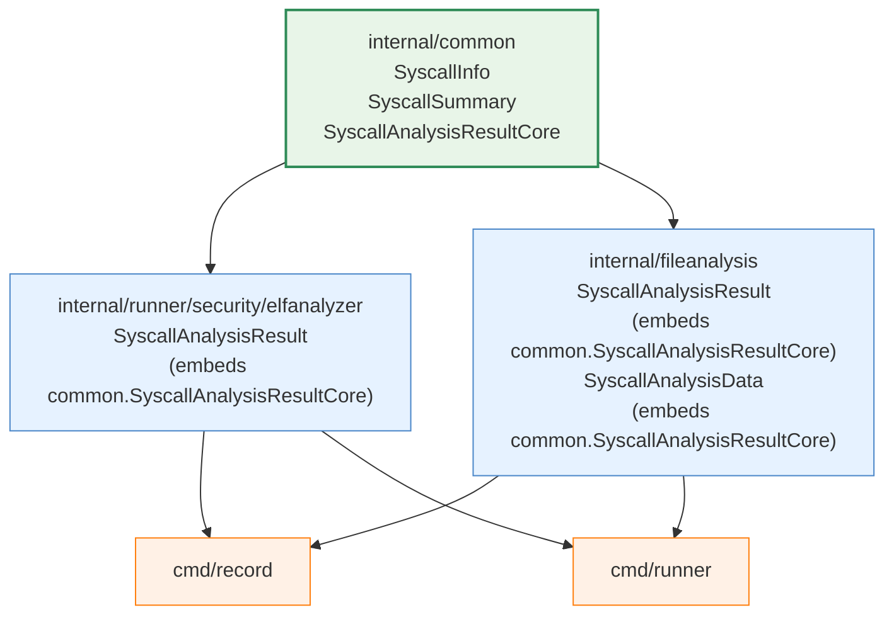

# 実装計画: 共通型の struct embedding によるリファクタリング

## 1. 背景と課題

### 1.1 現状の問題

`elfanalyzer` パッケージと `fileanalysis` パッケージ間に循環参照
が発生するため、同一構造の型が 2 箇所に独立して定義されている。

| 型名 | elfanalyzer 側 | fileanalysis 側 |
|------|---------------|-----------------|
| `SyscallInfo` | `syscall_analyzer.go` | `schema.go` |
| `SyscallSummary` | `syscall_analyzer.go` | `schema.go` |
| `SyscallAnalysisResult` | `syscall_analyzer.go` | `syscall_store.go` |

フィールドと JSON タグは完全に一致しているが、型レベルでの一致保証は
なく、フィールド追加時に片方だけ更新される潜在的リスクがある。

### 1.2 データフロー上の変換箇所

```
[record 時]
  elfanalyzer.SyscallAnalysisResult
    → convertToFileanalysisResult()  [cmd/record/main.go]
    → fileanalysis.SyscallAnalysisResult
    → fileanalysis.SyscallAnalysisStore.SaveSyscallAnalysis()

[runner 時]
  fileanalysis.SyscallAnalysisStore.LoadSyscallAnalysis()
    → fileanalysis.SyscallAnalysisResult (内部)
    → elfanalyzer.SyscallAnalysisStore.LoadSyscallAnalysis()
      (アダプタが elfanalyzer 型に変換して返す)
    → StandardELFAnalyzer.convertSyscallResult()
```

### 1.3 採用する方針

**B. 共通型を struct embedding で埋め込み**

- 共通フィールドを `internal/common` に定義し、
  各パッケージが struct embedding で取り込む
- 共通フィールドの一致を型レベルで保証
- 各パッケージ固有のフィールドを自然に追加可能
- Go の struct embedding は JSON シリアライズ時に
  埋め込みフィールドが自動的にフラット化されるため、
  JSON タグの互換性が維持される

## 2. 設計

### 2.1 依存関係



### 2.2 共通型の定義

`internal/common/syscall_types.go` に以下の型を新規定義する。

```go
package common

// SyscallInfo represents information about a single detected syscall event.
type SyscallInfo struct {
    Number              int    `json:"number"`
    Name                string `json:"name,omitempty"`
    IsNetwork           bool   `json:"is_network"`
    Location            uint64 `json:"location"`
    DeterminationMethod string `json:"determination_method"`
}

// SyscallSummary provides aggregated analysis information.
type SyscallSummary struct {
    HasNetworkSyscalls  bool `json:"has_network_syscalls"`
    IsHighRisk          bool `json:"is_high_risk"`
    TotalDetectedEvents int  `json:"total_detected_events"`
    NetworkSyscallCount int  `json:"network_syscall_count"`
}

// SyscallAnalysisResultCore contains the common fields shared between
// elfanalyzer.SyscallAnalysisResult and fileanalysis.SyscallAnalysisResult.
// Both packages embed this type to ensure field-level consistency.
type SyscallAnalysisResultCore struct {
    Architecture       string         `json:"architecture"`
    DetectedSyscalls   []SyscallInfo  `json:"detected_syscalls"`
    HasUnknownSyscalls bool           `json:"has_unknown_syscalls"`
    HighRiskReasons    []string       `json:"high_risk_reasons,omitempty"`
    Summary            SyscallSummary `json:"summary"`
}
```

### 2.3 各パッケージでの埋め込み

#### elfanalyzer パッケージ

```go
// internal/runner/security/elfanalyzer/syscall_analyzer.go

type SyscallAnalysisResult struct {
    common.SyscallAnalysisResultCore
    DecodeStats DecodeStatistics `json:"-"`
}
```

- `SyscallInfo`, `SyscallSummary` のローカル定義を削除
- `common.SyscallInfo`, `common.SyscallSummary` を直接使用
  （型エイリアスは不要。埋め込みにより `SyscallAnalysisResult` の
  フィールドとして透過的にアクセス可能）

#### fileanalysis パッケージ

```go
// internal/fileanalysis/syscall_store.go

type SyscallAnalysisResult struct {
    common.SyscallAnalysisResultCore
}
```

```go
// internal/fileanalysis/schema.go

type SyscallAnalysisData struct {
    common.SyscallAnalysisResultCore
    AnalyzedAt time.Time `json:"analyzed_at"`
}
```

- `SyscallInfo`, `SyscallSummary` のローカル定義を削除
- `common.SyscallInfo`, `common.SyscallSummary` を直接使用

### 2.4 変換コードの簡略化

struct embedding により、共通部分は `SyscallAnalysisResultCore` 型
として直接コピーできる。スライスの要素型が統一されるため、
フィールドごとのコピーが不要になる。

#### record 時（elfanalyzer → fileanalysis）

```go
// cmd/record/main.go — 変更後
func convertToFileanalysisResult(
    result *elfanalyzer.SyscallAnalysisResult,
) *fileanalysis.SyscallAnalysisResult {
    return &fileanalysis.SyscallAnalysisResult{
        SyscallAnalysisResultCore: result.SyscallAnalysisResultCore,
    }
}
```

**変更前**（26 行）→ **変更後**（5 行）。
`SyscallInfo` のフィールドごとコピーが完全に不要になる。

#### fileanalysis 内（SyscallAnalysisResult → SyscallAnalysisData）

```go
// internal/fileanalysis/syscall_store.go — SaveSyscallAnalysis 内
record.SyscallAnalysis = &SyscallAnalysisData{
    SyscallAnalysisResultCore: result.SyscallAnalysisResultCore,
    AnalyzedAt:                time.Now().UTC(),
}
```

#### fileanalysis 内（SyscallAnalysisData → SyscallAnalysisResult）

```go
// internal/fileanalysis/syscall_store.go — LoadSyscallAnalysis 内
result := &SyscallAnalysisResult{
    SyscallAnalysisResultCore: record.SyscallAnalysis.SyscallAnalysisResultCore,
}
```

#### 統合テスト内（elfanalyzer ↔ fileanalysis 変換）

```go
// syscall_analyzer_integration_test.go — 変更後
faResult := &fileanalysis.SyscallAnalysisResult{
    SyscallAnalysisResultCore: analysisResult.SyscallAnalysisResultCore,
}
// ...
eaResult := &SyscallAnalysisResult{
    SyscallAnalysisResultCore: loadedResult.SyscallAnalysisResultCore,
}
```

### 2.5 SyscallAnalysisStore インターフェース

変換は引き続き必要だが、インターフェース自体の変更は不要。

- `elfanalyzer.SyscallAnalysisStore`: 戻り値は
  `*elfanalyzer.SyscallAnalysisResult`（変更なし）
- `fileanalysis.SyscallAnalysisStore`: 戻り値は
  `*fileanalysis.SyscallAnalysisResult`（変更なし）

各パッケージの `SyscallAnalysisResult` は埋め込み型が異なる
ため Go の型システム上は別の型であり、インターフェースの
シグネチャは変更されない。

### 2.6 JSON シリアライズの互換性

Go の struct embedding では、埋め込みフィールドの JSON タグが
そのまま外側の構造体に昇格する。

```go
type SyscallAnalysisData struct {
    common.SyscallAnalysisResultCore        // architecture, detected_syscalls, ...
    AnalyzedAt time.Time `json:"analyzed_at"` // 固有フィールド
}
```

は下記と同等の JSON を生成する：

```json
{
  "architecture": "x86_64",
  "detected_syscalls": [...],
  "has_unknown_syscalls": false,
  "high_risk_reasons": null,
  "summary": {...},
  "analyzed_at": "2026-02-19T00:00:00Z"
}
```

**既存の JSON 形式との完全な後方互換性が保たれる。**

## 3. 変更対象ファイル一覧

### 3.1 新規作成

| ファイル | 内容 |
|---------|------|
| `internal/common/syscall_types.go` | `SyscallInfo`, `SyscallSummary`, `SyscallAnalysisResultCore` |
| `internal/common/syscall_types_test.go` | JSON シリアライズの往復テスト |

### 3.2 変更

| ファイル | 変更内容 |
|---------|----------|
| `internal/runner/security/elfanalyzer/syscall_analyzer.go` | `SyscallInfo`, `SyscallSummary` のローカル定義を削除、`SyscallAnalysisResult` を embedding に変更 |
| `internal/fileanalysis/schema.go` | `SyscallInfo`, `SyscallSummary` のローカル定義を削除、`SyscallAnalysisData` を embedding に変更 |
| `internal/fileanalysis/syscall_store.go` | `SyscallAnalysisResult` を embedding に変更、`SaveSyscallAnalysis` / `LoadSyscallAnalysis` の変換コードを簡略化 |
| `cmd/record/main.go` | `convertToFileanalysisResult()` を簡略化 |
| `internal/runner/security/elfanalyzer/syscall_analyzer_integration_test.go` | 型変換コードを簡略化 |
| `internal/runner/security/elfanalyzer/analyzer_test.go` | `SyscallInfo`, `SyscallSummary` の参照を `common.*` に更新 |
| `internal/runner/security/elfanalyzer/syscall_analyzer_test.go` | 同上 |
| `internal/fileanalysis/syscall_store_test.go` | 同上 |

### 3.3 変更不要

| ファイル | 理由 |
|---------|------|
| `elfanalyzer/standard_analyzer.go` | `SyscallAnalysisStore` インターフェースのシグネチャ変更なし。`convertSyscallResult()` は `SyscallAnalysisResult` のフィールドにアクセスするが、embedding により透過的にアクセス可能なため変更不要 |
| `elfanalyzer/errors.go` | syscall 型とは無関係 |
| `elfanalyzer/syscall_decoder.go` | `DecodedInstruction` 等は elfanalyzer 固有 |
| `elfanalyzer/syscall_numbers.go` | `SyscallDefinition` 等は elfanalyzer 固有 |
| `fileanalysis/errors.go` | 型と無関係 |
| `fileanalysis/file_analysis_store.go` | `Record` 型を扱うが `SyscallAnalysisData` の内部構造には依存しない |

## 4. 実装手順

### Step 1: 共通型の定義

- [x] `internal/common/syscall_types.go` を新規作成
  - [x] `SyscallInfo`, `SyscallSummary`, `SyscallAnalysisResultCore` を定義
  - [x] `SyscallInfo` のコメントは elfanalyzer 側を基準とし、
        DeterminationMethod の定数定義への参照は削除
        （定数は elfanalyzer パッケージに残る）
- [x] `internal/common/syscall_types_test.go` を新規作成
  - [x] `SyscallAnalysisResultCore` の JSON
        marshal/unmarshal 往復テスト
  - [x] `SyscallInfo` の JSON タグ検証
        （`omitempty` の動作確認）

### Step 2: elfanalyzer パッケージの移行

- [ ] `syscall_analyzer.go` を変更
  - [ ] `SyscallInfo`, `SyscallSummary` の型定義を削除
  - [ ] `SyscallAnalysisResult` を `common.SyscallAnalysisResultCore`
        の embedding に変更
  - [ ] `import` に `common` パッケージを追加
  - [ ] `analyzeSyscallsInCode()` 等の内部コードで
        `SyscallInfo{...}` → `common.SyscallInfo{...}` に更新
  - [ ] `SyscallSummary{...}` → `common.SyscallSummary{...}` に更新
- [ ] テストファイルの型参照を更新
  - [ ] `syscall_analyzer_test.go`
  - [ ] `analyzer_test.go`
  - [ ] `syscall_analyzer_integration_test.go`
- [ ] `make test` で elfanalyzer パッケージのテスト通過を確認

### Step 3: fileanalysis パッケージの移行

- [ ] `schema.go` を変更
  - [ ] `SyscallInfo`, `SyscallSummary` の型定義を削除
  - [ ] `SyscallAnalysisData` を `common.SyscallAnalysisResultCore`
        の embedding に変更
- [ ] `syscall_store.go` を変更
  - [ ] `SyscallAnalysisResult` を
        `common.SyscallAnalysisResultCore` の embedding に変更
  - [ ] `SaveSyscallAnalysis`: `SyscallAnalysisResultCore`
        の直接コピーに簡略化
  - [ ] `LoadSyscallAnalysis`: 同上
- [ ] テストファイルの型参照を更新
  - [ ] `syscall_store_test.go`
- [ ] `make test` で fileanalysis パッケージのテスト通過を確認

### Step 4: 変換コードの簡略化

- [ ] `cmd/record/main.go`
  - [ ] `convertToFileanalysisResult()` を
        `SyscallAnalysisResultCore` の直接コピーに簡略化
- [ ] 統合テストの変換コードを簡略化
- [ ] `make test` で全テスト通過を確認

### Step 5: 最終確認

- [ ] `make test` — 全テスト通過
- [ ] `make lint` — lint エラーなし
- [ ] JSON 互換性の確認
  - [ ] 既存テストの JSON 往復テストが通過していることで
        暗黙的に確認される
  - [ ] Step 1 で追加した明示的テストでも確認

## 5. リスクと対策

### 5.1 JSON フィールド名の衝突

**リスク**: embedding 先と埋め込み型で同名の JSON タグが
存在すると、Go の JSON エンコーダがフィールドを無視する。

**対策**: `SyscallAnalysisData.AnalyzedAt` と
`SyscallAnalysisResult.DecodeStats` は
`SyscallAnalysisResultCore` のフィールドと名前が重複しない。
新規フィールド追加時はこの点を注意する。

### 5.2 埋め込み型のフィールドアクセス

**リスク**: 埋め込みにより `result.Architecture` のような
アクセスが透過的に動作するが、`result.SyscallAnalysisResultCore`
としてまとめてアクセスすることも可能。混在するとコードの
一貫性が下がる。

**対策**: フィールド単位のアクセスは従来通りの記法
（`result.Architecture` 等）を使用。
`SyscallAnalysisResultCore` のまとめアクセスは変換コードでのみ
使用し、コメントで意図を明記する。

### 5.3 `common` パッケージの肥大化

**リスク**: `internal/common` に型を追加し続けると
汎用パッケージが肥大化する。

**対策**: `syscall_types.go` は syscall 解析に特化した型のみを
含む。将来的に `internal/common` の責務が大きくなった場合は、
`internal/commontype` 等への分離を検討する。

## 6. 受け入れ条件

1. `make test` が全件パスすること
2. `make lint` がエラーなしであること
3. `SyscallInfo` と `SyscallSummary` のローカル定義が
   `elfanalyzer` と `fileanalysis` から削除されていること
4. `internal/common/syscall_types.go` に共通型が定義され、
   両パッケージから embedding されていること
5. 変換コード（`convertToFileanalysisResult` 等）が
   `SyscallAnalysisResultCore` の直接コピーに簡略化されて
   いること
6. JSON シリアライズの出力が変更前と同一であること
   （テストで検証）
