# アーキテクチャ設計書: ELF 機械語解析による syscall 静的解析（Linux/arm64 対応）

## 1. システム概要

### 1.1 アーキテクチャ目標

- タスク 0070（x86_64）の実装をリファクタリングし、マルチアーキテクチャ対応の基盤を構築
- arm64 Linux ELF バイナリに対する syscall 静的解析の実現
- 既存の x86_64 解析機能との完全な後方互換性の維持
- アーキテクチャ固有ロジックの明確な分離

### 1.2 設計原則

- **Security First**: 番号不明の syscall は high risk として扱う（x86_64 と同一方針）
- **既存活用**: タスク 0070 の解析基盤（`SyscallAnalyzer`、`fileanalysis` パッケージ等）を再利用
- **アーキテクチャ分離**: 各アーキテクチャのデコーダー・syscall テーブルを独立したコンポーネントとして実装
- **インターフェース汎用化**: `MachineCodeDecoder` のメソッド名・型をアーキテクチャ中立に改名し、x86_64 と arm64 で同一インターフェースを共有

### 1.3 スコープと位置づけ

本タスクはタスク 0070 の拡張であり、同じ解析パイプライン（`SyscallAnalyzer` → 解析結果ストア → `StandardELFAnalyzer` 参照）に arm64 対応を追加する。

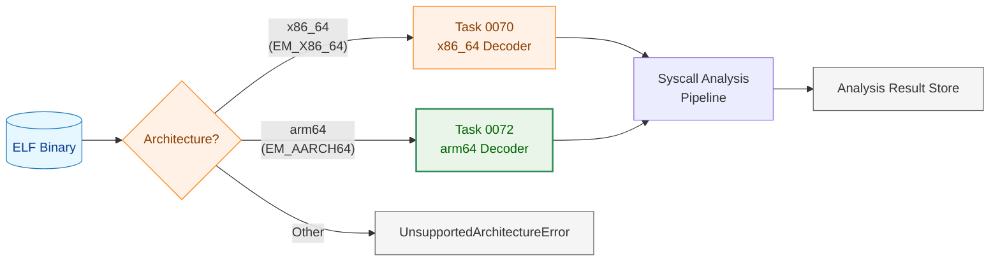

**凡例（Legend）**

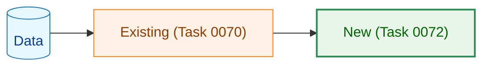

## 2. システム構成

### 2.1 全体アーキテクチャ

タスク 0070 のアーキテクチャを拡張し、アーキテクチャ判定レイヤーを追加する。解析パイプラインの前段でアーキテクチャを判定し、対応するデコーダー・syscall テーブル・GoWrapperResolver を選択する。

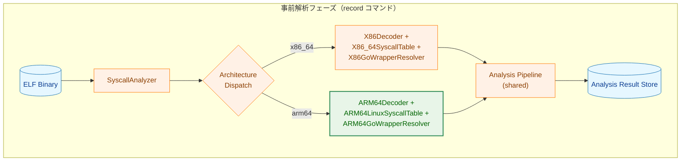

### 2.2 コンポーネント配置

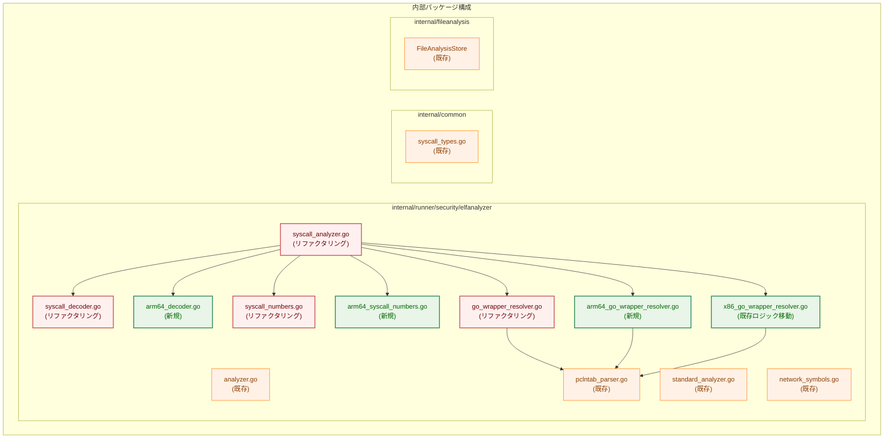

**注記**: 色分けの意味

| 色 | 意味 |
|---|---|
| オレンジ（既存） | タスク 0070 で実装済み、変更なし |
| 赤枠（リファクタリング） | タスク 0070 の実装を汎用化のためリファクタリング |
| 緑枠（新規） | 本タスクで新規追加 |

## 3. インターフェース汎用化設計

### 3.1 MachineCodeDecoder インターフェースの汎用化

現在の `MachineCodeDecoder` はメソッド名・型が x86_64 固有であるため、アーキテクチャ中立な名前に改名する。

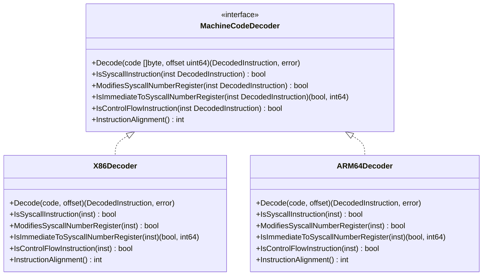

**メソッド名の対応表**:

| 旧メソッド名 (x86_64 固有) | 新メソッド名 (汎用) | x86_64 での意味 | arm64 での意味 |
|---|---|---|---|
| `ModifiesEAXorRAX` | `ModifiesSyscallNumberRegister` | `eax`/`rax` の変更 | `w8`/`x8` の変更 |
| `IsImmediateMove` | `IsImmediateToSyscallNumberRegister` | `mov eax, imm` 等 | `movz w8, imm` |
| *(新規)* | `InstructionAlignment` | 1（可変長命令） | 4（固定長命令） |

**`InstructionAlignment` メソッド**:

デコード失敗時のスキップバイト数とアライメント検証に使用する。

- x86_64: 可変長命令のため `1` を返す（1 バイトずつスキップして再同期）
- arm64: 固定長 4 バイト命令のため `4` を返す

`SyscallAnalyzer` の `findSyscallInstructions` および `decodeInstructionsInWindow` は、デコード失敗時に `decoder.InstructionAlignment()` バイトをスキップする。

### 3.2 DecodedInstruction の汎用化

現在の `DecodedInstruction` は `x86asm.Op`、`[]x86asm.Arg` を直接含んでおり、arm64 では使用できない。アーキテクチャ固有のデコード済みデータを `any` フィールドに格納し、デコーダー実装が内部で型アサーションして使用する方式にする。

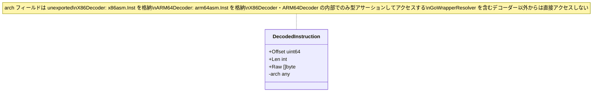

**変更点**:
- `Op x86asm.Op` → 削除（`arch` 内に格納）
- `Args []x86asm.Arg` → 削除（`arch` 内に格納）
- `arch any` を追加（unexported、デコーダー内部でのみ使用）

`SyscallAnalyzer` は `DecodedInstruction` の `Offset`、`Len`、`Raw` のみを参照し、アーキテクチャ固有フィールドにはアクセスしない。全てのアーキテクチャ固有の判定は `MachineCodeDecoder` のメソッド経由で行う。

`X86GoWrapperResolver`・`ARM64GoWrapperResolver` も `arch` フィールドに直接アクセスせず、具体型デコーダー（`*X86Decoder`・`*ARM64Decoder`）が提供する専用メソッド（`GetCallTarget`・`IsImmediateToFirstArgRegister` 等）を呼び出す（§4.2.3 参照）。

### 3.3 SyscallNumberTable インターフェース

既存の `SyscallNumberTable` インターフェースは既にアーキテクチャ中立であるため、変更不要。arm64 用の実装を追加する。

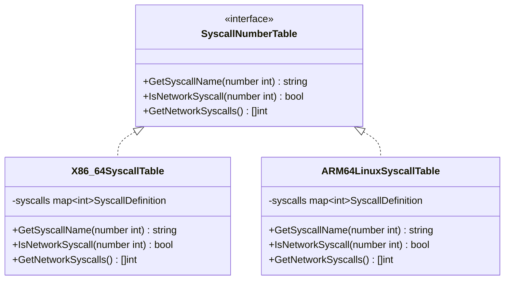

**arm64 Linux ネットワーク関連 syscall テーブル**:

| syscall | arm64 番号 | x86_64 番号 | 備考 |
|---|---|---|---|
| `socket` | 198 | 41 | |
| `socketpair` | 199 | 53 | |
| `bind` | 200 | 49 | |
| `listen` | 201 | 50 | |
| `accept` | 202 | 43 | |
| `connect` | 203 | 42 | |
| `sendto` | 206 | 44 | |
| `recvfrom` | 207 | 45 | |
| `sendmsg` | 211 | 46 | |
| `recvmsg` | 212 | 47 | |
| `accept4` | 242 | 288 | |
| `recvmmsg` | 243 | 299 | |
| `sendmmsg` | 269 | 307 | |

## 4. コンポーネント設計

### 4.1 ARM64Decoder

`arm64asm.Decode` をラップし、`MachineCodeDecoder` インターフェースを実装する。

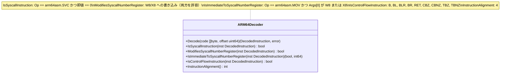

**命令デコードの特性**:

| 特性 | x86_64 | arm64 |
|---|---|---|
| 命令長 | 可変長（1〜15 バイト） | 固定長（4 バイト） |
| デコード失敗時スキップ | 1 バイト（再同期） | 4 バイト |
| デコードライブラリ | `x86/x86asm` | `arm64/arm64asm` |
| syscall 命令 | `SYSCALL`（0F 05、2 バイト） | `SVC #0`（D4000001、4 バイト） |
| syscall 番号レジスタ | `eax`/`rax` | `w8`/`x8` |
| 即値設定パターン | `MOV EAX, imm` / `XOR EAX, EAX` | `MOVZ W8, #imm`（arm64asm では `Op == MOV` に正規化、`W8` / `X8` 両方を許容） |

**arm64 固定長命令の利点**:
- デコード失敗リカバリが単純（4 バイト境界でスキップ）
- `decodeInstructionsInWindow` での命令境界の再同期が不要
- `findSyscallInstructions` での可変長命令起因の誤検出がない

### 4.2 GoWrapperResolver のアーキテクチャ別実装

`GoWrapperResolver` は現在 `*X86Decoder` をハードコードしており、`x86asm.CALL`、`x86asm.Rel`、`x86asm.Reg` を直接参照している。arm64 では `BL` 命令、`arm64asm.PCRel`、arm64 レジスタを使用するため、アーキテクチャ別の実装を作成する。

#### 4.2.1 GoWrapperResolver インターフェース

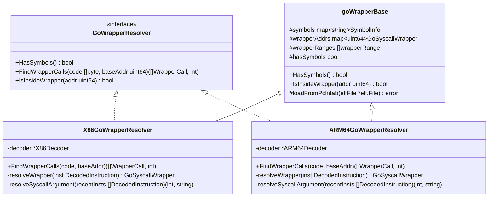

#### 4.2.2 共通ロジック（goWrapperBase）

以下のロジックはアーキテクチャ非依存であり、`goWrapperBase` 構造体に共通化する：

- **シンボル管理**: `symbols` マップ、`wrapperAddrs` マップの管理
- **pclntab パース**: `loadFromPclntab` による `.gopclntab` セクションからの関数情報復元
- **ラッパー範囲チェック**: `IsInsideWrapper` によるアドレスがラッパー関数内かの判定（二分探索）
- **既知ラッパー定義**: `knownGoWrappers`、`knownSyscallImpls` の定義

#### 4.2.3 アーキテクチャ固有ロジック

各 Resolver は具体型デコーダーが提供する専用メソッドを通じて命令情報にアクセスする。`DecodedInstruction.arch` への直接型アサーションは各デコーダー内部でのみ行い、Resolver には露出しない。

**具体型デコーダーが提供する GoWrapperResolver 向け専用メソッド**（`MachineCodeDecoder` インターフェースには含めない）:

| メソッド | 説明 | X86Decoder | ARM64Decoder |
|---|---|---|---|
| `GetCallTarget(inst) (uint64, bool)` | コール命令のターゲットアドレスを返す | `x86asm.CALL` + `x86asm.Rel` で計算 | `arm64asm.BL` + `arm64asm.PCRel` で計算 |
| `IsImmediateToFirstArgRegister(inst) (int64, bool)` | 第1引数レジスタへの即値設定を判定する | `MOV EAX/RAX, imm` を検出 | `Op == arm64asm.MOV` かつ `Args[0]` が `X0` または `W0` を検出（両方を許容） |

**X86GoWrapperResolver**（既存ロジックの移動）:
- `-decoder *X86Decoder` を保持
- `decoder.GetCallTarget(inst)` でコールターゲットアドレスを取得
- `decoder.IsImmediateToFirstArgRegister(inst)` で第1引数（`eax`/`rax`）への即値設定を検出（Go 1.17+ ABI）

**ARM64GoWrapperResolver**（新規）:
- `-decoder *ARM64Decoder` を保持
- `decoder.GetCallTarget(inst)` でコールターゲットアドレスを取得（`BL` 命令の `arm64asm.PCRel` オペランドを内部で処理）
- `decoder.IsImmediateToFirstArgRegister(inst)` で第1引数（`x0` / `w0`）への即値設定を検出（Go 1.17+ ABI）。`arm64asm.X0` と `arm64asm.W0` の両方を許容する

**arm64 と x86_64 の Go ラッパー呼び出しパターン比較**:

| 項目 | x86_64 | arm64 |
|---|---|---|
| 呼び出し命令 | `CALL rel32` | `BL imm26` |
| ターゲットアドレス型 | `x86asm.Rel` | `arm64asm.PCRel` |
| 第1引数（syscall 番号）レジスタ | `rax`/`eax` | `x0` |
| 即値設定パターン | `MOV EAX, imm` | `MOVZ X0, #imm` |

### 4.3 SyscallAnalyzer のアーキテクチャディスパッチ

`SyscallAnalyzer` はアーキテクチャ構成をレジストリ方式で管理し、ELF ファイルのアーキテクチャに基づいて適切なコンポーネントを選択する。

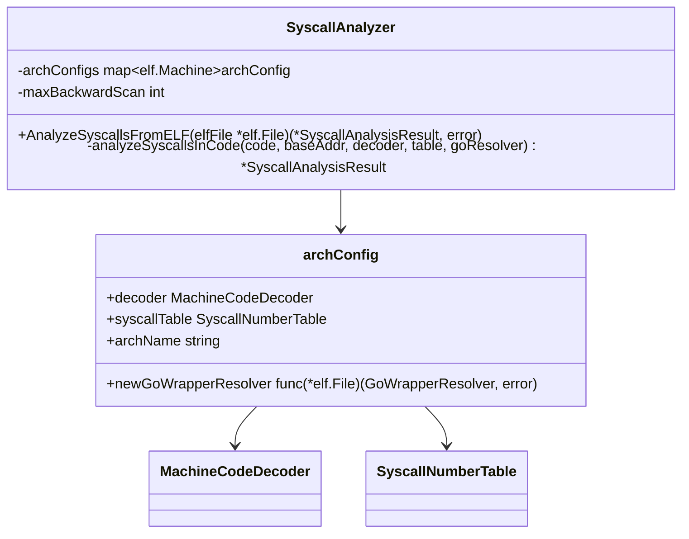

**アーキテクチャディスパッチフロー**:

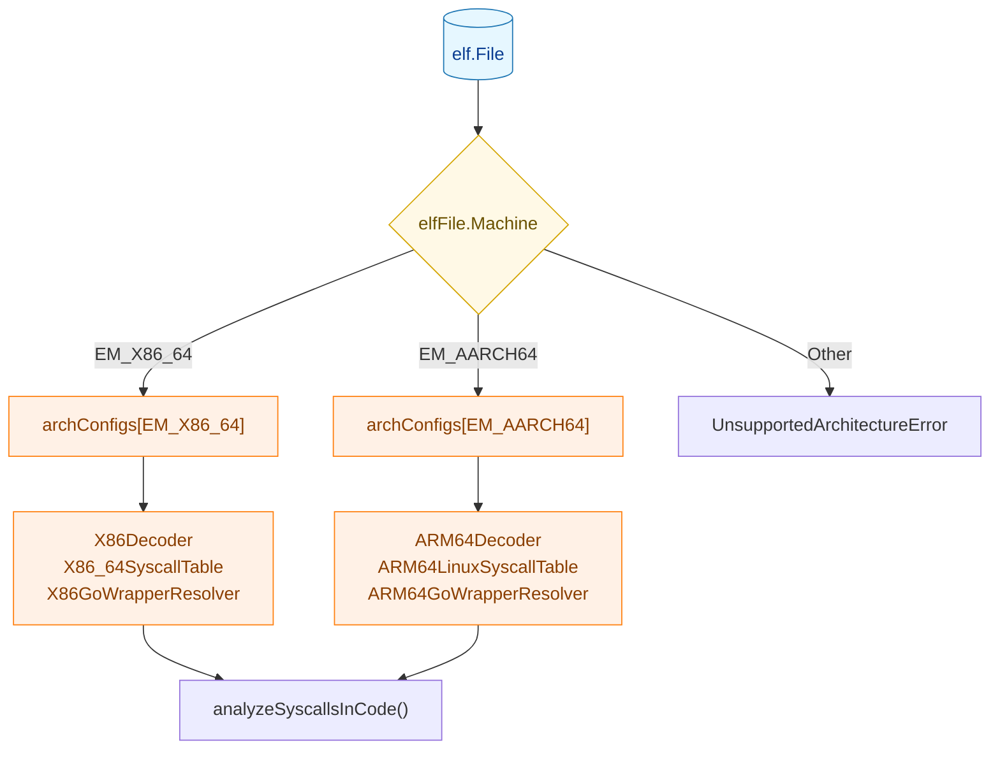

**コンストラクタ設計**:

```go
// NewSyscallAnalyzer creates a SyscallAnalyzer with x86_64 and arm64 support.
func NewSyscallAnalyzer() *SyscallAnalyzer

// NewSyscallAnalyzerWithConfig creates a SyscallAnalyzer with custom components.
// Used primarily for testing with mock decoder/table.
// The decoder and table are registered for EM_X86_64 (default test architecture).
func NewSyscallAnalyzerWithConfig(decoder MachineCodeDecoder, table SyscallNumberTable, maxScan int) *SyscallAnalyzer
```

`NewSyscallAnalyzerWithConfig` のシグネチャは既存テストとの後方互換性を維持するために保持する。テスト用モックデコーダーは `EM_X86_64` として登録される。

### 4.4 analyzeSyscallsInCode の汎用化

現在の `analyzeSyscallsInCode` は `a.decoder` フィールドを直接参照しているが、汎用化後はパラメータとしてデコーダー・テーブル・GoWrapperResolver を受け取る。

```go
// Before (x86_64 only)
func (a *SyscallAnalyzer) analyzeSyscallsInCode(
    code []byte, baseAddr uint64,
    goResolver *GoWrapperResolver,
) *SyscallAnalysisResult

// After (multi-architecture)
func (a *SyscallAnalyzer) analyzeSyscallsInCode(
    code []byte, baseAddr uint64,
    decoder MachineCodeDecoder,
    table SyscallNumberTable,
    goResolver GoWrapperResolver,
) *SyscallAnalysisResult
```

内部の `findSyscallInstructions`、`backwardScanForSyscallNumber`、`decodeInstructionsInWindow` も同様にデコーダーをパラメータとして受け取る。これにより解析パイプライン全体がアーキテクチャ非依存になる。

**findSyscallInstructions の変更点**:

現在の実装はバイト列パターンマッチ（`code[pos] == 0x0F && code[pos+1] == 0x05`）で syscall 命令を検出しているが、汎用化後は `decoder.IsSyscallInstruction(inst)` を使用する。

```go
// Before (x86_64 specific)
if inst.Len == 2 && pos+1 < len(code) && code[pos] == 0x0F && code[pos+1] == 0x05 {
    locations = append(locations, inst.Offset)
}

// After (architecture-neutral)
if decoder.IsSyscallInstruction(inst) {
    locations = append(locations, inst.Offset)
}
```

## 5. データフロー

### 5.1 事前解析フロー（拡張版）

タスク 0070 のデータフローに、アーキテクチャ判定ステップが追加される。

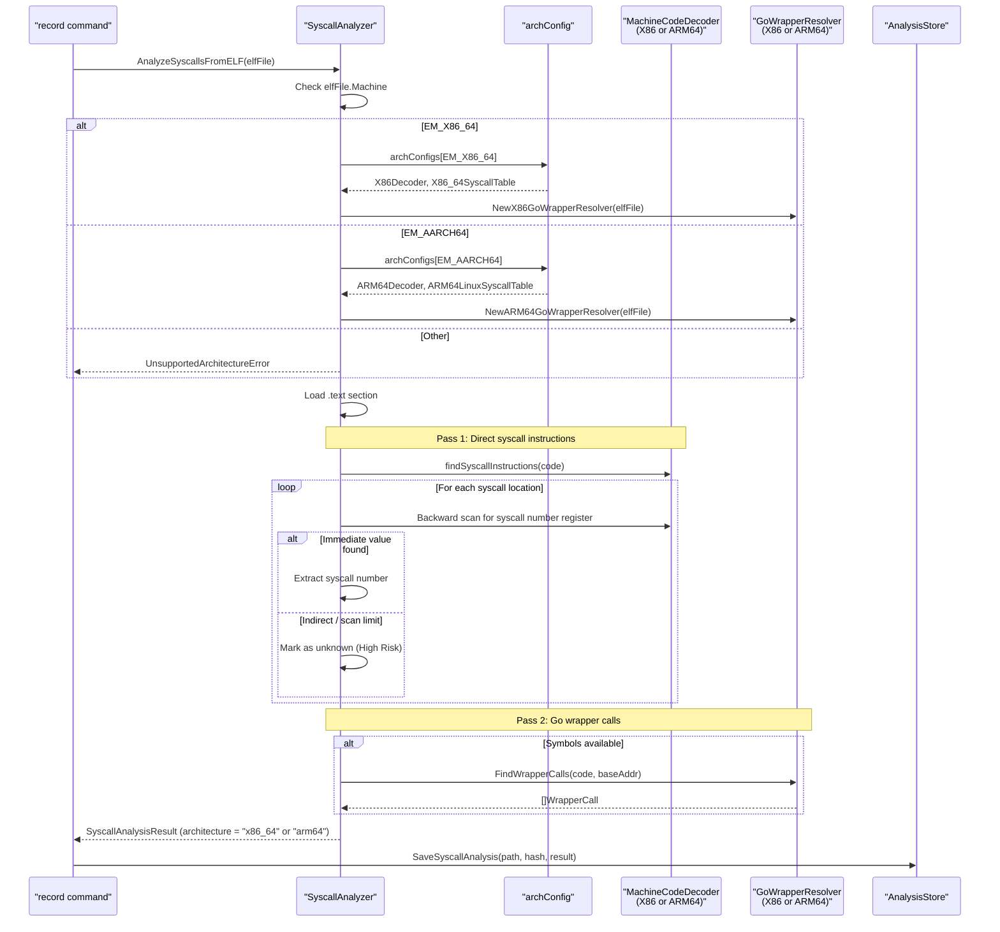

### 5.2 解析結果の保存

解析結果の保存は既存の `fileanalysis` パッケージをそのまま利用する。`SyscallAnalysisResultCore.Architecture` フィールドに `"arm64"` を設定することで、アーキテクチャ別の解析結果を区別する。

```json
{
  "schema_version": 1,
  "file_path": "/usr/local/bin/myapp-arm64",
  "content_hash": "sha256:def789abc123...",
  "updated_at": "2026-02-28T10:30:00Z",
  "syscall_analysis": {
    "architecture": "arm64",
    "analyzed_at": "2026-02-28T10:30:00Z",
    "detected_syscalls": [
      {"number": 198, "name": "socket", "is_network": true, "location": 8192, "determination_method": "immediate"},
      {"number": 203, "name": "connect", "is_network": true, "location": 8224, "determination_method": "go_wrapper"}
    ],
    "has_unknown_syscalls": false,
    "summary": {
      "has_network_syscalls": true,
      "is_high_risk": false,
      "total_detected_events": 2,
      "network_syscall_count": 2
    }
  }
}
```

## 6. arm64 固有の設計詳細

### 6.1 arm64 命令パターン

#### 6.1.1 直接 syscall（Pass 1）

```asm
movz w8, #198      // syscall number (socket=198) → w8
svc  #0            // invoke syscall
```

`arm64asm` パッケージでは：
- `svc #0` は `Op == arm64asm.SVC` かつオペランドの即値が `0` の命令としてデコードされる
- `movz w8, #198` は `Op == arm64asm.MOV`（`MOVZ` ではなく `MOV` に正規化される）としてデコードされる
  - `Args[0]` は `arm64asm.Reg` 型。Go コンパイラのバージョンや最適化により `arm64asm.W8`（32bit）または `arm64asm.X8`（64bit）のどちらかになる可能性があるため、両方を許容する
  - `Args[1]` は `arm64asm.Imm`（W8 の場合）または `arm64asm.Imm64`（X8 の場合）型

#### 6.1.2 Go ラッパー呼び出し（Pass 2）

```asm
movz x0, #198      // syscall number (socket=198) → x0 (first arg)
bl   syscall.Syscall
```

`arm64asm` パッケージでは：
- `bl` は `Op == arm64asm.BL` としてデコードされる
- ターゲットアドレスは `arm64asm.PCRel` 型のオペランドで表現される
- `movz x0, #198` は `Op == arm64asm.MOV` としてデコードされる（`MOVZ` ではなく `MOV` に正規化）
  - `Args[0]` は `arm64asm.Reg` 型。`arm64asm.X0`（64bit）が通常だが、最適化によっては `arm64asm.W0`（32bit）も使われる可能性があるため、両方を許容する
  - `Args[1]` は `arm64asm.Imm64`（X0 の場合）または `arm64asm.Imm`（W0 の場合）型

#### 6.1.3 制御フロー命令

arm64 で制御フロー境界として扱う命令：

| 命令 | 説明 | 逆方向スキャンでの扱い |
|---|---|---|
| `B` | 無条件分岐 | 境界（High Risk） |
| `BL` | リンク付き分岐（関数呼び出し） | 境界（High Risk） |
| `BLR` | レジスタ間接リンク付き分岐 | 境界（High Risk） |
| `BR` | レジスタ間接分岐 | 境界（High Risk） |
| `RET` | リターン | 境界（High Risk） |
| `CBZ` | ゼロ比較分岐 | 境界（High Risk） |
| `CBNZ` | 非ゼロ比較分岐 | 境界（High Risk） |
| `TBZ` | ビットテスト分岐 | 境界（High Risk） |
| `TBNZ` | ビットテスト非ゼロ分岐 | 境界（High Risk） |

### 6.2 arm64 の逆方向スキャン

arm64 では固定長命令（4 バイト）のため、逆方向スキャンが x86_64 より単純になる。

**x86_64 との比較**:

| 項目 | x86_64 | arm64 |
|---|---|---|
| 逆方向デコード | 不可（可変長命令） | 原理上可能（固定長） |
| 実装方式 | 前方デコード + 逆順走査 | 前方デコード + 逆順走査 |
| ウィンドウサイズ計算 | `maxScan × 15` バイト | `maxScan × 4` バイト |
| アライメント問題 | あり（ウィンドウ開始位置が命令境界とズレる可能性） | なし（4 バイト境界で確定） |

**設計判断**: arm64 でも前方デコード + 逆順走査方式を採用する。これは x86_64 と同一のアルゴリズムであり、`SyscallAnalyzer` の `backwardScanForSyscallNumber` / `decodeInstructionsInWindow` をそのまま共有できる。arm64 の固定長命令特性はウィンドウサイズの効率化に寄与するが、アルゴリズム自体は変更しない。

## 7. 統合設計

### 7.1 既存コンポーネントへの影響

本タスクによる既存コンポーネントへの変更は主にインターフェース汎用化に伴うリネームである。機能的な変更は最小限に抑える。

| コンポーネント | 変更内容 | 影響度 |
|---|---|---|
| `MachineCodeDecoder` | メソッド名リネーム、`InstructionAlignment` 追加 | 中（インターフェース変更） |
| `DecodedInstruction` | `Op`/`Args` 削除、`arch any` 追加 | 中（型変更） |
| `X86Decoder` | 新メソッド名に対応、`InstructionAlignment` 実装 | 低（リネームのみ） |
| `SyscallAnalyzer` | `archConfigs` 導入、内部メソッドのパラメータ追加 | 中 |
| `GoWrapperResolver` | インターフェース化、既存ロジックを `X86GoWrapperResolver` に移動 | 中 |
| `Standard ELFAnalyzer` | 変更なし | なし |
| `fileanalysis` パッケージ | 変更なし | なし |
| テストコード | モックのメソッド名変更 | 低 |

### 7.2 既存テストへの影響

インターフェース汎用化に伴い、以下のテストコード変更が必要：

1. **MockMachineCodeDecoder**: メソッド名をリネーム
   - `ModifiesEAXorRAX` → `ModifiesSyscallNumberRegister`
   - `IsImmediateMove` → `IsImmediateToSyscallNumberRegister`
   - `InstructionAlignment` を追加

2. **GoWrapperResolver のテスト**: `X86GoWrapperResolver` に移動したロジックのテストを維持

3. **SyscallAnalyzer のテスト**: `NewSyscallAnalyzerWithConfig` は後方互換を保つため、既存テストは最小限の変更で通過する

## 8. セキュリティ設計

### 8.1 High Risk 判定

arm64 でも x86_64 と同一の High Risk 判定基準を適用する（タスク 0070 §6.2 と同一）。

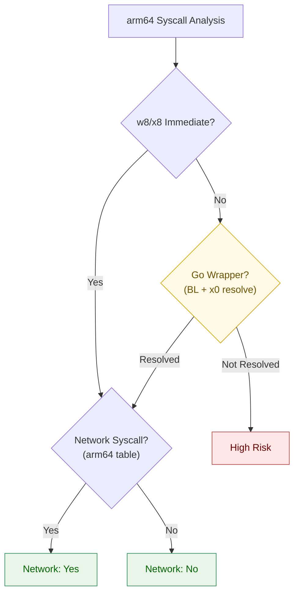

### 8.2 アーキテクチャ間の独立性

- x86_64 と arm64 の syscall テーブルは完全に独立
- 同じ番号が異なる syscall を指すため、誤ったテーブルの適用は致命的なセキュリティリスク
  - 例: arm64 の `198`（socket）は x86_64 では `lgetxattr`
- `AnalyzeSyscallsFromELF` でのアーキテクチャ判定は `elf.File.Machine` に基づき、不一致の場合は `UnsupportedArchitectureError` を返す

## 9. パフォーマンス設計

### 9.1 arm64 解析のパフォーマンス特性

arm64 の固定長命令は x86_64 より単純にデコードできるため、同等またはより高速な解析が期待できる。

| 処理 | x86_64 | arm64 | 備考 |
|---|---|---|---|
| 命令デコード | 可変長、やや複雑 | 固定長、高速 | arm64 は 4 バイト固定 |
| デコード失敗リカバリ | 1 バイトスキップ | 4 バイトスキップ | arm64 は失敗頻度も低い |
| 逆方向スキャンウィンドウ | `N × 15` バイト | `N × 4` バイト | arm64 はウィンドウが約 1/4 |
| 全体パフォーマンス目標 | タスク 0070 §7 と同等 | 同等以上 | |

**インターフェース汎用化によるパフォーマンス影響**:

§4.4 で述べた `findSyscallInstructions` のバイトパターンマッチ（`code[pos] == 0x0F && code[pos+1] == 0x05`）を `decoder.IsSyscallInstruction(inst)` に置き換える変更は、パフォーマンスに影響しない。現在の実装はすでにストリーム全体を `decoder.Decode()` でループして逐次パースしており、デコード結果として得た `inst` に対してパターンチェックを追加するだけである。バイトシークのような別ループを導入するわけではないため、インターフェース経由のメソッド呼び出しコスト以外のオーバーヘッドは皆無である。

## 10. テスト戦略

### 10.1 テスト階層

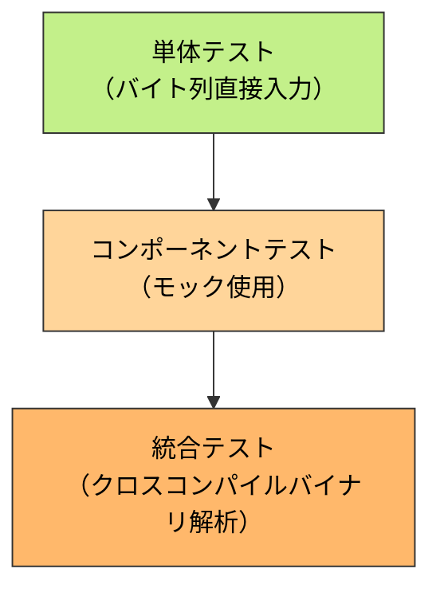

### 10.2 テストカテゴリ

**単体テスト**:

| テスト対象 | テスト内容 |
|---|---|
| `ARM64Decoder` | arm64 バイト列からの命令デコード、`svc #0` 検出、`movz w8, #imm` 検出 |
| `ARM64LinuxSyscallTable` | arm64 syscall 番号からの名前・ネットワーク判定 |
| `ARM64GoWrapperResolver` | `bl` 命令の検出、`x0` レジスタへの即値設定検出 |
| `X86Decoder`（リネーム後） | 既存テストのメソッド名更新による回帰テスト |

**コンポーネントテスト**:

| テスト対象 | テスト内容 |
|---|---|
| `SyscallAnalyzer` (arm64) | arm64 用モックデコーダーでの解析フロー |
| `SyscallAnalyzer` (arch dispatch) | アーキテクチャ判定とコンポーネント選択 |

**統合テスト**:

| テスト対象 | テスト内容 | 環境 |
|---|---|---|
| arm64 クロスコンパイルバイナリ | `GOOS=linux GOARCH=arm64 go build` でクロスコンパイルした Go バイナリの解析 | x86_64 CI 環境でも実行可能 |
| x86_64 回帰テスト | 既存の x86_64 統合テストの保持 | 既存 CI 環境 |

### 10.3 クロスコンパイルによるテスト

Go のクロスコンパイル機能により、x86_64 ホスト上でも arm64 バイナリを生成してテスト可能：

```bash
GOOS=linux GOARCH=arm64 go build -o test_arm64_binary ./testdata/network_program.go
```

生成されたバイナリを `SyscallAnalyzer.AnalyzeSyscallsFromELF` で解析し、ネットワーク syscall の検出を確認する。

## 11. 段階的実装計画

### Phase 1: インターフェース汎用化

- [ ] `MachineCodeDecoder` メソッド名リネーム
- [ ] `DecodedInstruction` 汎用化（`arch any` フィールド導入）
- [ ] `X86Decoder` を新インターフェースに適合
- [ ] `GoWrapperResolver` インターフェース定義
- [ ] 既存 `GoWrapperResolver` を `X86GoWrapperResolver` に移動・共通ロジック抽出
- [ ] `SyscallAnalyzer` のパラメータ化（内部メソッドへのデコーダー受け渡し）
- [ ] `findSyscallInstructions` のバイトパターンマッチを `IsSyscallInstruction` に変更
- [ ] 既存テストの更新（メソッド名変更への追従）
- [ ] 全既存テストがパスすることの確認

### Phase 2: arm64 デコーダーと syscall テーブル

- [ ] `ARM64Decoder` の実装
- [ ] `ARM64LinuxSyscallTable` の実装
- [ ] 単体テストの作成（バイト列直接入力）

### Phase 3: arm64 GoWrapperResolver

- [ ] `ARM64GoWrapperResolver` の実装
- [ ] `bl` 命令検出とターゲットアドレス計算
- [ ] `x0` レジスタへの即値設定検出
- [ ] 単体テストの作成

### Phase 4: SyscallAnalyzer のアーキテクチャ対応

- [ ] `archConfigs` レジストリの実装
- [ ] `AnalyzeSyscallsFromELF` のアーキテクチャディスパッチ
- [ ] `EM_AARCH64` の登録
- [ ] コンポーネントテスト

### Phase 5: 統合テスト

- [ ] arm64 クロスコンパイルバイナリの生成
- [ ] 統合テストの作成（ネットワーク syscall 検出）
- [ ] x86_64 回帰テストの確認
- [ ] 解析結果の保存・読み込みテスト（arm64）

## 12. 設計上の判断と代替案

### 12.1 MachineCodeDecoder の汎用化方式

**採用案**: メソッド名リネーム + `DecodedInstruction` の汎用化
- メソッド名をアーキテクチャ中立に改名（例: `ModifiesEAXorRAX` → `ModifiesSyscallNumberRegister`）
- `DecodedInstruction` の `Op`/`Args` を `arch any` に置き換え
- x86_64 と arm64 で同一インターフェースを共有

**代替案（不採用）**: アーキテクチャ別インターフェース
- `MachineCodeDecoder`（x86_64）と `ARM64MachineCodeDecoder`（arm64）を別定義
- `SyscallAnalyzer` 内でアーキテクチャに応じた分岐が必要
- インターフェースの意味的重複が発生し、新アーキテクチャ追加時の負担が増加

### 12.2 GoWrapperResolver のアーキテクチャ対応方式

**採用案**: アーキテクチャ別 GoWrapperResolver + 共通ベース + 具体型への専用メソッド定義
- `X86GoWrapperResolver` と `ARM64GoWrapperResolver` をそれぞれ実装
- 共通ロジック（pclntab パース、ラッパー名マッチング等）を `goWrapperBase` に抽出
- `DecodedInstruction.arch` フィールドへの直接アクセスは行わない
- 代わりに `*X86Decoder`・`*ARM64Decoder` 具体型に `GoWrapperResolver` 向けの専用メソッドを定義する
  - `GetCallTarget(inst DecodedInstruction) (addr uint64, ok bool)`: コール命令のターゲットアドレスを返す
  - `IsImmediateToFirstArgRegister(inst DecodedInstruction) (val int64, ok bool)`: 第1引数レジスタへの即値設定を判定する
  - これらのメソッドは `MachineCodeDecoder` インターフェースには含めない（GoWrapperResolver 専用）
  - 内部で `arch` フィールドへの型アサーションを行うのはデコーダー自身のみ
- 各 Resolver は具体型デコーダー（`-decoder *X86Decoder` / `-decoder *ARM64Decoder`）を保持し、専用メソッドを呼び出す

**代替案（不採用）**: MachineCodeDecoder にラッパー検出メソッドを追加して GoWrapperResolver を汎用化
- `IsCallInstruction`、`GetCallRelativeOffset`、`IsImmediateToFirstArgRegister` 等をインターフェースに追加
- MachineCodeDecoder の責務が過大になる
- 呼び出し命令のセマンティクス（CALL の rel32 vs BL の imm26）の差異を吸収しきれない

**代替案（不採用）**: GoWrapperResolver が `DecodedInstruction.arch` に直接型アサーション
- `arch` フィールドへのアクセスがデコーダー以外に漏れ、カプセル化が崩れる
- アーキテクチャ固有の内部表現（`x86asm.Inst`、`arm64asm.Inst`）が GoWrapperResolver 側にも露出する

### 12.3 逆方向スキャンの方式

**採用案**: 前方デコード + 逆順走査（x86_64 と共通）
- arm64 でも x86_64 と同じアルゴリズムを使用
- `decodeInstructionsInWindow` を共有し、コードの重複を回避
- ウィンドウサイズは arm64 の固定長命令特性により自然に最適化される（`N × 4` バイト vs `N × 15` バイト）

**代替案（不採用）**: arm64 で真の逆方向デコード
- arm64 は固定長命令のため原理上は逆方向デコードが可能（4 バイトずつ遡る）
- 実装の単純さと x86_64 とのコード共有のメリットが、わずかなパフォーマンス差を上回る
- コードの一貫性を優先

### 12.4 SyscallAnalyzer のアーキテクチャ構成方式

**採用案**: レジストリパターン（`archConfigs` マップ）
- `map[elf.Machine]*archConfig` でアーキテクチャごとにデコーダー・テーブル・GoWrapperResolver ファクトリを登録
- 新アーキテクチャの追加はマップへのエントリ追加のみ
- `AnalyzeSyscallsFromELF` はアーキテクチャ判定後にレジストリからコンポーネントを取得

**代替案（不採用）**: switch 文による静的ディスパッチ
- `AnalyzeSyscallsFromELF` 内で `switch elfFile.Machine` による分岐
- シンプルだが新アーキテクチャ追加時に `AnalyzeSyscallsFromELF` の修正が必要
- テスト構成の注入が困難
