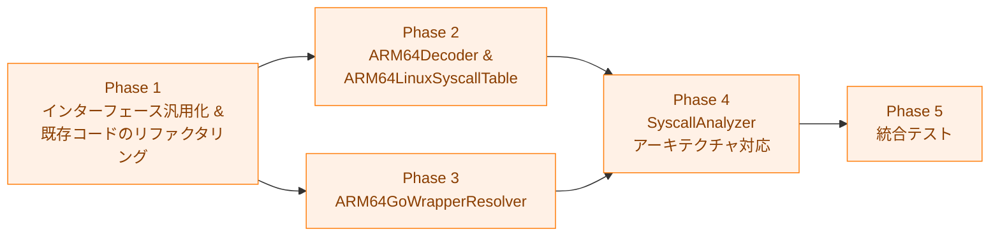

# 実装計画書: ELF 機械語解析による syscall 静的解析（Linux/arm64 対応）

## 概要

本ドキュメントは、ELF 機械語解析による syscall 静的解析の arm64 対応実装進捗を追跡する。
詳細仕様は [03_detailed_specification.md](03_detailed_specification.md) を参照。
アーキテクチャ設計は [02_architecture.md](02_architecture.md) を参照。

## 依存関係



**注記**: Phase 2 と Phase 3 は Phase 1 完了後に並行して実施可能。
Phase 4 は Phase 2・3 の両方が完了した後に実施する。

## Phase 1: インターフェース汎用化 & 既存コードのリファクタリング

`MachineCodeDecoder` のメソッド名・`DecodedInstruction` の型・`GoWrapperResolver` の
インターフェース化を行い、arm64 追加のための基盤を整える。
全既存テストが引き続きパスすることを確認してから次の Phase に移る。

仕様参照: 詳細仕様書 §2, §3

### 1.1 DecodedInstruction の汎用化

- [ ] `syscall_decoder.go` の `DecodedInstruction` を更新する
  - `Op x86asm.Op` フィールドを削除し `arch any` フィールド（unexported）を追加
  - `Args []x86asm.Arg` フィールドを削除
  - 仕様: 詳細仕様書 §2.1

### 1.2 MachineCodeDecoder インターフェースの汎用化

- [ ] `syscall_decoder.go` の `MachineCodeDecoder` インターフェースを更新する
  - `ModifiesEAXorRAX` → `ModifiesSyscallNumberRegister` にリネーム
  - `IsImmediateMove` → `IsImmediateToSyscallNumberRegister` にリネーム
  - `InstructionAlignment() int` メソッドを追加
  - 仕様: 詳細仕様書 §2.2

### 1.3 X86Decoder の更新

- [ ] `syscall_decoder.go` の `X86Decoder` を新インターフェースに適合させる
  - `Decode` メソッドで `arch = inst`（`x86asm.Inst`）をセット、`Op`/`Args` フィールドへの設定を除去
  - 各判定メソッド内で `inst.arch.(x86asm.Inst)` で型アサーション
  - `ModifiesEAXorRAX` → `ModifiesSyscallNumberRegister` にリネーム
  - `IsImmediateMove` → `IsImmediateToSyscallNumberRegister` にリネーム
  - `InstructionAlignment() int` を追加（戻り値 1）
  - 仕様: 詳細仕様書 §2.3

### 1.4 X86Decoder の GoWrapperResolver 専用メソッド追加

- [ ] `syscall_decoder.go` または `x86_go_wrapper_resolver.go` に専用メソッドを追加
  - `GetCallTarget(inst DecodedInstruction, instAddr uint64) (uint64, bool)`
  - `IsImmediateToFirstArgRegister(inst DecodedInstruction) (int64, bool)`
  - 仕様: 詳細仕様書 §2.3

### 1.5 GoWrapperResolver インターフェース定義と共通ベース抽出

- [ ] `go_wrapper_resolver.go` に `GoWrapperResolver` インターフェースを追加
  - `HasSymbols() bool`
  - `FindWrapperCalls(code []byte, baseAddr uint64) ([]WrapperCall, int)`
  - `IsInsideWrapper(addr uint64) bool`
  - 仕様: 詳細仕様書 §3.1
- [ ] `go_wrapper_resolver.go` に `goWrapperBase` 構造体を定義し共通ロジックを移動
  - `symbols`, `wrapperAddrs`, `wrapperRanges`, `hasSymbols` フィールド
  - `HasSymbols()`, `IsInsideWrapper()`, `loadFromPclntab()` メソッド
  - 仕様: 詳細仕様書 §3.2

### 1.6 X86GoWrapperResolver への移行

- [ ] `x86_go_wrapper_resolver.go` を新規作成し `X86GoWrapperResolver` を実装
  - `goWrapperBase` を埋め込む
  - `FindWrapperCalls` のロジックを既存 `GoWrapperResolver` から移動
  - `decoder *X86Decoder` を保持し、`GetCallTarget` / `IsImmediateToFirstArgRegister`
    専用メソッド経由で命令情報にアクセス
  - 仕様: 詳細仕様書 §3.3
- [ ] `go_wrapper_resolver.go` に関数エイリアスを追加（後方互換）
  - `func NewGoWrapperResolver(elfFile *elf.File) (*X86GoWrapperResolver, error)`
  - 型エイリアス `type GoWrapperResolver = X86GoWrapperResolver` は **定義しない**
    （同名インターフェースとの `redeclared in this block` コンパイルエラーを防ぐため）
  - 仕様: 詳細仕様書 §3.3

### 1.7 SyscallAnalyzer の内部メソッドをパラメータ化

- [ ] `syscall_analyzer.go` の内部メソッドを変更
  - `analyzeSyscallsInCode` のシグネチャに `decoder`, `table`, `goResolver` 引数を追加
  - `findSyscallInstructions` のバイトパターンマッチを `decoder.IsSyscallInstruction(inst)` に変更
  - デコード失敗時スキップを `decoder.InstructionAlignment()` から取得
  - `backwardScanForSyscallNumber` / `decodeInstructionsInWindow` にデコーダー引数を追加
  - ウィンドウサイズ計算を `maxWindowBytesPerInstruction(decoder)` ヘルパーに統一
  - メソッド呼び出し名のリネーム（`ModifiesEAXorRAX` → `ModifiesSyscallNumberRegister` 等）
  - `goResolver` の型を `GoWrapperResolver` インターフェースに変更
  - 仕様: 詳細仕様書 §6.5, §6.6, §6.7

### 1.8 既存テストの更新

- [ ] `syscall_decoder_test.go` のメソッド名をリネーム
  - `TestX86Decoder_ModifiesEAXorRAX` → `TestX86Decoder_ModifiesSyscallNumberRegister`
  - `TestX86Decoder_IsImmediateMove` → `TestX86Decoder_IsImmediateToSyscallNumberRegister`
  - `InstructionAlignment` のテスト（戻り値 `1`）を追加
  - 仕様: 詳細仕様書 §8.5
- [ ] `syscall_analyzer_test.go` の `MockMachineCodeDecoder` を更新
  - `ModifiesEAXorRAX` → `ModifiesSyscallNumberRegister`
  - `IsImmediateMove` → `IsImmediateToSyscallNumberRegister`
  - `InstructionAlignment() int` を追加（デフォルト戻り値 `1`）
  - 仕様: 詳細仕様書 §7
- [ ] `go_wrapper_resolver_test.go` を `x86_go_wrapper_resolver_test.go` に移動・更新
  - 型名の変更に追従
- [ ] `make test` を実行し全テストがパスすることを確認

## Phase 2: ARM64Decoder & ARM64LinuxSyscallTable

仕様参照: 詳細仕様書 §4, §5

### 2.1 ARM64Decoder の実装

- [ ] `arm64_decoder.go` を新規作成
  - `ARM64Decoder` 構造体と `NewARM64Decoder()` コンストラクタ
  - `Decode(code []byte, offset uint64) (DecodedInstruction, error)`:
    `arm64asm.Decode` ラッパー; `arch = inst`（`arm64asm.Inst`）
  - `IsSyscallInstruction`: `Op == arm64asm.SVC && Args[0] == Imm(0)`
  - `ModifiesSyscallNumberRegister`: `Args[0]` が `W8` または `X8`
  - `IsImmediateToSyscallNumberRegister`: `Op == arm64asm.MOV && Args[0] in {W8,X8} && Args[1] is Imm`
  - `IsControlFlowInstruction`: B, BL, BLR, BR, RET, CBZ, CBNZ, TBZ, TBNZ
  - `InstructionAlignment() int`: 戻り値 `4`
  - 仕様: 詳細仕様書 §4.2〜§4.7

### 2.2 ARM64Decoder の GoWrapperResolver 専用メソッド

- [ ] `arm64_decoder.go` に専用メソッドを追加
  - `GetCallTarget(inst DecodedInstruction, instAddr uint64) (uint64, bool)`:
    `Op == arm64asm.BL && Args[0] is PCRel` → ターゲットアドレス計算
  - `IsImmediateToFirstArgRegister(inst DecodedInstruction) (int64, bool)`:
    `Op == arm64asm.MOV && Args[0] in {X0,W0} && Args[1] is Imm`
  - 仕様: 詳細仕様書 §4.8

### 2.3 ARM64Decoder 単体テスト

- [ ] `arm64_decoder_test.go` を新規作成
  - `TestARM64Decoder_Decode`: svc/mov/bl/ret のデコード確認
  - `TestARM64Decoder_IsSyscallInstruction`: `svc #0` のみ true
  - `TestARM64Decoder_ModifiesSyscallNumberRegister`: W8/X8 への書き込みを検出
  - `TestARM64Decoder_IsImmediateToSyscallNumberRegister`: 即値取り出しと値確認
  - `TestARM64Decoder_IsControlFlowInstruction`: RET/B は true、SVC/MOV は false
  - `TestARM64Decoder_InstructionAlignment`: 戻り値 `4`
  - `TestARM64Decoder_GetCallTarget`: BL + PCRel からターゲットアドレスを計算
  - `TestARM64Decoder_IsImmediateToFirstArgRegister`: X0/W0 への即値設定を検出
  - 受け入れ条件: AC-1

### 2.4 ARM64LinuxSyscallTable の実装

- [ ] `arm64_syscall_numbers.go` を新規作成
  - `ARM64LinuxSyscallTable` 構造体と `NewARM64LinuxSyscallTable()` コンストラクタ
  - ネットワーク syscall 13 種（詳細仕様書 §5.2 参照）
  - `SyscallNumberTable` インターフェースの 3 メソッドを実装
  - 仕様: 詳細仕様書 §5

### 2.5 ARM64LinuxSyscallTable 単体テスト

- [ ] `arm64_syscall_numbers_test.go` を新規作成
  - `TestARM64LinuxSyscallTable_GetSyscallName`
  - `TestARM64LinuxSyscallTable_IsNetworkSyscall`
  - `TestARM64LinuxSyscallTable_GetNetworkSyscalls`
  - 受け入れ条件: AC-2

## Phase 3: ARM64GoWrapperResolver

仕様参照: 詳細仕様書 §3.4

### 3.1 ARM64GoWrapperResolver の実装

- [ ] `arm64_go_wrapper_resolver.go` を新規作成
  - `ARM64GoWrapperResolver` 構造体
  - `goWrapperBase` を埋め込む
  - `decoder *ARM64Decoder` フィールド
  - `NewARM64GoWrapperResolver(elfFile *elf.File) (*ARM64GoWrapperResolver, error)`:
    `goWrapperBase.loadFromPclntab(elfFile)` を呼び出す
  - `FindWrapperCalls(code []byte, baseAddr uint64) ([]WrapperCall, int)`:
    BL 命令を検出し、`x0`/`w0` への即値設定から syscall 番号を解决
  - `resolveSyscallArgument` の arm64 版: `decoder.IsImmediateToFirstArgRegister` を使用
  - 仕様: 詳細仕様書 §3.4

### 3.2 ARM64GoWrapperResolver 単体テスト

- [ ] `arm64_go_wrapper_resolver_test.go` を新規作成
  - `TestARM64GoWrapperResolver_FindWrapperCalls_ImmediateX0`:
    `mov x0, #198 / bl <wrapper>` パターンで socket が解决されること
  - `TestARM64GoWrapperResolver_FindWrapperCalls_Unresolved`:
    即値設定がない BL は `Resolved=false` になること
  - 受け入れ条件: AC-3

## Phase 4: SyscallAnalyzer のアーキテクチャ対応

仕様参照: 詳細仕様書 §6

### 4.1 archConfig 構造体の追加

- [ ] `syscall_analyzer.go` に `archConfig` 構造体を追加
  - `decoder MachineCodeDecoder`
  - `syscallTable SyscallNumberTable`
  - `archName string`
  - `newGoWrapperResolver func(*elf.File) (GoWrapperResolver, error)`
  - 仕様: 詳細仕様書 §6.1

### 4.2 SyscallAnalyzer フィールド変更

- [ ] `SyscallAnalyzer` のフィールドを変更
  - `decoder`・`syscallTable` フィールドを削除
  - `archConfigs map[elf.Machine]*archConfig` フィールドを追加
  - 仕様: 詳細仕様書 §6.2

### 4.3 コンストラクタの更新

- [ ] `NewSyscallAnalyzer()` を更新
  - x86_64 と arm64 の両方を `archConfigs` に登録
  - 仕様: 詳細仕様書 §6.3
- [ ] `NewSyscallAnalyzerWithConfig()` のシグネチャを維持しつつ内部実装を更新
  - `archConfigs[EM_X86_64]` にモックを登録する実装に変更
  - 仕様: 詳細仕様書 §6.3

### 4.4 AnalyzeSyscallsFromELF のアーキテクチャディスパッチ

- [ ] `AnalyzeSyscallsFromELF` をアーキテクチャディスパッチに対応させる
  - `archConfigs[elfFile.Machine]` で設定を取得
  - 存在しない場合は `UnsupportedArchitectureError` を返す
  - `GoWrapperResolver` 初期化失敗時は警告ログ + `noopGoWrapperResolver` で継続
  - 解析後に `result.Architecture = cfg.archName` をセット
  - 仕様: 詳細仕様書 §6.4

### 4.5 noopGoWrapperResolver の追加

- [ ] `go_wrapper_resolver.go` または `syscall_analyzer.go` に内部型を追加
  - `HasSymbols() bool` → `false`
  - `FindWrapperCalls(...) ([]WrapperCall, int)` → `nil, 0`
  - `IsInsideWrapper(addr uint64) bool` → `false`

### 4.6 コンポーネントテストの追加

- [ ] `syscall_analyzer_test.go` にテストを追加
  - `TestSyscallAnalyzer_UnsupportedArchitecture`:
    `elf.EM_386` 等で `UnsupportedArchitectureError` が返ること
  - 受け入れ条件: AC-4

## Phase 5: 統合テスト

仕様参照: 詳細仕様書 §8.6

### 5.1 arm64 テストバイナリの準備

- [ ] `testdata/arm64_network_program/main.go` を作成
  - `net.Dial` 等のネットワーク操作を含むシンプルな Go プログラム
- [ ] arm64 バイナリをクロスコンパイルしてコミット
  ```bash
  cd internal/runner/security/elfanalyzer
  GOOS=linux GOARCH=arm64 CGO_ENABLED=0 go build \
      -o testdata/arm64_network_program/binary \
      ./testdata/arm64_network_program/
  ```

### 5.2 arm64 統合テストの追加

- [ ] `syscall_analyzer_integration_test.go` に arm64 テストを追加
  - `TestSyscallAnalyzer_IntegrationARM64_NetworkSyscalls`:
    arm64 バイナリを解析し socket (198) を含むネットワーク syscall が検出されること
  - `TestSyscallAnalyzer_IntegrationARM64_Architecture`:
    解析結果の `Architecture` フィールドが `"arm64"` であること
  - 受け入れ条件: AC-5

### 5.3 x86_64 回帰テストの確認

- [ ] `make test` を実行し x86_64 既存テストが全てパスすることを確認

### 5.4 lint・フォーマットチェック

- [ ] `make fmt` を実行
- [ ] `make lint` を実行し警告・エラーがないことを確認

## 受け入れ条件とテストの対応

| 受け入れ条件 | 要件 | テスト |
|---|---|---|
| AC-1: ARM64Decoder が arm64 命令を正しくデコードできる | FR-3.1.1, FR-3.1.2, FR-3.1.3 | §8.1 のテスト群 |
| AC-2: ARM64LinuxSyscallTable が正しい syscall 番号・ネットワーク判定を提供する | FR-3.1.5 | §8.2 のテスト群 |
| AC-3: ARM64GoWrapperResolver が BL + x0 パターンを解析できる | FR-3.1.6, FR-3.2.4 | §8.3 のテスト群 |
| AC-4: SyscallAnalyzer がサポート外アーキテクチャで適切なエラーを返す | FR-3.2.3 | §8.4 のテスト群 |
| AC-5: arm64 クロスコンパイルバイナリのネットワーク syscall が検出される | FR-3.1.1〜FR-3.1.6 全体 | §8.6 の統合テスト |
| AC-6: 既存 x86_64 テストが全て引き続きパスする | FR-3.2.1, FR-3.2.2, NFR 後方互換 | 全既存テスト |
