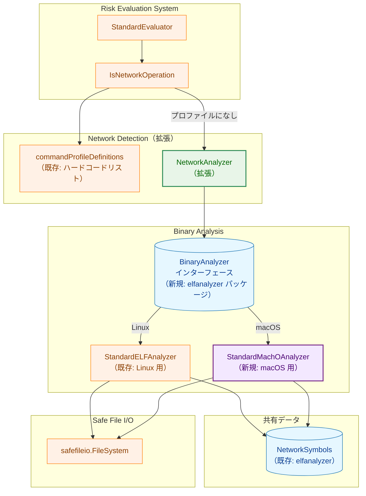
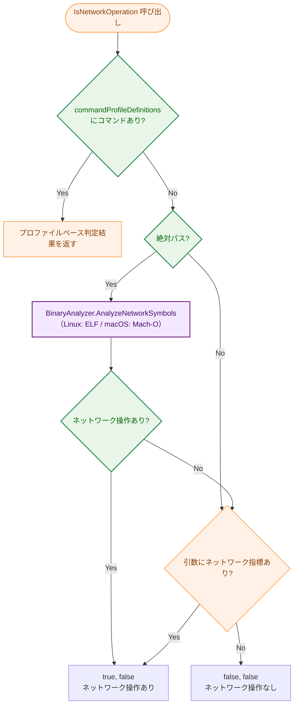
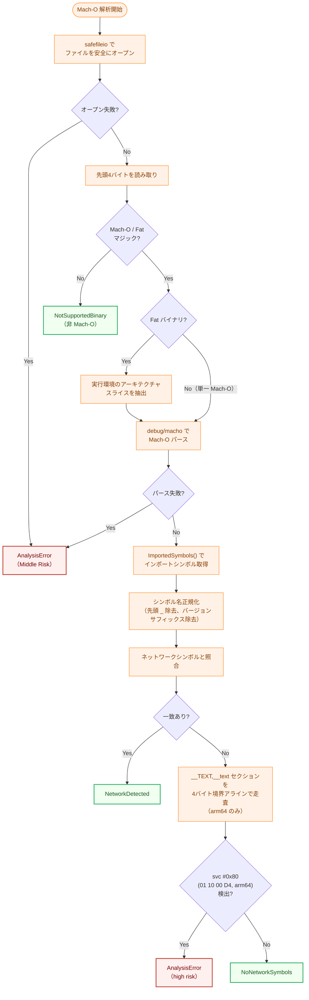
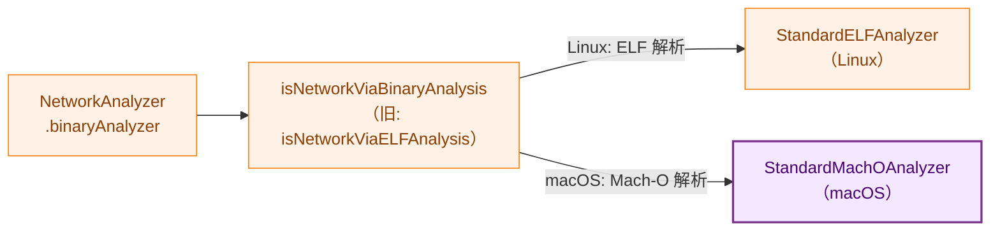
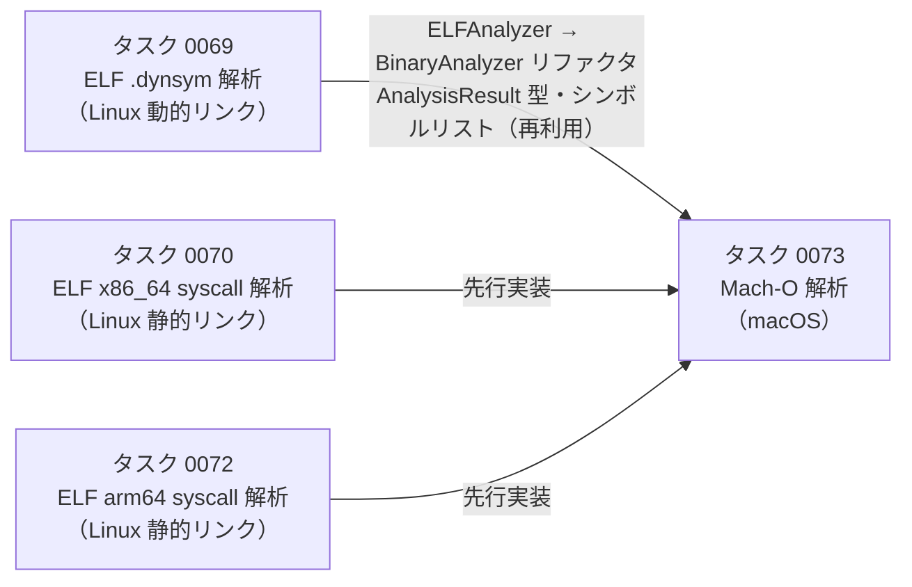

# Mach-O バイナリ解析によるネットワーク操作検出（macOS 対応）アーキテクチャ設計書

## 1. システム概要

### 1.1 目的

macOS（Darwin）上の Mach-O バイナリに対して `debug/macho` パッケージを使用してインポートシンボルを解析し、ネットワーク関連関数の有無を検出する。また、シンボル解析でネットワーク関連シンボルが検出されなかった場合に `svc #0x80` 命令の存在を確認し、high risk として判定する。

本タスクでは同時に `elfanalyzer.ELFAnalyzer` / `elfanalyzer.NotELFBinary` という ELF 固有命名の技術的負債を解消し、バイナリ形式に依存しない共通インターフェース `BinaryAnalyzer` と定数 `NotSupportedBinary` に直接リネームする。

### 1.2 設計原則

- **Security by Default**: 解析失敗時は安全側に倒し、ネットワーク操作の可能性ありとして扱う
- **Non-Breaking Change**: Linux 環境での ELF 解析（タスク 0069/0070/0072）の動作を変更しない
- **Zero External Dependencies**: Go 標準ライブラリ（`debug/macho`）のみを使用
- **DRY**: ELF 解析（タスク 0069）のシンボルリスト（`elfanalyzer.GetNetworkSymbols()`）を再利用する
- **Platform Isolation**: `runtime.GOOS` による実行プラットフォーム判定で解析器を選択する
- **Scope**: macOS 対象アーキテクチャは **arm64 のみ**。x86_64 Mach-O の解析は対象外
- **技術的負債の解消**: `ELFAnalyzer` / `NotELFBinary` の ELF 固有命名を `BinaryAnalyzer` / `NotSupportedBinary` に直接リネームする

## 2. システムアーキテクチャ

### 2.1 全体構成図



**凡例（Legend）**


### 2.2 コンポーネント構成

#### 2.2.1 新規追加コンポーネント

**ELF Analyzer パッケージの拡張** (`internal/runner/security/elfanalyzer/`)

| コンポーネント | 責務 |
|--------------|------|
| `BinaryAnalyzer` インターフェース | バイナリ形式に依存しないネットワーク解析の共通インターフェース |
| `NotSupportedBinary` 定数 | 「このアナライザーが対応しないバイナリ形式」を表す汎用定数 |

**Mach-O Analysis Package** (`internal/runner/security/machoanalyzer/`)

| コンポーネント | 責務 |
|--------------|------|
| `StandardMachOAnalyzer` | `BinaryAnalyzer` 実装：インポートシンボルからネットワークシンボルを検出 + `svc #0x80` 存在確認 |

#### 2.2.2 拡張コンポーネント

**Security Package** (`internal/runner/security/`)

| コンポーネント | 変更内容 |
|--------------|---------|
| `NetworkAnalyzer` | フィールドを `BinaryAnalyzer` に変更し、macOS 環境での Mach-O 解析フォールバックを追加 |

**ELF Analyzer パッケージ** (`internal/runner/security/elfanalyzer/`)

| コンポーネント | 変更内容 |
|--------------|---------|
| `ELFAnalyzer` → `BinaryAnalyzer` | インターフェースをリネーム |
| `NotELFBinary` → `NotSupportedBinary` | 定数をリネーム |
| `StandardELFAnalyzer` | `BinaryAnalyzer` インターフェースを実装（シグネチャは変更なし）|

### 2.3 パッケージ構成

```
internal/
└── runner/
    └── security/
        ├── network_analyzer.go              # NetworkAnalyzer の拡張（BinaryAnalyzer 化 + macOS フォールバック追加）
        ├── network_analyzer_test_helpers.go # NewNetworkAnalyzerWithELFAnalyzer → NewNetworkAnalyzerWithBinaryAnalyzer にリネーム
        ├── elfanalyzer/                     # 既存: ELF 解析パッケージ
        │   ├── analyzer.go                  # ELFAnalyzer → BinaryAnalyzer、NotELFBinary → NotSupportedBinary にリネーム
        │   └── ...                          # その他の参照箇所も一括更新
        └── machoanalyzer/                   # NEW: Mach-O 解析パッケージ
            ├── analyzer.go                  # StandardMachOAnalyzer の構造体定義・コンストラクタ
            ├── standard_analyzer.go         # AnalyzeNetworkSymbols 実装
            ├── symbol_normalizer.go         # シンボル名正規化
            └── analyzer_test.go             # ユニットテスト
```

## 3. インターフェース設計

### 3.1 BinaryAnalyzer インターフェース（elfanalyzer パッケージ）

`elfanalyzer.ELFAnalyzer` を `BinaryAnalyzer` にリネームする。`machoanalyzer` がこのインターフェースを実装することで、`NetworkAnalyzer` は単一の `BinaryAnalyzer` フィールドで ELF・Mach-O 両方を扱える。

```go
// BinaryAnalyzer defines the interface for binary network analysis,
// independent of the binary format (ELF, Mach-O, etc.).
type BinaryAnalyzer interface {
    // AnalyzeNetworkSymbols examines the binary at the given path
    // and determines if it contains network-related symbols.
    //
    // contentHash is the pre-computed hash in "algo:hex" format (e.g. "sha256:abc123...").
    // Pass an empty string when no pre-computed hash is available.
    //
    // Returns:
    //   - NetworkDetected: Binary contains network-related symbols
    //   - NoNetworkSymbols: Binary has no network-related symbols
    //   - NotSupportedBinary: File format is not supported by this analyzer
    //   - StaticBinary: Binary is statically linked (ELF-specific)
    //   - AnalysisError: An error occurred (check Error field)
    AnalyzeNetworkSymbols(path string, contentHash string) AnalysisOutput
}
```

### 3.2 NotSupportedBinary 定数（elfanalyzer パッケージ）

`NotELFBinary` を `NotSupportedBinary` にリネームする。

```go
const (
    NetworkDetected  AnalysisResult = iota
    NoNetworkSymbols
    // NotSupportedBinary indicates that the file format is not supported
    // by this analyzer (e.g., ELF analyzer receiving a Mach-O file,
    // or Mach-O analyzer receiving an ELF file).
    NotSupportedBinary
    StaticBinary
    AnalysisError
)
```

### 3.3 StandardMachOAnalyzer（machoanalyzer パッケージ）

```go
package machoanalyzer

// StandardMachOAnalyzer implements elfanalyzer.BinaryAnalyzer using Go's debug/macho package.
type StandardMachOAnalyzer struct {
    fs             safefileio.FileSystem
    networkSymbols map[string]elfanalyzer.SymbolCategory
}

// NewStandardMachOAnalyzer creates a new StandardMachOAnalyzer.
// If fs is nil, the default safefileio.FileSystem is used (same behavior as NewStandardELFAnalyzer).
// networkSymbols is obtained from elfanalyzer.GetNetworkSymbols() for DRY compliance.
func NewStandardMachOAnalyzer(fs safefileio.FileSystem) *StandardMachOAnalyzer

// AnalyzeNetworkSymbols implements elfanalyzer.BinaryAnalyzer.
//
// Returns:
//   - NetworkDetected: Binary imports network-related symbols
//   - NoNetworkSymbols: No network symbols and no svc #0x80
//   - NotSupportedBinary: File is not in Mach-O format (e.g., ELF, script)
//   - AnalysisError: Parse error, or svc #0x80 detected (high risk)
func (a *StandardMachOAnalyzer) AnalyzeNetworkSymbols(path string, contentHash string) elfanalyzer.AnalysisOutput
```

### 3.4 AnalysisResult の使用方針

Mach-O 解析では `elfanalyzer.AnalysisResult` の定数を次のように使用する：

| 定数 | Mach-O 解析での意味 |
|------|-------------------|
| `NetworkDetected` | インポートシンボルにネットワーク関連シンボルが存在 |
| `NoNetworkSymbols` | インポートシンボルにネットワーク関連シンボルなし、かつ `svc #0x80` なし |
| `NotSupportedBinary` | Mach-O 形式ではないファイル（ELF、スクリプト等） |
| `AnalysisError` | 解析エラー、または `svc #0x80` 検出（high risk） |

`StaticBinary` は使用しない（macOS バイナリは Go バイナリを含め `libSystem.dylib` にリンクするため静的バイナリが存在しない）。

## 4. データフロー

### 4.1 ネットワーク操作判定フロー（macOS）



### 4.2 Mach-O 解析詳細フロー



## 5. コンポーネント詳細設計

### 5.1 StandardMachOAnalyzer の実装

```go
// NewStandardMachOAnalyzer creates a new StandardMachOAnalyzer.
// If fs is nil, safefileio.NewFileSystem(safefileio.FileSystemConfig{}) is used as the default.
func NewStandardMachOAnalyzer(fs safefileio.FileSystem) *StandardMachOAnalyzer {
    if fs == nil {
        fs = safefileio.NewFileSystem(safefileio.FileSystemConfig{})
    }
    return &StandardMachOAnalyzer{
        fs:             fs,
        networkSymbols: elfanalyzer.GetNetworkSymbols(),
    }
}

// AnalyzeNetworkSymbols implements elfanalyzer.BinaryAnalyzer.
func (a *StandardMachOAnalyzer) AnalyzeNetworkSymbols(path string, contentHash string) elfanalyzer.AnalysisOutput {
    // 1. safefileio でファイルを安全にオープン
    // 2. 先頭バイトで Mach-O / Fat マジックを確認 → 非 Mach-O は NotSupportedBinary を返す
    // 3. Fat バイナリの場合: runtime.GOARCH に対応するスライスを抽出
    // 4. debug/macho.NewFile でパース
    // 5. ImportedSymbols() でインポートシンボルを取得し正規化
    // 6. ネットワーク関連シンボルと照合 → 一致あり: NetworkDetected を返す
    // 7. 照合なし → __TEXT,__text セクションで svc #0x80 を検索
    //    - 検出: AnalysisError (high risk) を返す
    //    - 未検出: NoNetworkSymbols を返す
}
```

### 5.2 シンボル名正規化

macOS の `ImportedSymbols()` が返すシンボル名には以下のバリエーションがある：

| 入力 | 正規化後 | 備考 |
|------|---------|------|
| `_socket` | `socket` | 先頭アンダースコアを除去 |
| `_socket$UNIX2003` | `socket` | バージョンサフィックスも除去 |
| `socket` | `socket` | 変換不要 |

```go
// normalizeSymbolName strips the leading underscore and version suffix
// (e.g., "$UNIX2003") from macOS imported symbol names.
func normalizeSymbolName(name string) string
```

### 5.3 Fat バイナリのスライス選択

```go
// selectMachOFromFat selects the appropriate arch slice from a Fat binary.
// Priority: runtime.GOARCH (current arch) > first available slice.
func selectMachOFromFat(fat *macho.FatFile) (*macho.File, error)
```

### 5.4 `svc #0x80` 検出

arm64 バイナリの `__TEXT,__text` セクションを走査し、`svc #0x80` 命令のバイトパターン（リトルエンディアン 4 バイト: `0x01 0x10 0x00 0xD4`）を検索する。

**エンコード根拠**: `svc #0x80` の ARM64 命令語は `0xD4001001`。リトルエンディアンで格納すると `01 10 00 D4`。

**x86_64 は対象外**: macOS のサポート対象アーキテクチャは arm64 のみ。x86_64 Mach-O の `svc #0x80` 相当命令（`syscall` = `0x0F 0x05`）は検索しない。

**arm64 の4バイトアラインスキャン**: arm64 命令は4バイト境界に整列するため、4バイト刻みでスキャンすることで処理速度を向上し、誤検知リスクをさらに低減する。実バイナリ（216,985命令）での計測で誤検知は0件。

```go
// containsSVCInstruction scans the __TEXT,__text section of an arm64 Mach-O
// for the svc #0x80 instruction (0xD4001001, little-endian: 01 10 00 D4).
// Uses 4-byte aligned scan, exploiting arm64 fixed-width instruction encoding.
// Returns false (no scan) for non-arm64 binaries.
func containsSVCInstruction(f *macho.File) bool
```

## 6. NetworkAnalyzer の拡張

### 6.1 フィールドの変更と解析器の選択

`NetworkAnalyzer` のフィールドを `elfanalyzer.ELFAnalyzer` から `elfanalyzer.BinaryAnalyzer` に変更する。`NewNetworkAnalyzer()` で `runtime.GOOS` に応じて適切なアナライザーを注入する。

```go
// NetworkAnalyzer provides network operation detection for commands.
type NetworkAnalyzer struct {
    binaryAnalyzer elfanalyzer.BinaryAnalyzer  // Linux: StandardELFAnalyzer, macOS: StandardMachOAnalyzer
}

func NewNetworkAnalyzer() *NetworkAnalyzer {
    var analyzer elfanalyzer.BinaryAnalyzer
    switch runtime.GOOS {
    case "darwin":
        analyzer = machoanalyzer.NewStandardMachOAnalyzer(nil)
    default: // "linux" etc.
        analyzer = elfanalyzer.NewStandardELFAnalyzer(nil, nil)
    }
    return &NetworkAnalyzer{binaryAnalyzer: analyzer}
}
```

### 6.2 テストヘルパーの変更

`network_analyzer_test_helpers.go` の `NewNetworkAnalyzerWithELFAnalyzer` を `NewNetworkAnalyzerWithBinaryAnalyzer` にリネームする。呼び出し側のテストコードも合わせて更新する。

```go
// NewNetworkAnalyzerWithBinaryAnalyzer creates a NetworkAnalyzer with a custom BinaryAnalyzer.
// This function is only available in test builds.
func NewNetworkAnalyzerWithBinaryAnalyzer(analyzer elfanalyzer.BinaryAnalyzer) *NetworkAnalyzer {
    return &NetworkAnalyzer{binaryAnalyzer: analyzer}
}
```

### 6.3 isNetworkViaBinaryAnalysis の統合

既存の `isNetworkViaELFAnalysis` メソッドを `isNetworkViaBinaryAnalysis` に名称変更し、`NotSupportedBinary` の case 文のコメントを更新する。



## 7. セキュリティ考慮事項

### 7.1 ファイル読み取りの安全性

`safefileio.FileSystem.SafeOpenFile` を使用してシンボリックリンク攻撃・TOCTOU 競合を防止する（ELF 解析と同様）。

### 7.2 不正な Mach-O ファイルへの耐性

Go 標準ライブラリ `debug/macho` の安全性に依存する。パースエラー時はパニックせず `AnalysisError` を返す。

### 7.3 `svc #0x80` 検出の意義

正規の macOS バイナリ（Go・C いずれも）は `libSystem.dylib` 経由でシステムコールを発行するため、機械語中に `svc #0x80` が直接現れることはない。`svc #0x80` の存在は `libSystem.dylib` を迂回した直接 syscall であり、難読化・マルウェア的なバイナリの可能性を示す。

## 8. パフォーマンス特性

### 8.1 解析の軽量性

- **インポートシンボル取得**: `debug/macho.ImportedSymbols()` は `__TEXT,__stubs` セクションと dyld 情報のみを読み取る
- **`svc #0x80` スキャン**: シンボル解析でネットワーク関連シンボルが検出されなかった場合のみ実行（シンボルが検出された場合はスキャンしない）
- **事前キャッシュなし**: タスク 0069 の ELF 解析と同様に実行時毎回解析する（十分に軽量）

## 9. 既知の限界と将来タスク

### 9.1 間接的なネットワーク使用の検出不能

本設計の `ImportedSymbols()` ベースの解析は、**実行ファイル自身のインポートテーブル**のみを検査する。動的ライブラリ（`.dylib`）がネットワーク関連シンボルを呼び出す場合、実行ファイルのインポートテーブルには当該シンボルが現れないため検出できない。

```
【検出できるケース】
実行ファイル --import--> socket()

【検出できないケース】
実行ファイル --import--> libfoo.dylib --import--> socket()
```

同様に、`svc #0x80` スキャンは実行ファイルの `__TEXT,__text` セクションのみを対象とし、動的ライブラリのコードセクションはスキャンしない。

**影響範囲**: 自身では直接ネットワーク関連シンボルをインポートしないが、ネットワーク機能を持つ動的ライブラリに依存する実行ファイルは `NoNetworkSymbols` と判定される（偽陰性）。

**現設計での緩和策**: `commandProfileDefinitions` によるハードコードリストと引数チェックが一次・二次防衛として機能する。これらの層で捕捉できない未知コマンドのみが本解析のフォールバック対象となる。

### 9.2 将来タスク: 依存ライブラリの再帰的解析

間接的なネットワーク使用を検出するために、将来タスクとして以下の実装を検討する：

- **`otool -L` / `debug/macho` による依存ライブラリの列挙**: 実行ファイルがリンクする `.dylib` のパスを取得し、各ライブラリのインポートシンボルを再帰的に解析する
- **解析深度の制限**: ライブラリ依存チェーンは循環する可能性があるため、最大探索深度（例: 3 段）を設ける
- **既知システムライブラリのスキップ**: `libSystem.dylib`, `libc.dylib` 等は全てのバイナリが依存するため、ホワイトリストでスキップする

この機能拡張は独立したタスクとして実装し、本タスクのスコープ外とする。

## 10. エラーハンドリング

### 10.1 エラー分類と対応

| エラー種別 | 発生条件 | AnalysisResult | リスク判定 |
|-----------|---------|---------------|-----------|
| ファイル読み取りエラー | 権限不足、シンボリックリンク等 | `AnalysisError` | Middle Risk（安全側） |
| 非 Mach-O ファイル | マジックナンバー不一致 | `NotSupportedBinary` | 既存ロジックに委ねる |
| Mach-O パースエラー | 不正なフォーマット | `AnalysisError` | Middle Risk（安全側） |
| Fat スライス抽出失敗 | 対応アーキテクチャなし | `AnalysisError` | Middle Risk（安全側） |
| `svc #0x80` 検出（arm64 のみ） | 直接 syscall の存在 | `AnalysisError` | High Risk |

### 10.2 NotSupportedBinary の処理

`isNetworkViaBinaryAnalysis` の `case NotSupportedBinary:` では「このアナライザーが解析できないバイナリ形式なので、ネットワーク操作なしと仮定」として扱う。ELF アナライザーが Mach-O ファイルを受け取った場合も、Mach-O アナライザーが ELF ファイルを受け取った場合も同じロジックを通る。

## 11. テスト戦略

### 11.1 テストフィクスチャ

```
internal/runner/security/machoanalyzer/
└── testdata/
    ├── network_macho_arm64      # socket 等をインポートする arm64 Mach-O
    ├── no_network_macho_arm64   # ネットワークシンボルなしの arm64 Mach-O
    ├── svc_only_arm64           # svc #0x80 のみ（シンボルなし）の arm64 バイナリ
    ├── fat_binary               # arm64 + x86_64 Fat バイナリ
    ├── network_go_macho_arm64   # net パッケージを使用する Go バイナリ（arm64）
    ├── no_network_go_arm64      # ネットワーク操作なし Go バイナリ（arm64）
    └── script.sh                # 非 Mach-O ファイル
```

**フィクスチャの用意方針**: macOS SDK がない Linux 環境でのクロスコンパイルは困難なため、実際のフィクスチャバイナリをリポジトリに含める。テスト用 Go バイナリは macOS 環境でビルドしてコミットする。

### 11.2 テストケース一覧

| テストケース | 期待結果 | 対応受け入れ条件 |
|-------------|---------|---------------|
| ネットワーク関連シンボルを含む Mach-O（arm64） | `NetworkDetected` | AC-1, AC-2 |
| ネットワーク関連シンボルを含まない Mach-O（arm64） | `NoNetworkSymbols` | AC-1, AC-2 |
| ネットワーク関連シンボルなし + `svc #0x80` あり（arm64） | `AnalysisError`（high risk）| AC-6 |
| ネットワーク関連シンボルあり + `svc #0x80` あり（arm64） | `NetworkDetected`（シンボル優先） | AC-6 |
| Fat バイナリ（arm64 + x86_64） | アーキテクチャ対応スライスで判定 | AC-1 |
| `net` パッケージを使用する Go バイナリ | `NetworkDetected` | AC-3 |
| ネットワーク操作なし Go バイナリ | `NoNetworkSymbols` | AC-3 |
| 非 Mach-O ファイル（ELF、スクリプト） | `NotSupportedBinary` | AC-1 |
| 不正な Mach-O ファイル | `AnalysisError`（パニックしない） | AC-5 |

### 11.3 要件書との差分

FR-3.1.5 の実装上の注記には2点の誤りがある。設計書の記述を正とする。

| 項目 | 要件書の記述 | 設計書での変更 | 根拠 |
|-----|------------|-------------|------|
| `svc #0x80` の LE バイト列 | `01 80 00 D4` | `01 10 00 D4` | `0xD4001001` を LE で並べると `01 10 00 D4`。実アセンブルで確認済み |
| x86_64 の `syscall` (`0x0F 0x05`) 検索 | 検索対象とする | 省略（対応外） | macOS のサポート対象は arm64 のみ。加えて `0x0F 0x05` は2バイトと短く誤検知が発生する（実バイナリで確認済み） |

### 11.4 既存テストへの影響

`ELFAnalyzer` / `NotELFBinary` を参照する既存コードは全てリネーム対象となる。変更が必要なファイルは以下の通り：

| ファイル | 変更内容 |
|--------|--------|
| `elfanalyzer/analyzer.go` | `ELFAnalyzer` → `BinaryAnalyzer`、`NotELFBinary` → `NotSupportedBinary` |
| `elfanalyzer/standard_analyzer.go` | `NotELFBinary` → `NotSupportedBinary` |
| `elfanalyzer/analyzer_test.go` | `NotELFBinary` → `NotSupportedBinary` |
| `security/network_analyzer.go` | `elfAnalyzer ELFAnalyzer` → `binaryAnalyzer BinaryAnalyzer`、`isNetworkViaELFAnalysis` → `isNetworkViaBinaryAnalysis`、`NotELFBinary` → `NotSupportedBinary` |
| `security/network_analyzer_test_helpers.go` | `NewNetworkAnalyzerWithELFAnalyzer` → `NewNetworkAnalyzerWithBinaryAnalyzer` |
| `security/command_analysis_test.go` | `mockELFAnalyzer` → `mockBinaryAnalyzer`、`NewNetworkAnalyzerWithELFAnalyzer` → `NewNetworkAnalyzerWithBinaryAnalyzer`、`NotELFBinary` → `NotSupportedBinary` |

### 11.5 統合テスト

macOS 環境でのみ実行する統合テストを `runtime.GOOS != "darwin"` の場合はスキップするよう実装する。

## 12. 段階的実装計画

### Phase 1: elfanalyzer パッケージのリファクタリング

- [ ] `analyzer.go`: `ELFAnalyzer` → `BinaryAnalyzer` にリネーム
- [ ] `analyzer.go`: `NotELFBinary` → `NotSupportedBinary` にリネーム
- [ ] `standard_analyzer.go`: `NotELFBinary` → `NotSupportedBinary` に更新
- [ ] `network_analyzer.go`: `elfAnalyzer` フィールド → `binaryAnalyzer`、`isNetworkViaELFAnalysis` → `isNetworkViaBinaryAnalysis`、`NotELFBinary` → `NotSupportedBinary` に更新
- [ ] `network_analyzer_test_helpers.go`: `NewNetworkAnalyzerWithELFAnalyzer` → `NewNetworkAnalyzerWithBinaryAnalyzer` にリネーム
- [ ] `command_analysis_test.go`: `mockELFAnalyzer` → `mockBinaryAnalyzer`、関連箇所を一括更新
- [ ] 全テストがパスすることを確認

### Phase 2: machoanalyzer パッケージの新規作成

- [ ] `internal/runner/security/machoanalyzer/` ディレクトリ作成
- [ ] `analyzer.go`: `StandardMachOAnalyzer` の構造体定義・コンストラクタ
- [ ] `standard_analyzer.go`: Mach-O 判定、インポートシンボル解析の実装
- [ ] `symbol_normalizer.go`: シンボル名正規化関数の実装
- [ ] ユニットテストの作成

### Phase 3: `svc #0x80` 検出の実装

- [ ] `standard_analyzer.go` に `svc #0x80` / `syscall` バイトパターン検索を追加
- [ ] テストフィクスチャの用意（`svc #0x80` を含むバイナリ）
- [ ] テストケースの実装

### Phase 4: NetworkAnalyzer への統合

- [ ] `network_analyzer.go` のフィールドを `binaryAnalyzer elfanalyzer.BinaryAnalyzer` に変更
- [ ] `NewNetworkAnalyzer()` に `runtime.GOOS` による解析器選択を追加
- [ ] `isNetworkViaELFAnalysis` を `isNetworkViaBinaryAnalysis` にリネーム、`NotSupportedBinary` の case 文コメントを更新
- [ ] `network_analyzer_test_helpers.go` に `NewNetworkAnalyzerWithBinaryAnalyzer` を追加（後方互換関数も維持）
- [ ] macOS 環境での統合テスト作成
- [ ] Linux 環境での既存テストが引き続きパスすることを確認

### Phase 5: テストフィクスチャとドキュメント

- [ ] テスト用 Mach-O バイナリのビルドとコミット（macOS 環境で実施）
- [ ] Fat バイナリの作成（`lipo` コマンド使用）
- [ ] `testdata/` の整備

## 13. 先行タスクとの関係

### 13.1 タスク依存関係



### 13.2 コードの再利用

| 再利用元 | 再利用内容 |
|---------|----------|
| `elfanalyzer.BinaryAnalyzer` | 共通インターフェース（新規、本タスクで導入） |
| `elfanalyzer.AnalysisResult` | 結果定数（`NetworkDetected` 等） |
| `elfanalyzer.AnalysisOutput` | 解析結果構造体 |
| `elfanalyzer.DetectedSymbol` | 検出シンボル情報 |
| `elfanalyzer.GetNetworkSymbols()` | ネットワーク関連シンボルリスト |
| `elfanalyzer.SymbolCategory` | シンボルカテゴリ型 |
| `safefileio.FileSystem` | 安全なファイル読み取り |

### 13.3 リネーム一覧

| 旧名称 | 新名称 |
|-------|-------|
| `elfanalyzer.ELFAnalyzer` | `elfanalyzer.BinaryAnalyzer` |
| `elfanalyzer.NotELFBinary` | `elfanalyzer.NotSupportedBinary` |
| `NetworkAnalyzer.elfAnalyzer` フィールド | `NetworkAnalyzer.binaryAnalyzer` |
| `isNetworkViaELFAnalysis` | `isNetworkViaBinaryAnalysis` |
| `NewNetworkAnalyzerWithELFAnalyzer` | `NewNetworkAnalyzerWithBinaryAnalyzer` |
| `mockELFAnalyzer`（テスト内） | `mockBinaryAnalyzer` |
